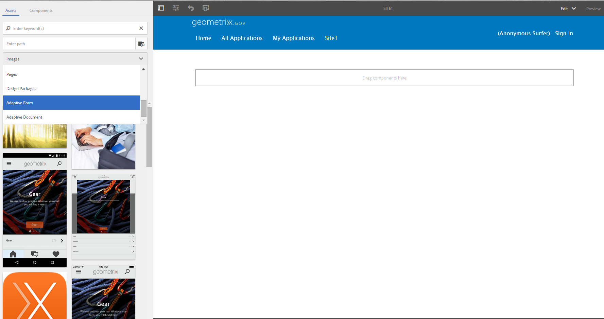

# 使用一組最適化表單建立最適化表單{#create-an-adaptive-form-using-a-set-of-adaptive-forms}

## 總覽 {#overview}

在工作流程（例如開立銀行帳戶的應用程式）中，您的使用者會填入多份表單。 您可以將表單堆疊在一起並建立大型表單（父表單），而不要求他們填寫一組表單。 將最適化表單新增至較大的表單時，會將其新增為面板（子表單）。 添加一組子表單以建立父表單。 您可以根據使用者輸入來顯示或隱藏面板。 父表單的按鈕（如提交和重置）覆蓋子表單的按鈕。 若要在父表單中新增最適化表單，您可以從資產瀏覽器拖放最適化表單（如最適化表單片段）。

可用功能包括：

* 獨立製作
* 顯示/隱藏適當的表單
* 延遲載入

與使用個別元件來建立父表單相比，獨立製作和延遲載入等功能可提供效能改善。

>[!NOTE]
>
>您無法使用XFA型適用性表單/片段作為子表單或父表單。

## 幕後 {#behind-the-scenes}

您可以在父表單中新增XSD式最適化表單和片段。 父表單的結構與 [任何最適化表單](../../forms/using/prepopulate-adaptive-form-fields.md). 將適用性表單新增為子表單時，會將其新增為父表單中的面板。 綁定子表單的資料儲存在 `data`根 `afBoundData` 父表單的XML架構的區段。

例如，您的客戶會填寫應用程式表單。 表單的前兩個欄位是名稱和身分。 其XML為：

```xml
<afData>
    <afUnboundData>
        <data />
    </afUnboundData>
    <afBoundData>
        <data xmlns:xfa="https://www.xfa.org/schema/xfa-data/1.0/">
            <applicantName>Sarah Rose</applicantName>
            <applicantId>1234</applicantId>
        </data>
    </afBoundData>
</afData>
```

您可在應用程式中新增另一個表單，讓客戶填寫其辦公室地址。 子表單的架構根為 `officeAddress`. 套用 `bindref` `/application/officeAddress` 或 `/officeAddress`. 若 `bindref`未提供，則子表單會新增為 `officeAddress` 子樹。 請參閱下面的表單XML:

```xml
<afData>
    <afUnboundData>
        <data />
    </afUnboundData>
    <afBoundData>
        <data xmlns:xfa="https://www.xfa.org/schema/xfa-data/1.0/">
            <applicantName>Sarah Rose</applicantName>
            <applicantId>1234</applicantId>
            <officeAddress>
                <addressLine>1, Geometrixx City</addressLine>
                <zip>11111</zip>
            </officeAddress>
        </data>
    </afBoundData>
</afData>
```

如果您插入另一個可讓客戶提供住址的表單，請套用 `bindref` `/application/houseAddress or /houseAddress.`XML看起來像：

```xml
<afData>
    <afUnboundData>
        <data />
    </afUnboundData>
    <afBoundData>
        <data xmlns:xfa="https://www.xfa.org/schema/xfa-data/1.0/">
            <applicantName>Sarah Rose</applicantName>
            <applicantId>1234</applicantId>
            <officeAddress>
                <addressLine>1, Geometrixx City</addressLine>
                <zip>11111</zip>
            </officeAddress>
            <houseAddress>
                <addressLine>2, Geometrixx City</addressLine>
                <zip>11111</zip>
            </houseAddress>
        </data>
    </afBoundData>
</afData>
```

如果要保留與架構根( `Address`在此示例中)，請使用索引bindref。

例如，應用bindref `/application/address[1]` 或 `/address[1]` 和 `/application/address[2]` 或 `/address[2]`. 表單的XML為：

```xml
<afData>
    <afUnboundData>
        <data />
    </afUnboundData>
    <afBoundData>
        <data xmlns:xfa="https://www.xfa.org/schema/xfa-data/1.0/">
            <applicantName>Sarah Rose</applicantName>
            <applicantId>1234</applicantId>
            <address>
                <addressLine>1, Geometrixx City</addressLine>
                <zip>11111</zip>
            </address>
            <address>
                <addressLine>2, Geometrixx City</addressLine>
                <zip>11111</zip>
            </address>
        </data>
    </afBoundData>
</afData>
```

您可以使用 `bindRef` 屬性。 此 `bindRef` 屬性可以指定指向XML架構樹結構中某個位置的路徑。

如果子窗體解除綁定，則其資料儲存在 `data`根 `afUnboundData` 父表單的XML架構的區段。

您可以將適用性表單新增為子表單多次。 確保 `bindRef` 已正確修改，以便最適化表單的每個使用例項指向資料根底下的不同子根。

>[!NOTE]
>
>如果不同的表單/片段對應至相同的子根，則資料會遭到覆寫。

## 使用資產瀏覽器將適用性表單新增為子表單 {#adding-an-adaptive-form-as-a-child-form-using-asset-browser}

執行下列步驟，使用資產瀏覽器將最適化表單新增為子表單。

1. 在編輯模式中開啟父表單。
1. 在側欄中，按一下 **資產** . 在「資產」下，選取 **適用性表單** 從下拉式清單中。
   [ ](assets/asset-1.png)

1. 拖放您要新增為子表單的最適化表單。
   [ ](assets/drag-drop-1.png)您放置的最適化表單會新增為子表單。
