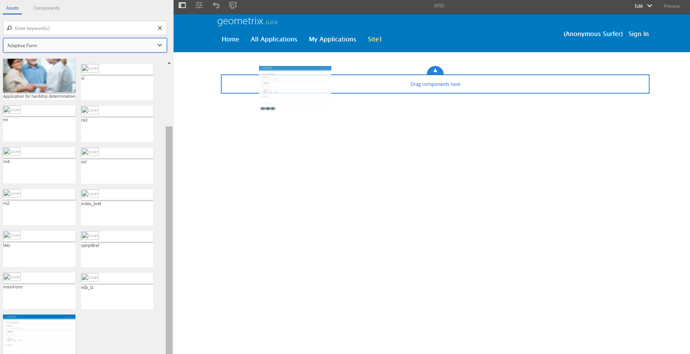

# 使用一組自適應表單建立自適應表單{#create-an-adaptive-form-using-a-set-of-adaptive-forms}

## 概觀 {#overview}

在工作流中，您的用戶會填寫多個表單。 您不必要求他們填寫一組表單，而是可以將表單堆疊在一起並構建一個大型表單（父表單）。 將自適應表單添加到較大表單時，它將作為面板（子表單）添加。 添加一組子表單以建立父表單。 您可以根據用戶輸入顯示或隱藏面板。 父表單的按鈕（如提交和重置）將覆蓋子表單的按鈕。 要在父窗體中添加自適應窗體，可以從資產瀏覽器拖放自適應窗體（如自適應窗體片段）。

可用功能包括：

* 獨立創作
* 顯示/隱藏適當的窗體
* 延遲載入

與使用單個元件建立父表單相比，獨立創作和懶散載入等功能提供了效能改進。

>[!NOTE]
>
>不能將基於XFA的自適應表單/片段用作子表單或父表單。

## 幕後 {#behind-the-scenes}

可以在父表單中添加基於XSD的自適應表單和片段。 父窗體的結構與 [任何自適應形式](../../forms/using/prepopulate-adaptive-form-fields.md)。 當將自適應表單添加為子表單時，它將作為面板添加到父表單中。 綁定子窗體的資料儲存在 `data`根 `afBoundData` 父窗體的XML架構的部分。

例如，您的客戶會填寫申請表。 表單的前兩個欄位是名稱和標識。 其XML為：

```xml
<afData>
    <afUnboundData>
        <data />
    </afUnboundData>
    <afBoundData>
        <data xmlns:xfa="https://www.xfa.org/schema/xfa-data/1.0/">
            <applicantName>Sarah Rose</applicantName>
            <applicantId>1234</applicantId>
        </data>
    </afBoundData>
</afData>
```

您可以在應用程式中添加另一個表單，讓客戶填寫其辦公地址。 子窗體的架構根為 `officeAddress`。 應用 `bindref` `/application/officeAddress` 或 `/officeAddress`。 如果 `bindref`未提供，則子窗體將作為 `officeAddress` 子樹。 請參閱下面的表單的XML:

```xml
<afData>
    <afUnboundData>
        <data />
    </afUnboundData>
    <afBoundData>
        <data xmlns:xfa="https://www.xfa.org/schema/xfa-data/1.0/">
            <applicantName>Sarah Rose</applicantName>
            <applicantId>1234</applicantId>
            <officeAddress>
                <addressLine>1, Geometrixx City</addressLine>
                <zip>11111</zip>
            </officeAddress>
        </data>
    </afBoundData>
</afData>
```

如果您插入了另一個允許客戶提供住宅地址的表單，請應用 `bindref` `/application/houseAddress or /houseAddress.`XML看起來如下：

```xml
<afData>
    <afUnboundData>
        <data />
    </afUnboundData>
    <afBoundData>
        <data xmlns:xfa="https://www.xfa.org/schema/xfa-data/1.0/">
            <applicantName>Sarah Rose</applicantName>
            <applicantId>1234</applicantId>
            <officeAddress>
                <addressLine>1, Geometrixx City</addressLine>
                <zip>11111</zip>
            </officeAddress>
            <houseAddress>
                <addressLine>2, Geometrixx City</addressLine>
                <zip>11111</zip>
            </houseAddress>
        </data>
    </afBoundData>
</afData>
```

如果要保留與架構根相同的子根名稱( `Address`在本示例中)，使用索引bindrefs。

例如，應用bindrefs `/application/address[1]` 或 `/address[1]` 和 `/application/address[2]` 或 `/address[2]`。 表單的XML為：

```xml
<afData>
    <afUnboundData>
        <data />
    </afUnboundData>
    <afBoundData>
        <data xmlns:xfa="https://www.xfa.org/schema/xfa-data/1.0/">
            <applicantName>Sarah Rose</applicantName>
            <applicantId>1234</applicantId>
            <address>
                <addressLine>1, Geometrixx City</addressLine>
                <zip>11111</zip>
            </address>
            <address>
                <addressLine>2, Geometrixx City</addressLine>
                <zip>11111</zip>
            </address>
        </data>
    </afBoundData>
</afData>
```

可以使用 `bindRef` 屬性。 的 `bindRef` 屬性用於指定指向XML架構樹結構中某個位置的路徑。

如果子窗體未綁定，則其資料儲存在 `data`根 `afUnboundData` 父窗體的XML架構的部分。

可以多次將自適應表單添加為子表單。 確保 `bindRef` 正確修改，以便自適應表單的每個使用實例指向資料根下的不同子根。

>[!NOTE]
>
>如果不同的表單/片段被映射到同一子根，則資料將被覆蓋。

## 使用資產瀏覽器將自適應表單添加為子表單 {#adding-an-adaptive-form-as-a-child-form-using-asset-browser}

執行以下步驟，使用資產瀏覽器將自適應表單添加為子表單。

1. 在編輯模式下開啟父窗體。
1. 在提要欄中，按一下 **資產** 。 在「資產」下，選擇 **自適應窗體** 從下拉清單中。
   [ ](assets/asset-1.png)

1. 拖放要作為子窗體添加的自適應窗體。
   [ ](assets/drag-drop-1.png)您刪除的自適應表單將作為子表單添加。
