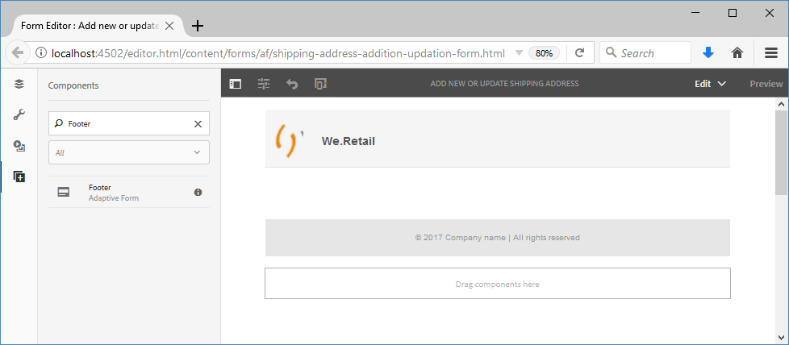

# 教學課程：建立最適化表單{#do-not-publish-tutorial-create-an-adaptive-form}

本教程是[建立第一個自適應表單](/help/forms/using/create-your-first-adaptive-form.md)系列中的一個步驟。 建議依序依序依序排列，以瞭解、執行和展示完整的教學課程使用案例。

## 關於教學課程{#about-the-tutorial}

最適化表單是新一代的動態回應表單。 您可以使用最適化表單來提供個人化體驗。 您也可以將最適化表單與[!DNL Adobe Analytics]整合，以取得使用統計資料，並將[!DNL Adobe Campaign]整合，以管理促銷活動。 有關最適化表單功能的詳細資訊，請參閱[製作最適化表單簡介](/help/forms/using/introduction-forms-authoring.md)。

當遵循適當的程式時，建立和管理表格會更輕鬆。 在本文中，您將學習如何：

* [建立可讓客戶新增送貨地址的最適化表單](/help/forms/using/create-adaptive-form.md#step-create-the-adaptive-form)

* [顯示並接受客戶資訊的最適化表單的版面欄位](/help/forms/using/create-adaptive-form.md#step-add-header-and-footer)

* [建立提交動作以傳送包含表單內容的電子郵件](/help/forms/using/create-adaptive-form.md#step-add-components-to-capture-and-display-information)
* [預覽並送出最適化表單](/help/forms/using/create-adaptive-form.md)

在文章結尾處，您會有類似下列的表格：\

## 步驟1:建立最適化表單{#step-create-the-adaptive-form}

1. 登入作AEM者例項並導覽至&#x200B;**[!UICONTROL Adobe Experience Manager]** > **[!UICONTROL Forms]** > **[!UICONTROL Forms與檔案]**。 預設URL為[http://localhost:4502/aem/forms.html/content/dam/formsanddocuments](http://localhost:4502/aem/forms.html/content/dam/formsanddocuments)。
1. 點選「**[!UICONTROL 建立]**」並選取「最適化表單」。 ****&#x200B;此時會出現選擇範本的選項。 點選&#x200B;**[!UICONTROL Blank]**&#x200B;範本以選取範本，然後點選&#x200B;**[!UICONTROL Next]**。

1. 將顯示&#x200B;**[!UICONTROL 添加屬性]**&#x200B;的選項。 **[!UICONTROL Title]**&#x200B;和&#x200B;**[!UICONTROL Name]**&#x200B;欄位是必填欄位：

   * **標題：在** 標題欄 `Add new or update shipping address` 位中 **** 指定。標題欄位會指定表單的顯示名稱。 標題可協助您識別[!DNL Forms]使AEM用者介面中的表單。
   * **名稱：在** 「名 `shipping-address-add-update-form` 稱」欄 **** 位中指定。「名稱」欄位指定表單的名稱。 在儲存庫中建立具有指定名稱的節點。 當您開始輸入標題時，系統會自動產生名稱欄位的值。 您可以變更建議的值。 名稱欄位只能包含英數字元、連字型大小和底線。 所有無效輸入都會以連字型大小取代。

1. 點選&#x200B;**[!UICONTROL Create]**。 會建立最適化表單，並出現對話方塊以開啟表單以供編輯。 點選「**[!UICONTROL 開啟]**」，在新標籤中開啟新建立的表格。 表格隨即開啟以供編輯。 它還顯示邊欄，以根據需求自訂新建立的表格。

   有關最適化表單製作介面和可用元件的資訊，請參閱[製作最適化表單簡介](/help/forms/using/creating-adaptive-form.md)。

   

## 步驟2:新增頁首和頁尾{#step-add-header-and-footer}

AEM[!DNL Forms]提供許多元件以顯示自適應表單的資訊。 頁首和頁尾元件有助於為表單提供一致的外觀和感覺。 標題通常包含公司的標誌、表單標題和摘要。 頁尾通常包含版權資訊和其他頁面的連結。

1. 點選 > 。 元件瀏覽器隨即開啟。 將&#x200B;**[!UICONTROL Header]**&#x200B;元件從元件瀏覽器拖曳至最適化表單。
1. 點選&#x200B;**[!UICONTROL Logo]**。 工具列隨即出現。 點選工具列上的，輸入&#x200B;**We.Retail**，然後點選。

1. 點選「影像」。 工具列隨即出現。 點選。 屬性瀏覽器會在畫面左側開啟。 **[!UICONTROL 瀏]** 覽及上傳標誌影像。點選。 影像會出現在頁首上。

   如果您沒有標誌，可以點選「取得檔案」下載本文中使用的標誌。

   [取得檔案](assets/logo.png)

1. 將&#x200B;**[!UICONTROL Footer]**&#x200B;元件從拖曳至最適化表單。 在此階段，表單如下所示：

   

## 步驟3:新增元件以擷取和顯示資訊{#step-add-components-to-capture-and-display-information}

元件是自適應形式的構建塊。 AEM[!DNL Forms]提供許多元件，以自適應形式擷取和顯示資訊。 您可以將元件從拖動到表單中。 要瞭解可用的元件和相應的功能，請參閱[製作最適化表單的簡介](/help/forms/using/introduction-forms-authoring.md)。

1. 將&#x200B;**[!UICONTROL 數值框元件]**&#x200B;拖動到自適應表單。 將它置於頁尾元件之前。 開啟元件的屬性，將元件的&#x200B;**[!UICONTROL Title]**&#x200B;變更為&#x200B;**`Customer ID`**，將&#x200B;**[!UICONTROL 元素名稱]**&#x200B;變更為&#x200B;**`customer_ID`**，啟用&#x200B;**[!UICONTROL 必要欄位]**&#x200B;選項，啟用&#x200B;**[!UICONTROL 使用HTML5數字輸入類型]**&#x200B;選項，然後點選。
1. 將三個文本框元件拖動到最適化表單。 將這些項目置於頁尾元件之前。 為這些文本框設定以下屬性。:

   <table> 
    <tbody> 
     <tr> 
      <td><b>屬性</b></td> 
      <td><b>文字方塊1 </b></td> 
      <td><b>文字方塊2 </b></td> 
      <td><b>文字方塊3</b></td> 
     </tr> 
     <tr> 
      <td>標題</td> 
      <td>名稱  </td> 
      <td>送貨地址</td> 
      <td>狀態</td> 
     </tr> 
     <tr> 
      <td>元素名稱</td> 
      <td>customer_Name  </td> 
      <td>customer_Shipping_Address</td> 
      <td>customer_state</td> 
     </tr> 
     <tr> 
      <td>必填欄位</td> 
      <td>已啟用</td> 
      <td>已啟用</td> 
      <td>已啟用</td> 
     </tr> 
     <tr> 
      <td>允許多行  </td> 
      <td>停用</td> 
      <td>已啟用</td> 
      <td>停用</td> 
     </tr> 
    </tbody> 
   </table>

1. 將&#x200B;**[!UICONTROL 數值方塊]**&#x200B;元件拖曳至頁尾元件之前。 開啟元件的屬性，設定下表所列的值，點選。

   | 屬性 | 值 |
   |---|---|
   | 標題 | 郵遞區號 |
   | 元素名稱 | customer_ZIPCode |
   | 數字數量上限 | 6 |
   | 必填欄位 | 已啟用 |
   | 顯示模式類型 | 無模式 |

1. 將&#x200B;**[!UICONTROL Email]**&#x200B;元件拖曳至頁尾元件之前。 開啟元件的屬性，設定下表中所列的值，然後點選。

   | 屬性 | 值 |
   |---|---|
   | 標題 | 電子郵件 |
   | 元素名稱 | customer_Email |
   | 必填欄位 | 已啟用 |

1. 將&#x200B;**[!UICONTROL 檔案附件]**&#x200B;元件拖動到腳注元件之前。 開啟元件的屬性，設定下表中所列的值，然後點選。

   <table> 
    <tbody> 
     <tr> 
      <td><b>屬性</b></td> 
      <td><b>值</b></td> 
     </tr> 
     <tr> 
      <td>標題</td> 
      <td>政府批准的地址證明  </td> 
     </tr> 
     <tr> 
      <td>元素名稱</td> 
      <td>customer_Address_Proof</td> 
     </tr> 
     <tr> 
      <td>必填欄位</td> 
      <td>已啟用</td> 
     </tr> 
    </tbody> 
   </table>

1. 將&#x200B;**[!UICONTROL 提交按鈕]**&#x200B;元件拖動到自適應表單。 將它置於頁尾元件之前。 開啟元件的屬性，將「元素名稱」變更為`address_addition_update_submit`，點選。 表單的版面配置已完成，表單外觀如下：

   

## 步驟4:為最適化表單{#step-configure-submit-action-for-the-adaptive-form}配置提交操作

當使用者點選最適化表單上的「提交」按鈕時，會觸發提交動作。 您可以使用提交操作將表單資料保存到本地儲存庫、將表單資料發送到REST端點、以電子郵件形式發送表單資料等。 最適化表單提供一些現成可用的提交動作。 如需詳細資訊，請參閱[設定提交動作](/help/forms/using/configuring-submit-actions.md)。

使用下列步驟，您可以設定表單的電子郵件提交動作和示範提交動作：

1. 配置電子郵件伺服器。 如需詳細資訊，請參閱[設定電子郵件通知](/help/sites-administering/notification.md)。

1. 在「內容」瀏覽器中點選「**[!UICONTROL 表單容器]**」，然後點選「」。 屬性瀏覽器會在左側開啟。
1. 前往&#x200B;**[!UICONTROL Submission]** > **[!UICONTROL Submit Action]**。 選擇&#x200B;**[!UICONTROL 發送電子郵件]**。 指定下列值，然後點選。

   | 屬性 | 值 |
   |--- |--- |
   | 從 | `donotreply@weretail.com` |
   | 至 | `${customer_Email}` |
   | 主旨 | 確認：您已在We.Retail網站上新增送貨地址。 |
   | 電子郵件範本 | `${customer_Name}`大家好，以下地址將添加為您帳戶的發運地址： `${customer_Name}`、`${customer_Shipping_Address}`、`${customer_State}`、`${customer_ZIPCode}` 致敬、We.Retail |
   | 包含附件 | 已啟用 |

   您的表格已備妥。 現在，您可以預覽表單並測試功能。 如果您使用了提及教程的名稱，並訪問運行AEM[!DNL Forms]伺服器的電腦上的表單，則表單可在[http://localhost:4502/editor.html/content/forms/af/shipping-address-add-update-form.html](http://localhost:4502/editor.html/content/forms/af/shipping-address-add-update-form.html)中找到。

## 步驟5:預覽並提交最適化表單{#step-preview-and-submit-the-adaptive-form}

您可以使用&#x200B;**[!UICONTROL 預覽選項]**&#x200B;來評估表單的外觀和行為。 您可以在預覽模式下提交表單，也可以檢查套用在表單上的驗證。 例如，如果強制欄位留空時顯示錯誤。

最適化表單也提供選項，可讓您針對各種裝置模擬表單的使用體驗。 例如，iPhone、iPad和Desktop。 您可搭配使用&#x200B;**[!UICONTROL 預覽]**&#x200B;和&#x200B;**[!UICONTROL 模擬器]**選項，以預覽不同螢幕大小裝置的表格。

1. 點選表單編輯器右側的&#x200B;**[!UICONTROL 預覽]**&#x200B;選項。 表單會在預覽模式中開啟。 如果您使用了教學課程中提及的名稱，則預覽表單的URL為[http://localhost:4502/content/dam/formsanddocuments/shipping-address-add-update-form/jcr:content?wcmmode=disabled](http://localhost:4502/content/dam/formsanddocuments/shipping-address-addition-updation-form/jcr:content?wcmmode=disabled)
1. 使用檢視表格在各種裝置上的外觀。
1. 填寫表單欄位，然後點選&#x200B;**[!UICONTROL Submit]**。 表單已送出，您會重新導向至預設的&#x200B;**感謝您**&#x200B;頁面。 您也可以指定自訂的感謝頁面。 如需詳細資訊，請參閱「設定重新導向頁面」。

添加地址的最適化表單已就緒。 如果您使用了教學課程中提及的名稱，並在運行AEM Forms伺服器的機器上訪問表單，則表單可從[http://localhost:4502/editor.html/content/forms/af/shipping-address-add-update-form.html](http://localhost:4502/editor.html/content/forms/af/shipping-address-add-update-form.html)獲得。
