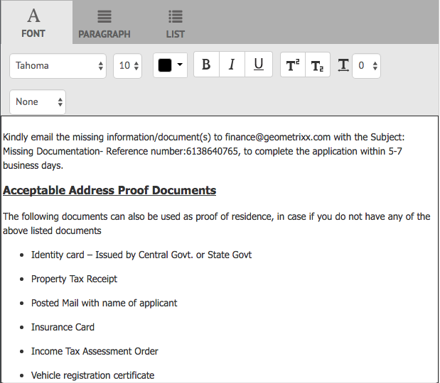

# 建立通信{#create-correspondence}

## 在建立通信用戶介面{#create-correspondence-in-the-create-correspondence-user-interface}中建立通信

在通信管理](../../forms/using/create-letter.md)中建立[信函模板後，最終用戶/代理/聲明調整器可以在「建立通信」用戶介面中開啟信函，並通過輸入資料、設定內容和管理附件來建立通信。 最後，聲明調整者或代理可以在預覽模式下管理內容並提交信函。

### 預覽通信{#preview-a-correspondence}

使用下列步驟選擇要預覽的信函：

1. 在「信函」頁面上，點選&#x200B;**選取**。
1. 點選適當的字母。

   

   選擇信函

1. 對於基於資料字典的信函，請選擇&#x200B;**預覽** > **預覽**。 或者，對於非資料字典型字母，選擇&#x200B;**預覽**。 您也可以將滑鼠指標暫留在信函上（未選取），然後點選「信函預覽」圖示以預覽。

   >[!NOTE]
   >
   >如果資料字典未與信函相關聯，信函預覽隨即開啟。 否則，如果信函是以資料字典為基礎，則通信管理會在「預覽」功能表中顯示「預覽」和「自訂」選項，您可以選取這兩個選項之一。 您也可以將測試資料與資料字典建立關聯。 當[資料字典具有關聯的測試資料](../../forms/using/data-dictionary.md#p-working-with-test-data-p)時，在選擇預覽選項時，將開啟正常預覽並填入測試資料。

1. 若要在預覽通信時轉譯通信，您應是管理員或下列其中一個群組的一員：

   * forms-users（在製作執行個體上預覽）
   * cm-agent-users（用於發佈實例上的轉譯）

   如果您不具備必要的權限，請向管理員要求適當的存取權。 有關建立用戶和向組添加用戶的詳細資訊，請參閱[向組添加用戶或組](/help/sites-administering/security.md)。 如果您嘗試在沒有適當權限的情況下轉譯通信，則會顯示404錯誤頁面。

1. 如果您已選取&#x200B;**預覽** > **自訂**，則會開啟對話方塊。 在對話方塊中，選取與資料字典對應的資料檔案，以預覽包含的信函，然後選取&#x200B;**預覽**。 根據特定信函的資料字典來建立資料檔案。 有關資料檔案的詳細資訊，請參閱[資料字典](../../forms/using/data-dictionary.md#p-working-with-test-data-p)。

   

1. 信函HTML預覽（行動表單預覽）會隨著「資料」索引標籤的焦點預設開啟。

   如需行動表單及其支援功能的詳細資訊，請參閱[行動Forms和PDF forms之間的功能差異](https://helpx.adobe.com/livecycle/help/mobile-forms/feature-differentiation-mobile-forms-pdf.html)。

   有三個索引標籤：資料、內容和附件。 如果沒有資料元素（預留位置變數和佈局欄位），則信函會直接在中開啟，並顯示「內容」索引標籤。 只有在附件存在或啟用庫訪問時，附件頁簽才可用。

   >[!NOTE]
   >
   >有關在信函預覽的HTML或PDF轉譯模式之間切換的詳細資訊，請參閱[變更信函](#changerenditionmode)的轉譯模式。 如需通信管理和AEM中PDF支援的詳細資訊，請參閱[中止NPAPI瀏覽器外掛程式及其影響](https://helpx.adobe.com/aem-forms/kb/discontinuation-of-npapi-plugins-impact-on-aem-forms.html)和[對HTML5 Forms的PDF forms](https://helpx.adobe.com/aem-forms/kb/pdf-forms-to-html5-forms.html)。

### 輸入資料 {#enterdata}

在「資料」索引標籤中，填入可用的版面欄位和預留位置。

1. 視需要在欄位中輸入資料和內容變數。 填寫所有標有星號(*)的必填欄位，以啟用&#x200B;**Submit**&#x200B;按鈕。

   點選HTML信函預覽中的資料欄位值，以在「資料」標籤中反白顯示對應的資料欄位。

    

### 管理內容 {#managecontent}

在內容索引標籤中，管理信函中的檔案片段和內容變數等內容。

1. 選擇&#x200B;**Content**。 通信管理會顯示信函的內容索引標籤。

   

1. 視需要在「內容」索引標籤中編輯內容模組。 若要聚焦到內容階層中的相關內容模組，您可以點選信函預覽中的相關行或段落，或直接點選內容階層中的內容模組。

   例如，在下圖中選取了「我們已檢閱……」行，並在「內容」索引標籤中選取了相關內容模組。

   

   在「內容」或「資料」索引標籤中，點選HTML信函預覽左上角的「反白顯示選取的模組」()，即可停用或啟用在信函預覽中選取相關文字、段落或資料欄位時前往內容/資料模組的功能。

   有關「建立通信」用戶介面中各種模組可用操作的詳細資訊，請參閱「建立通信」用戶介面](#actions-and-info-available-in-the-create-correspondence-content-tab)中的「操作」和「可用資訊」。[

1. 要查找內容模組，請使用「查找」欄位。 輸入內容模組的完整或部分名稱或標題，以在通信中搜索該名稱。
1. 點選清單、文字、條件或目標區域前面的「顯示」圖示()，以在信函中顯示或隱藏它。
1. 若要編輯內嵌或可編輯的文字模組，請點選相關的&#x200B;**Edit**&#x200B;圖示()，或在信函預覽中連按兩下相關的文字模組。

   系統會顯示一個文本編輯器以編輯文本並設定其格式。

   瀏覽器中的預設拼字檢查程式會在文字編輯器中檢查拼字。 若要管理拼字和語法檢查，您可以編輯瀏覽器的拼字檢查程式設定，或安裝瀏覽器外掛程式/附加程式以檢查拼字和語法。

   您也可以使用文字編輯器中的各種鍵盤快速鍵來管理、編輯及格式化文字。 有關通信管理鍵盤快捷鍵中[文本編輯器](/help/forms/using/keyboard-shortcuts.md#correspondence-management)鍵盤快捷鍵的詳細資訊。

   

   您可能希望重複使用文檔的另一個應用程式中存在的多個文本段落之一。 您可以直接複製和貼上文字，例如來自MS Word、HTML頁面或任何其他應用程式。

   您可以在可編輯的文字模組中複製並貼上一或多段文字。 例如，您可能有MS Word文檔，其中包含可接受居留校樣的項目符號清單，如下所示：

   

   您可以直接將MS Word檔案中的文字複製並貼到可編輯的文字模組。 文本模組中將保留項目符號清單、字型和文本顏色等格式。

   

   >[!NOTE]
   >
   >但貼上文字的格式有某些[限制](https://helpx.adobe.com/aem-forms/kb/cm-copy-paste-text-limitations.html)。

   您可以使用Tab鍵縮進信函中的文字和數字。 例如，您可以使用Tab鍵將清單中的多欄文字對齊為表格格式。

   

   範例：使用Tab鍵將多列文本對齊為表格格式

   >[!NOTE]
   >
   >有關為文本模組和字母設定頁簽間距的詳細資訊，請參閱[有關使用頁簽間距來排列文本](https://helpx.adobe.com/aem-forms/kb/cm-tab-spacing-limitations.html)的詳細資訊。

1. 如果需要，請在通信中插入特殊字元。 例如，您可以使用「特殊字元」浮動視窗來插入：

   * 貨幣符號，如€、¥和£
   * 數學符號，如∑、√、∂和^
   * 標點符號，例如&quot;和&quot;

   

   通信管理內建支援210個特殊字元。 管理員可以透過自訂](../../forms/using/custom-special-characters.md)來新增對更多/自訂特殊字元的支援。[

1. 要在可編輯的內嵌模組中突出顯示\強調部分文本，請選擇文本並點選「突出顯示顏色」。

   

   使用滑桿`**[B]**`後，您可以直接點選「基本顏色」調色板中呈現的基本顏色`**[A]**`，或點選&#x200B;**選擇**&#x200B;以選擇適當的顏色陰影。

   或者，您也可以轉到「高級」頁簽，選擇適當的「色相」、「明度」和「飽和度」 `**[C]**`以建立精確顏色，然後點選「選擇`**[D]**`」以應用顏色來突出顯示文本。

   

1. 進行適當的內容和格式變更，然後點選「**儲存**」。 點選()以在可編輯的文字模組之間移動，或點選&#x200B;**儲存並下一步**&#x200B;以儲存變更並移至下一個可編輯的文字模組。
1. 系統也會顯示每個分支的未填充變數。 當沒有未填充的變數時，未填充的變數會顯示為0。 如果有未填充的變數，您可以點選分支以展開該分支，並找出未填入的變數。 使用內容工具欄來刪除內容、增加/減少內容的縮進，以及在內容之前/之後插入分頁符。

   您可以在資料模組的上方和下方插入分頁符，即使這些分頁符是清單和條件的一部分亦然。

1. 點選「開啟/關閉內容變數」()以開啟內容變數並適當填入。
1. 正確填入未填入的變數後，未填入的變數的計數會設為0。

   在「建立通信」使用者介面中，未填入的變數計數會顯示在任何包含至少一個變數之模組階層的每個層級。 如果模組包含未填充的變數，則計數會顯示在變數、模組、目標區域和信函範本層級。

   未填入的變數計數包括：

   * 只有未受保護的資料字典和佔位符變數。 變數計數不包含配置或受保護的資料字典變數。
   * 必填欄位。
   * 版面欄位（若為必填欄位）並系結至使用者。
   * 僅限唯一變數例項。 如果模組、目標區域或信函範本包含相同變數的兩個或多個例項，則計數會顯示為1(1)。 不過，對於每個例項，計數會顯示為1。

   未填入的變數計數不包含取消選取的模組。 如果模組包含在信函範本中，但不在信函中，則不會顯示此模組中未填充變數的計數。

   對於目標區域、模組和變數，計數會顯示在信函範本中每個物件的右側。 不過，對於完整範本，計數會顯示在「建立通信」狀態列中。

   信函範本中的模組會顯示未填入的變數計數，如下所述：

   * **** Text顯示文字模組中包含的不重複未填入預留位置變數和資料字典元素的總和。
   * **** 條件顯示條件中包含的唯一未填充條件變數和結果模組中包含的變數的總和。
   * **** 清單顯示指派給清單的模組中包含的所有唯一未填變數的總和。
   * **目** 標區域顯示分配給目標區域的模組中包含的所有唯一未填充變數的總和。

   請留意下列關於具有預設值的變數：

   * 布林變數欄位預設為&#x200B;*false*。 不過，變數仍被視為未填入。 這表示變數計數包含值&#x200B;*false*&#x200B;的所有布林值變數欄位。

   * 數值變數欄位預設為&#x200B;*0（零）*。 不過，變數仍被視為未填入。 這表示變數計數包含值&#x200B;*0（零）*&#x200B;的所有數值變數欄位。

#### 「建立通信內容」頁簽{#actions-and-info-available-in-the-create-correspondence-content-tab}中可用的操作和資訊

**目標區域**

* 插入空白行：插入新的空行。
* 插入內嵌文字：插入新文本模組。
* 訂購鎖（資訊）:表示無法變更內容的順序。
* 未填充的值（資訊）:指示目標區域中未填充的變數的數量。

**模組**

* 選擇（眼睛表徵圖）:在信函中包括\排除模組。
* 跳過項目符號（適用於清單模組及其子模組）:跳過特定模組中的子彈。
* 前分頁符（適用於目標區域的子模組）:在模組前插入分頁符。
* 後分頁符（適用於目標區域的子模組）:在模組前插入分頁符。
* 未填充的值（資訊）:指示目標區域中未填充的變數的數量。
* 編輯（僅限文字模組）:開啟RTF編輯器以編輯文字模組。
* 資料面板（文字和條件模組）:開啟模組的所有變數。

**清單模組**

* 插入空白行：插入新的空行。
* 內容庫：開啟內容庫以將模組添加到清單中。
* 清單設定（僅限巢狀清單）:
* 訂購鎖（資訊）:指出無法變更清單項目的順序。

### 管理附件{#manage-attachments}

1. 選擇&#x200B;**附件**。 「通信管理」會依照建立信函範本時的設定，顯示可用的附件。
1. 您可以點選檢視圖示，選擇不隨信函提交附件，並點選附件中的十字以從信函中刪除。 對於指定的附件，在建立信函模板時，視圖和刪除表徵圖為「強制」，將被禁用。
1. 點選「資料庫存取」（）圖示以存取「內容資料庫」以插入DAM資產作為附件。

   >[!NOTE]
   >
   >「程式庫存取」圖示僅在編寫信函時啟用程式庫存取。

1. 如果建立通信時未鎖定附件的順序，則可以通過選擇附件並點選向下和向上箭頭來重新排序附件。

   如需詳細資訊，請參閱[附件傳送](#attachmentdelivery)。

### 在預覽中管理內容並提交信函{#manage-content-in-preview-and-submit-the-letter}

您可以進行版面配置和內容相關變更，確保信函的外觀符合您的預期，並提交至各種貼文程式。

1. 若要反白顯示信函中所有可編輯的內容，請點選&#x200B;**反白顯示可編輯的區段**。

   信函的可編輯內容會以灰色背景強調顯示。

   

1. 視需要在「內容」索引標籤中編輯內容模組。 若要聚焦到內容階層中的相關內容模組，您可以點選信函預覽中的相關行或段落，或直接點選內容階層中的內容模組。

   例如，行「允許我們存取……」 在下圖中選取，並在「內容」索引標籤中選取對應的內容模組。

   點選「在內容中反白標示選取的模組」()，即可在信函預覽中點選相關文字、段落或資料欄位時，停用或啟用功能以在「內容」索引標籤中反白標示內容模組。

   有關「建立通信」用戶介面中各種模組可用操作的詳細資訊，請參閱「建立通信」用戶介面](#actions-and-info-available-in-the-create-correspondence-content-tab)中的「操作」和「可用資訊」。[

1. 若要將分頁符新增至信函，請點選您要插入分頁符的位置，然後選取「分頁符在前」或「分頁符在後」()。

   信函中插入明確的分頁符預留位置。 要查看顯式分頁符對信函的影響，請查看平面化PDF預覽。

   >[!NOTE]
   >
   >由於行動表單不支援分頁，因此頁首和頁尾只會顯示一次。 不過，您可以在版面（每頁）中明確設定頁首和頁尾，以便顯示在行動表單預覽中。 此外，信函中的空白頁面（如果有的話）不會顯示在行動表單預覽中。

   

1. 若要將信函儲存為草稿，而稍後可繼續處理，請點選「另存為草稿」。 若要使用此選項，您的信函必須是[published](../../forms/using/publishing-unpublishing-forms.md#publishanasset)。 如需詳細資訊，請參閱「儲存草稿及提交信函例項」下方的「草稿例項」](#savingdrafts)。[

   

   出現「Draft Letter Name（繪製字母名稱）」對話框，其中包含字母實例ID。 您可以選擇編輯此ID。 記下字母Id，然後點選&#x200B;**Done**。 您之後可以將此ID用於[重新載入草稿字母](submit-letter-topostprocess.md#reloaddraft)。

1. 若要以平面化PDF格式預覽信函，並具有確切的版面配置和將提交的分頁，請點選()「預覽」。

   信函會以平面化的PDF顯示。 拼合的PDF是信函的確切表示，因為它將以信函的正確字型、斷字和版面提交。

   >[!NOTE]
   >
   >如果您使用Mozilla Firefox和HTML轉譯類型，若要將信函預覽為平面化PDF，請務必使用原生瀏覽器外掛程式，而非Acrobat外掛程式。 若要選取原生瀏覽器外掛程式，請前往Mozilla Firefox的設定，並針對內容類型PDF，選取「在Firefox中預覽」。

1. 如果您發現平面化PDF預覽結果令人滿意，請點選&#x200B;**Submit**&#x200B;以提交信函。 或者，若要變更信函，請點選「**退出預覽**」，返回信函的「建立通信UI」預覽，以變更信函。 當您點選「提交」時，如果在「發佈」執行個體上啟用「管理信函例項」設定，則會產生提交信函例項。

   如需詳細資訊，請參閱儲存草稿和提交信函例項下方的草稿例項。

   您也可以將信函儲存為草稿，以便稍後變更信函。

   進行必要的變更後，您可以從HTML5預覽提交信函，或再次點選「預覽」以檢閱平面化的PDF輸出。

   如需HTML5表單與PDF forms之間差異的資訊，請參閱[HTML5表單與PDF forms之間的功能差異](../../forms/using/feature-differentiation-html5-forms-pdf-forms.md)。

## 保存草稿和提交信函實例 {#savingdrafts}

在「建立通信」使用者介面中轉譯信函時，您可以將信函儲存為已檢視。

可儲存的信函例項有兩種類型：草稿例項和提交例項。

* **草稿例項**:草稿例項會擷取您正在預覽之信函的目前狀態。若要儲存草稿例項，請先確定信函參照的字母和所有資產都處於「已發佈」狀態。 如需發佈信函的相關資訊，請參閱[發佈資產](../../forms/using/publishing-unpublishing-forms.md#publishanasset)。 您需要先發佈信函，才能將其儲存為草稿，因為當您發佈信函時，會建立信函版本、其相依資產，以及該時間點的資料。 信函的已發佈版本無法由您或其他使用者編輯，且稍後可還原，而未發生任何已發佈版本的非預期差異。 您稍後可以返回此執行個體，並從您離開的位置繼續。

* **提交實例**:提交例項會在提交時擷取信函狀態。提交例項會在信函例項的PDF狀態經過後加以處理，以及使用者在「建立通信」使用者介面中輸入的資料。

只有在發佈執行個體上檢視信函時，才能儲存這類執行個體。 預設情況下，關閉執行個體的儲存。 要啟用信函實例的保存，請執行以下步驟。

1. 在AEM中，使用下列URL開啟您伺服器的Adobe Experience Manager Web Console設定：https://&lt;server>:&lt;port>/&lt;contextpath>/system/console/configMgr
1. 找到&#x200B;**[!UICONTROL 通信管理配置]**，然後按一下。
1. 檢查Publish ]**配置上的**[!UICONTROL &#x200B;管理信函實例，然後按一下&#x200B;**[!UICONTROL 保存]**。

開啟信函例項的儲存時，您可以選擇要儲存信函例項的位置。 儲存字母例項有兩個選項：本地保存或遠程保存。

### 本地保存{#local-save}

信函例項會儲存在發佈例項上，並會在製作例項上反向複製。

### 遠程保存{#remote-save}

對於在發佈執行個體上儲存使用者資料有疑慮的人，通常在公司防火牆之外會有此選項。 開啟遠端儲存時，信函例項不會儲存在發佈例項上，但會透過LiveCycle用戶端SDK設定，在指定的處理製作上遠端儲存。

#### 啟用遠程保存{#enable-remote-save}

1. 在AEM中，使用下列URL開啟您伺服器的Adobe Experience Manager Web Console設定：`https://<server>:<port>/<contextpath>/system/console/configMgr`
1. 搜索&#x200B;**[!UICONTROL 通信管理配置]**&#x200B;並按一下它。
1. 找到&#x200B;**[!UICONTROL 遠程保存]**&#x200B;配置，檢查它，然後按一下&#x200B;**[!UICONTROL 保存]**。

#### 指定處理製作設定{#specify-processing-author-settings}

1. 在AEM中，使用下列URL開啟您伺服器的Adobe Experience Manager Web Console設定：`https://<server>:<port>/<contextpath>/system/console/configMgr`

   

1. 在此頁面上，找出「AdobeLiveCycle用戶端SDK設定」 ，然後按一下以展開它。

1. 在處理伺服器URL中，輸入LiveCycle伺服器的名稱，提供登入資訊，然後按一下&#x200B;**儲存**。

   

1. 如有必要，請設定您要用來存取伺服器的使用者名稱和密碼。

#### 附件傳送 {#attachmentdelivery}

* 信函附件是在信函提交後建立的PDF中的後續處理功能。
* 當使用伺服器端API以互動式或非互動式PDF格式轉譯信函時，轉譯的PDF會以PDF附件的形式包含附件。
* 使用「建立通信」使用者介面，在「提交」或「完成通信」操作中載入與信函範本相關聯的後置處理時，附件會以AttachmentDocs參數中的List&lt;com.adobe.idp.Document>的形式傳遞。
* 現成可用的傳送機制（例如電子郵件和列印）也會傳送附件，並附上所產生通信的PDF。

## 信函預覽的轉譯模式：行動表單預覽和PDF預覽{#rendition-modes-of-letter-preview-mobile-forms-preview-and-pdf-preview}

AEM Forms通信管理在「建立通信UI」中將信函顯示為HTML。 不過，通信管理仍支援回復為PDF預覽，而非HTML預覽。 有關在HTML和PDF預覽模式之間切換的詳細資訊，請參閱[更改字母](#changerenditionmode)的轉譯模式。

以下是HTML和PDF預覽中可用的優點和功能。

**行動表單/HTML預覽的優點**

* **點選資料欄位值以反白標示對應的資料欄位**:在「建立通信」使用者介面中，您可以點選信函中的資料欄位值，以在「資料」索引標籤中反白顯示對應的資料欄位。如需詳細資訊，請參閱[輸入資料](#enterdata)。

* **瀏覽器支援**:瀏覽器會逐漸撤回對NPAPI的支援，這會影響信函的PDF預覽。信函的HTML/行動表單預覽不受此影響。
* **反白標示信函中可編輯的內容**:在「建立通信」使用者介面中，您可以點選「反白標示可編輯內容」，以灰色反白標示信函中所有可編輯的內容。如需詳細資訊，請參閱[管理內容](#managecontent)。

`<li>` `<li>Benefits of HTML preview  <ul>   <li>Right to left</li>   <li>NPAPI</li>   <li>Highlight Editable Content</li>  </ul> </li>` `<li>Benefits of PDF preview  <ul>   <li>Page Break</li>   <li>Final Preview</li>  </ul> </li>`
`<li>` `<li>Benefits of HTML preview  <ul>   <li>Right to left</li>   <li>NPAPI</li>   <li>Highlight Editable Content</li>  </ul> </li>` `<li>Benefits of PDF preview  <ul>   <li>Page Break</li>   <li>Final Preview</li>  </ul> </li>`  **PDF預覽的優點**

* **分頁**:在PDF預覽中，您可以精確檢視信函中的分頁如何影響其輸出。
* **最終預覽**:在PDF預覽中，您可以查看信函在輸出中的確切格式和外觀。

有關PDF forms中指令碼支援的資訊，請參閱[指令碼支援](https://help.adobe.com/en_US/livecycle/11.0/ScriptingSupport/index.html)。

有關HTML5表單中指令碼支援的詳細資訊，請參閱[HTML5表單的指令碼支援](/help/forms/using/scripting-support.md)。

### 更改信函的轉譯模式 {#changerenditionmode}

依預設，建立通信UI會使用HTML或行動表單來轉譯信函預覽。 行動表單預覽在任何瀏覽器中皆無問題，因為使用瀏覽器的原生外掛程式，且不需要其他外掛程式。 您可以將信函預覽模式變更為PDF。 不過，瀏覽器限制可能會針對信函互動式PDF預覽的不同功能產生問題。

有關瀏覽器與信函預覽相容性的詳細資訊，請參閱[中止NPAPI瀏覽器外掛程式及其影響](https://helpx.adobe.com/aem-forms/kb/discontinuation-of-npapi-plugins-impact-on-aem-forms.html)。

要更改信函的預覽模式，請完成以下步驟：

1. 前往`https://[system]:'port'/system/console/configMgr`，並視需要以管理員身分登入。
1. 轉至&#x200B;**[!UICONTROL 通信管理配置]** > **[!UICONTROL 轉譯類型]**&#x200B;並選擇&#x200B;**HTML轉譯**（預設）或&#x200B;**PDF轉譯**。
1. 按一下「**[!UICONTROL 儲存]**」。
