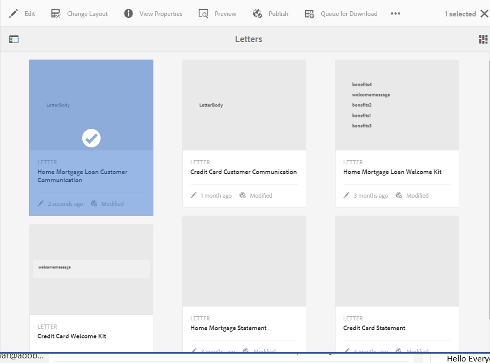

# 建立對應{#create-correspondence}

## 在建立對應用戶介面{#create-correspondence-in-the-create-correspondence-user-interface}中建立對應

在Correponse Management](../../forms/using/create-letter.md)中建立[字母模板後，最終用戶／代理／索賠調整器可以在Create Correncess用戶介面中開啟該字母，並通過輸入資料、設定內容和管理附件來建立對應。 最後，理賠代理可以在預覽模式下管理內容並提交信件。

### 預覽對應{#preview-a-correspondence}

使用下列步驟選擇要預覽的字母：

1. 在「字母」頁面上，點選&#x200B;**選擇**。
1. 點選適當的字母以選取它。

   

   選擇字母

1. 對於基於資料字典的字母，選擇&#x200B;**預覽** > **預覽**。 或者，對於非基於資料字典的字母，請選擇&#x200B;**預覽**。 您也可以將滑鼠指標暫留在字母上（不需選取它），並點選「字母預覽」圖示來預覽。

   >[!NOTE]
   >
   >如果資料字典未與字母關聯，字母預覽會開啟。 否則，如果字母是基於資料字典的，則「對應管理」會在「預覽」菜單中顯示「預覽」和「自定義」選項，您可以選擇兩個選項之一。 您也可以將測試資料與資料字典建立關聯。 當[資料字典具有關聯的測試資料](../../forms/using/data-dictionary.md#p-working-with-test-data-p)時，在選取預覽選項時，一般預覽會開啟並填入測試資料。

1. 要能夠在預覽通信時呈現通信，您應是管理員或下列組之一的一員：

   * forms-users（若要在作者例項上預覽）
   * cm-agent-users（用於發佈實例上的轉譯）

   如果您沒有必要的權限，請向管理員要求適當的存取權。 有關建立用戶和向組添加用戶的詳細資訊，請參閱[向組添加用戶或組](/help/sites-administering/security.md)。 如果您嘗試在沒有適當權限的情況下轉譯對應內容，則會顯示404錯誤頁面。

1. 如果您已選取「預覽&#x200B;**** > **自訂**」，則會開啟對話方塊。 在對話框中，選擇與資料字典對應的資料檔案以預覽字母，然後選擇&#x200B;**預覽**。 基於特定字母的資料字典建立資料檔案。 有關資料檔案的詳細資訊，請參閱[資料字典](../../forms/using/data-dictionary.md#p-working-with-test-data-p)。

   

1. 字母HTML預覽（行動表單預覽）會依預設開啟，「資料」索引標籤會聚焦在焦點。

   如需行動表單及其支援功能的詳細資訊，請參閱[行動Forms與PDF forms的功能區隔](https://helpx.adobe.com/livecycle/help/mobile-forms/feature-differentiation-mobile-forms-pdf.html)。

   有三個標籤：資料、內容和附件。 如果沒有資料元素（預留位置變數和版面欄位），則字母會直接在中開啟，並顯示「內容」索引標籤。 附件頁籤僅在附件存在或庫訪問被啟用時可用。

   >[!NOTE]
   >
   >有關在字母預覽的HTML或PDF轉譯模式之間切換的詳細資訊，請參閱[更改字母的轉譯模式。 ](#changerenditionmode)如需有關「通信管理」和「PDF」支援的詳細資訊AEM，請參閱「中止NPAPI瀏覽器外掛程式及其影響](https://helpx.adobe.com/aem-forms/kb/discontinuation-of-npapi-plugins-impact-on-aem-forms.html)和[HTML5Forms的PDF forms」。

### 輸入資料{#enterdata}

在「資料」索引標籤中，填寫可用的版面欄位和預留位置。

1. 視需要在欄位中輸入資料和內容變數。 填寫所有標有星號(*)的必填欄位，以啟用&#x200B;**Submit**&#x200B;按鈕。

   點選HTML字母預覽中的資料欄位值，以在「資料」索引標籤中反白顯示對應的資料欄位。

    

### 管理內容 {#managecontent}

在內容標籤中，管理字母中的檔案片段和內容變數等內容。

1. 選擇&#x200B;**內容**。 「對應管理」會顯示信件的內容標籤。

   

1. 視需要在「內容」索引標籤中編輯內容模組。 若要將焦點放在內容階層中的相關內容模組，您可以在字母預覽中點選相關行或段落，或直接在內容階層中點選內容模組。

   例如，「我們已檢閱……」在下圖中選取，而「內容」索引標籤中會選取相關的內容模組。

   

   在「內容」或「資料」索引標籤中，只要點選HTML字母預覽左上角的「反白標示選取的模組」()，您就可以停用或啟用功能，在字母預覽中選取相關文字、段落或資料欄位時前往內容／資料模組。

   有關「建立對應」用戶介面中各模組可用操作的詳細資訊，請參閱「建立對應」用戶介面](#actions-and-info-available-in-the-create-correspondence-content-tab)中的「操作」和「資訊」。[

1. 若要尋找內容模組，請使用「尋找」欄位。 輸入內容模組的完整或部分名稱或標題，以在對應中搜索內容模組。
1. 點選清單、文字、條件或目標區域前面的「顯示」圖示()，以在字母中顯示或隱藏。
1. 若要編輯內嵌或可編輯的文字模組，請點選相關的&#x200B;**編輯**&#x200B;圖示()，或在字母預覽中連按兩下相關文字模組。

   系統會顯示文字編輯器來編輯和格式化文字。

   瀏覽器中的預設拼字檢查器會在文字編輯器中檢查拼字。 若要管理拼字檢查和語法檢查，您可以編輯瀏覽器的拼字檢查器設定，或安裝瀏覽器外掛程式／地址以檢查拼字檢查和語法。

   您也可以使用文字編輯器中的各種鍵盤快速鍵來管理、編輯和格式化文字。 有關「通信管理鍵盤快捷鍵」中[文本編輯器](/help/forms/using/keyboard-shortcuts.md#correspondence-management)鍵盤快捷鍵的詳細資訊。

   

   您可能想要重複使用另一個檔案應用程式中存在的多段文字。 您可以直接複製和貼上文字，例如從MS Word、HTML頁面或任何其他應用程式複製和貼上。

   您可以在可編輯的文字模組中複製和貼上一或多個文欄位落。 例如，您可能有MS Word檔案，其中包含可接受的居住證明項目清單，如下所示：

   

   您可以直接將MS Word檔案中的文字複製並貼至可編輯的文字模組。 文字模組會保留項目清單、字型和文字顏色等格式。

   

   >[!NOTE]
   >
   >不過，貼上的文字格式有一些[限制](https://helpx.adobe.com/aem-forms/kb/cm-copy-paste-text-limitations.html)。

   您可以使用Tab鍵縮進字母中的文本和數字。 例如，您可以使用Tab鍵將清單中的多欄文字對齊為表格格式。

   

   範例：使用Tab鍵將多欄文字對齊成表格格式

   >[!NOTE]
   >
   >有關為文本模組和字母設定制表符間距的詳細資訊，請參閱[有關使用制表符間距排列文本的詳細資訊](https://helpx.adobe.com/aem-forms/kb/cm-tab-spacing-limitations.html)。

1. 如果需要，請在對應中插入特殊字元。 例如，您可以使用「特殊字元」浮動視窗來插入：

   * 貨幣符號，例如€、¥和英鎊
   * 數學符號，如∑、√、÷和^
   * 標點符號‟，例如&quot;

   

   Commense Management已內建210個特殊字元的支援。 管理員可以透過自訂](../../forms/using/custom-special-characters.md)新增對更多／自訂特殊字元的支援。[

1. 若要在可編輯的內嵌模組中反白\強調部分文字，請選取文字並點選「反白顯示顏色」。

   

   您可以直接點選「基本顏色」浮動視窗中顯示的基本顏色`**[A]**`，或在使用滑桿`**[B]**`後點選「選取&#x200B;****」，以選擇適當的顏色陰影。

   或者，您也可以前往「進階」標籤，選取適當的「色相」、「明度」和「飽和度」 `**[C]**`以建立精確的色彩，然後點選「選取`**[D]**`」以套用色彩來反白顯示文字。

   

1. 進行適當的內容和格式變更，然後點選「儲存」。 ****&#x200B;點選()可在可編輯的文字模組之間移動，或點選&#x200B;**儲存並下一步**&#x200B;以儲存變更並移至下一個可編輯的文字模組。
1. 系統也會顯示每個分支的未填色變數。 當沒有未填充的變數時，未填入的變數會顯示為0。 如果有未填入的變數，您可以點選分支以展開該變數，並找出未填入的變數。 使用內容工具列來刪除內容、增加／減少內容縮進，以及在內容之前／之後插入分頁符。

   即使資料模組是清單和條件的一部分，您也可以在資料模組上方和下方插入分頁符。

1. 點選「開啟／關閉內容變數」()以開啟內容變數並適當填入。
1. 在正確填入未填入的變數後，未填入的變數計數會設為0。

   在「建立對應」使用者介面中，未填入的變數計數會顯示在包含至少一個變數之任何模組階層的每個層級。 如果模組包含未填充的變數，計數會顯示在變數、模組、目標區域和字母範本層級。

   未填入的變數計數包括：

   * 只有未受保護的資料字典和預留位置變數。 變數計數不包含版面或受保護的資料字典變數。
   * 必填欄位。
   * 版面欄位（若為必填欄位），並系結至使用者。
   * 僅唯一變數例項。 如果模組、目標區域或字母模板包含兩個或兩個以上相同變數的實例，計數將顯示為1(1)。 但是，對於每個實例，計數顯示為1。

   未填入的變數計數不包含取消選取的模組。 如果模組包含在字母模板中，但不在字母中，則不顯示此模組中未填充變數的計數。

   對於目標區域、模組和變數，計數顯示在字母模板中每個對象的右側。 不過，對於完整範本，計數會顯示在「建立對應」狀態列中。

   字母範本中的模組會顯示未填入的變數計數，如下所述：

   * **文** 字顯示文字模組中所含唯一未填入預留位置變數與資料字典元素的總和。
   * **條** 件顯示條件中包含的唯一非填充條件變數和合成模組中包含的變數的總和。
   * **列** 表顯示分配給清單的模組中包含的所有唯一未填充變數的總和。
   * **目標** 區域顯示指派給目標區域的模組中所含所有唯一未填色變數的總和。

   請注意以下關於具有預設值的變數：

   * 布林變數欄位預設為&#x200B;*false*。 不過，變數會被視為未填入。 這表示變數計數包含值&#x200B;*false*&#x200B;的所有布林變數欄位。

   * 數值變數欄位預設為&#x200B;*0（零）*。 不過，變數會被視為未填入。 這表示變數計數包含值&#x200B;*0（零）*&#x200B;的所有數值變數欄位。

#### 「建立對應內容」頁籤{#actions-and-info-available-in-the-create-correspondence-content-tab}中可用的操作和資訊

**目標區域**

* 插入空白行：插入新的空行。
* 插入內嵌文字：插入新文本模組。
* 訂購鎖定（資訊）:表示無法更改內容的順序。
* 未填充的值（資訊）:指出目標區域中未填入變數的數目。

**模組**

* 選取範圍（眼睛圖示）:Includes\excludes module from the letter.
* 跳過項目符號（適用於清單模組及其子模組）:跳過特定模組中的項目符號。
* 分頁前（適用於目標區域的子模組）:在模組前插入分頁符。
* 後分頁符（適用於目標區域的子模組）:在模組前插入分頁符。
* 未填充的值（資訊）:指出目標區域中未填入變數的數目。
* 編輯（僅限文字模組）:開啟豐富式文字編輯器，以編輯文字模組。
* 資料面板（文字與條件模組）:開啟模組的所有變數。

**清單模組**

* 插入空白行：插入新的空行。
* 內容庫：開啟內容庫以新增模組至清單。
* 清單設定（僅限巢狀清單）:
* 訂購鎖定（資訊）:指出無法變更清單項目的順序。

### 管理附件{#manage-attachments}

1. 選擇&#x200B;**附件**。 Oracle Commenting會顯示可用附件，如建立信函模板時所設定的。
1. 您可以點選檢視圖示，選擇不隨函附件一起提交，也可以點選附件中的交叉點，將其從函件中刪除。 對於指定的附件，在建立字母模板時，視圖和刪除表徵圖將禁用為「強制」。
1. 點選「資料庫存取」（）圖示，以存取「內容庫」，將DAM資產插入為附件。

   >[!NOTE]
   >
   >「資料庫存取權」圖示僅在編寫信件時啟用資料庫存取權。

1. 如果在建立對應時未鎖定附件的順序，則可以通過選擇附件並點選向下和向上箭頭來重新排序附件。

   如需詳細資訊，請參閱[附件傳送](#attachmentdelivery)。

### 在預覽中管理內容並送出字母{#manage-content-in-preview-and-submit-the-letter}

您可以進行版面配置和內容相關變更，以確保信件如您所想般呈現，並送出至各種貼文程式。

1. 若要反白顯示字母中的所有可編輯內容，請點選&#x200B;**反白顯示可編輯部分**。

   字母的可編輯內容會以灰色背景反白顯示。

   

1. 視需要在「內容」索引標籤中編輯內容模組。 若要將焦點放在內容階層中的相關內容模組，您可以在字母預覽中點選相關行或段落，或直接在內容階層中點選內容模組。

   例如，「允許我們存取……」行 在下圖中選取，而在「內容」索引標籤中選取對應的內容模組。

   點選「在內容中反白顯示選取的模組」()後，當在字母預覽中點選相關文字、段落或資料欄位時，您可以停用或啟用「內容」索引標籤中反白顯示內容模組的功能。

   有關「建立對應」用戶介面中各模組可用操作的詳細資訊，請參閱「建立對應」用戶介面](#actions-and-info-available-in-the-create-correspondence-content-tab)中的「操作」和「資訊」。[

1. 若要將分頁符新增至字母，請點選您要插入分頁符的位置，然後選取「分頁符之前」或「分頁符後」()。

   在字母中插入明確的分頁符佔位符。 若要檢視明確的分頁符號對字母的影響，請參閱平面化PDF預覽。

   >[!NOTE]
   >
   >由於行動表單不支援分頁，因此頁首和頁尾只會顯示一次。 不過，您可以在版面（每頁）中明確設定頁首和頁尾，以便顯示在行動表單預覽中。 此外，字母中的空白頁面（如果有）不會顯示在「行動」表單預覽中。

   

1. 要將字母另存為草稿（您稍後可繼續處理），請按一下「另存為草稿」。 若要使用此選項，您的信件必須是[published](../../forms/using/publishing-unpublishing-forms.md#publishanasset)。 如需詳細資訊，請參閱「儲存草稿並送出字母例項」下的「草稿例項」。

   

   出現「繪製字母名稱」(Draft Letter Name)對話框，其中包含字母實例ID。 您可以選擇編輯此ID。 記下字母Id，然後點選&#x200B;**Done**。 您稍後可以使用此ID來[重新載入草稿字母](submit-letter-topostprocess.md#reloaddraft)。

1. 若要將字母預覽為平面化PDF，並在提交時具有精確的版面配置和分頁符，請點選()「預覽」。

   信函會顯示為平面化的PDF。 平面化的PDF是字母的精確表示，因為它會以正確的字型、分頁和字母版面提交。

   >[!NOTE]
   >
   >如果您使用Mozilla Firefox和HTML轉譯類型，若要將字母預覽為平面化PDF，請確定您使用原生瀏覽器外掛程式，而非Acrobat外掛程式。 若要選取原生瀏覽器外掛程式，請前往Mozilla Firefox的設定，並針對內容類型PDF，選取「在Firefox中預覽」。

1. 如果您發現平面化的PDF預覽效果令人滿意，請點選&#x200B;**Submit**&#x200B;以送出信函。 或者，若要變更字母，請點選「退出預覽」(**Exit Preview)，返回至字母的「建立對應UI」預覽，以變更字母。**&#x200B;當您點選「送出」時，如果「發佈」例項上啟用「管理字母例項」設定，則會產生送出字母例項。

   如需詳細資訊，請參閱「儲存草稿並送出信函例項」下方的「草稿例項」。

   您也可以將字母儲存為草稿，以便稍後變更字母。

   進行必要的變更後，您可以從HTML5預覽中提交字母，或再次點選「預覽」以檢視平面化的PDF輸出。

   如需HTML5表單與PDF forms之間差異的詳細資訊，請參閱[HTML5表單與PDF forms之間的功能區隔](../../forms/using/feature-differentiation-html5-forms-pdf-forms.md)。

## 儲存草稿並送出字母例項{#savingdrafts}

在「建立對應」使用者介面中轉譯信函時，您可將信函儲存為已檢視。

可以保存兩種類型的字母實例：草稿實例和提交實例。

* **草稿實例**:草稿例項會擷取您預覽之信件的目前狀態。要保存草稿實例，請先確保字母和字母引用的所有資產處於「已發佈」狀態。 如需有關發佈信件的詳細資訊，請參閱[發佈資產](../../forms/using/publishing-unpublishing-forms.md#publishanasset)。 您必須先發佈字母，才能將它儲存為草稿，因為當您發佈字母時，會建立該字母的版本、其相依資產和該時間點的資料。 您或其他使用者無法編輯信件的發佈版本，而且稍後可以還原，而不會與發佈版本有任何意外的差異。 您稍後可以返回此實例，然後從您離開的位置繼續。

* **提交實例**:提交實例會在提交時捕獲字母的狀態。提交實例會在信件實例後處理後儲存其PDF狀態，以及用戶在「建立對應」用戶介面中輸入的資料。

只有在發佈例項上檢視字母時，才能儲存這類例項。 預設情況下，會關閉對實例的保存。 要啟用字母實例的保存，請執行以下步驟。

1. 在中AEM，使用以下URL開啟伺服器的Adobe Experience ManagerWeb控制台配置：https://&lt;server>:&lt;port>/&lt;contextpath>/system/console/configMgr
1. 找到&#x200B;**[!UICONTROL Corresponce Management Configurations]** ，然後按一下它。
1. 檢查&#x200B;**[!UICONTROL 管理Publish]**&#x200B;組態上的字母例項，然後按一下&#x200B;**[!UICONTROL 儲存]**。

開啟字母實例的保存時，您可以選擇保存字母實例的位置。 保存字母實例有兩個選項：本地保存或遠程保存。

### 本地保存{#local-save}

字母例項會儲存在發佈例項上，並反向複製到作者例項上。

### 遠程保存{#remote-save}

此選項適用於擔心在發佈例項上儲存使用者資料的使用者，通常在公司防火牆外。 當開啟遠端儲存時，字母例項不會儲存在發佈例項上，但是會遠端儲存在透過LiveCycle用戶端SDK組態指定的處理作者上。

#### 啟用遠程保存{#enable-remote-save}

1. 在中AEM，使用以下URL開啟伺服器的Adobe Experience ManagerWeb控制台配置：`https://<server>:<port>/<contextpath>/system/console/configMgr`
1. 搜索&#x200B;**[!UICONTROL Corresponce Management Configurations]** ，然後按一下。
1. 找到&#x200B;**[!UICONTROL 遠程保存]**&#x200B;配置並選中它，然後按一下&#x200B;**[!UICONTROL 保存]**。

#### 指定處理作者設定{#specify-processing-author-settings}

1. 在中AEM，使用以下URL開啟伺服器的Adobe Experience ManagerWeb控制台配置：`https://<server>:<port>/<contextpath>/system/console/configMgr`

   

1. 在本頁中，找到「AdobeLiveCycle客戶端SDK配置」並按一下以展開它。

1. 在處理伺服器URL中，輸入LiveCycle伺服器的名稱，提供登錄資訊，然後按一下&#x200B;**保存**。

   

1. 如有必要，請設定您要存取伺服器的使用者名稱和密碼。

#### 附件遞送{#attachmentdelivery}

* 信函附件是PDF的後置處理，在提交信函後建立。
* 當使用伺服器端API將信件轉譯為互動式或非互動式PDF時，轉譯的PDF會以PDF附件的形式包含附件。
* 當使用「建立對應」使用者介面載入與信件範本相關的貼文程式，作為「提交或完成對應」作業的一部分時，附件會以AttachmentDocs參數中的List&lt;com.adobe.idp.Document>的形式傳遞。
* 現成可用的傳送機制（例如電子郵件和列印）也會傳送附件，以及產生之信件的PDF。

## 字母預覽的轉譯模式：行動表單預覽和PDF預覽{#rendition-modes-of-letter-preview-mobile-forms-preview-and-pdf-preview}

AEM Forms通訊管理會在「建立通訊UI」中將字母顯示為HTML。 不過，「對應管理」仍支援回復為PDF預覽，而非HTML預覽。 如需在HTML和PDF預覽模式之間切換的詳細資訊，請參閱[變更letter](#changerenditionmode)的轉譯模式。

以下是HTML和PDF預覽的優點和功能。

**行動表單/HTML預覽的優點**

* **點選資料欄位值以反白標示對應的資料欄位**:在「建立對應」使用者介面中，您可以點選字母中的資料欄位值，以反白標示「資料」標籤中的對應資料欄位。如需詳細資訊，請參閱[輸入data](#enterdata)。

* **瀏覽器支援**:瀏覽器逐漸支援NPAPI，這會影響PDF的字母預覽。HTML/行動表單字母預覽不受此影響。
* **在字母中反白標示可編輯的內容**:在「建立對應」使用者介面中，您可以點選「反白標示可編輯內容」，以灰色反白標示字母中的所有可編輯內容。如需詳細資訊，請參閱[管理內容](#managecontent)。

`<li>` `<li>Benefits of HTML preview  <ul>   <li>Right to left</li>   <li>NPAPI</li>   <li>Highlight Editable Content</li>  </ul> </li>` `<li>Benefits of PDF preview  <ul>   <li>Page Break</li>   <li>Final Preview</li>  </ul> </li>`
`<li>` `<li>Benefits of HTML preview  <ul>   <li>Right to left</li>   <li>NPAPI</li>   <li>Highlight Editable Content</li>  </ul> </li>` `<li>Benefits of PDF preview  <ul>   <li>Page Break</li>   <li>Final Preview</li>  </ul> </li>`  **PDF預覽的優點**

* **分頁符**:在PDF預覽中，您可以確切檢視字母中的分頁符號如何影響其輸出。
* **最終預覽**:在PDF預覽中，您可以檢視字母的確切格式和外觀，因為字母會出現在其輸出中。

有關PDF forms語中指令碼支援的資訊，請參見[指令碼支援](https://help.adobe.com/en_US/livecycle/11.0/ScriptingSupport/index.html)。

如需HTML5表單中指令碼支援的詳細資訊，請參閱[HTML5表單的指令碼支援](/help/forms/using/scripting-support.md)。

### 更改字母{#changerenditionmode}的轉譯模式

依預設，「建立對應」UI會使用HTML或行動表單來呈現字母預覽。 行動表單預覽在任何瀏覽器中都不會產生任何問題，因為它使用瀏覽器的原生外掛程式，而且不需要額外的外掛程式。 您可以將字母預覽模式變更為PDF。 不過，瀏覽器限制可能會針對字母的互動式PDF預覽的不同功能產生問題。

有關瀏覽器與字母預覽相容性的詳細資訊，請參閱[中止NPAPI瀏覽器插件及其影響](https://helpx.adobe.com/aem-forms/kb/discontinuation-of-npapi-plugins-impact-on-aem-forms.html)。

要更改字母的預覽模式，請完成以下步驟：

1. 前往`https://[system]:'port'/system/console/configMgr`並視需要以管理員身分登入。
1. 轉至「**[!UICONTROL 對應管理配置]** > **[!UICONTROL 轉譯類型]**」，然後選擇「**HTML轉譯**」（預設）或「**PDF轉譯**」。
1. 按一下「**[!UICONTROL 儲存]**」。

