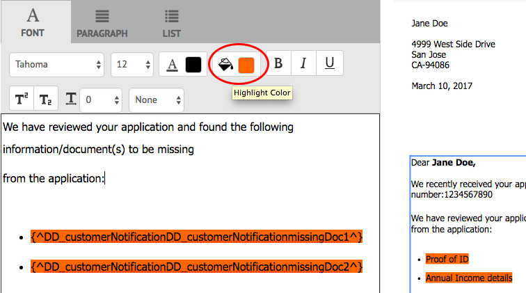

# 建立對應{#create-correspondence}

## 在「建立對應」用戶介面中建立對應 {#create-correspondence-in-the-create-correspondence-user-interface}

在 [信函模板是在Oracle Tergement中建立的](../../forms/using/create-letter.md)，最終用戶/代理/索賠調整器可以在「建立通信」用戶介面中開啟信件，並通過輸入資料、設定內容和管理附件來建立信件。 最後，報銷申請調整者或代理可以在預覽模式下管理內容並提交信件。

### 預覽對應 {#preview-a-correspondence}

使用以下步驟選擇要預覽的字母：

1. 在「信件」頁面上，按一下 **選擇**。
1. 點擊相應字母以選擇相應字母。

   

   選擇字母

1. 對於基於資料字典的字母，選擇 **預覽** > **預覽**。 或者對於非基於資料字典的字母，選擇 **預覽**。 也可以將滑鼠懸停在字母上（不選擇字母），然後點擊「字母預覽」表徵圖進行預覽。

   >[!NOTE]
   >
   >如果資料字典未與字母關聯，則字母預覽將開啟。 否則，如果字母是基於資料字典的，則「對應管理」會在「預覽」菜單中顯示「預覽」和「自定義」選項，並且您可以選擇兩個選項之一。 您還可以將test資料與資料字典相關聯。 當 [資料字典具有關聯的test資料](../../forms/using/data-dictionary.md#p-working-with-test-data-p)，然後選擇預覽選項時，將開啟普通預覽，並填充test資料。

1. 要能夠在預覽通信時呈現通信，您應是管理員或下列組之一的一部分：

   * 表單用戶（要在作者實例上預覽）
   * cm-agent-users（用於發佈實例上的格式副本）

   如果您不具有所需權限，請向管理員請求相應的訪問權限。 有關建立用戶和將用戶添加到組的詳細資訊，請參見 [向組添加用戶或組](/help/sites-administering/security.md)。 如果您嘗試在沒有相應權限的情況下呈現通信，則將顯示404錯誤頁。

1. 如果已選擇 **預覽** > **自定義**&#x200B;的子菜單。 在對話框中，選擇與資料字典對應的資料檔案以預覽字母，然後選擇 **預覽**。 基於特定字母的資料字典建立資料檔案。 有關資料檔案的詳細資訊，請參見 [資料字典](../../forms/using/data-dictionary.md#p-working-with-test-data-p)。

   

1. 預設情況下，字母HTML預覽（移動表單預覽）開啟，「資料」頁籤聚焦。

   有關移動表單及其支援的功能的詳細資訊，請參見 [移動Forms與PDF forms的特徵區分](https://helpx.adobe.com/livecycle/help/mobile-forms/feature-differentiation-mobile-forms-pdf.html)。

   有三個頁籤：資料、內容和附件。 如果沒有資料元素（佔位符變數和佈局欄位），則在中直接開啟字母並顯示「內容」頁籤。 「附件」(Attachments)頁籤僅在存在附件或啟用了庫訪問時可用。

   >[!NOTE]
   >
   >有關在字母預覽的HTML或PDF格式副本模式之間切換的詳細資訊，請參閱 [更改字母的格式副本模式](#changerenditionmode)。 有關函件管理中PDF支援的詳細資訊，請AEM參見 [NPAPI瀏覽器插件的中斷及其影響](https://helpx.adobe.com/acrobat/kb/change-in-support-for-acrobat-and-reader-plug-ins-in-modern-web-.html)。 <!-- and [PDF Forms to HTML5 Forms](https://helpx.adobe.com/aem-forms/kb/pdf-forms-to-html5-forms.html). THIS URL IS A 404 AND NO SUITABLE REPLACEMENT TOPIC WAS FOUND. CONSIDER DELETING OR ADDING NEW LINK. COMMENTING OUT SO USERS DON'T CLICK IT. -->

### 輸入資料 {#enterdata}

在「資料」頁籤中，填充可用的佈局欄位和佔位符。

1. 根據需要在欄位中輸入資料和內容變數。 填寫標有星號(&#42;)以啟用 **提交** 按鈕

   點擊HTML字母預覽中的資料欄位值，在「資料」頁籤中突出顯示相應的資料欄位。

    

### 管理內容 {#managecontent}

在內容頁籤中，管理字母中的內容，如文檔片段和內容變數。

1. 選擇 **內容**。 Oracle Tergement顯示信件的內容頁籤。

   

1. 根據需要在「內容」頁籤中編輯內容模組。 要將焦點集中到內容層次結構中的相關內容模組，您可以點擊字母預覽中的相關行或段落，或直接點擊內容層次結構中的內容模組。

   例如，&quot;我們已審閱……「 」在下面的圖形中選中，並在「內容」頁籤中選擇相關內容模組。

   

   在「內容」或「資料」頁籤中，按一下「突出顯示選定模組」( )在HTML字母預覽的左上角，當在字母預覽中選擇了相關文本、段落或資料欄位時，可以禁用或啟用功能以轉至內容/資料模組。

   有關「建立對應」用戶介面中各模組可用操作的詳細資訊，請參閱 [「建立對應」用戶介面中提供的操作和資訊](#actions-and-info-available-in-the-create-correspondence-content-tab)。

1. 要查找內容模組，請使用「查找」欄位。 輸入內容模組的完整或部分名稱或標題，以在對應中搜索內容模組。
1. 按一下「Display（顯示）」表徵圖( )中顯示或隱藏在字母中。
1. 要編輯內聯或可編輯文本模組，請點擊相關 **編輯** 表徵圖。 )或按兩下字母預覽中的相關文本模組。

   系統顯示文本編輯器來編輯和格式化文本。

   瀏覽器中的預設拼寫檢查器在文本編輯器中檢查拼寫。 要管理拼寫和語法檢查，可以編輯瀏覽器的拼寫檢查器設定或安裝瀏覽器插件/地址以檢查拼寫和語法。

   還可以使用文本編輯器中的各種鍵盤快捷鍵來管理、編輯和格式化文本。 有關 [文本編輯器](/help/forms/using/keyboard-shortcuts.md#correspondence-management) 「通信管理」「鍵盤快捷鍵」中的鍵盤快捷鍵。

   

   您可能希望重複使用另一個文檔應用程式中存在的多個文本段落中的一個。 您可以直接複製和貼上文本，如來自MS Word、HTML頁或任何其他應用程式的文本。

   可以在可編輯的文本模組中複製和貼上一個或多個文本段落。 例如，您可以有MS Word文檔，其中帶有可接受居住證明的項目符號清單，如下所示：

   

   您可以直接將文本從MS Word文檔複製並貼上到可編輯的文本模組。 文本模組中保留了項目符號清單、字型和文本顏色等格式。

   

   >[!NOTE]
   >
   >但是，貼上的文本的格式有 [限制](https://helpx.adobe.com/aem-forms/kb/cm-copy-paste-text-limitations.html)。

   可以使用Tab鍵縮進字母中的文本和數字。 例如，可以使用Tab鍵將清單中的多列文本對齊為表格格式。

   

   示例：使用Tab鍵將多列文本對齊為表格格式

   >[!NOTE]
   >
   >有關設定文本模組和字母的制表符間距的詳細資訊，請參閱 [有關使用制表符間距排列文本的詳細資訊](https://helpx.adobe.com/aem-forms/kb/cm-tab-spacing-limitations.html)。

1. 如果需要，在對應中插入特殊字元。 例如，可以使用「特殊字元」調色板插入：

   * 貨幣符號，如€、¥和英鎊
   * 數學符號∑、√、∂和^
   * 標點符號，如&quot;和&quot;

   

   Tergement Management為210個特殊字元提供了支援。 管理員可以 [通過自定義添加對更多/自定義特殊字元的支援](../../forms/using/custom-special-characters.md)。

1. 要在可編輯的內聯模組中突出顯示\突出顯示部分文本，請選擇文本並點擊「突出顯示顏色」。

   

   可以直接點擊基本顏色 `**[A]**` 在「基本顏色」調色板中顯示或點擊 **選擇** 使用滑塊後 `**[B]**` 的雙曲餘切值。

   （可選）您還可以轉到「高級」頁籤以選擇適當的「色相」、「明度」和「飽和度」 `**[C]**` 建立精確顏色，然後點擊「選擇」 `**[D]**` 按鈕。

   

1. 更改適當的內容和格式並點擊 **保存**。 點擊( )在可編輯的文本模組之間移動，或點擊 **保存並下一步** 以保存更改並移動到下一個可編輯文本模組。
1. 系統還顯示每個分支的未填充變數。 當沒有未填充的變數時，未填充的變數顯示為0。 如果存在未填充的變數，則可以點擊分支以展開它並定位未填充的變數。 使用內容工具欄可以刪除內容、增加/減少內容縮進量以及在內容之前/之後插入分頁符。

   即使是清單和條件的一部分，也可以在資料模組上方和下方插入分頁符。

1. 點擊開啟/關閉內容變數( )開啟內容變數並適當填充。
1. 正確填充未填充的變數後，未填充的變數的計數將設定為0。

   在「建立對應」用戶介面中，未填充的變數計數顯示在包含至少一個變數的任何模組層次結構的每個級別。 如果模組包含未填充的變數，則計數將顯示在變數、模組、目標區域和字母模板級別。

   未填充的變數計數包括：

   * 僅不受保護的資料字典和佔位符變數。 變數計數不包括佈局或受保護的資料字典變數。
   * 必填欄位。
   * 版式欄位（如果是必填欄位並綁定到用戶）。
   * 僅唯一變數實例。 如果模組、目標區域或字母模板包含同一變數的兩個或多個實例，則計數將顯示為1(1)。 但是，對於每個實例，計數顯示為1。

   未填充的變數計數不包括未選定的模組。 如果某個模組包含在字母模板中，但不在字母中，則不會顯示此模組中未填充變數的計數。

   對於目標區域、模組和變數，計數顯示在字母模板中每個對象的右側。 但是，對於完整模板，計數顯示在「建立對應」狀態欄中。

   字母模板中的模組顯示未填充的變數計數，如下所述：

   * **文本** 顯示文本模組中包含的唯一未填充佔位符變數和資料字典元素的總和。
   * **條件** 顯示條件中包含的唯一未填充條件變數和結果模組中包含的變數的總和。
   * **清單** 顯示分配給清單的模組中包含的所有唯一未填充變數的總和。
   * **目標區域** 顯示分配給目標區域的模組中包含的所有唯一未填充變數的總和。

   請注意以下關於具有預設值的變數的資訊：

   * 布爾變數欄位預設為 *假*。 但是，該變數被視為未填充。 這表示變數計數包括所有具有值的布爾變數欄位 *假*。

   * 數字變數欄位預設為 *0（零）*。 但是，該變數被視為未填充。 這意味著變數計數包括所有帶值的數字變數欄位 *0（零）*。

#### 「建立對應內容」(Create Tergement Content)頁籤中提供的操作和資訊 {#actions-and-info-available-in-the-create-correspondence-content-tab}

**目標區域**

* 插入空行：插入新的空行。
* 插入內聯文本：插入新文本模組。
* 訂單鎖定（資訊）:指示無法更改內容的順序。
* 未填充值（資訊）:指示目標區域中未填充的變數的數量。

**模組**

* 選擇（眼睛表徵圖）:包括\排除字母中的模組。
* 跳過項目符號（適用於清單模組及其子模組）:在特定模組中跳過子彈。
* 前分頁符（適用於目標區域的子模組）:在模組前插入分頁符。
* 後分頁符（適用於目標區域的子模組）:在模組前插入分頁符。
* 未填充值（資訊）:指示目標區域中未填充的變數的數量。
* 編輯（僅限文本模組）:開啟富格文本編輯器以編輯文本模組。
* 資料面板（文本和條件模組）:開啟模組的所有變數。

**清單模組**

* 插入空行：插入新的空行。
* 內容庫：開啟內容庫以將模組添加到清單。
* 清單設定（僅限嵌套清單）:
* 訂單鎖定（資訊）:指示無法更改清單項的順序。

### 管理附件 {#manage-attachments}

1. 選擇 **附件**。 Oracle Terment Management將按建立信件模板時設定的方式顯示可用附件。
1. 通過點擊視圖表徵圖，您可以選擇不隨信件一起提交附件，也可以點擊附件中的十字以從信件中刪除附件。 對於指定的附件，在建立信件模板時，視圖和刪除表徵圖被禁用為「必需」。
1. 點擊庫訪問( )表徵圖以訪問內容庫，將DAM資產作為附件插入。

   >[!NOTE]
   >
   >「庫訪問」表徵圖可用，僅在創作信件時啟用了庫訪問。

1. 如果在建立對應時未鎖定附件的順序，則可以通過選擇附件並點擊向下和向上箭頭來重新排序附件。

   有關詳細資訊，請參見 [附件遞送](#attachmentdelivery)。

### 管理預覽中的內容並提交信函 {#manage-content-in-preview-and-submit-the-letter}

您可以進行佈局和內容相關更改，以確保信函看起來與您希望的方式一致，並提交到各種帖子流程。

1. 要突出顯示字母中的所有可編輯內容，請點擊 **突出顯示可編輯部分**。

   字母的可編輯內容以灰色背景加亮顯示。

   

1. 根據需要在「內容」頁籤中編輯內容模組。 要將焦點集中到內容層次結構中的相關內容模組，您可以點擊字母預覽中的相關行或段落，或直接點擊內容層次結構中的內容模組。

   例如，行「允許我們訪問……」 在下面的圖形中選擇，並在「內容」頁籤中選擇相應的內容模組。

   通過點擊內容中的「突出顯示選定模組」( )，在字母預覽中點擊相關文本、段落或資料欄位時，可以禁用或啟用「內容」頁籤中的內容模組。

   有關「建立對應」用戶介面中各模組可用操作的詳細資訊，請參閱 [「建立對應」用戶介面中提供的操作和資訊](#actions-and-info-available-in-the-create-correspondence-content-tab)。

1. 要將分頁符添加到字母中，請點擊要插入分頁符的位置，然後選擇「分頁前」或「分頁後」( )。

   將在字母中插入顯式分頁符佔位符。 要查看顯式分頁符對字母的影響，請參閱拼合PDF預覽。

   >[!NOTE]
   >
   >由於移動表單不支援分頁符，因此頁眉和頁腳只顯示一次。 但是，您可以在佈局（每頁）中顯式設定頁眉和頁腳，以便在移動表單預覽中顯示。 此外，字母中的空白頁面（如果有）不會顯示在Mobile表單預覽中。

   

1. 要將信件另存為草稿（以後可以繼續處理），請按一下「另存為草稿」。 要使用此選項，您的信件 [出版](../../forms/using/publishing-unpublishing-forms.md#publishanasset)。 有關詳細資訊，請參閱下面的「草擬實例」 [保存草稿並提交信函實例](#savingdrafts)。

   

   此時將顯示「繪製字母名稱」對話框，其中字母實例ID為。 您可以（可選）編輯此ID。 記下字母Id，然後點擊 **完成**。 以後可以使用此ID [重新載入草稿字母](submit-letter-topostprocess.md#reloaddraft)。

1. 要將字母預覽為拼合PDF，並在提交時具有確切的佈局和分頁符，請點擊( )預覽。

   信函將顯示為平整PDF。 拼合PDF是字母的精確表示，因為它將用字母的正確字型、斷點和佈局提交。

   >[!NOTE]
   >
   >如果使用Mozilla Firefox和HTML格式副本類型，要將字母以拼合PDF預覽，請確保使用本機瀏覽器插件，而不是Acrobat插件。 要選擇本機瀏覽器插件，請轉到Mozilla Firefox的設定，對於內容類型PDF，選擇Firefox中的「預覽」。

1. 如果您認為平整PDF預覽令人滿意，請點擊 **提交** 提交信。 或者要更改字母，點擊 **退出預覽** 返回至信函的「建立對應UI」預覽以更改信函。 點擊「提交」時，如果在「發佈」實例上啟用了「管理信函實例」配置，則會生成提交信函實例。

   有關詳細資訊，請參閱保存草稿和提交信函實例下的草稿實例。

   您還可以將字母另存為草稿，以在以後對字母進行更改。

   進行所需更改後，您可以提交HTML5預覽中的字母，或再次點擊「預覽」(Preview)以查看拼合PDF輸出。

   有關HTML5表單和PDF forms之間的差異的資訊，請參見 [HTML5形式與PDF forms的特徵區分](../../forms/using/feature-differentiation-html5-forms-pdf-forms.md)。

## 保存草稿並提交信函實例 {#savingdrafts}

在「建立對應」用戶介面中呈現信函時，可將信函保存為正在查看。

可以保存兩種類型的字母實例：草稿實例和提交實例。

* **繪製實例**:草稿實例捕獲您正在預覽的信件的當前狀態。 要保存草稿實例，首先確保字母引用的字母和所有資產處於「已發佈」狀態。 有關發佈信件的資訊，請參見 [發佈資產](../../forms/using/publishing-unpublishing-forms.md#publishanasset)。 您需要先發佈一封信，然後才能將其保存為草稿，因為當您發佈一封信時，會在此時建立該信函的版本、其從屬資產和資料。 您或其他用戶無法編輯信件的已發佈版本，可以稍後恢復，而不會與已發佈版本有任何意外差異。 您可以稍後返回到此實例並從您離開的位置繼續。

* **提交實例**:提交實例將捕獲提交時的信函狀態。 提交實例將在對信函實例進行後處理後儲存其PDF狀態，以及用戶在「建立對應」用戶介面中輸入的資料。

僅當在發佈實例上查看信件時，才能保存此類實例。 預設情況下，禁用對實例的保存。 要啟用字母實例的保存，請執行以下步驟。

1. 在AEM中，使用以下URL開啟伺服器的Adobe Experience ManagerWeb控制台配置：https://&lt;server>:&lt;port>/&lt;contextpath>/system/console/configMgr
1. 定位 **[!UICONTROL 通信管理配置]** 點擊它。
1. 檢查 **[!UICONTROL 在發佈時管理信函實例]** 配置，然後按一下 **[!UICONTROL 保存]**。

### 啟用保存拔模特徵 {#enable-save-draft-feature}

在發佈字母或在發佈實例上保存草稿之前，請對作者和發佈實例執行以下步驟以啟用「另存為草稿」功能：

的 *cq：上次複製操作*。 *cq:lastreade* 和 *cq：上次複製者* 預設情況下，屬性不會轉移到發佈實例。 為了轉移 *cq：上次複製操作*。 *cq:lastreade* 和 *cq：上次複製者* 要發佈實例的屬性，禁用 [!UICONTROL com.day.cq.re Application.impl.ReplicationPropertiesFilterFactory] 元件。 要禁用元件，請執行以下操作：

1. 在作者實例上，開啟Adobe Experience ManagerWeb控制台元件控制台。 預設URL為 `http://author-server:port/system/console/components`

1. 搜索 **[!UICONTROL com.day.cq.re Application.impl.ReplicationPropertiesFilterFactory]** 元件。

1. 按一下  表徵圖以禁用 [!UICONTROL com.day.cq.re Application.impl.ReplicationPropertiesFilterFactory] 元件。

要啟用「另存為草稿」功能，請將現有URL替換為 [!UICONTROL VersionRestoreManager作者URL] 的子菜單。 替換URL:

1. 在發佈實例上，開啟 [!UICONTROL Aode Manager Web控制台配置]。 預設URL為 `https://publish-server:port/system/console/configMgr`

1. 搜索並開啟 **[!UICONTROL 通信管理 — 作者實例版本還原配置]** 元件。

1. 查找 **[!UICONTROL VersionRestoreManager作者URL]** 欄位並指定作者實例的URL。

1. 按一下「儲存」。

開啟字母實例的保存時，您可以選擇保存字母實例的位置。 保存字母實例有兩個選項：本地保存或遠程保存。

### 本地保存 {#local-save}

字母實例保存在發佈實例上，並在作者實例上反向複製。

### 遠程保存 {#remote-save}

對於擔心在發佈實例上保存用戶資料的人，此選項存在，通常情況下，發佈實例在公司防火牆之外。 開啟遠程保存時，字母實例不會保存在發佈實例上，但是它們會遠程保存在通過LiveCycle客戶端SDK配置指定的處理作者上。

#### 啟用遠程保存 {#enable-remote-save}

1. 在AEM中，使用以下URL開啟伺服器的Adobe Experience ManagerWeb控制台配置： `https://<server>:<port>/<contextpath>/system/console/configMgr`
1. 搜索 **[!UICONTROL 通信管理配置]** 點擊它。
1. 查找 **[!UICONTROL 遠程保存]** 配置，檢查它，然後按一下 **[!UICONTROL 保存]**。

#### 指定處理作者設定 {#specify-processing-author-settings}

1. 在AEM中，使用以下URL開啟伺服器的Adobe Experience ManagerWeb控制台配置： `https://<server>:<port>/system/console/configMgr`

   

1. 在此頁上，找到AdobeLiveCycle客戶端SDK配置，然後按一下該配置進行展開。

1. 在「處理伺服器URL」中，輸入LiveCycle伺服器的名稱，提供登錄資訊，然後按一下 **保存**。

   

1. 如有必要，請設定要訪問伺服器的用戶名和密碼。

#### 附件遞送 {#attachmentdelivery}

* 信件附件是PDF中可用的後置處理，該流程在提交信件後建立。
* 當使用伺服器端API作為互動式或非互動式PDF呈現字母時，呈現的PDF將附件作為PDF附件包含。
* 當使用「建立對應」用戶介面將與信件模板關聯的後處理作為「提交」或「完成對應」操作的一部分載入時，附件將作為「清單」傳遞&lt;com.adobe.idp.document> 在AttachmentDocs參數中。
* 即開即用的傳遞機制（如電子郵件和打印）也會傳遞附件，同時PDF生成的信件。

## 字母預覽的格式副本模式：移動表單預覽和PDF預覽 {#rendition-modes-of-letter-preview-mobile-forms-preview-and-pdf-preview}

AEM Forms通信管理在「建立通信」UI中將信件顯示為HTML。 但是，Oracle Tergence Management仍支援恢復為PDF預覽，而不是HTML預覽。 有關在預覽的HTML模式和PDF模式之間切換的詳細資訊，請參見 [更改字母的格式副本模式](#changerenditionmode)。

以下是HTML和PDF預覽中提供的優勢和功能。

**移動表單/HTML預覽的優勢**

* **點擊資料欄位值以突出顯示相應的資料欄位**:在「建立對應」用戶介面中，您可以點擊字母中的資料欄位值以突出顯示「資料」頁籤中的相應資料欄位。 有關詳細資訊，請參見 [輸入資料](#enterdata)。

* **瀏覽器支援**:瀏覽器逐漸撤回對NPAPI的支援，這影響字母的PDF預覽。 HTML/移動表單字母預覽不受此影響。
* **突出顯示字母中的可編輯內容**:在「建立對應」用戶介面中，可以點擊「突出顯示可編輯內容」以以灰色突出顯示字母中的所有可編輯內容。 有關詳細資訊，請參見 [管理內容](#managecontent)。

`<li>` `<li>Benefits of HTML preview  <ul>   <li>Right to left</li>   <li>NPAPI</li>   <li>Highlight Editable Content</li>  </ul> </li>` `<li>Benefits of PDF preview  <ul>   <li>Page Break</li>   <li>Final Preview</li>  </ul> </li>`
`<li>` `<li>Benefits of HTML preview  <ul>   <li>Right to left</li>   <li>NPAPI</li>   <li>Highlight Editable Content</li>  </ul> </li>` `<li>Benefits of PDF preview  <ul>   <li>Page Break</li>   <li>Final Preview</li>  </ul> </li>`  **PDF預覽的優點**

* **分頁符**:在PDF預覽中，您可以準確查看字母中的分頁對其輸出的影響。
* **最終預覽**:在PDF預覽中，可以查看字母的準確格式和外觀，因為字母將出現在其輸出中。

有關PDF forms中指令碼支援的資訊，請參見 [指令碼支援](https://help.adobe.com/en_US/livecycle/11.0/ScriptingSupport/index.html)。

有關HTML5表單中指令碼支援的詳細資訊，請參見 [對HTML5表單的指令碼支援](/help/forms/using/scripting-support.md)。

### 更改字母的格式副本模式 {#changerenditionmode}

預設情況下，「建立對應」UI使用HTML或移動表單來呈現字母預覽。 移動表單預覽在任何瀏覽器中都沒有顯示問題，因為它使用瀏覽器的本機插件，並且不需要額外的插件。 可以將字母預覽模式更改為PDF。 但是，瀏覽器約束可能會為字母的互動式PDF預覽的不同特徵建立問題。

有關瀏覽器與字母預覽相容性的詳細資訊，請參見 [NPAPI瀏覽器插件的中斷及其影響](https://helpx.adobe.com/acrobat/kb/change-in-support-for-acrobat-and-reader-plug-ins-in-modern-web-.html)。

要更改字母的預覽模式，請完成以下步驟：

1. 轉到 `https://[system]:'port'/system/console/configMgr` 如有必要，以管理員身份登錄。
1. 轉到 **[!UICONTROL 通信管理配置]** > **[!UICONTROL 格式副本類型]** 選擇 **HTML格式副本** （預設）或 **PDF格式副本**。
1. 按一下「**[!UICONTROL 儲存]**」。
