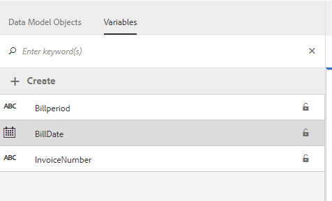
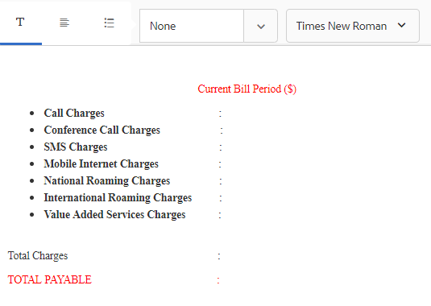
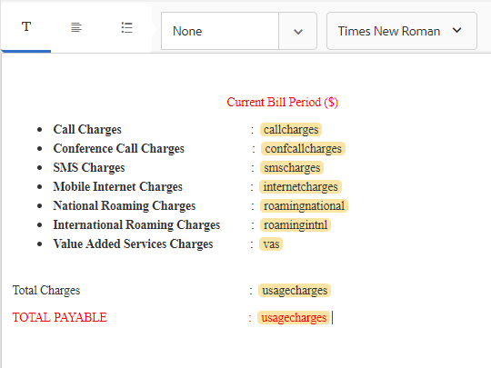
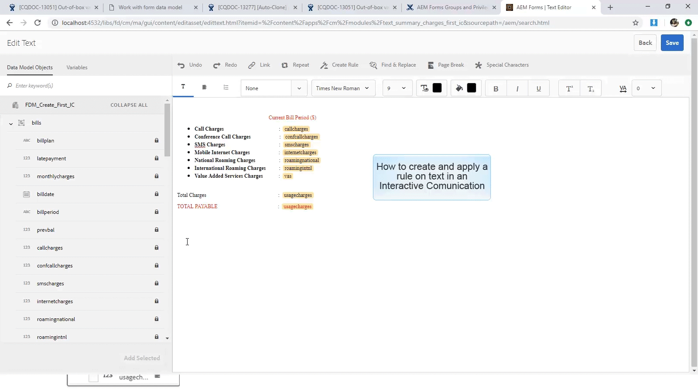

# 教學課程：建立檔案片段{#tutorial-create-document-fragments}

本教學課程是「建立您的第 [一個互動式通訊」系列的一個步驟](/help/forms/using/create-your-first-interactive-communication.md) 。 建議依序依序依序排列，以瞭解、執行和展示完整的教學課程使用案例。

文檔片段是用於構成互動式通信的通信的可重用元件。 檔案片段的類型如下：

* 文字——文字資產是由一或多個文欄位落組成的內容片段。 段落可以是靜態或動態。
* 清單——清單是一組檔案片段，包括文字、清單、條件和影像。
* 條件——條件可讓您根據從表單資料模型接收的資料，定義互動式通訊中包含的內容。

本教學課程將逐步帶您瞭解如何根據「計畫互動式通訊」一節中提供的解剖結構，建立多 [個文字檔案片段](/help/forms/using/planning-interactive-communications.md) 。 在本教學課程結束時，您將能夠：

* 建立檔案片段
* 建立變數
* 建立和套用規則

以下是在本教學課程中建立的檔案片段清單：

* [帳單詳細資訊](../../forms/using/create-document-fragments.md#step-create-bill-details-text-document-fragment)
* [客戶詳細資訊](../../forms/using/create-document-fragments.md#step-create-customer-details-text-document-fragment)
* [帳單摘要](../../forms/using/create-document-fragments.md#step-create-bill-summary-text-document-fragment)
* [費用匯總](../../forms/using/create-document-fragments.md#step-create-summary-of-charges-text-document-fragment)

每個檔案片段包含含靜態文字的欄位、從表單資料模型接收的資料，以及使用Agent UI輸入的資料。 所有這些欄位都在「計畫互 [動通信」部分中描述](/help/forms/using/planning-interactive-communications.md) 。

在本教學課程中建立檔案片段時，會為使用代理UI接收資料的欄位建立變數。

使用 **FDM_Create_First_IC**(如 [Create form data model](../../forms/using/create-form-data-model0.md) section中所述)作為本教程中建立文檔片段的表單資料模型。

## 步驟1:建立清單詳細資訊文本文檔片段 {#step-create-bill-details-text-document-fragment}

「清單詳細資訊」單據分段包含以下欄位：

| 欄位 | 資料來源 |
|---|---|
| 發票編號 | Agent UI |
| 帳單期間 | Agent UI |
| 帳單日期 | Agent UI |
| 您的計畫 | 表單資料模型 |

執行下列步驟，以建立以Agent UI為資料來源之欄位的變數、建立靜態文字，以及在檔案片段中使用表單資料模型元素：

1. 選擇「 **表單** >文 **件片段」**。

1. 選擇「 **建立** > **文字」**。
1. 指定下列資訊：

   1. 在「 **標題」欄位中輸入bill_details_first_ic** 作為 **名稱** 。 標題會自動填入「名稱」 **欄位** 。

   1. 從「 **資料模型」(Data Model** )部分 **選擇「表單資料模型** 」(Form Data Model)。

   1. 選 **擇FDM_Create_First_IC** 作為表單資料模型，並點選 **選擇**。

   1. 點選「 **下一步**」。

1. 在左窗格中 **選取** 「變數」標籤，然後點選「 **建立」**。
1. 在「建 **立變數** 」區段：

   1. 輸入 **發票編號** ，作為變數的名稱。
   1. 選擇「 **字串** 」(String)作為類型。
   1. 點選「 **建立**」。
   

   重複步驟4和5以建立下列變數：

   * 開單期間：字串類型
   * BillDate:日期類型
   

1. 使用右窗格建立下列欄位的靜態文字：

   * 發票編號
   * 帳單期間
   * 帳單日期
   * 您的計畫
   

1. 將游標置於「發票 **否********** 」欄位旁，並按兩下左窗格中「變數」標籤中的「發票編號」變數。
1. 將游標放在「開單期間」 **欄位旁** ，並按兩下「開單期間 **** 」變數。
1. 將游標置於「清單日 **期** 」欄位旁，並按兩下「清 **單日期** 」變數。
1. 在左窗格 **中選擇「資料模型對象** 」頁籤。
1. 將游標置於「您的計 **划** 」欄位旁，按兩下 **customer** > **customerplan** 屬性。

   

1. 按一下 **保存** ，建立「清單詳細資訊」文本文檔片段。

## 步驟2:建立客戶詳細資訊文字檔案片段 {#step-create-customer-details-text-document-fragment}

Customer Details文檔片段包含以下欄位：

| 欄位 | 資料來源 |
|---|---|
| 客戶名稱 | 表單資料模型 |
| 地址 | 表單資料模型 |
| 供應地點 | Agent UI |
| 州代碼 | Agent UI |
| 行動號碼 | 表單資料模型 |
| 備用聯繫人號碼 | 表單資料模型 |
| 關係編號 | 表單資料模型 |
| 連接數 | Agent UI |

執行下列步驟，以建立以Agent UI為資料來源之欄位的變數、建立靜態文字，以及在檔案片段中使用表單資料模型元素：

1. 選擇「 **表單** >文 **件片段」**。
1. 選擇「 **建立** > **文字」**。
1. 指定下列資訊：

   1. 在「 **標題」欄位中輸入customer_details_first_ic****作為名稱** 。 標題會自動填入「名稱」 **欄位** 。

   1. 從「 **資料模型」(Data Model** )部分 **選擇「表單資料模型** 」(Form Data Model)。

   1. 選 **擇FDM_Create_First_IC** 作為表單資料模型，並點選 **選擇**。

   1. 點選「 **下一步**」。

1. 在左窗格中 **選取** 「變數」標籤，然後點選「 **建立」**。
1. 在「建 **立變數** 」區段：

   1. 輸入 **Placesupply** 作為變數的名稱。
   1. 選擇「 **字串** 」(String)作為類型。
   1. 點選「 **建立**」。
   重複步驟4和5以建立下列變數：

   * 狀態碼：數字類型
   * 連接數：數字類型

1. 選擇「 **Data Model Objects** 」(資料模型對象 **)頁籤，將游標置於右窗格中，然後按兩下** customer **>** name（客戶>名稱）屬性。
1. 按Enter鍵將游標移到下一行，然後按兩下 **customer** > **address** 屬性。
1. 使用右窗格建立下列欄位的靜態文字：

   * 行動號碼
   * 備用聯繫人號碼
   * 供應地點
   * 關係編號
   * 州代碼
   * 連接數
   

1. 將游標置於「行 **動號碼** 」欄位旁，然後按兩下 **customer** > **mobilenum** 屬性。
1. 將游標置於「備用聯 **系人號碼** 」欄位旁，按兩下** customer** > **** alternatemobilenumber屬性。
1. 將游標放在「關係編號」( **Relationship Number** )欄位旁，並按兩下 **customer** > **** relationshipnumber屬性。
1. 選擇「 **變數** 」頁籤，將游標置於「供應地點」( **Place of Supply** )欄位旁，然後按兩下「 **Placesupply** 」（供應地點）變數。
1. 將游標置於「狀態代碼 **」欄位旁** ，然後按兩下「狀態 **代碼」變數** 。
1. 將游標置於「連接數 **」欄位旁** ，並按兩下 **Numberconnections** 變數。

   

1. 按一 **下「儲存** 」以建立「客戶詳細資料」文字檔案片段。

## 步驟3:建立清單匯總文本文檔片段 {#step-create-bill-summary-text-document-fragment}

「清單匯總」單據片段包括以下欄位：

| 欄位 | 資料來源 |
|---|---|
| 上一餘額 | Agent UI |
| 付款 | Agent UI |
| 調整 | Agent UI |
| 當前帳單期間費用 | 表單資料模型 |
| 到期金額 | Agent UI |
| 到期日期 | Agent UI |

執行下列步驟，以建立以Agent UI為資料來源之欄位的變數、建立靜態文字，以及在檔案片段中使用表單資料模型元素：

1. 選擇「 **表單** >文 **件片段」**。
1. 選擇「 **建立** > **文字」**。
1. 指定下列資訊：

   1. 在「 **標題」欄位中輸入bill_summary_first_ic** 作為 **名稱** 。 標題會自動填入「名稱」 **欄位** 。

   1. 從「 **資料模型」(Data Model** )部分 **選擇「表單資料模型** 」(Form Data Model)。

   1. 選 **擇FDM_Create_First_IC** 作為表單資料模型，並點選 **選擇**。

   1. 點選「 **下一步**」。

1. 在左窗格中 **選取** 「變數」標籤，然後點選「 **建立」**。
1. 在「建 **立變數** 」區段：

   1. 輸 **入** Previousbalance作為變數的名稱。
   1. 選擇 **Number** （編號）作為類型。
   1. 點選「 **建立**」。
   重複步驟4和5以建立下列變數：

   * 付款：數字類型
   * 調整：數字類型
   * 應付金額：數字類型
   * Duedate:日期類型

1. 使用右窗格建立下列欄位的靜態文字：

   * 上一餘額
   * 付款
   * 調整
   * 當前帳單期間費用
   * 到期金額
   * 到期日期
   * 到期日之後的延遲付款費用為$ 20
   

1. 將游標置於「上一個余 **額** 」欄位旁，並按兩下 **Previousbalance** 變數。
1. 將游標置於「付款」 **欄位旁** ，然後按兩下「付 **** 款」變數。
1. 將游標置於「調整」( **Adjustments** )欄位旁，並按兩下「調 **整」(Adjustments** )變數。
1. 將游標置於「到期 **金額** 」欄位旁，然後按兩下 **「到期金額** 」變數。
1. 將游標置於「到期日 **期** 」欄位旁，然後按兩下「 **Duedate** 」變數。
1. 選擇「 **資料模型對象** 」頁籤，將游標置於右窗格中的「費用」當前開單期間 **，然後按兩下「清單** 」>「 ******** usagecharges屬性」。

   

1. 按一 **下「儲存** 」以建立「客戶詳細資料」文字檔案片段。

## 步驟4:建立費用摘要文本文檔片段 {#step-create-summary-of-charges-text-document-fragment}

費用匯總單據片段包含以下欄位：

| 欄位 | 資料來源 |
|---|---|
| 通話費 | 表單資料模型 |
| 電話會議費用 | 表單資料模型 |
| 簡訊費 | 表單資料模型 |
| 行動網際網路收費 | 表單資料模型 |
| 國家漫遊費用 | 表單資料模型 |
| 國際漫遊費用 | 表單資料模型 |
| 增值服務費用 | 表單資料模型 |
| 費用合計 | 表單資料模型 |
| 應付總額 | 表單資料模型 |

執行以下步驟以建立靜態文本並在文檔片段中使用表單資料模型元素：

1. 選擇「 **表單** >文 **件片段」**。
1. 選擇「 **建立** > **文字」**。
1. 指定下列資訊：

   1. 在「 **標題」(Title)欄位中輸入** summary_charges_first_ic **作為名稱** 。 標題會自動填入「名稱」欄位。

   1. 從「 **資料模型」(Data Model** )部分 **選擇「表單資料模型** 」(Form Data Model)。

   1. 選 **擇FDM_Create_First_IC** 作為表單資料模型，並點選 **選擇**。

   1. 點選「 **下一步**」。

1. 使用右窗格建立下列欄位的靜態文字：

   * 通話費
   * 電話會議費用
   * 簡訊費
   * 行動網際網路收費
   * 國家漫遊費用
   * 國際漫遊費用
   * 增值服務費用
   * 費用合計
   * 應付總額
   

1. 選擇「數 **據模型對象** 」頁籤。
1. 將游標置於「呼叫費 **用** 」欄位旁，並按兩下「 **bills** > **callcharges** 」屬性。
1. 將游標放在「會議呼叫費 **用」欄位旁** ，並按兩下 **bills** > **** confcallcarges屬性。
1. 將游標置於「 **SMS Charges** ( **SMS費用)」欄位旁，並按兩下「** bills **>** smscharges（帳單）」屬性。
1. 將游標置於「 **Mobile Internet Charges** 」欄位旁，並按兩下「 **bills** > **internetcharges** 」屬性。
1. 將游標置於「 **National Roaming Charges** (全國漫遊費用 **)」欄位旁，並按兩下** Bills **>** roamingnational property。
1. 將游標放在「國際漫遊費 **用** 」欄位旁，並按兩下「 **bills** > **roamingintnl** 」屬性。
1. 將游標置於「增值服 **務費用** 」欄位旁，並按兩下 **bills** > **vas** 屬性。
1. 將游標置於「總費 **用** 」欄位旁，並按兩下 **bills** > **usagecharges** 屬性。
1. 將游標置於 **TOTAL PAYABLE** 欄位旁，並按兩下 **bills** > **usagecharges** 屬性。

   

1. 選擇「增值服 **務費用」行中的文本** ，並點選「 **** 建立規則」以建立基於該行在交互通信中顯示的條件：
1. 在「建 **立規則** 」快顯視窗中：

   1. 選擇 **資料模型和變數** ，然 **後選擇清單** > **調用**。

   1. 選 **取小於** （運算元）。
   1. 選擇 **編號** ，然後輸入值 **為60**。
   基於此條件，僅當「呼叫費用」欄位的值小於60時，才顯示「增值服務費用」行。

   

1. 按一下 **保存** ，建立費用匯總文本文檔片段。
