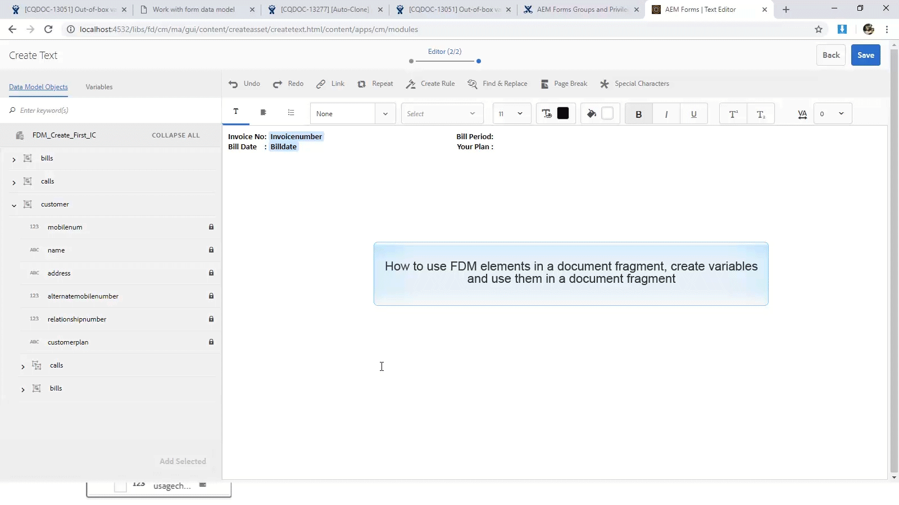

# 教學課程：建立文檔片段{#tutorial-create-document-fragments}

本教學課程是[建立第一個互動式通訊](/help/forms/using/create-your-first-interactive-communication.md)系列中的步驟。 建議您依序依序依序執行系列，以了解、執行和示範完整的教學課程使用案例。

文檔片段是用於構成互動式通信的通信的可重複使用的元件。 檔案片段的類型如下：

* 文字 — 文字資產是由一或多個文欄位落組成的內容片段。 段落可以是靜態的或動態的。
* 清單 — 清單是一組文檔片段，包括文本、清單、條件和影像。
* 條件 — 條件可讓您根據從表單資料模型收到的資料，定義互動式通訊中包含的內容。

本教學課程會逐步引導您完成步驟，以根據[規劃互動式通訊](/help/forms/using/planning-interactive-communications.md)區段中提供的解剖結構建立多個文字檔案片段。 在本教學課程結束時，您將能夠：

* 建立檔案片段
* 建立變數
* 建立和套用規則

以下是在本教學課程中建立的檔案片段清單：

* [帳單詳細資訊](../../forms/using/create-document-fragments.md#step-create-bill-details-text-document-fragment)
* [客戶詳細資訊](../../forms/using/create-document-fragments.md#step-create-customer-details-text-document-fragment)
* [清單匯總](../../forms/using/create-document-fragments.md#step-create-bill-summary-text-document-fragment)
* [費用匯總](../../forms/using/create-document-fragments.md#step-create-summary-of-charges-text-document-fragment)

每個檔案片段都包含含有靜態文字的欄位、從表單資料模型收到的資料，以及使用代理UI輸入的資料。 [規劃互動式通信](/help/forms/using/planning-interactive-communications.md)部分中描述了所有這些欄位。

在本教學課程中建立檔案片段時，會使用代理UI為接收資料的欄位建立變數。

如[建立表單資料模型](../../forms/using/create-form-data-model0.md)一節所述，使用&#x200B;**FDM_Create_First_IC**&#x200B;作為表單資料模型，以在本教學課程中建立文檔片段。

## 步驟1:建立清單詳細資訊文本文檔片段{#step-create-bill-details-text-document-fragment}

「清單詳細資訊」單據片段包括以下欄位：

| 欄位 | 資料來源 |
|---|---|
| 發票編號 | Agent UI |
| 帳單期間 | 代理UI |
| 帳單日期 | 代理UI |
| 您的計畫 | 表單資料模型 |

執行下列步驟為以Agent UI為資料源的欄位建立變數、建立靜態文本，以及在文檔片段中使用表單資料模型元素：

1. 選擇&#x200B;**[!UICONTROL Forms]** > **[!UICONTROL 文檔片段]**。

1. 選擇&#x200B;**Create** > **Text**。
1. 指定下列資訊：

   1. 在&#x200B;**標題**&#x200B;欄位中輸入&#x200B;**bill_details_first_ic**&#x200B;作為名稱。 標題會自動填入&#x200B;**名稱**&#x200B;欄位中。

   1. 從&#x200B;**資料模型**&#x200B;部分選擇&#x200B;**表單資料模型**。

   1. 選擇&#x200B;**FDM_Create_First_IC**&#x200B;作為表單資料模型，然後點選&#x200B;**選擇**。

   1. 點選&#x200B;**Next**。

1. 在左窗格中選擇&#x200B;**變數**&#x200B;標籤，然後點選&#x200B;**建立**。
1. 在&#x200B;**建立變數**&#x200B;區段中：

   1. 輸入&#x200B;**Invoicenumber**&#x200B;作為變數的名稱。
   1. 選擇&#x200B;**字串**&#x200B;作為類型。
   1. 點選&#x200B;**建立**。

   

   重複步驟4和5以建立下列變數：

   * 計費週期：字串類型
   * 帳單日期：日期類型

   

1. 使用右窗格建立以下欄位的靜態文本：

   * 發票編號
   * 帳單期間
   * 帳單日期
   * 您的計畫

   

1. 將游標放在&#x200B;**發票編號**&#x200B;欄位旁，並從左窗格的&#x200B;**變數**&#x200B;標籤中按兩下&#x200B;**InvoiceNumber**&#x200B;變數。
1. 將游標置於&#x200B;**Bill Period**&#x200B;欄位旁，然後按兩下&#x200B;**Billperiod**&#x200B;變數。
1. 將游標置於&#x200B;**Bill Date**&#x200B;欄位旁，然後按兩下&#x200B;**Bill Date**&#x200B;變數。
1. 在左窗格中選擇&#x200B;**資料模型對象**&#x200B;頁簽。
1. 將游標置於&#x200B;**Your Plan**&#x200B;欄位旁，然後按兩下&#x200B;**customer** > **customerplan**&#x200B;屬性。

   

1. 按一下&#x200B;**保存**&#x200B;以建立「清單詳細資訊」文本文檔片段。

## 步驟2:建立客戶詳細資訊文本文檔片段{#step-create-customer-details-text-document-fragment}

「客戶詳細資訊」檔案片段包含下列欄位：

| 欄位 | 資料來源 |
|---|---|
| 客戶名稱 | 表單資料模型 |
| 地址 | 表單資料模型 |
| 供應地 | 代理UI |
| 狀態代碼 | 代理UI |
| 行動號碼 | 表單資料模型 |
| 備用聯繫人號碼 | 表單資料模型 |
| 關係編號 | 表單資料模型 |
| 連接數 | 代理UI |

執行下列步驟為以Agent UI為資料源的欄位建立變數、建立靜態文本，以及在文檔片段中使用表單資料模型元素：

1. 選擇&#x200B;**[!UICONTROL Forms]** > **[!UICONTROL 文檔片段]**。
1. 選擇&#x200B;**Create** > **Text**。
1. 指定下列資訊：

   1. 在&#x200B;**Title**&#x200B;欄位中輸入&#x200B;**customer_details_first_ic**&#x200B;作為名稱。 標題會自動填入&#x200B;**名稱**&#x200B;欄位中。

   1. 從&#x200B;**資料模型**&#x200B;部分選擇&#x200B;**表單資料模型**。

   1. 選擇&#x200B;**FDM_Create_First_IC**&#x200B;作為表單資料模型，然後點選&#x200B;**選擇**。

   1. 點選&#x200B;**Next**。

1. 在左窗格中選擇&#x200B;**變數**&#x200B;標籤，然後點選&#x200B;**建立**。
1. 在&#x200B;**建立變數**&#x200B;區段中：

   1. 輸入&#x200B;**Placesupply**&#x200B;作為變數的名稱。
   1. 選擇&#x200B;**字串**&#x200B;作為類型。
   1. 點選&#x200B;**建立**。

   重複步驟4和5以建立下列變數：

   * 狀態代碼：數字類型
   * 數字連接：數字類型

1. 選擇&#x200B;**資料模型對象**&#x200B;頁簽，將游標置於右窗格中，然後按兩下&#x200B;**customer** > **name**&#x200B;屬性。
1. 按Enter鍵將游標移至下一行，然後按兩下&#x200B;**customer** > **address**&#x200B;屬性。
1. 使用右窗格建立以下欄位的靜態文本：

   * 行動號碼
   * 備用聯繫人號碼
   * 供應地
   * 關係編號
   * 狀態代碼
   * 連接數

   

1. 將游標置於&#x200B;**Mobile Number**&#x200B;欄位旁，然後按兩下&#x200B;**customer** > **mobilenum**&#x200B;屬性。
1. 將游標置於&#x200B;**備用聯繫人號碼**&#x200B;欄位旁，然後按兩下** customer** > **替代mobilenumber**&#x200B;屬性。
1. 將游標置於&#x200B;**Relationship Number**&#x200B;欄位旁，然後按兩下&#x200B;**customer** > **relationshipnumber**&#x200B;屬性。
1. 選擇&#x200B;**變數**&#x200B;頁簽，將游標置於&#x200B;**供應地點**&#x200B;欄位旁，然後按兩下&#x200B;**供應地點**&#x200B;變數。
1. 將游標置於&#x200B;**State Code**&#x200B;欄位旁，然後按兩下&#x200B;**Statecode**&#x200B;變數。
1. 將游標置於&#x200B;**連接數**&#x200B;欄位旁，然後按兩下&#x200B;**Numberconnections**&#x200B;變數。

   

1. 按一下「**儲存**」以建立「客戶詳細資訊」文字檔案片段。

## 步驟3:建立清單匯總文本文檔片段{#step-create-bill-summary-text-document-fragment}

「清單匯總」單據片段包括以下欄位：

| 欄位 | 資料來源 |
|---|---|
| 上一餘額 | 代理UI |
| 付款 | 代理UI |
| 調整 | 代理UI |
| 當前帳單期間費用 | 表單資料模型 |
| 到期金額 | 代理UI |
| 到期日期 | 代理UI |

執行下列步驟為以Agent UI為資料源的欄位建立變數、建立靜態文本，以及在文檔片段中使用表單資料模型元素：

1. 選擇&#x200B;**[!UICONTROL Forms]** > **[!UICONTROL 文檔片段]**。
1. 選擇&#x200B;**Create** > **Text**。
1. 指定下列資訊：

   1. 在&#x200B;**Title**&#x200B;欄位中輸入&#x200B;**bill_summary_first_ic**&#x200B;作為名稱。 標題會自動填入&#x200B;**名稱**&#x200B;欄位中。

   1. 從&#x200B;**資料模型**&#x200B;部分選擇&#x200B;**表單資料模型**。

   1. 選擇&#x200B;**FDM_Create_First_IC**&#x200B;作為表單資料模型，然後點選&#x200B;**選擇**。

   1. 點選&#x200B;**Next**。

1. 在左窗格中選擇&#x200B;**變數**&#x200B;標籤，然後點選&#x200B;**建立**。
1. 在&#x200B;**建立變數**&#x200B;區段中：

   1. 輸入&#x200B;**Previousbalance**&#x200B;作為變數的名稱。
   1. 選擇&#x200B;**數字**&#x200B;作為類型。
   1. 點選&#x200B;**建立**。

   重複步驟4和5以建立下列變數：

   * 付款：數字類型
   * 調整：數字類型
   * 到期款項：數字類型
   * 重複：日期類型

1. 使用右窗格建立以下欄位的靜態文本：

   * 上一餘額
   * 付款
   * 調整
   * 當前帳單期間費用
   * 到期金額
   * 到期日期
   * 到期日後的延遲付款費用為$ 20

   

1. 將游標置於&#x200B;**Previous Balance**&#x200B;欄位旁，然後按兩下&#x200B;**Previousbalance**&#x200B;變數。
1. 將游標置於&#x200B;**Payments**&#x200B;欄位旁，然後按兩下&#x200B;**Payments**&#x200B;變數。
1. 將游標置於&#x200B;**Adjustments**&#x200B;欄位旁，然後按兩下&#x200B;**Adjustments**&#x200B;變數。
1. 將游標置於&#x200B;**到期金額**&#x200B;欄位旁，然後按兩下&#x200B;**到期金額**&#x200B;變數。
1. 將游標放在&#x200B;**到期日**&#x200B;欄位旁，然後按兩下&#x200B;**Duedate**&#x200B;變數。
1. 選擇「**資料模型對象**」頁簽，將游標置於右窗格的「**計費當前開單期間**」欄位旁，然後按兩下&#x200B;**清單** > **usagecharges**&#x200B;屬性。

   

1. 按一下「**儲存**」以建立「客戶詳細資訊」文字檔案片段。

## 步驟4:建立費用摘要文本文檔片段{#step-create-summary-of-charges-text-document-fragment}

費用匯總文檔片段包括以下欄位：

| 欄位 | 資料來源 |
|---|---|
| 通話費 | 表單資料模型 |
| 電話會議費 | 表單資料模型 |
| 簡訊指控 | 表單資料模型 |
| 行動網際網路收費 | 表單資料模型 |
| 國家漫遊費 | 表單資料模型 |
| 國際漫遊費 | 表單資料模型 |
| 增值服務費 | 表單資料模型 |
| 總費用 | 表單資料模型 |
| 應付總額 | 表單資料模型 |

執行下列步驟以建立靜態文字，並在檔案片段中使用表單資料模型元素：

1. 選擇&#x200B;**[!UICONTROL Forms]** > **[!UICONTROL 文檔片段]**。
1. 選擇&#x200B;**Create** > **Text**。
1. 指定下列資訊：

   1. 在&#x200B;**Title**&#x200B;欄位中輸入&#x200B;**summary_charges_first_ic**&#x200B;作為名稱。 標題會自動填入「名稱」欄位中。

   1. 從&#x200B;**資料模型**&#x200B;部分選擇&#x200B;**表單資料模型**。

   1. 選擇&#x200B;**FDM_Create_First_IC**&#x200B;作為表單資料模型，然後點選&#x200B;**選擇**。

   1. 點選&#x200B;**Next**。

1. 使用右窗格建立以下欄位的靜態文本：

   * 通話費
   * 電話會議費
   * 簡訊指控
   * 行動網際網路收費
   * 國家漫遊費
   * 國際漫遊費
   * 增值服務費
   * 總費用
   * 應付總額

   

1. 選擇&#x200B;**資料模型對象**&#x200B;頁簽。
1. 將游標置於&#x200B;**呼叫費用**&#x200B;欄位旁，然後按兩下&#x200B;**bills** > **callcharges**&#x200B;屬性。
1. 將游標置於&#x200B;**會議呼叫費用**&#x200B;欄位旁，然後按兩下&#x200B;**bills** > **confcallcarchers**&#x200B;屬性。
1. 將游標置於&#x200B;**SMS Charges**&#x200B;欄位旁，然後按兩下&#x200B;**bills** > **smscharges**&#x200B;屬性。
1. 將游標置於&#x200B;**Mobile Internet Carges**&#x200B;欄位旁，然後按兩下&#x200B;**bills** > **internetcharges**&#x200B;屬性。
1. 將游標置於&#x200B;**國家漫遊費用**&#x200B;欄位旁，然後按兩下&#x200B;**bills** > **roamingnational**&#x200B;屬性。
1. 將游標置於&#x200B;**國際漫遊費用**&#x200B;欄位旁，然後按兩下&#x200B;**bills** > **roamingintnl**&#x200B;屬性。
1. 將游標置於&#x200B;**Value Added Services Charges**&#x200B;欄位旁，然後按兩下&#x200B;**bills** > **vas**&#x200B;屬性。
1. 將游標置於&#x200B;**總費用**&#x200B;欄位旁，然後按兩下&#x200B;**bills** > **usagecharges**&#x200B;屬性。
1. 將游標置於&#x200B;**TOTAL PAYABLE**&#x200B;欄位旁，然後按兩下&#x200B;**bills** > **usagecharges**&#x200B;屬性。

   

1. 在&#x200B;**Value Added Services Charges**&#x200B;行中選擇文本，然後點選&#x200B;**Create Rule**&#x200B;以建立條件，根據該條件在Interactive Communication中顯示該行：
1. 在&#x200B;**建立規則**&#x200B;快顯視窗中：

   1. 選擇&#x200B;**資料模型和變數**，然後選擇&#x200B;**bills** > **callcharges**。

   1. 選擇&#x200B;**小於**&#x200B;作為運算子。
   1. 選擇&#x200B;**Number**&#x200B;並輸入值為&#x200B;**60**。

   根據此條件，僅當「呼叫費用」欄位的值小於60時，才會顯示「增值服務費用」行。

   

1. 按一下「**保存**」以建立費用摘要文本文檔片段。
