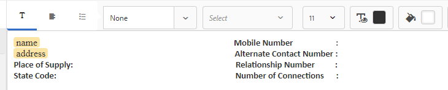

# 教程：建立文檔片段{#tutorial-create-document-fragments}

本教程是 [建立您的第一個互動式通信](/help/forms/using/create-your-first-interactive-communication.md) 的下界。 建議按時間順序按系列進行操作，以瞭解、執行和演示完整的教程使用案例。

文檔片段是用於構成互動式通信的通信的可重用元件。 文檔片段的類型如下：

* 文本 — 文本資產是由一個或多個文本段落組成的內容。 段落可以是靜態的或動態的。
* 清單 — 清單是一組文檔片段，包括文本、清單、條件和影像。
* 條件 — 條件使您能夠根據從表單資料模型接收的資料定義在交互通信中包含的內容。

本教程將指導您完成以下步驟：根據中提供的解剖結構建立多個文本文檔片段 [規劃互動式通信](/help/forms/using/planning-interactive-communications.md) 的子菜單。 在本教程的結束時，您將能夠：

* 建立文檔片段
* 建立變數
* 建立和應用規則

以下是在本教程中建立的文檔片段清單：

* [清單詳細資訊](../../forms/using/create-document-fragments.md#step-create-bill-details-text-document-fragment)
* [客戶詳細資訊](../../forms/using/create-document-fragments.md#step-create-customer-details-text-document-fragment)
* [清單匯總](../../forms/using/create-document-fragments.md#step-create-bill-summary-text-document-fragment)
* [費用匯總](../../forms/using/create-document-fragments.md#step-create-summary-of-charges-text-document-fragment)

每個文檔片段包括具有靜態文本的欄位、從表單資料模型接收的資料以及使用代理UI輸入的資料。 所有這些欄位都在 [規劃互動式通信](/help/forms/using/planning-interactive-communications.md) 的子菜單。

在本教程中建立文檔片段時，將為使用代理UI接收資料的欄位建立變數。

使用 **FDM_Create_First_IC**，如中所述 [建立表單資料模型](../../forms/using/create-form-data-model0.md) 部分，作為本教程中建立文檔片段的窗體資料模型。

## 步驟1:建立清單詳細資訊文本文檔片段 {#step-create-bill-details-text-document-fragment}

「清單詳細資訊」單據段包括以下欄位：

| 欄位 | 資料來源 |
|---|---|
| 發票編號 | Agent UI |
| 清單期間 | Agent UI |
| 帳單日期 | Agent UI |
| 您的計畫 | 窗體資料模型 |

執行以下步驟，為以Agent UI為資料源的欄位建立變數，建立靜態文本，並在文檔片段中使用表單資料模型元素：

1. 選擇 **[!UICONTROL Forms]** > **[!UICONTROL 文檔片段]**。

1. 選擇 **建立** > **文本**。
1. 指定以下資訊：

   1. 輸入 **bill_details_first_ic** 在 **標題** 的子菜單。 標題在 **名稱** 的子菜單。

   1. 選擇 **窗體資料模型** 從 **資料模型** 的子菜單。

   1. 選擇 **FDM_Create_First_IC** 表單資料模型和點擊 **選擇**。

   1. 點擊 **下一個**。

1. 選擇 **變數** 頁籤，然後點擊 **建立**。
1. 在 **建立變數** 部分：

   1. 輸入 **發票編號** 作為變數的名稱。
   1. 選擇 **字串** 的雙曲餘切值。
   1. 點擊 **建立**。

   

   重複步驟4和5以建立以下變數：

   * 開單期間：字串類型
   * 帳單日期：日期類型

   

1. 使用右窗格為以下欄位建立靜態文本：

   * 發票編號
   * 清單期間
   * 帳單日期
   * 您的計畫

   

1. 將游標置於 **發票編號** ，然後按兩下 **發票編號** 變數 **變數** 的子菜單。
1. 將游標置於 **清單期間** ，然後按兩下 **開單期間** 變數。
1. 將游標置於 **帳單日期** ，然後按兩下 **帳單日期** 變數。
1. 選擇 **資料模型對象** 的子菜單。
1. 將游標置於 **您的計畫** ，然後按兩下 **客戶** > **客戶計畫** 屬性。

   

1. 按一下 **保存** 建立「清單詳細資訊」文本文檔片段。

## 步驟2:建立客戶詳細資訊文本文檔片段 {#step-create-customer-details-text-document-fragment}

「客戶詳細資訊」文檔段包括以下欄位：

| 欄位 | 資料來源 |
|---|---|
| 客戶名稱 | 窗體資料模型 |
| 地址 | 窗體資料模型 |
| 供應地點 | Agent UI |
| 狀態代碼 | Agent UI |
| 移動號碼 | 窗體資料模型 |
| 備用聯繫人號碼 | 窗體資料模型 |
| 關係編號 | 窗體資料模型 |
| 連接數 | Agent UI |

執行以下步驟，為以Agent UI為資料源的欄位建立變數，建立靜態文本，並在文檔片段中使用表單資料模型元素：

1. 選擇 **[!UICONTROL Forms]** > **[!UICONTROL 文檔片段]**。
1. 選擇 **建立** > **文本**。
1. 指定以下資訊：

   1. 輸入 **customer_details_first_ic** 在 **標題** 的子菜單。 標題在 **名稱** 的子菜單。

   1. 選擇 **窗體資料模型** 從 **資料模型** 的子菜單。

   1. 選擇 **FDM_Create_First_IC** 表單資料模型和點擊 **選擇**。

   1. 點擊 **下一個**。

1. 選擇 **變數** 頁籤，然後點擊 **建立**。
1. 在 **建立變數** 部分：

   1. 輸入 **平鋪** 作為變數的名稱。
   1. 選擇 **字串** 的雙曲餘切值。
   1. 點擊 **建立**。

   重複步驟4和5以建立以下變數：

   * 狀態代碼：編號類型
   * 數字連接：編號類型

1. 選擇 **資料模型對象** 頁籤，將游標置於右窗格中，然後按兩下 **客戶** > **名稱** 屬性。
1. 按Enter鍵將游標移到下一行，然後按兩下 **客戶** > **地址** 屬性。
1. 使用右窗格為以下欄位建立靜態文本：

   * 移動號碼
   * 備用聯繫人號碼
   * 供應地點
   * 關係編號
   * 狀態代碼
   * 連接數

   

1. 將游標置於 **移動號碼** ，然後按兩下 **客戶** > **移動枚舉** 屬性。
1. 將游標置於 **備用聯繫人號碼** 欄位並按兩下客戶** > **替代移動遺傳號** 屬性。
1. 將游標置於 **關係編號** ，然後按兩下 **客戶** > **關係編號** 屬性。
1. 選擇 **變數** 頁籤，將游標置於 **供應地點** ，然後按兩下 **平鋪** 變數。
1. 將游標置於 **狀態代碼** ，然後按兩下 **狀態代碼** 變數。
1. 將游標置於 **連接數** ，然後按兩下 **數字連接** 變數。

   

1. 按一下 **保存** 建立「客戶詳細資訊」文本文檔片段。

## 第3步：建立清單匯總文本文檔片段 {#step-create-bill-summary-text-document-fragment}

「清單匯總」單據段包括以下欄位：

| 欄位 | 資料來源 |
|---|---|
| 上一餘額 | Agent UI |
| 付款 | Agent UI |
| 調整 | Agent UI |
| 費用當前開單期間 | 窗體資料模型 |
| 到期金額 | Agent UI |
| 到期日期 | Agent UI |

執行以下步驟，為以Agent UI為資料源的欄位建立變數，建立靜態文本，並在文檔片段中使用表單資料模型元素：

1. 選擇 **[!UICONTROL Forms]** > **[!UICONTROL 文檔片段]**。
1. 選擇 **建立** > **文本**。
1. 指定以下資訊：

   1. 輸入 **bill_summary_first_ic** 在 **標題** 的子菜單。 標題在 **名稱** 的子菜單。

   1. 選擇 **窗體資料模型** 從 **資料模型** 的子菜單。

   1. 選擇 **FDM_Create_First_IC** 表單資料模型和點擊 **選擇**。

   1. 點擊 **下一個**。

1. 選擇 **變數** 頁籤，然後點擊 **建立**。
1. 在 **建立變數** 部分：

   1. 輸入 **前期餘額** 作為變數的名稱。
   1. 選擇 **數字** 的雙曲餘切值。
   1. 點擊 **建立**。

   重複步驟4和5以建立以下變數：

   * 付款：編號類型
   * 調整：編號類型
   * 應付款項：編號類型
   * 杜代特：日期類型

1. 使用右窗格為以下欄位建立靜態文本：

   * 上一餘額
   * 付款
   * 調整
   * 費用當前開單期間
   * 到期金額
   * 到期日期
   * 到期日後的延遲付款費用為$ 20

   

1. 將游標置於 **上一餘額** ，然後按兩下 **前期餘額** 變數。
1. 將游標置於 **付款** ，然後按兩下 **付款** 變數。
1. 將游標置於 **調整** ，然後按兩下 **調整** 變數。
1. 將游標置於 **到期金額** ，然後按兩下 **應付款項** 變數。
1. 將游標置於 **到期日** ，然後按兩下 **杜代泰** 變數。
1. 選擇 **資料模型對象** 頁籤，將游標置於 **費用當前開單期間** ，然後按兩下 **票據** > **烏薩傑查爾** 屬性。

   

1. 按一下 **保存** 建立「客戶詳細資訊」文本文檔片段。

## 第4步：建立費用匯總文本文檔片段 {#step-create-summary-of-charges-text-document-fragment}

費用摘要文檔片段包括以下欄位：

| 欄位 | 資料來源 |
|---|---|
| 呼叫費用 | 窗體資料模型 |
| 電話會議費用 | 窗體資料模型 |
| 簡訊費 | 窗體資料模型 |
| 移動網際網路收費 | 窗體資料模型 |
| 國家漫遊費用 | 窗體資料模型 |
| 國際漫遊費用 | 窗體資料模型 |
| 增值服務費 | 窗體資料模型 |
| 費用合計 | 窗體資料模型 |
| 應付總額 | 窗體資料模型 |

執行以下步驟以建立靜態文本並使用文檔片段中的表單資料模型元素：

1. 選擇 **[!UICONTROL Forms]** > **[!UICONTROL 文檔片段]**。
1. 選擇 **建立** > **文本**。
1. 指定以下資訊：

   1. 輸入 **summary_charges_first_ic** 在 **標題** 的子菜單。 標題在「名稱」(Name)欄位中自動填充。

   1. 選擇 **窗體資料模型** 從 **資料模型** 的子菜單。

   1. 選擇 **FDM_Create_First_IC** 表單資料模型和點擊 **選擇**。

   1. 點擊 **下一個**。

1. 使用右窗格為以下欄位建立靜態文本：

   * 呼叫費用
   * 電話會議費用
   * 簡訊費
   * 移動網際網路收費
   * 國家漫遊費用
   * 國際漫遊費用
   * 增值服務費
   * 費用合計
   * 應付總額

   

1. 選擇 **資料模型對象** 頁籤。
1. 將游標置於 **呼叫費用** ，然後按兩下 **票據** > **催繳費** 屬性。
1. 將游標置於 **電話會議費用** ，然後按兩下 **票據** > **指控** 屬性。
1. 將游標置於 **簡訊費** ，然後按兩下 **票據** > **smc費用** 屬性。
1. 將游標置於 **移動網際網路收費** ，然後按兩下 **票據** > **網際網路收費** 屬性。
1. 將游標置於 **國家漫遊費用** ，然後按兩下 **票據** > **羅阿曼族** 屬性。
1. 將游標置於 **國際漫遊費用** ，然後按兩下 **票據** > **羅曼寧** 屬性。
1. 將游標置於 **增值服務費** ，然後按兩下 **票據** > **增值服務** 屬性。
1. 將游標置於 **費用合計** ，然後按兩下 **票據** > **烏薩傑查爾** 屬性。
1. 將游標置於 **應付總額** ，然後按兩下 **票據** > **烏薩傑查爾** 屬性。

   

1. 選擇 **增值服務費** 行和點擊 **建立規則** 建立基於在交互通信中顯示行的條件：
1. 在 **建立規則** 彈出窗口：

   1. 選擇 **資料模型和變數** 然後 **票據** > **催繳費**。

   1. 選擇 **小於** 作為運算子。
   1. 選擇 **數字** 並輸入值 **60**。

   基於此條件，僅當「呼叫費用」欄位的值小於60時，才會顯示「增值服務費用」行。

   

1. 按一下 **保存** 建立費用匯總文本文檔片段。
