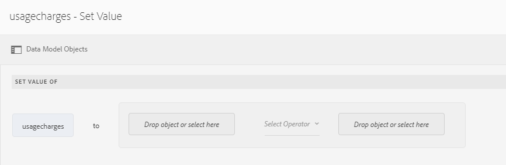
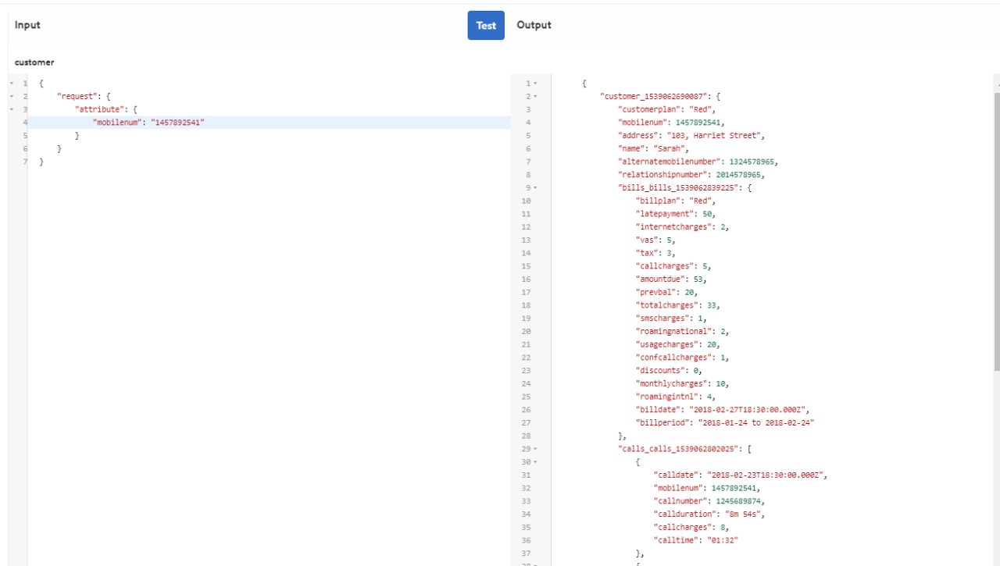

# Tutorial: Create form data model{#tutorial-create-form-data-model}


本教學課程是「建立您的第 [一個互動式通訊」系列的一個步驟](/help/forms/using/create-your-first-interactive-communication.md) 。 建議依序依序依序排列，以瞭解、執行和展示完整的教學課程使用案例。

## 關於教學課程 {#about-the-tutorial}

AEM Forms資料整合模組可讓您從不同的後端資料來源建立表單資料模型，例如AEM使用者設定檔、REST風格的web services、SOAP架構的web services、OData服務和關聯式資料庫。 您可以在表單資料模型中配置資料模型對象和服務，並將其與自適應表單關聯。 最適化表單欄位會系結至資料模型物件屬性。 這些服務可讓您預先填寫最適化表單，並將提交的表單資料寫回資料模型物件。

如需表單資料整合和表單資料模型的詳細資訊，請參 [閱AEM Forms Data Integration](https://helpx.adobe.com/experience-manager/6-3/forms/using/data-integration.html)。

本教學課程會逐步帶您準備、建立、設定表單資料模型，並將之與互動式通訊建立關聯。 在本教學課程結束時，您將能夠：

* [設定資料庫](../../forms/using/create-form-data-model0.md#step-set-up-the-database)
* [將MySQL資料庫配置為資料源](../../forms/using/create-form-data-model0.md#step-configure-mysql-database-as-data-source)
* [建立表單資料模型](../../forms/using/create-form-data-model0.md#step-create-form-data-model)
* [設定表單資料模型](../../forms/using/create-form-data-model0.md#step-configure-form-data-model)
* [測試表單資料模型](../../forms/using/create-form-data-model0.md#step-test-form-data-model-and-services)

表單資料模型看起來類似下列：


**答：** 已設定資料來源 **B.** 資料源結 **構** C.可用服 **務D.** 資料模型物 **件E.** 已配置服務

## 必備條件 {#prerequisites}

開始之前，請確定您有下列項目：

* MySQL資料庫，其中包含「設定資料庫」部 [分中所述的示例資料](../../forms/using/create-form-data-model0.md#step-set-up-the-database) 。
* MySQL JDBC驅動程式的OSGi包，如捆綁JDBC數 [據庫驅動程式中所述](https://helpx.adobe.com/experience-manager/6-3/help/sites-developing/jdbc.html#bundling-the-jdbc-database-driver)

## 步驟1:設定資料庫 {#step-set-up-the-database}

建立互動式通訊時，資料庫是不可或缺的。 本教學課程使用資料庫來顯示「表單資料模型」和「互動式通訊」的永續性功能。 設定包含客戶、帳單和呼叫表的資料庫。
下圖說明客戶表格的示例資料：


使用以下DDL語句在資料庫中 **建立** customer表。

```sql
CREATE TABLE `customer` (
   `mobilenum` int(11) NOT NULL,
   `name` varchar(45) NOT NULL,
   `address` varchar(45) NOT NULL,
   `alternatemobilenumber` int(11) DEFAULT NULL,
   `relationshipnumber` int(11) DEFAULT NULL,
   `customerplan` varchar(45) DEFAULT NULL,
   PRIMARY KEY (`mobilenum`),
   UNIQUE KEY `mobilenum_UNIQUE` (`mobilenum`)
 ) ENGINE=InnoDB DEFAULT CHARSET=utf8
```

使用以下DDL語句在資料庫中 **建立** bills表。

```sql
CREATE TABLE `bills` (
   `billplan` varchar(45) NOT NULL,
   `latepayment` decimal(4,2) NOT NULL,
   `monthlycharges` decimal(4,2) NOT NULL,
   `billdate` date NOT NULL,
   `billperiod` varchar(45) NOT NULL,
   `prevbal` decimal(4,2) NOT NULL,
   `callcharges` decimal(4,2) NOT NULL,
   `confcallcharges` decimal(4,2) NOT NULL,
   `smscharges` decimal(4,2) NOT NULL,
   `internetcharges` decimal(4,2) NOT NULL,
   `roamingnational` decimal(4,2) NOT NULL,
   `roamingintnl` decimal(4,2) NOT NULL,
   `vas` decimal(4,2) NOT NULL,
   `discounts` decimal(4,2) NOT NULL,
   `tax` decimal(4,2) NOT NULL,
   PRIMARY KEY (`billplan`)
 ) ENGINE=InnoDB DEFAULT CHARSET=utf8
```

使用以下DDL語句在資料庫中 **建立** 調用表。

```sql
CREATE TABLE `calls` (
   `mobilenum` int(11) DEFAULT NULL,
   `calldate` date DEFAULT NULL,
   `calltime` varchar(45) DEFAULT NULL,
   `callnumber` int(11) DEFAULT NULL,
   `callduration` varchar(45) DEFAULT NULL,
   `callcharges` decimal(4,2) DEFAULT NULL,
   `calltype` varchar(45) DEFAULT NULL
 ) ENGINE=InnoDB DEFAULT CHARSET=utf8
```

呼 **叫表包括** 呼叫詳細資訊，如呼叫日期、呼叫時間、呼叫號碼、呼叫持續時間和呼叫費用。 客戶 **表使用** 「行動號碼(mobilenum)」欄位連結至呼叫表。 對於客戶表格中列出的每 **個行動** ，呼叫表格中會有多 **個記錄** 。 例如，您可以參照呼叫表來檢索 **1457892541** **Mobile號碼的呼叫詳細** 資訊。

清 **單表** 包括清單詳細資訊，如帳單日期、帳單期間、月費和通話費。 客戶 **表使用「清單計** 划 **** 」欄位連結至清單表。 客戶表中有與每個客戶關聯的 **計畫** 。 清 **單表** 包括所有現有計畫的定價詳細資訊。 例如，您可以從客戶表中檢索 **Sarah** 的計畫詳細資訊，並使用 **這些詳細資訊從清單表中檢索定** 價詳細資訊 **** 。

## 步驟2:將MySQL資料庫配置為資料源 {#step-configure-mysql-database-as-data-source}

您可以設定不同類型的資料來源以建立表單資料模型。 在本教程中，您將配置已配置並填入示例資料的MySQL資料庫。 如需其他支援資料來源的詳細資訊以及如何設定這些資料來源，請參 [閱AEM Forms Data Integration](https://helpx.adobe.com/experience-manager/6-3/forms/using/data-integration.html)。

執行下列操作以配置MySQL資料庫：

1. 將MySQL資料庫的JDBC驅動程式作為OSGi包安裝：

   1. 以管理員身分登入AEM Forms Author Instance，然後前往AEM網頁主控台組合。 預設URL為 [https://localhost:4502/system/console/bundles](https://localhost:4502/system/console/bundles)。
   1. 點選 **安裝／更新**。 出現 **「上載／安裝組合** 」對話框。

   1. 按一下 **選擇檔案** ，瀏覽並選擇MySQL JDBC驅動程式OSGi包。 選擇「 **啟動Bundle** 」和「 **刷新包」**，並點選「 **安裝** 」或「 ****&#x200B;更新包」。 確保Oracle Corporation的MySQL JDBC驅動程式處於活動狀態。 已安裝驅動程式。

1. 將MySQL資料庫配置為資料源：

   1. 前往https://localhost:4502/system/console/configMgr的AEM網頁主控 [台](https://localhost:4502/system/console/configMgr)。
   1. 找到 **Apache Sling Connection Pooled DataSource組態** 。 點選以在編輯模式中開啟設定。
   1. 在設定對話方塊中，指定下列詳細資訊：

      * **資料來源名稱：** 您可以指定任何名稱。 例如，指定 **MySQL**。

      * **DataSource服務屬性名稱**:指定包含DataSource名稱的服務屬性名稱。 在將資料源實例註冊為OSGi服務時指定。 例如， **datasource.name**。

      * **JDBC驅動程式類**:指定JDBC驅動程式的Java類名。 對於MySQL資料庫，請 **指定com.mysql.jdbc.Driver**。

      * **JDBC連接URI**:指定資料庫的連線URL。 對於在埠3306和模式teleca上運行的MySQL資料庫，URL為： `jdbc:mysql://[server]:3306/teleca?autoReconnect=true&useUnicode=true&characterEncoding=utf-8`
      * **使用者名稱：** 資料庫的用戶名。 必須啟用JDBC驅動程式才能與資料庫建立連接。
      * **密碼：** 資料庫的口令。 必須啟用JDBC驅動程式才能與資料庫建立連接。
      * **借閱測試：** 啟用「 **借閱時測試** 」選項。

      * **回訪時測試：** 啟用「 **Test on Return** 」選項。

      * **驗證查詢：** 指定SQL SELECT查詢以驗證池中的連接。 查詢至少必須返回一行。 例如，從 **客戶選擇***。

      * **事務隔離**:將值設定為 **READ_COMMITTED**。
   將其他屬性保留為預設 [值](https://tomcat.apache.org/tomcat-7.0-doc/jdbc-pool.html) ，然後點 **選「儲存**」。

   系統會建立類似下列的設定。

   

## Step 3: Create form data model {#step-create-form-data-model}

AEM Forms提供直覺式使用者介面， [從設定的資](https://helpx.adobe.com/experience-manager/6-3/forms/using/data-integration.html#main-pars_header_1524967585)料來源建立表單資料模型。 您可以在表單資料模型中使用多個資料來源。 在本教程中，您將使用MySQL作為資料源。

執行下列動作以建立表單資料模型：

1. 在AEM作者例項中，導覽至「表 **單** >資 **料整合」**。
1. Tap **Create** > **Form Data Model**.
1. 在「建立表單資料模型」嚮導中，為表 **單資料** 模型指定名稱。 例如， **FDM_Create_First_IC**。 點選「 **下一步**」。
1. 選取資料來源畫面會列出所有已設定的資料來源。 選擇 **MySQL資料源** ，然後按一下 **建立**。

   

1. 按一 **下完成**。 將 **建立FDM_Create_First_IC** 表單資料模型。

## 步驟4:設定表單資料模型 {#step-configure-form-data-model}

設定表單資料模型包括：

* [添加資料模型對象和服務](#add-data-model-objects-and-services)
* [建立資料模型對象的計算子屬性](#create-computed-child-properties-for-data-model-object)
* [添加資料模型對象之間的關聯](#add-associations-between-data-model-objects)
* [編輯資料模型對象屬性](#edit-data-model-object-properties)
* [為資料模型對象配置服務](#configure-services)

### 新增資料模型物件和服務 {#add-data-model-objects-and-services}

1. 在AEM作者例項上，導覽至「表 **單** >資 **料整合」**。 預設URL為 [https://localhost:4502/aem/forms.html/content/dam/formsanddocuments-fdm](https://localhost:4502/aem/forms.html/content/dam/formsanddocuments-fdm)。
1. 此處 **列出了您先前建立的FDM_Create_First_IC** 表單資料模型。 選取它並點選「 **編輯**」。

   選定的資料源 **MySQL** 將顯示在 **資料源窗格中** 。

   

1. 展開 **MySQL資料源** 樹。 從Teleca架構中選擇以下資料模型對 **像和服** 務：

   * **資料模型物件**:

      * bills
      * 呼叫
      * 客戶
   * **服務:**

      * get
      * 更新
   點選 **「新增選取項** 」，將選取的資料模型物件和服務新增至表單資料模型。

   

   清單、呼叫和客戶資料模型對象顯示在「模型」頁籤的右窗格中 **** 。 「服務」標籤中會顯示「取得和更 **新服務** 」。

   

### 為資料模型對象建立計算子屬性 {#create-computed-child-properties-for-data-model-object}

計算屬性是根據規則或表達式計算其值的屬性。 使用規則，可以將計算屬性的值設定為文本字串、數字、數學表達式的結果或表單資料模型中其他屬性的值。

根據使用案例，使用下列數 **學表達式在** Bills資料模型對象中建立Usagecharges **** 子計算屬性：

* 使用費=通話費+會議通話費+ SMS費+移動網際網路費+漫遊國家+漫遊國際+ VAS（所有這些屬性都存在於帳單資料模型對象中）有關 **usagecharges** 子計算屬性的詳細資訊，請參 [閱計畫互動式通信](/help/forms/using/planning-interactive-communications.md)。

執行以下步驟為清單資料模型對象建立計算子屬性：

1. 選中清單資料模型對象頂部的複選框 **以選中它** ，然後點選「 **建立子屬性」**。
1. 在「建立 **子屬性** 」窗格中：

   1. 輸 **入usagecharges** 作為子屬性的名稱。
   1. 啟用 **計算**。
   1. 選擇 **Float** （浮點數）作為類型，並點選 **Done** （完成）將子屬性添加到 **** 清單資料模型對象。
   

1. 點選 **編輯規則** ，以開啟規則編輯器。
1. 點選「 **建立**」。 「設 **置值** 」規則窗口開啟。
1. 從「選擇選項」下拉式清單中，選取「數學 **運算式」**。

   

1. 在數學表達式中，分 **別選擇****callcharges和confcallcharges** 作為第一和第二對象。 選擇 **加號** 作為運算子。 在數學表達式中點選並點選 **Expression** (表達式 **)以加入** smscharges **、** interingnational netcharges **、** roamingnational nl、Roamingingingintingingintingintagobjects，並點選Expression(表達式 ******** )以加入smsmscharges。

   下圖描述了規則編輯器中的數學表達式：

   

1. 點選「 **完成**」。 規則會在規則編輯器中建立。
1. 點選「 **關閉** 」以關閉「規則編輯器」視窗。

### 在資料模型對象之間添加關聯 {#add-associations-between-data-model-objects}

定義資料模型對象後，您可以在它們之間建立關聯。 關聯可以是一對一或一對多。 例如，可以有多個與員工關聯的家屬。 它被稱為一對多關聯，在連接相關資料模型對象的線上以1:n表示。 但是，如果關聯為給定的員工ID返回唯一的員工名稱，則稱為一對一關聯。

將資料源中的關聯資料模型對象添加到表單資料模型時，它們的關聯將保留並顯示為通過箭頭線連接。

根據使用案例，在資料模型物件之間建立下列關聯：

| 關聯 | 資料模型物件 |
|---|---|
| 1:n | customer:calls（每月帳單中可將多個呼叫與客戶關聯） |
| 1:1 | 客戶：清單（一個清單與特定月份的客戶關聯） |

執行以下步驟以建立資料模型對象之間的關聯：

1. 選取客戶資料模型物件頂端的核取方 **塊** ，以選取它並點選「新增 **關聯」**。 將開啟 **「添加關聯** 」屬性窗格。
1. 在「添加 **關聯」窗格中** :

   * 指定關聯的標題。 此欄位為選擇性欄位。
   * 從「 **類型** 」下拉式清 **單中選** 取「一對多」。

   * 從「 **模型對象** 」( **Model Object** )下拉清單中選擇調用。

   * 從「 **服務** 」下 **拉式清單中選** 取「取得」。

   * 點選 **「新增** 」，將客戶資料 **模型物件連結至** 使用屬性 **** 來呼叫資料模型物件。 根據使用案例，呼叫資料模型物件必須連結至客戶資料模型物件中的行動號碼屬性。 將打 **開「添加參數** 」對話框。
   

1. 在「添 **加參數** 」對話框中：

   * 從「 **名稱** 」下拉式清 **單中選** 取Mobilenum。 行動編號屬性是客戶和呼叫資料模型物件中的通用屬性。 因此，它用於建立客戶和調用資料模型對象之間的關聯。
對於客戶資料模型對象中可用的每個移動號碼，呼叫表中有多個可用呼叫記錄。

   * 指定引數的可選標題和說明。
   * 從「 **系結** 至」下 **拉式清單中選** 取客戶。

   * 從「 **系結值****** 」下拉式清單中選取Mobilenum。

   * 點選「 **新增**」。
   

   Mobilenum屬性會顯示在「引 **數** 」區段。

   

1. 點選 **「完成** 」可建立客戶與呼叫資料模型物件之間的1:n關聯。

   在客戶和呼叫資料模型對象之間建立關聯後，在客戶和清單資料模型對象之間建立1:1關聯。

1. 選取客戶資料模型物件頂端的核取方 **塊** ，以選取它並點選「新增 **關聯」**。 將開啟 **「添加關聯** 」屬性窗格。
1. 在「添加 **關聯」窗格中** :

   * 指定關聯的標題。 此欄位為選擇性欄位。
   * 從「 **類型** 」下拉式清 **單中選** 取「一對一」。

   * 從「 **模型對象** 」下 **** 拉清單中選擇清單。

   * 從「 **服務** 」下 **拉式清單中選** 取「取得」。 The **billplan** property is the primary key for the bills table, already available in the **Arguments** section.
清單和客戶資料模型對象分別使用開單計畫（清單）和客戶計畫（客戶）屬性進行連結。 在這些屬性之間建立綁定，以檢索MySQL資料庫中任何可用客戶的計畫詳細資訊。

   * 從「 **系結** 至」下 **拉式清單中選** 取客戶。

   * 從「 **綁定值** 」(Binding Value **** )下拉式清單中選取customerplan。

   * 點選 **「完成** 」(Done)可建立計費計畫與客戶計畫屬性之間的系結。
   

   下圖描述了資料模型對象和用於建立它們之間關聯的屬性之間的關聯：

   

### 編輯資料模型對象屬性 {#edit-data-model-object-properties}

在建立客戶與其他資料模型物件之間的關聯後，編輯客戶屬性以定義從資料模型物件擷取資料的屬性。 根據使用案例，使用行動號碼作為屬性，從客戶資料模型物件擷取資料。

1. 選取客戶資料模型物件頂端的核取方 **塊** ，以選取它並點選「編 **輯屬性」**。 「編 **輯屬性** 」窗格隨即開啟。
1. 將 **客戶指定** 為「 **頂層模型」物件**。
1. 從「 **讀取服務** 」下 **拉式清單中選取「取得** 」。
1. 在「參 **數** 」部分：

   * 從「 **系結至** 」下拉式清 **單中選取「請求屬性** 」。

   * 指定 **mobilenum** 作為系結值。

1. 從「 **寫入****** 服務」下拉式清單中選擇「更新」。
1. 在「參 **數** 」部分：

   * 對於 **mobilenum** 屬性，從「系結至」下拉式清單中選取customer ******** 。

   * 從「 **系結值****** 」下拉式清單中選取Mobilenum。

1. 點選 **「完成** 」以儲存屬性。

   

1. 選取呼叫資料模型物件頂端的核取方 **塊** ，以選取它並點選「編 **輯屬性」**。 「編 **輯屬性** 」窗格隨即開啟。
1. 停用調 **用資料模型物件****的頂** 層模型物件。
1. 點選「 **完成**」。

   重複步驟8 - 10以配置清單資料模 **型對象** 的屬性。

### 設定服務 {#configure-services}

1. 前往「服 **務** 」標籤。
1. 選擇get服務 **並點選** 「編輯 **屬性」**。 「編 **輯屬性** 」窗格隨即開啟。
1. 在「編輯 **屬性** 」窗格中：

   * 輸入可選標題和說明。
   * 從「 **輸出模** 型物件 **** 」下拉式清單中選取客戶。

   * 點選 **「完成** 」以儲存屬性。
   

1. 選擇更新 **服務** ，然後點選「 **編輯屬性」**。 「編 **輯屬性** 」窗格隨即開啟。
1. 在「編輯 **屬性** 」窗格中：

   * 輸入可選標題和說明。
   * 從「 **輸入模** 型物件 **** 」下拉式清單中選取客戶。

   * 點選「 **完成**」。
   * 點選「 **儲存** 」以儲存表單資料模型。
   

## 步驟5:測試表單資料模型與服務 {#step-test-form-data-model-and-services}

您可以測試資料模型物件和服務，以驗證表單資料模型已正確設定。

執行下列動作以執行測試：

1. 前往「模 **型** 」標籤，選取 **customer** 資料模型物件，並點選「 **測試模型物件」**。
1. 在「測 **試表單資料模型** 」窗口中，從「選擇模型／服務」下拉清單中選擇「讀取模型對象」(Read model object ******** )。
1. 在「輸 **入** 」區段中，為已設定的MySQL資料庫中存在的 **mobilenum** 屬性指定值，然後點選「 **測試**」。

   會擷取與指定mobilenum屬性相關聯的客戶詳細資料並顯示在「輸出」區段中，如下所示。 關閉對話框。

   

1. 前往「服 **務** 」標籤。
1. 選取 **get服務** ，並點選 **測試服務。**
1. 在「輸 **入** 」區段中，為已設定的MySQL資料庫中存在的 **mobilenum** 屬性指定值，然後點選「 **測試**」。

   會擷取與指定mobilenum屬性相關聯的客戶詳細資料並顯示在「輸出」區段中，如下所示。 關閉對話框。

   

### 編輯並儲存範例資料 {#edit-and-save-sample-data}

表單資料模型編輯器允許您在表單資料模型中為所有資料模型對象屬性生成示例資料，包括計算屬性。 它是一組隨機值，符合為每個屬性設定的資料類型。 您也可以編輯和儲存資料，即使重新產生範例資料，也會保留這些資料。

執行下列動作以產生、編輯和儲存範例資料：

1. 在表單資料模型頁面上，點選「編 **輯範例資料」**。 它會在「編輯樣本資料」窗口中生成並顯示樣本資料。

   

1. 在「編 **輯範例資料** 」視窗中，視需要編輯資料，然後點選「 **儲存」**。 關上窗戶。


