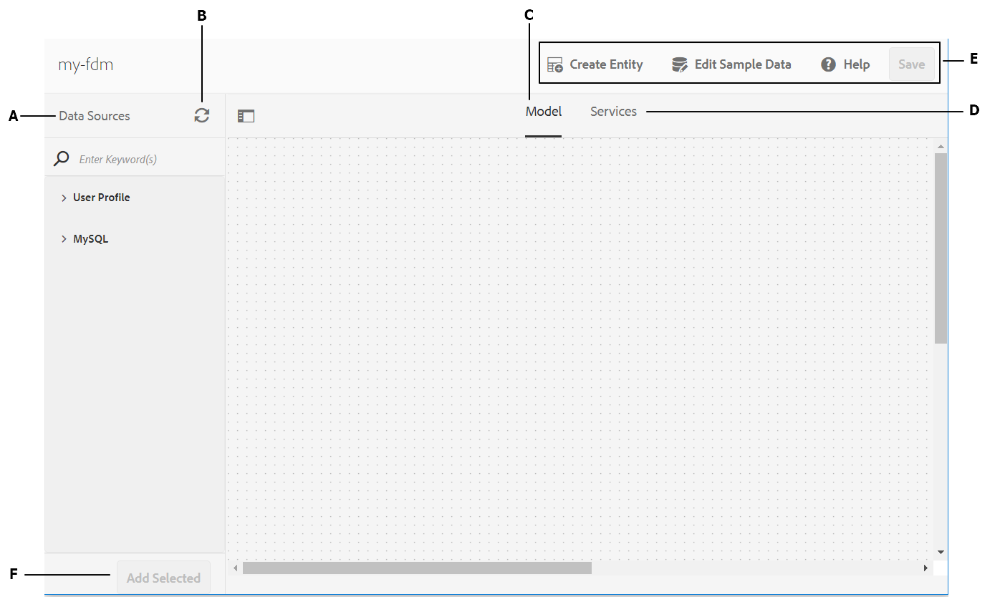

# 建立表單資料模型{#create-form-data-model}

AEM Forms資料整合提供直覺式使用者介面，供您建立及使用表單資料模型。 表單資料模型依賴資料來源來交換資料；不過，您可以使用或不使用資料來源來建立表單資料模型。 根據您是否已設定資料來源，有兩種從資料模型建立：

* **使用預配置的資料源**:如果您已依照設定資料來源中所述 [設定資料來源](../../forms/using/configure-data-sources.md)，則可在建立表單資料模型時選取資料來源。它提供來自選定資料源的所有資料模型對象、屬性和服務，這些資料源可用於表單資料模型中。

* **沒有資料來源**:如果您尚未為表單資料模型設定資料來源，仍可在沒有資料來源的情況下建立。您可以使用表單資料模型來製作最適化表單和互動式通訊，並使用範例資料來測試。 有資料來源可用時，您可以將表單資料模型與資料來源系結，資料來源會自動反映在相關的最適化表單和互動式通訊中。

>[!NOTE]
>
>您必須同時是&#x200B;**fdm-author**&#x200B;和&#x200B;**forms-user**&#x200B;群組的成員，才能建立及使用表單資料模型。 請連絡您的AEM管理員以成為群組的成員。

## 建立表單資料模型{#data-sources}

請確定您已設定要在表單資料模型中使用的資料來源，如[設定資料來源](../../forms/using/configure-data-sources.md)所述。 請執行下列操作，根據配置的資料源建立表單資料模型：

1. 在AEM製作例項中，導覽至&#x200B;**[!UICONTROL Forms >資料整合]**。
1. 點選「 **[!UICONTROL 建立>表單資料模型]**」。
1. 在「建立表單資料模型」對話框中：

   * 指定表單資料模型的名稱。
   * （**選用**）指定表單資料模型的標題、說明和標籤。
   * （**若已設定資料來源，則為選用且僅適用）點選**[!UICONTROL &#x200B;資料來源設定&#x200B;]**欄位旁的勾選圖示，並選取您要使用之資料來源所在的雲端服務設定節點。**&#x200B;這會將下一頁可供選取的資料來源清單，限制為所選設定節點中可用的資料來源清單。 但是，預設會列出任何JDBC資料庫和AEM用戶配置檔案資料源。 如果未選擇配置節點，則會列出來自所有配置節點的資料源。

   點選&#x200B;**[!UICONTROL Next]**。

1. （**僅在配置了資料源時適用**）**[!UICONTROL 選擇資料源]**&#x200B;螢幕列出可用的資料源（如果有）。 選取您要在表單資料模型中使用的資料來源。
1. 點選&#x200B;**[!UICONTROL 建立]**，然後在確認對話方塊上，點選&#x200B;**[!UICONTROL 開啟]**&#x200B;以開啟表單資料模型編輯器。

讓我們檢閱表單資料模型編輯器UI的不同元件。

**A.資料來** 源列出表單資料模型中的資料來源。展開資料源以查看其資料模型對象和服務。

**B.刷新資料源定** 義從配置的資料源中提取資料源定義中的任何更改，並在表單資料模型編輯器的「資料源」頁簽中更新這些更改。

**C.顯示** 添加的資料模型對象的ModelContent區域。

**D.出現** 添加的資料源操作或服務的「服務」內容區域。

**E.使** 用表單資料模型的工具列工具。工具列會根據表單資料模型中選取的物件顯示更多選項。

**F.添加選** 定項將選定資料模型對象和服務添加到表單資料模型。

有關表單資料模型編輯器以及如何使用它來編輯和配置表單資料模型的詳細資訊，請參閱[使用表單資料模型](../../forms/using/work-with-form-data-model.md)。

## 更新資料來源 {#update}

請執行下列操作，將資料來源新增或更新至現有的表單資料模型。

1. 前往「**[!UICONTROL Forms >資料整合]**」，選取您要新增或更新資料來源的表單資料模型，然後點選「**[!UICONTROL 屬性]**」。
1. 在表單資料模型屬性中，轉至&#x200B;**[!UICONTROL 更新源]**&#x200B;頁簽。

   在「更新源」頁簽中：

   * 點選&#x200B;**[!UICONTROL 內容感知設定]**&#x200B;欄位中的瀏覽圖示，並選取要新增之資料來源所在的雲設定節點。 如果您未選取節點，當您點選「**[!UICONTROL 新增來源]**」時，僅駐留在`global`節點中的雲配置會列出。

   * 若要新增資料來源，請點選「**[!UICONTROL 新增來源]**」並選取要新增至表單資料模型的資料來源。 將顯示在`global`中配置的所有資料源以及選定的配置節點（如果有）。

   * 若要將現有資料源替換為其他相同類型的資料源，請點選該資料源的&#x200B;**[!UICONTROL Edit]**&#x200B;表徵圖，然後從可用資料源清單中進行選擇。
   * 若要刪除現有資料源，請點選該資料源的&#x200B;**[!UICONTROL Delete]**&#x200B;圖示。 如果在表單資料模型中新增資料來源中的資料模型物件，則會停用「刪除」圖示。

   

1. 點選&#x200B;**[!UICONTROL 儲存並關閉]**&#x200B;以儲存更新。

>[!NOTE]
>
>新增資料來源或更新表單資料模型中的現有資料來源後，請務必視需要更新使用更新表單資料模型的最適化表單和互動式通訊中的系結參考。

## 後續步驟 {#next-steps}

您現在有一個表單資料模型，其中新增了資料來源。 接下來，您可以編輯表單資料模型以添加和配置資料模型對象和服務、添加資料模型對象之間的關聯、編輯屬性、添加自定義資料模型對象和屬性、生成示例資料等。

如需詳細資訊，請參閱[使用表單資料模型](../../forms/using/work-with-form-data-model.md)。
