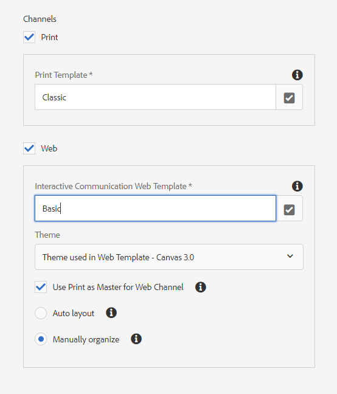

# 建立互動式通信{#create-an-interactive-communication}

## 概觀 {#overview}

互動式通信集中並管理個性化和互動式通信的建立、裝配和交付。 利用打印作為Web的主通道，在建立互動式通信的Web輸出時可以最大限度地減少工作重複。

### 必備條件 {#prerequisites}

以下是建立互動式通信的先決條件：

* 設定 [窗體資料模型](/help/forms/using/data-integration.md) 包含test資料或實際資料源，如Microsoft® Dynamics實例。
* 確保您 [文檔片段](/help/forms/using/document-fragments.md)。
* 確保您 [打印和Web頻道模板](/help/forms/using/web-channel-print-channel.md)。
* 確保您有 [主題](/help/forms/using/themes.md) 的子例行程式。

## 建立互動式通訊 {#createic}

1. 登錄到作AEM者實例並導航到 **[!UICONTROL Adobe Experience Manager]** > **[!UICONTROL Forms]** > **[!UICONTROL Forms和文檔]**。
1. 點擊 **[!UICONTROL 建立]** 選擇 **[!UICONTROL 互動式通信]**。 「建立交互通信」頁面。

   

1. 輸入以下資訊。 :

   * **[!UICONTROL 標題]**:輸入交互通信的標題。
   * **[!UICONTROL 名稱]**:互動式通信的名稱是從您輸入的標題中派生的。 如有必要，請編輯它。
   * **[!UICONTROL 說明]**:輸入有關互動式通信的說明。
   * **[!UICONTROL 窗體資料模型]**:瀏覽並選擇表單資料模型。 有關表單資料模型的詳細資訊，請參見 [AEM Forms資料整合](/help/forms/using/data-integration.md)。

   * **[!UICONTROL 預填充服務]**:選擇預填充服務以檢索資料並預填充互動式通信。
   * **[!UICONTROL 後處理類型]**:您可以選擇AEM或Forms工作流，以便在提交交互通信時觸發。 選擇要觸發的工作流的類型。

   * **[!UICONTROL 後處理]**:選擇要觸發的工作流的名稱。 選擇工作AEM流時，請提供附件路徑、佈局路徑、PDF路徑、打印資料路徑和Web資料路徑。
   * **[!UICONTROL 標籤]**:選擇要應用於交互通信的標籤。 您也可以鍵入新的/自定義的標籤名稱，然後按Enter鍵建立它。
   * **[!UICONTROL 作者]**：作者名將自動取自登錄用戶的用戶名。
   * **[!UICONTROL 發佈日期：]** 輸入發佈互動式通信的日期。
   * **[!UICONTROL 取消發佈日期]**:輸入取消發佈互動式通信的日期。

1. 點擊 **[!UICONTROL 下一個]**。 將顯示指定打印和Web頻道詳細資訊的螢幕。
1. 輸入以下內容：

   * **[!UICONTROL 打印]**:選擇此選項可生成互動式通信的打印通道。
   * **[!UICONTROL 打印模板]**:瀏覽並選擇XDP作為打印模板。
   * **[!UICONTROL Web]**:選擇此選項可生成Web通道或互動式通信的響應輸出。
   * **[!UICONTROL 互動式通信Web模板]**:瀏覽並選擇Web模板。
   * **[!UICONTROL 主題]** 和 **[!UICONTROL 選擇主題]**:瀏覽並選擇主題以對互動式通信的Web通道進行樣式化。 有關詳細資訊，請參見 [AEM Forms主題](/help/forms/using/themes.md)。

   * **[!UICONTROL 將「打印為首頁」用於Web通道]**:選擇此選項可建立與打印通道同步的Web通道。 使用打印通道作為Web通道的主節點可確保Web通道的內容和資料綁定是從打印通道派生的，並且當您點擊「同步」時，打印通道中所做的更改將反映在Web通道中。 但是，允許作者根據需要中斷Web通道中特定元件的繼承。 有關詳細資訊，請參見 [將Web通道與打印通道同步](../../forms/using/create-interactive-communication.md#synchronize)。
如果選擇 **[!UICONTROL 將「打印為首頁」用於Web通道]** 選項，可以選擇以下任何模式來生成Web通道：

      * **[!UICONTROL 自動佈局]**:選擇此模式可自動從打印頻道為Web頻道生成佔位符、內容和資料綁定。
      * **[!UICONTROL 手動組織]**:選擇此模式，以使用中提供的主內容手動選擇並將打印頻道元素添加到Web頻道 **[!UICONTROL 資料源]** 頁籤。 有關詳細資訊，請參見 [選擇「打印頻道元素」以建立Web頻道內容](#selectprintchannelelements)。

   有關打印渠道和Web渠道的詳細資訊，請參見 [打印通道和Web通道](/help/forms/using/web-channel-print-channel.md)。

1. 點擊 **[!UICONTROL 建立]**。 將建立「交互通信」，並出現一個警報框。 點擊 **[!UICONTROL 編輯]** 開始構建互動式通信的內容，如中所述 [使用交互通信創作用戶介面添加內容](#step2)。 或者，您可以點擊 **[!UICONTROL 完成]** 並選擇稍後編輯互動式通信。

## 將內容添加到交互通信 {#step2}

建立互動式通信後，可以使用互動式通信創作介面來構建其內容。

有關互動式通信創作介面的詳細資訊，請參閱 [互動式通信創作簡介](/help/forms/using/introduction-interactive-communication-authoring.md)。

1. 點擊「編輯」(Edit)時，將啟動互動式通信創作介面，如中所述 [建立互動式通信](#createic)。 或者，您可以導航到現有的互動式通信資AEM產，選擇它，然後點擊 **[!UICONTROL 編輯]** 啟動互動式通信創作介面。

   預設情況下，將顯示互動式通信的打印通道，除非互動式通信是僅Web通道。 互動式通信的打印通道顯示選定XDP/打印通道模板中可用的目標區域。 在這些目標區域和欄位中，可以添加元件或資產。

1. 選擇「打印通道」後，選擇 **[!UICONTROL 元件]** 頁籤。 打印通道中提供以下元件：

   | **Component** | **功能** |
   |---|---|
   | 圖表 | 添加一個圖表，可在Interactive Communication中使用該圖表來直觀地表示從表單資料模型集合中檢索的二維資料。 有關詳細資訊，請參見 [在交互通信中使用圖表](/help/forms/using/chart-component-interactive-communications.md)。 |
   | 文件片段 | 允許您將可重用的元件（如文本、清單或條件）添加到互動式通信中。 添加的元件可以是基於表單資料模型的元件，也可以是沒有表單資料模型的元件。 |
   | 影像 | 讓您插入影像。 |

   將元件拖放到交互通信中，並根據需要配置它們。

   在為打印和Web通道創作交互通信時，還可以使用撤消和重做操作。

   使用撤消操作可放棄上次執行的操作，使用重做操作可再次合併已放棄的操作。 例如，如果在交互通信中插入了影像或建立了資料綁定，並且需要放棄它，則使用撤消操作。

   

   撤消和重做選項顯示在創作UI頁工具欄上。 僅當執行操作後才顯示撤消選項。 只有在執行撤消操作後，重做選項才會顯示在頁面工具欄上。 刷新頁面時將重置這些操作。

1. 選擇打印通道後，轉到 **[!UICONTROL 資產]** 頁籤，然後應用篩選器以僅顯示要查看的資產。

   使用「資產」瀏覽器，還可以直接將資產拖放到交互通信目標區域。

   

1. 將文檔片段拖放到交互通信中。 以下是可以在互動式通信的打印通道中使用的文檔片段類型。

<table>
 <tbody>
  <tr>
   <td><strong>文件片段類型</strong></td>
   <td><strong>示例用途</strong></td>
  </tr>
  <tr>
   <td><a href="/help/forms/using/texts-interactive-communications.md" target="_blank">文字</a></td>
   <td>用於添加地址、收件人電子郵件和信件正文的文本 </td>
  </tr>
  <tr>
   <td><a href="/help/forms/using/conditions-interactive-communications.md" target="_blank">條件</a></td>
   <td>根據策略類型向通信中添加相應的標頭影像的條件：標準或高級。 <br /> </td>
  </tr>
  <tr>
   <td>清單</td>
   <td>文檔片段組，包括文本、條件、其他清單和影像。 <br /> </td>
  </tr>
 </tbody>
</table>

也可以使用 **[!UICONTROL 資產]** 頁籤。 拖動片段時目標區域的藍色底紋表示文檔片段可以拖放到目標區域。

有關文檔片段的詳細資訊，請參見 [文檔片段](/help/forms/using/document-fragments.md)。

創作介面使您能夠區分未綁定和綁定欄位以及交互通信中的變數。 介面使用橙色邊框突出顯示未綁定的欄位和變數。


此外，當將滑鼠懸停在這些元素上時，將顯示一個工具提示，其中顯示「欄位（未綁定）」或「變數（未綁定）」消息。

在文檔片段中使用的未綁定變數有時不能顯示在創作介面上。 可能是由於文檔片段內的內聯文本規則或條件片段的情況。 在這種情況下，以藍色突出顯示的工具提示會作為文檔片段的一部分顯示。 工具提示顯示文檔片段中使用的未綁定變數的數量。


點擊文檔片段，點擊  （配置），然後點擊 **[!UICONTROL 屬性]** 從互動交流的旁邊。 的 **[!UICONTROL 變數和資料模型對象]** 部分列出了變數，包括隱藏變數和文檔片段中使用的資料模型對象。 使用  每個資料模型對象或變數旁邊的（編輯）表徵圖可編輯屬性。

1. 要設定變數綁定，請點擊變數並選擇  （配置），然後在提要欄的「屬性」面板中設定綁定屬性。

   * **無**:代理將填充變數的值。
   * **文本片段**:如果選中，則可以瀏覽並選擇其內容在欄位中呈現的文本文檔片段。 只有那些文本文檔片段可以綁定到中沒有變數的變數。
   * **資料模型對象**:選擇在欄位中填充其值的表單資料模型屬性。
   * **預設值：** 可使用此欄位為變數定義預設值。 預覽交互通信或代理用戶介面時，將顯示該值。
   * **顯示圖案：** 也可以定義變數的顯示格式。 從 **類型** 下拉清單，以將顯示格式應用於變數。 選擇 **自定義** 定義清單中不可用的顯示陣列。 有關詳細資訊，請參見 [資料顯示模式](../../forms/using/create-interactive-communication.md#datadisplaypatterns)。

   導航到 [變數和資料模型對象](../../forms/using/create-interactive-communication.md#hiddenvariables) 設定文檔片段中隱藏變數的綁定。

   還可以拖放資料源元素或文本文檔片段以設定變數綁定。  要使用任何資料源元素建立綁定，請選擇 **資料源** 頁籤，然後將元素拖放到變數名稱中。 資料源元素和變數的類型必須相同才能成功設定綁定。 如果將資料源元素拖放到已綁定的變數，則新元素將替換前一個元素，以用該變數建立新綁定。 同樣，選擇 **資產** 將文本文檔片段拖放到變數名稱中，以設定它們之間的綁定。 文本文檔片段不能包含任何變數。

1. 要在中添加選中打印通道的表， **[!UICONTROL 資產]** 頁籤應用篩選器以僅顯示佈局片段。 將所需的佈局片段拖放到交互通信。 佈局片段基於XDP，可用於在互動式通信中建立圖形佈局或靜態和動態表，這些表被填充有動態資料。

   示例：用於顯示舊和新策略的毛保費、忠誠折扣%和緊急路邊協助可用性的佈局表。

   有關佈局片段的詳細資訊，請參見 [文檔片段](/help/forms/using/document-fragments.md)。

1. 選擇打印通道後，在 **[!UICONTROL 資產]** 頁籤應用濾鏡以顯示影像。 將所需影像拖放到互動式通信中，如公司徽標。

   此外，在交互通信中管理以下內容：

   * [添加和配置圖表](/help/forms/using/chart-component-interactive-communications.md)
   * [與打印通道同步的網通道](../../forms/using/create-interactive-communication.md#synchronize)

      * 自動同步
      * 取消繼承
      * 重新啟用繼承
      * 同步
   * [附件和庫訪問](../../forms/using/create-interactive-communication.md#attachmentslibrary)
   * [XDP/佈局欄位屬性](../../forms/using/create-interactive-communication.md#xdplayoutfieldproperties)
   * [將規則添加到元件](../../forms/using/create-interactive-communication.md#rules)


1. 切換到 **[!UICONTROL Web通道]**。 Web通道將出現在交互通信編輯器中。 當您首次從打印通道切換到Web通道時，將進行自動同步。 有關詳細資訊，請參見 [從打印通道同步Web通道](../../forms/using/create-interactive-communication.md#synchronize)。

   由於在此示例中我們將「打印」用作Web的主節點，因此「打印」通道佔位符、內容和資料綁定將同步到Web通道。 但是，您可以更改和自定義Web頻道中的特定內容。 [取消繼承](#cancelinheritance) 已使用打印通道生成的目標區域和變數，以便能夠自定義內容。

   

   點擊文檔片段，點擊  （配置），然後點擊 **[!UICONTROL 屬性]** 從互動交流的旁邊。 的 **[!UICONTROL 變數和資料模型對象]** 部分列出了變數，包括隱藏變數和文檔片段中使用的資料模型對象。 使用  每個資料模型對象或變數旁邊的（編輯）表徵圖可編輯屬性。 此外，對於已 [自動生成](#synchronize) 在使用打印通道的Web通道中，使用  （取消繼承）表徵圖，位於 [取消繼承](#cancelinheritance) 並能夠編輯它們。

1. 要在Web通道中添加其他元件，如果選擇了Web通道，請點擊 **[!UICONTROL 元件]**。 根據需要在互動式通信的Web通道中拖放元件，然後繼續配置它們。

   | 元件 | 功能 |
   |---|---|
   | 圖表 | 添加一個圖表，可在Interactive Communication中使用該圖表來直觀地表示從表單資料模型集合中檢索的二維資料。 有關詳細資訊，請參見 [使用圖表元件](../../forms/using/chart-component-interactive-communications.md)。 |
   | 文件片段 | 允許您將可重用的元件、文本、清單或條件添加到交互通信中。 您添加到交互通信的可重用元件可以是基於表單資料模型的元件，也可以是沒有表單資料模型的元件。 |
   | 影像 | 讓您插入影像。 |
   | 面板 | 允許您添加 [面板](../../forms/using/create-interactive-communication.md#add-panel-component-to-the-web-channel) 到交互通信。 |
   | 表格 | 新增表格以整理行和欄中的資料。 |
   | 目標區域 | 在Web通道中插入目標區域以組織Web通道特定的元件。 目標區域是一個普通容器，允許您對Web通道特定元件進行分組。 |
   | 文字 | 將富文本添加到交互通信的Web通道。 文本還可以利用表單資料模型對象使內容動態化。 |
   | 按鈕 | 允許您添加 [按鈕](../../forms/using/create-interactive-communication.md#add-button-component-to-the-web-channel) 到交互通信。 可以使用按鈕元件導航到其他交互通信、自適應表單、其他資產（如影像或文檔片段）或外部URL。 |
   | 分隔符號 | 允許您在互動式通信中插入水準線。 使用此元件可以區分對應部分。 例如，您可以使用分隔符元件來區分信用卡對帳單中的「客戶詳細資訊」和「信用卡詳細資訊」部分。 |

1. 根據需要，在Web渠道中插入資產。

   你可以 [預覽互動式通信](#previewic) 查看互動式通信的打印和Web輸出的外觀，並根據需要繼續進行更改。

## 預覽互動式通信 {#previewic}

您可以使用 **預覽選項** 以評估交互通信的外觀。 互動式通信的網路通道也提供了用於模擬各種設備的互動式通信體驗的選項。 例如，iPhone、iPad和台式機。 您可以同時使用 **預覽** 和 **模擬器**  選項，以預覽不同螢幕大小設備的web輸出。 預覽中的示例資料是從指定的表單資料模型填充的。

1. 選擇（打印或Web）頻道以預覽並點擊預覽。 出現「Interactive Communication（交互通信）」。

   >[!NOTE]
   >
   >預覽將使用指定的表單資料模型的示例資料填充。 有關使用某些其他資料預覽互動式通信或使用預填充服務的詳細資訊，請參見 [使用表單資料模型](/help/forms/using/using-form-data-model.md) 和 [使用表單資料模型](/help/forms/using/work-with-form-data-model.md)。

1. 對於Web通道，使用  查看交互通信在各種設備上的顯示方式。

   

另外，你可以 [使用代理UI準備和發送交互通信](/help/forms/using/prepare-send-interactive-communication.md)。

## 在交互通信中配置屬性  {#configure-properties-in-interactive-communication}

### 附件和庫訪問 {#attachmentslibrary}

在打印通道中，您可以配置附件和庫訪問權限，以允許代理管理交互通信的代理用戶介面中的附件：

1. 在「Print（打印）」通道中，選中「Document Container（文檔容器）」並點擊 **屬性**。

   

   「屬性」面板出現在提要欄中。

   

1. 展開 **附件** 並指定以下屬性：

   * **[!UICONTROL 允許庫訪問]**:選擇以啟用代理UI中代理的庫訪問。 如果啟用，則代理可以在準備交互通信時從庫添加檔案。
   * **[!UICONTROL 允許重新排序附件]**:選擇以使代理能夠使用互動式通信重新排序附件。
   * **[!UICONTROL 允許的最大附件數]**:指定互動式通信允許的最大附件數。
   * **[!UICONTROL 要附加的檔案]**:點擊 **[!UICONTROL 添加]** 並瀏覽以選擇要附加的檔案，並指定以下內容：

      * **[!UICONTROL 預設情況下將此檔案附加到文檔]**:如果附件不是「強制」，則可以更改此選項。
      * **[!UICONTROL 必需：]** 代理將無法刪除代理UI中的附件。

   

1. 點擊 **[!UICONTROL 完成]**。

### XDP/佈局欄位屬性 {#xdplayoutfieldproperties}

1. 編輯互動式通信的打印通道時，將滑鼠懸停在打印通道模板中生成的欄位上，然後選擇  （配置）。

   「屬性」對話框出現在提要欄中。

   

1. 指定以下內容：

   * **[!UICONTROL 名稱]**:JCR節點名稱。
   * **[!UICONTROL 標題]**:在「代理UI」和「文檔容器」樹中輸入對代理可見的標題。
   * **[!UICONTROL 綁定類型]**:為欄位選擇以下綁定類型之一。

      * 無：代理將填寫屬性的值。
      * 文本片段：如果選中，則可以瀏覽並選擇其內容在欄位中呈現的文本文檔片段。 或者，將文本文檔片段拖放到欄位名稱中，以設定它們之間的綁定。 文本文檔片段不能包含任何變數。
      * 資料模型對象：選擇在欄位中填充其值的表單資料模型屬性。 或者，選擇 **資料源** 頁籤，然後將屬性拖放到欄位。
   * **[!UICONTROL 預設值]**:預設值可確保指定資料模型對象或文本片段未提供值時欄位不為空。 如果資料綁定類型為none，則在欄位中預填充預設值。
   * **[!UICONTROL 顯示圖案]**:也可以定義欄位的顯示格式。 從 **類型** 下拉清單，以將顯示格式應用於欄位。 選擇 **自定義** 定義清單中不可用的顯示陣列。 有關詳細資訊，請參見 [資料顯示模式](../../forms/using/create-interactive-communication.md#datadisplaypatterns)

   * **[!UICONTROL 由代理編輯]**:選擇以允許代理編輯代理UI中欄位中的值。 如果綁定類型為文本片段，則此設定不適用。
   * **[!UICONTROL 標籤]**:指定在代理UI中為代理顯示的帶欄位的文本字串。 如果綁定類型為文本片段，則此設定不適用。
   * **[!UICONTROL 工具提示]**:輸入一個文本字串，該字串將在滑鼠移到代理UI中的代理時可見。 如果綁定類型為文本片段，則此設定不適用。
   * **[!UICONTROL 必需]**:選擇以使該欄位成為座席的必需欄位。 如果綁定類型為文本片段，則此設定不適用。
   * **[!UICONTROL 允許多行]**:選擇此欄位允許在欄位中輸入多行文本。 如果綁定類型為文本片段，則此設定不適用。


1. 點擊 。

### 資料顯示模式 {#datadisplaypatterns}

創作介面使您能夠為欄位、變數和表單資料模型元素定義資料顯示模式，同時為打印和Web通道建立互動式通信。

要配置資料顯示模式，請點擊元素，選擇  （配置）並設定 **[!UICONTROL 屬性]** 的子菜單。 從 **[!UICONTROL 類型]** 下拉清單，查看與所選類型關聯的陣列。 選擇 **[!UICONTROL 自定義]** 從 **[!UICONTROL 類型]** 下拉清單，定義清單中不可用的模式。 編輯 **[!UICONTROL 圖案]** 欄位自動將類型修改為 **[!UICONTROL 自定義]**。

要應用顯示模式，「模式」欄位中定義的字元或數字數必須與欄位、變數和表單資料模型元素的值中定義的字元或數字匹配或超過。 有關詳細資訊，請參見 [示例](../../forms/using/create-interactive-communication.md#greaternumberofdigits)。


在從打印通道生成Web內容後，可以重新定義欄位、變數或表單資料模型元素的顯示模式。 因此，元素可以具有為打印和Web通道定義的不同顯示圖案。 如果未為打印通道中的元素定義顯示模式並使用打印通道自動生成Web內容，則為打印通道中的元素定義的資料綁定將定義在 **[!UICONTROL 類型]** 的子菜單。 如果沒有為元素定義綁定，則元素的資料類型將定義可用的顯示模式選項。 例如，如果為打印通道中的元素建立「編號」類型的資料綁定，則在 **[!UICONTROL 類型]** 下拉清單的Number類型為各種格式。

切換到 **預覽** 模式或開啟Agent UI以查看應用於這些元素的顯示模式。

下表列出了在為變數設定資料顯示模式時顯示的值示例：

| 類型 | 預設值 | 顯示圖案 | 顯示值 | 說明 |
|---|---|---|---|---|
| SocialSecurityNumber | 123456789 | 文本{99-99-999} | 123-45-6789 | 預設值欄位中的位數與「模式」欄位中的位數匹配。 基於陣列的值顯示成功。 |
| SocialSecurityNumber | 1234567 | 文本{99-99-999} | 1-23-4567 | 預設值欄位中的位數小於「模式」欄位中的位數。 該模式適用於7個可用數字。 |
| SocialSecurityNumber | 1234567890 | 文本{99-99-999} | 1234567890 | 預設值欄位中的位數大於「模式」欄位中的位數。 因此，顯示值沒有變化。 |

如果未為變數或表單資料模型元素指定顯示圖案，則 [全局文檔片段配置](https://helpx.adobe.com//experience-manager/6-5/forms/using/interactive-communication-configuration-properties.html) 的下界。

如果不將顯示模式應用於數字資料類型的變數，則「打印預覽」會根據全局文檔片段配置顯示該模式。 如果對預設全局文檔片段配置應用更改，代理UI仍會根據為區域設定定義的預設分隔符顯示模式。

同樣，對於欄位，如果未指定顯示圖案，則建立打印模板(XDP)時定義的圖案將應用於該欄位。 如果在建立打印模板時沒有圖案，則基於XFA規範的預設圖案將應用於這些欄位。

此外，如果指定的顯示模式不正確或無法應用，則基於XFA規範的預設模式將應用於欄位、變數或表單資料模型元素。

## 將規則應用於交互通信元件 {#rules}

要在交互通信中對元件或內容進行條件化，請點擊元件/內容片段，然後選擇  （建立規則）以啟動規則編輯器。

有關詳細資訊，請參閱：

* [規則編輯器](/help/forms/using/rule-editor.md)
* [互動式通信創作簡介](/help/forms/using/introduction-interactive-communication-authoring.md)

## 使用表 {#tables}

### 交互通信中的動態表 {#dynamic-tables-in-interactive-communication}

可以使用佈局片段在交互通信中添加動態表。 以下步驟使用信用卡對帳單的示例來說明在交互通信中建立動態表時使用佈局片段。

1. 確保中提供了建立表所需的佈局片段AEM。
1. 在交互通信的打印通道中，從資產瀏覽器拖放目標區域中的佈局片段（帶有多清單）。

   

   在「互動式通信」佈局區域中顯示一個表。

   

1. 為表的每個單元格指定資料綁定。 要建立可重複行，請在屬於公共集合屬性的行中插入表單資料模型屬性。

   1. 點擊表格中的單元格並選擇  （配置）。

      「屬性」對話框出現在提要欄中。

      

   1. 配置屬性：

      * **[!UICONTROL 名稱]**:JCR節點名稱。
      * **[!UICONTROL 標題]**:輸入在互動式通信編輯器中可見的標題。
      * **[!UICONTROL 綁定類型]**:為欄位選擇以下綁定類型之一。

         * **[!UICONTROL 無]**
         * **[!UICONTROL 資料模型對象]**:表單資料模型屬性的值將填充在欄位中。 或者，選擇 **資料源** 頁籤，然後將屬性拖放到欄位。
      * **[!UICONTROL 資料模型對象]**:在欄位中填充其值的表單資料模型屬性。
      * **[!UICONTROL 預設值]**:預設值可確保指定資料模型對象未提供值時欄位不為空。 預設值將預填充在欄位中。

      * **[!UICONTROL 由代理編輯]**:選擇以允許代理編輯代理UI中欄位中的值。
   1. 點擊 。


1. 預覽互動式通信以查看與資料一起呈現的表。

   

### 僅Web通道表 {#webchanneltables}

點擊Web模板中的根面板，點擊 **+** 添加 **表格** 到交互通信的元件。 在交互通信中插入包含兩行的表。 表的第一行表示表標題。

#### 向表中添加行和列 {#addrowscolumnstable}

**要添加或刪除列：**

1. 按一下表格標題行中的預設文本框以查看元件工具欄。
1. 選擇 **添加列** 或 **刪除列** ，可分別添加或刪除表列。


**要添加或刪除行：**

1. 按一下任何表行查看元件工具欄。 您還可以使用交互通信的旁邊的「內容」瀏覽器選擇表行。
1. 選擇 **添加行** 或 **刪除行** 添加或刪除表行。 使用 **上移** 和 **下移** 工具欄中可用的選項來重新排清單格中的行。


**答：** 添加行 **B** 刪除行 **C.** 上移 **D** 下移

#### 添加或編輯表格單元格中的文本 {#addedittexttable}

1. 在表格單元格中選擇預設文本框並點擊  （編輯）。
1. 在表格單元格中鍵入文本並點擊  來拯救它。

#### 在表單元格和資料模型對象元素之間建立綁定 {#createbindingtablecells}

1. 在表行中選擇預設文本框，然後點擊  （編輯）。
1. 按一下「資料模型對象」(Data Model objects)下拉清單，然後選擇屬性。
1. 點擊以保存並建立表單元格與資料模型對象屬性之間的綁定。


#### 為表格單元格中的文本建立超連結 {#createhyperlinktable}

1. 在表格單元格中選擇預設文本框並點擊  （編輯）。
1. 選擇表格單元格中的文本，然後點擊「超連結」表徵圖。
1. 在 **路徑** 的子菜單。
1. 點擊  的子菜單。


#### 建立動態表 {#createdynamictables}

可以使用類型集合的資料模型屬性在交互通信中建立僅Web通道的動態表。 此表表示集合屬性的子屬性。 只能編輯表格中各單元格的格式屬性。

1. 切換到Web通道，然後選擇顯示資料源瀏覽器。
1. 將集合屬性拖放到子窗體中。 在子窗體中建立表。
1. 在互動式通信的Web預覽中預覽表。

#### 對表中的列排序 {#sortcolumns}

您可以根據交互通信中表中的任何列對資料進行排序。 列中的值可以按升序或降序排序。

可以對包含以下內容的表列應用排序：

* 靜態文本
* 資料模型對象屬性
* 靜態文本和資料模型對象屬性的組合

要啟用排序，請執行以下操作：

1. 選擇表並點擊  （配置）。 也可以使用 **內容** 瀏覽器。
1. 選擇 **啟用排序。**
1. 點擊  的子菜單。 列標題中的排序表徵圖（上箭頭和下箭頭）表示已啟用排序。

   

1. 切換到 **預覽** 的子菜單。 表將根據表的第一列自動排序。
1. 按一下列標題可根據列對值進行排序。

   帶上箭頭的列標題表示：

   * 根據該列對表進行排序。
   * 列中的值按升序顯示。

   

   同樣，帶有向下箭頭的列標題表示列中的值按降序顯示。

## 編輯交互通信屬性 {#edit-interactive-communication-properties}

建立互動式通信後，可以在稍後階段編輯其屬性。

使用 **屬性** 頁：

* 編輯在建立交互通信時指定的欄位的值，如標題和說明。
* 添加或刪除現有交互通信的Web通道。
* 預覽、下載或刪除互動式通信
* 開啟 [代理UI](/help/forms/using/prepare-send-interactive-communication.md)。

訪問 **屬性** 頁：

1. 登錄到作AEM者實例並導航到 **Adobe Experience Manager** > **Forms** > **Forms和文檔**。
1. 選擇互動式通信並點擊 **屬性**。
1. 選擇 **常規** 頁籤 **標題** 和 **說明** 的子菜單。

### 添加或刪除Web通道 {#add-or-delete-the-web-channel}

執行以下步驟，為現有交互通信添加Web通道：

1. 在 **屬性** ，選擇 **頻道** 頁籤。
1. 選擇 **Web** 複選框，然後選擇Web頻道的模板。
1. 選擇 **將打印作為Web通道的首頁** 啟用Web通道和打印通道之間的同步。
1. 點擊 **保存並關閉** 的子菜單。

   同樣，您可以點擊 **Web** 複選框 **頻道** 頁籤，以從交互通信中刪除Web通道。

## 將按鈕元件添加到Web通道 {#add-button-component-to-the-web-channel}

可以將按鈕作為元件添加到交互通信的Web通道中。 使用 [規則編輯器](../../forms/using/rule-editor.md) 可導航到其他Interactive Communications、自適應表單、影像或文檔片段等其他資產，或點擊按鈕時的外部URL。

要添加按鈕並定義其規則：

1. 點擊Web模板中的根面板，點擊 **+** 的 **按鈕** 到交互通信的元件。
1. 點擊按鈕元件並點擊  按鈕。
1. 在 **當** 選擇 **按一下** 按鈕下拉清單的狀態。
1. 在 **然後** 部分：

   1. 從下拉清單中選擇一個操作。 例如，選擇 **導航到** 按鈕。

   1. 指定交互通信、自適應表單、資產或網頁的URL。 例如，以下格式指定URL以導航到另一個互動式通信：https://&lt;server-name>:&lt;port>/editor.html/content/forms/af/&lt;interactive communication=&quot;&quot; name=&quot;&quot;>/channels/&lt;channel name=&quot;&quot; print=&quot;&quot; or=&quot;&quot; web=&quot;&quot;>.html
   1. 指定在同一標籤、新標籤或新窗口中開啟資產的選項。
   1. 點擊 **完成** 然後點擊 **關閉** 來保存規則。

   同樣，您可以從操作類型下拉清單中選擇其他可用選項，如「調用服務」和「提交表單」。 有關詳細資訊，請參見 [規則編輯器](../../forms/using/rule-editor.md)。

1. 預覽互動式通信並點擊按鈕以查看步驟4(b)中指定的互動式通信、自適應表單、資產或網頁。

## 將面板元件添加到Web通道 {#add-panel-component-to-the-web-channel}

「面板」元件是用於將其他元件分組在一起的佔位符，它控制一組元件（如折疊面板和制表符）在「互動式通信」中的佈局方式。 面板元件還允許您使一組元件對最終用戶可重複執行，例如在填寫教育證書所需的多個條目中。

執行以下步驟將面板元件添加到Web通道：

1. 插入 **面板** 使用以下任一選項在Web通道中使用元件：

   * 點擊元件，點擊 **+** 的 **面板** 元件。

   * 從 **元件** 瀏覽器面板，拖放 **面板** 的下界。

   * 點擊 **面板** 的 **內容** 瀏覽器面板和點擊 **添加子面板**。 選擇 **添加子面板** 選項顯示 **添加子面板** 對話框。 輸入面板元件的標題和可選說明和名稱。

1. 從 **內容** 瀏覽器，在「面板」上執行其他操作，如配置、編輯規則、複製、刪除和插入元件。

   也可以在 **內容** 瀏覽器，以反映右窗格中交互通信結構的更改。

## 與打印通道同步Web通道 {#synchronize}

在建立交互通信時選擇「打印為Web通道的主節點」時，Web通道將與打印通道同步建立，並且Web通道的內容和資料綁定是從打印通道派生的，當點擊「同步」時，打印通道中所做的更改可以反映在Web通道中。

但是，允許作者根據需要中斷Web通道中元件的繼承。

 

### 自動同步 {#autosync}

如果選擇 **[!UICONTROL 將「打印為首頁」用於Web通道]** 選項，可以選擇以下任何模式來生成Web通道：

* **[!UICONTROL 自動佈局]**:選擇此模式可自動從打印頻道為Web頻道生成佔位符、內容和資料綁定。
* **[!UICONTROL 手動組織]**:選擇此模式，可使用「資料源」頁籤中提供的主內容手動選擇並將打印通道元素添加到Web通道。 有關詳細資訊，請參見 [選擇「打印頻道元素」以建立Web頻道內容](#selectprintchannelelements)。



>[!NOTE]
>
>同步通道僅同步從打印通道到web通道的文檔片段、影像、條件、清單和佈局片段。 未同步包含此類元素的子表單或父節點。

### 選擇「打印頻道元素」以建立Web頻道內容 {#selectprintchannelelements}

如果在建立交互通信時選擇「打印」作為主節點，而不選擇自動同步選項，則還可以將「打印」通道元素拖放到Web通道創作介面。

導航到 **資料源** > **主內容** 的子菜單。 將目標區域、欄位或表拖放到Web渠道創作介面。 元素名稱旁邊的藍色圓表徵圖表示「打印通道」元素已包含在Web通道中。


### 取消繼承 {#cancelinheritance}

在Web通道中，元件被嵌入到目標區域中。

將滑鼠懸停在Web通道中的相關目標區域或變數上並選擇  （取消繼承），然後在「取消繼承」對話框中，按一下 **[!UICONTROL 是]**。

目標區域內元件的繼承將被取消，現在您可以根據需要編輯它們。

### 重啟先前設定 {#re-enable-inheritance}

在Web通道中，如果已取消了元件的繼承，則可以重新啟用它。 要重新啟用繼承，請將滑鼠懸停在相關目標區域的邊界上，然後點擊 。

將出現「還原繼承」對話框。


如果需要，請選擇 **[!UICONTROL 恢復繼承後同步頁]**。 選擇此選項可同步整個交互通信。 如果未選擇此選項，則只有在恢復繼承時，相關目標區域才會同步。

點擊 **[!UICONTROL 是]**。

### 同步 {#synchronize-1}

如果將「打印」用作Web頻道的主節點，並對「打印」頻道進行更改，則可以同步內容以將新做的更改帶到Web頻道。

1. 要將Web通道與打印通道同步，請切換到Web通道，然後按一下「更多選項」表徵圖。

   

1. 按一下以下選項之一：

   * **[!UICONTROL 與打印同步]**:僅同步未取消繼承的目標區域的內容。
   * **[!UICONTROL 重置]**:將Web頻道內容與打印頻道同步，並放棄對Web頻道所做的所有更改。

### 使用元件工具欄對繼承的元件執行操作 {#componenttoolbar}

使用「同步」選項在Web通道中自動生成內容後，您就可以對元件執行更多操作，而不取消繼承。


按一下元件以查看以下選項：

* **複製：** 複製元件並將其貼上到交互通信中的其他位置。
* **剪切：** 在交互通信中將元件從一個位置移動到另一個位置。
* **插入元件：** 在選定元件上方插入元件。
* **貼上：** 使用上述選項貼上剪切或複製的元件。
* **組：** 如果要剪切、複製或貼上多個元件，請選取多個元件。
* **父級：** 選擇元件的父項。
* **查看SOM表達式：** 查看 [SOM表達](../../forms/using/using-som-expressions-adaptive-forms.md) 的子菜單。

* **在面板中組對象：** 將面板中的元件分組，以便能夠同時對這些元件執行操作。 有關詳細資訊，請參閱 [對面板中的對象進行分組](#groupobjectspanel)。

* **取消繼承：** [取消繼承](#cancelinheritance) 的子菜單。

### 對面板中的對象進行分組 {#groupobjectspanel}

該Web頻道創作介面便於將面板中的元件分組以便能夠同時對這些元件執行操作。 的 **內容** 頁籤將分組的元件列為內容樹中面板的子元素。

1. 點擊元件並選擇組( )操作。
1. 選擇多個元件並點擊 **對面板中的對象進行分組**。

   

1. 在 **對面板中的對象進行分組** 的子菜單。
1. 輸入面板的可選標題和說明。
1. 按一下 。

   分組的元件在內容樹中顯示為「面板」的子元素。

   

## 打印通道的輸出格式 {#output-format-print-channel}

使用PrintChannel API為交互通信的打印通道定義輸出格式。 如果不定義輸出格式，則AEM Forms將以PDF格式生成輸出。

```javascript
//options for rendering print channel of a multi-channel document
PrintChannelRenderOptions renderOptions = new PrintChannelRenderOptions();
PrintDocument printDocument = printChannel.render(renderOptions);
```

要以任何其他格式生成輸出，請指定輸出格式類型。 請參閱 [PrintChannel API](https://helpx.adobe.com/experience-manager/6-5/forms/javadocs/com/adobe/fd/output/api/PrintConfig.html) 的子菜單。

例如，您可以使用以下示例將PCL定義為交互通信的輸出格式：

```javascript
//options for rendering print channel of a multi-channel document
PrintChannelRenderOptions renderOptions = new PrintChannelRenderOptions();
renderOptions.setRenderFormat(PrintConfig.HP_PCL_5e);
PrintDocument printDocument = printChannel.render(renderOptions);
```
