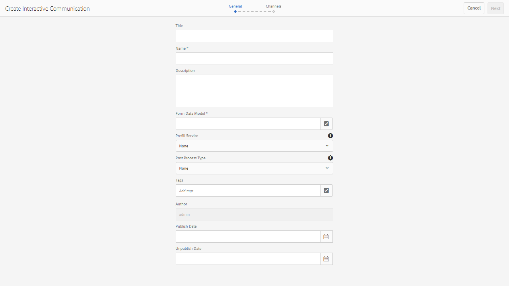

# 建立互動式通訊{#create-an-interactive-communication}

## 總覽 {#overview}

互動式通訊可集中管理個人化與互動式通訊的建立、組裝與傳遞。 利用打印作為Web的主通道，可以最大限度地減少建立互動式通信的Web輸出時的工作重複。

### 必備條件 {#prerequisites}

以下是建立互動式通訊的先決條件：

* 設定 [表單資料模型](/help/forms/using/data-integration.md) 包含測試資料或實際資料來源，例如Microsoft® Dynamics的例項。
* 確保您擁有 [檔案片段](/help/forms/using/document-fragments.md).
* 確保您擁有 [用於打印和Web通道的模板](/help/forms/using/web-channel-print-channel.md).
* 確定您具備必要 [主題](/help/forms/using/themes.md) ，以取得網頁頻道。

## 建立互動式通訊 {#createic}

1. 登入AEM製作例項並導覽至 **[!UICONTROL Adobe Experience Manager]** > **[!UICONTROL Forms]** > **[!UICONTROL Forms與檔案]**.
1. 點選 **[!UICONTROL 建立]** 選取 **[!UICONTROL 互動式通訊]**. 「建立互動式通信」頁面。

   

1. 輸入以下資訊。 :

   * **[!UICONTROL 標題]**:輸入互動式通信的標題。
   * **[!UICONTROL 名稱]**:互動式通訊的名稱衍生自您輸入的標題。 視需要編輯。
   * **[!UICONTROL 說明]**:輸入有關互動式通信的說明。
   * **[!UICONTROL 表單資料模型]**:瀏覽並選取表單資料模型。 如需表單資料模型的詳細資訊，請參閱 [AEM Forms資料整合](/help/forms/using/data-integration.md).

   * **[!UICONTROL 預填服務]**:選擇預填服務以檢索資料並預填互動式通信。
   * **[!UICONTROL 後置進程類型]**:您可以選取在提交互動式通訊時觸發的AEM或Forms工作流程。 選取要觸發的工作流程類型。

   * **[!UICONTROL 後續處理]**:選取要觸發的工作流程名稱。 選取AEM工作流程時，請提供附件路徑、配置路徑、PDF路徑、列印資料路徑及Web資料路徑。
   * **[!UICONTROL 標籤]**:選取要套用至互動式通訊的標籤。 您也可以輸入新/自訂標籤名稱，然後按Enter鍵加以建立。
   * **[!UICONTROL 作者]**：作者名稱會自動取自登入使用者的使用者名稱。
   * **[!UICONTROL 發佈日期：]** 輸入發佈互動式通訊的日期。
   * **[!UICONTROL 取消發佈日期]**:輸入取消發佈互動式通訊的日期。

1. 點選 **[!UICONTROL 下一個]**. 螢幕上將顯示用於指定打印和Web通道詳細資訊的螢幕。
1. 輸入下列內容：

   * **[!UICONTROL 列印]**:選擇此選項可生成交互通信的打印通道。
   * **[!UICONTROL 打印模板]**:瀏覽並選擇XDP作為打印模板。
   * **[!UICONTROL Web]**:選擇此選項可生成Web通道或互動式通信的響應輸出。
   * **[!UICONTROL 互動式通信Web模板]**:瀏覽並選擇Web模板。
   * **[!UICONTROL 主題]** 和 **[!UICONTROL 選擇主題]**:瀏覽並選擇主題，以設定互動式通信的Web通道的樣式。 如需詳細資訊，請參閱 [AEM Forms主題](/help/forms/using/themes.md).

   * **[!UICONTROL 使用Print As Master for Web Channel]**:選擇此選項可建立與打印通道同步的Web通道。 使用打印通道作為Web通道的主通道，確保從打印通道導出Web通道的內容和資料綁定，並且當您點選「同步」時，打印通道中所做的更改將反映在Web通道中。 不過，作者可視需要中斷Web管道中特定元件的繼承。 如需詳細資訊，請參閱 [將Web通道與打印通道同步](../../forms/using/create-interactive-communication.md#synchronize).
如果您選取 **[!UICONTROL 使用Print As Master for Web Channel]** 選項，可以選擇以下任何模式來生成Web通道：

      * **[!UICONTROL 自動版面]**:選取此模式可自動從「列印」頻道為Web頻道產生預留位置、內容及資料系結。
      * **[!UICONTROL 手動組織]**:選取此模式，即可使用 **[!UICONTROL 資料來源]** 標籤。 如需詳細資訊，請參閱 [選取「列印頻道元素」以建立Web頻道內容](#selectprintchannelelements).

   如需列印管道和網頁管道的詳細資訊，請參閱 [打印通道和Web通道](/help/forms/using/web-channel-print-channel.md).

1. 點選 **[!UICONTROL 建立]**. 「Interactive Communication（交互通信）」隨即建立，並出現一個警報框。 點選 **[!UICONTROL 編輯]** 開始建立互動式通訊的內容，如 [使用Interactive Communication創作用戶介面添加內容](#step2). 或者，您也可以點選 **[!UICONTROL 完成]** 並選擇稍後編輯互動式通信。

## 將內容添加到互動式通信 {#step2}

建立互動式通訊後，您可以使用互動式通訊製作介面來建構其內容。

有關Interactive Communication創作介面的詳細資訊，請參見 [互動式通訊製作簡介](/help/forms/using/introduction-interactive-communication-authoring.md).

1. 當您點選「編輯」時，互動式通訊製作介面就會啟動，如 [建立互動式通訊](#createic). 或者，您也可以導覽至AEM上現有的互動式通訊資產，選取資產，然後點選 **[!UICONTROL 編輯]** 啟動互動式通訊製作介面。

   預設情況下，將顯示「互動式通信」的打印通道，除非「互動式通信」僅為Web通道。 交互通信的打印通道顯示目標區域，如所選XDP/打印通道模板中所示。 在這些目標區域和欄位中，您可以新增元件或資產。

1. 在選取「列印」通道後，選取 **[!UICONTROL 元件]** 標籤。 下列元件可在列印通道中使用：

   | **Component** | **功能** |
   |---|---|
   | 圖表 | 新增圖表，您可在互動式通訊中使用，以視覺化方式呈現從表單資料模型集合擷取的二維資料。 如需詳細資訊，請參閱 [在互動式通信中使用圖表](/help/forms/using/chart-component-interactive-communications.md). |
   | 文件片段 | 可讓您將可重複使用的元件（如文字、清單或條件）新增至互動式通訊。 新增的元件可以是表單資料模型型，或是沒有表單資料模型。 |
   | 影像 | 讓您插入影像。 |

   將元件拖放至您的互動式通訊中，並視需要進行設定。

   在為「打印」和「Web」通道編寫「互動式通信」時，您也可以使用撤消和重做操作。

   使用還原操作可捨棄上次執行的動作，而重做操作可重新併入已捨棄的動作。 例如，如果您已在互動式通訊中插入影像或建立資料系結，且需要捨棄影像，請使用還原操作。

   

   還原和重做選項會顯示在編寫UI頁面工具列上。 只有在執行動作後，才會顯示還原選項。 重做選項只有在執行還原操作之後才會顯示在頁面工具列上。 重新整理頁面時，會重設這些動作。

1. 在選取列印管道後，前往 **[!UICONTROL 資產]** 標籤，然後套用篩選器以僅顯示您想查看的資產。

   使用「資產」瀏覽器，您也可以直接將資產拖放至互動式通訊目標區域。

   

1. 將檔案片段拖放至互動式通訊中。 以下是可在互動式通信的打印通道中使用的文檔片段類型。

<table>
 <tbody>
  <tr>
   <td><strong>文件片段類型</strong></td>
   <td><strong>範例用途</strong></td>
  </tr>
  <tr>
   <td><a href="/help/forms/using/texts-interactive-communications.md" target="_blank">文字</a></td>
   <td>用於添加地址、收件人的電子郵件和信函正文的文本 </td>
  </tr>
  <tr>
   <td><a href="/help/forms/using/conditions-interactive-communications.md" target="_blank">條件</a></td>
   <td>根據策略類型將適當的標頭映像添加到通信的條件：Standard或Premium版。 <br /> </td>
  </tr>
  <tr>
   <td>清單</td>
   <td>檔案片段的群組，包括文字、條件、其他清單和影像。 <br /> </td>
  </tr>
 </tbody>
</table>

您也可以使用 **[!UICONTROL 資產]** 標籤。 拖曳片段時，目標區域的藍色底色表示檔案片段可以拖放至目標區域。

如需檔案片段的詳細資訊，請參閱 [檔案片段](/help/forms/using/document-fragments.md).

製作介面可讓您區分互動式通訊中未綁定和綁定的欄位和變數。 介面會使用橘色邊框醒目顯示未綁定的欄位和變數。


此外，當您將滑鼠移到這些元素上時，將顯示工具提示，其中顯示「欄位（未綁定）」或「變數（未綁定）」消息。

在文檔片段中使用的未綁定變數有時不會顯示在創作介面上。 這可能是因為檔案片段內的內嵌文字規則，或是條件片段的情況。 在這種情況下，以藍色突出顯示的工具提示將作為文檔片段的一部分顯示。 工具提示顯示在文檔片段中使用的未綁定變數的數量。


點選檔案片段，點選  （設定），然後點選 **[!UICONTROL 屬性]** 從互動式通訊的旁邊。 此 **[!UICONTROL 變數和資料模型物件]** 節列出變數，包括隱藏的變數和文檔片段中使用的資料模型對象。 使用  （編輯）圖示，可編輯屬性。

1. 若要設定變數的捆綁，請點選變數並選取  （配置），然後在側欄的「屬性」面板中設定綁定屬性。

   * **無**:代理將填入變數的值。
   * **文字片段**:如果選定，則可以瀏覽並選擇在欄位中呈現其內容的文本文檔片段。 只有這些文字檔案片段才能系結至內沒有變數的變數。
   * **資料模型物件**:選擇在欄位中填入值的表單資料模型屬性。
   * **預設值：** 您可以使用此欄位來定義變數的預設值。 預覽互動式通訊或在代理程式UI中時，會顯示值。
   * **顯示模式：** 您也可以定義變數的顯示格式。 從 **類型** 下拉式清單，將顯示格式套用至變數。 選擇 **自訂** 定義清單中不可用的顯示模式。 如需詳細資訊，請參閱 [資料顯示模式](../../forms/using/create-interactive-communication.md#datadisplaypatterns).

   導覽至 [變數和資料模型物件](../../forms/using/create-interactive-communication.md#hiddenvariables) 設定文檔片段中隱藏變數的綁定。

   您也可以拖放資料來源元素或文字檔案片段，以設定變數的捆綁。  若要建立與任何資料來源元素的系結，請選取 **資料來源** 標籤，並將元素拖放至變數名稱。 資料源元素和變數必須為相同類型，才能成功設定綁定。 如果您拖放資料來源元素至已系結的變數，新元素會取代先前的元素，以使用變數建立新系結。 同樣地，請選取 **資產** 標籤，並拖放文字檔案片段至變數名稱，以設定兩者之間的系結。 文本文檔片段不得包含任何變數。

1. 若要新增表格，並選取列印通道，請在 **[!UICONTROL 資產]** 索引標籤會套用篩選器，以僅顯示「版面片段」。 將所需的版面片段拖放至互動式通訊。 版面片段是以XDP為基礎，可用來在互動式通訊中建立圖形版面或靜態和動態表格，以填入動態資料。

   範例：佈局表，可顯示舊政策和新政策的毛額溢價、忠誠度折扣%，以及緊急路邊援助可用性。

   如需版面片段的詳細資訊，請參閱 [檔案片段](/help/forms/using/document-fragments.md).

1. 在選取列印通道後， **[!UICONTROL 資產]** 頁簽應用篩選器以顯示影像。 將所需的影像拖放至互動式通訊，例如公司標誌。

   此外，在互動式通訊中管理下列項目：

   * [添加和配置圖表](/help/forms/using/chart-component-interactive-communications.md)
   * [將Web通道與打印通道同步](../../forms/using/create-interactive-communication.md#synchronize)

      * 自動同步
      * 取消繼承
      * 重新啟用繼承
      * 同步
   * [附件和程式庫存取](../../forms/using/create-interactive-communication.md#attachmentslibrary)
   * [XDP/佈局欄位屬性](../../forms/using/create-interactive-communication.md#xdplayoutfieldproperties)
   * [新增規則至元件](../../forms/using/create-interactive-communication.md#rules)


1. 切換至 **[!UICONTROL Web頻道]**. Web通道會出現在「互動式通訊」編輯器中。 第一次從「列印」通道切換至Web通道時，會進行自動同步。 如需詳細資訊，請參閱 [從打印通道同步Web通道](../../forms/using/create-interactive-communication.md#synchronize).

   由於在此範例中，我們使用Print作為Web的主版，因此Print管道預留位置、內容和資料捆綁會同步至Web管道。 不過，您可以變更和自訂網路頻道中的特定內容。 [取消繼承](#cancelinheritance) 針對已使用列印管道產生的目標區域和變數，以便自訂內容。

   

   點選檔案片段，點選  （設定），然後點選 **[!UICONTROL 屬性]** 從互動式通訊的旁邊。 此 **[!UICONTROL 變數和資料模型物件]** 節列出變數，包括隱藏的變數和文檔片段中使用的資料模型對象。 使用  （編輯）圖示，可編輯屬性。 此外，對於已 [自動產生](#synchronize) 在使用「列印」管道的網頁管道中，使用  （取消繼承）圖示，此圖示會顯示每個資料模型物件和變數 [取消繼承](#cancelinheritance) 並能夠編輯。

1. 若要在選取網頁頻道的情況下在網頁頻道中新增其他元件，請點選 **[!UICONTROL 元件]**. 視需要拖放元件至互動式通訊的Web通道，並繼續進行設定。

   | 元件 | 功能 |
   |---|---|
   | 圖表 | 新增圖表，您可在互動式通訊中使用，以視覺化方式呈現從表單資料模型集合擷取的二維資料。 如需詳細資訊，請參閱 [使用圖表元件](../../forms/using/chart-component-interactive-communications.md). |
   | 文件片段 | 可讓您將可重複使用的元件、文字、清單或條件新增至互動式通訊。 添加到互動式通信的可重複使用的元件可以是基於表單資料模型的元件，也可以是沒有表單資料模型的元件。 |
   | 影像 | 讓您插入影像。 |
   | 面板 | 可讓您新增 [面板](../../forms/using/create-interactive-communication.md#add-panel-component-to-the-web-channel) 到互動式通訊。 |
   | 表格 | 新增表格以整理行和欄中的資料。 |
   | 目標區域 | 在Web通道中插入目標區域，以組織Web通道特定的元件。 目標區域是一個純容器，可讓您將Web通道特定元件分組。 |
   | 文字 | 將RTF新增至互動式通訊的Web頻道。 文本也可以利用表單資料模型對象，使內容動態。 |
   | 按鈕 | 可讓您新增 [按鈕](../../forms/using/create-interactive-communication.md#add-button-component-to-the-web-channel) 到互動式通訊。 您可以使用按鈕元件導覽至其他互動式通訊、最適化表單、影像或檔案片段等其他資產，或外部URL。 |
   | 分隔符號 | 可讓您在互動式通訊中插入水準線。 使用此元件可區分通信中的節。 例如，您可以使用「分隔符號」元件來區分信用卡對帳單中的「客戶詳細資訊」和「信用卡詳細資訊」部分。 |

1. 視需要，在您的Web管道中插入資產。

   您可以 [預覽您的互動式通訊](#previewic) 查看互動式通信的打印和Web輸出的外觀，並根據需要繼續進行更改。

## 預覽互動式通訊 {#previewic}

您可以使用 **預覽選項** 來評估互動式通訊的外觀。 互動式通訊的網頁通道也提供可針對各種裝置模擬互動式通訊體驗的選項。 例如iPhone、iPad和案頭。 您可以同時使用 **預覽** 和 **模擬器**  選項，可針對不同螢幕大小的裝置預覽web輸出。 預覽中的範例資料會從指定的表單資料模型填入。

1. 選取（列印或網頁）頻道以預覽和點選預覽。 出現「Interactive Communication（交互通信）」。

   >[!NOTE]
   >
   >預覽會填入指定表單資料模型的範例資料。 有關使用某些其他資料預覽互動式通信或使用預填服務的詳細資訊，請參閱 [使用表單資料模型](/help/forms/using/using-form-data-model.md) 和 [使用表單資料模型](/help/forms/using/work-with-form-data-model.md).

1. 若為Web頻道，請使用  查看互動式通信在不同設備上的外觀。

   

此外，您可以 [使用Agent UI準備和發送互動式通信](/help/forms/using/prepare-send-interactive-communication.md).

## 在互動式通訊中設定屬性  {#configure-properties-in-interactive-communication}

### 附件和程式庫存取 {#attachmentslibrary}

在「打印」通道中，您可以配置附件和庫訪問，以允許代理在互動式通信的代理UI中管理附件：

1. 在「打印」通道中，突出顯示「文檔容器」並點選 **屬性**.

   

   屬性面板出現在側欄中。

   

1. 展開 **附件** 和指定下列屬性：

   * **[!UICONTROL 允許程式庫存取]**:在代理UI中，選擇以啟用代理的庫訪問。 如果已啟用，則代理可以在準備互動式通信時從庫中添加檔案。
   * **[!UICONTROL 允許重新排序附件]**:選擇該選項，使代理能夠使用交互通信重新排序附件。
   * **[!UICONTROL 允許的附件數量上限]**:指定互動式通訊允許的附件數上限。
   * **[!UICONTROL 要附加的檔案]**:點選 **[!UICONTROL 新增]** 並瀏覽以選擇要附加的檔案，並指定以下內容：

      * **[!UICONTROL 預設情況下將此檔案附加到文檔]**:如果僅附件不是「強制」，則可以更改此選項。
      * **[!UICONTROL 強制：]** 代理將無法在代理UI中刪除附件。

   

1. 點選 **[!UICONTROL 完成]**.

### XDP/佈局欄位屬性 {#xdplayoutfieldproperties}

1. 在編輯互動式通信的打印通道時，將滑鼠移到打印通道模板中構建的欄位上，然後選擇  （配置）。

   邊欄中將顯示「屬性」對話框。

   

1. 指定下列項目：

   * **[!UICONTROL 名稱]**:JCR節點名稱。
   * **[!UICONTROL 標題]**:在代理UI和文檔容器樹中輸入代理可見的標題。
   * **[!UICONTROL 綁定類型]**:為欄位選擇以下綁定類型之一。

      * 無：代理將填入屬性的值。
      * 文字片段：如果選定，則可以瀏覽並選擇在欄位中呈現其內容的文本文檔片段。 或者，將文本文檔片段拖放到欄位名稱，以在它們之間設定綁定。 文本文檔片段不得包含任何變數。
      * 資料模型對象：選擇在欄位中填入值的表單資料模型屬性。 或者，選取 **資料來源** 標籤，並拖放屬性至欄位。
   * **[!UICONTROL 預設值]**:當指定的資料模型物件或文字片段未提供值時，預設值可確保欄位不為空。 如果資料綁定類型為無，則預設值將預填入欄位中。
   * **[!UICONTROL 顯示圖樣]**:您也可以定義欄位的顯示格式。 從 **類型** 下拉式清單，將顯示格式套用至欄位。 選擇 **自訂** 定義清單中不可用的顯示模式。 如需詳細資訊，請參閱 [資料顯示模式](../../forms/using/create-interactive-communication.md#datadisplaypatterns)

   * **[!UICONTROL 由代理編輯]**:選取以允許代理編輯代理UI欄位中的值。 如果「綁定類型」為「文本片段」，則此設定不適用。
   * **[!UICONTROL 標籤]**:指定與欄位一起顯示的文字字串，顯示給代理UI中的代理。 如果「綁定類型」為「文本片段」，則此設定不適用。
   * **[!UICONTROL 工具提示]**:輸入將在滑鼠移到代理UI中的代理時可見的文字字串。 如果「綁定類型」為「文本片段」，則此設定不適用。
   * **[!UICONTROL 必填]**:選取，將該欄位設為代理的必填欄位。 如果「綁定類型」為「文本片段」，則此設定不適用。
   * **[!UICONTROL 允許多行]**:選取此欄位可允許在欄位中輸入多行文字。 如果「綁定類型」為「文本片段」，則此設定不適用。


1. 點選 .

### 資料顯示模式 {#datadisplaypatterns}

創作介面允許您為打印和Web通道建立互動式通信時可用的欄位、變數和表單資料模型元素定義資料顯示模式。

若要設定資料顯示模式，請點選元素，選取  （設定），並在 **[!UICONTROL 屬性]** 邊欄中。 從 **[!UICONTROL 類型]** 下拉式清單，檢視與所選類型相關聯的模式。 選擇 **[!UICONTROL 自訂]** 從 **[!UICONTROL 類型]** 下拉式清單中，定義清單中無法使用的模式。 編輯 **[!UICONTROL 圖樣]** 欄位會自動將類型修改為 **[!UICONTROL 自訂]**.

若要套用顯示模式，「模式」欄位中定義的字元或位數必須與欄位、變數和表單資料模型元素的值中定義的字元或位數相符或超過。 如需詳細資訊，請參閱 [範例](../../forms/using/create-interactive-communication.md#greaternumberofdigits).


從列印管道產生Web內容後，您可以重新定義欄位、變數或表單資料模型元素的顯示模式。 因此，元素可以具有為打印通道和網頁通道定義的不同顯示模式。 如果您沒有為打印通道中的元素定義顯示模式並使用打印通道自動生成web內容，則為打印通道中的元素定義的資料綁定定義了在 **[!UICONTROL 類型]** 下拉式清單。 如果沒有為元素定義綁定，則元素的資料類型定義可用的顯示模式選項。 例如，如果您為列印通道中的元素建立「編號」類型的資料綁定，則 **[!UICONTROL 類型]** 下拉式清單中的「數字」類型有多種格式。

切換至 **預覽** 模式或開啟代理UI以檢視套用至這些元素的顯示模式。

下表列出在設定變數的資料顯示模式後所顯示值的範例：

| 類型 | 預設值 | 顯示圖樣 | 顯示值 | 說明 |
|---|---|---|---|---|
| SocialSecurityNumber | 123456789 | text{999-99-9999} | 123-45-6789 | 預設值欄位中的位數與「模式」欄位中的位數相符。 根據模式顯示的值成功。 |
| SocialSecurityNumber | 1234567 | text{999-99-9999} | 1-23-4567 | 預設值欄位中的位數小於「模式」欄位中的位數。 該模式適用於7個可用數字。 |
| SocialSecurityNumber | 1234567890 | text{999-99-9999} | 1234567890 | 預設值欄位中的位數大於「模式」欄位中的位數。 因此，顯示值不會變更。 |

如果未為變數或表單資料模型元素指定顯示模式，則 [全局文檔片段配置](https://helpx.adobe.com//experience-manager/6-5/forms/using/interactive-communication-configuration-properties.html) 預設會使用。

如果未將顯示模式應用於數字資料類型的變數，則「打印」預覽會根據全局文檔片段配置顯示該模式。 如果將更改應用於預設全局文檔片段配置，則代理UI仍會根據為區域設定定義的預設分隔符顯示模式。

同樣，對於欄位，如果未指定顯示模式，則建立「打印模板」(XDP)時定義的模式將應用於該欄位。 如果建立打印模板時沒有模式，則基於XFA規範的預設模式將應用於這些欄位。

此外，如果指定的顯示模式不正確或無法應用，則基於XFA規範的預設模式將應用於欄位、變數或表單資料模型元素。

## 將規則應用於Interactive Communication元件 {#rules}

若要條件化互動式通訊中的元件或內容，請點選元件/內容片段並選取  （建立規則）來啟動規則編輯器。

如需詳細資訊，請參閱：

* [規則編輯器](/help/forms/using/rule-editor.md)
* [互動式通訊製作簡介](/help/forms/using/introduction-interactive-communication-authoring.md)

## 使用表格 {#tables}

### 互動式通信中的動態表 {#dynamic-tables-in-interactive-communication}

您可以在互動式通訊中使用版面片段新增動態表格。 下列步驟使用信用卡對帳單的示例來說明如何使用佈局片段在Interactive Communication中建立動態表。

1. 確保建立表格所需的版面片段可在AEM中使用。
1. 在互動式通訊的列印通道中，從資產瀏覽器將版面片段（含多欄表格）拖放至目標區域。

   

   「互動式通信」佈局區域中將顯示一個表。

   

1. 為表的每個單元格指定資料綁定。 若要建立可重複的列，請在屬於公用收集屬性的列中插入表單資料模型屬性。

   1. 點選表格中的儲存格並選取  （配置）。

      邊欄中將顯示「屬性」對話框。

      

   1. 設定屬性：

      * **[!UICONTROL 名稱]**:JCR節點名稱。
      * **[!UICONTROL 標題]**:輸入將在互動式通訊編輯器中顯示的標題。
      * **[!UICONTROL 綁定類型]**:為欄位選擇以下綁定類型之一。

         * **[!UICONTROL 無]**
         * **[!UICONTROL 資料模型物件]**:表單資料模型屬性的值會填入欄位中。 或者，選取 **資料來源** 標籤，並拖放屬性至欄位。
      * **[!UICONTROL 資料模型物件]**:在欄位中填入值的表單資料模型屬性。
      * **[!UICONTROL 預設值]**:當指定的資料模型對象未提供值時，預設值可確保欄位不為空。 預設值會預先填入欄位中。

      * **[!UICONTROL 由代理編輯]**:選取以允許代理編輯代理UI欄位中的值。
   1. 點選 .


1. 預覽互動式通訊，查看以資料呈現的表格。

   

### 僅Web通道表 {#webchanneltables}

點選網頁範本中的根面板，然後點選 **+** 新增 **表格** 元件。 在交互通信中插入包含兩行的表。 表格的第一行代表表格標題。

#### 向表中添加行和列 {#addrowscolumnstable}

**要添加或刪除列：**

1. 點選表格標題列中的預設文字方塊以檢視元件工具列。
1. 選擇 **添加列** 或 **刪除列** 分別添加或刪除表列。


**若要新增或刪除列：**

1. 點選任何表格列以檢視元件工具列。 您也可以使用互動式通訊旁邊的「內容」瀏覽器來選取表格列。
1. 選擇 **新增列** 或 **刪除行** 添加或刪除表行。 使用 **上移** 和 **下移** 工具列中可用的選項來重新排清單格中的行。


**答：** 新增列 **B.** 刪除行 **C.** 上移 **D.** 下移

#### 添加或編輯表單元格中的文本 {#addedittexttable}

1. 在表格儲存格中選取預設文字方塊，然後點選  （編輯）。
1. 在表格儲存格中輸入文字，然後點選  來保存它。

#### 在表單元格和資料模型對象元素之間建立綁定 {#createbindingtablecells}

1. 在表格列中選取預設文字方塊，然後點選  （編輯）。
1. 點選「資料模型物件」下拉式清單，然後選取屬性。
1. 點選以儲存表格儲存格和資料模型物件屬性之間的系結。


#### 為表單元格中的文本建立超連結 {#createhyperlinktable}

1. 在表格儲存格中選取預設文字方塊，然後點選  （編輯）。
1. 選取表格儲存格中的文字，然後點選「超連結」圖示。
1. 在 **路徑** 欄位。
1. 點選  以保存超連結屬性。


#### 建立動態表格 {#createdynamictables}

您可以使用類型集合的資料模型屬性，在互動式通訊中建立僅限Web通道的動態表格。 此表表示集合屬性的子屬性。 您只能編輯表格中各個儲存格的格式屬性。

1. 切換至Web通道，然後選擇顯示「資料來源」瀏覽器。
1. 將集合屬性拖放至子表單中。 表格會在子表單中建立。
1. 在互動式通訊的網頁預覽中預覽表格。

#### 對表中的列進行排序 {#sortcolumns}

您可以根據「互動式通訊」中表格中的任何欄來排序資料。 欄中的值可依遞增或遞減順序排序。

排序可套用至包含：

* 靜態文字
* 資料模型對象屬性
* 靜態文本和資料模型對象屬性的組合

啟用排序：

1. 選取表格並點選  （配置）。 您也可以使用 **內容** 瀏覽器。
1. 選擇 **啟用排序。**
1. 點選  以保存表屬性。 欄標題中的排序圖示（向上和向下箭頭）代表已啟用排序。

   

1. 切換至 **預覽** 模式來查看輸出。 表格會根據表格的第一欄自動排序。
1. 按一下欄標題，以根據欄來排序值。

   帶有上箭頭的欄標題表示：

   * 表格會根據該欄排序。
   * 欄中的值會以升序顯示。

   

   同樣地，帶有向下箭頭的欄標題表示欄中的值以降序顯示。

## 編輯交互通信屬性 {#edit-interactive-communication-properties}

建立互動式通訊後，您可以在稍後階段編輯其屬性。

使用 **屬性** 頁面至：

* 編輯建立互動式通訊時指定欄位的值，例如「標題」和「說明」。
* 為現有互動式通信添加或刪除Web通道。
* 預覽、下載或刪除互動式通訊
* 開啟 [代理UI](/help/forms/using/prepare-send-interactive-communication.md).

若要存取 **屬性** 頁面：

1. 登入AEM製作例項並導覽至 **Adobe Experience Manager** > **Forms** > **Forms與檔案**.
1. 選取「互動式通訊」並點選 **屬性**.
1. 選取 **一般** 頁簽來編輯 **標題** 和 **說明** 欄位。

### 新增或刪除Web頻道 {#add-or-delete-the-web-channel}

執行以下步驟為現有交互通信添加Web通道：

1. 在 **屬性** 頁面，選擇 **管道** 標籤。
1. 選取 **Web** 核取方塊並選取網頁頻道的範本。
1. 選擇 **使用打印作為Web通道的主版** 啟用Web通道和打印通道之間的同步。
1. 點選 **儲存並關閉** 以儲存變更。

   同樣地，您也可以點選 **Web** 核取方塊 **管道** 頁簽，從「交互通信」中刪除Web通道。

## 將按鈕元件新增至Web頻道 {#add-button-component-to-the-web-channel}

您可以將按鈕新增為互動式通訊的Web通道中的元件。 使用 [規則編輯器](../../forms/using/rule-editor.md) 可導覽至其他互動式通訊、最適化表單、其他資產，例如影像或檔案片段，或按一下按鈕時的外部URL。

若要新增按鈕並定義其上的規則：

1. 點選網頁範本中的根面板，然後點選 **+** 若要新增 **按鈕** 元件。
1. 點選按鈕元件並點選  以在點選按鈕時定義規則。
1. 在 **當** 部分，選擇 **已點按** 從按鈕下拉式清單的狀態。
1. 在 **然後** 小節：

   1. 從下拉式清單中選取動作。 例如，選取 **導覽至** 作為動作類型。

   1. 指定互動式通訊、最適化表單、資產或網頁的URL。 例如，以下列格式指定URL以導覽至另一個互動式通訊：https://&lt;server-name>:&lt;port>/editor.html/content/forms/af/&lt;interactive communication=&quot;&quot; name=&quot;&quot;>/channels/&lt;channel name=&quot;&quot; print=&quot;&quot; or=&quot;&quot; web=&quot;&quot;>.html
   1. 指定在相同索引標籤、新索引標籤或新視窗中開啟資產的選項。
   1. 點選 **完成** 然後點選 **關閉** 來儲存規則。

   同樣地，您可以從動作類型下拉式清單中選取其他可用選項，例如叫用服務和提交表單。 如需詳細資訊，請參閱 [規則編輯器](../../forms/using/rule-editor.md).

1. 預覽互動式通訊，並點選按鈕以檢視在步驟4(b)中指定的互動式通訊、最適化表單、資產或網頁。

## 將面板元件新增至Web通道 {#add-panel-component-to-the-web-channel}

「面板」元件是將其他元件分組在一起的佔位符，它控制如何在「互動式通信」中佈置一組元件（如折疊式面板和頁簽）。 面板元件也可讓您讓一組元件可為一般使用者重複，例如填入教育認證所需的多個項目。

執行下列步驟將面板元件新增至Web通道：

1. 插入 **面板** 元件（使用下列任一選項）:

   * 點選元件，點選 **+** ，然後選取 **面板** 元件。

   * 從 **元件** 瀏覽器面板，拖放 **面板** 元件。

   * 點選 **面板** 在 **內容** 瀏覽器面板和點選 **添加子面板**. 選取 **添加子面板** 選項 **添加子面板** 對話框。 輸入面板元件的標題和可選說明和名稱。

1. 從中點選面板 **內容** 瀏覽器，在「面板」上執行其他動作，例如設定、編輯規則、複製、刪除和插入元件。

   您也可以在 **內容** 瀏覽器，反映右側窗格中互動式通訊結構的變更。

## 與打印通道同步Web通道 {#synchronize}

當您在建立互動式通信時選擇「打印為Web頻道的主版」時，將建立與打印頻道同步的Web頻道，並且從打印頻道導出Web頻道的內容和資料綁定，並且當您點選「同步」時，打印頻道中所做的更改可能反映在Web頻道中。

不過，作者可視需要中斷網頁管道中元件的繼承。

 

### 自動同步 {#autosync}

如果您選取 **[!UICONTROL 使用Print As Master for Web Channel]** 選項，可以選擇以下任何模式來生成Web通道：

* **[!UICONTROL 自動版面]**:選取此模式可自動從「列印」頻道為Web頻道產生預留位置、內容及資料系結。
* **[!UICONTROL 手動組織]**:選取此模式，即可使用「資料來源」索引標籤中可用的主內容，手動選取「列印」管道元素並將其新增至Web管道。 如需詳細資訊，請參閱 [選取「列印頻道元素」以建立Web頻道內容](#selectprintchannelelements).


>[!NOTE]
>
>同步通道僅同步從打印通道到Web通道的文檔片段、影像、條件、清單和佈局片段。 未同步包含此類元素的子表單或父節點。

### 選取「列印頻道元素」以建立Web頻道內容 {#selectprintchannelelements}

如果在建立互動式通信時選擇「打印為主版」，並且未選擇自動同步選項，則還可以將「打印」通道元素拖放到Web通道創作介面。

導覽至 **資料來源** > **主內容** 來查看「打印」管道元素。 將目標區域、欄位或表格拖放至Web頻道製作介面。 元素名稱旁的藍色圓圈圖示表示「列印」管道元素已包含在Web管道中。


### 取消繼承 {#cancelinheritance}

在Web通道中，元件內嵌在目標區域中。

將滑鼠移到Web頻道中的相關目標區域或變數上，然後選取  （取消繼承），然後在取消繼承對話方塊中，點選 **[!UICONTROL 是]**.

目標區域內元件的繼承將被取消，現在您可以視需要編輯它們。

### 重啟先前設定 {#re-enable-inheritance}

在Web通道中，如果已取消元件的繼承，則可重新啟用它。 若要重新啟用繼承，請將滑鼠移至相關目標區域（包括元件）的邊界上，然後點選 .

將顯示「還原繼承」對話框。


如果需要，請選擇 **[!UICONTROL 還原繼承後同步頁面]**. 選擇此選項可同步整個互動通信。 如果未選擇此選項，則恢復繼承時只會同步相關目標區域。

點選 **[!UICONTROL 是]**.

### 同步 {#synchronize-1}

如果您使用Print as Master for Web Channel並對Print頻道進行更改，則可以同步內容以將新所做的更改帶到Web頻道。

1. 要將Web通道與「打印」通道同步，請切換到Web通道，然後點選「更多選項」表徵圖。

   

1. 點選下列其中一項：

   * **[!UICONTROL 與打印同步]**:僅同步繼承未取消之目標區域的內容。
   * **[!UICONTROL 重設]**:將Web頻道內容與打印頻道同步，並捨棄對Web頻道所做的所有更改。

### 使用元件工具欄對繼承的元件執行操作 {#componenttoolbar}

使用「同步」選項在Web頻道中自動產生內容後，您就可以對元件執行更多動作，而不會取消繼承。


點選元件以檢視下列選項：

* **複製：** 複製元件並貼到「互動式通訊」中的其他位置。
* **剪下：** 在「互動式通訊」中，將元件從一個位置移至另一個位置。
* **插入元件：** 在所選元件上方插入元件。
* **貼上：** 使用上述選項貼上您剪下或複製的元件。
* **組：** 如果要剪下、複製或貼上多個元件，請選取多個元件。
* **父級：** 選取元件的父項。
* **查看SOM表達式：** 檢視 [SOM運算式](../../forms/using/using-som-expressions-adaptive-forms.md) （元件）。

* **在面板中對對象進行分組：** 將面板中的元件分組，以便能夠同時對這些元件執行操作。 如需詳細資訊，請參閱 [在面板中對對象進行分組](#groupobjectspanel).

* **取消繼承：** [取消繼承](#cancelinheritance) 來編輯元件。

### 在面板中對對象進行分組 {#groupobjectspanel}

Web通道創作介面便於將面板中的元件分組以便能夠同時對這些元件執行操作。 此 **內容** 索引標籤會將分組的元件列為內容樹中面板的子元素。

1. 點選元件並選取群組( )操作。
1. 選取多個元件並點選 **在面板中對對象進行分組**.

   

1. 在 **在面板中對對象進行分組** 對話框，輸入面板的名稱。
1. 輸入面板的可選標題和說明。
1. 按一下 .

   分組的元件在內容樹中顯示為「面板」的子元素。

   

## 打印通道的輸出格式 {#output-format-print-channel}

使用PrintChannel API為Interactive Communication的Print通道定義輸出格式。 如果您未定義輸出格式，AEM Forms會以PDF格式產生輸出。

```javascript
//options for rendering print channel of a multi-channel document
PrintChannelRenderOptions renderOptions = new PrintChannelRenderOptions();
PrintDocument printDocument = printChannel.render(renderOptions);
```

要以任何其他格式生成輸出，請指定輸出格式類型。 請參閱 [PrintChannel API](https://helpx.adobe.com/experience-manager/6-5/forms/javadocs/com/adobe/fd/output/api/PrintConfig.html) ，以了解支援的輸出格式類型清單。

例如，您可以使用以下示例將PCL定義為交互通信的輸出格式：

```javascript
//options for rendering print channel of a multi-channel document
PrintChannelRenderOptions renderOptions = new PrintChannelRenderOptions();
renderOptions.setRenderFormat(PrintConfig.HP_PCL_5e);
PrintDocument printDocument = printChannel.render(renderOptions);
```
