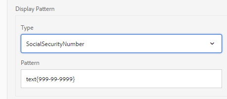

# 建立互動式通信{#create-an-interactive-communication}

## 概覽 {#overview}

互動式通訊可集中管理建立、組裝和傳遞個人化和互動式通訊。 運用列印為網頁的主要通道，在建立互動式通訊的網頁輸出時，您可將工作重複的工作降至最低。

### 必備條件 {#prerequisites}

以下是建立互動式通訊的先決條件：

* 設定包含測試資料或實際資料來源（例如Microsoft® Dynamics的例項）的[表單資料模型](/help/forms/using/data-integration.md)。
* 請確定您有[Document片段](/help/forms/using/document-fragments.md)。
* 請確定您有[用於列印和Web頻道的範本](/help/forms/using/web-channel-print-channel.md)。
* 請確定您有必要的Web頻道[theme](/help/forms/using/themes.md)。

## 建立互動式通訊 {#createic}

1. 登入作AEM者例項並導覽至&#x200B;**[!UICONTROL Adobe Experience Manager]** > **[!UICONTROL Forms]** > **[!UICONTROL Forms與檔案]**。
1. 點選「**[!UICONTROL 建立]**」並選取「互動式通訊&#x200B;]**」。**[!UICONTROL 「建立互動式通信」頁面。

   

1. 輸入以下資訊。 :

   * **[!UICONTROL 標題]**:輸入「互動式通訊」的標題。
   * **[!UICONTROL 名稱]**:「互動式通訊」的名稱是從您輸入的標題衍生而來。視需要編輯。
   * **[!UICONTROL 說明]**:輸入有關互動式通信的說明。
   * **[!UICONTROL 表單資料模型]**:瀏覽並選取表單資料模型。如需表單資料模型的詳細資訊，請參閱[AEM Forms資料整合](/help/forms/using/data-integration.md)。

   * **[!UICONTROL 預填服務]**:選擇預填充服務以檢索資料並預填充互動式通信。
   * **[!UICONTROL 後處理類型]**:您可以選AEM擇在提交互動式通訊時觸發的或Forms工作流程。選擇要觸發的工作流類型。

   * **[!UICONTROL 後處理]**:選擇要觸發的工作流的名稱。當您選取工AEM作流程時，請提供附件路徑、版面路徑、PDF路徑、列印資料路徑和Web資料路徑。
   * **[!UICONTROL 標籤]**:選擇要套用至互動式通訊的標籤。您也可以輸入新的／自訂標籤名稱，然後按Enter鍵建立它。
   * **[!UICONTROL 作者]**：作者名稱會自動取自已登入使用者的使用者名稱。
   * **[!UICONTROL 發佈日期：]** 輸入發佈互動式通訊的日期。
   * **[!UICONTROL 取消發佈日期]**:輸入取消發佈互動式通訊的日期。

1. 點選&#x200B;**[!UICONTROL Next]**。 此時會出現指定列印和網頁頻道詳細資訊的畫面。
1. 輸入以下內容：

   * **[!UICONTROL 列印]**:選擇此選項可生成互動式通信的打印通道。
   * **[!UICONTROL 列印範本]**:瀏覽並選擇XDP作為打印模板。
   * **[!UICONTROL Web]**:選取此選項，可產生Web頻道或互動式通訊的回應式輸出。
   * **[!UICONTROL 互動式通訊Web範本]**:瀏覽並選取網頁範本。
   * **** 主題 **[!UICONTROL 選擇主題]**:瀏覽並選取主題，以設定互動式通訊網路頻道的樣式。如需詳細資訊，請參閱AEM Forms的[主題](/help/forms/using/themes.md)。

   * **[!UICONTROL 使用列印為Web頻道的主版]**:選取此選項，可建立與列印頻道同步的網頁頻道。使用列印頻道作為網頁頻道的主節點，可確保網頁頻道的內容與資料系結是從列印頻道衍生而來，當您點選「同步化」時，列印頻道中所做的變更會反映在網頁頻道中。 但是，作者可以視需要中斷Web頻道中特定元件的繼承。 如需詳細資訊，請參閱[同步Web頻道與列印頻道](../../forms/using/create-interactive-communication.md#synchronize)。
如果選擇**[!UICONTROL 使用作為Web通道主版打印]**&#x200B;選項，則可以選擇以下任一模式來生成Web通道：

      * **[!UICONTROL 自動版面]**:選取此模式可自動從列印頻道產生網頁頻道的預留位置、內容和資料系結。
      * **[!UICONTROL 手動組織]**:選取此模式，可使用「資料來源」標籤中的主版內容，手動選取列印渠道元素並將其新 **[!UICONTROL 增至]** 網路渠道。如需詳細資訊，請參閱[選擇列印頻道元素以建立Web頻道內容](#selectprintchannelelements)。

   有關打印通道和Web通道的詳細資訊，請參閱[打印通道和Web通道](/help/forms/using/web-channel-print-channel.md)。

1. 點選&#x200B;**[!UICONTROL Create]**。 將建立「交互通信」並顯示一個警報框。 點選&#x200B;**[!UICONTROL 編輯]**&#x200B;開始建立互動式通訊的內容，如[使用互動式通訊製作使用者介面](#step2)新增內容中所述。 或者，您可以點選&#x200B;**[!UICONTROL Done]**&#x200B;並選擇稍後編輯互動式通訊。

## 將內容新增至互動式通訊{#step2}

建立互動式通訊後，您可以使用互動式通訊製作介面來建立其內容。

有關互動式通信編寫介面的詳細資訊，請參閱[互動式通信編寫簡介](/help/forms/using/introduction-interactive-communication-authoring.md)。

1. 當您按[建立互動式通訊](#createic)中所述點選編輯時，就會啟動互動式通訊製作介面。 或者，您可以導覽至上現有的互動式通訊AEM資產，選取它，然後點選&#x200B;**[!UICONTROL 編輯]**&#x200B;以啟動互動式通訊製作介面。

   依預設，互動式通訊的列印頻道會出現，除非互動式通訊僅限網頁頻道。 「互動式通訊」的「列印」頻道會顯示目標區域，如所選XDP/列印頻道範本中所示。 在這些目標區域和欄位中，您可以新增元件或資產。

1. 在選擇「打印通道」後，選擇&#x200B;**[!UICONTROL 「元件]**」頁籤。 列印頻道提供下列元件：

   | **元件** | **功能** |
   |---|---|
   | 圖表 | 新增可在互動式通訊中使用的圖表，以視覺化方式呈現從表單資料模型收集擷取的二維資料。 如需詳細資訊，請參閱[在互動式通訊中使用圖表](/help/forms/using/chart-component-interactive-communications.md)。 |
   | 文件片段 | 可讓您將可重複使用的元件（例如文字、清單或條件）新增至互動式通訊。 添加的元件可以是基於表單資料模型的元件，也可以是沒有表單資料模型的元件。 |
   | 影像 | 讓您插入影像。 |

   將元件拖放至您的互動式通訊中，並視需要加以設定。

   您也可以在針對列印和網頁頻道製作互動式通訊時，使用還原和重做作業。

   使用還原操作可放棄上次執行的操作，而重做操作可再次合併已放棄的操作。 例如，如果您已在「互動式通訊」中插入影像或建立資料系結，且需要捨棄它，請使用還原操作。

   

   還原和重做選項會顯示在編寫UI頁面工具列上。 僅當執行動作後，才會顯示還原選項。 重做選項僅在執行撤消操作後才會顯示在頁面工具欄上。 重新整理頁面時，會重設這些動作。

1. 在選取列印渠道後，請前往&#x200B;**[!UICONTROL Assets]**&#x200B;標籤，並套用篩選以僅顯示您想要查看的資產。

   使用「資產」瀏覽器，您也可以直接將資產拖放至「互動式通訊」目標區域。

   

1. 將檔案片段拖放至互動式通訊。 以下是您可在互動式通訊的列印管道中使用的檔案片段類型。

<table>
 <tbody>
  <tr>
   <td><strong>文件片段類型</strong></td>
   <td><strong>範例用途</strong></td>
  </tr>
  <tr>
   <td><a href="/help/forms/using/texts-interactive-communications.md" target="_blank">文字</a></td>
   <td>新增地址、收件者電子郵件和信件正文的文字 </td>
  </tr>
  <tr>
   <td><a href="/help/forms/using/conditions-interactive-communications.md" target="_blank">條件</a></td>
   <td>根據策略類型，將適當的標頭映像添加到通信的條件：Standard或Premium。  </td>
  </tr>
  <tr>
   <td>清單</td>
   <td>檔案片段群組，包括文字、條件、其他清單和影像。  </td>
  </tr>
 </tbody>
</table>

您也可以使用&#x200B;**[!UICONTROL Assets]**&#x200B;標籤，將新片段拖曳至目標區域，以取代目標區域與檔案片段之間的系結。 拖曳片段時目標區域的藍色陰影表示檔案片段可以拖曳至目標區域。

有關文檔片段的詳細資訊，請參閱[文檔片段](/help/forms/using/document-fragments.md)。

製作介面可讓您區分互動式通訊中未系結和系結的欄位和變數。 介面會使用橘色邊框反白標示未系結的欄位和變數。

此外，當您將滑鼠暫留在這些元素上時，工具提示會顯示「欄位（未系結）」或「變數（未系結）」訊息。

文檔片段中使用的未綁定變數有時不能顯示在編寫介面上。 這可能是因為檔案片段中的內嵌文字規則，或是條件片段的情況。 在這種情況下，以藍色反白顯示的工具提示會顯示為檔案片段的一部分。 工具提示會顯示檔案片段中使用的未系結變數數目。

點選檔案片段，點選(Configure)，然後點選「互動式通訊」側點的&#x200B;**[!UICONTROL Properties]**。 **[!UICONTROL 變數與資料模型物件]**&#x200B;區段會列出變數，包括隱藏變數，以及檔案片段中使用的資料模型物件。 使用每個資料模型物件或變數旁的（編輯）圖示來編輯屬性。

1. 若要設定變數的系結，請點選變數並選取（設定），然後在側欄的「屬性」面板中設定系結屬性。

   * **無**:代理將填寫變數的值。
   * **文字片段**:如果選中此選項，您可以瀏覽並選擇文本文檔片段，其內容將呈現在欄位中。只有這些文字檔案片段可以系結至其中沒有變數的變數。
   * **資料模型物件**:選擇在欄位中填入其值的表單資料模型屬性。
   * **預設值：** 您可以使用此欄位來定義變數的預設值。當您預覽「互動式通訊」或在「代理」使用者介面中時，就會顯示該值。
   * **顯示模式：** 您也可以定義變數的顯示格式。從&#x200B;**Type**&#x200B;下拉式清單中選取任何預先定義的選項，以套用顯示格式至變數。 選擇&#x200B;**Custom**&#x200B;可定義清單中不可用的顯示模式。 如需詳細資訊，請參閱[資料顯示模式](../../forms/using/create-interactive-communication.md#datadisplaypatterns)。

   導覽至[變數和資料模型物件](../../forms/using/create-interactive-communication.md#hiddenvariables)，以設定檔案片段中隱藏變數的系結。

   您也可以拖放資料來源元素或文字檔案片段，以設定變數的系結。  若要建立與任何資料來源元素的系結，請選取「資料來源」標籤，並將元素拖放至變數名稱。 ****&#x200B;資料來源元素和變數必須是相同類型，才能成功設定系結。 如果您將資料來源元素拖放至已系結的變數，新元素會取代先前的元素，以建立與變數的新系結。 同樣地，選擇&#x200B;**Assets**&#x200B;標籤，並將文字檔案片段拖放至變數名稱，以設定它們之間的系結。 文字檔案片段不得包含任何變數。

1. 若要新增表格，並選取列印頻道，請在&#x200B;**[!UICONTROL Assets]**&#x200B;標籤中套用篩選以僅顯示版面片段。 將所需的版面片段拖放至互動式通訊。 版面片段是以XDP為基礎，可用於在互動式通訊中建立圖形版面或靜態和動態表格，以填入動態資料。

   範例：可顯示毛額溢價、忠誠度折扣%，以及舊政策與新政策的緊急路邊協助。

   如需版面片段的詳細資訊，請參閱[檔案片段](/help/forms/using/document-fragments.md)。

1. 在選取列印頻道後，在&#x200B;**[!UICONTROL Assets]**&#x200B;標籤中，會將篩選套用至顯示影像。 將所需影像拖放至互動式通訊，例如公司標誌。

   此外，在互動式通訊中管理下列項目：

   * [添加和配置圖表](/help/forms/using/chart-component-interactive-communications.md)
   * [將網頁頻道與列印頻道同步](../../forms/using/create-interactive-communication.md#synchronize)

      * 自動同步
      * 取消繼承
      * 重新啟用繼承
      * 同步
   * [附件與資料庫存取](../../forms/using/create-interactive-communication.md#attachmentslibrary)
   * [XDP/佈局欄位屬性](../../forms/using/create-interactive-communication.md#xdplayoutfieldproperties)
   * [新增規則至元件](../../forms/using/create-interactive-communication.md#rules)

1. 切換到&#x200B;**[!UICONTROL Web通道]**。 網頁頻道會出現在互動式通訊編輯器中。 當您第一次從列印頻道切換至Web頻道時，會進行自動同步。 如需詳細資訊，請參閱「從列印頻道同步化Web頻道」](../../forms/using/create-interactive-communication.md#synchronize)。[

   由於我們在此範例中使用「列印」做為網頁的主版，因此列印頻道預留位置、內容和資料系結會同步至網頁頻道。 不過，您可以變更和自訂網路頻道中的特定內容。 [取消](#cancelinheritance) 已使用列印渠道產生的目標區域和變數的繼承，以便能夠自訂內容。

   

   點選檔案片段，點選(Configure)，然後點選「互動式通訊」側點的&#x200B;**[!UICONTROL Properties]**。 **[!UICONTROL 變數與資料模型物件]**&#x200B;區段會列出變數，包括隱藏變數，以及檔案片段中使用的資料模型物件。 使用每個資料模型物件或變數旁的（編輯）圖示來編輯屬性。 此外，對於使用打印通道在Web通道中自動生成的[文檔片段，使用每個資料模型對象和變數旁的（取消繼承）表徵圖[取消繼承](#cancelinheritance)並能夠編輯它們。](#synchronize)

1. 若要在Web頻道中新增其他元件，在選取Web頻道時，點選&#x200B;**[!UICONTROL Components]**。 視需要將元件拖放至互動式通訊的網路頻道，然後繼續進行設定。

   | 元件 | 功能 |
   |---|---|
   | 圖表 | 新增可在互動式通訊中使用的圖表，以視覺化方式呈現從表單資料模型收集擷取的二維資料。 如需詳細資訊，請參閱[使用圖表元件](../../forms/using/chart-component-interactive-communications.md)。 |
   | 文件片段 | 可讓您將可重複使用的元件、文字、清單或條件新增至互動式通訊。 您新增至互動式通訊的可重複使用元件可以是以表單資料模型為基礎，或是沒有表單資料模型。 |
   | 影像 | 讓您插入影像。 |
   | 面板 | 允許您將[面板](../../forms/using/create-interactive-communication.md#add-panel-component-to-the-web-channel)添加到交互通信中。 |
   | 表格 | 新增表格以整理行和欄中的資料。 |
   | 目標區域 | 在Web頻道中插入目標區域，以組織Web頻道特定的元件。 目標區域是一個簡單容器，可讓您將Web頻道特定元件分組。 |
   | 文字 | 將豐富式文字新增至互動式通訊的網路頻道。 文本還可以利用表單資料模型對象使內容動態化。 |
   | 按鈕 | 允許您將[Button](../../forms/using/create-interactive-communication.md#add-button-component-to-the-web-channel)添加到交互通信中。 您可以使用Button元件來導覽至其他互動式通訊、最適化表單、其他資產（例如影像或檔案片段）或外部URL。 |
   | 分隔符號 | 允許您在互動式通信中插入水準線。 使用此元件可以區分通信中的各個部分。 例如，您可以使用「分隔符號」元件來區分信用卡對帳單中的「客戶詳細資訊」和「信用卡詳細資訊」部分。 |

1. 視需要，將資產插入您的網頁頻道。

   您可以[預覽您的互動式通訊](#previewic)，以檢視互動式通訊的列印和網頁輸出外觀，並視需要繼續進行變更。

## 預覽互動式通訊{#previewic}

您可以使用&#x200B;**預覽選項**&#x200B;來評估互動式通訊的外觀。 互動式通訊的網路頻道也提供多種裝置模擬互動式通訊體驗的選項。 例如，iPhone、iPad和Desktop。 您可搭配使用&#x200B;**預覽**&#x200B;和&#x200B;**模擬器**選項，以預覽不同螢幕大小裝置的網頁輸出。 預覽中的範例資料會從指定的表單資料模型填入。

1. 選取（列印或網頁）頻道以預覽並點選預覽。 出現「Interactive Communication（互動式通信）」。

   >[!NOTE]
   >
   >預覽會填入指定表單資料模型的範例資料。 有關使用某些其他資料或使用預填充服務來預覽互動式通信的詳細資訊，請參閱[使用表單資料模型](/help/forms/using/using-form-data-model.md)和[使用表單資料模型](/help/forms/using/work-with-form-data-model.md)。

1. 對於Web頻道，請使用來檢視互動式通訊在各種裝置上的外觀。

   

此外，您還可以使用代理UI](/help/forms/using/prepare-send-interactive-communication.md)準備和發送互動式通信。[

## 在交互通信中配置屬性{#configure-properties-in-interactive-communication}

### 附件和庫訪問{#attachmentslibrary}

在打印渠道中，您可以配置附件和庫訪問權限，以允許代理在互動式通信的代理UI中管理附件：

1. 在「列印」頻道中，反白標示「檔案容器」並點選「屬性」。****

   

   「屬性」面板出現在側欄中。

   

1. 展開&#x200B;**附件**&#x200B;並指定以下屬性：

   * **[!UICONTROL 允許程式庫存取]**:在「代理UI」中選擇以啟用代理的庫訪問。如果啟用，代理可在準備互動式通訊時從程式庫新增檔案。
   * **[!UICONTROL 允許重新排序附件]**:選擇此選項可讓代理使用互動式通信重新排序附件。
   * **[!UICONTROL 允許的附件數上限]**:指定「互動式通訊」允許的附件數上限。
   * **[!UICONTROL 要附加的檔案]**:點選「 **** 新增」並瀏覽以選取要附加的檔案，並指定下列項目：

      * **[!UICONTROL 依預設將此檔案附加至檔案]**:如果附件不是「強制」，則可以更改此選項。
      * **[!UICONTROL 強制：]** 代理將無法刪除代理UI中的附件。

   

1. 點選&#x200B;**[!UICONTROL Done]**。

### XDP/佈局欄位屬性{#xdplayoutfieldproperties}

1. 編輯互動式通信的打印通道時，將滑鼠指標暫留在打印通道模板中構建的欄位上，然後選擇（配置）。

   「屬性」對話框出現在側欄中。

   

1. 指定下列項目：

   * **[!UICONTROL 名稱]**:JCR節點名稱。
   * **[!UICONTROL 標題]**:在「代理UI」和「文檔容器」樹中輸入座席可見的標題。
   * **[!UICONTROL 綁定類型]**:為欄位選擇以下綁定類型之一。

      * 無：工程師將填寫屬性的值。
      * 文字片段：如果選中此選項，您可以瀏覽並選擇文本文檔片段，其內容將呈現在欄位中。 或者，將文字檔案片段拖放至欄位名稱，以設定它們之間的系結。 文字檔案片段不得包含任何變數。
      * 資料模型對象：選擇在欄位中填入其值的表單資料模型屬性。 或者，選擇「**資料來源**」標籤，並將屬性拖放至欄位。
   * **[!UICONTROL 預設值]**:當指定的資料模型對象或文本片段沒有提供值時，預設值可確保欄位不為空。如果資料系結類型為無，則會在欄位中預先填入預設值。
   * **[!UICONTROL 顯示模式]**:您也可以定義欄位的顯示格式。從&#x200B;**Type**&#x200B;下拉式清單中選擇任何預先定義的選項，將顯示格式套用至欄位。 選擇&#x200B;**Custom**&#x200B;可定義清單中不可用的顯示模式。 如需詳細資訊，請參閱[資料顯示模式](../../forms/using/create-interactive-communication.md#datadisplaypatterns)

   * **[!UICONTROL Editable By Agent]**:選擇此選項可允許代理編輯代理UI中欄位中的值。如果「綁定類型」是「文本片段」，則此設定不適用。
   * **[!UICONTROL 標籤]**:在Agent UI中為Agent指定與欄位一起顯示的文本字串。如果「綁定類型」是「文本片段」，則此設定不適用。
   * **[!UICONTROL 工具提示]**:在Agent UI中，將滑鼠移到Agent上，輸入文本字串。如果「綁定類型」是「文本片段」，則此設定不適用。
   * **[!UICONTROL 必要]**:選擇該選項可使座席的欄位成為必填欄位。如果「綁定類型」是「文本片段」，則此設定不適用。
   * **[!UICONTROL 允許多行]**:選取此欄位可允許在欄位中輸入多行文字。如果「綁定類型」是「文本片段」，則此設定不適用。

1. 點選。

### 資料顯示模式{#datadisplaypatterns}

製作介面可讓您定義欄位、變數和表單資料模型元素的資料顯示模式，以建立適用於印刷和網頁通道的互動式通訊。

若要設定資料顯示模式，請點選元素，選取（設定），然後在側欄的&#x200B;**[!UICONTROL Properties]**&#x200B;面板中設定顯示模式。 從&#x200B;**[!UICONTROL Type]**&#x200B;下拉式清單中選擇任何預先定義的選項，以檢視與所選類型相關聯的模式。 從&#x200B;**[!UICONTROL Type]**&#x200B;下拉式清單中選擇&#x200B;**[!UICONTROL Custom]**，以定義清單中不可用的模式。 在&#x200B;**[!UICONTROL Pattern]**&#x200B;欄位中編輯值會自動將類型修改為&#x200B;**[!UICONTROL Custom]**。

若要套用顯示模式，「模式」欄位中定義的字元或位數必須符合或超過欄位、變數和表單資料模型元素值中定義的字元或位數。 如需詳細資訊，請參閱[example](../../forms/using/create-interactive-communication.md#greaternumberofdigits)。

從列印頻道產生Web內容後，您可重新定義欄位、變數或表單資料模型元素的顯示模式。 因此，元素可以具有為打印和網頁通道定義的不同顯示模式。 如果您未定義列印頻道中的元素的顯示模式，並使用列印頻道自動產生網頁內容，則為列印頻道中的元素定義的資料系結會定義&#x200B;**[!UICONTROL Type]**&#x200B;下拉式清單中可用的顯示模式選項。 如果沒有為元素定義綁定，元素的資料類型將定義可用的顯示陣列選項。 例如，如果為打印通道中的元素建立「編號」類型的資料綁定，則&#x200B;**[!UICONTROL 「類型」(Type)]**&#x200B;下拉清單中可用的顯示模式選項是各種格式的「編號」類型。

切換至&#x200B;**預覽**&#x200B;模式或開啟Agent UI，以檢視套用至這些元素的顯示模式。

下表列出設定變數資料顯示模式後所顯示之值的範例：

| 類型 | 預設值 | 顯示圖樣 | 顯示值 | 說明 |
|---|---|---|---|---|
| SocialSecurityNumber | 123456789 | text{999-99-9999} | 123-45-6789 | 預設值欄位中的位數與「模式」欄位中的位數匹配。 根據圖樣的值會成功顯示。 |
| SocialSecurityNumber | 郵編：1234567 | text{999-99-9999} | 1-23-4567 | 預設值欄位中的位數小於「模式」欄位中的位數。 該模式適用於7個可用數字。 |
| SocialSecurityNumber | 1234567890 | text{999-99-9999} | 1234567890 | 預設值欄位中的位數大於「模式」欄位中的位數。 因此，顯示值沒有變化。 |

如果未為變數或表單資料模型元素指定顯示模式，則預設會使用[全域檔案片段組態](https://helpx.adobe.com//experience-manager/6-5/forms/using/interactive-communication-configuration-properties.html)。

如果您未將顯示模式套用至數字資料類型的變數，「列印預覽」會根據全域檔案片段設定來顯示模式。 如果對預設全局文檔片段配置應用更改，代理UI仍會根據為區域設定定義的預設分隔符顯示模式。

同樣地，對於欄位，如果未指定顯示模式，則建立打印模板(XDP)時定義的模式將應用於欄位。 如果在建立打印模板時沒有模式，則基於XFA規範的預設模式將應用於這些欄位。

此外，如果指定的顯示模式不正確或無法應用，則基於XFA規範的預設模式將應用於欄位、變數或表單資料模型元素。

## 將規則套用至互動式通訊元件{#rules}

若要條件化互動式通訊中的元件或內容，請點選元件／內容片段，然後選取（建立規則）以啟動規則編輯器。

如需詳細資訊，請參閱：

* [規則編輯器](/help/forms/using/rule-editor.md)
* [互動式通訊製作簡介](/help/forms/using/introduction-interactive-communication-authoring.md)

## 使用表{#tables}

### Interactive Communication中的動態表{#dynamic-tables-in-interactive-communication}

您可以使用版面片段在互動通訊中新增動態表格。 下列步驟使用信用卡對帳單的範例來說明在互動式通訊中建立動態表格時使用版面片段的情形。

1. 請確定中提供了建立表所需的佈局片段AEM。
1. 在互動式通訊的列印頻道中，從資產瀏覽器將版面片段（含多欄表格）拖放至目標區域。

   

   「互動式通訊」版面配置區域中會出現一個表格。

   

1. 指定表格各儲存格的資料系結。 要建立可重複行，請在屬於公共收集屬性的行中插入表單資料模型屬性。

   1. 點選表格中的儲存格，並選取（設定）。

      「屬性」對話框出現在側欄中。

      

   1. 設定屬性：

      * **[!UICONTROL 名稱]**:JCR節點名稱。
      * **[!UICONTROL 標題]**:輸入將在交互通信編輯器中顯示的標題。
      * **[!UICONTROL 綁定類型]**:為欄位選擇以下綁定類型之一。

         * **[!UICONTROL 無]**
         * **[!UICONTROL 資料模型物件]**:表單資料模型屬性的值會填入欄位中。或者，選擇「**資料來源**」標籤，並將屬性拖放至欄位。
      * **[!UICONTROL 資料模型物件]**:在欄位中填入其值的表單資料模型屬性。
      * **[!UICONTROL 預設值]**:當指定的資料模型對象沒有提供值時，預設值可確保欄位不為空。預設值會預先填入欄位中。

      * **[!UICONTROL Editable By Agent]**:選擇此選項可允許代理編輯代理UI中欄位中的值。
   1. 點選。

1. 預覽互動式通訊，以檢視以資料呈現的表格。

   

### 僅限Web通道的表{#webchanneltables}

點選Web範本中的根面板，點選&#x200B;**+**&#x200B;以新增&#x200B;**Table**&#x200B;元件至互動式通訊。 在交互通信中插入包含兩行的表。 表的第一行表示表標題。

#### 向表{#addrowscolumnstable}添加行和列

**要添加或刪除列：**

1. 點選表格標題列中的預設文字方塊以檢視元件工具列。
1. 選擇&#x200B;**添加列**&#x200B;或&#x200B;**刪除列**&#x200B;分別添加或刪除表列。

**要添加或刪除行：**

1. 點選任何表格列以檢視元件工具列。 您也可以使用互動式通訊旁邊的「內容」瀏覽器來選取表格列。
1. 選擇「添加行」或「刪除行」分別添加或刪除表行。 ********&#x200B;使用工具列中的&#x200B;**上移**&#x200B;和&#x200B;**下移**&#x200B;選項來重新排清單格中的列。

**A.** 添加行 **B.** 刪除行 **C.向上移** 動D. **** 向下移動

#### 在表格儲存格{#addedittexttable}中新增或編輯文字

1. 在表格儲存格中選取預設文字方塊，然後點選（編輯）。
1. 在表格儲存格中輸入文字，然後點選以儲存文字。

#### 在表格儲存格與資料模型物件元素{#createbindingtablecells}之間建立系結

1. 在表格列中選取預設文字方塊，然後點選（編輯）。
1. 點選「資料模型物件」下拉式清單，並選取屬性。
1. 點選以儲存表格儲存格和資料模型物件屬性之間的系結。

#### 在表格儲存格{#createhyperlinktable}中建立文字的超連結

1. 在表格儲存格中選取預設文字方塊，然後點選（編輯）。
1. 選取表格儲存格中的文字，並點選「超連結」圖示。
1. 在&#x200B;**路徑**&#x200B;欄位中指定URL。
1. 點選以儲存超連結屬性。

#### 建立動態表{#createdynamictables}

您可以使用類型集合的資料模型屬性，在「互動式通訊」中建立僅限Web頻道的動態表格。 此表是集合屬性的子屬性的表示。 您只能編輯表格中各個儲存格的格式屬性。

1. 切換至Web頻道，然後選擇顯示Data Sources瀏覽器。
1. 將系列屬性拖放至子表單。 在子表單中建立表。
1. 在互動式通訊的網頁預覽中預覽表格。

#### 對表{#sortcolumns}中的列進行排序

您可以根據互動式通訊中表格中的任何欄來排序資料。 列中的值可以按升序或降序排序。

排序可應用於包含：

* 靜態文字
* 資料模型對象屬性
* 靜態文字與資料模型物件屬性的組合

要啟用排序：

1. 選取表格並點選（設定）。 您也可以使用「互動式通訊」的側鍵中的&#x200B;**Content**&#x200B;瀏覽器來選取表格。
1. 選擇&#x200B;**啟用排序。**
1. 點選以儲存表格屬性。 欄標題中的排序圖示（向上和向下箭頭）表示已啟用排序。

   

1. 切換至&#x200B;**預覽**&#x200B;模式以檢視輸出。 表格會根據表格的第一欄自動排序。
1. 按一下欄標題，以根據欄排序值。

   具有向上箭頭的欄標題代表：

   * 表格會根據該欄排序。
   * 列中的值以升序顯示。

   

   同樣地，帶有向下箭頭的列標題表示列中的值以降序顯示。

## 編輯互動式通信屬性{#edit-interactive-communication-properties}

建立互動式通訊後，您就可以在稍後階段編輯其屬性。

使用&#x200B;**Properties**&#x200B;頁可以：

* 編輯建立互動通訊時指定欄位的值，例如「標題」和「說明」。
* 新增或刪除現有互動式通訊的網路頻道。
* 預覽、下載或刪除互動式通訊
* 開啟[代理UI](/help/forms/using/prepare-send-interactive-communication.md)。

要訪問&#x200B;**屬性**&#x200B;頁：

1. 登入作AEM者例項並導覽至&#x200B;**Adobe Experience Manager** > **Forms** > **Forms與檔案**。
1. 選擇「Interactive Communication（交互通信）」 ，然後按一下「Properties（屬性）」 ****。
1. 選擇「**一般**」標籤以編輯「**標題**」和「說明&#x200B;**」欄位。**

### 添加或刪除Web通道{#add-or-delete-the-web-channel}

執行以下步驟，為現有互動式通信添加Web通道：

1. 在&#x200B;**屬性**&#x200B;頁面上，選擇&#x200B;**通道**&#x200B;頁籤。
1. 選中&#x200B;**Web**&#x200B;複選框，並選擇Web通道的模板。
1. 選擇&#x200B;**使用打印作為Web通道的主設備**&#x200B;以啟用Web通道和打印通道之間的同步。
1. 點選&#x200B;**儲存並關閉**&#x200B;以儲存變更。

   同樣地，您可以點選&#x200B;**頻道**&#x200B;標籤上的&#x200B;**Web**&#x200B;核取方塊，從「互動式通訊」中刪除網路頻道。

## 將Button元件添加到Web通道{#add-button-component-to-the-web-channel}

您可以將按鈕新增為互動式通訊的網路頻道元件。 使用[規則編輯器](../../forms/using/rule-editor.md)定義規則，以便能夠導覽至其他互動式通訊、最適化表單、其他資產（例如影像或檔案片段），或在點選按鈕時的外部URL。

若要新增按鈕並定義其上的規則：

1. 點選Web範本中的根面板並點選&#x200B;**+**，將&#x200B;**Button**&#x200B;元件新增至互動式通訊。
1. 點選按鈕元件並點選，以定義點選按鈕時的規則。
1. 在&#x200B;**When**&#x200B;區段中，從按鈕下拉式清單的狀態選擇&#x200B;**clicked**。
1. 在&#x200B;**Then**&#x200B;區段中：

   1. 從下拉式清單中選取動作。 例如，選擇&#x200B;**導覽至**&#x200B;作為動作類型。

   1. 指定互動式通訊、最適化表單、資產或網頁的URL。 例如，以下列格式指定URL，以導覽至另一個互動式通訊：https://&lt;server-name>:&lt;port>/editor.html/content/forms/af/&lt;Interactive Communication name>/channels/&lt;channel name - print or web>.html
   1. 指定在相同標籤、新標籤或新視窗中開啟資產的選項。
   1. 點選「**Done**」，然後點選「**Close**」以儲存規則。

   同樣地，您也可以從動作類型下拉式清單中選取其他可用選項，例如叫用服務和送出表單。 如需詳細資訊，請參閱[規則編輯器](../../forms/using/rule-editor.md)。

1. 預覽互動式通訊並點選按鈕，以檢視在步驟4(b)中指定的互動式通訊、調適性表單、資產或網頁。

## 將面板元件添加到Web通道{#add-panel-component-to-the-web-channel}

「面板」元件是將其他元件分組在一起的預留位置，可控制在「互動式通訊」中如何排列一組元件，例如accordion和標籤。 面板元件還允許您讓一組元件為最終用戶重複使用，例如在填寫教育證書所需的多個條目中。

執行下列步驟，將面板元件新增至網頁頻道：

1. 使用下列任一選項，將&#x200B;**Panel**&#x200B;元件插入Web頻道：

   * 點選元件，點選&#x200B;**+**&#x200B;並選取&#x200B;**Panel**&#x200B;元件。

   * 從&#x200B;**Component**&#x200B;瀏覽器面板，將&#x200B;**Panel**&#x200B;元件拖放到交互通信中。

   * 點選&#x200B;**Content**&#x200B;瀏覽器面板中的&#x200B;**面板**，點選&#x200B;**新增子面板**。 選擇&#x200B;**添加子面板**&#x200B;選項會顯示&#x200B;**添加子面板**&#x200B;對話框。 輸入Panel元件的標題和可選說明和名稱。

1. 從&#x200B;**Content**&#x200B;瀏覽器點選面板，在面板上執行其他動作，例如設定、編輯規則、複製、刪除和插入元件。

   您也可以在&#x200B;**Content**&#x200B;瀏覽器中拖放面板，以反映右窗格中互動式通訊結構的變更。

## 使Web通道與打印通道{#synchronize}同步

當您在建立互動式通訊時選取「列印為網頁頻道的主版」時，會建立與列印頻道同步的網頁頻道，而網頁頻道的內容與資料系結會從列印頻道衍生出來，當您點選「同步化」時，列印頻道中所做的變更可能會反映在網頁頻道中。

但是，作者可以視需要中斷Web頻道中元件的繼承。

 

### 自動同步{#autosync}

如果選擇&#x200B;**[!UICONTROL 使用作為Web通道主版打印]**&#x200B;選項，則可以選擇以下任一模式來生成Web通道：

* **[!UICONTROL 自動版面]**:選取此模式可自動從列印頻道產生網頁頻道的預留位置、內容和資料系結。
* **[!UICONTROL 手動組織]**:選取此模式，可使用「資料來源」標籤中的主要內容，手動選取列印渠道元素並新增至網路渠道。如需詳細資訊，請參閱[選擇列印頻道元素以建立Web頻道內容](#selectprintchannelelements)。

>[!NOTE]
>
>同步化頻道時，僅會同步從列印頻道到網頁頻道的檔案片段、影像、條件、清單和版面片段。 包含這些元素的子表單或父節點不會同步。

### 選擇「列印頻道元素」以建立Web頻道內容{#selectprintchannelelements}

如果您在建立「互動式通信」時選擇「打印為主版」，但不選擇自動同步選項，則還可以將打印渠道元素拖放到Web渠道編寫介面。

導覽至&#x200B;**Data Sources** > **主內容**&#x200B;以檢視列印頻道元素。 將目標區域、欄位或表格拖放至網頁頻道製作介面。 元素名稱旁的藍色圓圈圖示表示「列印」色版元素已包含在網頁色版中。

### 取消繼承 {#cancelinheritance}

在Web頻道中，元件會內嵌在目標區域中。

將滑鼠指標暫留在Web頻道中的相關目標區域或變數上，並選取（取消繼承），然後在取消繼承對話方塊中，點選&#x200B;**[!UICONTROL 是]**。

目標區域內元件的繼承將被取消，現在您可以根據需要進行編輯。

### 重啟先前設定 {#re-enable-inheritance}

在Web渠道中，如果已取消元件的繼承，則可重新啟用它。 若要重新啟用繼承，請將滑鼠指標暫留在包含元件的相關目標區域的邊界上，然後點選。

將出現「恢復繼承」對話框。

如果需要，請選擇&#x200B;**[!UICONTROL 回復繼承後同步頁面]**。 選擇此選項可同步整個互動通信。 如果未選擇此選項，則恢復繼承時，只會同步相關目標區域。

點選&#x200B;**[!UICONTROL 是]**。

### 同步 {#synchronize-1}

如果您使用「列印為網頁頻道的主版」並變更「列印」頻道，則可同步化內容，將最新變更帶入網頁頻道。

1. 若要將Web頻道與列印頻道同步，請切換至Web頻道，然後點選「更多選項」圖示。

   

1. 點選下列其中一項：

   * **[!UICONTROL 與列印同步]**:僅同步未取消繼承的目標區域的內容。
   * **[!UICONTROL 重設]**:將網路頻道內容與列印頻道同步，並捨棄對網路頻道所做的所有變更。

### 使用元件工具欄對繼承的元件{#componenttoolbar}執行操作

使用「同步」選項在網頁頻道中自動產生內容後，您就可以在元件上執行更多動作，而不會取消繼承。

點選元件可檢視下列選項：

* **複製：** 複製元件並貼至互動式通訊的其他位置。
* **剪下：** 在互動式通訊中，將元件從一個位置移至另一個位置。
* **插入元件：** 在選定元件上方插入元件。
* **貼上：** 使用上述選項貼上您剪下或複製的元件。
* **群組：** 如果您要剪下、複製或貼上多個元件，請選取多個元件。
* **父代：** 選擇元件的父代。
* **查看SOM表達式：** 查看 [元件](../../forms/using/using-som-expressions-adaptive-forms.md) 的SOM表達式。

* **在面板中分組對** 像：在面板中分組元件，以便能夠同時對這些元件執行操作。如需詳細資訊，請參閱「面板」中的「群組物件」。

* **取消繼承：** [取消目](#cancelinheritance) 標區域內元件的繼承以進行編輯。

### 在面板{#groupobjectspanel}中對對象進行分組

網頁頻道製作介面有助於將面板中的元件分組，以便能夠同時對這些元件執行操作。 **Content**&#x200B;標籤將分組的元件列為內容樹中面板的子元素。

1. 點選元件並選取群組()操作。
1. 選取多個元件，然後點選「面板」中的「**群組物件」。**

   

1. 在&#x200B;**面板**&#x200B;中的組對象對話框中，輸入面板的名稱。
1. 輸入面板的可選標題和說明。
1. 按一下。

   分組的元件在內容樹中顯示為「面板」的子元素。

   

