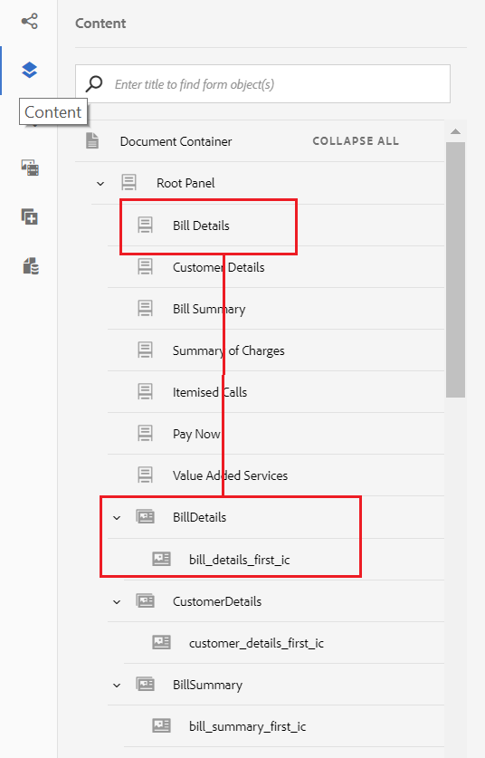

# 教學課程：建立互動式通訊 {#tutorial-create-interactive-communication}

本教學課程是「建立您的第 [一個互動式通訊」系列的一個步驟](/help/forms/using/create-your-first-interactive-communication.md) 。 建議依序依序依序排列，以瞭解、執行和展示完整的教學課程使用案例。

一旦您建立了Web版本的所有建置區塊，例如表單資料模型、檔案片段、範本和主題，就可以開始建立互動式通訊。

互動式通訊可透過兩個通道提供：平面與網頁。 您也可以以主版的方式建立互動式的列印通訊管道。 列印為網頁頻道的主選項，可確保網頁頻道的內容、繼承和資料系結是從列印頻道衍生而來。 此外，還可確保在列印頻道中所做的變更在網頁頻道中同步。 不過，「互動式通訊」作者可以中斷Web頻道中特定元件的繼承。

本教學課程將逐步帶您建立適用於印刷和網路頻道的互動式通訊。 在本教學課程結束時，您將能夠：

* 建立適用於列印頻道的互動式通訊
* 建立適用於網路頻道的互動式通訊
* 以印刷為主的方式建立印刷與網路互動式通訊

## 建立互動式平面與網路通訊，毋需同步 {#create-interactive-communications-for-print-and-web-with-no-synchronization}

### 建立適用於列印頻道的互動式通訊 {#create-interactive-communication-for-print-channel}

以下是本教學課程中已建立且建立列印頻道互動式通訊時所需的資源清單：

**** 列印範本： [create_first_ic_print_template](../../forms/using/create-templates-print-web.md)

**** 表單資料模型： [FDM_Create_First_IC](../../forms/using/create-form-data-model0.md)

**** 檔案片段： [bill_details_first_ic、customer_details_first_ic、bill_summary_first_ic、summary_charges_first_ic](../../forms/using/create-document-fragments.md)

**** 版面片段： [table_lf](../../forms/using/create-templates-print-web.md)

**** 影像：PayNow和ValueAddedServices

1. 登入AEM作者例項並導覽至 **Adobe Experience Manager** > **Forms** > **Forms &amp; Documents**。
1. 點選「 **建立** 」並選 **取「互動式通訊」**。 此時將顯示 **「建立互動式通信** 」嚮導。
1. 在「 **標題」和「名稱** 」欄位中指定create_first_ic ******** 。 選 **擇FDM_Create_First_IC** 作為表單資料模型並點選 **下一步**。
1. 在「頻 **道** 」精靈中：

   1. 指 **定create_first_ic_print_template** 為「列印」範本，然後點選「 **選取」**。 請確定未 **選取「使用列印為網頁頻道的主版** 」核取方塊。

   1. 指 **定Create_First_IC_templates資料夾>** Create_First_IC_Web_Template **為Web範本，然後點選「選** 取」 ****。

   1. 點選「 **建立**」。
   將顯示一條確認消息，表明已成功建立互動式通信。

1. 點選「 **編輯** 」以開啟右窗格中的「互動式通訊」。
1. 前往「資 **產** 」索引標籤，並套用篩選器，只顯示左側窗格中的檔案片段。
1. 在「互動式通訊」中將下列檔案片段拖放至其目標區域：

   | 文件片段 | 目標區域 |
   |---|---|
   | bill_details_first_ic | BillDetails |
   | customer_details_first_ic | 客戶詳細資訊 |
   | bill_summary_first_ic | BillSummary |
   | summary_charges_first_interactive_communication | 費用 |

   

1. 點選 **圖表** 目標區域，點選 **+** 以新增圖 **** 表元件。
1. 點選圖表元件並選取(  設定)。 圖表屬性會顯示在左窗格中：

   1. 指定圖表的名稱。
   1. 從「 **圖表類** 型」下拉式清 **單中選取** 「圓形圖」。
   1. 在 **X** 軸節中，從調 **用資料模型對象類型中選** 擇調用類型 **** 。 點選 。
   1. 從「 **功能** 」下拉式清 **單中選取「頻率** 」。
   1. 從「 **Y軸** 」部分的「調 **用****」資料模型對象類型中選** 擇「調用類型」屬性。 點選 。
   1. 點選  以儲存圖表屬性。

1. 前往「資 **產** 」標籤，並套用篩選，只顯示左側窗格中的版面片段。 將table_lf **layout片段拖放至** Itemized Calls **** target區域。
1. 在「日期」欄中選取「文字欄 **位** 」，然後點選  （設定）。
1. 從「 **綁定類型** 」下拉清單中選擇「資料模型對象」，然後選 **擇調用** > ******** calldateZombe。 點選  兩次以儲存屬性。

   同樣地，在Callding中 **分別建立調用時間**、調用數、調用數 **、調用數、調用時間的電荷、************************** Calldtime數、Calldding電荷、Calldding電荷和調用持續時間的調用Calldign列。

1. 點選 **PayNow** 目標區域，並點選 **+** 以新增 **Image** 元件。
1. 點選影像元件並選取(  設定)。 影像屬性會顯示在左窗格中：

   1. 在「 **名稱** 」欄位中，將PayNow指定為影像 **名稱** 。
   1. 點選 **「上傳**」，選取儲存在本機檔案系統上的影像，然後點選「 **開啟」**。
   1. 點選  以儲存影像屬性。

1. 重複步驟13和14，將 **ValueAddedServices** 映像添加到 **** ValueAddedServices目標區域。

### Create Interactive Communication for Web channel {#create-interactive-communication-for-web-channel}

以下是本教學課程中已建立的、在建立網路頻道互動式通訊時需要的資源清單：

**** Web範本： [Create_First_IC_Web_Template](../../forms/using/create-templates-print-web.md)

**** 表單資料模型： [FDM_Create_First_IC](../../forms/using/create-form-data-model0.md)

**** 檔案片段： [bill_details_first_ic、customer_details_first_ic、bill_summary_first_ic、summary_charges_first_ic](../../forms/using/create-document-fragments.md)

**** 影像：PayNowWeb和ValueAddedServicesWeb

1. 登入AEM作者例項並導覽至 **Adobe Experience Manager** > **Forms** > **Forms &amp; Documents**。
1. 點選「 **建立** 」並選 **取「互動式通訊」**。 此時將顯示 **「建立互動式通信** 」嚮導。
1. 在「 **標題」和「名稱** 」欄位中指定create_first_ic ******** 。 選 **擇FDM_Create_First_IC** 作為表單資料模型並點選 **下一步**。
1. 在「頻 **道** 」精靈中：

   1. 指 **定create_first_ic_print_template** 為「列印」範本，然後點選「 **選取」**。 請確定未 **選取「使用列印為網頁頻道的主版** 」核取方塊。

   1. 指 **定Create_First_IC_templates資料夾>** Create_First_IC_Web_Template **為Web範本，然後點選「選** 取」 ****。

   1. 點選「 **建立**」。
   將顯示一條確認消息，表明已成功建立互動式通信。

1. 點選「 **編輯** 」以開啟右窗格中的「互動式通訊」。
1. 從左窗格 **點選** 「頻道」標籤，然後點選「 **Web」**。
1. 前往「資 **產** 」索引標籤，並套用篩選器，只顯示左側窗格中的檔案片段。
1. 在「互動式通訊」中將下列檔案片段拖放至其目標區域：

   | 文件片段 | 目標區域 |
   |---|---|
   | bill_details_first_ic | BillDetails |
   | customer_details_first_ic | 客戶詳細資訊 |
   | bill_summary_first_ic | BillSummary |
   | summary_charges_first_interactive_communication | 費用 |

1. 點選 **Summary of Charges** target區域，並點選 **+** 以新增 **Chart** 元件。
1. 點選圖表元件並選取(  設定)。 圖表屬性會顯示在左窗格中：

   1. 指定圖表的名稱。
   1. 從「 **圖表類** 型」下拉式清 **單中選取** 「圓形圖」。

   1. 在 **X** 軸節中，從調 **用資料模型對象類型中選** 擇調用類型 **** 。 點選 。

   1. 從「 **功能** 」下拉式清 **單中選取「頻率** 」。

   1. 從「 **Y軸** 」部分的「調 **用****」資料模型對象類型中選** 擇「調用類型」屬性。 點選 。

   1. 點選  以儲存圖表屬性。

1. 從左側 **窗格選取「Data Sources** 」標籤，並將呼叫資料模型物件拖放至「明細呼叫 **」目標區域****** 中。 調用資料 **模型對象** ，所有屬性都顯示為右窗格中「明細調 **用** 」目標區域的表列。

   根據使用案例，您需要表格中的「呼叫日期」、「呼叫時間」、「呼叫號碼」、「呼叫持續時間」和「呼叫費用」欄。

   

1. 選擇 **Mobilenum** 表列標題，然後選 **擇更多選項** > **刪除列**。 同樣地，請刪除 **Calltype** 列。
1. 選擇「呼 **叫日期** 」表格欄標題，並點選「  (Edit)」，將文字重新命名為「 **呼叫日期**」。 同樣地，請更名表中的其他列標題。
1. 根據使用案例，在「互動式通訊」中插入「立即付 **費** 」按鈕，讓使用者可以按一下按鈕來付款。 執行以下步驟以插入按鈕：

   1. 點選「 **立即付費** 」目標區域，並點選 **+** 以新增 **** Text元件。

   1. 點選文字元件並點選  （編輯）。
   1. 將文字重新命名為「 **立即付款**」。
   1. 選取文字並點選「超連結」圖示。
   1. 在「路徑」欄位中指定 **付款** URL。
   1. 從 **Target下拉式清** 單中 **選取** 「新增標籤」。

   1. 點選  以儲存超連結屬性。

1. 從「 **預覽** 」選項旁的下拉式清單中選取「 **樣式** 」。

   

1. 使用下列步驟，將超連結文字設定樣式，以在互動式通訊中顯示為按鈕：

   1. 點選文字元件並選取  （編輯）。
   1. 在「邊 **框** 」部分中，指定 **1.5px作為** 邊框寬度，選擇Border Width **,BorderPorderAdisLights，並指定****************** 4Px樣式為BorderRadius Adrius。

   1. 從「背景」區段中選擇「紅色」作為按鈕的背 **景顏** 色。
   1. 在「尺寸與位置 **」區段的「邊界** 」欄位中，同時點選「 **編輯」圖示，並將************** RightMargin設為ChrightPxLightContributes450pxZ。 「頂端」、「底部」和「左側」欄位皆設為空白。
   

1. 點選「 **立即付費** 」目標區域，並點選 **+** 以新增 **** 影像元件。
1. 點選影像元件並選取(  設定)。 影像屬性會顯示在左窗格中：

   1. 在「 **名稱** 」欄位中，將PayNow指定為影像 **名稱** 。

   1. 點選 **「上傳**」，選取本機檔案系 **統上儲存的PayNowWeb** 影像，然後點選「 **開啟**」。

   1. 點選  以儲存影像屬性。

1. 根據使用案例，在互動式通訊中插入 **Subscribe** （訂閱）按鈕，讓使用者可以按一下按鈕，訂閱增值服務。

   重複步驟13 - 17，將「 **Subscribe** 」按鈕新增至「Value Added Services **」目標區域並新增** ValueAddedServicesWeb **** 影像。

## 使用自動同步功能建立適用於印刷與網路的互動式通訊 {#create-interactive-communications-for-print-and-web-with-auto-synchronization}

您也可以啟用列印和網頁頻道之間的自動同步，以建立互動式通訊。 要啟用自動同步，請在建立互動式通信時選擇「打印為主版」選項。 選擇「列印為主版」選項可確保從列印頻道衍生出網頁頻道的內容、繼承和資料系結。 此外，還可確保列印管道中所做的變更反映在網頁管道中。

執行下列步驟，使用列印頻道衍生網頁頻道內容：

1. 登入AEM作者例項並導覽至 **Adobe Experience Manager** > **Forms** > **Forms &amp; Documents**。
1. 點選「 **建立** 」並選 **取「互動式通訊」**。 此時將顯示 **「建立互動式通信** 」嚮導。
1. 在「 **標題」和「名稱** 」欄位中指定create_first_ic ******** 。 選 **擇FDM_Create_First_IC** 作為表單資料模型並點選 **下一步**。
1. 在「頻 **道** 」精靈中：

   1. 指 **定create_first_ic_print_template** 為「列印」範本，然後點選「 **選取」**。

   1. 選取「使 **用列印為Web頻道的主版」核取方塊** 。
   1. 指 **定Create_First_IC_templates資料夾>** Create_First_IC_Web_Template **為Web範本，然後點選「選** 取」 ****。

   1. 點選「 **建立**」。
   將顯示一條確認消息，表明已成功建立互動式通信。

1. 點選「 **編輯** 」以開啟右窗格中的「互動式通訊」。
1. 執行「建立用於打印渠道的互 [動式通信」部分的步驟](../../forms/using/create-interactive-communication0.md#create-interactive-communication-for-print-channel) 6 - 15。
1. 從左窗格 **點選** 「頻道」標籤，然後點選「 **Web** 」，從「列印」頻道自動產生網頁頻道的內容。
1. 當在步 **驟4中選取「使用列印為網頁頻道的主版」核取方塊時** ，會從列印頻道自動產生網頁頻道的內容和系結。

   列印頻道內容插入網頁頻道範本內容下方。 若要修改已自動從列印頻道產生的網頁頻道內容，您可以取消任何目標區域的繼承。

   將滑鼠指標暫留在Web頻道的相關目標區域上，並選取「取消繼承  」對話方塊中，點選「 **是」******。

   

   如果已取消元件的繼承，可重新啟用它。 若要重新啟用繼承，請將滑鼠指標暫留在包含元件的相關目標區域的邊界上，然後點選重新啟 。

1. 在左窗格 **中選擇** 「內容」標籤。
1. 使用內容樹狀結構，將自動產生的Web頻道內容拖放至Web範本中的現有面板。 以下是需要重新排列的元件清單：

   * 「清單詳細資訊」元件至「清單詳細資訊」面板
   * 客戶詳細資訊元件到客戶詳細資訊面板
   * 「清單匯總」元件至「清單匯總」面板
   * 「費用元件匯總」至「費用匯總」面板
   * 「項目化呼叫」面板的版面片段（表格）
   

1. 重複「建立適用於網頁 [頻道的互動式通訊](../../forms/using/create-interactive-communication0.md#create-interactive-communication-for-web-channel) 」的步驟13 - 18，將「立即付費」和「 **訂閱****** 」超連結插入互動式通訊的網頁頻道。

