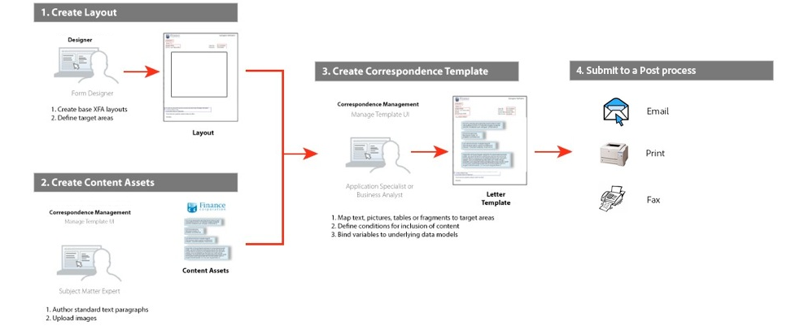
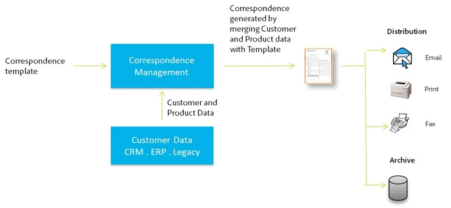
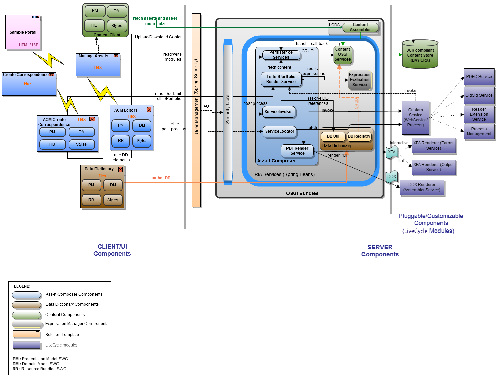
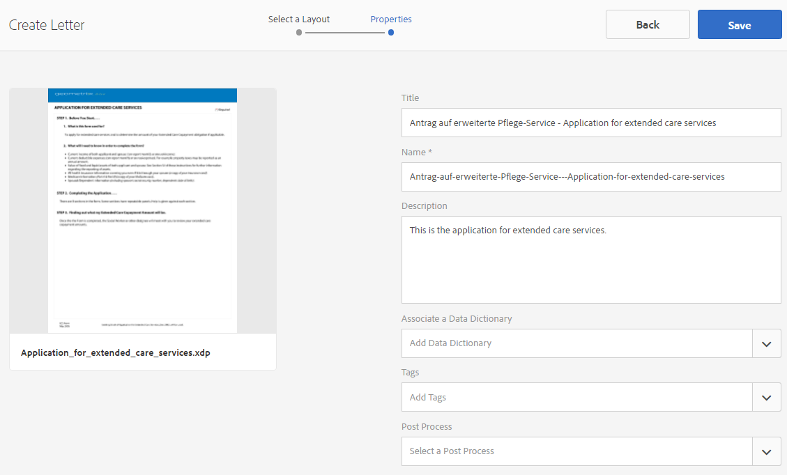

# 建立字母 {#create-letter}

## 信件管理工作流程 {#correspondence-management-workflow}

「對應管理」工作流由四個階段組成：

1. 範本建立
1. 建立檔案片段
1. 建立字母
1. 後處理

### 範本建立 {#template-creation}

下圖顯示了建立對應模板的典型工作流。

在此工作流程中：

1. 表單設計人員可使用Adobe Forms Designer建立版面和分割版面，並將它們上傳至CRX儲存庫。 版麵包含一般表單欄位、版面功能（例如頁首和頁尾），以及用於放置內容的空白「目標區域」。 之後，應用程式專家會對應這些目標區域所需的內容。 有關設計版面的 [詳細資訊](/help/forms/using/layout-design-details.md)。
1. 法律、財務或行銷部門的相關領域專家負責建立和上傳內容，例如文字條款免責聲明、條款與條件，以及標誌等影像，這些內容會在各種信件範本中重複使用。
1. 應用程式專家會建立通訊範本。 應用程式專員

   * 將文字子句和影像對應至版面範本中的目標區域
   * 定義包含內容的條件／規則
   * 將版面欄位和變數系結至基礎資料模型

1. 作者預覽信件，並提交該信件以進行後處理。 後置處理的詳 [細資訊](/help/forms/using/submit-letter-topostprocess.md)。

#### 使用信件管理隨附的信件模板 {#using-letter-templates-provided-with-correspondence-management}

您可以選擇修改和重複使用「對應管理」提供的範本，而不是從頭建立版面範本。 您可以使用設計人員來快速修改範本的品牌、資料和內容欄位，以符合您組織的需求。 有關「通信管理」模板的詳細資訊，請參 [閱參考信函模板](/help/forms/using/reference-cm-layout-templates.md)。

### 建立檔案片段 {#document-fragment-creation}

檔案片段是可重複使用的信件的\元件，您可使用這些元件來編寫信件\信件。

檔案片段的類型如下：

#### 文字 {#text}

文字資產是由一或多個文欄位落組成的內容片段。 段落可以是靜態或動態。 動態段落包含資料元素的參考，其值在執行時期提供。

#### 清單 {#list}

清單是一系列檔案片段，包括文字、清單（同一份清單本身不能「新增」）、條件和影像。 清單元素的順序可以是固定或可編輯的。 在建立字母時，您可以使用部分或全部的清單元素來複製可重複使用的元素模式。

#### 條件 {#condition}

條件可讓您根據提供的資料，定義在建立對應時包含的內容。 該條件用控制變數來描述。 變數可以是資料字典元素或預留位置。 新增條件時，您可以選擇根據控制變數的值加入資產。 條件具有基於表達式的單個輸出。 根據目前條件變數，第一個運算式為true。 其值成為條件的輸出。

#### Layout fragment {#layout-fragment}

版面片段是可用於一或多個字母的版面。 配置片段可用來建立可重複的圖樣，尤其是動態表格。 版面可包含「位址」和「參考編號」等典型表單欄位。 它還包含表示目標區域的空子表單。 版面(XDP)是在Designer中建立，然後上傳 [至表單和檔案](/help/forms/using/get-xdp-pdf-documents-aem.md)。

### 建立字母 {#letter-creation}

有兩種方式可產生傳送給客戶的信件：使用者導向和系統導向。

#### 使用者導向 {#user-driven}

面向客戶的員工（如索賠調整員或案例工作人員）可以建立自定義的通信。 使用簡單且直覺式的信函填寫介面，商業使用者可在信件中加入選擇性文字、個人化可編輯的內容，同時即時預覽信件。 然後，他們可以將自訂的信件提交到後端程式。

#### 系統驅動 {#system-driven}

通過事件觸發器自動生成對應。 例如，通過將預先定義的模板與公民資料合併而生成向公民發送的提醒通知，提示她進行預繳稅款申報。 最後一封信可以透過電子郵件寄出、列印、傳真或封存。

### 後處理 {#post-processing}

最後的對應可以發送到後端處理，以進行後處理。 通信可以是：

1. 已處理電子郵件、傳真或批次列印，或放在檔案夾中以列印或以電子郵件寄送。
1. 已提交供審查和批准。
1. 透過套用數位簽章、認證、加密或版權管理來保護。
1. 轉換為可搜尋的PDF檔案，其中包含用於封存和稽核的所有必要中繼資料。
1. 包含在PDF資料夾中，其中包含更多檔案，例如行銷材料。 然後，PDF資料夾就可以作為最終信件傳送。

### 通信管理解決方案體系結構 {#correspondence-management-solution-architecture}

下圖概述了字母解決方案的示例體系結構。

## 剖析一封信 {#deconstructing-a-letter}

此取消通知文檔是典型通信的示例：

<table> 
 <tbody> 
  <tr> 
   <td><strong>字母元素</strong></td> 
   <td><strong>說明</strong></td> 
   <td><strong>使用</strong></td> 
  </tr> 
  <tr> 
   <td>來自後端企業系統的資料</td> 
   <td>源自後端企業系統的資料。 資料與對應模板動態合併。</td> 
   <td>根據  「資料字典」建立的資料檔案</td> 
  </tr> 
  <tr> 
   <td>由一線員工輸入的資料  (Data Entered by Front-line Employee)</td> 
   <td>在傳送信函之前，由自訂信函的一線員工提供的資料。  </td> 
   <td>
未受保護的DD元素  ：可編輯文欄位落  ：變數／預留位置  
 </td> 
  </tr> 
  <tr> 
   <td>預先核准的文字  （段落）</td> 
   <td>預先核准的文字內容。 法律、財務或業務領域的專家若瞭解信件的商業背景，通常會編寫文字內容。 大部分信件都會使用頁首、頁尾、免責聲明和問候等內容。 但是，「終止原因」等內容將是特定字母的特定內容。</td> 
   <td>
Text\Lists\  Conditions\Layout
 
 
 </td> 
  </tr> 
  <tr> 
   <td>基於  「自訂邏輯」的資料？</td> 
   <td>對於某些信件（如要求索取更多索賠資訊的信件），諸如索賠調整器之類的用戶可以添加自定義文本內容。</td> 
   <td>類型條件的文檔片段  (Document Fragment of Type Condition) </td> 
  </tr> 
  <tr> 
   <td>從Central  Repository儲存的影像</td> 
   <td>影像，例如標誌和簽名影像。 公司標誌等影像會出現在大部分或所有信件中。 簽名影像是信件及代表其寄送信件之人員的專屬影像。</td> 
   <td>
儲存在AEM資產(DAM)中的影像  
 
 
 </td> 
  </tr> 
 </tbody> 
</table>

## 建構信件前先分析信件 {#analyze-a-letter-before-you-construct-it}

分析每封信，找出組成該信的各種信件。 應用程式專員會分析產生的通訊。

* 對應的哪些部分是靜態的，哪些是動態的。 由後端資料來源或使用者填入的變數。
* 在通信中出現各種文本段落的順序，例如商業用戶在通信建立期間是否可以更改段落。
* 對應系統是由系統產生的，還是需要最終用戶編輯對應？ 系統產生多少個對應，多少個需要使用者干預？
* 對應範本的變更頻率為何？ 是否會每年、每季或僅在特定法規變更時更新？ 預期會有哪些變更類型？ 是否是修正印刷錯誤、版面變更、新增更多欄位、新增更多段落等變更。
* 在規劃您的通信要求時，請組合新通信模板的清單。 對於每個通信模板，您需要：

   * 文字子句、影像和表格
   * 來自後端系統的資料值
   * 對應檔案的版面配置和片段配置
   * 內容出現在字母和規則中的順序，以納入和排除內容

* 索賠調整者或案件工作人員等商業用戶修改信函內容或部分的條件。
* 藍本是描述使用信函解決方案的使用者體驗、需求和優點的敘述。
* 方案也提供：您專案所需的技能和工具。
* 規劃實作的最佳實務。 「高階實作概觀。

## 執行分析的優點 {#benefits-of-performing-the-analysis}

**內容重複使用** ：您擁有生成通信所需的新內容的統一清單。 許多字母常見的內容，例如頁首、頁尾、免責聲明和簡介，而且可在各字母間重複使用。 所有此類常見內容都可由專家建立並核准一次，然後在許多信件中重複使用。

**建立資料字典** ：有許多字母共有的資料值，例如「客戶ID」和「客戶名稱」。 您可以準備所有此類資料值的統一清單。 通常，在規劃結構時會咨詢企業中間件團隊的人員。 這構成建立資料字典的基礎。

**從後端企業系統獲取資料** —您還將知道所需的所有資料值，以及從何處獲取企業系統資料。 然後，您可以架構實施，從企業系統擷取資料並饋送至Letters解決方案。

**估計字母的複雜性** ：確定建立特定通信的複雜性非常重要。 此分析有助於確定建立字母模板所需的時間和技能集。 這進而有助於評估實施信件解決方案的資源和成本。

## 對應複雜性 {#correspondence-complexity}

通過分析以下參數，可以確定對應的複雜度：

**版面複雜性** ：版面有多複雜？ 「取消通知」等字母的版面很簡單。 但是，諸如「報銷申請確認」之類的字母的佈局很複雜，具有多個表和60多個表格欄位。 建立複雜的版面需要更多時間，而且需要進階的版面設計技巧。

**貸款合同的文欄位數** 、條件數可以是10頁長，包含40多條文字條款。 其中許多條款將取決於「貸款參數」。 根據確切的條款和條件，條款將包括或排除在合同之外。 建立此類信件需要對複雜情況進行周密規劃和仔細界定。

下表提供一些可用於分類字母的准則：

<table> 
 <tbody> 
  <tr> 
   <td>
<strong>複雜性級別</strong>
 </td> 
   <td>
<strong>版面複雜度（主觀）</strong>
 </td> 
   <td>
<strong>文欄位落數</strong>
 </td> 
   <td>
<strong>條件文字或影像的數目</strong>
 </td> 
   <td>
<strong>所需技能集</strong>
 </td> 
  </tr> 
  <tr> 
   <td>
低複雜度
 </td> 
   <td>
低. 版面沒有幾個表單欄位(&lt;15)。
 
通常只有一頁。
 </td> 
   <td>
8
 </td> 
   <td>
1
 </td> 
   <td>
中型設計人員技能。
 </td> 
  </tr> 
  <tr> 
   <td>
中度複雜性
 </td> 
   <td>
中等複雜度的版面配置。 包括表等結構。 通常超過一頁。
 </td> 
   <td>
16
 </td> 
   <td>
2
 </td> 
   <td>
中型設計人員技能。
 
 
 
可使用使用者介面建立複雜運算式。
 </td> 
  </tr> 
  <tr> 
   <td>
高複雜性
 </td> 
   <td>
複雜的版面配置。 可超過3頁。 包含表格和60多個表格欄位。
 </td> 
   <td>
40
 </td> 
   <td>
8
 </td> 
   <td>
專家設計師的技能。
 
 
 
可使用使用者介面建立複雜運算式。
 </td> 
  </tr> 
 </tbody> 
</table>

## 建立字母概覽 {#overview-of-creating-a-letter}

1. 選取適當的版面，做為字母的基礎並建立字母。
1. 將資料模組或版面片段新增至字母並加以設定。
1. 選擇以預覽對應。
1. 編輯並設定欄位、變數、內容和附件。

### 必備條件 {#prerequisites}

您需要先有下列項目才能建立對應：

* [相容性包](compatibility-package.md)。 安裝Compatibility Package以查看 **Forms** 頁面上的 **Letters選項** 。
* 字母XDP([版面](/help/forms/using/document-fragments.md))。
* 其他XDP([版面片段](/help/forms/using/document-fragments.md#main-pars-header-13))構成字母的一部分。 XDP\Layouts是在 [Designer中建立的](https://help.adobe.com/en-US/AEMForms/6.1/DesignerHelp/)。
* 相關資 [料字典](/help/forms/using/data-dictionary.md) （選用）。
* 您 [要在通信中使用](/help/forms/using/document-fragments.md) 的資料模組。
* [測試資料](/help/forms/using/data-dictionary.md#p-working-with-test-data-p) 是XML檔案，其中已移植測試資料。 如果您使用資料字典，則需要測試資料。

## 建立字母模板 {#create-a-letter-template}

### 選取版面並輸入字母屬性 {#select-a-layout-and-enter-the-letter-properties}

1. 選擇「 **表單** 」>「 **字母」**。

1. 選擇「 **建立」>「字母**」。 「對應管理」會顯示可用的版面(XDP)。 這些版面都來自Designer。 版面配置也包含「對應管理」現成可用的信函範本。 有關「通信管理」模板的詳細資訊，請參 [閱參考信函模板](/help/forms/using/reference-cm-layout-templates.md)。 若要新增您自己的版面，請在Designer中建立XDP（版面）檔案，然 [後將其上傳至AEM Forms](/help/forms/using/get-xdp-pdf-documents-aem.md)。

   

1. 點選版面並點選「下一步」，以選 **取版面**。

   

1. 輸入「對應」的屬性並點選「儲 **存」:**

   * **** 標題（可選）:輸入字母的標題。 標題不必是唯一的，可以有特殊字元和非英文字元。
   * **** 名稱：字母的唯一名稱。 任何狀態下都不能有兩個字母具有相同名稱。 在「名稱」欄位中，您只能輸入英文字元、數字和連字型大小。 「名稱」欄位會根據「標題」欄位自動填入。 在「標題」欄位中輸入的特殊字元、空格、數字和非英文字元將在「名稱」欄位中替換為連字元。 雖然「標題」欄位中的值會自動複製到「名稱」，但您可以編輯值。
   * **** 說明（可選）:請說明此信供您參考。
   * **資料字典（選用）**:資料字典可以與對應關聯。 您稍後在此對應中插入的資產，應該與您在此處為對應選擇的資料字典相同，或者沒有資料字典。
   * **** 標籤（可選）:選擇要應用於對應的標籤。 您也可以輸入新的／自訂標籤名稱，然後按Enter鍵建立它。
   * **** 後置處理（可選）:選擇要應用於信函模板的後置流程。 您使用AEM建立的貼文程式（例如電子郵件和列印）已立即可用。
   

1. 系統會顯示一則訊息：&quot;Letter created successfully.&quot; （在警報訊息中）點選「 **開啟** 」以設定其中的資料模組和配置片段。 或點選 **「完成** 」返回上一頁。

   

   **下一個**:當您點選「開 **啟**」時，「對應管理」會顯示版面的呈現方式，並列出版面(XDP)中的所有元件。 繼續插入「資料模 [組」和「版面片段」並進行設定](/help/forms/using/create-letter.md#p-insert-data-modules-and-layout-fragments-in-a-letter-and-configure-them-p)。

### 將資料模組和版面片段插入字母並加以設定 {#insert-data-modules-and-layout-fragments-in-a-letter-and-configure-them}

建立對應後，您點選「開啟」時，「對應管理」會顯示版面的表示，並列出版面(XDP)中的所有子表單／目標區域。 在每個目標區域中，您可以選擇插入資料模組或版面片段（接著在版面片段中插入資料模組）。

>[!NOTE]
>
>您也可以選擇點選「字母」頁面中字母的「編輯」圖示，將資料模組和版面片段插入字母並加以設定。

1. 點選 **每個子表單的** 「插入」，並選取「資料模組」或「版面片段」以插入每個子表單。

   

1. 為每個子表單的這些選項選擇「資料模組」或「版面片段」，然後選擇要插入的「資料模組」或「版面片段」。 版面片段可讓您根據其設計（最多4個層級），進一步插入資料模組或版面片段。

   

1. 如果您插入版面片段，則版面片段的名稱會顯示在子表單中。 根據選取的片段，巢狀子表單會出現在子表單中。
1. 將所選的「資料模組」插入版面後，您可以點選設定模式，並在點選每個模組的「編輯」圖示後設定下列項目：

   1. **可編輯**:選取此選項時，可在「建立對應」使用者介面中編輯內容。 只有在需要商業使用者（例如理賠調整員）修改內容時，才將內容標示為可編輯。
   1. **強制**:選取此選項時，「建立對應」使用者介面中會要求內容。
   1. **選取**:選取此選項時，內容會依「建立對應」使用者介面的預設值來選取。
   1. **縮排**:增加或減少字母中的模組／內容縮排。 縮排是以0開始的級別指定的。 每級縮進36分。 如需自訂表單的詳細資訊，請參 **[!UICONTROL 閱「表單」工作流程中]** 的 [對應管理設定](/help/forms/using/submit-letter-topostprocess.md#main-pars-header-3)。
   1. **分頁前**:如果您將「分頁前」設為on，則THIS模組的內容一律會顯示在新頁面上。
   1. **分頁符後**:如果將特定模組的「分頁後」設定為on，則NEXT模組的內容將始終顯示在新頁面上。
   

1. 若要編輯模組，請點選其旁的「編輯」圖示。 編輯模組後，點選「 **儲存」**。

   在本頁中，您也可以對子表單執行下列動作：

   1. **允許自由文字**:如果啟用了「允許自由文本」，則用戶可以在CCR視圖的字母中添加內嵌文本。 在CCR視圖中，對於啟用了「允許自由文本」的目標區域啟用了「T」操作，當用戶點選它時，它會要求輸入文本的名稱和說明，然後點選「確定」時，它會在編輯模式下開啟該文本，用戶可以在其中添加文本。 這就像其他文字模組
   1. **鎖定順序**:鎖定字母中子表單的順序。 在建立字母時，作者不允許重新排序子表單／元件。
   在本頁中，您也可以對子表單中的每個資產執行下列動作：

   1. **變更資產順序**:拖放資產，並保留資產的重新排序圖示( )。
   1. **刪除資產**:點選資產旁的「刪除」圖示可加以刪除。
   1. **預覽資產**:點選資產旁的顯示預 (showpreview)。

1. 點選「 **下一步**」。
1. 「資料」頁面詳細說明資料欄位和變數在範本中的使用方式。 資料可以連結至資料來源，例如資料字典或使用者輸入。 每個欄位定義屬性，資料字典會從中對應資料，或為使用者輸入欄位顯示標題。

   連結：

   * 欄 **位元素** 可連結至常值、資料字典元素、資產或使用者指定的值。 您也可以將欄位元素系結至「忽略」選項，以忽略欄位元素。
   * 變 **數元素** ，可連結至文字、資料字典元素、欄位、變數、資產或使用者指定的值。
   以下是連結中的一些主要欄位：

   * **多行**:您可以指定欄位或變數的資料輸入是否為多行。 如果您選取此選項，欄位或變數的輸入方塊會在「資料編輯檢視」中顯示為多行輸入方塊。 欄位或變數也會在「建立對應」使用者介面的「資料」和「內容」檢視中顯示為多行。 多行輸入欄位與在TextModule中輸入注釋的欄位類似。 多行選項僅適用於連結類型為「使用者」或未受保護的「資料字典元素」的欄位和變數。
   * **可選**:您可以指定欄位或變數的值是否為選用。 選用欄位選項適用於連結類型為「使用者」或未受保護的「資料字典元素」的欄位和變數。

   * **欄位／變數驗證**:若要增強欄位或變數值的驗證，您可以指派驗證器至欄位或變數。 此選項僅適用於連結類型為「使用者」或未受保護的「資料字典元素」的欄位和變數。
   * **標題** 和 **工具提示**:標題是顯示在CCR用戶介面中欄位前面的欄位的標籤。 此選項適用於連結類型為「使用者」或未受保護的「資料字典元素」的欄位和變數。
   以下是可用於欄位的驗證類型：

   * **字串驗證器**:使用「字串驗證器」來指定在欄位或變數中輸入之字串的最小和最大長度。 建立字串驗證器時，請確定您指定有效的驗證參數。 輸入最小值和最大值的有效長度。 對於字串驗證器，您可以指定可輸入值的最小和最大長度。 如果輸入的值不是根據指定的最小值和最大值，則CCR用戶介面中的相關欄位將以紅色標籤。

   * **數字驗證器**:使用「數字驗證器」指定在欄位或變數中輸入的最小和最大數值。 當您建立數字驗證器時，請確定您指定有效的驗證參數。 輸入最小值和最大值的數值。

   * **規則運算式驗證器**:使用規則運算式驗證器來定義用於驗證欄位或變數值的規則運算式。 此外，您還可以自訂錯誤訊息。 建立規則運算式驗證器時，請確定您指定有效的規則運算式。
   >[!NOTE]
   >
   >欄位和變數驗證器僅適用於連結類型為「使用者」或未受保護之「資料字典元素」的欄位或變數。

   

1. 指定連結後，點選「下 **一步」**。 「通信管理」顯示「附件」螢幕。

### 設定附件 {#set-up-the-attachments}

1. 選取「 **新增資產**」。
1. 在「選取資產」畫面中，點選資產以附加字母，然後點選「完 **成**」。 您必須先將資產上傳至「資產」。 建議您僅附加PDF和Microsoft office檔案，但您也可以附加影像。 如需有關在DAM中上傳資產的詳細資訊，請參閱「 [上傳資產」](/help/assets/managing-assets-touch-ui.md)。
1. 要鎖定清單中資產的順序，以便索賠調整者不能更改順序，請點選「鎖定 **順序」**。 如果您未選擇此選項，「索賠調整者」可以更改清單項的順序。
1. 若要變更資產順序，請拖放資產，並保留資產的重新排序圖示( )。
1. 點選 **「在附件前面編輯** 」(Edit)，如果您不希望作者能夠刪除附件，請將附件指定為「必要」(Mandatory)。 如果要在CCR介面中預選附件，請將其指定為「已選」。
1. 選擇 **「庫訪問** 」(Library Access)以授予對庫的訪問權。 如果啟用了「庫訪問」,「索賠調整者」可以在建立信件和插入附件時訪問內容庫。
1. 選擇「 **附件配置** 」並指定附件的最大數量。

1. 點選「 **儲存**」。 您的信件會建立並列在「信件」頁面上。

在「通信管理」中建立信函模板後，最終用戶／代理／索賠調整器可以在CCR用戶介面中開啟信函，並通過輸入資料、設定內容和管理附件來建立信件。 如需詳細資訊，請參 [閱建立通訊](/help/forms/using/create-correspondence.md)。

## 每個欄位可用的連結類型 {#types-of-linkage-available-for-each-of-the-fields}

下表說明了哪些類型的連結可用於各種類型的欄位。

表格中的下列值

* **是**:最左欄中的欄位類型支援該映射類型
* **否**:最左欄中的欄位類型不支援該映射類型
* **不適用**:最左欄中的欄位類型不適用

<table> 
 <tbody> 
  <tr> 
   <td> </td> 
   <td><strong>常值</strong></td> 
   <td><strong>資產</strong></td> 
   <td><strong>資料字典</strong></td> 
   <td><strong>忽略</strong></td> 
   <td><strong>使用者</strong></td> 
   <td><strong>欄位</strong></td> 
   <td><strong>變數</strong></td> 
  </tr> 
  <tr> 
   <td><strong>日期</strong></td> 
   <td>是</td> 
   <td>否</td> 
   <td>是</td> 
   <td>是</td> 
   <td>是</td> 
   <td>N/A</td> 
   <td>N/A</td> 
  </tr> 
  <tr> 
   <td><strong>次</strong></td> 
   <td>是</td> 
   <td>否</td> 
   <td>是</td> 
   <td>是</td> 
   <td>是</td> 
   <td>N/A</td> 
   <td>N/A</td> 
  </tr> 
  <tr> 
   <td><strong>日期時間</strong></td> 
   <td>是</td> 
   <td>否</td> 
   <td>是</td> 
   <td>是</td> 
   <td>是</td> 
   <td>N/A</td> 
   <td>N/A</td> 
  </tr> 
  <tr> 
   <td><strong>整數</strong></td> 
   <td>是</td> 
   <td>否</td> 
   <td>是</td> 
   <td>是</td> 
   <td>是  </td> 
   <td>N/A</td> 
   <td>N/A</td> 
  </tr> 
  <tr> 
   <td><strong>浮水</strong></td> 
   <td>是</td> 
   <td>否</td> 
   <td>是</td> 
   <td>是</td> 
   <td>是  </td> 
   <td>N/A</td> 
   <td>N/A  </td> 
  </tr> 
  <tr> 
   <td><strong>richtext</strong></td> 
   <td>是</td> 
   <td>僅文字</td> 
   <td>是</td> 
   <td>是</td> 
   <td>是</td> 
   <td>N/A</td> 
   <td>N/A</td> 
  </tr> 
  <tr> 
   <td><strong>純文</strong><strong>字</strong></td> 
   <td>是</td> 
   <td>僅文字</td> 
   <td>是</td> 
   <td>是</td> 
   <td>是</td> 
   <td>N/A</td> 
   <td>N/A</td> 
  </tr> 
  <tr> 
   <td><strong>影像</strong></td> 
   <td>否</td> 
   <td>僅限影像</td> 
   <td>否</td> 
   <td>是</td> 
   <td>否</td> 
   <td>N/A</td> 
   <td>N/A</td> 
  </tr> 
  <tr> 
   <td><strong>簽名</strong></td> 
   <td>否</td> 
   <td>否</td> 
   <td>否  </td> 
   <td>是</td> 
   <td>否</td> 
   <td>N/A</td> 
   <td>N/A  </td> 
  </tr> 
 </tbody> 
</table>

## 建立字母模板副本 {#createcopylettertemplate}

您可以使用現有的字母範本，快速建立具有類似屬性、內容和繼承資產（例如檔案片段和資料字典）的字母範本。 若要這麼做，請複製並貼上信件。

1. 在「字母」頁面中，選擇一個或多個字母。 UI會顯示「複製」圖示。
1. 點選「複製」。 UI會顯示「貼上」圖示。 您也可以選擇在貼上之前進入資料夾。 不同的檔案夾可以包含具有相同名稱的資產。 如需資料夾的詳細資訊，請參 [閱資料夾和組織資產](/help/forms/using/import-export-forms-templates.md#folders-and-organizing-assets)。
1. 點選「貼上」。 將出現「貼上」對話框。 如果您在同一位置複製和貼上字母，系統會自動為新字母副本分配名稱和標題，但您可以編輯字母的標題和名稱。
1. 如果需要，請編輯要用來保存字母副本的標題和名稱。
1. 點選「貼上」。 將建立該字母的副本。 現在，您可以在新建立的信件中進行必要的變更。

