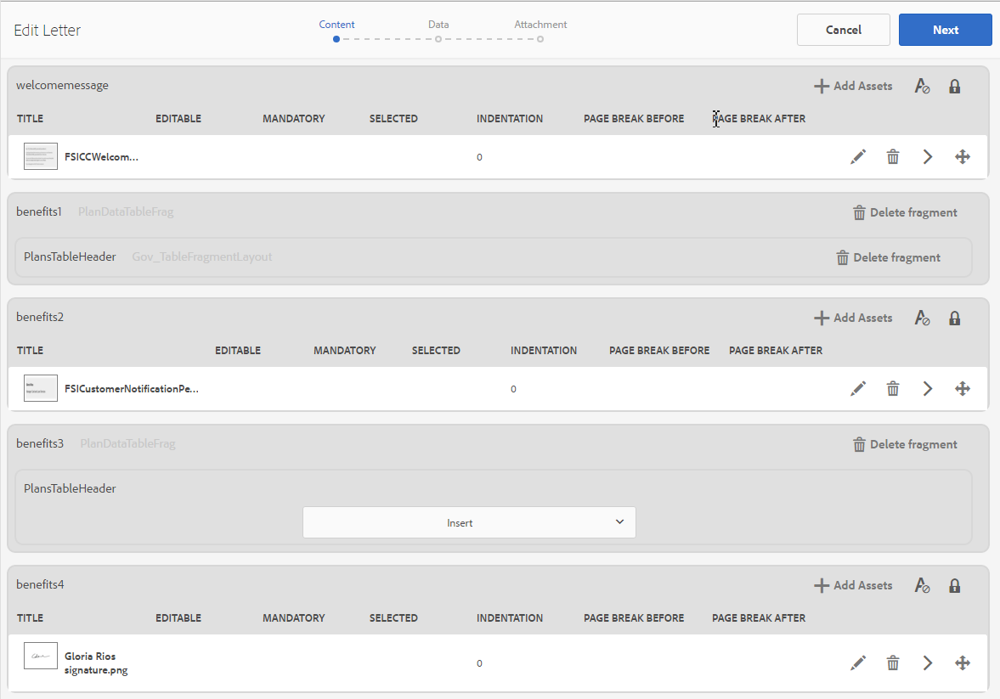

# 建立字母 {#create-letter}

## 通信管理工作流 {#correspondence-management-workflow}

「通信管理」工作流由四個階段組成：

1. 模板建立
1. 文檔片段建立
1. 信件建立
1. 後處理

### 模板建立 {#template-creation}

下圖顯示了用於建立對應模板的典型工作流。

在此工作流中：

1. 表單設計器使用AdobeForms設計器建立佈局和片段佈局，並將它們上載到CRX儲存庫。 佈局包含典型的表單域、頁眉和頁腳等佈局功能，以及用於放置內容的空「目標區域」。 稍後，應用程式專家將繪製這些目標區域所需的內容。 有關 [設計佈局](/help/forms/using/layout-design-details.md)。
1. 法律、財務或市場營銷部門的主題專家，建立並上載在各種通信模板中重複使用的內容，如文本條款免責聲明、條款和條件以及徽標等影像。
1. 應用程式專家建立通信模板。 應用程式專家

   * 將文本子句和影像映射到佈局模板中的目標區域
   * 定義包含內容的條件/規則
   * 將佈局欄位和變數綁定到基礎資料模型

1. 作者預覽該信並提交該信以供後處理。 有關 [後處理](/help/forms/using/submit-letter-topostprocess.md)。

#### 使用隨函管理提供的信函模板 {#using-letter-templates-provided-with-correspondence-management}

您可以選擇修改和重用Tergence Management提供的模板，而不是從頭建立佈局模板。 您可以使用設計器快速修改模板的品牌和資料及內容欄位，以滿足您組織的需要。 有關Tergement Management模板的詳細資訊，請參閱 [參考信函模板](/help/forms/using/reference-cm-layout-templates.md)。

### 文檔片段建立 {#document-fragment-creation}

文檔片段是通信的可重複使用的部件\元件，您可以使用這些部件編寫字母\通信。

文檔片段的類型如下：

#### 文字 {#text}

文本資產是由一個或多個文本段落組成的內容。 段落可以是靜態的或動態的。 動態段落包含對資料元素的引用，資料元素的值在運行時提供。

#### 清單 {#list}

清單是一系列文檔片段，包括文本、清單（同一清單不能「本身添加」）、條件和影像。 清單元素的順序可以是固定的或可編輯的。 建立字母時，可以使用部分或全部清單元素複製可重用的元素模式。

#### 條件 {#condition}

條件使您能夠根據提供的資料定義在建立通信時包括的內容。 該條件用控制變數描述。 變數可以是資料字典元素或佔位符。 添加條件時，您可以根據控制變數具有的值選擇包括資產。 條件具有基於表達式的單個輸出。 基於當前條件變數，發現第一個表達式為true。 其值成為條件的輸出。

#### 佈局片段 {#layout-fragment}

佈局片段是可在一個或多個字母內使用的佈局。 佈局片段用於建立可重複模式，特別是動態表。 佈局可包含典型的表單域，如「地址」和「引用編號」。 它還包含表示目標區域的空子窗體。 佈局(XDP)在設計器中建立，然後 [上載到Forms和文檔](/help/forms/using/get-xdp-pdf-documents-aem.md)。

### 信件建立 {#letter-creation}

有兩種方法可生成發送給客戶的通信：用戶驅動和系統驅動。

#### 用戶驅動 {#user-driven}

面向客戶的員工（如索賠調整員或案例工作人員）可以建立自定義信函。 使用簡單直觀的信件填寫介面，商務用戶可以在信件中添加可選文本，在即時預覽信件的同時個性化可編輯內容。 然後，他們可以將定製的通信提交到後端流程。

#### 系統驅動 {#system-driven}

該通信生成由事件觸發器驅動。 例如，通過將預定模板與公民資料合併而生成發送給公民的提醒通知，以提示她進行預繳稅款申報。 最後一封信可以通過電子郵件發送、打印、傳真或存檔。

### 後處理 {#post-processing}

最後的對應可以發送到後端處理以進行後處理。 通信可以是：

1. 已處理以進行電子郵件、傳真或批量打印，或放在資料夾中以進行打印或發送電子郵件。
1. 已提交以供審核和批准。
1. 通過應用數字簽名、認證、加密或權限管理來保護。
1. 已轉換為可搜索的PDF文檔，該文檔包含用於存檔和審核目的的所有必要元資料。
1. 包含在PDFPortfolio中，其中包含更多文檔，如營銷材料。 然後，PDFPortfolio可以作為最終通信發送。

### 通信管理解決方案體系結構 {#correspondence-management-solution-architecture}

下圖概述了字母解決方案的示例體系結構。

## 解構信件 {#deconstructing-a-letter}

此「取消通知」文檔是典型對應的示例：

<table> 
 <tbody> 
  <tr> 
   <td><strong>字母元素</strong></td> 
   <td><strong>說明</strong></td> 
   <td><strong>形成為</strong></td> 
  </tr> 
  <tr> 
   <td>來自後端企業系統的資料</td> 
   <td>源自後端企業系統的資料。 資料與對應模板動態地合併。</td> 
   <td>的  基於資料字典建立的資料檔案</td> 
  </tr> 
  <tr> 
   <td>資料  由前線員工輸入</td> 
   <td>在發送信件之前，正在自定義該信件的一線員工可以提供的資料。  </td> 
   <td>
未受保護的DD元素  可編輯的文本段落  變數/佔位符  
 </td> 
  </tr> 
  <tr> 
   <td>預批准  文本段落</td> 
   <td>預先批准的文本內容。 法律、財務或業務領域的專家如果瞭解信件的業務上下文，通常會編寫文本內容。 大多數信件中都常見的內容，如頁眉、頁腳、免責聲明和稱呼。 但是，"終止理由"等內容將是特定字母。</td> 
   <td>
文本\清單\  條件\佈局
 
 
 </td> 
  </tr> 
  <tr> 
   <td>資料  基於自定義邏輯？</td> 
   <td>對於某些信件（如要求獲得有關索賠的更多資訊的信件），諸如索賠調整器之類的用戶可以添加自定義文本內容。</td> 
   <td>文檔  類型條件的片段 </td> 
  </tr> 
  <tr> 
   <td>已儲存  來自中央儲存庫的映像</td> 
   <td>影像，如徽標和簽名影像。 公司徽標等影像將出現在大多數或所有信函中。 簽名影像特定於信件和代表其發送信件的人。</td> 
   <td>
儲存在資AEM產(DAM)中的影像  
 
 
 </td> 
  </tr> 
 </tbody> 
</table>

## 在構建信之前分析信件 {#analyze-a-letter-before-you-construct-it}

分析每封信，以發現組成該信的各個部分。 應用程式專家分析生成的對應。

* 這些對應的哪些部分是靜態的，哪些是動態的。 從後端資料源或最終用戶填充的變數。
* 在信件中出現各種文本段落的順序，例如，業務用戶在信件建立期間是否可以更改段落。
* 通信系統是生成的還是需要最終用戶編輯通信？ 系統生成了多少個對應，有多少需要用戶干預？
* 通信模板更改的頻率是多少？ 是每年、每季度更新一次，還是只在某項特定法律發生變化時才更新？ 應進行哪類更改？ 是修復排版錯誤的更改、佈局更改、添加更多欄位、添加更多段落等。
* 在規劃通信要求時，將新通信模板的清單匯總起來。 對於每個通信模板，您需要：

   * 文本子句、影像和表
   * 來自後端系統的資料值
   * 對應的佈局和分片佈局
   * 內容在信函和規則中顯示的順序，以便包括和排除內容

* 業務用戶修改信函內容或部分的條件。
* 方案是描述使用信件解決方案的用戶體驗、要求和好處的說明。
* 方案還提供：項目所需的技能集和工具。
* 規劃實施的最佳實踐。 「高級實施概述。

## 執行分析的好處 {#benefits-of-performing-the-analysis}

**內容重用** 您擁有生成通信所需的新內容的合併清單。 許多內容（如頁眉、頁腳、免責聲明和介紹）是許多字母的常見內容，可跨不同的字母重複使用。 所有此類公共內容都可以由專家建立和批准一次，然後在許多信件中重新使用。

**構建資料字典** 將有許多字母共有的資料值，如「客戶ID」和「客戶名稱」。 您可以準備所有此類資料值的統一清單。 通常，在規劃結構時會咨詢企業中間件團隊的人員。 這構成構建資料字典的基礎。

**從後端企業系統採購資料** 您還將知道所需的所有資料值，以及從何處獲取企業系統資料。 然後，您可以設計實施，以從企業系統中提取資料並饋送到字母解決方案。

**字母複雜度的估算** 必須確定建立特定通信將有多複雜。 此分析有助於確定建立信函模板所需的時間和技能集。 這反過來將有助於估計實施信件解決方案的資源和費用。

## 對應複雜度 {#correspondence-complexity}

通過分析以下參數，可以確定對應的複雜度：

**佈局複雜性** 佈局有多複雜？ 「取消通知」等字母的佈局很簡單。 但是，諸如「報銷申請範圍確認」之類的信函具有複雜的佈局，具有多個表和60多個表單域。 建立複雜佈局需要更多時間，並且需要高級佈局設計技能集。

**案文段落數和條件數** 貸款合同可長達10頁，包含40多個文本條款。 其中許多條款將取決於「貸款參數」。 根據具體條款和條件，條款將被包括或排除在合同之外。 建立此類信件需要徹底規劃和仔細界定複雜的條件。

下表提供了一些可用於分類字母的准則：

<table> 
 <tbody> 
  <tr> 
   <td>
<strong>複雜性級別</strong>
 </td> 
   <td>
<strong>佈局複雜性（主觀）</strong>
 </td> 
   <td>
<strong>文本段落數</strong>
 </td> 
   <td>
<strong>條件文本或影像數</strong>
 </td> 
   <td>
<strong>所需技能集</strong>
 </td> 
  </tr> 
  <tr> 
   <td>
低複雜性
 </td> 
   <td>
低. 佈局的窗體欄位很少(&lt;15)。
 
通常為一頁。
 </td> 
   <td>
8
 </td> 
   <td>
1
 </td> 
   <td>
中等設計師技能。
 </td> 
  </tr> 
  <tr> 
   <td>
中等複雜性
 </td> 
   <td>
中等複雜性佈局。 包括表等結構。 通常超過一頁。
 </td> 
   <td>
16
 </td> 
   <td>
2
 </td> 
   <td>
中等設計師技能。
 
 
 
使用用戶介面建立複雜表達式的功能。
 </td> 
  </tr> 
  <tr> 
   <td>
高複雜性
 </td> 
   <td>
複雜佈局。 可以超過三頁。 包含表和60多個表單域。
 </td> 
   <td>
40
 </td> 
   <td>
8
 </td> 
   <td>
專家設計師技能。
 
 
 
使用用戶介面建立複雜表達式的功能。
 </td> 
  </tr> 
 </tbody> 
</table>

## 建立信函概覽 {#overview-of-creating-a-letter}

1. 選擇用作字母基礎的適當佈局並建立字母。
1. 將資料模組或佈局片段添加到字母並配置它們。
1. 選擇以預覽對應。
1. 編輯和設定欄位、變數、內容和附件。

### 必備條件 {#prerequisites}

您首先需要具備以下條件才能建立對應：

* [相容性包](compatibility-package.md)。 安裝相容性包以查看 **字母** 的上界 **Forms** 的子菜單。
* 字母XDP([佈局](/help/forms/using/document-fragments.md))。
* 其他XDP([佈局片段](document-fragments.md#document-fragments))，這是字母的一部分。 XDP\Layouts是在 [設計師](https://www.adobe.com/go/learn_aemforms_designer_65_tw)。
* 相關 [資料字典](/help/forms/using/data-dictionary.md) （可選）。
* 的 [資料模組](/help/forms/using/document-fragments.md) 你想在信件中使用。
* [Test資料](/help/forms/using/data-dictionary.md#p-working-with-test-data-p) 是XML檔案，其中包含test資料。 Test資料是使用資料字典時必需的。

## 建立字母模板 {#create-a-letter-template}

### 選擇佈局並輸入字母屬性 {#select-a-layout-and-enter-the-letter-properties}

1. 選擇 **Forms** > **字母**。

1. 選擇 **建立>字母**。 Oracle Tergement顯示可用佈局(XDP)。 這些佈局來自設計器。 佈局還包括Oracle Tergement提供的開箱即用的信函模板。 有關Tergement Management模板的詳細資訊，請參閱 [參考信函模板](/help/forms/using/reference-cm-layout-templates.md)。 要添加您自己的佈局，請在設計器中建立XDP（佈局）檔案，然後 [上傳到AEM Forms](/help/forms/using/get-xdp-pdf-documents-aem.md)。

   

1. 點擊佈局並點擊 **下一個**。

   

1. 輸入Tergement和Tap的屬性 **保存：**

   * **標題（可選）:** 輸入信件的標題。 標題不必唯一，可以有特殊字元和非英文字元。
   * **名稱：** 字母的唯一名稱。 任何狀態中都不能存在兩個同名字母。 在「名稱」欄位中，只能輸入英語字元、數字和連字元。 「名稱」(Name)欄位將基於「標題」(Title)欄位自動填充。 在「標題」欄位中輸入的特殊字元、空格、數字和非英文字元將替換為「名稱」欄位中的連字元。 儘管「標題」(Title)欄位中的值會自動複製到「名稱」(Name)中，但您可以編輯該值。
   * **說明（可選）:** 請描述信供參考。
   * **資料字典（可選）**:資料字典可以與對應關聯。 稍後在此通信中插入的資產應與您為此處的通信選擇的資料字典具有相同的資料字典，或者沒有資料字典。
   * **標籤（可選）:** 選擇要應用於對應的標籤。 您也可以鍵入新的/自定義的標籤名稱，然後按Enter鍵建立它。
   * **後處理（可選）:** 選擇要應用於信函模板的後置處理。 有現成的帖子流程和您使用建立的帖子流AEM程，如電子郵件和打印。

   

1. 系統顯示一條消息：&quot;信件建立成功。&quot; （在警報消息中）點擊 **開啟** 以配置其中的資料模組和佈局片段。 或點擊 **完成** 頁。

   

   **下一個**:點擊 **開啟**，「對應管理」顯示佈局的表示形式，其中列出了佈局(XDP)中的所有元件。 繼續插入 [資料模組和佈局片段及其配置](/help/forms/using/create-letter.md#p-insert-data-modules-and-layout-fragments-in-a-letter-and-configure-them-p)。

### 在字母中插入資料模組和佈局片段並配置它們 {#insert-data-modules-and-layout-fragments-in-a-letter-and-configure-them}

建立通信後，按一下「開啟」，「通信管理」將顯示佈局的表示形式，其中列出了佈局(XDP)中的所有子窗體/目標區域。 在每個目標區域中，可以選擇插入資料模組或佈局片段（然後在佈局片段中插入資料模組）。

>[!NOTE]
>
>您還可以選擇在「字母」頁中按一下字母的「編輯」表徵圖，以在字母中插入資料模組和佈局片段並配置它們。

1. 點擊 **插入** 為每個子表單選擇「資料模組」或「佈局片段」，以在每個子表單中插入。

   

1. 為每個子表單的這些選項選擇資料模組或佈局片段，然後選擇要插入的資料模組或佈局片段。 佈局片段允許您根據其設計（最多四級）在其中插入資料模組或佈局片段。

   

1. 如果插入佈局片段，則佈局片段的名稱將顯示在子窗體中。 根據所選片段，嵌套的子表單出現在子表單中。
1. 在佈局中插入選定的「資料模組」後，可以點擊「配置」模式，並在按一下每個模組的「編輯」表徵圖後設定以下內容：

   1. **可編輯**:選擇此選項後，可以在「建立對應」用戶介面中編輯內容。 僅當內容需要業務用戶（如聲明調整器）修改時，才將其標籤為可編輯。
   1. **強制**:選中此選項後，「建立對應」用戶介面中需要內容。
   1. **已選擇**:選擇此選項後，內容將按「建立對應」用戶介面中的預設值進行選擇。
   1. **縮進**:增加或減少字母中模組/內容的縮進。 縮進以級別形式指定，從0開始。 每級減少36分。 有關自定義表單的詳細資訊，請參見 **[!UICONTROL 通信管理配置]** 在 [Forms工作流](submit-letter-topostprocess.md#formsworkflow)。
   1. **分頁符之前**:如果將「分頁前」設定為on，則此模組的內容將始終顯示在新頁面上。
   1. **後分頁**:如果為特定模組將「分頁後」設定為on，則NEXT模組的內容將始終顯示在新頁面上。

   

1. 要編輯模組，請按一下其旁邊的「編輯」表徵圖。 編輯模組後，點擊 **保存**。

   在此頁中，您還可以為子表單執行以下操作：

   1. **允許自由文本**:如果啟用了「允許自由文本」，則用戶可以在CCR視圖中的字母中添加內聯文本。 在CCR視圖中，對啟用了「允許自由文本」的目標區域啟用「T」操作，當用戶點擊時，它會要求提供文本的名稱和說明，點擊「ok」時，它會以編輯模式開啟該文本，用戶可以在其中添加文本。 這和其他文本模組一樣
   1. **鎖定順序**:鎖定字母中子表單的順序。 建立字母時，不允許作者對子表單/元件重新排序。

   在此頁中，您還可以為子表單中的每個資產執行以下操作：

   1. **更改資產順序**:拖放保存資產重新排序表徵圖的資產( )。
   1. **刪除資產**:按一下資產旁邊的「刪除」表徵圖將其刪除。
   1. **預覽資產**:點擊顯示預覽表徵圖( )。

1. 點擊 **下一個**。
1. 「資料」頁詳細說明了資料欄位和變數在模板中的使用方式。 資料可以連結到資料字典或用戶輸入等資料源。 每個欄位定義資料字典從中映射資料的屬性或用戶輸入欄位顯示的標題。

   連結：

   * 的 **場** 元素可以連結到文本、資料字典元素、資產或用戶指定的值。 也可以通過將欄位元素綁定到「忽略」選項來忽略它。
   * 的 **變數** 元素可以連結到文本、資料字典元素、欄位、變數、資產或用戶指定的值。

   以下是連結中的一些主要欄位：

   * **多行**:您可以指定欄位或變數的資料條目是否為多行。 如果選擇此選項，則欄位或變數的輸入框將在「資料編輯視圖」中顯示為多行輸入框。 該欄位或變數還在「建立對應」用戶介面的「資料」和「內容」視圖中顯示為多行。 多行輸入欄位與在TextModule中輸入注釋的欄位類似。 多行選項僅對連結類型為「用戶」或未受保護的資料字典元素的欄位和變數可用。
   * **可選**:您可以指定欄位或變數的值是否為可選。 可選欄位選項可用於連結類型為「用戶」或未受保護的資料字典元素的欄位和變數。

   * **欄位/變數驗證**:要增強對欄位或變數值的驗證，可以為欄位或變數指定驗證程式。 此選項僅適用於連結類型為「用戶」或未受保護的資料字典元素的欄位和變數。
   * **標題** 和 **工具提示**:Caption是CCR用戶介面中顯示在欄位之前的欄位的標籤。 此選項可用於連結類型為「用戶」或未受保護的資料字典元素的欄位和變數。

   以下是可用於欄位的驗證類型：

   * **字串驗證程式**:使用字串驗證器指定在欄位或變數中輸入的字串的最小和最大長度。 建立字串驗證器時，請確保指定有效的驗證參數。 輸入最小值和最大值的有效長度。 對於字串驗證程式，可以指定可輸入的值的最小和最大長度。 如果輸入的值不是根據指定的最小值和最大值，則CCR用戶介面中的相關欄位將以紅色標籤。

   * **編號驗證程式**:使用數字驗證器指定在欄位或變數中輸入的最小和最大數值。 建立數字驗證器時，請確保指定有效的驗證參數。 為最小值和最大值輸入數值。

   * **規則運算式驗證程式**:使用規則運算式驗證程式定義用於驗證欄位或變數值的規則運算式。 此外，還可以自定義錯誤消息。 建立規則運算式驗證程式時，請確保指定有效的規則運算式。
   >[!NOTE]
   >
   >欄位和變數驗證器僅對連結類型為「用戶」或未受保護的資料字典元素的欄位或變數可用。

   

1. 指定連結後，點擊 **下一個**。 Oracle Tergement將顯示「附件」螢幕。

### 設定附件 {#set-up-the-attachments}

1. 選擇 **添加資產**。
1. 在「選擇資產」螢幕中，點擊要附加的資產並點擊 **完成**。 您需要先將資產上載到「資產」。 建議您僅附加PDF和MicrosoftOffice文檔，但也可以附加影像。 有關在DAM中上載資產的詳細資訊，請參見 [上載資產](/help/assets/manage-assets.md)。
1. 要鎖定清單中資產的順序，以便Claims Adjustor無法更改順序，請點擊 **鎖定順序**。 如果未選擇此選項，「索賠調整器」可以更改清單項的順序。
1. 要更改資產的順序，請拖放保存資產重新排序表徵圖的資產( )。
1. 點擊 **編輯** 在附件前，如果不希望作者能夠刪除附件，請將附件指定為「強制」。 如果希望在CCR介面中預選附件，請將其指定為「已選」。
1. 選擇 **庫訪問** 才能進入圖書館。 如果啟用了「庫訪問」，則聲明調整器可以在建立信件和插入附件時訪問內容庫。
1. 選擇 **附件配置** 並指定附件的最大數量。

1. 點擊 **保存**。 您的信件將建立並列在「信件」頁面。

在Oracle Tergement中建立信件模板後，最終用戶/代理/索賠調整器可以在CCR用戶介面中開啟信件並通過輸入資料、設定內容和管理附件來建立信件。 有關詳細資訊，請參見 [建立對應](/help/forms/using/create-correspondence.md)。

## 每個欄位可用的連結類型 {#types-of-linkage-available-for-each-of-the-fields}

下表說明了可用於各種類型欄位的連結類型。

表中的以下值

* **是**:最左側列中的欄位類型支援該映射類型
* **否**:最左側列中的欄位類型不支援該映射類型
* **不適用**:最左側列中的欄位類型不適用

<table> 
 <tbody> 
  <tr> 
   <td> </td> 
   <td><strong>常值</strong></td> 
   <td><strong>資產</strong></td> 
   <td><strong>資料字典</strong></td> 
   <td><strong>忽略</strong></td> 
   <td><strong>使用者</strong></td> 
   <td><strong>欄位</strong></td> 
   <td><strong>變數</strong></td> 
  </tr> 
  <tr> 
   <td><strong>日期</strong></td> 
   <td>是</td> 
   <td>否</td> 
   <td>是</td> 
   <td>是</td> 
   <td>是</td> 
   <td>N/A</td> 
   <td>N/A</td> 
  </tr> 
  <tr> 
   <td><strong>time</strong></td> 
   <td>是</td> 
   <td>否</td> 
   <td>是</td> 
   <td>是</td> 
   <td>是</td> 
   <td>N/A</td> 
   <td>N/A</td> 
  </tr> 
  <tr> 
   <td><strong>日期</strong></td> 
   <td>是</td> 
   <td>否</td> 
   <td>是</td> 
   <td>是</td> 
   <td>是</td> 
   <td>N/A</td> 
   <td>N/A</td> 
  </tr> 
  <tr> 
   <td><strong>整數</strong></td> 
   <td>是</td> 
   <td>否</td> 
   <td>是</td> 
   <td>是</td> 
   <td>是  </td> 
   <td>N/A</td> 
   <td>N/A</td> 
  </tr> 
  <tr> 
   <td><strong>浮</strong></td> 
   <td>是</td> 
   <td>否</td> 
   <td>是</td> 
   <td>是</td> 
   <td>是  </td> 
   <td>N/A</td> 
   <td>N/A  </td> 
  </tr> 
  <tr> 
   <td><strong>RichText</strong></td> 
   <td>是</td> 
   <td>僅</td> 
   <td>是</td> 
   <td>是</td> 
   <td>是</td> 
   <td>N/A</td> 
   <td>N/A</td> 
  </tr> 
  <tr> 
   <td><strong>平</strong> <strong>文本</strong></td> 
   <td>是</td> 
   <td>僅</td> 
   <td>是</td> 
   <td>是</td> 
   <td>是</td> 
   <td>N/A</td> 
   <td>N/A</td> 
  </tr> 
  <tr> 
   <td><strong>影像</strong></td> 
   <td>否</td> 
   <td>僅</td> 
   <td>否</td> 
   <td>是</td> 
   <td>否</td> 
   <td>N/A</td> 
   <td>N/A</td> 
  </tr> 
  <tr> 
   <td><strong>簽名</strong></td> 
   <td>否</td> 
   <td>否</td> 
   <td>否  </td> 
   <td>是</td> 
   <td>否</td> 
   <td>N/A</td> 
   <td>N/A  </td> 
  </tr> 
 </tbody> 
</table>

## 建立信件模板的副本 {#createcopylettertemplate}

您可以使用現有字母模板快速建立具有相似屬性、內容和繼承資產的字母模板，如文檔片段和資料字典。 為此，請複製並貼上信件。

1. 在「字母」頁中，選擇一個或多個字母。 UI顯示「複製」表徵圖。
1. 點選「 複製」。UI顯示「貼上」表徵圖。 您還可以選擇在貼上之前進入資料夾。 不同的資料夾可以包含具有相同名稱的資產。 有關資料夾的詳細資訊，請參見 [資料夾和組織資產](/help/forms/using/import-export-forms-templates.md#folders-and-organizing-assets)。
1. 按一下「貼上」。 此時將出現「貼上」對話框。 如果在同一位置複製和貼上字母，系統會自動將名稱和標題分配給新的字母副本，但您可以編輯字母的標題和名稱。
1. 如果需要，請編輯要用來保存信件副本的標題和名稱。
1. 按一下「貼上」。 將建立信件的副本。 現在，您可以在新建立的信函中進行所需的更改。
