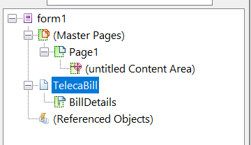
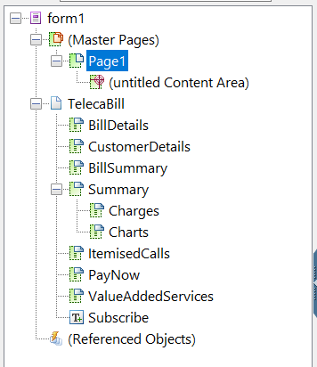
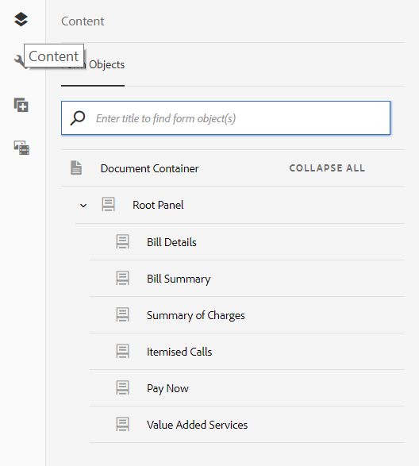

# 教學課程：建立範本{#tutorial-create-templates}

本教學課程是「建立您的第 [一個互動式通訊」系列的一個步驟](/help/forms/using/create-your-first-interactive-communication.md) 。 建議依序依序依序排列，以瞭解、執行和展示完整的教學課程使用案例。

若要建立互動式通訊，您必須在AEM伺服器上提供適用於列印和網路頻道的範本。

「列印」頻道的範本是在Adobe Forms Designer中建立，並上傳至AEM伺服器。 然後，這些範本便可在建立互動式通訊時使用。

網頁頻道的範本是在AEM中建立。 範本作者和管理員可以建立、編輯和啟用Web範本。 在建立並啟用後，這些範本就可在建立互動式通訊時使用。

本教學課程會逐步帶您建立列印和網路頻道的範本，以便在建立互動式通訊時使用。 在本教學課程結束時，您將能夠：

* 使用Adobe Forms Designer建立適用於列印通道的XDP範本
* 將XDP範本上傳至AEM Forms Server
* 建立並啟用網頁頻道的範本

## 建立列印渠道的範本 {#create-template-for-print-channel}

使用下列工作建立和管理互動式通訊列印頻道的範本：

* [使用Forms Designer建立XDP範本](../../forms/using/create-templates-print-web.md#create-xdp-template-using-forms-designer)
* [上傳XDP範本至AEM Forms伺服器](../../forms/using/create-templates-print-web.md#upload-xdp-template-to-the-aem-forms-server)
* [建立版面片段的XDP範本](../../forms/using/create-templates-print-web.md#create-xdp-template-for-layout-fragments)

### 使用Forms Designer建立XDP範本 {#create-xdp-template-using-forms-designer}

根據使 [用案例](/help/forms/using/create-your-first-interactive-communication.md)[和解剖結](/help/forms/using/planning-interactive-communications.md)構，在XDP範本中建立下列子表單：

* 帳單詳細資訊：包含檔案片段
* 客戶詳細資訊：包含檔案片段
* 清單匯總：包含檔案片段
* 摘要：包含文檔片段（費用子表單）和圖表（圖表子表單）
* 明細呼叫：包含表格（版面片段）
* 立即付款：包含影像
* 增值服務：包含影像

將XDP檔案上傳至Forms伺服器後，這些子表格會在列印範本中顯示為目標區域。 建立互動式通訊時，所有實體（例如檔案片段、圖表、版面片段和影像）都會新增至目標區域。

執行以下步驟，為打印渠道建立XDP模板：

1. 開啟表單設計器，選擇 **檔案** >新建 **>** 使用空的表單，使 ************ 用NextTap和Finish，然後開啟表單以建立模板。

   確保從「窗 **口」菜單中選** 擇「對象庫」和「對象 ******** 」選項。

1. 將子表單元件從 **對象庫** ( **Object Library** )拖放到表單中。
1. 選擇子表單，在右窗格的「對象」( **Object** )窗口中顯示子表單的選項。
1. 選取「 **子表單** 」標籤，並從「內容 **」下拉式清** 單中選取「 **** Flued」。 拖動子表單的左端點以調整長度。
1. 在「系 **結** 」標籤中：

   1. 在「名 **稱** 」欄位中指 **定BillDetails** 。

   1. 從「 **資料系結** 」下拉式清 **單中選取「無資料系結** 」。
   

1. 同樣地，選擇根子表單，選擇 **子表單** ，然後從「內容」下拉式清單中選擇「 **Flued** (流 **化** )」。 在「系 **結** 」標籤中：

   1. 在「名 **稱」欄位中** ，指 **定TelecaBill** 。

   1. 從「 **資料系結** 」下拉式清 **單中選取「無資料系結** 」。
   

1. 重複步驟2 - 5以建立以下子表單：

   * BillDetails
   * 客戶詳細資訊
   * BillSummary
   * 摘要——選擇子 **表單** (Subform **)頁籤，然後從此子表單的「內容」(Content** )下拉清單中選擇「定位」(Positioned **** )。 在「摘要」子表單中插入 **以下子表** 單。

      * 費用
      * 圖表
   * ItemisedCalls
   * PayNow
   * ValueAddedServices
   為節省時間，您也可以複製並貼上現有的子表單，以建立新的子表單。

   要將 **Charts** 子表單移到Charges子表單的右側，請從左窗格中選擇 **Charts** 子表單，選擇 **Layout** 頁籤，然後為 **** XAnchor欄位指定值。 值必須大於Charges子表單的 **Width** 欄位 **的值** 。 選擇「 **費用** 」子表單，然後選擇「 **佈局** 」頁籤以查看「寬 **度** 」欄位的值。

1. 將 **Text** object **Library** （對象庫）中的Text對象拖放到表單中，然後輸入 **** Dial XXXX以在框中訂閱文本。
1. 按一下右鍵左窗格中的文本對象，選擇 **更名對象**，然後將文本對象的名稱輸入為 **預訂**。

   

1. 選擇 **「檔案** 」>「另 **** 存新檔」，將檔案保存到本地檔案系統：

   1. 導覽至儲存檔案的位置，並將名稱指 **定為create_first_ic_print_template**。
   1. 從「另 **存為類型」(** Save as type **)下拉清單中選擇** .xdp。

   1. 點選「 **儲存**」。

### 上傳XDP範本至AEM Forms伺服器 {#upload-xdp-template-to-the-aem-forms-server}

使用Forms Designer建立XDP範本後，您必須將它上傳至AEM Forms伺服器，以便在建立互動通訊時使用範本。

1. 選擇「 **表單** 」>「 **表單與檔案」**。
1. 點選「 **建立** >檔案 **上傳」**。

   導覽並選取 **create_first_ic_print_template** 範本(XDP)，然後點選 **Open** ，將XDP範本匯入AEM Forms伺服器。

### 建立版面片段的XDP範本 {#create-xdp-template-for-layout-fragments}

若要為互動式通訊的列印頻道建立版面片段，請使用Forms Designer建立XDP，並將它上傳至AEM Forms伺服器。

1. 開啟表單設計器，選擇 **檔案** >新建 **>** 使用空的表單，使 ************ 用NextTap和Finish，然後開啟表單以建立模板。

   確保從「窗 **口」菜單中選** 擇「對象庫」和「對象 ******** 」選項。

1. 將表元件從對 **像庫拖放** 到表單中 **** 。
1. 在「插入表」對話框中：

   1. 將欄數指定為 **5**。
   1. 將主體行數指定為 **1**。
   1. 選中「 **在表中包括標題行** 」複選框。
   1. 頁籤 **確定**。

1. 在表 **1旁的左窗格中點選** + **** ，然後按一下右鍵「單元格1 **」並選擇Oracle Object********** Rename to Date。

   同樣地，將 **Cell2**、 **Cell3、Cell3**、 **Cell4、TimeCell4、** TimeCell Number、CellNumber、CellDeserCharges分別重新命名為Cell2、 **Cell3、Cell3、Cell4、****************** Cell5。

1. 按一下「設計器」( **View** )中的「頁首」(Header)欄位，並將它們更名為「 **Time**」（時間）、「 **Number**」（編號）、「Acchirgs」（持續時間）和「Charges ********」（收費）。

   

1. 從左 **窗格中選擇「行1** 」，然後選擇「 **對象** 」>「 **綁定** 」>「每個資料項 ****&#x200B;的重複行」。

   

1. 將「文本欄位」組 **件從「對象庫** 」拖放到「設 **計器視** 圖」中 ****。

   

   同樣地，將「文本字 **段** 」元件拖放到「時間 ****」、「數 **字」、「持續時********** 間」和「收費行」中。

1. 選擇 **「檔案** 」>「另 **** 存新檔」，將檔案保存到本地檔案系統：

   1. 導覽至儲存檔案的位置，並將名稱指 **定為table_lf**。
   1. 從「另 **存為類型」(** Save as type **)下拉清單中選擇** .xdp。

   1. 點選「 **儲存**」。
   使用Forms Designer為版面片段建立XDP範本後，您必須將它上 [傳](../../forms/using/create-templates-print-web.md#upload-xdp-template-to-the-aem-forms-server) 至AEM Forms伺服器，以便在建立版面片段時使用範本。

## 建立網頁頻道的範本 {#create-template-for-web-channel}

使用下列工作建立和管理互動式通訊網路頻道的範本：

* [為範本建立資料夾](../../forms/using/create-templates-print-web.md#create-folder-for-templates)
* [建立範本](../../forms/using/create-templates-print-web.md#create-the-template)
* [啟用範本](../../forms/using/create-templates-print-web.md#enable-the-template)
* [在互動式通訊中啟用按鈕](../../forms/using/create-templates-print-web.md#enabling-buttons-in-interactive-communications)

### 為範本建立資料夾 {#create-folder-for-templates}

若要建立Web頻道範本，請定義可儲存已建立範本的檔案夾。 在您在該資料夾內建立範本後，啟用範本，讓表單使用者能夠根據範本建立互動式通訊的網路頻道。

執行以下步驟為可編輯模板建立資料夾：

1. 點選「 **工具** >設  定瀏覽器 ****」。
1. 在「設定瀏覽器」頁面中，點選「 **建立**」。
1. 在「創 **建配置** 」對話框中，指定 **Create_First_IC_templates** 作為資料夾的標題，選中「 **Editable Templates**」，然後 ****&#x200B;點選「建立」。

   

   「 **Create_First_IC_templates** 」資料夾會建立並列在「設定瀏 **覽器」頁面上** 。

### 建立範本 {#create-the-template}

根據使用 [案例](/help/forms/using/create-your-first-interactive-communication.md)[和解剖結](/help/forms/using/planning-interactive-communications.md)構，在Web範本中建立下列面板：

* 帳單詳細資訊：包含檔案片段
* 客戶詳細資訊：包含檔案片段
* 清單匯總：包含檔案片段
* 費用匯總：包含檔案片段和圖表（雙欄版面）
* 明細呼叫：包含表格
* 立即付款：包含「 **立即付** 款」按鈕和影像
* 增值服務：包含影像和「訂閱」 **按鈕** 。

建立交互通信時，將添加所有實體，如文檔片段、圖表、表、影像和按鈕。

執行以下步驟，在 **Create_First_IC_templates資料夾中為Web通道建立模板** :

1. 選擇「工具」>「範本 **」** >「 **Create_First_IC_templates」檔案夾，導覽至適當的範本檔案夾****** 。
1. 點選「 **建立**」。
1. 在「選 **擇模板類型** 」配置嚮導中，選擇「 **Interactive Communication - Web Channel** 」並點選「 **Next**」。
1. 在「模 **板詳細資訊** 」配置嚮導中，指定 **Create_First_IC_Web_Template** 作為模板標題。 指定選用的說明並點選「 **建立**」。

   顯示 **Create_First_IC_Web_Template的確認消息** 。

1. 點選 **「開啟** 」以在範本編輯器中開啟範本。
1. 從「 **預覽** 」選項旁的下拉式清單中選取「初始 **內容** 」。

   

1. 點選 **「Root Panel** （根面板）」，然 **** 後點選+以檢視您可新增至範本的元件清單。
1. 從清 **單中選擇** 「面板」，在「根面板」上方新 **增面板**。
1. 在左窗格 **中選擇** 「內容」標籤。 在步驟8中新增的新面板會顯示在內容樹 **的「根面板** 」下方。

   

1. 選取面板並點選  （設定）。
1. 在「屬性」窗格中：

   1. 在「名 **稱」欄位中** ，指定開單詳細資訊。
   1. 在「 **標題** 」欄位中指定「清單詳細資訊」。
   1. 從 **「欄** 數 **** 」下拉式清單中選取1。

   1. 點選  以儲存屬性。
   面板的名稱會更新為內容樹 **中的Bill Details** 。

1. 重複步驟7 - 11，將具有下列屬性的面板新增至範本：

   | 名稱 | 標題 | 欄數 |
   |---|---|---|
   | customerdetails | 客戶詳細資訊 | 1 |
   | 開單匯總 | 清單摘要 | 1 |
   | 摘要費用 | 費用匯總 | 2 |
   | itemisedcalls | 明細呼叫 | 1 |
   | paynow | 立即付款 | 2 |
   | vas | 增值服務 | 1 |

   下圖顯示將所有面板新增至範本後的內容樹狀結構：

   

### 啟用範本 {#enable-the-template}

建立網頁範本後，您必須在建立互動式通訊時啟用範本。

執行以下步驟以啟用Web模板：

1. 點選「 **工具** >范  本」 ****。
1. 導覽至 **Create_First_IC_Web_Template** 範本，選取範本，然後點選「 **啟用」**。
1. 標籤 **再次啟** 用以確認。

   範本已啟用，其狀態會顯示為「已啟用」。 您可以在建立適用於網路頻道的互動式通訊時使用此範本。

### 在互動式通訊中啟用按鈕 {#enabling-buttons-in-interactive-communications}

根據使用案例，您必須在「互動式通 **訊」中加入「立即付費** 」和「 **** 訂閱」按鈕（最適化表單元件）。 要在交互通信中啟用這些按鈕，請執行以下步驟：

1. 從「 **預覽** 」選項旁的下拉式清單中選取「 **結構** 」。
1. 使用內 **容樹狀結構選取「檔案容器** 」根面板，然後點選「原則 **** 」以選取允許在「互動式通訊」中使用的元件。

   

1. 在「屬 **性」的「允許的元件** 」部分，從「最適化表單元件」 **頁籤********** 中選擇「按鈕」。

   

1. 點選  以儲存屬性。