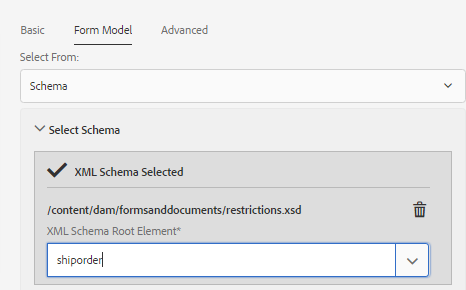

# 建立最適化表單 {#creating-an-adaptive-form}

## <strong>建立最適化表單</strong>{#strong-create-an-adaptive-form-strong}

請依照下列步驟建立最適化表單。

1. 存取AEM Forms Author例項於 `https://[server]:[port]/<custom-context-if-any>.`

1. 在AEM登入頁面上輸入您的認證。

   登入後，在左上角，點選「 **[!UICONTROL Adobe Experience Manager >表單>表單與檔案」]**。

   >[!NOTE]
   >
   >對於預設安裝，登錄為， `admin` 口令為 `admin`。

1. 點選「 **[!UICONTROL 建立]** 」並選 **[!UICONTROL 取「最適化表單]**」。
1. 此時會出現選擇範本的選項。 如需範本的詳細資訊，請參 [閱最適化表單範本](/help/forms/using/creating-adaptive-form.md#p-adaptive-form-templates-p)。 點選範本以選取範本，然後點選「下一步」。
1. 出現「Add Properties（添加屬性）」選項。 指定下列屬性欄位的值。 「標題」和「名稱」欄位是必填欄位：

   * **** 標題：指定表單的顯示名稱。 標題可協助您識別AEM Forms使用者介面中的表單。
   * **** 名稱：指定表單的名稱。 在儲存庫中建立具有指定名稱的節點。 當您開始輸入標題時，系統會自動產生名稱欄位的值。 您可以變更建議的值。 名稱欄位只能包含英數字元、連字型大小和底線。 所有無效輸入都會以連字型大小取代。
   * **** 說明：指定表單的詳細資訊。
   * **** 標籤：指定標籤以唯一識別最適化表單。 標籤可協助搜尋表單。 若要建立標籤，請在「標籤」方塊中輸入新 **的標籤** 名稱。

1. 您可以根據下列其中一個表單模型建立最適化表單：

   * [表單資料模型](#fdm)
   * [XFA表單範本](/help/forms/using/creating-adaptive-form.md#p-create-an-adaptive-form-based-on-an-xfa-form-template-p)
   * [XML或JSON結構描述](/help/forms/using/creating-adaptive-form.md#p-create-an-adaptive-form-based-on-xml-or-json-schema-p)
   * 無或沒有任何表單模型
   您可以從「添加屬性」頁 **[!UICONTROL 面的「表單模型]** 」頁籤 **[!UICONTROL 配置這些模型]** 。 預設情況下，選定的表單模型為「 **[!UICONTROL 無」]**。

1. 點選「 **建立**」。 會建立最適化表單，並出現對話方塊以開啟表單以供編輯。

   指定完所有屬性後，按一下「創 **[!UICONTROL 建」]**。 會建立最適化表單，並出現對話方塊以開啟表單以供編輯。

   指定完所有屬性後，按一下「創 **[!UICONTROL 建」]**。 會建立最適化表單，並出現對話方塊以開啟表單以供編輯。

1. 點選 **[!UICONTROL 「開啟]** 」，在新標籤中開啟新建立的表格。 表格隨即開啟以供編輯，並顯示範本中可用的內容。 它還顯示邊欄，以根據需求自訂新建立的表格。

   根據最適化表單的類型，相關聯的XFA表單範本、XML結構描述或JSON結構描述中的表單元素會顯示在側欄的「內容瀏覽器」的「資料模型物件 ******** 」標籤中。 您也可以拖放這些元素來建立最適化表單。

   有關最適化表單製作介面和可用元件的資訊，請參 [閱製作最適化表單簡介](/help/forms/using/introduction-forms-authoring.md)。

   >[!NOTE] {grayBox=&quot;true&quot;}
   >
   >允許瀏覽器中的彈出式視窗在新標籤中開啟新建立的表格。

## 根據表單資料模型建立最適化表單 {#fdm}

[AEM Forms資料整合](/help/forms/using/data-integration.md) ，可讓您整合多個資料來源，並將其實體和服務整合在一起，以建立表單資料模型。 它是JSON結構描述的擴充功能。 您可以使用表單資料模型來建立最適化表單。 在表單資料模型中配置的實體或資料模型對象可用作表單創作的資料模型對象。 這些資料系結至個別的資料來源，用來預先填寫表單，並將提交的資料寫回個別的資料來源。 您也可以使用自適應表單規則來叫用表單資料模型中設定的服務。

要使用表單資料模型建立自適應表單：

1. 在「添加屬性」螢幕的「表單模型」頁籤中， **[!UICONTROL 從「從中選擇」下]** 拉清單中選擇「表 **[!UICONTROL 單資料模型]** 」。

   

1. 點選以展開「 **[!UICONTROL 選取表單資料模型」]**。 列出所有可用的表單資料模型。

   從資料模型中選擇。

   

>[!NOTE]
>
>您也可以變更最適化表單的表單資料模型。 如需詳細步驟，請參 [閱編輯最適化表單的表單模型屬性](#edit-form-model)。

## 根據XFA表單範本建立最適化表單 {#create-an-adaptive-form-based-on-an-xfa-form-template}

您可以重新運用XFA表單範本來建立最適化表單。 若要重新使用，請上傳XFA表單範本並將其與最適化表單建立關聯。 表單範本（XFA表單）的元素可在製作最適化表單時用於內容搜尋器。 從「內容搜尋器」中，您可以拖放表單上的表單範本元素。

>[!NOTE]
>
>[在您開始建立以表單範本為基礎的最適化表單之前](/help/forms/using/get-xdp-pdf-documents-aem.md) ，請先將XFA表單範本上傳至AEM表單。

執行下列動作，將XFA表單範本用作最適化表單的表單模型：

1. 在「添 **[!UICONTROL 加屬性]** 」頁上，開啟「表 **[!UICONTROL 單模型」頁籤]** 。
1. 在「表單模型」頁籤的下拉清單中，選擇「表單模 **[!UICONTROL 板」]**。 所有透過AEM Forms UI上傳至儲存庫的表單範本都會列在清單中供選取。 從清單中選擇模板。

   
   **** 圖：選 *擇表單模板*

   >[!NOTE]
   >
   >您也可以變更最適化表單的表單範本。 如需詳細步驟，請參 [閱編輯最適化表單的表單模型屬性](#edit-form-model)。

## 建立以XML或JSON結構描述為基礎的最適化表單 {#create-an-adaptive-form-based-on-xml-or-json-schema}

XML和JSON結構描述資料由組織中的後端系統產生或使用的結構。 您可以將架構與最適化表單建立關聯，並使用其元素將動態內容新增至最適化表單。 架構的元素可在內容瀏覽器的「資料模型物件」索引標籤中使用，以製作最適化表單。 您可以拖放架構元素來建立表單。

請參閱下列檔案，以瞭解如何設計XML或JSON架構以製作最適化表單。

* [使用XML架構建立最適化表單](/help/forms/using/adaptive-form-xml-schema-form-model.md)
* [使用JSON結構描述建立最適化表單](/help/forms/using/adaptive-form-json-schema-form-model.md)

請執行下列動作，將XML或JSON結構描述用作最適化表單的表單模型：

1. 在最適 **[!UICONTROL 化表單建立頁面的]** 「新增屬性」步驟中，點選「表單 **[!UICONTROL 模型」標籤]** 。
1. 在「表單模型」頁籤中，從「 **[!UICONTROL 選擇自]** 」 **** 下拉欄位中選擇「架構」。

1. 點選 **[!UICONTROL 選擇結構]** ，然後執行下列其中一項作業：

   * **[!UICONTROL 從磁碟上傳]** -選取此選項，並點選「上傳結構描述定義」，從您的檔案系統瀏覽及上傳XML結構描述或JSON結構描述。 已上載的架構檔案駐留在表單中，而且無法訪問其他自適應表單。
   * **[!UICONTROL 在儲存庫中搜索]** -選擇此選項可從儲存庫中可用的方案定義檔案清單中進行選擇。 選取XML或JSON結構描述檔做為表單模型。 所選模式將與表單相關聯，並且可以訪問，以用於其他自適應表單。
   >[!CAUTION] {grayBox=&quot;true&quot;}
   >
   >請確定JSON結構描述檔名的結尾 **為。schema.json**。 例如：mySchema.schema.json

   
   **** 圖：選 *取XML或JSON結構描述*

1. （僅適用於XML架構）選擇或上傳XML架構後，請指定所選XSD檔案的根元素，以與最適化表單對應。

   
   **** 圖：選 *取XSD根元素*

>[!NOTE]
>
>您也可以變更最適化表單的架構。 如需詳細步驟，請參 [閱編輯最適化表單的表單模型屬性](#edit-form-model)。

## 最適化表單範本 {#adaptive-form-templates}

範本提供基本結構並定義最適化表單的外觀（版面和樣式）。 它具有預先格式化的元件，其中包含某些屬性和內容結構。 AEM Forms現成可用，提供一些最適化表單範本。 若要取得包含進階範本的完整範本套件，您必須安裝AEM Forms附加元件套件。 如需詳細資訊，請 [參閱「安裝AEM Forms附加元件套件」](/help/forms/using/installing-configuring-aem-forms-osgi.md)。

此外，您也可以使用範本編輯器來建立自己的範本。 如需使用範本的詳細資訊，請參閱最適 [化表單範本](/help/forms/using/template-editor.md)。

>[!NOTE]
>
>當您開啟使用進階範本建立的最適化表單進行編輯時，會出現錯誤訊息。 進階範本有「簽名步驟」元件，預設會啟用Adobe Sign。 建立並選取 [Adobe Sign雲端設定](/help/forms/using/adobe-sign-integration-adaptive-forms.md) , [並設定簽署者](/help/forms/using/working-with-adobe-sign.md#main-pars-header-1374317451) ，以解決錯誤。

## 編輯最適化表單的表單模型屬性 {#edit-form-model}

最適化表單的建立不需使用表單模型（使用表單模型的「無」選項），或使用表單模型，例如表單範本、XML結構描述或JSON結構描述，或表單資料模型。 可將自適應表單的表單模型從「無」(None)更改為其它表單模型。 對於基於表單模型的最適化表單，您可以針對相同的表單模型選擇其他表單範本、XML結構描述、JSON結構描述或表單資料模型。 但是，不能將一個表單模型更改為另一個表單模型。

1. 選取最適化表單，然後點選「 **屬性** 」圖示。
1. 開啟「 **[!UICONTROL 表單模型]** 」(Form Model)頁籤並執行下列操作之一。

   * 如果最適化表單沒有表單模型，您可以選擇其他表單模型，並據以選擇表單範本、XML或JSON結構描述或表單資料模型。
   * 如果最適化表單是以表單模型為基礎，您可以針對相同的表單模型選擇其他表單範本、XML或JSON結構描述，或表單資料模型。

1. 點選「 **[!UICONTROL 儲存]** 」以儲存屬性。

## 自動儲存最適化表單 {#auto-save-an-adaptive-form}

預設情況下，最適化表單的內容會保存在用戶操作上，例如按保存按鈕時。 您也可以設定自適應表單，以根據事件或時間間隔自動開始儲存內容。 自動儲存選項在下列項目中很實用：

* 自動儲存匿名和登入使用者的內容
* 儲存表單內容，毋需或最少的使用者干預
* 根據使用者事件開始儲存表格內容
* 在指定時間間隔後重複儲存表單內容

### 為最適化表單啟用自動儲存 {#enable-auto-save-for-an-adaptive-form}

依預設，自動儲存選項不會啟用。 您可以從最適化表單的「自動儲存」索引標籤啟用自動儲存選項。 「自動保存」頁籤還提供了幾個其它配置選項。 執行以下步驟以啟用和配置最適化表單的自動保存選項：

1. 若要存取屬性中的自動儲存區段，請選取元件，然後點選欄  > **[!UICONTROL 最適化表單容器]**，然後點選 。
1. 在「自 **[!UICONTROL 動儲存]** 」區 **[!UICONTROL 段中]** ，啟用自動儲存選項。
1. 在「最 **[!UICONTROL 適化表單事件]** 」方塊中，指定1或TRUE，以在表單載入瀏覽器時自動開始儲存表單。 您也可以指定事件的條件運算式，當觸發並傳回true時，會開始儲存表單的內容。
1. 指定觸發器。 會根據您的設定觸發自動儲存。 您的選項包括：

   * **** 時間型：選擇根據特定時間間隔開始保存內容的選項。
   * **** 事件型：選取在觸發事件時開始儲存內容的選項。
   選擇觸發器時，將啟用「策略配置」框。 「策略配置」框可讓您：

   * 如果選擇基於時間的觸發器，請 **[!UICONTROL 指定時間間隔]** 。
   * 如果您選取事件型觸發器，請指 **[!UICONTROL 定事件]** 名稱。
   您也可以建立並新增自己的自訂策略至清單。 如需詳細資訊，請 [參閱實作自訂策略以自動儲存表單](/help/forms/using/auto-save-an-adaptive-form.md#p-implement-a-custom-strategy-to-enable-autosave-for-adaptive-forms-p)。

1. （僅限基於時間的自動保存）執行以下步驟以配置基於時間的自動保存選項。

   1. 在「自 **[!UICONTROL 動儲存此間隔]** 」方塊中，以秒為單位指定時間間隔。 在間隔框中指定的秒數過後，會重複保存表單。

1. （僅限事件型自動儲存）執行下列步驟以設定事件型自動儲存的選項。

   1. 在「在此 **事件後自動儲存** 」方塊中，指定 [GuideBridge事件](https://helpx.adobe.com/aem-forms/6/javascript-api/GuideBridge.html) 。 每次運算式評估為TRUE時，都會儲存表格。

1. （可選）若要自動儲存匿名使用者的內容，請選取「啟用匿名使用者的自動 **儲存」選項** ，然後按一下「 **[!UICONTROL 確定」]**。

   >[!NOTE]
   >
   >若要自動儲存選項以供匿名使用者使用，請確定您已設定Forms Common Configuration Service，讓所有使用者都能預覽、驗證和簽署表格。
   >
   >若要設定服務，請前往AEM Web Console設定，位於 `https://[server]:[host]/system/console/configMgr` 並編輯 **[!UICONTROL Forms Common Configuration Service]** ，以在「允許 **[!UICONTROL 」欄位中選擇「所有使用者]****** 」選項，然後儲存設定。