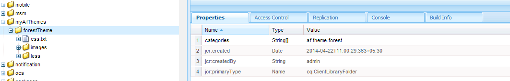

# 建立自訂的最適化表單主題 {#creating-custom-adaptive-form-themes}

>[!CAUTION]
>
>AEM Forms提供「主 [題編輯器](/help/forms/using/themes.md) 」功能，以建立和修改最適化表 [單主題](/help/forms/using/themes.md)。 只有當您從沒有 [Theme Editor](/help/forms/using/themes.md) ，而且您已有使用Less/CSS檔案（預設主題編輯器方法）建立的主題投資時，才能執行本文中列出的步驟。

## 必備條件 {#prerequisites}

* 瞭解LESS(Leaner CSS)架構
* 如何在Adobe Experience manager中建立用戶端程式庫
* [建立最適化表單範本](/help/forms/using/custom-adaptive-forms-templates.md) ，以使用您建立的主題

## Adaptive form theme {#adaptive-form-theme}

最適 **化表單主題** ，是AEM用戶端資料庫，可用來定義最適化表單的樣式（外觀和感覺）。

您可以建立 **最適化範本** ，並將主題套用至範本。 然後，您可使用此自訂範本來建立最適 **化表單**。


## 建立最適化表單主題 {#to-create-an-adaptive-form-theme}

>[!NOTE]
>
>使用AEM物件的範例名稱（例如節點、屬性和資料夾）來說明下列程式。
>
>如果使用名稱執行這些步驟，則生成的模板應與以下快照類似：

 森林主題最適化表單快照&#x200B;****&#x200B;圖：森林 *主題範例*

1. 在節點下建立類 `cq:ClientLibraryFolder` 型的 `/apps`節點。

   例如，建立以下節點：

   `/apps/myAfThemes/forestTheme`

1. 將多值字串屬性新增 `categories` 至節點並適當設定其值。

   例如，將屬性設為： `af.theme.forest`。

   

1. 向步驟1中創 `less` 建的節 `css`點添加兩個 `css.txt` 資料夾和一個檔案：

   * `less` 資料夾：包含 `less` 您用來定義變數和 `less` 管理 `less mixins` .css樣式的變數檔案。

      此檔案夾包含 `less` 變數檔案、混合 `less` 檔案、使用混合 `less` 檔案和變數定義樣式的檔案。 然後，所有這些較少的檔案都會匯入樣式。

   * `css`資料夾：包含。css檔案，您可在其中定義主題中使用的靜態樣式。
   **變數檔案較少**:這些是檔案，您可在其中定義或覆寫用於定義CSS樣式的變數。

   最適化表單提供下列。less檔案中定義的OOTB變數：

   * `/apps/clientlibs/fd/af/guidetheme/common/less/globalvariables.less`
   * `/apps/clientlibs/fd/af/guidetheme/common/less/layoutvariables.less`
   最適化表單也提供下列定義的第三方變數：

   `/apps/clientlibs/fd/af/third-party/less/variables.less`

   您可以使用自適應表單中提供的較少變數、覆寫這些變數，或建立新的較少變數。

   >[!NOTE]
   >
   >在導入較少前置處理器的檔案時，在import語句中指定檔案的相對路徑。

   覆寫變數範例：

   ```
   @button-background-color: rgb(19, 102, 44);
   @button-border-color: rgb(19, 102, 44);
   @button-border-size: 0px;
   @button-padding: 10px 15px;
   @button-font-color: #ffffff;
   ```

   若要覆寫變 `less`數：

   1. 匯入預設的最適化表單變數：

      `/apps/clientlibs/fd/af/guidetheme/common/less/globalvariables.less/apps/clientlibs/fd/af/guidetheme/common/less/layoutvariables.less`

   1. 然後匯入包含覆寫變數的較少檔案。
   新變數定義範例：

   ```
   @button-focus-bg-color: rgb(40, 208, 90);
   @button-hover-bg-color: rgb(30, 156, 67);
   ```

   **** 檔案的混音較少：您可以定義接受變數作為參數的函式。 這些函式的輸出是生成的樣式。 在不同的樣式中使用這些混音，以避免重複的CSS樣式。

   最適化表單提供定義於：

   * `/apps/clientlibs/fd/af/guidetheme/common/less/adaptiveforms-mixins.less`
   最適化表單也提供下列定義的協力廠商混合：

   * `/apps/clientlibs/fd/af/third-party/less/mixins.less`
   混合定義示例：

   ```
   .rounded-corners (@radius) {
     -webkit-border-radius: @radius;
     -moz-border-radius: @radius;
     -ms-border-radius: @radius;
     -o-border-radius: @radius;
     border-radius: @radius;
   }
   
   .border(@color, @type, @size) {
      border: @color @size @type;
   }
   ```

   **** Styles.less檔案：使用此檔案可包含您在用戶端程式庫中需要使用的所有較少檔案（變數、混合、樣式）。

   在以下示例 `styles.less` 檔案中，可以按任意順序放置import語句。

   要導入以下。less檔案的語句是必需的：

   * `globalvariables.less`
   * `layoutvariables.less`
   * `components.less`
   * `layouts.less`

   ```
   @import "../../../clientlibs/fd/af/guidetheme/common/less/globalvariables.less";
   @import "../../../clientlibs/fd/af/guidetheme/common/less/layoutvariables.less";
   @import "forestTheme-variables";
   @import "../../../clientlibs/fd/af/guidetheme/common/less/components.less";
   @import "../../../clientlibs/fd/af/guidetheme/common/less/layouts.less";
   
   /* custom styles */
   
   .guidetoolbar {
     input[type="button"], button, .button {
       .rounded-corners (@button-radius);
       &:hover {
         background-color: @button-hover-bg-color;
       }
       &:focus {
         background-color: @button-focus-bg-color;
       }
     }
   }
   
   form {
       background-image: url(../images/forest.png);
    background-repeat: no-repeat;
    background-size: 100%;
   }
   ```

   包 `css.txt` 含要下載庫的。css檔案路徑。

   例如：

   ```
   #base=/apps/clientlibs/fd/af/third-party/css
   bootstrap.css
   
   #base=less
   styles.less
   
   #base=/apps/clientlibs/fd/xfaforms/xfalib/css
   datepicker.css
   listboxwidget.css
   scribble.css
   dialog.css
   ```

   >[!NOTE]
   >
   >styles.less檔案不是必需的。 這表示，如果您尚未定義任何自訂樣式、變數或混音，就不需要建立此檔案。
   >
   >不過，如果您未在css.txt檔案中建立style.less檔案，則需要取消下列行的註解：
   >
   >**`#base=less`**
   >
   >並加上下列備注：
   >
   >**`styles.less`**

## 在最適化表單中使用主題 {#to-use-a-theme-in-an-adaptive-form}

在建立最適化表單主題後，請執行下列步驟，以最適化表單使用此主題：

1. 若要包含在中建立的主 [題以建立最適化表單主題](/help/forms/using/creating-custom-adaptive-form-themes.md#p-to-create-an-adaptive-form-theme-p) ，請建立自訂的頁面類型 `cq:Component`。

   例如， `/apps/myAfCustomizations/myAfPages/forestPage`

   1. 新增屬 `sling:resourceSuperType` 性，並將其值設為 `fd/af/components/page/base`。

      

   1. 若要使用頁面中的主題，您需要將覆寫檔案library.jsp新增至節點。

      然後，您就可匯入在「建立本文的最適化表單主題」區段中建立的主題。

      下列范常式式碼片段會匯入主 `af.theme.forest` 題。

      ```
      <%@include file="/libs/fd/af/components/guidesglobal.jsp"%>
      <cq:includeClientLib categories="af.theme.forest"/>
      ```

   1. **可選**:在自訂頁面中，視需要覆寫header.jsp、footer.jsp和body.jsp。

1. 建立自訂範本(例如： `/apps/myAfCustomizations/myAfTemplates/forestTemplate`)其jcr:content指向上一步驟中建立的自訂頁面(例如： `myAfCustomizations/myAfPages/forestPage)`。

   

1. 使用在上一步中建立的模板建立最適化表單。 最適化表單的外觀和感覺由本文「建立最適化表單主題」一節中建立的主題所定義。

