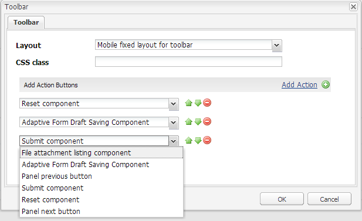

# 建立自訂工具列動作{#creating-a-custom-toolbar-action}

## 必備條件 {#prerequisite}

在建立自訂工具列動作之前，請熟悉使 [用用戶端程式庫](/help/sites-developing/clientlibs.md)[和使用CRXDE Lite開發](/help/sites-developing/developing-with-crxde-lite.md)。

## 什麼是動作 {#what-is-an-action-br}

最適化表單提供工具列，可讓表單作者設定一組選項。 這些選項定義為最適化表單的動作。 按一下「面板工具列」中的「編輯」按鈕，以設定最適化表單支援的動作。



除了預設提供的動作集外，您也可以在工具列中建立自訂動作。 例如，您可以新增動作，讓使用者在提交表單之前，先檢閱所有最適化的表單欄位。

## 在最適化表單中建立自訂動作的步驟 {#steps}

為了說明如何建立自訂工具列動作，下列步驟會引導您建立按鈕，讓使用者在提交填寫的表單之前，先檢閱所有最適化的表單欄位。

1. 最適化表單支援的所有預設動作都會顯示在資料 `/libs/fd/af/components/actions` 夾中。 在CRXDE中，將節 `fileattachmentlisting` 點從復 `/libs/fd/af/components/actions/fileattachmentlisting` 制到 `/apps/customaction`。

1. 將節點複製到資料夾 `apps/customaction` 後，將節點名稱更名為 `reviewbeforesubmit`。 此外，還可以更 `jcr:title` 改節 `jcr:description` 點的和屬性。

   屬 `jcr:title` 性包含工具欄對話框中顯示的操作的名稱。 該 `jcr:description` 屬性包含當用戶將指針暫留在操作上時顯示的詳細資訊。

   

1. 在節 `cq:template` 點中選擇 `reviewbeforesubmit` 節點。 請確定屬性的值 `guideNodeClass` 為，並 `guideButton` 據以變 `jcr:title` 更屬性。
1. 更改節點中的type屬 `cq:Template` 性。 對於當前示例，將type屬性更改為按鈕。

   類型值會新增為元件所產生HTML中的CSS類別。 使用者可使用該CSS類別來設定其動作的樣式。 行動與桌上型裝置的預設樣式都提供給按鈕、送出、重設及儲存類型值。

1. 從最適化表單編輯工具列對話方塊中選取自訂動作。 面板的工具列中會顯示「檢閱」按鈕。

    「 

1. 若要提供「檢閱」按鈕的功能，請在init.jsp檔案中新增一些JavaScript和CSS程式碼以及伺服器端程式碼，這些程式碼會出現在節 `reviewbeforesubmit` 點中。

   在中新增下列程式碼 `init.jsp`。

   ```
   <%@include file="/libs/fd/af/components/guidesglobal.jsp" %>
   <guide:initializeBean name="guideField" className="com.adobe.aemds.guide.common.GuideButton"/>
   
   <c:if test="${not isEditMode}">
           <cq:includeClientLib categories="reviewsubmitclientlibruntime" />
   </c:if>
   
   <%--- BootStrap Modal Dialog  --------------%>
   <div class="modal fade" id="reviewSubmit" tabindex="-1">
       <div class="modal-dialog">
           <div class="modal-content">
               <div class="modal-header">
                   <h3>Review the Form Fields</h3>
               </div>
               <div class="modal-body">
                   <div class="modal-list">
                       <table class="table table-bordered">
                           <tr class="name">
                               <td class="reviewlabel col-md-3 active">
                                   <label>Your Name is: </label>
                               </td>
                           </tr>
                           <tr class="pan">
                               <td class="reviewlabel col-md-3 active">
                                   <label>Your Pan Number is: </label>
                               </td>
                           </tr>
                           <tr class="dob">
                               <td class="reviewlabel col-md-3 active">
                                   <label>Your Date Of Birth is: </label>
                               </td>
                           </tr>
                           <tr class="80cdeclaration">
                               <td class="reviewlabel col-md-3 active">
                                   <label>Your Total 80C Declaration Amount is: </label>
                               </td>
                           </tr>
                           <tr class="rentpaid">
                               <td class="reviewlabel col-md-3 active">
                                   <label>Your Total HRA Amount is: </label>
                               </td>
                           </tr>
                       </table>
                   </div>
               </div><!-- /.modal-body -->
               <div class="modal-footer">
                   <div class="fileAttachmentListingCloseButton col-md-2 col-xs-2 col-sm-2">
                       <button data-dismiss="modal">Close</button>
                   </div>
               </div>
           </div><!-- /.modal-content -->
       </div><!-- /.modal-dialog -->
   </div><!-- /.modal -->
   ```

   在檔案中新增下列程 `ReviewBeforeSubmit.js` 式碼。

   ```
   /*anonymous function to handle show of review before submit view */
   $(function () {
       if($("div.reviewbeforesubmit button[id*=reviewbeforesubmit]").length > 0) {
           $("div.reviewbeforesubmit button[id*=reviewbeforesubmit]").click(function(){
               // Create the options object to be passed to the getElementProperty API
               var options = {},
                   result = [];
               options.somExpressions = [];
               options.propertyName = "value";
               guideBridge.visit(function(model){
                   if(model.name === "name" || model.name === "pan" || model.name === "dateofbirth" || model.name === "total" || model.name === "totalmonthlyrent"){
                           options.somExpressions.push(model.somExpression);
                   }
               }, this);
               result = guideBridge.getElementProperty(options);
   
               $('#reviewSubmit .reviewlabel').each(function(index, item){
                   var data = ((result.data[index] == null) ? "No Data Filled" : result.data[index]);
                   if($(this).next().hasClass("reviewlabelvalue")){
                       $(this).next().html(data);
                   } else {
                       $(this).after($("<td></td>").addClass("reviewlabelvalue col-md-6 active").html(data));
                   }
               });
               // added because in mobile devices it was causing problem of backdrop
               $("#reviewSubmit").appendTo('body');
               $("#reviewSubmit").modal("show");
           });
       }
   });
   ```

   將下列程式碼新增至 `ReviewBeforeSubmit.css` 檔案。

   ```css
   .modal-list .reviewlabel {
       white-space: normal;
       text-align: right;
       padding:2px;
   }
   
   .modal-list .reviewlabelvalue {
       border: #cde0ec 1px solid;
       padding:2px;
   }
   
   /* Adding icon for this action in mobile devices */
   /* This is the glyphicon provided by bootstrap eye-open */
   /* .<type> .iconButton-icon */
   .reviewbeforesubmit .iconButton-icon {
       position: relative;
       top: -8px;
       font-family: 'Glyphicons Halflings';
       font-style: normal;
   }
   
   .reviewbeforesubmit .iconButton-icon:before {
       content: "\e105"
   }
   ```

1. 若要驗證自訂動作的功能，請在「預覽」模式中開啟最適化表單，然後按一下工具列中的「檢閱」。

   >[!NOTE]
   >
   >程式 `GuideBridge` 庫不會以編寫模式載入。 因此，此自訂動作無法在編寫模式中運作。

   

## 示例 {#samples}

以下封存包含內容套件。 此套件包含與上述自訂工具列動作示範相關的最適化表單。

[取得檔案](assets/customtoolbaractiondemo.zip)
