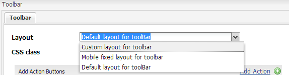

# 建立自訂工具列版面{#creating-custom-toolbar-layout}

## 工具列版面 {#layout}

當您建立最適化表單時，可以指定表單的工具列版面。 工具欄佈局定義了窗體中工具欄的命令和佈局。

工具列版面配置使用時，主要依賴由複雜JavaScript和CSS程式碼驅動的用戶端處理。 組織並最佳化此程式碼的服務可能是個複雜的問題。 為協助處理此問題，AEM提供「用戶端程式庫檔案夾」，可讓您將用戶端程式碼儲存在儲存庫中、將它組織為類別，並定義將每類程式碼提供給用戶端的時間和方式。 然後用戶端程式庫系統會負責在您的最終網頁中產生正確的連結，以載入正確的程式碼。 如需詳細資訊，請 [參閱「用戶端程式庫在AEM中的運作方式」。](/help/sites-developing/clientlibs.md)


工具列的範例版面

最適化表單提供一組現成可用的版面：


現成可用的工具列版面

此外，您還可以建立自訂工具列版面。

下列程式詳細說明建立自訂工具列的步驟，其中在工具列中顯示三個動作，在工具列的下拉式清單中顯示其他動作。

附加的內容套件包含下述的完整程式碼。 安裝內容套件後，請開啟以 `/content/forms/af/CustomLayoutDemo.html` 檢視自訂工具列版面配置示範。

CustomToolbarLayoutDemo.zip

[取得File](assets/customtoolbarlayoutdemo.zip)Demo自訂工具列版面

## 若要建立自訂工具列版面 {#layout-1}

1. 建立檔案夾以維護自訂工具列版面。 例如：

   `/apps/customlayout/toolbar`.

   若要建立自訂版面，您可以使用（並自訂）下列檔案夾中的其中一個現成可用的工具列版面：

   `/libs/fd/af/layouts/toolbar`

   例如，將節點從 `mobileFixedToolbarLayout` 資料夾復 `/libs/fd/af/layouts/toolbar` 制到檔案 `/apps/customlayout/toolbar` 夾。

   此外，將toolbarCommon.jsp複製到檔案 `/apps/customlayout/toolbar` 夾。

   >[!NOTE]
   >
   >您為維護自訂版面而建立的檔案夾，很多都是使用檔案夾來 `apps` 建立。

1. 將複製的節點重 `mobileFixedToolbarLayout`命名為 `customToolbarLayout.`

   此外，請提供節點的相關說明。 例如，將節點的jcr:description變更為工具列的 **自訂配置**。

   節 `guideComponentType` 點的屬性會決定版面類型。 在這種情況下，版面類型是工具列，因此它會顯示在工具列版面選擇下拉式清單中。

   

   具有相關說明的節點

   您的新自訂工具列版面會顯示在「最適化表單工 **具列」對話方** 塊設定中。

   

   可用工具列版面清單

   >[!NOTE]
   >
   >「版面」下拉式清單中會顯示在上一步驟中更新的說明。

1. 選取此自訂工具列版面，然後按一下「確定」。

   在節點中新增clientlib（javascript和css）, `/etc/customlayout` 並在中加入clientlib的參考 `customToolbarLayout.jsp`。

   

   customToolbarLayout.css檔案的路徑

   範例 `customToolbarLayout.jsp`:

   ```php
   <%@include file="/libs/fd/af/components/guidesglobal.jsp" %>
   <cq:includeClientLib categories="customtoolbarlayout" />
   <c:if test="${isEditMode}">
           <cq:includeClientLib categories="customtoolbarlayoutauthor" />
   </c:if>
   <div class="guidetoolbar mobileToolbar mobilecustomToolbar" data-guide-position-class="guide-element-hide">
       <div data-guide-scroll-indicator="true"></div>
       <%@include file="../toolbarCommon.jsp" %>
   </div>
   ```

   >[!NOTE]
   >
   >新增版面的指南工具列類別。 工具列的出廠設定樣式是相對於指導工具欄類定義的。

   範例 `toolBarCommon.jsp`:

   ```php
   <%@taglib prefix="fn" uri="https://java.sun.com/jsp/jstl/functions"%>
   <%--------------------
   This code iterates over all the tool bar items using the guideToolbar bean.
   If the number of toolbar items are more than 3, then we create a dropdown menu using bootstrap for other actions present in the toolbar.
   In both desktop and mobile devices, the layout is different.
   ---------------------------------%>
   
   <c:forEach items="${guideToolbar.items}" var="toolbarItem" varStatus="loop">
       <c:choose>
         <c:when test="${loop.index gt 2}">
      <c:choose>
       <c:when test="${loop.index eq 3}">
                     <div class="btn-group dropdown">
                       <button type="button" class="btn btn-primary dropdown-toggle label" data-toggle="dropdown">Actions <span class="caret"></code></button>
                       <button type="button" class="btn btn-primary dropdown-toggle icon" data-toggle="dropdown"><span class="glyphicon glyphicon-th-list"></code></button>
             <ul class="dropdown-menu" role="menu">
                           <li>
                               <div id="${toolbarItem.id}_guide-item">
                                 <sling:include path="${toolbarItem.path}" resourceType="${toolbarItem.resourceType}"/>
                              </div>
                           </li>
                           <c:if test="${loop.index eq (fn:length(guideToolbar.items)-1)}">
                                </ul>
                                </div>
                           </c:if>
       </c:when>
       <c:when test="${loop.index eq (fn:length(guideToolbar.items)-1)}">
                          <li>
                                     <div id="${toolbarItem.id}_guide-item">
                                         <sling:include path="${toolbarItem.path}" resourceType="${toolbarItem.resourceType}"/>
                                     </div>
                           </li>
                       </ul>
                     </div>
   
       </c:when>
       <c:otherwise>
         <li>
          <div id="${toolbarItem.id}_guide-item">
           <sling:include path="${toolbarItem.path}" resourceType="${toolbarItem.resourceType}"/>
          </div>
         </li>
       </c:otherwise>
      </c:choose>
         </c:when>
         <c:otherwise>
     <div id="${toolbarItem.id}_guide-item">
           <sling:include path="${toolbarItem.path}" resourceType="${toolbarItem.resourceType}"/>
        </div>
         </c:otherwise>
    </c:choose>
   </c:forEach>
   ```

   clientlib節點內部的CSS:

   ```css
   .mobilecustomToolbar .dropdown {
       display: inline-block;
   }
   
   .mobilecustomToolbar .dropdown {
       float: right;
   }
   
   .mobilecustomToolbar .dropdown > button {
      padding: 6px 12px;
   }
   
   .mobilecustomToolbar .dropdown .guideFieldWidget, .mobilecustomToolbar .dropdown .guideFieldWidget button {
       width: 100%;
   }
   
   .mobilecustomToolbar .dropdown .caret{
       border-bottom: 6px solid;
       border-right: 6px solid transparent;
       border-left: 6px solid transparent;
    border-top: transparent;
   }
   
   .mobilecustomToolbar .dropdown-menu{
    top: auto;
    bottom: 100%;
   }
   
   .mobilecustomToolbar .btn-group {
    vertical-align: super;
   }
   
   .mobilecustomToolbar .glyphicon {
    font-size: 24px;
   }
   
   @media (max-width: 767px){
   
    .mobilecustomToolbar .dropdown .guideButton .iconButton-icon {
      display: none;
       }
   
       .mobilecustomToolbar .dropdown .guideButton .iconButton-label {
      display: inline-block;
       }
   
       .mobilecustomToolbar .dropdown .guideButton button {
      background-color: #013853;
       }
   
    .mobilecustomToolbar .btn-group {
     vertical-align: top;
    }
   
   }
   ```

>[!NOTE]
>
>「版面」下拉式清單中會顯示在上一步驟中更新的說明。


自訂版面工具列的案頭檢視

