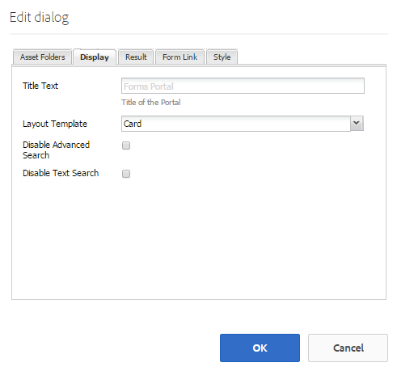

# 建立表單入口網站頁面{#creating-a-forms-portal-page}

Forms Portal元件為網頁開發人員提供元件，讓他們在使用Adobe Experience Manager(AEM)製作的網站上建立和自訂表單入口網站。 如需表單入口網站的快速概觀，請參 [閱在入口網站上發佈表單簡介](../../forms/using/introduction-publishing-forms.md)。

## 必備條件 {#prerequisites}

Forms Portal元件預設無法使用。 請確定下清單單入口元件類別已啟用，如啟用表單入口元 [件中所述](/help/forms/using/enabling-forms-portal-components.md)。

**檔案服務** (Document Services)包含Search &amp; Lister、Link、Drafts和Submissions元件。

**Document Services Predicates** Includes Date Predicate、Full Text Predicate、Properties Predicate和Tags Predicate元件。 這些元件用於在Search &amp; Lister元件中配置搜索。

在AEM網站頁面上啟用這些類別後，這些元件類別就可供元件瀏覽器使用。

Forms Portal元件類別

## Search &amp; Lister元件 {#search-amp-lister-component}

Search &amp; Lister元件位於「檔案服務」元件類別下，可用來列出頁面上的表單，並在列出的表單上實作搜尋。 此元件包含兩個窗格：

* 列出表單的清單窗格。
* 新增搜尋功能的搜尋窗格。

您可以將Search &amp; Lister元件從元件瀏覽器的「檔案服務」元件類別拖放至頁面上。 新增元件時，其外觀類似下列。

使用格線版面配置的頁面中的Search &amp; Lister元件

### 清單窗格 {#list-pane}

「清單」窗格是列出表單的區域。 Search &amp; Lister元件提供多種設定選項，您可用來控制「清單」窗格中表格的顯示。

若要設定「清單」窗格，請點選「搜尋與清單器」元件，然後點選 。 「編 **[!UICONTROL 輯元件]** 」(Edit Component)對話框開啟。

清單窗格處於編輯模式

「編 **輯** 」對話框包括幾個頁籤，這些頁籤提供下表中所述的配置選項。 完成 **時** ，點選「確定」以儲存設定。

<table>
 <tbody>
  <tr>
   <th>索引標籤</th>
   <th>設定</th>
   <th>說明</th>
  </tr>
  <tr>
   <td><strong>資產資料夾</strong></code></td>
   <td>新增項目</td>
   <td>設定使用AEM Forms UI上傳資產的檔案夾。 依預設，會列出所有已上傳的資產。 如需AEM Forms UI的詳細資訊，請參閱「管 <a href="../../forms/using/introduction-managing-forms.md" target="_blank">理表單的簡介」</a>。</td>
  </tr>
  <tr>
   <td>
<strong>顯示</strong></code>
 </td>
   <td>標題文字</td>
   <td>Search &amp; Lister元件的標題。 預設標題為 <strong>Forms Portal。</strong></td>
  </tr>
  <tr>
   <td> </td>
   <td>版面範本</td>
   <td>資產的版面配置。 </td>
  </tr>
  <tr>
   <td> </td>
   <td>停用進階搜尋</td>
   <td>啟用後，隱藏進階搜尋圖示。</td>
  </tr>
  <tr>
   <td> </td>
   <td>停用文字搜尋</td>
   <td>啟用後，隱藏全文搜索欄。</td>
  </tr>
  <tr>
   <td><strong>結果</strong></code></td>
   <td>每頁結果數</td>
   <td>設定您要在頁面上顯示的表單數量上限。</td>
  </tr>
  <tr>
   <td> </td>
   <td>結果文字</td>
   <td>
設定結果文字(例如，601個結果的1-12 <strong>個</strong>)。 預設值為「 <strong>結果」</strong>。
 
例如，如果您在此欄位中 <strong>指 </strong>定表單，而且總共有601個表單，則結果文字會變更為601個表單中的1-12 <strong>個。</strong>
 </td>
  </tr>
  <tr>
   <td> </td>
   <td>頁面文字</td>
   <td>
設定頁面文字(例如， <strong>第 </strong>1頁（共51頁）。 預設值為 <strong>Page</strong>。
 
例如，如果您在此欄位中 <strong>指定「應 </strong>用程式表單」，且有51個頁面，則頁面文字會變更為「應用程式表單 <strong></strong>1」（共51頁）。
 </td>
  </tr>
  <tr>
   <td> </td>
   <td>Of 文字</td>
   <td>
以指定的 <strong>文字</strong> (第1頁，共 <strong></strong>51頁)取代。 預設值 <strong>為</strong>。
 
例如，如果您在此欄位 <strong>中指 </strong>定「超出」，文字會變更為「第1頁 <strong>超過 </strong>51頁」。
 </td>
  </tr>
  <tr>
   <td><strong>表單連結</strong></code></td>
   <td>呈現類型</td>
   <td>根據指定的渲染類型控制表單清單。 可用的選項有PDF和HTML。 例如，如果您只選擇HTML作為演算類型，則會篩選掉PDF表格。</td>
  </tr>
  <tr>
   <td> </td>
   <td>HTML設定檔</td>
   <td>設定要用於轉譯的HTML描述檔。 下拉式清單中會列出所有可用的描述檔。</td>
  </tr>
  <tr>
   <td> </td>
   <td>提交URL</td>
   <td>
配置提交表單資料的servlet。
 
<strong></strong> 注意：表 <em>單的提交URL可在數處指定，其優先順序如下：</em>

    <ol>
     <li><em>內嵌在表單中的提交URL（在「提交」按鈕中）具有最高優先順序。</em></li>
     <li><em>AEM Forms UI中提及的提交URL具有第二高的優先順序。</em></li>
     <li><em>表單入口網站中提及的提交URL的優先順序最低。</em></li>
    </ol> </td>
  </tr>
  <tr>
   <td> </td>
   <td>HTML Render Action工具提示</td>
   <td>設定工具提示的文字，此工具提示會顯示在將指標暫留在  （HTML5圖示）上。</td>
  </tr>
  <tr>
   <td> </td>
   <td>PDF Render動作工具提示</td>
   <td>設定工具提示的文字，此文字會在將指標暫留在(PDF  圖示)上顯示。</td>
  </tr>
  <tr>
   <td><strong>樣式</strong></code></td>
   <td>樣式類型</td>
   <td>允許您指定「無 <strong>樣式」、「預設樣式</strong>」或「 <strong>自定義樣 </strong>式」來列出表單。</td>
  </tr>
  <tr>
   <td> </td>
   <td>自訂樣式路徑</td>
   <td>如果您選取「自訂」作為「樣式類型」，請瀏覽以指定自訂CSS的路徑，否則選取「預設」。</td>
  </tr>
 </tbody>
</table>

### 搜尋窗格 {#search-pane}

「搜尋」窗格可讓您在AEM Sidekick中，從「檔案服務謂語」類別新增「日期謂語」、「完整文字謂語」、「屬性謂語」和「標籤謂語」元件。 這些元件會實作搜尋功能，讓使用者在列出的表單上執行搜尋。

**** 提示：您 *可以根據預設准則控制表單入口網站上顯示的表單清單，並隱藏使用者的搜尋功能。 要控制表單清單，請使用Predicate元件來應用搜索篩選器。 您也可以指定預設篩選值，並停用「編輯元件」對話方塊的「顯示」索引標籤中的搜尋。*

Search Panel with Date、Full Text、Properties和Tags Predicate

#### 日期述詞 {#date-predicate}

Date Predicate元件在添加時，可對在指定持續時間內修改的列出表單啟用搜索。

要配置Date Predicate元件：

1. 點選元件，然後點選 。 「編輯」(Edit)對話框開啟。
1. 指定下列項目：

   * **** 類型：唯一可用的選項是「上次修 **改日期」**

   * **** 文字：Date Predicate Component的標籤或標題。 預設值為「上次修 **改日期」。**

   * **** 開始日期標籤：開始日期欄位的標籤或標題
   * **** 結束日期標籤：結束日期欄位的標籤或標題
   * **** 隱藏：若要強制執行預設日期篩選以列出表單

1. 點選「 **確定」**

#### Full Text Predicate {#full-text-predicate}

Full Text Predicate元件實現對表單資料的全文搜索，如名稱和說明。 使用者可以搜尋任何文字字串，以傳回名稱或說明中包含文字的表單。

要配置Full Text Predicate元件：

1. 點選元件，然後點選 。 「編輯」(Edit)對話框開啟。
1. 在「主標題」欄位中 **指定標題** 。
1. 點選「確 **定」**

#### 屬性謂詞 {#properties-predicate}

Properties Predicate元件實現基於表單屬性（如標題、作者和說明）搜索表單。

要配置Properties Predicate元件：

1. 點選元件，然後點選 。 「編輯」(Edit)對話框開啟。
1. 在「一般」標籤中，指定搜尋標籤。 預設值為「屬 **性」**

1. 在「選項」標籤中，點選「 **新增項目」。**
1. 從下拉式清單中選取屬性，並在下拉式清單下方的欄位中指定其搜尋標籤。
1. 重複步驟4以新增更多屬性。 您也可以指定預設篩選值，以根據指定的准則列出表單，並隱藏屬性以供使用者搜尋。 選取屬性的「隱藏」核取方塊，並指定預設篩選值。
例如，如果您想要顯示其標題中包含&quot;Travel&quot;的表單，請選取「標題」屬性旁的「隱藏」。 此外，指定「在預設篩選值中傳送」文字方塊。

1. 點選「 **確定」**

#### 標記述詞 {#tags-predicate}

Tags Predicate元件實現基於在Forms manager中定義的標籤搜索表單。

要配置Tags Predicate元件：

1. 點選元件，然後點選 。 「編輯」(Edit)對話框開啟。
1. 點選「標籤」欄位旁的向下箭頭按鈕。
1. 選擇適當的標籤
1. 點選「 **確定」**

選取的標籤會與選取的核取方塊一起顯示在「搜尋」窗格中。 使用者現在可以根據標籤縮小搜尋範圍。

## 列出頁面上的表單 {#list-forms-on-a-page-br}

若要在頁面上列出表單，請將 **[!UICONTROL Search &amp; Lister元件新增至頁面並設]** 定「清單」窗格 ****。 若要讓使用者使用日期、文字和標籤來搜尋表單，請新增「搜尋窗格」 **[!UICONTROL 元件]** 。

若要從頁面上的任何位置連結表單，請使用連結元件。 如需連結元件的詳細資訊，請參 [閱頁面中的內嵌連結元件](../../forms/using/embedding-link-component-page.md)。

要列出處於草稿狀態的表單和已提交的表單，請使用「草稿和提交 **[!UICONTROL 」元件]** 。 如需詳細資訊，請參 [閱自訂草稿和提交元件](../../forms/using/draft-submission-component.md)。

## 行動裝置友好性 {#mobile-device-friendliness}

Forms Portal Search &amp; Lister元件適合行動裝置使用，並可據以調整。 所有三種預設檢視：格點、卡片、面板會根據開啟網站的裝置重新開啟，而網頁也會隨之調整。 簡單的事實是，Search &amp; Lister僅是元件，不管控頁面層級樣式。

下圖顯示在行動裝置上開啟的Search &amp; Lister元件：

Search &amp; Lister元件

## 自訂表單入口網站頁面 {#customizing-a-forms-portal-page-br}

您可以自訂表單入口網頁，為頁面提供不同的外觀。 您也可以新增中繼資料來改善搜尋體驗、變更頁面的版面配置，以及新增自訂CSS樣式。 如需詳細資訊，請參 [閱自訂Forms Portal元件的範本](../../forms/using/customizing-templates-forms-portal-components.md)。

AEM Forms UI可讓您將自訂中繼資料新增至表單。 自訂中繼資料對於提供清單及搜尋表單體驗給使用者十分有用。 如需自訂中繼資料的詳細資訊，請參 [閱自訂Forms Portal元件的範本](../../forms/using/customizing-templates-forms-portal-components.md)。

現成可用的表單入口網站提供演算動作。 您可以自訂表單入口網站，以新增更多動作。 如需詳細資訊，請參 [閱「新增對表單清單項目的自訂動作」。](../../forms/using/add-custom-action-form-lister.md)

## 相關文章

* [啟用表單入口元件](/help/forms/using/enabling-forms-portal-components.md)
* [建立表單入口網頁](/help/forms/using/creating-form-portal-page.md)
* [使用API列出網頁上的表單](/help/forms/using/listing-forms-webpage-using-apis.md)
* [使用草稿和提交元件](/help/forms/using/draft-submission-component.md)
* [自訂草稿和提交表單的儲存](/help/forms/using/draft-submission-component.md)
* [將草稿和提交元件與資料庫整合的示例](/help/forms/using/integrate-draft-submission-database.md)
* [自訂表單入口元件的範本](/help/forms/using/customizing-templates-forms-portal-components.md)
* [在入口網站上發佈表格簡介](/help/forms/using/introduction-publishing-forms.md)
