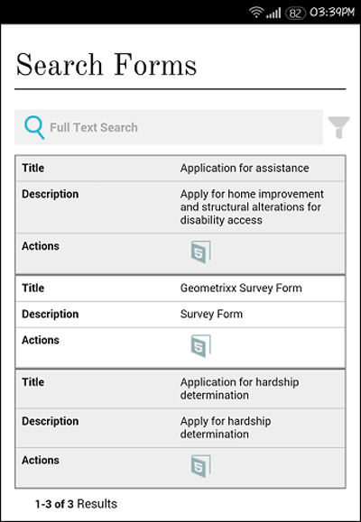

# 建立表單入口網站頁面{#creating-a-forms-portal-page}

| 版本 | 文章連結 |
| -------- | ---------------------------- |
| AEM as a Cloud Service  | [按一下這裡](https://experienceleague.adobe.com/docs/experience-manager-cloud-service/content/forms/adaptive-forms-authoring/authoring-adaptive-forms-foundation-components/configure-forms-portal.html) |
| AEM 6.5 | 本文章 |

Forms入口網站元件可讓網頁開發人員在利用Adobe Experience Manager (AEM)編寫的網站上建立及自訂表單入口網站。 如需快速瞭解表單入口網站，請參閱[在入口網站上發佈表單的簡介](../../forms/using/introduction-publishing-forms.md)。

## 先決條件 {#prerequisites}

Forms入口網站元件預設無法使用。 請確定下清單單入口網站元件類別已啟用，如[啟用表單入口網站元件](/help/forms/using/enabling-forms-portal-components.md)中所述。

**Document Services**&#x200B;包含搜尋與清單製作程式、連結、草稿與提交元件。

**檔案服務述詞**&#x200B;包含日期述詞、全文檢索述詞、屬性述詞和標籤述詞元件。 這些元件可用來設定「搜尋和製表器」元件中的搜尋。

在AEM網站頁面上啟用這些元件類別後，就可在元件瀏覽器中使用。

元件瀏覽器中的

Forms入口網站元件類別

## 搜尋與清單元件 {#search-amp-lister-component}

Document Services元件類別底下提供的Search &amp; Lister元件可用來列出頁面上的表單，以及在列出的表單上實施搜尋。 元件包含兩個窗格：

* 列出表單的清單窗格。
* 您新增搜尋功能的搜尋窗格。

您可以將Search &amp; Lister元件從元件瀏覽器中的Document Services元件類別拖放到頁面上。 新增元件時，其外觀類似下列專案。

具有格線版面配置之頁面中的「搜尋與清單程式」元件

### 清單窗格 {#list-pane}

「清單」窗格是列出表單的區域。 Search &amp; Lister元件提供各種組態選項，可用來控制List窗格中表單的顯示。

若要設定[清單]窗格，請選取[搜尋並列出程式]元件，然後選取。 **[!UICONTROL 編輯元件]**&#x200B;對話方塊開啟。

編輯模式中的清單窗格

**編輯**&#x200B;對話方塊包含數個索引標籤，提供下表所述的設定選項。 完成時，選取&#x200B;**確定**&#x200B;以儲存設定。

<table>
 <tbody>
  <tr>
   <th>標籤</th>
   <th>設定</th>
   <th>說明</th>
  </tr>
  <tr>
   <td><strong>資產檔案夾</strong></code></td>
   <td>新增項目</td>
   <td>設定使用AEM Forms UI上傳資產的資料夾。 預設情況下，其中會列出所有上傳的資產。 如需AEM Forms UI的詳細資訊，請參閱<a href="../../forms/using/introduction-managing-forms.md" target="_blank">管理表單簡介</a>。</td>
  </tr>
  <tr>
   <td>
<strong>顯示區</strong></code>
 </td>
   <td>標題文字</td>
   <td>搜尋與清單元件的標題。 預設標題為<strong>Forms入口網站。</strong></td>
  </tr>
  <tr>
   <td> </td>
   <td>版面配置範本</td>
   <td>資產的配置。 </td>
  </tr>
  <tr>
   <td> </td>
   <td>停用進階搜尋</td>
   <td>啟用時，會隱藏進階搜尋圖示。</td>
  </tr>
  <tr>
   <td> </td>
   <td>停用文字搜尋</td>
   <td>啟用時，會隱藏全文檢索搜尋列。</td>
  </tr>
  <tr>
   <td><strong>結果</strong></code></td>
   <td>每頁結果數</td>
   <td>設定要在頁面上顯示的表單最大數量。</td>
  </tr>
  <tr>
   <td> </td>
   <td>結果文字</td>
   <td>
設定結果文字（例如，601 <strong>個結果</strong>中的1-12）。 預設值為<strong>結果</strong>。
 
例如，若您在此欄位中指定<strong>Forms </strong>，且共有601個表單，則結果文字會變更為1-12個(共601個<strong>Forms。</strong>
 </td>
  </tr>
  <tr>
   <td> </td>
   <td>頁面文字</td>
   <td>
設定頁面文字（例如，<strong>第</strong>頁，共51頁）。 預設值為<strong>頁面</strong>。
 
例如，如果您在此欄位中指定<strong>應用程式表單</strong>，且有51頁，則頁面文字會變更為<strong>應用程式表單</strong>1 / 51。
 </td>
  </tr>
  <tr>
   <td> </td>
   <td>Of 文字</td>
   <td>
以指定的文字（第1 <strong>頁，共</strong>51頁）取代</strong>的<strong>字。 預設值為<strong>個，共</strong>個。
 
例如，如果您在此欄位中指定<strong> / </strong>，文字會變更為第1頁<strong> / </strong>51。
 </td>
  </tr>
  <tr>
   <td><strong>表單連結</strong></code></td>
   <td>呈現類型</td>
   <td>根據指定的轉譯器型別控制表單清單。 可用的選項有PDF和HTML。 例如，如果您選取「僅HTML」作為轉譯型別，則會篩選掉PDF forms。</td>
  </tr>
  <tr>
   <td> </td>
   <td>HTML設定檔</td>
   <td>設定用於轉譯的HTML設定檔。 下拉式清單中會列出所有可用的設定檔。</td>
  </tr>
  <tr>
   <td> </td>
   <td>提交URL</td>
   <td>
設定表單資料提交所在的servlet。
 
<strong>注意：</strong> <em>表單的送出URL可以在數個位置指定，其優先順序如下：</em>

    <ol>
     <li><em>表單中內嵌的提交URL （在提交按鈕中）具有最高優先順序。</em></li>
     <li><em>AEM Forms UI中提到的提交URL具有第二高優先順序。</em></li>
     <li><em>Forms入口網站中提到的提交URL優先順序最低。</em></li>
    </ol> </td>
  </tr>
  <tr>
   <td> </td>
   <td>HTML演算動作工具提示</td>
   <td>設定工具提示的文字，當游標停留在上時，會顯示工具提示(HTML5圖示)。</td>
  </tr>
  <tr>
   <td> </td>
   <td>PDF演算動作工具提示</td>
   <td>設定工具提示的文字，當游標停留在上時，會顯示工具提示(PDF圖示)。</td>
  </tr>
  <tr>
   <td><strong>樣式</strong></code></td>
   <td>樣式型別</td>
   <td>可讓您指定列出表單的<strong>無樣式、預設樣式</strong>或<strong>自訂樣式</strong>。</td>
  </tr>
  <tr>
   <td> </td>
   <td>自訂樣式路徑</td>
   <td>如果您選取「自訂」作為「樣式型別」，請瀏覽以指定自訂CSS的路徑，否則請選取「預設」。</td>
  </tr>
 </tbody>
</table>

### 搜尋窗格 {#search-pane}

「搜尋」窗格可讓您從AEM Sidekick的檔案服務述詞類別中新增日期述詞、全文檢索述詞、屬性述詞和標籤述詞元件。 這些元件實施搜尋功能，讓使用者對列出的表單執行搜尋。

**秘訣：** *您可以根據預設條件控制表單入口網站上顯示的表單清單，並隱藏一般使用者的搜尋功能。 若要控制表單清單，請使用述詞元件來套用搜尋篩選器。 您也可以指定預設篩選值，並從[編輯元件]對話方塊的[顯示]索引標籤停用搜尋。*

包含日期、全文、屬性和標籤述詞的搜尋面板

#### 日期述詞 {#date-predicate}

新增日期述詞元件時，可讓您搜尋在指定期間內修改過的列出表單。

若要設定日期述詞元件：

1. 選取元件，然後選取。 「編輯」對話方塊開啟。
1. 指定下列專案：

   * **型別：**&#x200B;唯一可用的選項是&#x200B;**上次修改日期**

   * 日期述詞元件的&#x200B;**文字：**&#x200B;標籤或標題。 預設值為&#x200B;**上次修改日期。**

   * **開始日期標籤：**&#x200B;開始日期欄位的標籤或標題
   * **結束日期標籤：**&#x200B;結束日期欄位的標籤或標題
   * **隱藏：**&#x200B;若要對清單表單強制執行預設日期篩選

1. 選取&#x200B;**確定**

#### 全文檢索述詞 {#full-text-predicate}

全文檢索述詞元件會針對表單資料（例如名稱和說明）實作全文檢索搜尋。 使用者可以搜尋任何文字字串，以傳回名稱或說明中包含文字的表單。

設定全文檢索述詞元件：

1. 選取元件，然後選取。 「編輯」對話方塊開啟。
1. 在&#x200B;**主要標題**&#x200B;欄位中指定標題。
1. 選取&#x200B;**確定**

#### 屬性述詞 {#properties-predicate}

屬性述詞元件會根據表單屬性（例如標題、作者和說明）實施表單搜尋。

若要設定「屬性述詞」元件：

1. 選取元件，然後選取。 「編輯」對話方塊開啟。
1. 在「一般」標籤中，指定搜尋標籤。 預設值為&#x200B;**屬性**

1. 在[選項]索引標籤中，選取&#x200B;**新增專案。**
1. 從下拉式清單中選取屬性，並在下拉式清單下方的欄位中指定其搜尋標籤。
1. 重複步驟4以新增更多屬性。 您也可以指定預設篩選值，以根據指定的條件列出表單，並隱藏屬性以供一般使用者搜尋。 選取屬性的「隱藏」核取方塊，並指定預設篩選值。
例如，如果您想要顯示標題中包含「Travel」的表單，請選取「標題」屬性旁的「隱藏」。 此外，在預設篩選值文字方塊中指定「行進」。

1. 選取&#x200B;**確定**

#### 標記述詞 {#tags-predicate}

標籤述詞元件會根據Forms Manager中定義的標籤來實施表單搜尋。

若要設定「標籤述詞」元件：

1. 選取元件，然後選取。 「編輯」對話方塊開啟。
1. 選取「標籤」欄位旁的向下箭頭按鈕。
1. 選取適當的標籤
1. 選取&#x200B;**確定**

選取的標籤會與選取的核取方塊一起出現在「搜尋」窗格中。 使用者現在可以根據標籤縮小搜尋範圍。

## 在頁面上列出表單 {#list-forms-on-a-page-br}

若要在頁面上列出表單，請新增&#x200B;**[!UICONTROL Search &amp; Lister]**&#x200B;元件至頁面，並設定&#x200B;**[!UICONTROL 清單窗格]**。 若要讓一般使用者搜尋包含日期、文字和標籤的表單，請新增&#x200B;**[!UICONTROL 搜尋窗格]**&#x200B;元件。

若要從頁面上的任何位置連結表單，請使用連結元件。 如需連結元件的詳細資訊，請參閱[在頁面](../../forms/using/embedding-link-component-page.md)中嵌入連結元件。

若要列出處於草稿狀態的表單和已提交的表單，請使用&#x200B;**[!UICONTROL 草稿和提交]**&#x200B;元件。 如需詳細資訊，請參閱[自訂草稿和提交元件](../../forms/using/draft-submission-component.md)。

## 行動裝置便利性 {#mobile-device-friendliness}

Forms Portal搜尋與清單元件適合行動裝置使用，且可據此調整。 所有三個預設檢視：格線、卡片、根據開啟網站的裝置重新啟動面板，而且網頁也會隨之調整。 簡單的事實是，「搜尋與製表器」只是元件，不會控管頁面層級樣式。

下圖說明在行動裝置上開啟搜尋與清單元件時：

搜尋與清單元件

## 自訂表單入口網站頁面 {#customizing-a-forms-portal-page-br}

您可以自訂表單入口網站頁面，為頁面提供獨特的外觀。 您也可以新增中繼資料以改善搜尋體驗、變更頁面版面以及新增自訂CSS樣式。 如需詳細資訊，請參閱[自訂Forms入口網站元件的範本](../../forms/using/customizing-templates-forms-portal-components.md)。

AEM Forms UI可讓您將自訂中繼資料新增至表單。 自訂中繼資料適用於為一般使用者提供清單和搜尋表單體驗。 如需自訂中繼資料的詳細資訊，請參閱[自訂Forms入口網站元件的範本](../../forms/using/customizing-templates-forms-portal-components.md)。

Forms Portal可立即提供轉譯動作。 您可以自訂表單入口網站以新增更多動作。 如需詳細資訊，請參閱[新增表單製表器專案的自訂動作。](../../forms/using/add-custom-action-form-lister.md)

## 相關文章

* [啟用表單入口網站元件](/help/forms/using/enabling-forms-portal-components.md)
* [建立表單入口網站頁面](/help/forms/using/creating-form-portal-page.md)
* [使用API的網頁上列出表單](/help/forms/using/listing-forms-webpage-using-apis.md)
* [使用草稿和提交元件](/help/forms/using/draft-submission-component.md)
* [自訂草稿和已提交表單的儲存](/help/forms/using/draft-submission-component.md)
* [將草稿和提交元件與資料庫整合的範例](/help/forms/using/integrate-draft-submission-database.md)
* [自訂Forms Portal元件的範本](/help/forms/using/customizing-templates-forms-portal-components.md)
* [在入口網站上發佈表單簡介](/help/forms/using/introduction-publishing-forms.md)
