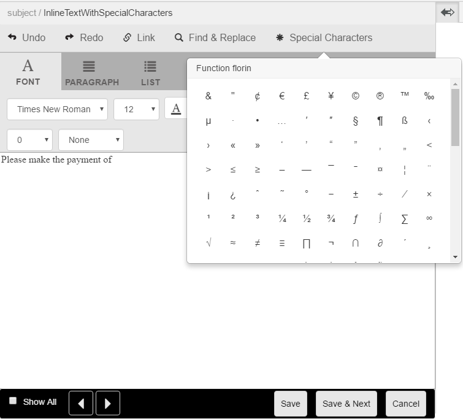

# 通信管理中的定製特徵{#custom-special-characters-in-correspondence-management}

## 概觀 {#overview}

Oracle Tergement Management已內置預設支援210個特殊字元，您可以輕鬆插入這些字元。

例如，可插入以下特殊字元：

* 貨幣符號，如€、¥和英鎊
* 數學符號∑、√、∂和^
* 標點符號為&quot;和&quot;

可以在字母中插入特殊字元：

* 在 [文本編輯器](/help/forms/using/document-fragments.md#createtext)
* 在 [可編輯的內聯模組](../../forms/using/create-correspondence.md#managecontent)

管理員可以通過自定義添加對更多/自定義特殊字元的支援。 本文提供了有關如何添加對附加自定義特殊字元的支援的說明。

## 添加或修改對通信管理中自定義特殊字元的支援 {#creatingfolderstructure}

使用以下步驟添加對自定義特殊字元的支援：

1. 轉到 `https://'[server]:[port]'/[ContextPath]/crx/de` 並以管理員身份登錄。
1. 在應用資料夾中，建立名為 **[!UICONTROL 特殊字元]** 路徑/結構類似於specialcharacters資料夾（位於libs下的textEditorConfig資料夾中）:

   1. 按一下右鍵 **特殊字元** 資料夾，然後選擇 **覆蓋節點**:

      `/libs/fd/cm/ma/gui/configuration/textEditorConfig/specialcharacters`

   1. 確保「覆蓋節點」對話框具有以下值：

      **路徑：** /libs/fd/cm/ma/gui/configuration/textEditorConfig/specialcharacts

      **覆蓋位置：** /apps/

      **匹配節點類型：** 已選中

      >[!NOTE]
      >
      >不要在/libs分支中進行更改。 您所做的任何更改都可能丟失，因為在以下情況下，此分支可能會發生更改：
      >
      >
      >
      >    * 在實例上升級
      >    * 應用熱修復
      >    * 安裝功能包

   1. 按一下 **確定** 然後按一下 **全部保存**。 指定字元資料夾是在指定路徑中建立的。

      建立覆蓋後，驗證節點結構標籤。 使用覆蓋在/apps中建立的每個節點應具有與該節點在/libs中定義的類和屬性。 如果/apps位置下的節點結構中缺少任何屬性或標籤，請將其標籤與/lib中的相應節點同步。

1. 確保 **[!UICONTROL textEditorConfig]** 節點具有以下屬性和值：

   | 名稱 | 類型 | 值 |
   |---|---|---|
   | cmConfigurationType | 字串 | cmTextEditor配置 |
   | css路徑 | 字串 | /libs/fd/cm/ma/gui/components/admin/createasset/textcontrol/clientlibs/textcontrol |

1. 按一下右鍵 **[!UICONTROL 特殊字元]** 資料夾，然後選擇 **建立>子節點** 然後按一下 **全部保存**:

   /apps/fd/cm/ma/gui/configuration/textEditorConfig/specialcharacts/&lt;yourchildnode>

1. 刷新「文本編輯器」\「建立對應UI」頁。 您添加的節點是UI中特殊字元清單中的最後一個節點。
1. 按一下 **全部保存**。
1. 根據需要更改特殊字元：

<table>
 <tbody>
  <tr>
   <td><strong>至...</strong></td>
   <td><strong>完成以下步驟</strong></td>
  </tr>
  <tr>
   <td>添加自定義特殊字元</td>
   <td>
    <ol>
     <li>在「/apps/fd/cm/ma/gui/configuration/textEditorConfig/specialcharacts」下添加子節點，其中包含必需屬性。</li>
     <li>按一下「全部保存」</li>
     <li>刷新文本編輯器\建立對應UI以查看更改。</li>
    </ol> </td>
  </tr>
  <tr>
   <td>更新現有特殊字元的屬性</td>
   <td>
    <ol>
     <li>按上述說明覆蓋要更新的節點，並驗證標籤和類。</li>
     <li>更改任何值，如caption、value、endValue和multipleCaption。 </li>
     <li>按一下「全部保存」。 </li>
     <li>刷新文本編輯器\建立對應UI以查看更改。</li>
    </ol> </td>
  </tr>
  <tr>
   <td>隱藏特殊字元</td>
   <td>
    <ol>
     <li>將要隱藏的節點覆蓋在"/apps/fd/cm/ma/gui/configuration/textEditorConfig/specialcharactes"下</li>
     <li>將sling:hideResource（布爾）屬性添加到要隱藏的節點（應用下）。 </li>
     <li>按一下「全部保存」。 </li>
     <li>刷新文本編輯器\建立對應UI以查看更改。  </li>
    </ol> </td>
  </tr>
  <tr>
   <td>隱藏多個特殊字元</td>
   <td>
    <ol>
     <li>將屬性"sling:hideChildren（String或String[]）"添加到"/apps/fd/cm/ma/gui/configuration/textEditorConfig/specialcharts"。 </li>
     <li>將節點名稱（要隱藏的特殊字元）添加為"sling:hideChildren"屬性的值。 </li>
     <li>按一下「全部保存」。 </li>
     <li>刷新文本編輯器\建立對應UI以查看更改。  </li>
    </ol> </td>
  </tr>
  <tr>
   <td>訂購特殊字元</td>
   <td>
    <ol>
     <li>在「/apps/fd/cm/ma/gui/configuration/textEditorConfig/specialcharacts」下添加子節點，其中包含必需屬性。 </li>
     <li>將"sling:orderBefore(String)"屬性添加到新建立的子節點。 </li>
     <li>將節點名稱添加為值，新添加的特殊字元將在此值之前顯示。 </li>
     <li>按一下「全部保存」。 </li>
     <li>刷新文本編輯器\建立對應UI以查看更改。  </li>
    </ol> </td>
  </tr>
 </tbody>
</table>
