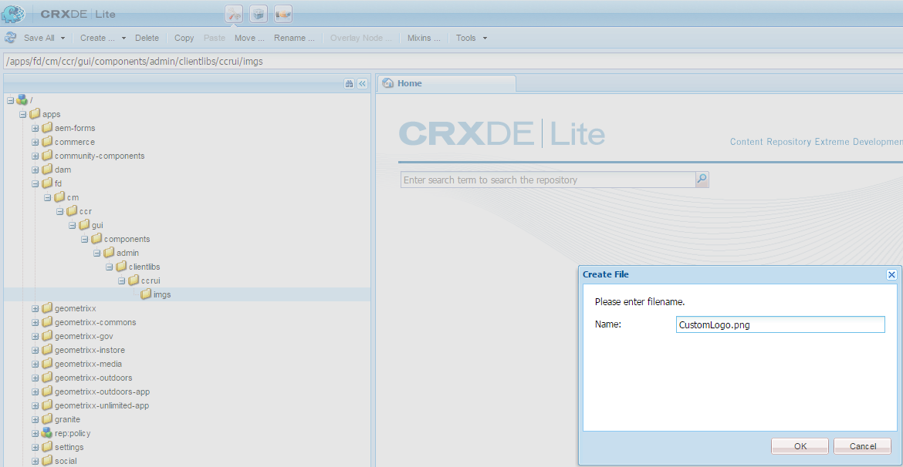

# 自訂建立對應UI{#customize-create-correspondence-ui}

## 概覽 {#overview}

Commense Management可讓您重新品牌化其解決方案範本，以提升品牌價值，並符合貴組織的品牌標準。 重新品牌化使用者介面包括變更組織標誌，此標誌會顯示在「建立對應UI」的左上角。

您可以在「建立對應UI」中，以組織的標誌變更標誌。


「建立對應」UI中的自訂圖示

### 在「建立對應UI」中變更標誌 {#changing-the-logo-in-the-create-correspondence-ui}

若要設定您選擇的標誌影像，請執行下列動作：

1. 在CRX中建立適 [當的資料夾結構](#creatingfolderstructure)。
1. [在您在CRX中建立的檔案夾中](#uploadlogo) ，上傳新的標誌檔案。

1. [在CRX上設定CSS](#createcss) ，以參考新的標誌。
1. 清除瀏覽器歷史記錄並 [重新整理建立對應UI](#refreshccrui)。

## 建立所需的資料夾結構 {#creatingfolderstructure}

建立檔案夾結構，如下所述，以代管自訂標誌影像和樣式表。 包含根資料夾/apps的新資料夾結構與/libs資料夾的結構類似。

對於任何自訂，請在/apps分支中建立平行資料夾結構，如下所述。

/apps分支（資料夾結構）:

* 確保檔案在系統更新時安全無虞。 若是升級、功能套件或Hot Fix，則會更新/libs分支，如果您在/libs分支中代管變更，則會覆寫這些變更。
* 幫助您不干擾當前系統／分支，如果您使用預設位置來儲存自定義檔案，則可能會出錯地取消分支。
* 當AEM搜尋資源時，可協助您的資源獲得更高的優先順序。 AEM已設定為先搜尋/apps分支，再搜尋/libs分支以尋找資源。 此機制表示系統會使用您的覆蓋（以及此處定義的自訂）。

使用下列步驟在/apps分支中建立所需的資料夾結構：

1. 前往並 `https://[server]:[port]/[ContextPath]/crx/de` 以管理員身分登入。
1. 在應用程式檔案夾中，建立名 `css` 為路徑／結構的檔案夾，類似於css檔案夾（位於ccrui檔案夾）。

   建立css資料夾的步驟：

   1. 以滑鼠右鍵按一 **下下列路徑** ，然後選取「覆 **蓋節點」**: `/libs/fd/cm/ccr/gui/components/admin/clientlibs/ccrui/css`

      

   1. 請確定「覆蓋節點」對話框具有下列值：

      **** 路徑：/libs/fd/cm/ccr/gui/components/admin/clientlibs/ccrui/css

      **** 覆蓋位置：/apps/

      **** 匹配節點類型：已勾選

      

      >[!NOTE]
      >
      >請勿在/libs分支中進行更改。 您所做的任何變更都可能會遺失，因為此分支在您執行下列動作時都會面臨變更：
      >
      >    
      >    
      >    * 在您的實例上升級
      >    * 套用Hot Fix
      >    * 安裝功能套件


   1. 按一下 **確定**。 css資料夾是在指定的路徑中建立。


1. 在應用程式檔案夾中，建立名 `imgs` 為路徑／結構的檔案夾，類似於imgs檔案夾（位於ccrui檔案夾）。

   1. 以滑鼠右鍵按一 **下** ，在下列路徑上的imgs資料夾，然後選取「 **覆蓋節點」**: `/libs/fd/cm/ccr/gui/components/admin/clientlibs/ccrui/imgs`
   1. 請確定「覆蓋節點」對話框具有下列值：

      **** 路徑：/libs/fd/cm/ccr/gui/components/admin/clientlibs/ccrui/imgs

      **** 覆蓋位置：/apps/

      **** 匹配節點類型：已勾選

   1. 按一下 **確定**。

      >[!NOTE]
      >
      >您也可以手動在/apps檔案夾中建立檔案夾結構。

1. 按一 **下「全部儲存** 」，將變更儲存在伺服器上。

## 將新標誌上傳至CRX {#uploadlogo}

將您的自訂標誌檔案上傳至CRX。 標準HTML規則會控制標誌的轉換。 支援的影像檔案格式會根據您用來存取AEM Forms的瀏覽器而定。 所有瀏覽器都支援JPEG、GIF和PNG。 如需詳細資訊，請參閱支援影像格式的瀏覽器專用檔案。

* 標誌影像的預設尺寸為48 px * 48 px。 請確定您的影像大小類似此大小或大於48像素* 48像素。
* 如果標誌影像的高度超過50像素，「建立對應」使用者介面會將影像縮小至50像素的最高高度，因為這是標題的高度。 在縮小影像時，「建立對應」使用者介面會維持影像的外觀比例。
* 「建立對應使用者介面」如果影像較小，則不會放大影像，因此請確定您使用的標誌影像高度至少為48像素，而且寬度足夠清楚。

使用下列步驟將自訂標誌檔案上傳至CRX:

1. 前往 `https://[server]:[port]/[contextpath]/crx/de`. 如有必要，請以管理員身份登錄。
1. 在CRXDE中，按一下右鍵以下路 **徑的** imgs資料夾，然後選擇「 **建立」>「建立檔案」**:

   `/apps/fd/cm/ccr/gui/components/admin/clientlibs/ccrui/imgs/`

   

1. 在「建立檔案」對話方塊中，輸入檔案名稱為CustomLogo.png（或標誌檔案的名稱）。

   

1. 按一下「 **全部儲存**」。

   在您建立的新檔案（此處為CustomLogo.png）下方，會顯示jcr:content屬性。

1. 在檔案夾結構中按一下jcr:content。

   jcr:content的屬性隨即出現。

   

1. 連按兩下 **jcr:data屬性** 。

   將出現「編輯jcr:data」對話框。

   現在按一下newlogo.png檔案夾，按兩下jcr:content（dim選項）並設定type nt:resource。 如果不存在，請建立名稱為jcr:content的屬性。

1. 在「編輯jcr:data」對話方塊中，按一下「 **瀏覽** 」，然後選取您要當做標誌使用的影像檔案（這裡為CustomLogo.png）。

   支援的影像檔案格式會根據您用來存取AEM Forms的瀏覽器而定。 所有瀏覽器都支援JPEG、GIF和PNG。 如需詳細資訊，請參閱支援影像格式的瀏覽器專用檔案。

   

   範例：CustomLogo.png將用作自訂標誌

1. 按一下「 **全部儲存**」。

## 建立CSS以整合標誌與UI {#createcss}

自訂標誌影像需要在內容內容中載入額外的樣式表。

使用下列步驟設定用於渲染徽標的樣式表：

1. 前往 `https://[server]:[port]/[contextpath]/crx/de`. 如有必要，請以管理員身份登錄。
1. 在下列位置建立名為customcss.css的檔案（您無法使用不同的檔案名稱）:

   `/apps/fd/cm/ccr/gui/components/admin/clientlibs/ccrui/css/`

   建立customcss.css檔案的步驟：

   1. 以滑鼠右鍵按一下 **css資料夾** ，然後選 **取「建立>建立檔案」**。
   1. 在「新增檔案」對話方塊中，將CSS的名稱指定 `customcss.css`為（您不能使用不同的檔案名稱），然後按一下「確 **定」**。
   1. 將下列程式碼新增至新建立的css檔案。 在程式碼中的content:url中，指定您已上傳至CRXDE中的imgs檔案夾的影像名稱。

      ```css
      .logo, .logo:after {
      content:url("../imgs/CustomLogo.png");
      }
      ```

   1. 按一下「 **全部儲存**」。

## 重新整理「建立對應UI」以檢視自訂標誌 {#refreshccrui}

清除瀏覽器快取，然後在瀏覽器中開啟「建立對應UI」例項。 您應該會看到自訂的標誌。


「建立對應」UI中的自訂圖示

