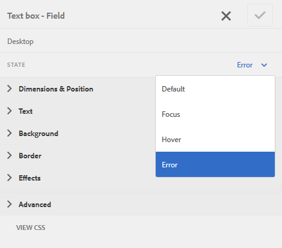

# 定制自適應形式的錯誤消息的佈局和定位{#customize-layout-and-positioning-of-error-messages-of-an-adaptive-form}

可以定制自適應表單的錯誤消息的佈局和定位。 您可以執行以下自定義：

* 自定義欄位標題的位置和佈局，而不對相應的CSS屬性進行任何更改
* 自定義內聯錯誤消息的位置
* 自定義動態幫助指示器的內容
* 自定義欄位元件（標題、構件、簡短說明、長說明和幫助指示器元件）的位置，而不對相應的CSS屬性進行任何更改

## 自定義欄位佈局 {#customize-layout-of-fields}

您可以自定義單個欄位或所有欄位的佈局，以更改標題和錯誤消息的位置。 執行以下步驟將自定義佈局應用於欄位：

### 自定義單個欄位的佈局 {#customize-layout-of-a-single-field}

執行以下步驟將自定義佈局應用於單個欄位：

1. 在中開啟窗體 **樣式** 的子菜單。 要在樣式模式下開啟窗體，請在頁面工具欄上按一下  > **樣式**。
1. 在邊欄中，在 **窗體對象**，選擇欄位，然後點擊「編輯」按鈕 。
1. 選擇要定製的欄位的狀態，並指定該狀態的樣式。

   

### 自定義窗體的所有欄位的佈局 {#customize-layout-of-all-the-fields-of-a-form}

使用AEM Forms，您現在可以建立主題並將其應用於窗體。 主題編輯器允許您在一個位置指定表單元件的樣式。 建立主題時，在元件級別指定樣式。 有關主題的詳細資訊，請參見 [AEM Forms主題](../../forms/using/themes.md)。

使用主題編輯器建立主題，以自定義窗體中所有欄位的佈局。 建立主題後，請執行以下步驟將其應用於表單：

1. 在編輯模式下開啟窗體。
1. 在編輯模式下，選擇一個元件，然後點擊  > **自適應窗體容器**，然後按一下 。
1. 在提要欄的「自適應表單主題」下，選擇使用主題編輯器建立的主題。

## 建立自定義欄位佈局 {#create-a-custom-field-layout}

1. 開啟CRXDE Lite。 預設URL為https://&#39;[伺服器]:[埠]「/crx/de」。
1. 將欄位佈局從/libs/fd/af/layouts/field節點（例如，defaultFieldLayout）複製到/apps節點（例如，/apps/af-field-layout）。
1. 更名複製的節點和defaultFieldLayout.jsp檔案。 例如，errorOnRight.jsp。

1. 更改複製節點的qtip和jcr:description屬性的值。 例如，將屬性的值更改為「Error On Right（右錯誤）」

1. 要添加新樣式和行為，請在/etc節點中建立一個客戶端庫。

   例如，在/etc/af-field-layout-clientlib位置，建立節點client-library。 添加帶有af.field.errorOnRight值的categories屬性和帶有以下代碼的style.less檔案：

   ```css
   .widgetErrorWrapper {
   
    height: 38px;
    margin: 5px;
   
    .guideFieldWidget{
    width: 60%;
    float: left; 
    }
   
    .guideFieldError{
    overflow:hidden;
    width:40%; 
    }
   
   }
   ```

1. 要增強外觀和行為，請包括在佈局檔案(errorOnRight.jsp)中建立的客戶端庫。
1. 開啟欄位的編輯對話框，選擇 **造型** 頁籤。 在 **配置欄位佈局** 下拉框，選擇新建立的佈局，然後按一下 **確定**。

ErrorOnRight.zip包包含用於在欄位右側顯示錯誤消息的代碼。

[取得檔案](assets/erroronright.zip)
