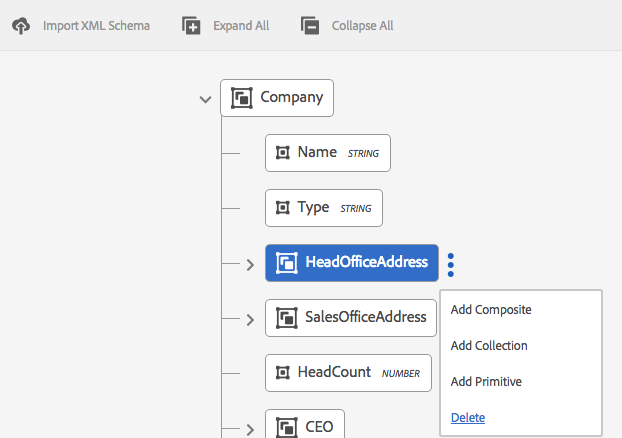

# 資料字典{#data-dictionary}

## 簡介 {#introduction}

資料字典可讓商務使用者使用後端資料來源的資訊，而不需了解其基礎資料模型的技術詳細資訊。 資料字典由資料字典元素(DDE)組成。 您可以使用這些資料元素將後端資料整合到信函中，作為輸入，以用於客戶通信。

資料字典是描述基礎資料結構及其相關屬性的中繼資料的獨立表示。 使用商業辭匯建立資料字典。 可對應至一或多個基礎資料模型。

資料字典由三種類型的元素組成：簡單、複合和集合元素。 簡單DDE是原始元素，如字串、數字、日期和布爾值，它們包含城市名稱等資訊。 複合DDE包含其他DDE，其類型可以是原始、複合或集合。 例如，地址，由街道地址、城市、省、國家和郵遞區號組成。 集合是類似的簡單或複合DDE的清單。 例如，具有多個地點或不同帳單和運送地址的客戶。

通信管理使用根據資料字典的結構儲存的後端、客戶或收件者特定資料，以建立針對不同客戶的通信。 例如，可以使用友好名稱建立文檔，如「親愛的{First Name}」、「Mr. {姓氏}&quot;.

通常，業務用戶不需要XSD（XML架構）和Java類等元資料表示的知識。 但是，通常需要存取這些資料結構和屬性才能建立解決方案。

### 資料字典工作流程 {#data-dictionary-workflow}

1. 作者 [建立資料字典](#createdatadictionary) 上傳結構或從頭開始。
1. 作者會根據資料字典建立信函和互動式通訊，並視需要將信函和互動式通訊中的資料字典元素建立關聯。
1. 作者可下載以資料字典結構為基礎的範例資料XML檔案。 作者可修改樣本資料XML檔案，該檔案可作為測試資料與資料字典相關聯。 信函預覽期間會使用相同的選項。
1. 同時 [預覽信函](../../forms/using/create-letter.md#p-types-of-linkage-available-for-each-of-the-fields-p)，作者會選擇使用資料預覽信函（自訂預覽）。 信函隨即開啟，預先填入作者提供的資料。 這會在建立通信介面中開啟。 正在預覽此信函的代理可以修改此信函中的內容、資料和附件，並可以提交最終信函。 如需建立信函的詳細資訊，請參閱 [建立通信](../../forms/using/create-letter.md).

## 必備條件 {#prerequisite}

安裝 [相容性套件](compatibility-package.md) 若要檢視 **資料字典** 選項 **Forms** 頁面。

## 建立資料字典 {#createdatadictionary}

您可以使用資料字典編輯器來建立資料字典，或可以上傳XSD架構檔案來據此建立資料字典。 然後，您可以新增更多必要資訊（包括欄位）來擴充資料字典。 無論資料字典的建立方式如何，業務流程所有者都不需要對後端系統的知識。 業務流程所有者只需要對其流程的域對象及其定義的了解。

>[!NOTE]
>
>若是需要類似元素的多個字母，您可以建立通用資料字典。 但是，含有大量元素的大資料字典在使用資料字典和載入元素（例如字母和檔案片段）時，可能會導致效能問題。 如果您遇到效能問題，請嘗試為不同的字母建立個別的資料字典。

1. 選擇 **Forms** > **資料字典**.
1. 點選 **建立資料字典**.
1. 在「屬性」畫面中，新增下列項目：

   * **標題：** （選用）輸入資料字典的標題。 標題不一定唯一，可以有特殊字元和非英文字元。 信函和其他檔案片段會以其標題（若有）參照，例如縮圖和資產屬性中。 資料字典的名稱為參考，而非標題。
   * **名稱：** 資料字典的唯一名稱。 在「名稱」欄位中，您只能輸入英文字元、數字和連字型大小。 系統會根據「標題」欄位自動填入「名稱」欄位，在「標題」欄位中輸入的特殊字元、空格、數字和非英文字元將替換為連字型大小。 雖然「標題」欄位中的值會自動複製到「名稱」，但您可以編輯值。

   * **說明**:（選用）資料字典的說明。
   * **標籤：** （可選）要建立自定義標籤，請在文本欄位中輸入值，然後按Enter。 您可以在標籤的文字欄位下看到您的標籤。 儲存此文字時，也會建立新新增的標籤。
   * **擴展屬性**:（可選）點選 **新增欄位** 指定資料字典的中繼資料屬性。 在「屬性名稱」欄中，輸入唯一的屬性名稱。 在「值」列中，輸入要與屬性關聯的值。

   

1. （可選）若要上傳資料字典的XSD架構定義，請在「資料字典結構」窗格下，點選 **上傳XML結構**. 瀏覽至XSD檔案，選取它，然後點選 **開啟**. 會根據上傳的XML架構建立資料字典。 您需要調整資料字典中元素的顯示名稱和說明。 要執行此操作，請點選元素名稱，然後在右窗格的欄位中編輯其說明、顯示名稱和其他詳細資訊。

   有關計算DD元素的詳細資訊，請參見 [計算資料字典元素](#computedddelements).

   >[!NOTE]
   >
   >您可以略過上傳結構檔案，並使用使用者介面從草稿開始建立資料字典。 要執行此操作，請略過此步驟，然後繼續後續步驟。

1. 點選 **下一個**.
1. 在新增屬性畫面中，將元素新增至資料字典。 如果您已上傳結構以取得資料字典的基本結構，也可以新增/刪除元素及編輯其詳細資訊。

   您可以點選元素右側的三個點，然後新增元素至資料字典結構。

   

   選擇「複合元素」、「集合元素」或「基元元素」。

   * 複合DDE包含其他DDE，其類型可以是原始、複合或集合。 例如，地址，由街道地址、城市、省、國家和郵遞區號組成。
   * 基元DDE是字串、數字、日期和布爾值等元素，它們包含城市名稱等資訊。
   * 集合是類似的簡單或複合DDE的清單。 例如，具有多個地點或不同帳單和運送地址的客戶。

   以下是建立資料字典的一些規則：

   * 在資料字典中，僅允許複合類型作為頂層DDE。
   * 名稱、參考名稱和元素類型是資料字典和DDE的必填欄位。
   * 引用名稱必須是唯一的。
   * 父DDE（複合）不能有兩個同名的子項。
   * 列舉僅包含基元字串類型。

   有關複合、集合和基元元素以及使用資料字典元素的詳細資訊，請參閱 [將資料字典元素對應至XML架構](#mappingddetoschema).

   如需資料字典中驗證的詳細資訊，請參閱 [資料字典編輯器驗證](#ddvalidations).

   

1. （選用）選取元素後，您可以在進階索引標籤中新增屬性（屬性）。 您也可以點選 **新增欄位** 並擴展DD元素的屬性。

   

1. （選用）您可以點選元素右側的三個點並選取，以移除任何元素 **刪除**.

   

   >[!NOTE]
   >
   >刪除包含子節點的複合/集合元素也會刪除其子節點。

1. （可選）在「資料字典結構」窗格和「欄位」和「變數清單」面板中選取元素。 變更或新增與元素相關聯的任何必要屬性。
1. 點選 **儲存**.

### 建立一或多個資料字典的復本 {#create-copies-of-one-or-more-data-dictionary}

若要快速建立一或多個資料字典，其屬性和元素類似於現有資料字典，您可以複製並貼上它們。

1. 從資料字典清單中，選取適當的資料字典。 UI會顯示「複製」圖示。
1. 點選「 複製」。UI會顯示「貼上」圖示。
1. 點選「貼上」。 將出現「貼上」對話框。 系統會自動為新資料字典指派名稱和標題。
1. 如有需要，請編輯您要用來儲存資料字典副本的標題和名稱。
1. 點選「貼上」。 資料字典的副本隨即建立。 現在，您可以在新建立的資料字典中進行必要的變更。

## 請參閱參考資料字典元素的檔案片段或檔案 {#see-the-document-fragments-or-documents-that-refer-to-a-data-dictionary-element}

在編輯或檢視資料字典時，您可以查看資料字典中參考了哪些元素，其中包含文字、條件、字母和互動式通訊。

1. 執行下列其中一項操作以編輯資料字典：

   * 將滑鼠指標暫留在資料字典上，然後點選「編輯」。
   * 選取資料字典，然後點選標題中的「編輯」。
   * 暫留在資料字典上，然後點選「選取」。 然後點選標題中的「編輯」。

   或點選資料字典以檢視。

1. 在資料字典中，點選簡單元素以選取它。 複合元素和集合元素沒有參照。

   除了元素的「基本」和「進階」屬性外，還會顯示「借出內容」。

1. 點選「借出內容」。

   「借出內容」(Lent Content)頁簽隨以下內容一起顯示：文字、條件、信函和互動式通訊。 這些標題也會顯示所選元素的參照數量。

1. 點選標題可查看參照元素的資產名稱。

   

1. 若要檢視其他元素的借出內容，請點選元素。
1. 若要顯示參照元素的資產，請點選其名稱。 瀏覽器會顯示資產、信函或互動式通訊。

## 使用測試資料 {#working-with-test-data}

1. 在「資料字典」頁面上，點選 **選擇**.
1. 點選您要下載測試資料的資料字典，然後點選 **下載範例XML資料**.
1. 點選 **確定** 在警報訊息中。 下載XML檔案。
1. 使用記事本或其他XML編輯器開啟XML檔案。 XML檔案的結構與元素中的資料字典和佔位符字串相同。 將預留位置字串替換為要用測試字母的資料。

   ```xml
   <?xml version="1.0" encoding="UTF-8" standalone="no"?>
   <Company>
   <Name>string</Name>
   <Type>string</Type>
   <HeadOfficeAddress>
   <Street>string</Street>
   <City>string</City>
   <State>string</State>
   <Zip>string</Zip>
   </HeadOfficeAddress>
   <SalesOfficeAddress>
   <Street>string</Street>
   <City>string</City>
   <State>string</State>
   <Zip>string</Zip>
   </SalesOfficeAddress>
   <HeadCount>1.0</HeadCount>
   <CEO>
   <PersonName>
   <FirstName>string</FirstName>
   <MiddleName>string</MiddleName>
   <LastName>string</LastName>
   </PersonName>
   <DOB>string</DOB>
   <CurrAddress>
   <Street>string</Street>
   <City>string</City>
   <State>string</State>
   <Zip>string</Zip>
   </CurrAddress>
   <DOJ>14-04-1973</DOJ>
   <Phone>1.0</Phone>
   </CEO>
   </Company>
   ```

   >[!NOTE]
   >
   >在此範例中，XML為集合元素建立三個值的空間，但可根據需求增加/減少值的數量。

1. 在輸入資料後，當您使用測試資料預覽信函時，可以使用此XML檔案。

   您可以使用DD（選擇DD並點選「上載測試資料」並上載此xml檔案）添加此測試資料。因此，在此之後，當您正常預覽信函時（不是自定義），此XML資料將用於信函中。 您也可以點選「自訂」，然後上傳此XML。

## 範例 {#samples}

下列程式碼範例顯示資料字典的實作詳細資料。

### 可上傳至資料字典的範例結構 {#sample-schema-that-can-be-uploaded-to-the-data-dictionary}

```xml
<?xml version="1.0" encoding="utf-8"?>
<xs:schema xmlns="DCT" targetNamespace="DCT" xmlns:xs="https://www.w3.org/2001/XMLSchema"
  elementFormDefault="qualified" attributeFormDefault="unqualified">
  <xs:element name="Company">
    <xs:complexType>
      <xs:sequence>
        <xs:element name="Name" type="xs:string"/>
        <xs:element name="Type" type="xs:anySimpleType"/>
        <xs:element name="HeadOfficeAddress" type="Address"/>
        <xs:element name="SalesOfficeAddress" type="Address" minOccurs="0"/>
        <xs:element name="HeadCount" type="xs:integer"/>
        <xs:element name="CEO" type="Employee"/>
        <xs:element name="Workers" type="Employee" maxOccurs="unbounded"/>
      </xs:sequence>
    </xs:complexType>
  </xs:element>
  <xs:complexType name="Employee">
    <xs:complexContent>
      <xs:extension  base="Person">
        <xs:sequence>
          <xs:element name="CurrAddress" type="Address"/>
          <xs:element name="DOJ" type="xs:date"/>
          <xs:element name="Phone" type="xs:integer"/>
        </xs:sequence>
      </xs:extension>
    </xs:complexContent>
  </xs:complexType>
  <xs:complexType name="Person">
    <xs:sequence>
      <xs:element name="PersonName" type="Name"/>
      <xs:element name="DOB" type="xs:dateTime"/>
    </xs:sequence>
  </xs:complexType>
  <xs:complexType name="Name">
    <xs:sequence>
      <xs:element name="FirstName" type="xs:string"/>
      <xs:element name="MiddleName" type="xs:string"/>
      <xs:element name="LastName" type="xs:string"/>
    </xs:sequence>
  </xs:complexType>
  <xs:complexType name="Address">
    <xs:sequence>
      <xs:element name="Street" type="xs:string"/>
      <xs:element name="City" type="xs:string"/>
      <xs:element name="State" type="xs:string"/>
      <xs:element name="Zip" type="xs:string"/>
    </xs:sequence>
  </xs:complexType>
</xs:schema>
```

## 與DDE關聯的公用屬性 {#common-attributes-associated-with-a-dde}

下表詳細說明了與DDE關聯的通用屬性：

<table>
 <tbody>
  <tr>
   <td><strong>屬性</strong></td>
   <td><strong>類型</strong></td>
   <td><strong>說明</strong></td>
  </tr>
  <tr>
   <td>名稱</td>
   <td>字串</td>
   <td>必要.<br /> DDE的名稱。 它必須是唯一的。</td>
  </tr>
  <tr>
   <td>參考<br /> 名稱</td>
   <td>字串</td>
   <td>必要. DDE的唯一引用名稱，允許引用DDE，而這些引用與資料字典的層次結構或結構的更改無關。 文字模組已使用此名稱進行映射</td>
  </tr>
  <tr>
   <td>displayname</td>
   <td>字串</td>
   <td>DDE的可選用戶友好名稱。</td>
  </tr>
  <tr>
   <td>說明</td>
   <td>字串</td>
   <td>DDE的說明。</td>
  </tr>
  <tr>
   <td>elementType</td>
   <td>字串</td>
   <td>必要. DDE的類型：字串，數字，日期，布林值，複合，集合。</td>
  </tr>
  <tr>
   <td>elementSubType</td>
   <td>字串</td>
   <td>DDE的子類型：列舉。 僅允許用於STRING和NUMBER elementType。</td>
  </tr>
  <tr>
   <td>關鍵</td>
   <td>布林值</td>
   <td>指示DDE是否為關鍵元素的布林欄位。</td>
  </tr>
  <tr>
   <td>運算結果</td>
   <td>布林值</td>
   <td>一個布爾欄位，用於指示是否計算DDE。 計算的DDE值是其他DDE值的函式。 預設情況下，支援jsp表達式。</td>
  </tr>
  <tr>
   <td>運算式</td>
   <td>字串</td>
   <td>「已計算」DDE的表達式。 預設提供的表達式評估服務支援JSP EL表達式。 您可以將運算式服務取代為自訂實作。</td>
  </tr>
  <tr>
   <td>valueSet</td>
   <td>清單</td>
   <td>枚舉類型DDE的允許值集。 例如，帳戶類型只能有（儲存、目前）值。</td>
  </tr>
  <tr>
   <td>extendedProperties</td>
   <td>物件</td>
   <td>添加到DDE的自定義屬性的映射（用戶介面特定或任何其他資訊）。</td>
  </tr>
  <tr>
   <td>必要</td>
   <td>布林值</td>
   <td>此標幟表示與資料字典對應的例項資料來源必須包含此特定DDE的值。</td>
  </tr>
  <tr>
   <td>繫結</td>
   <td>BindingElement</td>
   <td>元素的XML或Java綁定。</td>
  </tr>
 </tbody>
</table>

### 計算資料字典元素 {#computedddelements}

資料字典也可包含計算元素。 計算資料字典元素一律與運算式相關聯。 會評估此運算式，以在執行階段取得資料字典元素的值。 計算的DDE值是其他DDE值或文本的函式。 預設情況下支援JSP表達式語言(EL)表達式。 EL運算式使用${ }字元，有效運算式可包含文字、運算子、變數（資料字典元素參考）和函式呼叫。 在運算式中參考資料字典元素時，會使用DDE的參考名稱。 資料字典內每個資料字典元素的參考名稱都是唯一的。

計算的DDE PersonFullName可以與EL串連表達式相關聯，如${PersonFirstName} ${PersonLastName}。

## XSD和資料字典之間的資料類型對應 {#data-type-mapping-between-xsd-and-data-dictionary-br}

匯出XSD需要特定資料對應，如下表所述。 DDI列指示DDE值的類型，如DDI中可用。

<table>
 <tbody>
  <tr>
   <td>XSD <br /> </td>
   <td><p>資料字典 <br /> </p> </td>
   <td>DDI（實例值資料類型）<br /> </p> </td>
  </tr>
  <tr>
   <td><p>xs：類型的元素 — 複合類型<br /> </p> </td>
   <td>DDE類型 — 複合<br /> </p> </td>
   <td>java.util.Map<br /> </td>
  </tr>
  <tr>
   <td><p>xs:maxOccurs &gt; 1的元素<br /> </p> </td>
   <td>DDE類型 — 集合 — <br /> DDE節點建立在COLLECTION DDE旁邊，該DDE節點從父COLLECTION節點捕獲資訊。 會為簡單/複合資料類型的集合建立相同的集合。 每當您有複合類型的COLLECTION時，資料字典樹將捕獲為捕獲類型資訊而建立的DDE的子項中的組成欄位。<br /> - DDE（集合）<br /> - DDE（類型資訊的複合）<br /> - DDE（字串）欄位1<br /> - DDE（字串）欄位2<br /> <br /> </p> </td>
   <td>java.util.List<br /> </td>
  </tr>
  <tr>
   <td>類型的屬性 — xs:id <br /> </p> </td>
   <td>類型的DDE — 字串 <br /> </td>
   <td>java.lang.String<br /> </td>
  </tr>
  <tr>
   <td>xs:attribute /xs:element類型 — xs:string</p> </td>
   <td>類型的DDE — 字串<br /> </td>
   <td>java.lang.String<br /> </td>
  </tr>
  <tr>
   <td>xs:attribute /xs:element類型 — xs:布林值 <br /> </td>
   <td>類型的DDE — 布林值 <br /> </td>
   <td>java.lang.Boolean<br /> </td>
  </tr>
  <tr>
   <td>xs:attribute /xs:element類型 — xs:date </td>
   <td>DDE類型 — 日期 </td>
   <td>java.lang.String</td>
  </tr>
  <tr>
   <td>xs:attribute /xs:element類型 — xs:integer </td>
   <td>DDE類型 — 數字 </td>
   <td>java.lang.Double</td>
  </tr>
  <tr>
   <td>xs:attribute /xs:element類型 — xs:long</td>
   <td>DDE類型 — 數字 </td>
   <td>java.lang.Double</td>
  </tr>
  <tr>
   <td>xs:attribute /xs:element類型 — xs:double</td>
   <td>DDE類型 — 數字 </td>
   <td>java.lang.Double</td>
  </tr>
  <tr>
   <td>列舉類型的元素和baseType - xs:string</td>
   <td>DDE<br /> 類型 — 字串<br /> 子類型 — 枚舉<br /> valueSet - ENUM允許的值<br /> </td>
   <td>java.lang.String</td>
  </tr>
 </tbody>
</table>

## 從資料字典下載範例資料檔案 {#download-a-sample-data-file-from-a-data-dictionary}

建立資料字典後，您就可以將其下載為XML範例資料檔案，以便在其中輸入文字。

1. 在「資料字典」頁面中，點選 **選擇** 然後點選資料字典以選取。
1. 選擇 **下載範例XML資料**.
1. 點選 **確定** 在警報訊息中。

   通信管理會根據所選資料字典的結構建立XML檔案，並以名稱下載到您的電腦 &lt;data-dictionary-name>-SampleData。 現在，您可以在XML或文字編輯器中編輯此檔案，以在 [建立信函](../../forms/using/create-letter.md).

## 元資料的國際化 {#internationalization-of-meta-data}

如果您想要以不同語言傳送相同的信函給客戶，您可以將資料字典和資料字典元素的顯示名稱、說明和列舉值集當地化。

### 本地化資料字典 {#localize-data-dictionary}

1. 在「資料字典」頁面上，點選 **選擇** 然後點選資料字典以選取。
1. 點選 **下載本地化資料**.
1. 點選 **確定** 在警報中。 通信管理會將郵遞區號檔案下載至您的電腦，名稱為DataDictionary-&lt;ddname>.zip。
1. Zip檔案包含.properties檔案。 此檔案會定義下載的資料字典。 屬性檔案的內容類似下列：

   ```ini
   #Wed May 20 16:06:23 BST 2015
   DataDictionary.EmployeeDD.description=
   DataDictionary.EmployeeDD.displayName=EmployeeDataDictionary
   DataDictionaryElement.name.description=
   DataDictionaryElement.name.displayName=name
   DataDictionaryElement.person.description=
   DataDictionaryElement.person.displayName=person
   ```

   屬性檔案的結構定義每行的說明以及資料字典和資料字典中每個資料字典元素的顯示名稱。 此外，屬性檔案定義每個資料字典元素的列舉值集的一行。 與資料字典一樣，對應的屬性檔案可以有多個資料字典元素定義。 此外，檔案可包含一或多個列舉值集的定義。

1. 要更新不同地區中的.properties檔案，請更新檔案中的顯示名稱和說明值。 針對您要本地化的每種語言，建立更多檔案例項。 僅支援法文、德文、日文和英文語言。

1. 以下列名稱保存不同的更新屬性檔案：

   _fr_FR.properties法文

   _de_DE.properties德文

   _ja_JA.properties日文

   _en_EN.properties英語

1. 將.properties檔案（或多個地區設定的檔案）封存至單一.zip檔案。

1. 在「資料字典」頁中，選擇 **更多** > **上傳本地化資料** 並選取包含本地化屬性檔案的zip檔案。
1. 若要檢視本地化變更，請變更瀏覽器地區設定。

## 資料字典驗證 {#ddvalidations}

建立或更新資料字典時，資料字典編輯器會強制執行下列驗證。

* 在資料字典中，僅允許使用複合類型作為頂層元素。
* 不允許在葉級別使用複合元素和集合元素。 葉級僅允許基元（字串、日期、數字、布林）元素。 此驗證可確保沒有子DDE的複合元素和集合元素。
* 上傳XSD檔案以建立資料字典時，資料字典編輯器會提示輸入最上層元素（如果有多個元素）以建立資料字典。
* 名稱是資料字典唯一必要的參數。
* 父DDE（複合）不能有兩個同名的子代
* 確保只在DDE不是必需參數時才標籤為計算。 無法計算所需元素，也不能需要計算元素。 此外，「集合」和「複合元素」不能是計算元素。
* 確保僅在未計算DDE時，才標籤為必需DDE。 它也可確保它不是表示「系列」類型的「collectionElement」（這是系列元素的唯一子項）。
* 資料字典或DDE的extendedProperties中不允許使用空鍵或重複鍵。
* 請勿在延伸屬性的索引鍵或值內使用冒號(:)或垂直條(|)字元。 這些禁止字元的使用沒有任何驗證。

在資料字典層級套用的驗證

* 資料字典名稱不得為null。
* 資料字典名稱只能包含英數字元。
* 資料字典中的子元素清單不得為空或空。
* 資料字典不得包含超過一個頂層資料字典元素。
* 在「資料字典」中，僅允許使用複合類型作為頂層元素。

在資料字典元素層級套用的驗證。

* 所有DDE名稱不得為Null且不得包含空格。
* 所有DDE都必須具有「非空值/非空值」元素類型。
* 所有DDE引用名稱不得為Null。
* 所有DDE引用名稱必須是唯一的。
* 所有DDE引用只能包含英數字元和「_」。
* 所有DDE顯示名稱只能包含英數字元和「_」。
* 不允許在葉級別使用複合元素和集合元素。 葉級僅允許基元（字串、日期、數字、布林）元素。 此驗證可確保沒有子DDE的複合元素和集合元素。
* 複合父DDE不得有兩個同名的子元素。
* ENUM子類型僅用於字串和數字元素。
* 無法計算集合和複合元素。
* DDE不能同時計算和必需。
* 計算的DDE必須包含有效的表達式。
* 計算的DDE不能具有XML綁定。
* 表示集合DDE類型的DDE不能計算或必需。
* 子類型ENUM的DDE不能包含空值集或空值集。
* 集合DDE的XML綁定不能映射到屬性。
* XML綁定語法必須有效，例如，只出現一個@，只有在後面跟有屬性名稱時才允許@。

## 將資料字典元素對應至XML架構 {#mappingddetoschema}

您可以從XML架構建立資料字典，或使用資料字典使用者介面建立資料字典。 資料字典中的所有資料字典元素(DDE)都有「XML綁定」欄位，以儲存DDE與XML架構中元素的綁定。 每個DDE中的綁定相對於父DDE。

下列詳細說明範例模型和程式碼範例，顯示資料字典的實作詳細資料。

## 映射簡單（基元）元素 {#mapping-simple-primitive-elements}

基元DDE表示在本質上是原子的欄位或屬性。 在複雜類型（複合DDE）或重複元素（集合DDE）範圍之外定義的基元DDE可以儲存在XML架構內的任何位置。 與基元DDE對應的資料的位置不依賴於其父DDE的映射。 基元DDE使用XML綁定欄位中的映射資訊來確定其值，並且映射轉換為以下內容之一：

* 屬性
* 元素
* 文字內容
* 無（忽略的DDE）

下列範例顯示簡單結構。

```xml
<?xml version="1.0" encoding="UTF-8"?>
<xs:schema xmlns:xs="https://www.w3.org/2001/XMLSchema">
  <xs:element name='age' type='integer'/>
  <xs:element name='price' type='decimal'/>
</xs:schema>
```

| **資料字典元素** | **預設XML綁定** |
|---|---|
| 年齡 | /年齡 |
| 價格 | /價格 |

### 映射複合元素 {#mapping-composite-elements}

組合元素不支援綁定，如果提供綁定，則會忽略它。 所有原始類型的組成子DDE的綁定必須是絕對的。 允許對複合DDE的子元素進行絕對映射在XPath綁定方面提供了更大的靈活性。 將複合DDE映射到XML架構中的複雜類型元素，將限制其子元素的綁定範圍。

以下範例顯示附註的結構。

```xml
<xs:element name="note">
    <xs:complexType>
        <xs:sequence>
            <xs:element name="to" type="xs:string"/>
            <xs:element name="from" type="xs:string"/>
            <xs:element name="heading" type="xs:string"/>
            <xs:element name="body" type="xs:string"/>
        </xs:sequence>
    </xs:complexType>
</xs:element>
```

<table>
 <tbody>
  <tr>
   <td><strong>資料字典元素</strong></td>
   <td><strong>預設XML綁定</strong></td>
  </tr>
  <tr>
   <td>附註</td>
   <td>empty(null)<br /> </td>
  </tr>
  <tr>
   <td>至</td>
   <td>/note/to</td>
  </tr>
  <tr>
   <td>從</td>
   <td>/note/from</td>
  </tr>
  <tr>
   <td>標題</td>
   <td>/note/heading</td>
  </tr>
  <tr>
   <td>身體</td>
   <td>/note/body</td>
  </tr>
 </tbody>
</table>

### 映射集合元素 {#mapping-collection-elements}

集合元素只會對應至其他具有基數> 1的集合元素。 集合DDE的子DDE具有與其父項的XML綁定相關的（本地）XML綁定。 由於集合元素的子DDE的基數必須與父項的基數相同，因此強制相對綁定以確保基數約束，使子DDE不指向非重複的XML架構元素。 在以下範例中，「TokenID」的基數必須與「Token」相同，後者是其上層集合DDE。

將集合DDE映射到XML架構元素時：

* 與「收集」元素對應的DDE綁定必須是絕對XPath

* 不為表示Collection元素類型的DDE提供綁定。 若提供，則會忽略捆綁。

* 集合元素的所有子DDE的綁定必須相對於父集合元素。

下面的XML架構聲明一個名為Token的元素，並聲明一個名為「unbounded」的maxOccurs屬性。 因此，Token是集合元素。

```xml
<?xml version="1.0" encoding="utf-8"?>
<Root>
  <Tokens>
    <TokenID>string</TokenID>
    <TokenText>
      <TextHeading>string</TextHeading>
      <TextBody>string</TextBody>
    </TokenText>
  </Tokens>
  <Tokens>
    <TokenID>string</TokenID>
    <TokenText>
      <TextHeading>string</TextHeading>
      <TextBody>string</TextBody>
    </TokenText>
  </Tokens>
  <Tokens>
    <TokenID>string</TokenID>
    <TokenText>
      <TextHeading>string</TextHeading>
      <TextBody>string</TextBody>
    </TokenText>
  </Tokens>
</Root>
```

與此範例相關聯的Token.xsd將是：

```xml
<xs:element name="Root">
  <xs:complexType>
    <xs:sequence>
      <xs:element name="Tokens" type="TokenType" maxOccurs="unbounded"/>
    </xs:sequence>
  </xs:complexType>
</xs:element>

<xs:complexType name="TokenType">
  <xs:sequence>
    <xs:element name="TokenID" type="xs:string"/>
    <xs:element name="TokenText">
      <xs:complexType>
        <xs:sequence>
          <xs:element name="TextHeading" type="xs:string"/>
          <xs:element name="TextBody" type="xs:string"/>
        </xs:sequence>
      </xs:complexType>
    </xs:element>
  </xs:sequence>
</xs:complexType>
```

| **資料字典元素** | **預設XML綁定** |
|---|---|
| 根 | empty(null) |
| 代號 | /Root/Tokens |
| 構成 | empty(null) |
| TokenID | TokenID |
| TokenText | empty(null) |
| TokenHeading | TokenText/TextHeading |
| TokenBody | TokenText/TextBody |
