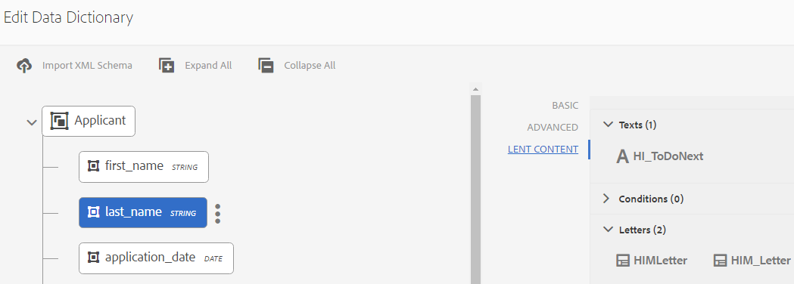

# 資料字典{#data-dictionary}

## 簡介 {#introduction}

資料字典可讓商業使用者使用後端資料來源的資訊，而不需瞭解其基礎資料模型的技術細節。 資料字典由資料字典元素(DDE)組成。 您使用這些資料元素將後端資料整合到信件中，作為輸入，以便用於客戶信件中。

資料字典是描述基礎資料結構及其相關屬性之中繼資料的獨立表示法。 使用商業辭彙來建立資料字典。 它可以映射到一個或多個基礎資料模型。

資料字典由三種類型的元素組成：簡單、複合和系列元素。 簡單DDE是基本元素，如字串、數字、日期和布林值，它們包含城市名稱等資訊。 複合DDE包含其它DDE，其類型可以是基元、複合或集合。 例如，地址，由街道地址、城市、省、國家和郵遞區號組成。 「系列」是類似「簡單」或「複合」DDE的清單。 例如，具有多個地點或不同帳單和運送地址的客戶。

「對應管理」使用根據資料字典的結構儲存的後端、客戶或收件者特定資料，來建立針對不同客戶的對應。 例如，可以使用好記的名稱建立檔案，例如「親愛的{First Name}」、「先生」。 {姓氏}&quot;.

一般而言，商業使用者不需要具備中繼資料表示法的知識，例如XSD（XML架構）和Java類別。 但是，通常需要訪問這些資料結構和屬性才能構建解決方案。

### 資料字典工作流程 {#data-dictionary-workflow}

1. 作者會 [透過上傳結構](#createdatadictionary) ，或從頭開始建立資料字典。
1. 作者根據資料字典建立字母和互動式通訊，並視需要將字母和互動式通訊中的資料字典元素建立關聯。
1. 作者可以下載基於資料字典模式的樣本資料XML檔案。 作者可以修改樣本資料XML檔案，該檔案可以作為測試資料與資料字典相關聯。 在字母預覽期間使用的相同項目。
1. 在預 [覽字母時](../../forms/using/create-letter.md#p-types-of-linkage-available-for-each-of-the-fields-p)，作者會選擇預覽含有資料的字母（自訂預覽）。 此信件會開啟，並預先填入作者提供的資料。 這會在建立對應介面中開啟。 正在預覽此信件的代理商可以修改此信件中的內容、資料和附件，並提交最終信件。 有關建立字母的詳細資訊，請參閱 [建立通信](../../forms/using/create-letter.md)。

## 先決條件 {#prerequisite}

安裝 [Compatibility Package](compatibility-package.md) ，在Forms頁面上 **查看Data Dictorianes** （資料字典） **選項** 。

## 建立資料字典 {#createdatadictionary}

您可以使用資料字典編輯器來建立資料字典，或上傳XSD結構檔案以建立以此為基礎的資料字典。 然後，您可以新增更多必要資訊（包括欄位）來擴充資料字典。 無論資料字典的建立方式如何，業務流程所有者都不需要後端系統的知識。 業務流程所有者只需要對域對象及其定義的知識，即可對其流程進行瞭解。

>[!NOTE]
>
>對於需要類似元素的多個字母，您可以建立通用資料字典。 但是，具有大量元素的大資料字典在使用資料字典和載入元素（例如字母和檔案片段）時，可能會導致效能問題。 如果您遇到效能問題，請嘗試為不同的字母建立個別的資料字典。

1. 選擇「 **表單** >資 **料字典」**。
1. 點選「 **建立資料字典」**。
1. 在「屬性」畫面中，新增下列項目：

   * **** 標題：（可選）輸入資料字典的標題。 標題不需要唯一，而且可以有特殊字元和非英文字元。 字母和其他檔案片段會以其標題（如果有的話）轉介，例如縮圖和資產屬性。 資料字典是以其名稱而非標題來參照。
   * **** 名稱：資料字典的唯一名稱。 在「名稱」欄位中，您只能輸入英文字元、數字和連字型大小。 「名稱」欄位會根據「標題」欄位自動填入，而「標題」欄位中輸入的特殊字元、空格、數字和非英文字元會以連字型大小取代。 雖然「標題」欄位中的值會自動複製到「名稱」，但您可以編輯值。

   * **說明**:（選用）資料字典的說明。
   * **** 標籤：（可選）若要建立自訂標籤，請在文字欄位中輸入值，然後按Enter。 您可以在標籤的文字欄位下方看到標籤。 儲存此文字時，也會建立新增的標籤。
   * **擴展屬性**:（可選）點選「 **新增欄位** 」以指定資料字典的中繼資料屬性。 在「屬性名稱」列中，輸入唯一的屬性名稱。 在「值」列中，輸入要與屬性關聯的值。
   

1. （可選）若要上傳資料字典的XSD結構定義，請在「資料字典結構」窗格下，點選「上 **傳XML結構」**。 瀏覽至XSD檔案，選取它，然後點選「 **Open**」。 根據上傳的XML架構建立資料字典。 您需要調整資料字典中元素的顯示名稱和說明。 若要這麼做，請點選元素名稱，並在右窗格的欄位中編輯其說明、顯示名稱和其他詳細資訊。

   有關計算DD元素的詳細資訊，請參 [閱計算資料字典元素](#computedddelements)。

   >[!NOTE]
   >
   >您可以略過上傳架構檔案，並使用使用者介面從頭開始建立資料字典。 若要這麼做，請略過此步驟，然後繼續下一步。

1. 點選「 **下一步**」。
1. 在「新增屬性」畫面中，將元素新增至資料字典。 如果您已上傳結構以取得資料字典的基本結構，您也可以新增／刪除元素並編輯其詳細資料。

   您可以點選元素右側的三個點，並新增元素至資料字典結構。

   

   選擇「複合元素」、「收集元素」或「基本元素」。

   * 複合DDE包含其它DDE，其類型可以是基元、複合或集合。 例如，地址，由街道地址、城市、省、國家和郵遞區號組成。
   * 基本DDE是字串、數字、日期和布林值等元素，它們包含城市名稱等資訊。
   * 「系列」是類似「簡單」或「複合」DDE的清單。 例如，具有多個地點或不同帳單和運送地址的客戶。
   以下是建立資料字典的一些規則：

   * 在資料字典中，僅允許複合類型做為頂層DDE。
   * 名稱、參考名稱和元素類型是資料字典和DDE的必填欄位。
   * 參考名稱必須是唯一的。
   * 父DDE（複合）不能有兩個同名的子代。
   * enums僅包含基本字串類型。
   有關複合、收集和基本元素以及使用資料字典元素的詳細資訊，請參 [閱將資料字典元素映射到XML架構](#mappingddetoschema)。

   有關資料字典中驗證的資訊，請參 [閱資料字典編輯器驗證](#ddvalidations)。

   

1. （可選）選取元素後，您可以在「進階」索引標籤中新增屬性（屬性）。 您也可以點選「 **新增欄位** 」，並延伸DD元素的屬性。

   

1. （可選）您可以點選元素右側的三個點並選取「刪除」，以移除任何 **元素**。

   

   >[!NOTE]
   >
   >刪除包含子節點的複合／收集元素也會刪除其子節點。

1. （可選）在「資料字典結構」窗格中，以及「欄位和變數清單」面板中選取元素。 變更或新增任何與元素相關聯的必要屬性。
1. 點選「 **儲存**」。

### 建立一或多個資料字典的復本 {#create-copies-of-one-or-more-data-dictionary}

若要快速建立一或多個資料字典，其屬性和元素類似於現有的資料字典，您可以複製和貼上它們。

1. 從資料字典清單中，選取適當的資料字典。 UI會顯示「複製」圖示。
1. 點選「複製」。 UI會顯示「貼上」圖示。
1. 點選「貼上」。 將出現「貼上」對話框。 系統會自動為新的資料字典指派名稱和標題。
1. 如有需要，請編輯您要儲存資料字典副本的「標題」和「名稱」。
1. 點選「貼上」。 建立資料字典的副本。 現在，您可以在新建立的資料字典中進行必要的變更。

## 請參閱參照資料字典元素的檔案片段或檔案 {#see-the-document-fragments-or-documents-that-refer-to-a-data-dictionary-element}

在編輯或檢視資料字典時，您可以看到資料字典中哪些元素是參照文字、條件、字母和互動式通訊的元素。

1. 執行下列任一項作業以編輯資料字典：

   * 將滑鼠指標暫留在資料字典上，然後點選「編輯」。
   * 選取資料字典，然後點選標題中的「編輯」。
   * 將滑鼠指標暫留在資料字典上，然後點選「選取」。 然後點選頁首中的「編輯」。
   或點選資料字典以檢視。

1. 在資料字典中，點選簡單元素以選取它。 複合元素和系列元素沒有參照。

   除了元素的「基本」和「進階」屬性外，也會出現「借出內容」。

1. 點選「借出內容」。

   「借出內容」索引標籤隨即出現，並包含下列項目：文字、條件、信件和互動式通訊。 這些標題中的每個標題也會顯示所選元素的參考數。

1. 點選標題可查看參照元素的資產名稱。

   

1. 若要檢視其他元素的借出內容，請點選元素。
1. 若要顯示參照元素的資產，請點選其名稱。 瀏覽器會顯示資產、信件或互動式通訊。

## 使用測試資料 {#working-with-test-data}

1. 在「資料字典」頁面上，點選「選 **取」**。
1. 點選您要下載測試資料的資料字典，然後點選「下 **載範例XML資料」**。
1. 在警 **報訊息中** ，點選「確定」。 下載XML檔案。
1. 使用記事本或其他XML編輯器開啟XML檔案。 XML檔案的結構與元素中的資料字典和預留位置字串相同。 將預留位置字串取代為您要測試字母的資料。

   ```xml
   <?xml version="1.0" encoding="UTF-8" standalone="no"?>
   <Company>
   <Name>string</Name>
   <Type>string</Type>
   <HeadOfficeAddress>
   <Street>string</Street>
   <City>string</City>
   <State>string</State>
   <Zip>string</Zip>
   </HeadOfficeAddress>
   <SalesOfficeAddress>
   <Street>string</Street>
   <City>string</City>
   <State>string</State>
   <Zip>string</Zip>
   </SalesOfficeAddress>
   <HeadCount>1.0</HeadCount>
   <CEO>
   <PersonName>
   <FirstName>string</FirstName>
   <MiddleName>string</MiddleName>
   <LastName>string</LastName>
   </PersonName>
   <DOB>string</DOB>
   <CurrAddress>
   <Street>string</Street>
   <City>string</City>
   <State>string</State>
   <Zip>string</Zip>
   </CurrAddress>
   <DOJ>14-04-1973</DOJ>
   <Phone>1.0</Phone>
   </CEO>
   </Company>
   ```

   >[!NOTE]
   >
   >在此範例中，XML會為收集元素建立三個值的空間，但值的數目可依需求增加／減少。

1. 在建立資料項目後，當您使用測試資料預覽字母時，可使用此XML檔案。

   您可以使用DD來新增此測試資料（選取DD並點選「上傳測試資料」並上傳此xml檔案）。因此，在此之後，當您正常預覽字母（非自訂）時，此XML資料會用於字母中。 您也可以點選「自訂」，然後上傳此XML。

## 示例 {#samples}

下列程式碼範例顯示「資料字典」的實施詳細資訊。

### 可上傳至資料字典的範例結構 {#sample-schema-that-can-be-uploaded-to-the-data-dictionary}

```xml
<?xml version="1.0" encoding="utf-8"?>
<xs:schema xmlns="DCT" targetNamespace="DCT" xmlns:xs="https://www.w3.org/2001/XMLSchema"
  elementFormDefault="qualified" attributeFormDefault="unqualified">
  <xs:element name="Company">
    <xs:complexType>
      <xs:sequence>
        <xs:element name="Name" type="xs:string"/>
        <xs:element name="Type" type="xs:anySimpleType"/>
        <xs:element name="HeadOfficeAddress" type="Address"/>
        <xs:element name="SalesOfficeAddress" type="Address" minOccurs="0"/>
        <xs:element name="HeadCount" type="xs:integer"/>
        <xs:element name="CEO" type="Employee"/>
        <xs:element name="Workers" type="Employee" maxOccurs="unbounded"/>
      </xs:sequence>
    </xs:complexType>
  </xs:element>
  <xs:complexType name="Employee">
    <xs:complexContent>
      <xs:extension  base="Person">
        <xs:sequence>
          <xs:element name="CurrAddress" type="Address"/>
          <xs:element name="DOJ" type="xs:date"/>
          <xs:element name="Phone" type="xs:integer"/>
        </xs:sequence>
      </xs:extension>
    </xs:complexContent>
  </xs:complexType>
  <xs:complexType name="Person">
    <xs:sequence>
      <xs:element name="PersonName" type="Name"/>
      <xs:element name="DOB" type="xs:dateTime"/>
    </xs:sequence>
  </xs:complexType>
  <xs:complexType name="Name">
    <xs:sequence>
      <xs:element name="FirstName" type="xs:string"/>
      <xs:element name="MiddleName" type="xs:string"/>
      <xs:element name="LastName" type="xs:string"/>
    </xs:sequence>
  </xs:complexType>
  <xs:complexType name="Address">
    <xs:sequence>
      <xs:element name="Street" type="xs:string"/>
      <xs:element name="City" type="xs:string"/>
      <xs:element name="State" type="xs:string"/>
      <xs:element name="Zip" type="xs:string"/>
    </xs:sequence>
  </xs:complexType>
</xs:schema>
```

## 與DDE關聯的通用屬性 {#common-attributes-associated-with-a-dde}

下表詳細說明了與DDE關聯的常見屬性：

<table>
 <tbody>
  <tr>
   <td><strong>屬性</strong></td>
   <td><strong>類型</strong></td>
   <td><strong>說明</strong></td>
  </tr>
  <tr>
   <td>名稱</td>
   <td>字串</td>
   <td>必要.<br /> DDE的名稱。 它必須是唯一的。</td>
  </tr>
  <tr>
   <td>Reference<br /> Name</td>
   <td>字串</td>
   <td>必要. DDE的唯一引用名稱，允許對DDE的引用獨立於對資料字典的層次結構或結構的更改。 文本模組使用此名稱進行映射</td>
  </tr>
  <tr>
   <td>displayname</td>
   <td>字串</td>
   <td>DDE的可選用戶友好名稱。</td>
  </tr>
  <tr>
   <td>說明</td>
   <td>字串</td>
   <td>DDE的說明。</td>
  </tr>
  <tr>
   <td>elementType</td>
   <td>字串</td>
   <td>必要. DDE的類型：字串、數字、日期、布林值、複合、系列。</td>
  </tr>
  <tr>
   <td>elementSubType</td>
   <td>字串</td>
   <td>DDE的子類型：列舉。 僅允許STRING和NUMBER elementType。</td>
  </tr>
  <tr>
   <td>關鍵</td>
   <td>布林值 (Boolean)</td>
   <td>一個布爾欄位，用於指示DDE是否為關鍵元素。</td>
  </tr>
  <tr>
   <td>運算結果</td>
   <td>布林值 (Boolean)</td>
   <td>一個布爾欄位，用於指示是否計算DDE。 計算的DDE值是其它DDE值的函式。 預設情況下，支援jsp表達式。</td>
  </tr>
  <tr>
   <td>運算式</td>
   <td>字串</td>
   <td>"computed" DDE的表達式。 預設情況下提供的表達式評估服務支援JSP EL表達式。 您可以將運算式服務取代為自訂實作。</td>
  </tr>
  <tr>
   <td>valueSet</td>
   <td>清單</td>
   <td>列舉類型DDE的允許值集。 例如，帳戶類型只能有（儲存、目前）值。</td>
  </tr>
  <tr>
   <td>extendedProperties</td>
   <td>物件</td>
   <td>添加到DDE的自定義屬性映射（用戶介面特定或任何其他資訊）。</td>
  </tr>
  <tr>
   <td>必要</td>
   <td>布林值 (Boolean)</td>
   <td>此標幟指出與資料字典對應的例項資料來源必須包含此特定DDE的值。</td>
  </tr>
  <tr>
   <td>繫結</td>
   <td>BindingElement</td>
   <td>元素的XML或Java系結。</td>
  </tr>
 </tbody>
</table>

### 計算資料字典元素 {#computedddelements}

資料字典也可以包括計算元素。 計算資料字典元素始終與表達式相關聯。 此運算式會評估為在執行時期取得資料字典元素的值。 計算的DDE值是其它DDE值或文字的函式。 預設情況下，支援JSP表達式語言(EL)表達式。 EL運算式使用${ }字元，而有效的運算式可包含文字、運算子、變數（資料字典元素參考）和函式呼叫。 在引用表達式中的資料字典元素時，使用DDE的引用名稱。 參考名稱對於資料字典內的每個資料字典元素都是唯一的。

計算的DDE PersonFullName可與EL串連運算式關聯，例如${PersonFirstName} ${PersonLastName}。

## XSD與資料字典之間的資料類型對應 {#data-type-mapping-between-xsd-and-data-dictionary-br}

匯出XSD需要特定的資料對應，如下表所述。 DDI列指示DDI中可用的DDE值類型。

<table>
 <tbody>
  <tr>
   <td>XSD <br /> </td>
   <td><p>資料字典 <br /> </p> </td>
   <td>DDI（實例值資料類型）<br /> </p> </td>
  </tr>
  <tr>
   <td><p>xs：類型元素——複合類型<br /> </p> </td>
   <td>DDE類型——複合<br /> </p> </td>
   <td>java.util.Map<br /> </td>
  </tr>
  <tr>
   <td><p>xs:maxOccurs的元素&gt; 1<br /> </p> </td>
   <td>DDE類型- COLLECTION-<br /> DDE節點建立在COLLECTION DDE旁邊，該DDE從父COLLECTION節點捕獲資訊。 為簡單／複合資料類型的集合建立的集合相同。 每當您有類型複合的COLLECTION時，「資料字典」樹將捕獲為捕獲類型資訊而建立的DDE子代中的組成欄位。<br /> - DDE(COLLECTION)<br /> - DDE(COMPOSITE for type info)<br /> - DDE(STRING)欄位1<br /> - DDE(STRING)欄位2<br /><br /> </p> </td>
   <td>java.util.list<br /> </td>
  </tr>
  <tr>
   <td>類型屬性- xs:id <br /> </p> </td>
   <td>DDE類型——字串 <br /> </td>
   <td>java.lang.String<br /> </td>
  </tr>
  <tr>
   <td>xs:attribute /xs:type - xs:string類型的元素</p> </td>
   <td>DDE類型——字串<br /> </td>
   <td>java.lang.String<br /> </td>
  </tr>
  <tr>
   <td>xs:attribute /xs:element type - xs:布林值 <br /> </td>
   <td>DDE類型——布爾型 <br /> </td>
   <td>java.lang.Boolean<br /> </td>
  </tr>
  <tr>
   <td>xs:attribute /xs:type - xs:date類型的元素 </td>
   <td>DDE類型- DATE </td>
   <td>java.lang.String</td>
  </tr>
  <tr>
   <td>xs:attribute /xs:type - xs:integer </td>
   <td>DDE類型- NUMBER </td>
   <td>java.lang.Double</td>
  </tr>
  <tr>
   <td>xs:attribute /xs:type - xs:long</td>
   <td>DDE類型- NUMBER </td>
   <td>java.lang.Double</td>
  </tr>
  <tr>
   <td>xs:attribute /xs:type - xs:double</td>
   <td>DDE類型- NUMBER </td>
   <td>java.lang.Double</td>
  </tr>
  <tr>
   <td>enum類型的元素和baseType - xs:string</td>
   <td>DDE of<br /> type - STRING<br /> subtype - ENUM值集<br /> - ENUM的允許值<br /> </td>
   <td>java.lang.String</td>
  </tr>
 </tbody>
</table>

## 從資料字典下載範例資料檔案 {#download-a-sample-data-file-from-a-data-dictionary}

建立資料字典後，您就可以將它下載為XML範例資料檔案，以便在其中輸入文字。

1. 在「資料字典」頁面中，點選「 **選取** 」，然後點選資料字典以選取它。
1. Select **Download Sample XML Data**.
1. 在警 **報訊息中** ，點選「確定」。

   「對應管理」會根據選取的資料字典結構建立XML檔案，並將它下載至您的電腦，名稱為&lt;data-dictionary-name>-SampleData。 現在，您可以在XML或文字編輯器中編輯此檔案，以在建立字母時 [輸入資料](../../forms/using/create-letter.md)。

## 元資料的國際化 {#internationalization-of-meta-data}

當您想要以不同語言傳送相同的字母給客戶時，您可以將資料字典和資料字典元素的顯示名稱、說明和列舉值集當地語系化。

### 本地化資料字典 {#localize-data-dictionary}

1. 在「資料字典」頁面上，點選「 **選取** 」，然後點選資料字典以選取它。
1. 點選「 **下載本地化資料**」。
1. 在警 **報中點選** 「確定」。 「通信管理」會將郵遞區號檔案下載至您的電腦，其名稱為DataDictionary-&lt;Dname>.zip。
1. Zip檔案包含。properties檔案。 此檔案定義已下載的資料字典。 屬性檔案的內容類似於：

   # 星期三20日2015年5月20日16:06:23
   DataDictionary.EmployeeDD.description=DataDictionary.DisplayName=EmployeeDataDictionaryDictionaryElement.name.description=DataDictionaryElement.displayName=nameDataDictionaryElement.person.displayDaplyname=person

   屬性檔案的結構為每個描述定義一行以及資料字典中的資料字典元素的顯示名稱。 此外，屬性檔案為每個資料字典元素的枚舉值集定義一行。 與資料字典一樣，對應的屬性檔案可以有多個資料字典元素定義。 此外，該檔案可包含一個或多個枚舉值集的定義。

1. 若要在不同地區設定中更新。properties檔案，請更新檔案中的顯示名稱和說明值。 針對您要本地化的每種語言，建立更多檔案例項。 僅支援法文、德文、日文和英文。

1. 以下列名稱保存不同的更新屬性檔案：

   _fr_FR.properties法文版

   _de_DE.properties德文

   _ja_JA.properties日文版

   _en_EN.properties英文版

1. 將。properties檔案（或多個地區設定的檔案）封存為單一。zip檔案。

1. 在「資料字典」頁面中，選 **取「更多** >上 **傳本地化資料** 」，並選取包含本地化屬性檔案的zip檔案。
1. 若要檢視本地化變更，請變更您的瀏覽器地區設定。

## 資料字典驗證 {#ddvalidations}

在建立或更新資料字典時，資料字典編輯器將強制執行以下驗證。

* 在資料字典中，僅允許複合類型做為「頂層元素」。
* 複合元素和集合元素不允許在葉層級。 葉級別僅允許基本元素（字串、日期、數字、布爾）元素。 此驗證可確保沒有包含子DDE的組合和收集元素。
* 上傳XSD檔案以建立資料字典時，資料字典編輯器會提示輸入頂層元素（若有多個元素）以建立資料字典。
* 名稱是資料字典唯一必要的參數。
* 父DDE（複合）不能有兩個同名的子代
* 確保只有在DDE不是必需參數時，才會將其標籤為已計算。 不能計算所需元素，也不能需要計算元素。 此外，「集合」和「組合元素」不能是計算元素。
* 確保僅在未計算DDE時才標籤為必需。 此外，還可確保它不是表示系列類型的「collectionElement」（系列元素的唯一子系）。
* 資料字典或DDE的extendedProperties中不允許空鍵或重複鍵。
* 請勿在擴充屬性的索引鍵或值中使用冒號(:)或垂直條(|)字元。 使用這些禁止字元時，沒有驗證。

在資料字典層級套用的驗證

* 「資料字典」名稱不得為null。
* 資料字典名稱只能包含英數字元。
* 「資料字典」中的子元素清單不得為null或空白。
* 資料字典不得包含多個頂層資料字典元素。
* 在「資料字典」中，僅允許複合類型做為「頂層元素」。

在「資料字典元素」層級套用的驗證。

* 所有DDE名稱不能為空，也不能包含空格。
* 所有DDE都必須具有「非空／非空」元素類型。
* 所有DDE引用名稱不能為空。
* 所有DDE引用名稱都必須是唯一的。
* 所有DDE參考只能包含英數字元和&quot;_&quot;。
* 所有DDE顯示名稱只能包含英數字元和&quot;_&quot;。
* 複合元素和集合元素不允許在葉層級。 葉級別僅允許基本元素（字串、日期、數字、布爾）元素。 此驗證可確保沒有包含子DDE的組合和收集元素。
* 複合父DDE不能有兩個同名的子元素。
* ENUM子類型僅用於字串和數字元素。
* 無法計算集合和組合元素。
* DDE不能同時計算和要求。
* 計算的DDE必須包含有效的表達式。
* 計算的DDE不能具有XML綁定。
* 不能計算或要求表示「收集DDE」類型的DDE。
* 子類型ENUM的DDE不能包含空值集或空值集。
* 系列DDE的XML系結不得映射至屬性。
* XML綁定語法必須有效，例如，只顯示一個@，僅當後面跟有屬性名稱時才允許@。

## 將資料字典元素對應至XML架構 {#mappingddetoschema}

您可以從XML架構建立資料字典，或使用資料字典使用者介面建立資料字典。 資料字典內的所有資料字典元素(DDE)都有XML系結欄位，以儲存DDE與XML架構中的元素的系結。 每個DDE中的綁定相對於父DDE。

下列詳細資訊範例模型和程式碼範例，顯示資料字典的實作詳細資訊。

## 映射簡單（基本）元素 {#mapping-simple-primitive-elements}

原始DDE表示在本質上是原子的欄位或屬性。 在複雜類型（複合DDE）或重複元素（集合DDE）範圍之外定義的基本DDE可以儲存在XML架構中的任何位置。 與基本DDE對應的資料位置不取決於其父DDE的映射。 Primitive DDE使用「XML綁定」欄位中的映射資訊來確定其值，並將映射轉換為以下值之一：

* 屬性
* 元素
* 文字內容
* nothing(an ignored DDE)

以下示例顯示了一個簡單模式。

```xml
<?xml version="1.0" encoding="UTF-8"?>
<xs:schema xmlns:xs="https://www.w3.org/2001/XMLSchema">
  <xs:element name='age' type='integer'/>
  <xs:element name='price' type='decimal'/>
</xs:schema>
```

| **資料字典元素** | **預設XML系結** |
|---|---|
| 年齡 | /年齡 |
| 價格 | /價格 |

### 映射複合元素 {#mapping-composite-elements}

複合元素不支援系結，如果提供系結，則會忽略它。 所有原始類型的構成子DDE的綁定必須是絕對的。 允許對複合DDE的子元素進行絕對映射，在XPath綁定方面提供了更大的靈活性。 將複合DDE映射到XML架構中的複雜類型元素會限制其子元素的綁定範圍。

以下示例顯示注釋的方案。

```xml
<xs:element name="note">
    <xs:complexType>
        <xs:sequence>
            <xs:element name="to" type="xs:string"/>
            <xs:element name="from" type="xs:string"/>
            <xs:element name="heading" type="xs:string"/>
            <xs:element name="body" type="xs:string"/>
        </xs:sequence>
    </xs:complexType>
</xs:element>
```

<table>
 <tbody>
  <tr>
   <td><strong>資料字典元素</strong></td>
   <td><strong>預設XML系結</strong></td>
  </tr>
  <tr>
   <td>附註</td>
   <td>空白(null)<br /> </td>
  </tr>
  <tr>
   <td>至</td>
   <td>/note/to</td>
  </tr>
  <tr>
   <td>從</td>
   <td>/note/from</td>
  </tr>
  <tr>
   <td>標題</td>
   <td>/note/heading</td>
  </tr>
  <tr>
   <td>身體</td>
   <td>/note/body</td>
  </tr>
 </tbody>
</table>

### 對應收集元素 {#mapping-collection-elements}

系列元素只會映射至其他基數> 1的系列元素。 系列DDE的子DDE與其父XML綁定有相對（本地）XML綁定。 由於收集元素的子DDE必須與父項的基數相同，因此相對綁定的強制要求是確保基數約束，以便子DDE不指向非重複的XML架構元素。 在下列範例中，「TokenID」的基數必須與「Token」相同，後者是其父系列DDE。

將集合DDE映射到XML架構元素時：

* 與「收集」元素對應的DDE綁定必須是絕對XPath

* 不為表示「收集」元素類型的DDE提供綁定。 如果提供，則會忽略系結。

* 「系列」元素的所有子DDE的綁定必須相對於父系列元素。

下方的XML結構描述聲明名稱為Token的元素，且maxOccurns屬性為&quot;unbounded&quot;。 因此，Token是系列元素。

```xml
<?xml version="1.0" encoding="utf-8"?>
<Root>
  <Tokens>
    <TokenID>string</TokenID>
    <TokenText>
      <TextHeading>string</TextHeading>
      <TextBody>string</TextBody>
    </TokenText>
  </Tokens>
  <Tokens>
    <TokenID>string</TokenID>
    <TokenText>
      <TextHeading>string</TextHeading>
      <TextBody>string</TextBody>
    </TokenText>
  </Tokens>
  <Tokens>
    <TokenID>string</TokenID>
    <TokenText>
      <TextHeading>string</TextHeading>
      <TextBody>string</TextBody>
    </TokenText>
  </Tokens>
</Root>
```

與此範例關聯的Token.xsd應為：

```xml
<xs:element name="Root">
  <xs:complexType>
    <xs:sequence>
      <xs:element name="Tokens" type="TokenType" maxOccurs="unbounded"/>
    </xs:sequence>
  </xs:complexType>
</xs:element>

<xs:complexType name="TokenType">
  <xs:sequence>
    <xs:element name="TokenID" type="xs:string"/>
    <xs:element name="TokenText">
      <xs:complexType>
        <xs:sequence>
          <xs:element name="TextHeading" type="xs:string"/>
          <xs:element name="TextBody" type="xs:string"/>
        </xs:sequence>
      </xs:complexType>
    </xs:element>
  </xs:sequence>
</xs:complexType>
```

| **資料字典元素** | **預設XML系結** |
|---|---|
| 根 | 空白(null) |
| Token | /Root/Token |
| 構成 | 空白(null) |
| TokenID | TokenID |
| TokenText | 空白(null) |
| TokenHeading | TokenText/TextHeading |
| TokenBody | TokenText/TextBody |

