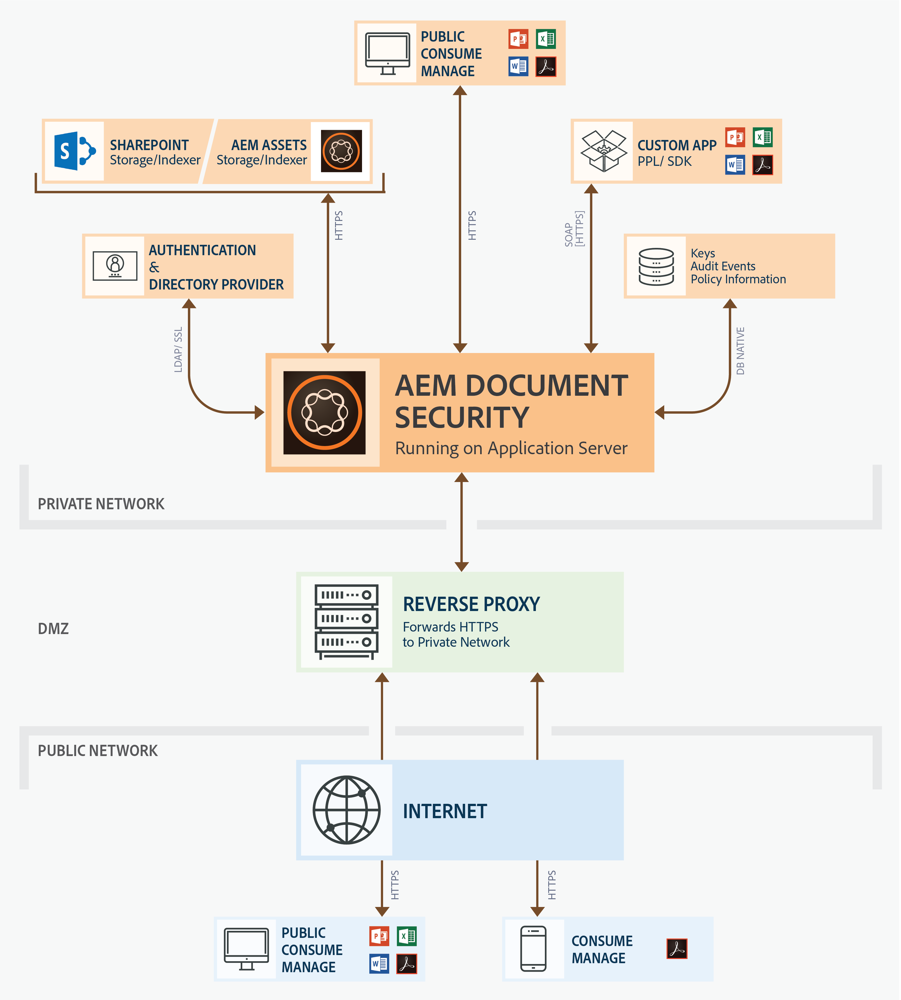

# 檔案安全性方案{#document-security-offerings}

Adobe Experience Manager Forms檔案安全性可確保只有授權使用者才能使用您的檔案。 使用檔案安全性，您可以安全地散布您以支援格式儲存的任何資訊。 支援的檔案格式包括Adobe可攜式檔案格式(PDF)和Microsoft Word、Excel和PowerPoint檔案。

您可以使用原則來保護檔案。 您在原則中指定的機密設定會決定收件者如何使用您套用原則的檔案。 例如，您可以指定收件者是否可以列印或複製文字、編輯文字，或在受保護的檔案中新增簽名和留言。

這些原則會儲存在Document Security伺服器上；您可以透過用戶端應用程式將原則套用至檔案。 將原則套用至檔案時，原則中指定的機密設定會保護檔案所包含的資訊。 您可以將受原則保護的檔案分發給受原則授權的收件者。

下圖顯示AEM Forms Document Security的典型架構：

## Document Security用戶端 {#document-security-clients}

Document security提供多種用戶端來保護檔案、檢視和編輯受保護的檔案，以及索引器，以針對受保護的檔案進行全文搜尋。 您可以根據您的需求和用戶端的功能來選擇用戶端。

Document Security server是Document security執行使用者驗證、即時管理原則及應用機密性等交易的核心元件。 伺服器還為策略、審計記錄和其他相關資訊提供中央儲存庫。

Document Security伺服器提供網路介面（網頁），以建立原則、管理受原則保護的檔案，以及監控與受原則保護的檔案相關的事件。 管理員也可以設定全域選項，例如使用者驗證、稽核和傳訊給受邀的使用者，以及管理受邀的使用者帳戶。

伺服器已包含在AEM Forms Document Security附加元件產品中。 您可以聯絡AEM Forms銷 [售團隊](https://www.adobe.com/products/request-consultation/marketing-cloud.html?s_osc=70114000002JNwKAAW&s_iid=70114000002JHs3AAG) ，以購買Document Security附加元件。

### 保護檔案 {#protect-documents}

AEM Forms Document security提供多種工具來套用安全性原則。 您可以根據需求和規格選擇工具。

您可以使用Document Security SDK、Adobe Acrobat、Document Security Extension for Microsoft Office或可攜式保護程式庫來套用及追蹤安全性政策：

* **** Document Security SDK:SDK是功能豐富的用戶端。 您可以使用Document Security SDK來存取檔案伺服器功能、開啟受原則保護的檔案，並開發自訂的擴充功能、外掛程式或應用程式。 例如，您可以開發擴充功能來保護自訂檔案格式，或將SDK與資料遺失防護(DLP)解決方案整合。 使用Document Security SDK開發的擴充功能、應用程式和外掛程式會將檔案傳送至指定的AEM Forms伺服器，而原則會套用至伺服器。 另請注意，AEM Forms檔案安全性用戶端SDK(CSDK)無法解除保護使用可攜式保護程式庫(PPL)所保護的檔案，反之亦然。

   Document Security SDK適用於Java和C++。 Java SDK包含在AEM Forms Document security產品中，而且會安裝在JEE上部署AEM表單時。 您可以聯 [絡AEM支援團隊](https://helpx.adobe.com/marketing-cloud/contact-support.html) ，購買C++ SDK。 C++ SDK可以使用Microsoft Visual Studio 2013編譯。 您可以造 [訪Document Security API檔案網站](https://help.adobe.com/en_US/livecycle/11.0/Services/WS92d06802c76abadb76c48dfe12dbeb3e281-7ff0.2.html) ，以學習和使用SDK功能。

* **** Adobe Acrobat:您可以使用Adobe Acrobat將安全性原則套用至使用常用案頭應用程式（例如Microsoft Office、網頁瀏覽器或任何支援PDF格式列印的應用程式）建立的PDF檔案。

   您可以從 [Adobe網站購買及下載Adobe Acrobat](https://acrobat.adobe.com/us/en/free-trial-download.html)。 Adobe Acrobat文章 [設定PDF的安全性政策](https://helpx.adobe.com/acrobat/using/setting-security-policies-pdfs.html) ，提供在Adobe Acrobat中建立和套用原則的詳細資訊。

* **Document Security Extension for Microsoft Office**:您可以使用Document Security Extension for Microsoft Office，從Microsoft office程式將預先定義的原則套用至Microsoft office檔案。 此擴充功能可確保只有經過授權的人員才能使用受原則保護的Microsoft Word、Excel和PowerPoint檔案。 只有已安裝外掛程式的授權使用者才能使用受原則保護的檔案。

   Document Security擴充功能是以Microsoft office外掛程式提供。 您可以聯絡 [AEM支援團隊](https://helpx.adobe.com/ca/marketing-cloud/contact-support.html) ，以取得擴充功能。 稍後，您可以造訪 [Document Security Extension for Microsoft Office](https://helpx.adobe.com/aem-forms/aem-document-security/aem-document-security-extension-help.html) ，以瞭解如何安裝、設定和使用擴充功能。

* **** 可移植保護庫：可攜式保護程式庫(PPL)可在本機保護檔案，而不需將檔案傳送至AEM Forms伺服器。 只有安全證書和策略詳細資訊通過網路傳輸。 PPL也允許您僅將策略檢索訪問權限限制為已登錄用戶。 您可以擷取包含登入AEM使用者之使用者內容的原則。

   此外，Prortable Protection Library具備Document Security SDK的所有功能。 您可以使用Document Security SDK來存取檔案伺服器功能、開啟受原則保護的檔案，並開發自訂的擴充功能、外掛程式或應用程式。 另請注意，可攜式保護程式庫(PPL)無法解除保護使用AEM Forms檔案安全性用戶端SDK(CSDK)所保護的檔案，反之亦然。

   可移植保護庫適用於32位和64位版本的Java和C\+\+語言。 OSGi上的AEM Forms也提供OSGi套件。 C\+\+ PPL可以使用Microsoft Visual Studio 2013編譯。 如果您已取得AEM Forms Document security附加元件的授權，可以聯絡 [AEM Forms Document Security](https://helpx.adobe.com/marketing-cloud/contact-support.html) 支援團隊以購買Portable Protection Library。 稍後，您可以使用「可攜式保護庫幫助」（與庫捆綁）來設定和使用可攜式保護庫。

### 檢視或編輯受保護的檔案 {#view-or-edit-protected-documents}

* 對 **於PDF檔案**，您可以使用Adobe Acrobat DC、Acrobat Reader和Acrobat Reader mobile來檢視受保護的PDF檔案。 大部分的使用者都已在裝置上安裝Acrobat Reader，因此他們不需要取得或學習其他軟體來檢視受保護的檔案。 您也可以從 [Acrobat Reader下載網站下載Acrobat Reader](https://get.adobe.com/reader/)。

* 若是 **Microsoft office檔案**，您需要Microsoft office和AEM Forms Document Security Extension for Microsoft Office。 Document Security擴充功能是以Microsoft office外掛程式提供。 您可從Adobe網站下載擴充功能。

### 為受保護的檔案建立索引 {#index-protected-documents}

Microsoft windows全文搜尋引擎(SharePoint Index Server)和Adobe Experience Manager(AEM)可對常用的檔案格式（例如純文字檔案、Microsoft office檔案和PDF檔案）執行全文搜尋。 您可以使用Document Security索引器啟用全文搜尋引擎，以搜尋受保護的PDF檔案：

* **** iFilter索引器：您可以使用iFilter索引器為受保護的PDF檔案建立索引，並讓Microsoft windows全文搜尋引擎（Desktop Indexing service和SharePoint Indexserver）搜尋受保護的PDF檔案。 如需詳細資訊，請參閱「 [AEM SharePoint IFilter for Protected Documents」(AEM SharePoint IFilter for Protected Documents)](assets/sharepoint-ifilter-doc-security.pdf)。

* **** AEM Forms Document Security Indexer:您可以使用AEM Forms Document security索引器來為受保護的PDF檔案建立索引，並讓Adobe Experience manager搜尋受保護的PDF檔案。 索引器是AEM Forms Document Security產品的一部分。 這些都包含在JEE安裝程式的AEM Forms中。

