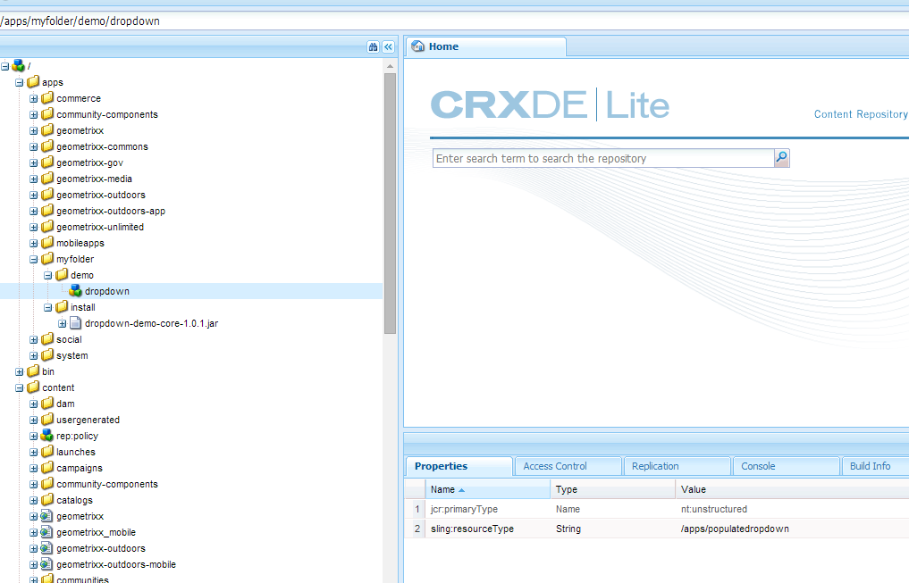

# 動態填充下拉清單 {#dynamically-populating-drop-down-lists}

## 必備條件 {#prerequisites}

* [建立OSGI捆綁包](https://helpx.adobe.com/experience-manager/using/creating-osgi-bundles-digital-marketing.html)
* [開發部AEM件](/help/sites-developing/components.md)
* [建立自適應窗體](../../forms/using/creating-adaptive-form.md)
* [創作自適應窗體](../../forms/using/introduction-forms-authoring.md)

## 動態填充下拉清單的過程 {#procedure-to-dynamically-populate-drop-down-lists}

考慮要填充的方案 **州** 下拉清單，基於您在 **國家/地區** 的子菜單。 如果在 **國家/地區** 下拉清單， **州** 下拉清單顯示澳大利亞內的狀態。 以下過程介紹如何完成此任務。

1. 建立具有以下模組的項目：

   * 包含用於填充下拉清單的邏輯的包，在本例中為servlet。
   * 該內容嵌入.jar檔案，並具有下拉資源。 Servlet指向此資源。

1. 根據請求參數Country編寫Servlet，該參數返回包含國家/地區內狀態名稱的陣列。

   ```java
   @Component(metatype = false)
   @Service(value = Servlet.class)
   @Properties({
           @Property(name = "sling.servlet.resourceTypes", value = "/apps/populatedropdown"),
           @Property(name = "sling.servlet.methods", value = {"GET", "POST"}),
           @Property(name = "service.description", value = "Populate states dropdown based on country value")
   })
   public class DropDownPopulator extends SlingAllMethodsServlet {
       private Logger logger = LoggerFactory.getLogger(DropDownPopulator.class);
   
       protected void doPost(SlingHttpServletRequest request,
                             final SlingHttpServletResponse response)
               throws ServletException, IOException {
           response.setHeader("Access-Control-Allow-Origin", "*");
           response.setContentType("application/json");
           response.setCharacterEncoding("UTF-8");
           try {
               String US_STATES[] = {"0=Alabama",
                       "1=Alaska",
                       "2=Arizona",
                       "3=Arkansas",
                       "4=California",
                       "5=Colorado",
                       "6=Connecticut",
                       "7=Delaware",
                       "8=Florida",
                       "9=Georgia",
                       "10=Hawaii",
                       "11=Idaho",
                       "12=Illinois",
                       "13=Indiana",
                       "14=Iowa",
                       "15=Kansas",
                       "16=Kentucky",
                       "17=Louisiana",
                       "18=Maine",
                       "19=Maryland",
                       "20=Massachusetts",
                       "21=Michigan",
                       "22=Minnesota",
                       "23=Mississippi",
                       "24=Missouri",
                       "25=Montana",
                       "26=Nebraska",
                       "27=Nevada",
                       "28=New Hampshire",
                       "29=New Jersey",
                       "30=New Mexico",
                       "31=New York",
                       "32=North Carolina",
                       "33=North Dakota",
                       "34=Ohio",
                       "35=Oklahoma",
                       "36=Oregon",
                       "37=Pennsylvania",
                       "38=Rhode Island",
                       "39=South Carolina",
                       "40=South Dakota",
                       "41=Tennessee",
                       "42=Texas",
                       "43=Utah",
                       "44=Vermont",
                       "45=Virginia",
                       "46=Washington",
                       "47=West Virginia",
                       "48=Wisconsin",
                       "49=Wyoming"};
               String AUSTRALIAN_STATES[] = {"0=Ashmore and Cartier Islands",
                       "1=Australian Antarctic Territory",
                       "2=Australian Capital Territory",
                       "3=Christmas Island",
                       "4=Cocos (Keeling) Islands",
                       "5=Coral Sea Islands",
                       "6=Heard Island and McDonald Islands",
                       "7=Jervis Bay Territory",
                       "8=New South Wales",
                       "9=Norfolk Island",
                       "10=Northern Territory",
                       "11=Queensland",
                       "12=South Australia",
                       "13=Tasmania",
                       "14=Victoria",
                       "15=Western Australia"};
               String country = request.getParameter("country");
               JSONArray stateJsonArray = new JSONArray();
               if (country.length() > 0) {
                   if ("australia".equalsIgnoreCase(country)) {
                       stateJsonArray = new JSONArray();
                       for (String state : AUSTRALIAN_STATES) {
                           stateJsonArray.put(state);
                       }
                   } else if ("unitedstates".equalsIgnoreCase(country)) {
                       stateJsonArray = new JSONArray();
                       for (String state : US_STATES) {
                           stateJsonArray.put(state);
                       }
                   }
                   response.setContentType("application/json");
                   response.getWriter().write(stateJsonArray.toString());
               }
   
           } catch ( Exception e) {
               logger.error(e.getMessage(), e);
           }
       }
   }
   ```

1. 在應用程式中特定資料夾層次結構下建立下拉節點（例如，在/apps/myfolder/demo下建立節點）。 確保 `sling:resourceType` 節點的參數與servlet指向的參數(/apps/populatedropdown)相同。

   

1. 將內容節點打包並在特定位置嵌入.jar檔案（例如/apps/myfolder/demo/install/）。 在伺服器上部署同一檔案。
1. 建立一個自適應表單，並向其添加兩個下拉清單（「國家」和「狀態」）。 國家名單可以包括國家名稱。 「狀態」(State)清單可動態填充您在第一個清單中選擇的國家/地區的狀態名稱。

   添加要在「國家/地區」清單中顯示的國家/地區名稱。 在「狀態」清單中，添加一個指令碼以根據「國家/地區」清單中國家/地區的名稱來填充該指令碼。

     

   ```javascript
   JSON.parse(
       $.ajax({
           url: "/apps/myfolder/demo/dropdown",
           type: "POST",
           async: false,
           data: {"country": country.value},
            success: function(res){},
            error : function (message) {
                 guideBridge._guide.logger().log(message);
                 successFlag = false;
                 }
              })
   .responseText);
   ```

包含具有上述代碼的示例自適應表單(demo/AFdemo)的內容包。

[取得檔案](assets/dropdown-demo-content-1.0.1-snapshot.zip)
