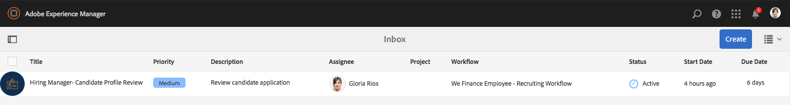

# 員工招聘參考網站漫步 {#employee-recruitment-reference-site-walkthrough}

## 先決條件 {#prerequisite}

依「設定和設定AEM Forms參考網站」中 [所述設定參考網站](/help/forms/using/setup-reference-sites.md)。

## 概覽 {#overview}

We.Finance是一個組織，可讓申請人透過參考網站入口網站申請就業。 該組織也使用入口網站來管理候選人的面試排程、入圍和內部溝通。 該網站管理下列項目：

* 求職求職者
* 候選人的篩選和入圍
* 面試程式
* 候選人詳細資訊的集合
* 候選背景檢查
* 將選件推出給選定的候選人

>[!NOTE]
>
>We.Finance和We.Gov參考網站都提供員工招聘使用案例。 逐步瀏覽中使用的範例、影像和說明使用We.Finance參考網站。 不過，您也可以使用We.Gov執行這些使用案例並檢視工件。 若要這麼做，請 **在上述URL中** , **以we-gov** 取代we-finance。

### 涉及的工作流程模型 {#workflow-models-involved}

員工招聘使用案例包含兩個工作流程：

* 面試前——我們為員工招聘工作流程提供資金
* 面試後——我們為員工招聘面試後工作流程提供資金

這些工作流程是在AEM中建立的，可在以下網址找到：

`https://[authorHost]:[authorPort]/libs/cq/workflow/admin/console/content/models.html/etc/workflow/models/`

#### 我們為員工招聘工作流程提供資金 {#we-finance-employee-recruiting-workflow}

以下是本文檔中遵循的We Finance員工招聘工作流模型。

#### We Finance Employee Recluiting Post Interation工作流 {#we-finance-employee-recruiting-post-interview-workflow}

以下是本文中遵循的We Finance員工職位面試招聘工作流模型。

### 角色 {#personas}

此情形包含下列角色：

* 莎拉·羅斯，該組織的求職者
* 招聘人員約翰·雅各布斯
* 招聘經理格洛麗亞·里奧斯
* John Doe，人力資源部門的人

## 莎拉申請工作 {#sarah-applies-for-a-job}

莎拉·羅斯正在尋找組織里的工作機會。 她造訪了他們的入口網站，並探索「職業」頁面上列出的職位空缺。 她找到一份匹配的工作清單，並申請。

We.Finance首頁

We.Finance職業頁面

Sarah按一下「在發佈工作時套用」。 作業申請表單隨即開啟。 她會填寫應用程式中的所有細節並提交。

### 運作方式 {#how-it-works}

We.Finance首頁和職業頁面是AEM Sites頁面。 職業頁面內嵌調適性表單，使用可重複的面板來使用服務擷取工作空缺，並將其列在頁面上。 您可以在上查看最適化表單 `https://[authorHost]:[authorPort]/editor.html/content/forms/af/we-finance/employee/recruitment/jobs.html`。

### 親眼看看 {#see-it-yourself}

前往並按 `https://[publishHost]:[publishPort]/content/we-finance/global/en.html` 一下「 **[!UICONTROL 職業]**」。 按一 **[!UICONTROL 下「搜尋]** 」以填入工作清單，然後按一 **[!UICONTROL 下「套用工作]** 」。 在表單中填寫詳細資料並提交申請。

請確定您在應用程式中指定有效的電子郵件ID，因為透過此逐步說明的任何通訊都會傳送至指定的電子郵件ID。

## 約翰·雅各布斯入圍了莎拉·羅絲的招聘經理簡介 {#john-jacobs-shortlists-sarah-rose-s-profile-for-the-hiring-manager-s-screening}

組織收到Sarah提交的工作申請。 招聘人員約翰·雅各布斯被指派負責審核莎拉的個人檔案。 他在AEM Inbox中檢閱工作、尋找符合工作需求的個人檔案，然後按一下「簡短清單」。 莎拉的個人檔案會轉給招聘經理格洛麗亞·里奧斯，以獲得她的批准。

John&#39;s AEM Inbox

約翰·雅各布斯入圍了莎拉·羅絲的招聘經理簡介

**運作方式**

「作業申請表」中的提交操作會觸發在John Jacob收件箱中建立任務以篩選申請的工作流。 當John審核並列出應用程式時，工作流程會在招聘經理Gloria的收件箱中建立一個任務。

### 親眼看看 {#see-it-yourself-1}

前往並使 `https://[publishHost]:[publishPort]/content/we-finance/global/en/login.html?resource=/aem/inbox.html`用jacobs/password作為John Jacobs的使用者名稱／密碼登入。 開啟「候選人配置檔案複查」任務，並列出申請人。

## Gloria審查了申請，並批准了面試申請人 {#gloria-reviews-the-application-and-approves-the-applicant-for-an-interview}

招聘經理Gloria在AEM Inbox中會收到入圍名單的個人檔案。 她審核了這份報告，並批准了面試的候選人莎拉·羅斯。

Gloria的AEM收件匣

格洛麗亞批准莎拉·羅斯去面試

**運作方式**

當Gloria核准面試候選人時，工作流程會在John Doe的AEM收件匣中建立工作，John Doe是We.Finance的招募人員。

### 親眼看看 {#see-it-yourself-2}

前往並 `https://[publishHost]:[publishPort]/content/we-finance/global/en/login.html?resource=/aem/inbox.html` 使用jjacobs/password登入，作為John Jacobs的使用者名稱／密碼。 開啟「候選人配置檔案複查」任務，並列出申請人。

前往並使 `https://[publishHost]:[publishPort]/content/we-finance/global/en/login.html?resource=/aem/inbox.html` 用grios/password作為Gloria Rios的使用者名稱／密碼登入。 開啟「候選人配置檔案複查」任務，然後按一下「計畫訪問」。

## John Doe安排面試 {#john-doe-schedules-an-interview}

John Doe會收到在收件匣中排程面試的任務。 John Doe選擇並開啟該任務，並將面試日期、時間、地點和負責面試的人力資源人員作為John Jacob進行修正。 John Doe按一下「傳送邀請電子郵件」。 我們會給莎拉發一封電子郵件，並為招聘經理格洛麗亞指派一項任務，讓她面試莎拉。

John Doe的AEM收件匣

John Doe會安排面試，並將詳細資訊發送給Sarah Rose

## 莎拉·羅絲收到電子郵件並安排面試 {#sarah-rose-receives-the-email-with-interview-schedule}

Sarah rose會收到電子郵件，內含面試時間表、地點和其他詳細資訊。 她按下「接受」，表示她對面試時間表和場地沒問題。 在精確資訊的指引下，莎拉參加了面試。

莎拉·羅絲收到面試日程表

## 面試結束後，招聘經理的入圍者莎拉·羅斯 {#after-the-interviews-the-hiring-manager-shortlists-sarah-rose}

在莎拉·羅斯通過面試並清除面試後，招聘經理Gloria Rios從收件箱中開啟「候選人選擇」任務，然後按一下「選擇」。 Gloria Rios的決定會傳達給人力資源部門的John Doe，以供進一步處理。

Gloria的AEM收件匣

格洛麗亞·里奧斯在採訪後選擇莎拉·羅斯

## John Doe要求更多資訊 {#john-doe-requests-more-information}

在要求候選人加入組織之前，她的背景需要加以檢查。 John Doe會開啟並檢閱選定申請人的詳細資訊，並發現她的部分就業和教育資訊尚未填入。 John Doe點按需要更多資訊。

John Doe向Sarah rose索取更多有關其教育與工作經驗的資訊

## 莎拉·羅絲收到電子郵件，要求進一步資訊 {#sarah-rose-receives-an-email-requesting-further-information}

Sarah rose收到一封電子郵件，通知她需要進一步資訊才能處理她的就業申請。 電子郵件包含表單的連結，以填寫所需資訊。

Sarah Rose收到電子郵件，通知她需要進一步資訊才能處理其就業申請

Sarah按一下電子郵件中的「提供詳細資料」連結。 隨即出現表單。 Sarah會根據John Doe的要求填寫必要的教育和就業細節，然後按一下「提交」。

Sarah會按一下電子郵件中的連結，以開啟其他資訊表格

Sarah會根據John Doe的要求填入其他資訊，然後按一下「提交」

## John Doe會檢閱選取的候選設定檔，以取得其他提供的資訊 {#john-doe-reviews-the-selected-candidate-profile-for-the-additional-information-provided}

John Doe會選取候選審核請求並開啟它。 John Doe發現Sarah已根據需要填寫了所有資訊。 在檢閱應用程式後，John Doe按一下「核准」。 經John Doe批准，對Sarah rose進行背景調查的請求將轉發給John Jacobs。

John Doe的AEM Inbox

John Doe檢閱Sarah提供的其他資訊，並核准

## John Jacobs收到背景檢查要求 {#john-jacobs-receives-a-background-check-request}

約翰·雅各布斯在收件匣中看到背景檢查請求。 John Jacobs開啟了這項工作，並檢閱了Sarah Rose提供的資訊。 在執行背景檢查後，John Jacobs按一下「繼續」，表示背景檢查已成功。

John Jacobs的AEM收件匣

在執行背景檢查後，John Jacobs點選了Go Aeak

## 無名氏把加入信寄給莎拉·羅斯 {#john-doe-sends-out-the-joining-letter-to-sarah-rose}

John Doe在其AEM收件匣中收到傳送加入信函的要求。 John開啟請求並檢視詳細資訊。 John Doe會附加加入信函PDF，然後按一下「附加並傳送加入信函」。

John Doe的AEM收件匣

John Doe寄出加入信函供簽署

## 莎拉·羅絲收到並簽署了聯繫信 {#sarah-rose-receives-and-signs-the-joining-letter}

莎拉·羅絲收到加盟信，要求籤署。 Sarah按一下這裡，檢閱並簽署加入信函。 連結字母PDF隨即開啟，其中包含一個欄位以簽署檔案。

莎拉·羅絲收到加入信，要求籤署

Sarah可以選擇輸入、使用繪圖來手寫、插入簽名影像，或使用行動裝置的觸控螢幕來繪製簽名。 Sarah輸入姓名，按一下「按一下以簽署」，然後載入加入信函的簽署副本。

Sarah在名字中輸入，以簽署加入信

Sarah按一下「點按以簽署」，完成簽署加入信函

