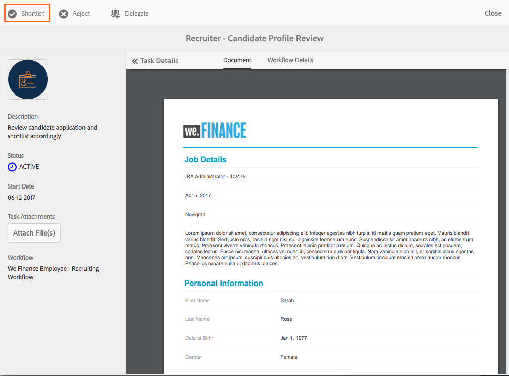

# 員工招聘參考網站逐步說明 {#employee-recruitment-reference-site-walkthrough}

## 概觀 {#overview}

We.Finance是一個組織，可讓應徵者透過參考網站入口網站來申請就業。 組織也使用入口網站來管理應徵者的面試排程、短名單和內部溝通。 網站會管理下列專案：

* 搜尋及申請工作的適用者
* 篩選和篩選候選人
* 面試程式
* 適用者詳細資訊的集合
* 候選背景檢查
* 將優惠方案轉出給選取的候選人

>[!NOTE]
>
>We.Finance和We.Gov參考網站均提供員工招募使用案例。 逐步說明中使用的範例、影像和說明使用We.Finance參考網站。 不過，您也可以執行這些使用案例，並使用We.Gov檢閱成品。 若要這麼做，請取代 **we-finance** 替換為 **we-gov** 在提及的URL中。

### 涉及的工作流程模型 {#workflow-models-involved}

員工招聘使用案例涉及兩個工作流程：

* 面試前 — 我們財務員工招募工作流程
* 面試之後 — 我們財務員工招聘貼文面試工作流程

這些工作流程是在AEM中建立的，可在以下網址找到：

`https://[authorHost]:[authorPort]/libs/cq/workflow/admin/console/content/models.html/etc/workflow/models/`

#### We Finance員工招募工作流程 {#we-finance-employee-recruiting-workflow}

以下是本檔案所遵循的「我們財務員工招聘」工作流程模型。

#### 我們財務員工招聘面試工作流程 {#we-finance-employee-recruiting-post-interview-workflow}

以下是本檔案中遵循的「我們財務員工面試後招聘」工作流程模型。

### 角色 {#personas}

此案例涉及以下角色：

* Sarah Rose，應徵者正在申請組織工作
* 招聘人員約翰·雅各布斯
* 招聘經理Gloria Rios
* HR人員John Doe

## Sarah申請工作 {#sarah-applies-for-a-job}

Sarah Rose正在組織中尋找工作機會。 她瀏覽他們的入口網站，並探索「職業」頁面上列出的職缺職位。 她找到相符的工作清單並申請。

We.Finance首頁

We.Finance職涯頁面

Sarah在職缺公告上按一下「套用」 。 工作應用程式表單隨即開啟。 她填寫應用程式中的所有詳細資料並提交它。

### 運作方式 {#how-it-works}

We.Finance首頁和職涯頁面均為AEM Sites頁面。 職涯頁面內嵌最適化表單，此表單使用可重複的面板，以使用服務擷取職缺並將它們列在頁面上。 您可以造訪以下網址查閱最適化表單： `https://[authorHost]:[authorPort]/editor.html/content/forms/af/we-finance/employee/recruitment/jobs.html`.

### 親眼看看 {#see-it-yourself}

前往 `https://[publishHost]:[publishPort]/content/we-finance/global/en.html` 並按一下 **[!UICONTROL 職業]**. 按一下 **[!UICONTROL 搜尋]** 以便您填入工作清單，然後按一下 **[!UICONTROL 套用]** 以取得工作。 填寫表單的詳細資料並提交申請。

請確保您在應用程式中指定有效的電子郵件ID，因為透過此逐步說明的任何通訊都會傳送到指定的電子郵件ID。

## John Jacobs將Sarah Rose的設定檔列入篩選名單 {#john-jacobs-shortlists-sarah-rose-s-profile-for-the-hiring-manager-s-screening}

組織會收到Sarah提交的工作申請。 招聘人員John Jacobs被指派檢視Sarah設定檔的任務。 John在其AEM收件匣中檢閱任務、尋找符合工作需求的設定檔，然後按一下「短清單」。 Sarah的個人資料會轉寄給招聘經理Gloria Rios進行核准。

John的AEM收件匣

John Jacobs將Sarah Rose的設定檔列入篩選名單

**運作方式**

「工作申請」表單中的提交動作會觸發工作流程，在John Jacob的收件匣中建立工作以篩選申請。 當John稽核並甄選申請時，工作流程會在僱用經理Gloria的收件匣中建立任務。

### 親眼看看 {#see-it-yourself-1}

前往 `https://[publishHost]:[publishPort]/content/we-finance/global/en/login.html?resource=/aem/inbox.html`並使用jjacobs/password作為John Jacobs的使用者名稱/密碼登入。 開啟「應徵者設定檔複查」作業，並將應徵者加入候選清單。

## Gloria會複查申請並核准面試的申請人 {#gloria-reviews-the-application-and-approves-the-applicant-for-an-interview}

招聘經理Gloria將入圍的個人資料視為其AEM收件匣中的工作。 她稽核並核准候選人Sarah Rose參加面試。

Gloria的AEM收件匣

Gloria核准Sarah Rose接受訪談

**運作方式**

當Gloria核准面試的候選人時，工作流程會在We.Finance的招聘人員John Doe的AEM收件匣中建立任務。

### 親眼看看 {#see-it-yourself-2}

前往 `https://[publishHost]:[publishPort]/content/we-finance/global/en/login.html?resource=/aem/inbox.html` 並使用jjacobs/password作為John Jacobs的使用者名稱/密碼登入。 開啟「應徵者設定檔複查」作業，並將應徵者加入候選清單。

前往 `https://[publishHost]:[publishPort]/content/we-finance/global/en/login.html?resource=/aem/inbox.html` 並使用grios/password作為Gloria Rios的使用者名稱/密碼登入。 開啟「應徵者設定檔複查」作業，然後按一下「排程面試」。

## John Doe安排面試 {#john-doe-schedules-an-interview}

John Doe會在收件匣中接收排程面試的任務。 John Doe會選取並開啟工作，並修正面試日期與時間、地點，以及負責面試的HR人員，稱為John Jacob。 John Doe按一下「傳送邀請電子郵件」。 系統會傳送電子郵件給Sarah，並將工作指派給僱用經理Gloria，以便與Sarah面談。

John Doe的AEM收件匣

John Doe安排面試，並將詳細資料傳送給Sarah Rose

## Sarah Rose會收到包含面試排程的電子郵件 {#sarah-rose-receives-the-email-with-interview-schedule}

Sarah Rose會收到包含面試排程、地點和其他詳細資訊的電子郵件。 Sarah按一下「接受」，表示她同意面試的排程和地點。 根據精確資訊的指引，Sarah接受了採訪。

Sarah Rose收到面試排程

## 面試結束後，招聘經理會將Sarah Rose加入候選名單 {#after-the-interviews-the-hiring-manager-shortlists-sarah-rose}

在Sarah Rose完成面試並完成面試後，招聘經理Gloria Rios會從收件匣開啟「候選人選取」工作，然後按一下「選取」。 Gloria Rios的決定已傳送給人力資源人員John Doe，以供進一步處理。

Gloria的AEM收件匣

Gloria Rios在面試後選擇Sarah Rose

## John Doe要求更多資訊 {#john-doe-requests-more-information}

要求候選人加入組織前，必須先檢查Sarah的背景。 John Doe會開啟並檢閱選取的應徵者詳細資料，並發現其部分僱用與教育詳細資料尚未填入。 John Doe點按需要更多資訊。

 

John Doe向Sarah Rose索取更多教育與工作經驗的相關資訊

## Sarah Rose收到一封電子郵件，要求進一步資訊 {#sarah-rose-receives-an-email-requesting-further-information}

Sarah Rose收到一封電子郵件，通知她需要進一步的資訊才能處理她的就業申請。 電子郵件包含填寫所需資訊之表單的連結。

Sarah Rose收到一封電子郵件，通知她需要進一步的資訊才能處理其僱用申請

Sarah按一下電子郵件中的「提供詳細資訊」連結。 隨即顯示表單。 Sarah會根據John Doe的要求填寫必要的教育和就業詳細資訊，然後按一下「提交」。

Sarah按一下電子郵件中的連結，開啟其他資訊表單

Sarah會根據John Doe的要求填寫其他資訊，然後按一下提交

## John Doe會檢閱選取的候選人設定檔，以取得提供的其他資訊 {#john-doe-reviews-the-selected-candidate-profile-for-the-additional-information-provided}

John Doe會選取候選者稽核要求並開啟它。 John Doe發現Sarah已填妥所有必要資訊。 檢閱應用程式後，John Doe按一下「核准」。 在John Doe核准後，系統會將對Sarah Rose執行背景檢查的請求轉寄給John Jacobs。

John Doe的AEM收件匣

John Doe會檢閱Sarah提供的其他資訊並加以核准

## John Jacobs收到背景檢查請求 {#john-jacobs-receives-a-background-check-request}

John Jacobs在收件匣中看到背景檢查請求。 John Jacobs會開啟工作並檢閱Sarah Rose所提供的資訊。 執行背景檢查後，John Jacobs按一下「繼續」表示背景檢查成功。

John Jacobs的AEM收件匣

執行背景檢查後，John Jacobs按一下「繼續」

## John Doe將加入信寄給Sarah Rose {#john-doe-sends-out-the-joining-letter-to-sarah-rose}

John Doe會在其AEM收件匣中收到傳送加入信件的要求。 John開啟要求並檢視詳細資料。 John Doe附加加入信件PDF，然後按一下「附加並傳送加入信件」。

John Doe的AEM收件匣

John Doe寄出加入信件以供簽署

## Sarah Rose收到並簽署加入信件 {#sarah-rose-receives-and-signs-the-joining-letter}

Sarah Rose收到簽署加入信件。 Sarah按一下這裡以檢閱並簽署加入信件。 加入信件PDF會開啟，並包含簽署檔案的欄位。

Sarah Rose收到簽署加入信件

Sarah可以選擇輸入、使用draw手寫或插入簽名影像，或使用行動裝置的觸控熒幕來繪製簽名。 Sarah輸入她的名稱，按一下「按一下以簽署」，然後下載加入信函的已簽署復本。

Sarah輸入名稱以簽署加入信件

Sarah按一下按一下即可完成加入信函的簽署
