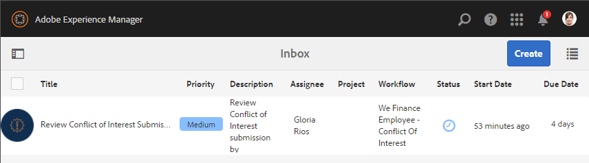

# 員工自助服務參考網站逐步介紹{#employee-self-service-reference-site-walkthrough}

## 先決條件 {#prerequisite}

依「設定和設定AEM Forms參考網站」中 [所述設定參考網站](../../forms/using/setup-reference-sites.md)。

## 概覽 {#overview}

員工自助服務系統通常由公司內部網路代管，讓員工可存取其辦公桌上提供的許多資訊和服務。 它可讓員工完全掌控工作，例如存取其雇用細節、申請休假及提交費用報表。 另一方面，它可協助組織改善程式效率並降低成本，同時讓員工隨時掌握最新資訊並參與其中。

員工自助服務參考網站會展示您如何運用AEM Forms在組織中實作員工自助服務系統。

>[!NOTE]
>
>員工自助服務逐步說明中使用的範例、影像和說明，請使用We.Finance參考網站。

## 利益衝突問卷的逐步探討 {#conflict-of-interest-questionnaire-walkthrough}

組織不時要求員工提交利益衝突問卷，以找出員工可能與組織發生衝突的外部活動或個人關係。

Sarah組織的法規遵循部門已要求員工提交利益衝突問卷。

### Sarah提交利益衝突問卷 {#sarah-submits-the-conflict-of-interest-questionnaire}

Sarah會前往其組織的入口網站，登入並按一下「員工」以存取員工儀表板。 她在員工儀表板上找到利益衝突問卷，然後按一下「套 **[!UICONTROL 用」]**。

組織入口網站

員工儀表板

Sarah使用「下一步」按鈕導覽表單，並讀取「簡介」和「定義」區段。 她會回覆「問題」區段中的問題。 最後，她簽名並提交問卷。

組織入口網站和問卷回應速度快，而且對行動裝置友好。 下列工作流程說明Sarah如何在行動裝置上導覽並提交問卷。

**運作方式**

組織入口網站和員工儀表板是AEM Sites頁面。 儀表板列出數種自助服務選項，例如利益衝突問卷。 「套用」按鈕會連結至最適化表單。

最適化表單會使用規則，根據「問題」索引標籤中提供的答案來顯示——隱藏資訊。 此外，表單使用Scribble元件在「聲明」頁籤中籤名。 請在中檢閱最適化表單 `https://[authorHost]:[authorPort]/editor.html/content/forms/af/we-finance/employee/self-service/conflict-of-interest.html`。

**親眼看看**

前往並 `https://[publishHost]:[publishPort]/content/we-finance/global/en/self-service-forms.html` 使用Sarah的使 `srose/srose` 用者名稱／密碼登入。 按一 **[!UICONTROL 下「員工]** 」以存取控制面板，然後按一下「 **[!UICONTROL Apply]** on Conflict of Interest」（對利益衝突問卷套用）。 審查並提交調查表。

#### Gloria審查並核准利益衝突問卷提交 {#gloria-reviews-and-approves-the-conflict-of-interest-questionnaire-submission}

Sarah提交的利益衝突問卷已指派給Gloria Rios進行審查。 Gloria在組織中擔任法規遵循官。 Gloria會登入她的AEM Inbox並檢閱指派給她的工作。 她核准了莎拉提交的問卷，並完成了工作。

格洛麗亞的收件匣

開啟任務

**運作方式**

「利益衝突」調查表中的提交動作會觸發在Gloria收件匣中建立工作以進行核准的工作流程。 在以下位置查看表單工作流： `https://[authorHost]:[authorPort]/editor.html/conf/global/settings/workflow/models/we-finance/employee/self-service/we-finance-employee-conflict-of-interest.html`

**親眼看看**

前往並 `https://[publishHost]:[publishPort]/content/we-finance/global/en/login.html?resource=/aem/inbox.html` 使用Gloria Rios的 `grios/password` 使用者名稱／密碼登入。 開啟為利益衝突調查表建立的任務並予以批准。

## 公司資訊卡應用程式逐步說明 {#corporate-card-application-walkthrough}

莎拉經常出差，她需要一張公司信用卡來支付搬家時的賬單。 她透過公司的員工入口網站申請公司卡。

### Sarah提交公司卡申請 {#sarah-submits-the-corporate-card-application}

Sarah會前往其組織的入口網站，登入並按一下「員工」 **** ，以存取員工儀表板。 她在員工儀表板上找到公司卡應用程式，然後按一下「應 **[!UICONTROL 用」]**。

組織入口網站

員工儀表板

她按一 **[!UICONTROL 下「套用]** 」公司資訊卡應用程式。 單頁應用程式隨即開啟。 她會填寫所有詳細資料，並按 **[!UICONTROL 一下「套用]** 」以送出應用程式。

**運作方式**

組織入口網站和員工儀表板是AEM Sites頁面。 控制面板會列出數個自助服務選項，例如公司資訊卡應用程式。 應用程式上的「套用」按鈕會連結至最適化表單。

適用於公司資訊卡應用程式的最適化表單是簡單、單頁、自適應的最適化表單。 它使用文字、電話、數字方塊、數字步進器等基本的自適應表單元件。 請在以下網址查看最適化表單：\
`https://[authorHost]:[authorPort]/editor.html/content/forms/af/we-finance/employee/self-service/corporate-card.html`.

**親眼看看**

前往並 `https://[publishHost]:[publishPort]/content/we-finance/global/en/self-service-forms.html` 使用Sarah的使 `srose/srose` 用者名稱／密碼登入。 按一 **[!UICONTROL 下「員工]** 」以存取控制面板，然後按一下「 **[!UICONTROL 套用公司卡]** 」應用程式。 填寫詳細資訊，並提交申請。

### Gloria審閱並核准公司資訊卡申請 {#gloria-reviews-and-approves-the-corporate-card-application}

Sarah提交的公司卡申請會指派給Gloria Rios進行審查。 Gloria會登入她的AEM Inbox並檢閱指派給她的工作。 她批准了Sarah提交的申請，完成了任務。

格洛麗亞的收件匣

開啟任務

**運作方式**

Corporate Card應用程式中的提交工作流程會觸發Forms工作流程，在Gloria的收件匣中建立工作以進行核准。 在以下位置查看表單工作流： `https://[authorHost]:[authorPort]/editor.html/conf/global/settings/workflow/models/we-finance/employee/self-service/we-finance-employee-corporate-card.html`

**親眼看看**

前往並 `https://[publishHost]:[publishPort]/content/we-finance/global/en/login.html?resource=/aem/inbox.html` 使用Gloria Rios的 `grios/password` 使用者名稱／密碼登入。 開啟為公司資訊卡應用程式建立的工作並加以核准。

## 費用報表提交逐步說明 {#expense-report-submission-walkthrough}

當莎拉在出差期間花費時，她需要提交費用報告以申請批准。 其組織中的自助服務選項可讓她線上提交費用報表。

### Sarah提交費用報表申請 {#sarah-submits-the-expense-report-application}

Sarah會前往其組織的入口網站，登入並按一下「員工」 **** ，以存取員工儀表板。 她在員工儀表板上找到「費用報表」應用程式，然後按一下「 **[!UICONTROL 應用」]**。

組織入口網站

員工儀表板

她按一下「 **[!UICONTROL 套用]** 」至「費用報表」應用程式。 隨即開啟一個應用程式表單，其中有兩個標籤- 「報表名稱」和「報表詳細資訊」。 「報 **表詳細資料** 」標籤中的+圖示可讓她在單一報表中新增超過支出。

組織入口網站和應用程式回應速度快，而且適合行動裝置使用。 下列工作流程顯示Sarah如何在其行動裝置上導覽及提交費用報表。

**運作方式**

組織入口網站和員工儀表板是AEM Sites頁面。 控制面板列出數個自助服務選項，例如「費用報表」應用程式。 「套用」按鈕會連結至最適化表單。

最適化表單中的「報表名稱」和「報表詳細資料」標籤是「面板」元件。 「報表詳細資訊」面板包含「費用」面板。 它是可重複的面板，可讓您在報表中新增多項支出。 請在上查看最適化表單及其配置 `https://[authorHost]:[authorPort]/editor.html/content/forms/af/we-finance/employee/expense-report.html`。

**親眼看看**

前往並 `https://[publishHost]:[publishPort]/content/we-finance/global/en/self-service-forms.html` 使用Sarah的使 `srose/srose` 用者名稱／密碼登入。 按一下 **[!UICONTROL 員工]** ，訪問控制面板，然後按一下「應 **[!UICONTROL 用費用報表]** 」應用程式。 填寫詳細資訊並提交申請。

### Gloria審閱並批准費用報表 {#gloria-reviews-and-approves-the-expense-report}

Sarah提交的費用報表會指派給Gloria Rios進行審核。 Gloria會登入她的AEM Inbox並檢閱指派給她的工作。 她批准了Sarah提交的申請，完成了任務。

格洛麗亞的收件匣

開啟任務

**運作方式**

「費用報表」應用程式中的提交工作流會觸發Forms工作流，該工作流會在Gloria的收件箱中建立一個任務以供批准。 在以下位置查看表單工作流： `https://[authorHost]:[authorPort]/editor.html/conf/global/settings/workflow/models/we-finance/employee/self-service/we-finance-employee-expense-report-workflow.html`

**親眼看看**

前往並 `https://[publishHost]:[publishPort]/content/we-finance/global/en/login.html?resource=/aem/inbox.html` 使用Gloria Rios的 `grios/password` 使用者名稱／密碼登入。 開啟為「費用報表」應用程式建立的任務並批准。

## 離開應用程式逐步解說 {#leave-application-walkthrough}

莎拉計畫下個月放假，並想申請一週的休假。

### Sarah提交休假申請 {#sarah-submits-the-leave-application}

Sarah會前往其組織的入口網站，登入並按一下「員工」 **** ，以存取員工儀表板。 她會在員工儀表板上找到離開應用程式，然後按一下「 **[!UICONTROL 套用」]**。

組織入口網站

員工儀表板

離開應用程式會開啟，其中會填入Sarah的姓名，並預先填入表單中的員工ID。 它還顯示了她的假期餘額和歷史。 她填寫了請假細節，並提交申請以申請批准。

組織入口網站和應用程式回應速度快，而且適合行動裝置使用。 下列工作流程顯示Sarah如何在行動裝置上導覽及提交應用程式。

**運作方式**

組織入口網站和員工儀表板是AEM Sites頁面。 儀表板列出數個自助服務選項，例如leave應用程式。 「套用」按鈕會連結至最適化表單。

離職申請的適應性表單基於員工離職表單資料模型。 在「剩餘假期」部分中，使用「表單資料模型」服務來填 `getLeavesOf` 充剩餘假期表。 「開始日期」和「結束日期」欄位會使用規則來驗證日期值是否等於目前日期或之後。 使用函式計算離開持續 `calcBusinessDays` 時間。

您可以在以下位置查看最適化表單和表單資料模型：

`https://[authorHost]:[authorPort]/editor.html/content/forms/af/we-finance/employee/self-service/leave-application.html`

`https://[authorHost]:[authorPort]/aem/fdm/editor.html/content/dam/formsanddocuments-fdm/db`

**親眼看看**

前往並 `https://[publishHost]:[publishPort]/content/we-finance/global/en/self-service-forms.html` 使用Sarah的使 `srose/srose` 用者名稱／密碼登入。 按一 **[!UICONTROL 下「員工]** 」以存取控制面板，然後按一下「 **[!UICONTROL 在離開應用程式時套用]** 」。 填寫詳細資訊並提交申請。

#### Gloria審查並核准休假申請 {#gloria-reviews-and-approves-the-leave-application}

Sarah提交的休假申請被指派給Gloria Rios進行審查。 Gloria會登入她的AEM Inbox並檢閱指派給她的工作。 她批准了Sarah提交的申請，完成了任務。

格洛麗亞的收件匣

開啟任務

**運作方式**

leaf應用程式中的提交工作流將觸發Forms工作流，該工作流將在Gloria的收件箱中建立一個任務以供批准。 在以下位置查看表單工作流： `https://[authorHost]:[authorPort]/editor.html/conf/global/settings/workflow/models/we-finance/employee/self-service/we-finance-employee-leave-application.html`

**親眼看看**

前往並 `https://[publishHost]:[publishPort]/content/we-finance/global/en/login.html?resource=/aem/inbox.html` 使用Gloria Rios的 `grios/password` 使用者名稱／密碼登入。 開啟為離開應用程式而建立的工作並加以核准。
