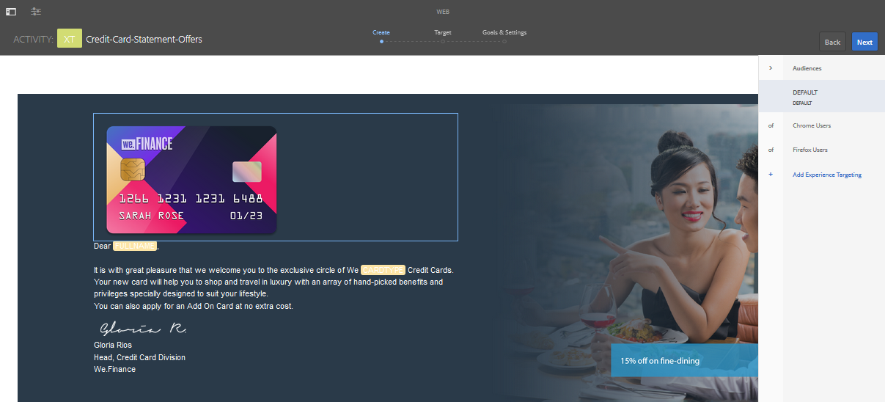

# 在AEM Forms中建立目標體驗 {#create-targeted-experiences-in-aem-forms}

## 將Adobe target與AEM Forms整合 {#integrate-adobe-target-with-aem-forms}

與AEM整合的Adobe Target可讓您為目標受眾建立自訂的體驗。 有了Adobe Target，您可以建立A/B測試、測量使用者回應，以及為目標使用者產生自訂的網頁內容。 您可以將Adobe target與AEM Forms整合，以針對最適化表單和互動式通訊的影像元件進行定位。

在AEM中設定Adobe Target以搭配最適化表單和互動式通訊使用，請參閱「在AEM中 [建立Target設定](/help/sites-administering/target.md) 」 [和「新增架構」](/help/sites-administering/target.md)。

>[!NOTE]
>
>當使用主機名稱或IP位址轉譯您的最適化表單或互動式通訊時，定位即可運作。 當您使用localhost轉換最適化表單或互動式通訊時，此功能會失敗。

## 建立Target活動 {#creating-a-target-activity}

1. 點選 **「Adobe Experience Manager >個人化>活動」**。

   `https://<hostname>:<port>/libs/cq/personalization/touch-ui/content/v2/activities.html`

1. 在「活動」頁面中，點選「 **建立>建立品牌」**。
1. 系統會要求您選擇範本並輸入屬性。

   選取範本，點選「下 **一步」。** 在「屬性」區段中輸入品牌標題，然後點選「建 **立」。**
您的品牌現在會列在「活動」頁面中。

1. 在「活動」頁面中點選您的品牌。
1. 在您品牌的「主版區域」中，點選「 **建立** > **建立活動」**。

   當您建立活動時，可以指定其詳細資訊、目標和設定。

   「詳細資訊」區段包含名稱、定位引擎和目標。 當您選取Adobe target做為定位引擎時，就會啟用Target雲端設定選項。 選擇您的Target雲端設定、選擇「活動類型」、提供活動目標，然後點選「下 **一步**」。 互動式通訊僅支援體驗定位活動類型。

   「目標」區段可讓您新增觀眾體驗並命名。 按一 **下「新增體驗** 」以啟用「選 **取對象** 」和「 **命名體驗** 」選項。 點選 **「選取對象** 」以查看對象及其來源的清單。 從「對象名稱」清單中選取對象。 點選 **「新增體驗** 」以命名體驗，點選「下 **一步」**。

   「目標與設定」區段可讓您排程活動並排定活動的優先順序。 設定活動的開始日期、結束日期和優先順序、目標量度、其他量度，然後點選「儲 **存」**。

   活動現在會列在您的品牌頁面中。

   >[!NOTE]
   >
   >您可以忽略「您的活動已儲存，但未同步至Target」錯誤。 原因：如果在儲存活動時遇到下列體驗沒有選件」。

1. 若要啟用目標，請編輯。jsp檔案，以包含您最適化表單範本所使用的用戶端程式庫。

   例如，在現成可用的實作中，按一下「工 **具** > **CRXDE Lite**」。

   在CRXDE Lite位址列中，輸入/libs/fd/af/components/page/base/head.jsp以編輯head.jsp檔案。

   此實作使用simpleEnrollment範本。 在此實施中，修改head.jsp檔案以包括以下客戶端庫：

   `<cq:include script="/libs/cq/cloudserviceconfigs/components/servicelibs/servicelibs.jsp"/>`

   `<cq:include path="clientcontext_optimized" resourceType="/libs/cq/personalization/components/clientcontext_optimized"/>`

   `<cq:include path="config" resourceType="cq/personalization/components/clientcontext_optimized/config"/>`

1. 若要啟用最適化表單的目標架構，請導覽至您的表單或互動式通訊，然後在編輯模式中開啟它。

   若要在編輯模式中開啟表單或互動式通訊，請點選「 **選取** 」，然後點選「 **開啟」**。

   或者，當您將指標移至表格或互動式通訊圖示上時，不需選取它，就會顯示4個按鈕。 您可以點選出現 **的「編輯** 」按鈕，以在編輯模式中開啟表單。

1. 在頁面工具列中，點選「頁 **面資訊** >開啟 **屬性」**。
1. 在「一般」索引標籤中，選擇 **Adobe Target欄位的設定** 。 點選「 **儲存並關閉**」。

## 將建立的活動應用於自適應表單影像或互動式通信影像 {#applying-created-activity-to-an-adaptive-form-image-or-an-interactive-communication-image}

1. 開啟最適化表單和互動式通訊以進行編輯。 如果您要開啟互動式通訊，請開啟「網路頻道」。

1. 在互動式通訊或調適性表單的製作模式中，新增要定位的影像。

   >[!NOTE]
   >
   >AEM Forms僅支援定位影像元件。 請確定影像元件所在的面板不包含任何其他元件，且面板的欄數設為1。

1. 從「編 **輯** 」切換 **至「定位** 」模式。 切換模式的選項位於右上角。
1. 選取 **品牌**、選取 **活動**，並點選「開始 **定位」**。 「對 **像** 」功能表會出現在編輯器的右側。

   

1. 從「觀眾」選單中選 **取觀眾** ，然後點選影像以定位。 隨即出現一個菜單。 在功能表中，點選「 **Target」**。 點選影像並點選「 **設定**」。 在「屬性」視窗中，選取要針對所選對象顯示的影像。 對所有觀眾重複此步驟。 互動式通訊或調適性表單中的影像已啟用體驗定位。

## 檢查已建立的活動是否與Target伺服器同步 {#check-if-the-created-activity-syncs-with-the-target-server}

用於定位與Target伺服器同步的活動。 若要檢查您的活動是否與目標伺服器同步，請檢查您品牌頁面中活動的狀態。

請確定活動的狀態為「同步」。

## 驗證Target行為 {#validate-target-behavior}

要驗證Target行為：

* 在作者模式 `wcmmode preview` 中使用定位功能
* 在發佈模式 `wcmmode preview` 中搭 `wcmmode disabled` 配使用定位

## 影像元件的螢幕定位 {#monitor-targeting-for-the-image-component}

若要監控表單上影像元件的定位，請發佈您的影像、活動和最適化表單。

## 未結問題 {#open-issues}

可見性運算式，針對最適化表單上的目標影像設定焦點失敗。
