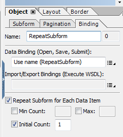

# HTML5表單常見問題集{#frequently-asked-questions-faq-for-html-forms}

關於HTML5表單版面配置、指令碼支援和範圍的一些常見問題集(FAQ)。

## 配置 {#layout}

1. 為什麼中的條形碼和簽名欄位沒有出現在我的表單中？

   答案：條碼和簽名欄位在HTML或行動情境中無關。 這些欄位會以非互動式區域顯示。 不過，AEM Forms Designer提供新的簽名手寫欄位，可供使用，而非簽名欄位。 您也可以為條碼新增[自訂Widget](../../forms/using/custom-widgets.md)並加以整合。

1. XFA文字欄位是否支援RTF?

   答案：不支援在AEM Forms Designer中允許豐富內容的XFA欄位，並且會呈現為一般文字，不支援從使用者介面使用樣式。 此外，具有comb屬性的XFA欄位會顯示為一般欄位，但根據comb位數的值，允許的字元數仍有限制。

1. 使用可重複子表單是否有任何限制？

   答案：可重複的子表單的初始計數應為1或更多。 不支援初始計數為零的可重複子表單。 您也可以選擇使用可重複的子表單，而不會在表單載入時顯示。 要實現使用案例：

   1. 將可重複子表單的初始計數設為1。

      

   1. 使用表單的初始化事件來隱藏子表單的主要例項。 例如，以下程式碼會在表單初始化時隱藏子表單的主要例項。 也會驗證應用程式類型，以確保指令碼僅在用戶端執行：

      ```javascript
      if ((xfa.host.appType == "HTML 5" || xfa.host.appType == "Exchange-Pro" || xfa.host.appType == "Reader")&&(_RepeatSubform.count == 1)&&(form1.Page1.Subform1.RepeatSubform.Key.rawValue == null)) {
      RepeatSubform.presence = "hidden";
      }
      ```

   1. 開啟指令碼，以新增子表單的例項以進行編輯。 新增程式碼，如下所示，以新增子表單指令碼的例項。

      以下代碼將檢查子表單的隱藏實例。 如果找到子表單的隱藏實例，請刪除子表單的隱藏實例，並插入子表單的新實例。 如果找不到子表單的隱藏實例，則只需插入子表單的新實例即可。

      ```javascript
      if (RepeatSubform.presence == "hidden")
      {
      RepeatSubform.instanceManager.insertInstance(0);
      RepeatSubform.instanceManager.removeInstance(1);
      }
      else
      {
      RepeatSubform.instanceManager.addInstance(1);
      }
      ```

   1. 開啟指令碼，以移除子表單的例項以進行編輯。 新增下列程式碼，以移除子表單指令碼的例項。

      程式碼會檢查子表單的計數。 如果子表單的計數達到1，程式碼會隱藏子表單，而非刪除子表單。

      ```javascript
      if (RepeatSubform.instanceManager.count == 1) {
      RepeatSubform.presence = "hidden";
      } else {
      RepeatSubform.instanceManager.removeInstance(RepeatSubform.instanceManager.count - 1);
      }
      ```

   1. 開啟表單的預先提交事件以進行編輯。 將下列指令碼新增至事件，以在編輯前移除指令碼的隱藏例項。 如此可防止在提交時傳送隱藏子表單的資料。

      ```javascript
      if(RepeatSubform.instanceManager.count == 1 && RepeatSubform.presence == "hidden") {
      RepeatSubform.instanceManager.removeInstance(0);
      }
      ```

1. 使用隱藏的子表單有任何限制嗎？

   答案：跨頁面分割的具有複雜階層的隱藏子表單會造成版面問題。 因應措施是將子表單標示為最初可見，然後根據某些邏輯或資料在初始化指令碼中隱藏。

1. 為何HTML5中有些文字會遭截斷或顯示錯誤？

   答案：如果「繪圖」或「註解」文字元素未獲得足夠空間來顯示內容，文字會在行動表單轉譯中顯示為截斷。 AEM Forms Designer的「設計」檢視中也會顯示此截斷。 雖然此截斷可在PDF中處理，但無法在HTML5表單中處理。 為避免此問題，請提供足夠的空間來繪製或註解文字，這樣在AEM Forms Designer的設計模式中不會截斷。

1. 我正在觀察與遺失內容或內容重疊相關的版面問題。 原因何在？

   答案：如果在同一位置（如矩形）存在「繪製文本」或「繪製影像」元素以及另一個重疊元素，則如果「繪製文本」內容以文檔順序的後面出現(在「AEM Forms設計器層次結構」視圖中)，則它不可見。 PDF支援透明分層，但HTML/瀏覽器不支援透明分層。

1. 為什麼HTML表單中顯示的某些字型與設計表單時使用的字型不同？

   答案：HTML5表單不內嵌字型(與字型內嵌於表單內的PDF forms不同)。 要使表單的HTML版本如預期呈現，請確保在XDP中指定的字型可在伺服器和用戶端電腦上使用。 如果伺服器上沒有所需字型，則使用回退字型。 此外，如果您在表單模板中使用客戶端設備上不提供的字型，則使用瀏覽器的預設字型來呈現文本。

1. HTML表單中是否支援vAlign和hAlign屬性？

   是的，支援vAlign和hAlign屬性。 Internet Explorer和多行欄位中不支援vAlign屬性。

1. HTML5表單是否支援希伯來字元？

   HTML5表單支援除Microsoft Internet Explorer外的所有瀏覽器中的希伯來字元。

1. HTML5表單對數值欄位是否有任何限制？

   答案：是的，HTML5表單有幾項限制。 如果位數大於子句中指定的計數，則數字不本地化，並以英語地區顯示。

1. 為何HTML表單大小比PDF forms大？

   將XDP轉譯為HTML表單時，需要許多中間資料結構和物件，例如表單dom、資料dom和版面dom。

   針對PDF forms,Adobe Acrobat有內建XTG引擎，可建立中間資料結構和物件。 Acrobat也會處理版面配置和指令碼。

   若為HTML5表單，瀏覽器沒有內建XTG引擎，無法從原始XDP位元組建立中繼資料結構和物件。 因此，對於HTML5表單，會在伺服器上產生中間結構並傳送至用戶端。 在用戶端，JavaScript型指令碼和版面引擎會使用這些中間結構。

   中間結構的大小取決於原始XDP和與XDP合併的資料的大小。

1. 在xdp中使用表格是否有任何限制？

   答案：複雜的表格會在呈現中造成問題。

   * 不支援表內的節(SubformSet)。
   * 某些表格中的頁首或頁尾列會標籤為重複。 將這些表格分割成多個頁面可能會遇到一些問題。

1. 可訪問的表是否有任何限制？

   答案：是的，可存取的表格有下列限制：

   * 不支援表內的嵌套表和子表單。
   * 表格的上行或左列僅支援標題。 中間表格元素不支援標題。 您可以將標題套用至多個列，並支援欄標題，前提是所有這類列和欄以及表格的最頂端或最左側的欄。
   * `Rowspan`不 `colspan`支援來自表格內的隨機位置。

   * 您無法動態新增或移除包含列跨值大於1之元素的列例項。

1. 螢幕助讀程式的工具提示和註解的閱讀順序為何？

   * 當字幕和工具提示同時存在時，將讀取唯一的字幕。 如果註解不可用，則讀取工具提示。 您也可以使用表單設計工具指定XDP中讀取的優先順序
   * 當您暫留元素時，會顯示工具提示。 如果工具提示不可用，則顯示語音文本。 如果語音文本不可用，則顯示欄位名稱。

1. 暫留欄位時，會顯示工具提示。 如何停用？

   若要停用暫留時的工具提示，請在設計工具的協助工具面板中選取「無」。

1. 在「設計器」中，用戶可以配置單選按鈕和複選框的自定義外觀屬性。 是否，在轉譯表單時，HTML5表單會考量到這類自訂外觀屬性？

   答案：HTML5表單會忽略選項按鈕和核取方塊的自訂外觀屬性。 選項按鈕和核取方塊會依據基礎瀏覽器的規格顯示。

1. 在支援的瀏覽器中開啟HTML5表單時，相鄰放置的欄位邊框未正確對齊或子表單顯示重疊。 在Forms Designer中預覽相同的HTML5表單時，欄位和版面不會顯示不對齊，子表單會顯示在正確的位置。 如何修正問題？

   將子表單設定為流內容且子表單具有隱藏的邊框元素時，相鄰放置的欄位的邊框不正確對齊或子表單顯示重疊。 若要解決此問題，您可以從對應的XDP中移除或註解隱藏的&lt;border>元素。 例如，下列&lt;border>元素會標示為註解：

   ```xml
               <!--<border>
                  <edge presence="hidden"/>
                  <corner thickness="0.175mm" presence="hidden"/>
               </border> -->
   ```

1. 為何螢幕助讀程式無法正確搭配「日期/時間」欄位物件運作？

   螢幕助讀程式不支援日期/時間欄位。 不過，您可以手動輸入欄位的日期/時間，讓螢幕助讀程式讀取。 使用工具提示或螢幕助讀程式文字，指示使用者手動選取欄位的日期/時間。

1. HTML5表單是否支援浮動欄位的顯示模式？

   答案：HTML5表單不支援浮動欄位的顯示模式。

### 指令碼 {#scripting}

1. HTML Forms的JavaScript實施有任何限制嗎？

   答案:

   * 對xfa.connectionSet指令碼的支援有限。 對於connectionSet，僅支援Web服務的伺服器端調用。 有關詳細資訊，請參閱[指令碼支援](/help/forms/using/scripting-support.md)。
   * 用戶端指令碼中不支援$record和$data。 不過，如果指令碼是以formReady、layoutReady區塊撰寫，指令碼仍可運作，因為這些事件會在伺服器端執行。
   * 不支援XFA Draw元素特定指令碼，例如變更Draw文字（或欄位中的註解文字）。

1. 使用formCalc是否有任何限制？

   答案：目前僅實施formCalc指令碼的子集。 有關詳細資訊，請參閱[指令碼支援](/help/forms/using/scripting-support.md)。

1. 是否有任何建議的命名慣例，以及是否有任何保留的關鍵字要避免？

   * 在AEM Forms Designer中，建議不要以底線(_)開頭物件的名稱（例如子表單或文字欄位）。 若要在名稱的開頭使用底線，請在底線後面加上前置詞： _&lt;prefix>&lt;objectname>。
   * 所有HTML5表單API都是保留的關鍵字。 對於自訂API/函式，請使用與[HTML5表單API](/help/forms/using/scripting-support.md)不相同的名稱。

1. HTML5表單是否支援浮動欄位？

   是，HTML5 Forms支援浮動欄位。 若要啟用浮動欄位，請將下列屬性新增至呈現設定檔：

   >[!NOTE]
   >
   >預設不會為浮動欄位啟用。 您可以使用Forms設計工具來設定欄位的浮動屬性。

   1. 開啟CRXde lite並導覽至`/content/xfaforms/profiles/default`節點。
   1. 新增字串類型的屬性`mfDataDependentFloatingField`，並將屬性的值設為`true`。
   1. 按一下「**全部保存**」。 現在，可使用更新的演算設定檔，為HTML Forms啟用浮動欄位。

      >[!NOTE]
      >
      >要在不更新呈現配置檔案的情況下啟用特定表單的浮動欄位，請將mfDataDependentFloatingField=true屬性作為URL參數傳遞。

1. HTML5表單會多次執行初始化指令碼和表單就緒事件嗎？

   是的，初始化指令碼和表單就緒事件會執行多次，至少在伺服器上執行一次，在用戶端執行一次。 建議您根據某些業務邏輯（表單或欄位資料）編寫初始化或form:ready事件之類的指令碼，以便根據資料和等冪狀態（如果資料相同）執行動作。

### 設計XDP {#designing-xdp}

1. HTML5表單中是否有任何保留的關鍵字？

   答案：所有HTML5表單API都是保留的關鍵字。 對於自訂API/函式，請使用與[HTML5表單API](/help/forms/using/scripting-support.md)不相同的名稱。 除了保留的關鍵字外，如果您使用以下划線(_)開頭的對象名稱，建議在下划線後面添加唯一的前置詞。 新增首碼有助於避免與HTML5表單內部API發生任何可能的衝突。 例如， `_fpField1`
