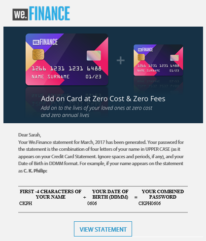
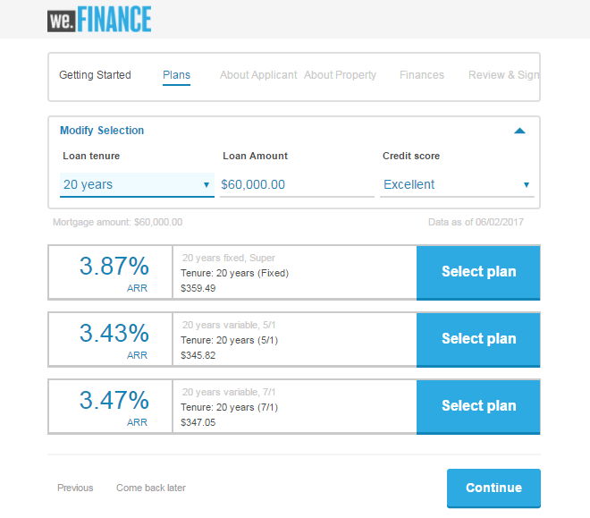

# We.Finance參考網站逐步說明{#we-finance-reference-site-walkthrough}

## 先決條件 {#pre-requisites}

依「設定和設定AEM Forms參考網站」中 [所述設定參考網站](../../forms/using/setup-reference-sites.md)。

## We.Finance參考網站藍本 {#we-finance-reference-site-scenarios}

We.Finance是金融服務領域的領先組織，提供全面且個人化的財務解決方案，以符合不同客戶個人檔案的需求。 提供信用卡，房屋抵押，房屋保險等服務。

他們的目標是透過偏好的裝置接觸現有和潛在客戶、說明其服務的優點，並協助他們註冊服務。 此外，他們還希望推銷更多金融產品，如客戶可能會覺得有趣的附加卡。

閱讀We.Finance使用案例的詳細逐步說明，並瞭解AEM Forms如何協助金融組織達成其目標。 涵蓋下列逐步介紹：

* [信用卡申請逐步說明](#credit-card-application-walkthrough)
* [房屋抵押申請逐步說明](#home-mortgage-application-walkthrough)
* [Microsoft Dynamics的家庭抵押申請逐步說明](#home-mortgage-application-walkthrough-with-microsoft-dynamics)
* [家庭保險申請逐步說明](#home-insurance-application-walkthrough)
* [財富管理漫談](#wealthmanagementwalkthrough)
* [汽車保險申請逐步說明](#autoinsuranceapplicationwalkthrough)

## 信用卡申請逐步說明 {#credit-card-application-walkthrough}

We.Finance信用卡應用方案涉及以下角色：

* We.Finance客戶Sarah Rose
* Gloria Rios,We.Finance信用卡與抵押部門主管

以下資訊圖表說明信用卡應用程式的逐步工作流程。

讓我們詳細檢視參考網站案例，以瞭解AEM Forms如何協助We.Finance達成其目標。

### Sarah從We.Finance收到電子報並申請信用卡 {#sarah-receives-a-newsletter-from-we-finance-and-applies-for-a-credit-card}

莎拉·羅斯是We.Finance的現有客戶。 她從We.Finance收到一份有關新信用卡優惠的電子報。 她覺得這些優惠令人興奮，並決定申請信用卡。 她按一下電子報中的「立即套用」按鈕，這會帶她進入We.Finance入口網站的信用卡應用程式。

#### 運作方式 {#how-it-works}

傳送給Sarah的電子報是自訂實作，會觸發電子郵件至指定的電子郵件ID。 電子郵件中的「立即套用」按鈕會連結至信用卡應用程式，這是發佈例項上的最適化表單。

#### 親眼看看 {#see-it-yourself}

在發佈例項上開啟下列URL，以觸發電子報電子郵件。 請確定您取代為有 `[emailID]` 效的電子郵件帳戶，以接收電子報。 開啟電子報，然後按 **[!UICONTROL 一下「立即套用]** 」以前往信用卡應用程式。

`https://[publishServer]:[publsihPort]/content/campaigns/we-finance/start.html?app=cc&email=[emailID]&givenName=Sarah&familyName=Rose`

### 莎拉覺得這個提議很有趣，並選擇申請 {#sarah-finds-the-offer-interesting-and-chooses-to-apply}

Sarah決定申請信用卡，並點選電 **子郵件上的Apply** Now按鈕。 Sarah會帶到We.Finance門戶上的信用卡申請。 應用程式表單是使用卡片版面以章節組織。

Sarah從可用選項中選擇信用卡，然後按一下「繼 **[!UICONTROL 續」]**。

在「個人資訊」頁面上，當Sarah提供其社會安全號碼時，她會收到提示以其認證登入。

Sarah是We.Finance的現有客戶。 她以We.Finance帳戶認證登入，而且表單中會自動填入個人詳細資訊。 Sarah會繼續填寫申請表，此時會出現提醒，提醒她必須參加會議。 她按一 **[!UICONTROL 下「儲存我的進度]** 」在申請表單上。 它會儲存Sarah目前填入的所有資訊，並彈出對話方塊，確認她是否想要收到電子郵件，其中包含草稿應用程式的連結，以供日後完成。

Sarah按一下「 **[!UICONTROL 發送郵件」]**。 她收到一封電子郵件，內含繼續申請信用卡的連結。

**Sarah從行動裝置存取信用卡應用程式**

如果Sarah正在從行動裝置存取信用卡應用程式，回應式應用程式會在針對行動裝置最佳化的檢視中開啟。 在此視圖中，應用程式表單一次呈現為一個部分。 它可讓Sarah在導覽應用程式時，逐步檢視和提供資訊。

**運作方式**

「立 **即應用** 」按鈕會將Sarah引導至信用卡應用程式。 應用程式是可調式表單，您可在網頁上的編寫例項中檢視 `https://[host]:[Port]/editor.html/content/forms/af/we-finance/cc-app.html`。

您可以在最適化表單中檢視的一些主要功能包括：

* 它以XSD架構為基礎。
* 它是使用樣式的We Finance Theme a和版面的We.Finance範本建立。 此外，它在行動導覽的表單標題版面中使用不含面板標題的版面。 當從行動裝置開啟時，會顯示漸進式行動版面。 您可以在上查看模 `https://[host]:[Port]/libs/wcm/core/content/sites/templates.html/conf/we-finance` 板，以及在上查看主題 `https://[host]:[Port]/editor.html/content/dam/formsanddocuments-themes/we-finance/we-finance-theme-a/jcr:content`。
* 它包含可調式表單規則，以叫用表單資料模型服務，以預先填入使用者的使用者詳細資料。 它還會叫用服務，根據表單中提供的社保號碼或電子郵件地址來預先填寫資訊。 您可以在上查看表單資料模型及其服務 `https://[host]:[Port]/aem/forms.html/content/dam/formsanddocuments-fdm`。
* 它使用各種可調式表單元件來擷取輸入並適應使用者回應。 它也使用支援HTML5輸入類型的電子郵件等元件。
* 它使用「簽名步驟」元件來顯示已完成的表單，並允許在表單上進行電子簽名。
* 「儲存我的進度」按鈕會為使用者產生唯一的ID，並將部分填入的應用程式儲存為AEM儲存庫的節點中的草稿。 此外，它還顯示一個對話方塊，請求允許傳送含有草稿應用程式節點連結的電子郵件。 確認對話框上的「發送郵件」按鈕會觸發電子郵件，其中包含包含草稿的節點的連結。
* 它會使用「叫用AEM工作流程」提交動作來觸發信用卡核准工作流程。 您可以在 `https://[host]:[Port]/editor.html/conf/global/settings/workflow/models/we-finance-credit-card-workflow.html`

建議您檢閱表單，以瞭解用於建立表單的架構、元件、規則、表單資料模型、表單工作流程和提交動作。

此外，請參閱下列檔案，以取得信用卡應用程式最適化表單中所使用功能的詳細資訊：

* [製作最適化表單簡介](../../forms/using/introduction-forms-authoring.md)
* [使用XML架構建立最適化表單](../../forms/using/adaptive-form-xml-schema-form-model.md)
* [規則編輯器](../../forms/using/rule-editor.md)
* [主題](../../forms/using/themes.md)
* [資料整合](../../forms/using/data-integration.md)
* [在最適化表單中使用Adobe Sign](../../forms/using/working-with-adobe-sign.md)
* [OSGi上的表單導向工作流程](../../forms/using/aem-forms-workflow.md)

**親眼看看**

當以Sarah rose的身分登入時，按一下信用 **卡應用程式上的** 「立即套用」按鈕。 填寫一些詳細資訊、探索各種調適性表單元件，然後按一下「 **Save my progress** 」（儲存我的進度），接收含有連結至草稿應用程式之「 **Resume** 」（繼續）按鈕的電子郵件。 請確定您在應用程式表單中指定您的電子郵件ID以接收電子郵件。

請參閱We.Finance主題：

`https://<host>:<AuthorPort>/editor.html/content/dam/formsanddocuments-themes/we-Finance/we-Finance-Theme-A/jcr:content`

您可以在以下網址查看We.Finance模板：

`https://<host>:<AuthorPort>/editor.html/conf/we-finance/settings/wcm/templates/we-finance-template/structure.html`

### Sarah繼續提交申請 {#sarah-resumes-and-submits-the-application}

莎拉稍後回來，從We.Finance找到一封電子郵件。 她按下電 **子郵件中** 「繼續」按鈕，接著她前往信用卡申請草稿。 她先前填寫的資訊會預先填入。 她會填寫剩餘的申請表，簽署申請表，然後提交。

或者，她也可以在We.Finance首頁的 **My Forms** （我的表單）下存取草稿申請。

#### 運作方式 {#how-it-works-1}

電子郵件中的「繼續」按鈕會將Sarah重新導向至包含其草稿應用程式的節點。

#### 親眼看看 {#see-it-yourself-1}

您必須已收到電子郵件，其中包含填寫申請表時指定之電子郵件ID上草稿應用程式的連結。 請繼續，填寫申請中的其餘章節，然後送出。

### We.Finance接收並核准應用程式 {#approving-the-application}

We.Finance收到Sarah提交的信用卡申請。 Gloria Rios會指派一項工作。 她會在AEM Inbox中檢閱工作，並核准。

#### 運作方式 {#how-it-works-2}

當Sarah填寫並提交信用卡應用程式時，Gloria的AEM收件匣中會觸發「表單工作流程」並建立工作。

OSGi上的AEM Forms提供以表單為中心的工作流程，讓您建立以表單為基礎的調適性工作流程。 這些工作流程可用於審閱與核准、商業程式流程、開始檔案服務、與Adobe Sign簽名工作流程整合等。 如需詳細資訊，請參 [閱OSGi的表單導向工作流程](../../forms/using/aem-forms-workflow.md)。

以下影像描述處理信用卡應用程式並產生應用程式PDF輸出的AEM工作流程。

#### 親眼看看 {#see-it-yourself-2}

您可以存取we.finance網站的AEM收件匣，網址為https://&lt;*hostname*>:&lt;*PublishPort*>/content/we-finance/global/en.html。 在頁面上，點選「登入 **」、選取「以代表身分登入**」核取方塊、以Gloria Rios的使用者名稱／密碼登入AEM ****`grios/password` 收件匣，並核准信用卡應用程式。 如需有關將AEM Inbox用於表單導向工作流程工作的詳細資訊，請參閱「 [在AEM收件匣中管理表單應用程式和工作](../../forms/using/manage-applications-inbox.md)」。

當您核准應用程式時，Sarah會收到內含歡迎套件的電子郵件。

### Sarah收到歡迎套件並申請附加卡 {#sarah-receives-the-welcome-kit-and-applies-for-an-add-on-card}

當Sarah的信用卡申請獲得批准時，她會收到一封電子郵件，其中包含Welcome Kit的連結。 她開啟歡迎套件，其中包括她的信用卡帳戶詳細資訊。 歡迎套件也會顯示專為Sarah量身打造的促銷優惠。 當她向下捲動時，歡迎套件包含內嵌表單，以申請附加資訊卡。 Sarah從Welcome Kit中快速填入所需的詳細資訊，並申請附加資訊卡。 此時會出現附加卡應用程式的確認對話方塊。

歡迎套件是專為Sarah量身打造，並顯示與她相關的資訊。 它可讓她選擇下載歡迎套件的PDF版本。

歡迎套件包含另一份申請表，Sarah可以填寫並送出，以便從歡迎套件中申請附加資訊卡，而不需造訪We.Finance入口網站。

#### 運作方式 {#how-it-works-3}

歡迎套件是套件中包含的互動式 `cq-we-finance-content-pkg.zip` 通訊。 案頭版互動式卡片是使用檔案片段的預設卡片版面建立的自訂版面，以展示歡迎套件中信用卡的優點。

附加卡應用程式是歡迎套件交互通信中嵌入的自適應形式。

#### 親眼看看 {#see-it-yourself-3}

按一下您在上一步驟中收到的電子郵件中的「繼續」按鈕。 它會開啟草稿應用程式。 填寫所有詳細資訊並提交申請。 然後，您將收到歡迎套件。 檢閱歡迎套件。

您也可以在下列URL中檢視歡迎套件：

https://&lt;*host*> :&lt;*port*>/content/aemforms-refsite/doclink.html?document=/content/forms/af/we-finance/credit-card/creditcardwelcomekit&amp;customerId=197&amp;channel=web

您可以在作者和發佈例項上存取它。

### 莎拉收到信用卡帳單 {#sarah-receives-a-credit-card-statement}

當Sarah開始使用信用卡時，她會收到We.Finance寄來的另一封電子郵件，其中包含她的信用卡帳單。 下列影像顯示電子郵件，其中包含行動裝置上信用卡對帳單的連結。

Sarah按一下電子郵件中的「檢視對帳單」以檢視信用卡對帳單。 此陳述是互動式通訊。 它同時具備網頁和印刷(PDF)版本。 此語句與Forms Data Model整合，從資料庫中檢索特定於客戶的資料。 互動式陳述包含各種元素：

* 語句摘要
* 詳細的費用報表
* 圖形費用分析
* 在報表內支付到期款項的選項
* 下載付款收據

Sarah不需要前往入口網站或透過電子郵件搜尋信用卡對帳單的PDF版本，即可離線封存。 她只需按一下「下載聲明」，即可下載該聲明的PDF版本。

詳細的語句在自適應表中列出。 聲明還提供了從聲明中支付部分或全部到期款項的選項。

Sarah會從報表中排程付款。 Sarah也可以使用Flexi Pay選項，將付款分成等份。

#### 運作方式 {#how-it-works-4}

信用卡帳單是互動式通訊。 語句中的詳細費用表是自適應表。 用於費用分析的圖形是圖表元件，讀取費用表並生成圓形圖。

#### 親眼看看 {#see-it-yourself-4}

您可以在下列URL中檢閱互動式信用卡對帳單：

https://&lt;*hostname*>:&lt;*port*>/content/aemforms-refsite/doclink.html?document=/content/forms/af/we-finance/credit-card/credit-card-statement&amp;customerId=197&amp;channel=web

您可以在作者和發佈例項上存取它。

信用卡對帳單會在對帳單結束時顯示促銷優惠。 您可以將Adobe Target與AEM Forms Interactive Communication整合，以根據特定客戶細分提供針對促銷的優惠。 若要設定您的互動式通訊方式，以針對自訂和目標化的選件使用Adobe Target，請參閱建 [立目標化體驗](/help/forms/using/experience-targeting-forms.md)。

### We.Finance分析信用卡應用的績效 {#we-finance-analyzes-the-performance-of-the-credit-card-application}

We.Finance會不時檢查其信用卡應用程式的效能，以檢查客戶可能面臨的任何問題。 他們利用這項分析，對信用卡應用程式中的變更做出明智的決定，以增強使用者體驗、降低表單放棄率，進而改善轉換。 他們運用AEM Forms與Adobe Analytics的整合進行分析。 下圖顯示其分析控制面板。

如需如何解譯分析控制面板的詳細資訊，請參閱「檢 [視和瞭解AEM Forms分析報表」](../../forms/using/view-understand-aem-forms-analytics-reports.md)。

#### 運作方式 {#how-it-works-5}

使用Adobe Analytics追蹤信用卡申請表單的績效度量。 如需設定Adobe Analytics和檢視報表的詳細資訊，請參閱 [設定表單和檔案的分析](../../forms/using/configure-analytics-forms-documents.md)。

#### 親眼看看 {#see-it-yourself-br}

若要檢視並探索分析報表，我們將提供參考網站中信用卡應用程式的種子資料。 在您使用種子資料之前，請參 [閱設定分析](../../forms/using/setup-reference-sites.md#configureanalytics)。 在作者實例中執行以下步驟以查看包含種子資料的報告：

1. 前往https:// **&lt;** AuthorPort *>的「表單與檔案*」UI，網址為：&lt;主機名稱&#x200B;*>:&lt;* AuthorPort>/aem/forms.html/content/dam/formsanddocuments。

1. 按一下以開啟 **We.Finance資料夾** 。
1. 選取「 **信用卡應用程式** 」最適化表單，然後在工具列中按一下「啟 **[!UICONTROL 用分析」]**。

1. 再次選取最適化表單，然後按一 **[!UICONTROL 下工具列中的「Analytics報表]** 」以產生報表。 您一開始會看到空白報表。

若要產生含種子資料的分析報表：

1. 在CRXDE lite的地址瀏覽器中，鍵入： `/apps/we-finance/demo-artifacts/analyticsTestData/Credit card Analytics Test Data`
1. 測試資料在左側目錄結構中被選中。
1. 連按兩下選取的檔案，以在右側面板中開啟其內容。
1. 複製種子資料檔案中的所有內容。
1. 在CRXDE中，導覽至： `/content/dam/formsanddocuments/we-finance/cc-app/jcr:content/analyticsdatanode/lastsevendays`
1. 在「屬 **[!UICONTROL 性]** 」( **[!UICONTROL Properties)下的「分析資料」(Analyticsdata)欄位中]**，貼上種子資料檔案的複製內容。

1. 選取「 **信用卡應用程式** 」最適化表單，然後按一下工具列 **[!UICONTROL 中的「分析報表]** 」，以產生含種子資料的報表。

**信用卡申請的A/B測試**

除了分析信用卡應用程式的效能並不斷改進外，We.Finance還運用AEM Forms與Target的整合來建立A/B測試。 它可讓他們針對信用卡申請表提供不同的體驗，並找出在表單填寫和提交方面造成更佳轉換率的體驗。

若要在AEM Forms伺服器中設定Target，請參 [閱「在AEM Forms中設定和整合Target](../../forms/using/ab-testing-adaptive-forms.md#set%20up%20and%20integrate%20target%20in%20aem%20forms)」。

執行以下步驟以體驗為We.Finance信用卡申請表建立A/B測試：

1. 前往https:// **&lt;** hostname *>的「表單與檔案」:&lt;* AuthorPort **>/aem/forms.html/content/dam/formsanddocuments。

1. 按一下以開啟 **We.Finance資料夾** 。
1. 選擇「 **信用卡申請** 」最適化表單。
1. 按一 **下工具** 列中的「更多」，然後 **選取「設定A/B測試」**。 「設定A/B測試」頁面隨即開啟。

1. 指定活 **動名稱**。
1. 從「對象」下拉式清單中，選取您要為其提供不同表單體驗的對象。 例如，使 **用Chrome的訪客**。
1. 在體驗 **A和** B的「體驗分發」欄位中，指定以百分比表示的分發，以決定體驗在總觀眾中的分發。 例如，若您分別為體驗A和B指定40、60，則體驗A將提供給40%的觀眾，其餘60%的觀眾將看到體驗B。
1. 按一 **下設定**。 出現對話方塊以確認A/B測試的建立。
1. 按一 **下完成**。
1. 選擇「信 **用卡申請表」表單** ，然後按一下「 **編輯」**。 它提供開啟其中一個體驗的選項。 按一 **下體驗B**。 表單會在編輯模式中開啟。

1. 視需要修改表單，以建立不同於預設體驗A的體驗。
1. 前往「表單與檔案」UI，選取表單，按一下「更 **多**」，然後選 **取「開始A/B測試」**。
1. 現在，使用下列URL在chrome瀏覽器中開啟表單數次：

   `https://&lt;*hostname*&gt;:&lt;*port*&gt;/content/dam/formsanddocuments/we-finance/cc-app/jcr:content?wcmmode=disabled`

   >[!NOTE] 注意：在下次開啟表單前，從瀏 **覽器的Cookie永續性中移除名稱為** mbox的Cookie。 您會隨機看到表單的體驗A和B。

1. 選取表單，按一下「 **更多**」，然後按 **一下「A/B測試報表」**。 您在報表中找不到許多資料，因為您剛開始測試。 現在，讓我們提供一些種子資料，瞭解A/B測試報表的外觀。
1. 開啟CRXDE Lite並備份下列檔案：/libs/fd/fmaddon/gui/components/admin/targetreport/clientlibs/targetreport/js/targetreport.js
1. 將上述檔案中 `onReportLoadSuccess` 的函式定義取代為下列檔案中的函式定義：/apps/we-finance/demo-artifacts/targetreport.js

   注意：這些變更僅供示範之用。 確保完成此過程後恢復檔案內容。

1. 重新整理您產生的報表，您會看到下列內容。 檢閱報告控制面板。

若要結束A/B測試，請按一下報 **告控制面板上的「結束A/B測試** 」按鈕。 此時，對話方塊會提示您宣告體驗。 選擇成功者並確認結束A/B測試。

如果您選擇體驗A作為贏家，A/B測試即將結束，而且未來僅會為所有觀眾（包括Chrome上的觀眾）提供體驗A。

## 房屋抵押申請逐步說明 {#home-mortgage-application-walkthrough}

We.Finance住房抵押方案涉及以下角色：

* We.Finance客戶Sarah Rose
* Gloria Rios,We.Finance信用卡與抵押部門主管
* John Doe,We.Finance客戶服務代表

以下資訊圖表說明房屋抵押申請的逐步工作流程。

現在，讓我們詳細檢視參考網站案例中的步驟，以瞭解AEM Forms如何協助We.Finance達成其目標。

### Sarah造訪We.Finance網站並申請住房抵押 {#sarah-visits-we-finance-website-and-applies-for-home-mortgage}

莎拉·羅斯正計畫購買一套住房，並尋找住房抵押計畫。 她是We.Finance客戶，因此造訪We.Finance入口網站，探索房屋抵押優惠。 她前往「貸款」區段，在入口網站上找到抵押計算器。 她填好細節，點選了「計算我的抵押貸款」，該計劃歸還了抵押貸款計畫。

抵押電腦

抵押電腦結果

#### 運作方式 {#how-it-works-6}

「貸款」頁面上的住房抵押計算器是AEM網站頁面中內嵌的最適化表單。 您可以在編輯模式下查看「貸款」頁，網址為 `https://[authorHost]:[authorPort]/editor.html/content/we-finance/global/en/loan-landing-page.html`。

嵌入式抵押電腦是一種適應性表單，它使用規則根據電腦欄位中提供的貸款詳細資訊來計算EMI金額。 您可以在上查看最適化表單 `https://[authorHost]:[authorPort]/editor.html/content/forms/af/we-finance/hm-calc.html`。

#### 親眼看看 {#see-it-yourself-5}

前往We.Finance入口網站，按一 `https://<publishHost>:<publishPort>/content/we-finance/global/en.html` 下「貸 **[!UICONTROL 款」]**。 在抵押計算器中提供詳細資訊，並查看結果。

### 莎拉覺得這個提議很有趣，並選擇申請 {#sarah-finds-the-offer-interesting-and-chooses-to-apply-1}

Sarah選擇申請住房抵押，然後按一下「 **[!UICONTROL Apply Now]** 」（立即套用），查看房屋抵押計算器結果。 它開啟了房屋抵押申請。

如果Sarah正在從行動裝置存取家庭抵押應用程式，應用程式表格會開啟，並以最佳化的檢視方式在行動裝置上檢視。 在此視圖中，應用程式表單一次呈現一個部分。 它可讓Sarah在導覽申請表時，逐步檢視和提供資訊。

下列影像顯示Sarah在行動裝置上瀏覽房屋抵押應用程式時的工作流程。

如果Sarah從桌 **面按一下** 「立即套用」，抵押申請表會開啟如下。 Sarah在抵押計算器中提供的資訊已預先填入申請表。 Sarah會填入剩餘的詳細資訊，並按一下「 **繼續**」。

根據Sarah在抵押貸款電腦中填寫的資訊，她得到了一些抵押貸款計畫。 她選擇符合其需求的計畫，並繼續填寫申請表。 她終於簽了名，提交了申請。

提交的申請將提交給We.Finance以取得核准。

#### 運作方式 {#how-it-works-7}

「立 **即套用** 」按鈕會將Sarah引導至房屋抵押申請。 應用程式是可調式表單，您可在網頁上的編寫例項中檢視 `https://[host]:[Port]/editor.html/content/forms/af/we-finance/hm-app.html`。

您可以在最適化表單中檢視的一些主要功能包括：

* 它以XSD架構為基礎， `homeMortgageApplication.xsd`。
* 它是使用We Finance Theme b來建立樣式，而We.Finance範本則用來建立版面。 此外，它在行動導覽的表單標題版面中使用不含面板標題的版面。 當從行動裝置開啟時，會顯示漸進式行動版面。 您可以在AEM作者實例的下列位置，檢閱最適化表單中使用的範本和主題：

   * `https://[host]:[Port]/libs/wcm/core/content/sites/templates.html/conf/we-finance`
   * `https://[host]:[Port]/editor.html/content/dam/formsanddocuments-themes/we-finance/we-finance-theme-b/jcr:content`

* 應用程式中的第一個標籤「快速入門」是動態抵押計算器，會根據使用者選擇顯示選項。 例如，「購買」和「再融資」選項的欄位和值不同。 此功能是使用show-hide規則來實現的。 此外，當您按一下「繼續」並初始化「計畫」標籤時，會叫用在「表單資料模型」中設定的web服務，以擷取和顯示抵押計畫。 您可以在上查看表單資料模型和配置的服務 `https://[host]:[Port]/aem/forms.html/content/dam/formsanddocuments-fdm`。
* 它使用各種可調式表單元件來擷取輸入並適應使用者回應。 它也使用支援HTML5輸入類型的電子郵件等元件。
* 它使用「簽名步驟」元件來顯示已完成的表單，並允許在表單上進行電子簽名。
* 它會使用「叫用AEM Workflow」提交動作來觸發We Finance Home Mortgage AEM工作流程。 您可以在 `https://[host]:[Port]/editor.html/conf/global/settings/workflow/models/we-finance-home-mortgage-workflow.html`

建議您檢閱表單，以瞭解用於建立表單的架構、元件、規則、表單資料模型、表單工作流程和提交動作。

此外，請參閱下列檔案，以取得有關房屋抵押申請調適性表單中所使用功能的詳細資訊：

* [製作最適化表單簡介](../../forms/using/introduction-forms-authoring.md)
* [使用XML架構建立最適化表單](../../forms/using/adaptive-form-xml-schema-form-model.md)
* [規則編輯器](../../forms/using/rule-editor.md)
* [主題](../../forms/using/themes.md)
* [資料整合](../../forms/using/data-integration.md)
* [在最適化表單中使用Adobe Sign](../../forms/using/working-with-adobe-sign.md)
* [OSGi上的表單導向工作流程](../../forms/using/aem-forms-workflow.md)

#### 親眼看看 {#see-it-yourself-6}

前往並 `https://[server]:[port]/content/we-finance/global/en/all-forms.html` 按一下「房 **屋抵押申請** 」上的「立即套用」按鈕。 填寫「快速入門」標籤中的詳細資訊，嘗試其他選項，然後送出應用程式。

請確定您在應用程式中指定有效的電子郵件ID，以便在收件匣中接收確認郵件。

### We.Finance接收應用程式 {#approving_the_application-1}

We.Finance收到Sarah提交的抵押申請。 要批准或拒絕應用程式的任務被分配給Gloria Rios。 她審查了申請，發現Sarah的政府身份證缺失。

Gloria開啟工作，然後按一下「需要更多資訊」，並對遺失的政府ID發表意見。

此任務現在指派給We.Finance的客戶服務代表John Doe。 他開啟了工作，對格洛麗亞的評論進行了評論。 他聯繫了莎拉，要求她寄一份身份證。 在收到Sarah的身份證副本後，他會將其附加到任務上，並提交申請以進行重新評估。

任務被重新分配給格洛麗亞。 她會檢閱附加的ID，並核准應用程式。

#### 運作方式 {#how-it-works-8}

當Sarah填寫並提交房屋抵押申請時，Gloria的AEM收件匣中會觸發「表單工作流程」並建立工作。 當Gloria檢閱應用程式並要求取得詳細資訊時，會將工作指派給John Doe。 當John Doe附加ID並重新提交應用程式時，會將它指派給Gloria。 這是在與抵押申請相關聯的AEM工作流程中定義。

OSGi上的AEM Forms提供以表單為中心的工作流程，讓您建立以表單為基礎的調適性工作流程。 這些工作流程可用於審閱與核准、商業程式流程、開始檔案服務、與Adobe Sign簽名工作流程整合等。 如需詳細資訊，請參 [閱OSGi的表單導向工作流程](../../forms/using/aem-forms-workflow.md)。

下列影像會描述與抵押應用程式相關聯的AEM工作流程。

#### 親眼看看 {#see-it-yourself-7}

您可以在存取AEM收件匣 `https://<hostname>:<AuthorPort>/content/we-finance/global/en/login.html?resource=/aem/inbox.html`。 以Gloria Rios和John Doe的使用者 `grios/password` 名稱／密碼身分登入AEM收件匣，並探 `jdoe/jdoe` 索房屋抵押申請工作流程。

如需有關將AEM Inbox用於表單導向工作流程工作的詳細資訊，請參閱「 [在AEM收件匣中管理表單應用程式和工作](../../forms/using/manage-applications-inbox.md)」。

### Sarah收到歡迎套件 {#sarah-receives-the-welcome-kit}

當Sarah的抵押申請獲得批准時，她會收到一封電子郵件，其中包含Welcome Kit的連結。 她開啟了歡迎套件，其中包括一個轉盤，上面顯示著為莎拉量身打造的促銷優惠。

歡迎套件是專為Sarah量身打造，並顯示與她相關的資訊。 它可讓她選擇下載歡迎套件的PDF版本。 底部的箭頭按鈕可讓Sarah向下捲動並瀏覽歡迎套件中的其他部分。

#### 運作方式 {#how-it-works-9}

歡迎套件是套件中包含的互動式 `cq-we-finance-content-pkg.zip` 通訊。 歡迎套件中的促銷優惠由Adobe target伺服器提供。 這些優惠是針對特定客戶細分而自訂的。 歡迎套件會從預先設定的Adobe target伺服器中擷取選件，以供女性客戶的觀眾群使用。

案頭版歡迎套件中的互動式卡片使用使用檔案片段的預設卡片版面建立的自訂版面。

#### 親眼看看 {#see-it-yourself-8}

如果您在填寫房貸申請時提供了電子郵件ID，您應該已經收到一封包含歡迎套件連結的電子郵件。 檢查收件箱並查看歡迎工具包。

您可以在AEM發佈例項中，在下列URL中檢視它：

`https://[host]:[port]/content/forms/af/we-finance/mortgage-loan-welcome-kit.html`

### Sarah收到帳戶聲明 {#sarah-receives-an-account-statement}

當薩拉獲得貸款並開始支付分期付款時，她收到了We.Finance的另一封電子郵件，其中包括她的月繳帳單。

Sarah按一下電子郵件中的「檢視報表」，以檢視抵押帳戶報表。 互動式陳述包含各種元素：

* 語句摘要
* 對帳單詳細資訊

下圖顯示了Desktop上帳戶語句的不同部分。

詳細的陳述列於回應式表格中，並提供從陳述中支付部分或整個到期金額的選項。

#### 運作方式 {#how-it-works-10}

抵押聲明是互動式溝通。 它是使用JSON批次處理程式產生。 語句中的詳細費用表是自適應表。

#### 親眼看看 {#see-it-yourself-9}

您可以在下列URL中檢閱互動式房貸帳戶報表：

https://&lt;*hostname*>:&lt;*port*>/content/forms/af/we-finance/mortgage-account-statement.html?wcmmode=disabled

您可以在作者和發佈例項上存取它。

### We.Finance分析抵押申請的績效 {#we-finance-analyzes-the-performance-of-the-mortgage-application}

We.Finance會不時審查其抵押申請表現，以檢查客戶可能面臨的任何問題。 他們利用這項分析，就房貸申請中所需的變更做出明智的決定，以增強使用者體驗、降低表單放棄率，進而改善轉化率。 他們運用AEM Forms與Adobe Analytics的整合進行分析。 下圖顯示其分析控制面板。

如需如何解譯分析控制面板的詳細資訊，請參閱「檢 [視和瞭解AEM Forms分析報表」](../../forms/using/view-understand-aem-forms-analytics-reports.md)。

#### 運作方式 {#how-it-works-11}

使用Adobe Analytics追蹤抵押申請表單的績效度量。 如需設定Adobe Analytics和檢視報表的詳細資訊，請參閱 [設定表單和檔案的分析](../../forms/using/configure-analytics-forms-documents.md)。

#### 親眼看看 {#see-it-yourself-br-1}

若要檢視並探索分析報表，我們會在參考網站中提供房貸申請的種子資料。 在您使用種子資料之前，請參 [閱設定分析](../../forms/using/setup-reference-sites.md#configureanalytics)。 在作者實例中執行以下步驟以查看包含種子資料的報告：

1. 前往https:// **&lt;** AuthorPort *>的「表單與檔案*」UI，網址為：&lt;主機名稱&#x200B;*>:&lt;* AuthorPort>/aem/forms.html/content/dam/formsanddocuments。

1. 按一下以開啟 **we-finance** 資料夾。
1. 選取「 **[!UICONTROL 適用於家庭抵押的應用程式]** 」最適化表單，然後在工具列中按一下「啟 **[!UICONTROL 用分析」]**。

1. 再次選取表單，然後按一下工 **[!UICONTROL 具列中的「Analytics報表]** 」以產生報表。 您一開始會看到空白報表。

若要產生含種子資料的分析報表：

1. 在CRXDE Lite的位址瀏覽器中，輸入下列： `/apps/we-finance/demo-artifacts/analyticsTestData/HomeMortgageAnalyticsTestData`
1. 測試資料在左側目錄結構中被選中。
1. 連按兩下選取的檔案，以在右側面板中開啟其內容。
1. 複製種子資料檔案中的所有內容。
1. 在CRXDE中，導覽至： `/content/dam/formsanddocuments/we-finance/hm-app/jcr:content/analyticsdatanode/lastsevendays`
1. 在「屬性」(Properties)下的「分析資料」(Analyticsdata)欄位中，貼上種子資料檔案的複製內容。
1. 現在，請針對「房屋抵押申請表」重新產生分析報表。 您將看到含有種子資料的報表。

**抵押申請的A/B測試**

除了分析抵押申請表現並不斷改進外，We.Finance還運用AEM Forms與Target的整合來建立A/B測試。 它可讓他們提供不同的申請表格體驗，並找出在表單填寫和提交方面造成更佳轉換率的體驗。

若要在AEM Forms伺服器中設定Target，請參 [閱「在AEM Forms中設定和整合Target](../../forms/using/ab-testing-adaptive-forms.md#set%20up%20and%20integrate%20target%20in%20aem%20forms)」。

在作者實例中執行以下步驟，以體驗為We.Finance抵押申請表建立A/B測試的過程：

1. 前往https:// **&lt;** hostname *>的「表單與檔案」:&lt;* AuthorPort **>/aem/forms.html/content/dam/formsanddocuments。

1. 按一下以開啟 **We.Finance資料夾** 。
1. 選擇「 **適用於住房抵押** 」適應表單。
1. 按一 **下工具** 列中的「更多」，然後 **選取「設定A/B測試」**。 「設定A/B測試」頁面隨即開啟。

1. 指定活 **動名稱**。
1. 從「對象」下拉式清單中，選取您要為其提供不同表單體驗的對象。 例如，使 **用Chrome的訪客**。
1. 在體驗 **A和** B的「體驗分發」欄位中，指定以百分比表示的分發，以決定體驗在總觀眾中的分發。 例如，若您分別為體驗A和B指定40、60，則體驗A將提供給40%的觀眾，其餘60%的觀眾將看到體驗B。
1. 按一 **下設定**。 出現對話方塊以確認A/B測試的建立。
1. 按一 **下完成**。
1. 選擇「適 **用於住房抵押的應用** 」自適應表單，然後按一下「 **編輯」**。 它提供開啟其中一個體驗的選項。 按一 **下體驗B**。 表單會在編輯模式中開啟。
1. 視需要修改表單，以建立不同於預設體驗A的體驗。
1. 前往「表單與檔案」UI，選取表單，按一下「更 **多**」，然後選 **取「開始A/B測試」**。
1. 現在，使用下列URL在chrome瀏覽器中開啟表單數次：
   `https://&lt;hostname&gt;:&lt;port&gt;/content/dam/formsanddocuments/we-finance/hm-app/jcr:content?wcmmode=disabled`

   >[!NOTE]
   > 在下次開啟表單前，從瀏 **覽器的Cookie永續性中移除名稱為** mbox的Cookie。 您會隨機看到表單的體驗A和B。

1. 選取表單，按一下「 **更多**」，然後按 **一下「A/B測試報表」**。 您在報表中找不到許多資料，因為您剛開始測試。 現在，讓我們提供一些種子資料，瞭解A/B測試報表的外觀。
1. 開啟CRXDE Lite並備份下列檔案：/libs/fd/fmaddon/gui/components/admin/targetreport/clientlibs/targetreport/js/targetreport.js
1. 將上述檔案中 `onReportLoadSuccess` 的函式定義取代為下列檔案中的函式定義：/apps/we-finance/demo-artifacts/targetreport.js

   注意：這些變更僅供示範之用。 確保完成此過程後恢復檔案內容。

1. 重新整理您產生的報表，您會看到下列內容。 檢閱報告控制面板。

若要結束A/B測試，請按一下報 **告控制面板上的「結束A/B測試** 」按鈕。 此時，對話方塊會提示您宣告體驗。 選擇成功者並確認結束A/B測試。

如果您選擇體驗A作為贏家，A/B測試即將結束，而且未來僅會為所有觀眾（包括Chrome上的觀眾）提供體驗A。

## Microsoft Dynamics的家庭抵押申請逐步說明 {#home-mortgage-application-walkthrough-with-microsoft-dynamics}

We.Finance的Microsoft Dynamics住房抵押方案涉及以下角色：

* We.Finance客戶Sarah Rose
* We.Finance Microsoft Dynamics實例的管理員

Microsoft Dynamics的「住房抵押」應用程式逐步說明，當參考網站使用Microsoft Dynamics進行資料整合時，We.Finance客戶可如何使用網站申請住房抵押。 本逐步說明的結尾是由Microsoft Dynamics所接收的使用者填入的資料。 在繼續執行此方案之前，您必須完成We.Finance參考網站的 [Microsoft Dynamics 365住房抵押工作流程配置](/help/forms/using/ms-dynamics-configuration-home-mortgage.md)。

### Sarah造訪We.Finance網站並申請住房抵押 {#sarah-visits-we-finance-website-and-applies-for-home-mortgage-1}

莎拉·羅斯正計畫購買一套住房，並尋找住房抵押計畫。 她是We.Finance客戶，因此造訪We.Finance入口網站，探索房屋抵押優惠。 她前往「貸款」區段，在入口網站上找到抵押計算器。 她填好細節，點選了「計算我的抵押貸款」，這個計畫會返回抵押貸款計畫。

抵押電腦

抵押電腦結果

#### 運作方式 {#how-it-works-12}

「貸款」頁面上的住房抵押計算器是AEM網站頁面中內嵌的最適化表單。 您可以在編輯模式下查看「貸款」頁，網址為 `https://[authorHost]:[authorPort]/editor.html/content/we-finance/global/en/loan-landing-page.html`。

嵌入式抵押電腦是一種適應性表單，它使用規則根據電腦欄位中提供的貸款詳細資訊來計算EMI金額。 您可以在上查看最適化表單 `https://[authorHost]:[authorPort]/editor.html/content/forms/af/we-finance/ms-dynamics/home-mortgage-calculator.html`。

#### 親眼看看 {#see-it-yourself-10}

前往We.Finance入口網站，按一 `https://<publishHost>:<publishPort>/content/we-finance/global/en.html` 下「貸 **[!UICONTROL 款」]**。 在抵押計算器中提供詳細資訊，並查看結果。

### 莎拉覺得這個提議很有趣，並選擇申請 {#sarah-finds-the-offer-interesting-and-chooses-to-apply-2}

Sarah選擇申請住房抵押，然後按一下「 **[!UICONTROL Apply Now]** 」（立即套用），查看房屋抵押計算器結果。 它開啟了房屋抵押申請。

如果Sarah正在從行動裝置存取家庭抵押應用程式，應用程式表格會開啟，並以最佳化的檢視方式在行動裝置上檢視。 在此視圖中，應用程式表單一次呈現一個部分。 它可讓Sarah在導覽申請表時，逐步檢視和提供資訊。

下列影像顯示Sarah在行動裝置上瀏覽房屋抵押應用程式時的工作流程。

如果Sarah從桌 **面按一下** 「立即套用」，抵押申請表會開啟如下。 Sarah在抵押計算器中提供的資訊已預先填入申請表。 Sarah會填入剩餘的詳細資訊，並按一下「 **繼續**」。

根據Sarah在抵押貸款電腦中填寫的資訊，她得到了一些抵押貸款計畫。 她選擇符合其需求的計畫，並繼續填寫申請表。 她終於簽了名，提交了申請。

提交的申請將提交給We.Finance以取得核准。

#### 運作方式 {#how-it-works-13}

「立 **即套用** 」按鈕會將Sarah引導至房屋抵押申請。 應用程式是可調式表單，您可在網頁上的編寫例項中檢視 `https://[host]:[Port]/editor.html/content/forms/af/we-finance/ms-dynamics/application-for-home-mortgage.html`。

您可以在最適化表單中檢視的一些主要功能包括：

* 它以XSD架構為基礎， `homeMortgageApplication.xsd`。
* 它是使用We Finance Theme b來建立樣式，而We.Finance範本則用來建立版面。 此外，它在行動導覽的表單標題版面中使用不含面板標題的版面。 當從行動裝置開啟時，會顯示漸進式行動版面。 您可以在AEM作者實例的下列位置，檢閱最適化表單中使用的範本和主題：

   * `https://[host]:[Port]/libs/wcm/core/content/sites/templates.html/conf/we-finance`
   * `https://[host]:[Port]/editor.html/content/dam/formsanddocuments-themes/we-finance/we-finance-theme-b/jcr:content`

* 應用程式中的第一個標籤「快速入門」是動態抵押計算器，會根據使用者選擇顯示選項。 例如，「購買」和「再融資」選項的欄位和值不同。 此功能是使用show-hide規則來實現的。 此外，當您按一下「繼續」並初始化「計畫」標籤時，會叫用在「表單資料模型」中設定的web服務，以擷取和顯示抵押計畫。 您可以在上查看表單資料模型和配置的服務 `https://[host]:[Port]/aem/forms.html/content/dam/formsanddocuments-fdm`。
* 它使用各種可調式表單元件來擷取輸入並適應使用者回應。 它也使用支援HTML5輸入類型的電子郵件等元件。
* 它使用「簽名步驟」元件來顯示已完成的表單，並允許在表單上進行電子簽名。

建議您檢閱表單，以瞭解用於建立表單的架構、元件、規則、表單資料模型、表單工作流程和提交動作。

### 管理員在Microsoft Dynamics實例中查看提交的資料 {#the-administrator-views-the-submitted-data-in-the-microsoft-dynamics-instance}

We.Finance收到Sarah在Microsoft Dynamics實例上提交的抵押申請。 管理員點選銷售線索欄中的項目，以前往為Sarah rose建立的銷售線索記錄。

## 家庭保險申請逐步說明 {#home-insurance-application-walkthrough}

We.Finance家庭保險方案涉及以下人員：

* We.Finance客戶Sarah Rose
* Gloria Rios,We.Finance信用卡與抵押部門主管
* Frank De Costa,We.Finance保險代理

以下資訊圖表說明家庭保險應用程式案例的逐步工作流程。

現在，讓我們詳細檢視參考網站案例中的步驟，以瞭解AEM Forms如何協助We.Finance達成其目標。

### Sarah從We.Finance收到電子報，並申請家庭保險 {#sarah-receives-a-newsletter-from-we-finance-and-applies-for-home-insurance}

莎拉·羅斯是We.Finance的住房抵押貸款客戶，想在住房保險上得到一筆划算的交易。 她造訪了We.Finance入口網站，探索家庭保險計畫。 We.Finance將她確定為現有客戶，並在電子郵件上寄送有針對性的電子報給她。 電子報包含家庭保險優惠。

#### 運作方式 {#how-it-works-14}

傳送給Sarah的電子報是自訂實作，會觸發電子郵件至指定的電子郵件ID。 電子報中的「立即套用」按鈕會連結至家庭保險應用程式，這是發佈例項上的最適化表單。

#### 親眼看看 {#see-it-yourself-11}

開啟下列URL以觸發電子報電子郵件。 請確定您取代為有 `[emailID]` 效的電子郵件帳戶，以接收電子報。 開啟電子報，然後按一 **[!UICONTROL 下「立即套用]** 」，前往家庭保險申請。

`https://[authorServer]:[authorPort]/content/campaigns/we-finance/start.html?app=ins&email=[emailID]&givenName=Sarah&familyName=Rose`

### 莎拉覺得房產保險的報價很有趣，並選擇申請 {#sarah-finds-the-home-insurance-offer-interesting-and-chooses-to-apply}

Sarah喜歡電子報中的家庭保險計畫，並決定申請。 她在電子報上按一下「立即申請」，這會在We.Finance入口網站上開啟首頁保險申請。 應用程式表單是使用卡片版面以章節組織。

在「個人資訊」頁面上，當Sarah提供其社會安全號碼時，她會收到提示以其認證登入。

Sarah是We.Finance的現有客戶。 她以We.Finance帳戶認證登入，而且表單中會自動填入個人詳細資訊。 她繼續填寫並提交申請。

如果Sarah在行動裝置上提交應用程式，她會瀏覽下列螢幕畫面。

#### 運作方式 {#how-it-works-15}

電子 **報上的「立即套用** 」按鈕會將Sarah引導至We.Finance入口網站上的家庭保險應用程式。 應用程式是可調式表單，您可在編寫例項中檢閱 `https://[host]:[Port]/editor.html/content/forms/af/we-finance/insurance/application-for-insurance.html`。

您可以在最適化表單中檢視的一些主要功能包括：

* 它以XSD架構為基礎， `insurance.xsd`。
* 它是使用保險主題建立樣式，並在行動導覽的表單標題版面中使用沒有面板標題的版面。 當從行動裝置開啟時，會顯示漸進式行動版面。 您可以在上查看模 `https://[host]:[Port]/libs/wcm/core/content/sites/templates.html/conf/we-finance` 板，以及在上查看主題 `https://[host]:[Port]/editor.html/content/dam/formsanddocuments-themes/we-finance/insurance/jcr:content`。

* 它包含可調式表單規則，以叫用表單資料模型服務，以預先填入使用者的使用者詳細資料。 它還會叫用服務，根據表單中提供的社保號碼或電子郵件地址來預先填寫資訊。 您可以在上查看表單資料模型及其服務 `https://[host]:[Port]/aem/forms.html/content/dam/formsanddocuments-fdm`。
* 它使用各種可調式表單元件來擷取輸入並適應使用者回應。 它也使用支援HTML5輸入類型的電子郵件等元件。
* 「儲存我的進度」按鈕會為使用者產生唯一的ID，並將部分填入的應用程式儲存為AEM儲存庫的節點中的草稿。 此外，它還顯示一個對話方塊，請求允許傳送含有草稿應用程式節點連結的電子郵件。 確認對話框上的「發送郵件」按鈕會觸發電子郵件，其中包含包含草稿的節點的連結。
* 它會使用「叫用AEM Workflow」提交動作來觸發首頁保險審批工作流程。 您可以在 `https://[host]:[Port]/editor.html/conf/global/settings/workflow/models/we-finance-insurance-workflow.html`

建議您檢閱表單，以瞭解用於建立表單的架構、元件、規則、表單資料模型、表單工作流程和提交動作。

此外，請參閱下列檔案，以取得有關家庭保險應用程式最適化表單中所使用功能的詳細資訊：

* [製作最適化表單簡介](../../forms/using/introduction-forms-authoring.md)
* [使用XML架構建立最適化表單](../../forms/using/adaptive-form-xml-schema-form-model.md)
* [規則編輯器](../../forms/using/rule-editor.md)
* [主題](../../forms/using/themes.md)
* [資料整合](../../forms/using/data-integration.md)
* [在最適化表單中使用Adobe Sign](../../forms/using/working-with-adobe-sign.md)
* [OSGi上的表單導向工作流程](../../forms/using/aem-forms-workflow.md)

#### 親眼看看 {#see-it-yourself-12}

按一 **下您在電子郵件中** ，所收到電子報上的「立即套用」按鈕。 或者，請至並 `https://[publishHost]:[publishPort]/content/we-finance/global/en/all-forms.html` 按一下 **[!UICONTROL 保險申請]** 。 在「社 `123456789` 會安全號碼」欄位中指定。 出現提示時，請使用 `srose/srose` 使用者名稱／密碼登入。

填寫詳細資訊、探索各種調適性表單元件，並提交應用程式。 您可以在上查看最適化表單 `https://[authorHost]:[authorPort]/editor.html/content/forms/af/we-finance/insurance/application-for-insurance.html`。

### We.Finance核准申請，並簽署合約 {#we-finance-approves-the-application-and-a-contract-is-signed}

We.Finance收到Sarah提交的家庭保險申請。 Gloria Rios會指派一項工作。 她會在AEM Inbox中檢閱應用程式，並核准它。

當Gloria核准Sarah的家庭保險應用程式時，Frank De Costa的AEM Inbox中會建立工作。 弗蘭克審查了這項任務。 他為莎拉準備一份家庭保險單合同，將合同附加到她的申請上，並將合同寄給莎拉簽約。 下方代理UI中顯示的合約是互動式通訊的列印版本。

Sarah會收到一封電子郵件，其中包含要簽署的家庭保單合約連結。 莎拉審核並簽署合約。

#### 運作方式 {#how-it-works-16}

當Sarah提交家庭保險應用程式時，Gloria的AEM收件匣中會觸發「表單工作流程」並建立工作。 當Gloria審閱並核准應用程式時，會將工作指派給Frank De Costa。 在與保險應用程式關聯的AEM工作流程中，會定義從一個角色到另一個角色的任務流程。 如需工作流程的詳細資訊，請參 [閱「OSGi」的表單導向工作流程](../../forms/using/aem-forms-workflow.md)。

下列影像會描述與保險應用程式相關聯的AEM工作流程。

Frank使用信件管理來準備家庭保單合約。 他下載合約PDF並將其附加至Sarah的應用程式，然後按一下「傳送合約」。 工作流程會觸發Sarah收到一封郵件，並附上家庭保險單合約以供簽署。

#### 親眼看看 {#see-it-yourself-13}

執行下列動作：

1. 前往AEM Inbox, `https://[publishHost]:[publishPort]/content/we-finance/global/en/login.html?resource=/aem/inbox.html`並以Gloria `grios/grios` 角色的使用者名稱密碼登入。 批准Sarah的家庭保險申請的任務。

1. 接著，以Frank角色的使 `fdcosta/password` 用者名稱密碼登入AEM Inbox。 查看任務。
1. 現在，請前 `https://[authorHost]:[authorPort]/aem/forms.html/content/dam/formsanddocuments/we-finance/insurance` 往並預覽HomeInsuranceWelcomeKit的字母範本。
1. 在「資料」面板中指定資訊。 按一 **[!UICONTROL 下「預覽]** 」，然後將PDF下載至本機檔案系統。 請確定PDF檔案已儲存為contract.pdf檔案名稱。
1. 前往Frank的AEM收件匣，開啟工作，附加下載的合約PDF，然後按一下「傳送 **[!UICONTROL 合約」]**。
1. 使用合約開啟電子郵件並簽署檔案。

### 莎拉收到了一個歡迎套件 {#sarah-receives-a-welcome-kit}

當莎拉簽署家庭保險合同時，她收到一封包含保單細節的電子郵件。

不久，她收到了We.Finance的另一封電子郵件，其中附有她的保險單的歡迎套件。 從歡迎套件中，Sarah可以存取其政策檔案並檢視陳述。

#### 親眼看看 {#see-it-yourself-14}

如果您在應用程式中指定了電子郵件ID，您會收到一封包含歡迎套件連結的電子郵件。 按一下 **[!UICONTROL My Welcome Kit]** （我的歡迎工具包）開啟歡迎工具包。

## 財富管理招股說明書簡介 {#wealth-management-prospectus-walkthrough}

We.Finance Wealth Management情境包含下列角色：

* We.Finance客戶Sarah Rose

財富管理的逐步演示，向We.Finance客戶展示了如何利用網站瞭解共同基金——藍籌增長基金。 參考網站使用互動式通訊來顯示基金的相關資訊。 這些資訊可同時使用網頁和PDF格式。 逐步解說的結束，是客戶以電子郵件將資訊的PDF版本寄送給她的兄弟。

下圖顯示財富管理逐步說明的工作流程：

### 莎拉造訪了We.Finance網站，並開啟了Blue Chip Growth Fund招股說明書 {#sarah-visits-we-finance-website-and-opens-the-blue-chip-growth-fund-prospectus}

莎拉·羅絲正計畫投資一隻共同基金。 她是We.Finance的現有客戶，因此，她造訪We.Finance入口網站，以探索可用的共同基金。 她進入財富管理部，開啟We.Finance藍籌增長基金頁面。 該頁包含招股說明書的連結，其中包含有關目前及歷史價格、每月業績、行業多元化、開支、費用、稅金，以及更多有關基金的資訊。

#### 運作方式 {#how-it-works-17}

Blue Chip Growth Fund招股說明書是一種互動式通訊方式。 它使用文字、影像、圖表和表格元件（檔案片段）來顯示產品摘要、股票樣式、基金績效、基金詳細資訊和其他相關資訊。 [ 您可以在編輯模式下檢閱互動式通訊，網址為https://]authorHost[:authorPort]/editor.html/content/forms/af/we-finance/wealth-management/wealth-management/channels/web.html

圖表和表格從表單資料模型中檢索資料。 表單資料模型會連線至已設定的資料來源（此逐步說明中的資料庫），以擷取基金專屬的資訊。 您可以在https://[authorHost]:[authorPort]/aem/fdm/editor.html/content/dam/formsanddocuments-fdm/we-finance/wealth-management檢閱表單資料模型

#### 親眼看看 {#see-it-yourself-15}

請至We.Finance入口網站https://[publishHost]:[publishPort]/wefinance，點選財富管理，依資產類別擴充基金，並點選We.Finance Blue Chip Growth Fund。 We.Finance藍籌增長基金招股說明書開幕。

### Sarah探索Blue Chip Growth Fund招股說明書，以瞭解該基金 {#sarah-explores-the-blue-chip-growth-fund-prospectus-to-learn-about-the-fund}

Sarah在招股說明書的「概觀」、「價格與績效」、「投資組合管理」、「費用與最低值」和「稅金與付款」標籤中進行探索，以瞭解目前和歷史價格、歷史增長、與標普500指數的比較、以行業為導向的多元化、基金管理人員以及與基金相關的開支。 所述相關資訊被分隔成不同的標籤。 招股說明書是互動式溝通。 互動式通訊具有互動式設計。 她可以在任何螢幕大小的裝置上開啟互動式通訊，而互動式通訊則會重排設計，以符合基礎裝置。

#### 運作方式 {#how-it-works-18}

Blue Chip Growth Fund互動式通訊使用父代和子代面板，將相關資訊區隔為不同的區段。 上層面板會將所有子面板組織成標籤。

上層標籤的版面設為「頂端標籤」，可將所有子面板轉換為標籤。 [ 您可以在https://]authorHost的編輯模式下檢視互動式通訊的面板[:authorPort]/editor.html/content/forms/af/we-finance/wealth-management/wealth-management/channels/web.html。

#### 親眼看看 {#see-it-yourself-16}

[ 請至Blue Chip Growth Fund互動式通訊網址：https://]publishHost[:publishPort]/content/forms/af/we-finance/wealth-management/wealth-management/channels/web.html?wcmmode=disabled。 探索所有標籤。

### Sarah檢視PDF版Blue Chip Growth Fund頁面並以電子郵件寄送 {#sarah-views-and-emails-the-pdf-version-of-the-blue-chip-growth-fund-page}

莎拉週末要去鄉下。 她計畫與哥哥討論藍籌基金。 她的哥哥在一家銀行工作，幫助她做與金融有關的決策。 Sarah會在其筆記型電腦上下載PDF版的Blue Chip Growth Fund頁面，以供離線閱讀。 她還寄電子郵件給哥哥，寄一份PDF。

#### 運作方式 {#how-it-works-19}

Blue Chip Growth Fund招股說明書是一種互動式通訊方式。 它有網頁和PDF頻道。 互動式通訊與AEM Workflows整合，透過電子郵件傳送PDF版本。 [ 您可以在https://]authorHost[:authorPort]/editor.html/conf/global/settings/workflow/models/wealthmanagement.html。

#### 親眼看看 {#see-it-yourself-17}

[ 若要下載PDF版本，請前往Blue Chip Growth Fund互動式通訊https://]publishHost[:publishPort]/content/forms/af/we-finance/wealth-management/wealth-management/channels/web.html，點選「下載PDF」。

[ 若要在電子郵件上傳送PDF，請前往Blue Chip Growth Fund互動式通訊https://]publishHost[:publishPort]/content/forms/af/we-finance/wealth-management/wealth-management/channels/web.html，點選「電子郵件PDF」。 指定 **完整名稱** 和電 **子郵件地址**。 按一下 **傳送電子郵件**。

## 汽車保險申請逐步說明 {#auto-insurance-application-walkthrough}

We.Finance汽車保險應用程式方案涉及以下角色：

* We.Finance客戶Sarah Rose
* Conrad Simms,We.Finance保險代理

Sarah rose是We.Finance的現有客戶，已購買汽車保險單。 現在是續約其保險單的一年中之時。 We.Finance保險代理的康拉德·西姆斯向莎拉發出關於她續約保單的提醒。 提醒電子郵件包含PDF，內含政策續約詳細資訊以及互動式通訊網頁版本的連結。 互動式通訊具有行動友好且回應速度快的設計。 她可以在任何裝置上開啟互動式通訊，互動式通訊則會重排，以符合底層裝置的螢幕大小。 附加在電子郵件中的互動式通訊PDF版本有助於離線閱讀。

Sarah會依照電子郵件中提供的指示進行，並成功重新推出程式。 下圖顯示了汽車保險應用程式逐步說明的工作流程： 自 

### 康拉德從We.Finance發送保險單續約通訊 {#conrad-sends-an-insurance-policy-renewal-communication-from-we-finance}

Conrad登入AEM例項，開啟「自動保險」控制面板，指定Sarah的 **客戶ID**，然後按一下「 **續約政策」**。 座 **席UI開啟** ，其中包含Sarah rose已填入的政策詳細資訊。 康拉德指定了莎拉的電子郵件地址，並點 **擊提交**。 Sarah收到一封電子郵件，主題是「您的汽 **車保險續約」**。

#### 運作方式 {#how-it-works-20}

保險單續約通訊是互動式通訊。 Conrad Simms使用代理人UI將保險單續約通訊傳送給Sarah。 通訊內容包括列印(PDF)和連結至互動式通訊的網路頻道。 互動式通訊使用AEM Workflow來傳送電子郵件。 [ 您可在https://]authorHost[:authorPort]/editor.html/conf/global/settings/workflow/models/we-finance-auto-insurance-renewal.html

#### 親眼看看 {#see-it-yourself-18}

以Conrad Simms(csimms/password)的身分登入 **We.Finance Auto Insurance Dashboard** 。 URL為https://[publishhost]:[publishport]/content/we-finance/global/en/login.html?resource=/content/we-finance/ccdashboard.html。 指定 **客戶ID**。 Sarah rose的客戶ID為900001。 按一 **下「續約原則**」。 互動式通訊會在Agent UI中開啟。 在代理用戶介面中，輸入有效的電子郵件地址以傳送附有原則檔案的電子郵件，然後按一下「送 **出**」。 螢幕上將顯示一條消息「已啟動提交」，然後在幾秒內顯示另一條消息「已成功提交」。 您的汽車保險續約 **主旨的電子郵件** ，會以指定的電子郵件地址寄送。 莎拉·羅斯的政策是優質政策。

汽車保險的逐步介紹還包含另一位客戶艾莉森·瓊斯。 Alison Jones的客戶ID為900002。 當您將互動式通訊傳送至Alison Jones時，會傳送標準政策。 標準與優惠政策之間的差異為：

* 高級策略具有橫幅影像，標準策略只有地址塊下方的文本。
* 標準政策的成本低於優惠政策。
* 優惠政策有防盜獎勵，標準政策有明智的騎乘獎勵

這兩種策略都使用相同的互動式通訊。 策略中的部分會根據策略類型條件進行更改或隱藏。 您可以直接從https://[authorHost存取和檢閱汽車保險續約互動式通訊]:authorPort]/aem/formdetails.html/content/dam/formsanddocuments/we-finance/autoinsurance/auto-insurance-renewal

**使用Microsoft Dynamics做為資料來源**

參考網站也提供互動式通訊，使用Microsoft Dynamics做為表單資料模型的資料來源。 執行以下步驟，為自動保險演示配置互動式通信：

1. 以管理員身[份登入https://]author[]:port/crx/de。
1. 開啟檔 `/apps/we-finance/components/ccrui/ccrui.jsp`案。
1. 將值設為 `FormFieldRequestParameter``/content/dam/formsanddocuments/we-finance/autoinsurance/auto-insurance-renewal-dynamics`
1. 點選「 **全部儲存**」。 該參考站點被配置為使用使用MS Dynamics作為資料源的互動式通信。

現在，以Conrad Simms(csimms/password)的身分登入 **We.Finance Auto Insurance Dashboard** 。 URL為https://[publishhost]:[publishport]/content/we-finance/global/en/login.html?resource=/content/we-finance/ccdashboard.html。 指定 **客戶ID**。 Sarah rose的客戶ID為900001。 按一 **下「續約原則**」。 互動式通訊會在Agent UI中開啟。 在代理UI中，輸入有效的電子郵件地址以傳送附有原則檔案的電子郵件，然後按一下「送 **出**」。 螢幕上將顯示一條消息「已啟動提交」，然後在幾秒內顯示另一條消息「已成功提交」。 您的汽車保險續約 **主旨的電子郵件** ，會以指定的電子郵件地址寄出。

>[!NOTE]
>
>當您使用以Microsoft Dynamics為資料來源的互動式通訊時，傳送給Sarah的電子郵件連結會指向不使用Microsoft Dynamics的互動式通訊。 若要修正此問題，請手動變更電子郵件範本中的連結。

### Sarah收到We.Finance的保險單續約通訊，並決定續約 {#sarah-receives-an-insurance-policy-renewal-communication-from-we-finance-and-decides-to-renew}

莎拉收到一封附件來自We.Finance的電子郵件，提醒她汽車保單即將到期。 附件是其汽車保險單續約詳細資訊的打印版本。

Sarah按一 **下「立即續約** 」，並轉至其汽車保險信函的網路版本。 在這封信上，Sarah發現她的政策還剩幾天的時間。 該頁為Sarah提供保單詳細資訊（例如保單編號、到期金額），以及其他資訊（例如折扣優惠和忠誠度獎勵）的概觀。 Sarah再次按一下 **策略底部的** 「立即續約」。

#### 運作方式 {#how-it-works-21}

使用互動式通訊的多頻道功能建立汽車保險信的網路和列印輸出。 電子&#x200B;**郵件中的「立即續約** 」按鈕會連結至自動保險續約應用程式，此應用程式是發佈例項上的互動式通訊。

#### 親眼看看 {#see-it-yourself-19}

您必須已收到附加PDF的電子郵件。 PDF是您的汽車保險信的印刷版。 按一 **下「立即續約** 」以存取Web版的原則。 檢查您的個人資訊和政策詳細資訊，然後按一下「 **立即續約**」。 它會帶您進入適應性付款表單。

電 **子郵件中的** 「立即續約」按鈕會將Sarah引導至原則的Web版本。 您可以造訪下列URL:

https://[publishServer]:[publishPort]/content/document.html?schema=fdm&amp;documentId=/content/forms/af/we-finance/autoinsurance/auto-insurance-renewal/channels/web.html&amp;customerId=900001

您可以檢查汽車保險續約的詳細摘要，然後按一下頁 **面底部的** 「立即續約」。

### Sarah會開啟付款頁面並進行付款並完成程式 {#sarah-opens-the-payment-page-and-makes-the-payment-and-completes-the-process}

當Sarah在互 **動式通訊的網頁版本上按一下** 「立即續約」時，付款頁面隨即開啟。 Sarah會重新檢查其記錄中的政策編號和到期日。 在頁面的右側，她會以總金額的10%優惠折扣來檢查續約的「付款摘要」。 Sarah會填寫信用卡詳細資訊，並按一下「 **付款」**。

#### 運作方式 {#how-it-works-22}

「立即續約」按鈕會將Sarah引導至付款頁面。 付款頁面是最適化表單。 Sarah會填寫信用卡詳細資訊，並按一下「 **送出」**。 她的信用卡付款會被處理，螢幕上會出現以最適化表單設定的感謝訊息。

#### 親眼看看 {#see-it-yourself-20}

按一 **下「立即續約** 」以進入「付款」頁面。 填寫您的信用卡資訊，然後按一下「 **付款」**。 您可以在以下網址進入編寫實例中的付款頁面：

https://[authorServer]:[authorPort]/content/document.html?documentId=/content/forms/af/we-finance/credit-card/ccbillpayment.html&amp;schema=fdm&amp;customerId=900001

在按一下「付款」按鈕後，會出現感謝訊息。
