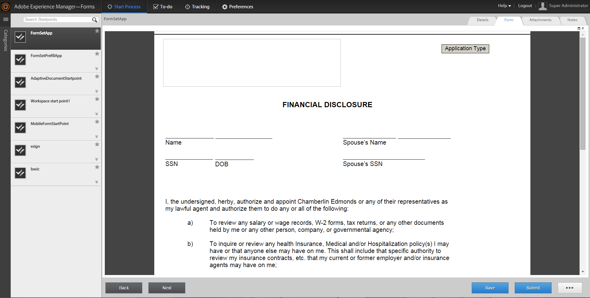

# 在AEM Forms工作區中使用表單集{#working-with-formsets-in-aem-forms-workspace}

表單集是HTML5表單的集合，分組後以單一表單集的形式呈現給使用者。 當使用者開始填寫表格集時，可順暢地從一個表格轉換到另一個表格。 然後，只要按一下，就可提交表格集。 如需表單集及如何設定的詳細資訊，請參閱「AEM [表單中的表單集」](../../forms/using/formset-in-aem-forms.md)。

AEM Forms工作區支援表單集。 使用表單集，可以將與服務或流程相關的多個表單分組，以自動化業務流程並呈現給最終用戶。 在這種情況下，使用者可以將整組表格一併填寫，而不需要歸檔、提交及追蹤個別表格或程式。

## 在AEM Forms工作區應用程式中將表單集附加至起點 {#attaching-a-formset-to-startpoint-in-an-aem-forms-workspace-app-br}

1. 在Workbench中建立業務流程工作流。 如需詳細資訊，請參 [閱Workbench說明](https://www.adobe.com/go/learn_aemforms_workbench_63)。
1. 從起點的流程屬性中，選擇「 **在簡報與資料中使用CRX資產** 」。

   

1. 按一  CRX資產路徑旁的瀏覽（瀏覽）。 此時將顯示「選擇表單資產」對話框。

   

1. 按一下「 **表單集** 」頁籤，從清單中選擇相關的表單集，然後按一下「 **確定」**。

1. 在更新其他相關流程屬性後部署應用程式。

## 在AEM Forms工作區中使用表單集 {#using-formset-in-nbsp-aem-forms-workspace}

在表單集附加至起點後，您就可從AEM Forms工作區呼叫起點，就像呼叫任何其他起點一樣。

透過AEM Forms工作區支援的表格集作業包括：

* 另存為草稿
* 鎖定
* 放棄
* 提交
* 新增附件
* 新增附註
* 使用「上一步」或「下一步」按鈕在表單集中的表單之間移動

>[!NOTE]
>
>為了改善格式集中從先前和下一個表單移動期間的效能，所有工作區按鈕（上一頁、下一頁、儲存、送出和……）（更多）)會停用，直到相關表格完全呈現為止。

