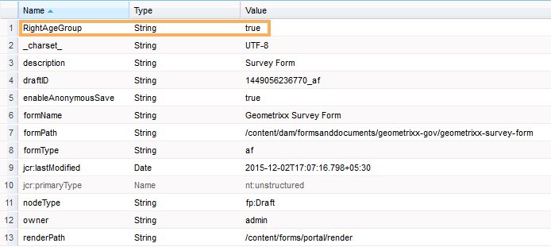

# 從使用者資料新增資訊至表單提交中繼資料{#adding-information-from-user-data-to-form-submission-metadata}

您可以使用在表單元素中輸入的值來計算草稿或表單提交的中繼資料欄位。 中繼資料可讓您根據使用者資料來篩選內容。 例如，使用者在表單的名稱欄位中輸入John Doe。 您可以使用這項資訊來計算中繼資料，將此提交分為縮寫JD。

若要使用使用者輸入的值來計算中繼資料欄位，請在中繼資料中新增表格元素。 當使用者在該元素中輸入值時，指令碼會使用值來計算資訊。 這項資訊會新增至中繼資料中。 當您新增元素作為中繼資料欄位時，會提供索引鍵。 索引鍵會新增為中繼資料中的欄位，並記錄計算的資訊。

例如，健康保險公司發佈表格。 在此表單中，欄位會擷取使用者的年齡。 客戶想在多位使用者提交表單後，檢查特定年齡範圍內的所有提交。 額外的中繼資料不會處理因表單數量增加而變得複雜的所有資料，而是可協助客戶。 表單作者可以設定使用者填入的屬性／資料會儲存在最上層，讓搜尋最輕鬆。 其他中繼資料是使用者填入的資訊，儲存在中繼資料節點的頂層，如作者所設定。

請考慮另一個擷取電子郵件ID和電話號碼的表單範例。 當使用者以匿名方式瀏覽此表單並放棄表單時，作者可以設定表單以自動儲存電子郵件ID和電話號碼。 此表單會自動儲存，電話號碼和電子郵件id會儲存在草稿的中繼資料節點中。 此設定的使用案例是銷售機會管理控制面板。

## 新增表單元素至中繼資料 {#adding-form-elements-to-metadata}

執行下列步驟，在中繼資料中新增元素：

1. 在編輯模式中開啟最適化表單。\
   若要在編輯模式中開啟表格，請在表格管理員中選取表格，然後點選「開 **啟」**。
1. 在編輯模式中，選取元件、點選欄  > **最適化表單容器**，然後點選 。
1. 在側欄中，按一下「中繼 **資料**」。
1. 在「中繼資料」區段中，按一下「 **新增**」。
1. 使用「中繼資料」索引標籤的「值」欄位來新增指令碼。 您新增的指令碼會從表單上的元素收集資料，並計算饋送至中繼資料的值。

   例如，如 **果輸入的年齡** 大於21，則在中繼資料中記錄 **true** ，如果小於21，則記錄false。 您可在「中繼資料」索引標籤中輸入下列指令碼：

   `(agebox.value >= 21) ? true : false`

   

   在「中繼資料」索引標籤中輸入的指令碼

1. 按一下 **確定**。

當用戶在選擇為元資料欄位的元素中輸入資料後，計算資訊被記錄在元資料中。 您可以在配置為儲存元資料的儲存庫中看到元資料。

## 查看更新的表單提交元資料： {#seeing-updated-form-nbsp-submission-metadata}

對於上述示例，元資料儲存在CRX儲存庫中。 中繼資料看起來如下：

如果您在中繼資料中新增核取方塊元素，選取的值會儲存為逗號分隔的字串。 例如，您在表單中新增核取方塊元件，並將其名稱指定為 `checkbox1`。 在核取方塊元件屬性中，您會新增值0、1和2的「駕照授權」、「社會安全號碼」和「護照」項目。

您選取最適化表單容器，並在表單屬性中新增中繼資料索引鍵， `cb1` 以儲存 `checkbox1.value`和發佈表單。 當客戶填寫表單時，客戶會在核取方塊欄位中選取「護照」和「社會安全號碼」選項。 值1和2以1、2的形式儲存在提交元資料的cb1欄位中。

>[!NOTE]
>
>上述範例僅供學習之用。 請確定您在AEM Forms實作中所設定的正確位置尋找中繼資料。

