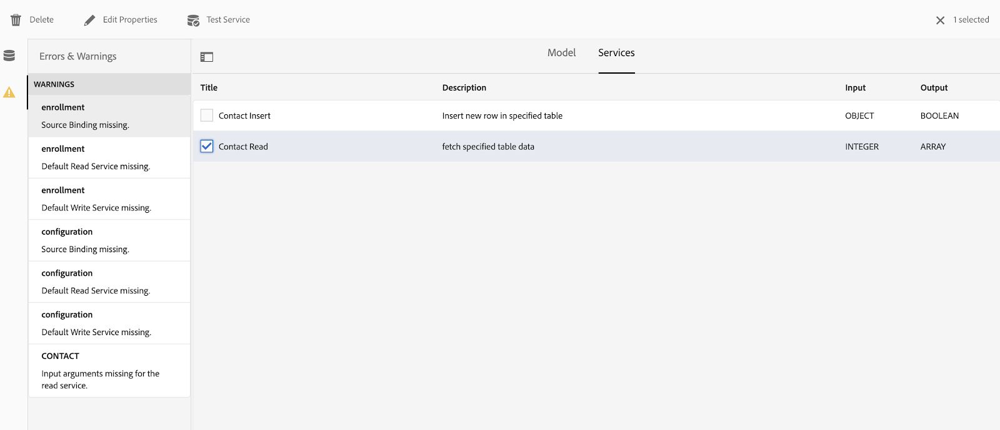

# We.Gov和We.Finance參考網站漫遊 {#we-gov-reference-site-walkthrough}

## 先決條件 {#pre-requisites}

按中所述設定參考站點 [設定和配置We.Gov和We.Finance參考站點](../../forms/using/forms-install-configure-gov-reference-site.md)。

## 用戶案例 {#user-story}

* AEM Forms

   * 自動表單轉換
   * 編寫
   * 表單資料模型/資料源

* AEM Forms

   * 資料捕獲
   * （可選）資料整合(MS Dynamics)
   * （可選）Adobe Sign

* 工作流程
* 電子郵件通知
* （可選）客戶通信

   * Print Channel
   * Web Channel

* Adobe Analytics
* 資料源整合

### 虛構的用戶和組 {#fictitious-users-and-groups}

We.Gov演示包附帶以下內置虛擬用戶：

* **譚雅**:有資格從政府機構獲得服務的公民


* **喬治·朗**:We.Gov機構業務分析員


* **卡米拉桑托斯**:We.Gov代理CX主管


還包括以下組：

* **We.GovForms用戶**

   * 喬治·朗（成員）
   * 卡米拉·桑托斯（成員）

* **We.Gov用戶**

   * 喬治·朗（成員）
   * 卡米拉·桑托斯（成員）
   * 譚雅雅（成員）

### 演示概述術語圖例 {#demo-overview-terms-legend}

1. **模擬**:演示中定義的用戶AEM和組。
1. **按鈕**:用於導航的彩色矩形或帶圓圈的箭頭。
1. **按一下**:在用戶文章中執行操作。
1. **連結**:位於We.Gov網站主菜單的頂部。
1. **用戶說明**:瀏覽用戶文章時要遵循的一組數字步驟。
1. **Forms門戶**: *https://&lt;aemserver>:&lt;port>/content/we-gov/formsportal.html*
1. **移動視圖**:We.Gov用戶用重新調整大小的瀏覽器複製移動視圖。
1. **案頭視圖**:We.gov用戶在筆記型電腦或台式機上查看演示。
1. **預篩選器窗體**:We.Gov網站首頁上的窗體。
1. **自適應窗體**:We.gov演示的註冊申請表。

   *https://&lt;aemserver>:&lt;port>/content/forms/af/adobe-gov-forms/enrollment-application-for-health-benefits.html*

1. **AdobeWe.Gov網站**: *https://&lt;aemserver>:&lt;port>/content/we-gov/home.html*
1. **Adobe收件箱**:位於頂部菜單欄 [鐘形表徵圖](assets/bell.svg) 在後AEM端。

   *https://&lt;aemserver>:&lt;port>/aem/start.html*

1. **電子郵件客戶端**:查看電子郵件的首選方法(Gmail、Outlook)
1. **CTA**:行動要求
1. **導航**:在瀏覽器頁面上查找特定參考點。
1. **AFC**:automated forms conversion

## automated forms conversion語（卡米拉語） {#automated-forms-conversion}

**此部分**:Camila the CX Lead有一個基於PDF的現有表單，該表單用作紙面流程的一部分。 作為現代化努力的一部分，她想用這種PDF形式自動建立一個新的現代適應Forms。

### automated forms conversion- We.Gov（卡米拉） {#automated-forms-conversion-wegov}

1. 導航到 *https://&lt;aemserver>:&lt;port>/aem/start.html*

1. 登錄方式：
   * **用戶**:卡米拉·桑托斯
   * **密碼**:密碼
1. 從首頁選擇Forms>Forms和文檔>AEM FormsWe.govForms> AFC。
1. 卡米拉上傳PDF到AEM Forms。

   

1. 然後，Camilla選擇PDF窗體並按一下 **啟動自動轉換** 的子菜單。 您可能需要按一下 **覆蓋轉換** 的雙曲餘切值。

   >[!NOTE]
   >
   >請注意，AFC中的設定已為最終用戶預配置，這意味著不應更改這些設定。

   * **可選**:如果希望使用「可訪問的超海洋」主題，只需按一下「指定自適應表單主題」，然後選擇選項清單中顯示的「可訪問 — 超海洋」主題。

   

   

   在轉換期間顯示完成百分比狀態。 顯示狀態後 **已轉換**，按一下 **輸出** 資料夾，選擇自適應窗體並按一下 **編輯** 的子菜單。

1. 然後，卡米拉將查看表單並確保所有欄位都存在

   

1. 然後，卡米拉開始編輯表單。 她選擇「根面板」>「編輯」（扳手）>從「面板佈局」下拉菜單中選擇「頂部的制表符」>選擇「複選框」。

   

1. 然後，Camilla將添加所有必要的CSS和欄位更改，以生產最終產品。

   

### 表單資料模型和資料源(Camila) {#data-sources}

**此部分**:一旦轉換並生成了自適應表單，Camila就需要將自適應表單連接到資料源。

1. Camila將開啟窗體中轉換為 [automated forms conversion語 — We.Gov](#automated-forms-conversion-wegov)。

1. 然後，Camila從下拉清單中選擇「表單模型」>「從選擇中選擇表單資料模型」>從選項清單中選擇We.gov註冊FDM。

1. 按一下「Save &amp; Close（保存並關閉）」按鈕。

   

1. 卡米拉點擊 **輸出** 資料夾，選擇自適應窗體並按一下 **編輯** 開啟完成的We.gov表格。
1. Camila選擇自適應表單域並按一下 。 她使用 **綁定引用** 的子菜單。 她以自適應形式對所有欄位重複此步驟。

### 表單輔助功能測試(Camila) {#form-accessibility-testing}

Camila還驗證建立的內容是否按照公司標準正確構建且完全可訪問。

1. 卡米拉點擊 **輸出** 資料夾，選擇自適應窗體並按一下 **預覽** 開啟完成的We.gov表格。

1. 開啟「Chrome Developer Tool（Chrome開發工具）」中的「Audit（審核）」頁籤。

1. 執行輔助功能檢查以驗證自適應表單。

   

## 自適應表單移動視圖演示(AYA) {#mobile-view-demo}

**此部分必須在演示之前執行。**

**用戶說明：**

1. 導航到： *https://&lt;aemserver>:&lt;port>/content/we-gov/home.html*
1. 登錄方式：

   1. **用戶**:雅雅。坦
   1. **密碼**:密碼

1. 重新調整瀏覽器窗口大小或使用瀏覽器的模擬器複製移動設備大小。

### We.Gov網站(Aya) {#aya-user-story-we-gov-website}


**此部分**:阿亞是公民。 她從一位朋友那裡聽說她可能有資格從政府機構獲得服務。 阿亞用手機瀏覽We.Gov網站，瞭解她有資格獲得的服務。

### We.Gov Pre-Screener(Aya) {#aya-user-story-we-gov-pre-screener}

亞雅回答了幾個問題，通過在手機上填寫一個簡短的適應表來確認她是否合格。

**用戶說明：**

1. 在每個下拉欄位中進行選擇。

   >[!NOTE]
   >
   >如果用戶每年的收入超過200,000美元，則他們不符合條件。

1. 按一下「 」**我合格嗎？**&quot; 按鈕.
1. 按一下「 」**立即應用**&#x200B;按鈕繼續。

   

### We.Gov自適應表(Aya) {#aya-user-story-we-gov-adaptive-form}

Aya發現她符合條件，開始填寫她的申請，在自己的移動設備上請求服務。

Aya需要先在家查看一些文檔，然後才能完成服務請求申請。 她保存應用程式並從移動設備退出。

**用戶說明：**

1. 填寫「基本資訊」欄位，以下是必填欄位和下拉清單：

   1. 基本資訊

      1. 名字
      1. 姓氏
      1. DOB
      1. 電子郵件

1. 使用以下 **動態邏輯** 使用 **家庭狀態** 下拉清單：

   1. **單**:顯示「親屬」面板的下一個
   1. **已婚**:顯示婚姻相關面板
   1. **離婚**:顯示「親屬」面板的下一個
   1. **喪偶**:顯示「親屬」面板的下一個
   1. **你有孩子嗎？**:（是/否）單選按鈕，顯示子依存面板。

      1. （添加/刪除）按鈕，用於添加/刪除多個子依存面板。

1. 按一下灰色菜單欄中的右箭頭。
1. 按一下底部的「保存」按鈕。

   

## 案頭演示 {#desktop-demo}

**本節：** 回到家後，Aya找到了她需要的資訊，並從案頭上恢復應用程式。 Aya導航到線上表單門戶以繼續申請。 通過一些簡單的定製，代理機構還可以自動生成並通過電子郵件發送連結來恢復應用程式。

### 連續自適應表單(Aya) {#aya-user-story-continued-adaptive-form}

**用戶說明：**

1. 導航到 *https://&lt;aemserver>:&lt;port>/content/we-gov/home.html*
1. 在導航欄中，選擇按一下「」**線上服務**。
1. 從「Forms草案」面板中，選擇現有的「健康福利註冊申請」。

   

   外觀和感覺都一樣，她不需要重新輸入任何資料。

   **用戶說明：**

1. 按一下右側的「圓CTA」(Circle CTA)，移到下一節。

   

   表格一直填充到Aya最後一個入口。 Aya已經輸入了她的所有資訊，並準備提交。

   

   >[!NOTE]
   >
   >當Aya填寫電話號碼欄位時，她必須將其作為連續的11位數字進行填充，不帶短划線、空格或連字元。

   提交後，Aya將收到「感謝」頁面。 （可選）她還會收到一封電子郵件，她可以開啟電子郵件，與Adobe Sign以電子方式簽署記錄文檔。

### 可選：Adobe Sign（亞亞） {#adobe-sign}

**用戶說明：**

1. 導航到您的電子郵件客戶端並查找Adobe Sign電子郵件。
1. 按一下指向Adobe Sign的連結。

   

**用戶說明：**

1. 檢查「」**我同意**&#x200B;的子菜單。
1. 按一下「」**接受**。
1. 滾動到已審閱文檔的底部。
1. 按一下突出顯示的黃色頁籤以簽署文檔。

    

## 政府代理人（喬治） {#government-agent-george}


**本節：** 喬治是政府機構Aya的商業分析員，正在請求提供服務。 George有一個儀表板，他可以在其中查看分配給他以供審閱的所有服務請求應用程式。

### 收AEM件箱(George) {#george-user-story-aem-inbox}

**用戶說明：**

1. 導航到 *https://&lt;aemserver>:&lt;port>/aem/start.html*
1. 按一下用戶表徵圖（右上角），然後使用「**註銷**&quot;或&quot;**模擬為**」菜單選項。

   1. 登錄方式：

      1. **用戶：** 喬治·朗
      1. **密碼：** 密碼
   1. 或模擬：

      1. 類型「」**喬治**」**模擬為**&#x200B;的子菜單。

      1. 按一下「確定」模擬。


1. 從右上角按一下「Notification(bell)Icon(通知(bell))」表徵圖。
1. 按一下「」**全部查看**»導航到收件箱。
1. 從收件箱中，開啟最新的「 」**健康效益應用程式審查**」。

   

### 可選：收件箱AEM和MS Dynamics(George) {#george-user-story-aem-inbox-and-ms-dynamics}

由於資料整合和自動化的工作流程，Aya的應用程式以及在提交資料時自動生成的CRM記錄出現。

**用戶說明：**

1. 開啟並檢查只讀自適應表單。
1. 按一下「 」**開啟MS動態**」按鈕開啟新窗口中的MS Dynamics記錄。
1. 在CRM中，您可以看到所有資訊都可以更新

   1. （可選）直接在Dynamics中添加一些複查備注。

1. 關閉並返回收AEM件箱。

   

### 返回收AEM件箱(George) {#george-user-story-back-to-aem-inbox}

喬治批准了Aya的應用程式，而且由於現有的自動化工作流程，確認電子郵件也會發送到Aya。

**用戶說明：**

1. 導航到左上角並按一下「」**批准**」以批准該申請。
1. 在該模式中，可以為CX銷售線索留言。
1. 按一下「完成」(Done)。
1. （公民角色）開啟您的電子郵件客戶端以查看發送到Aya的電子郵件。

   

## CX銷售線索(Camila) {#cx-lead-camila}


**本節：** CX Lead與Aya建立了歡迎電話，以解釋如何利用她獲得批准的政府服務。

### （可選）AEM收件箱和MS Dynamics {#camila-user-story-aem-inbox-ms-dynamics}

**用戶說明：**

1. 導航到 *https://&lt;aemserver>:&lt;port>/aem/start.html*
1. 按一下用戶表徵圖（右上角），然後使用「**註銷**&quot;或&quot;**模擬為**」菜單選項。

   1. 登錄方式：

      1. **用戶**:卡米拉·桑托斯
      1. **密碼**:密碼
   1. 或模擬：

      1. 類型「」**卡米拉**」**模擬為**&#x200B;的子菜單。

      1. 按一下「確定」模擬。


1. 從右上角按一下「Notification(bell)(通知（貝爾）)」表徵圖。
1. 按一下「」**全部查看**»導航到收件箱。
1. 從收件箱中，開啟最新的「 」**新建聯繫人批准**」。


**（可選）用戶說明：**

1. 開啟並檢查只讀自適應表單。
1. 按一下「 」**開啟MS動態**」按鈕開啟新窗口中的MS Dynamics記錄。
1. 在CRM中，您可以看到所有資訊都可以更新

   1. （可選）直接在Dynamics中添加新呼叫活動。
   1. 開啟「**活動**&#x200B;的子菜單。
   1. 按一下「 」**新建電話呼叫**&#x200B;的子菜單。
   1. 添加電話呼叫詳細資訊。
   1. 保存並關閉窗口。

1. 返回AEM，導航到左上角並按一下「」**提交**&quot;以提交申請。
1. 在模式中，可以留言。
1. 按一下「完成」(Done)。

    

## （可選）歡迎套件公民(Aya) {#welcome-kit-citizen-aya}

**本節：** Aya收到一封電子郵件，其中包含一個指向互動通信的連結，該連結概括了她的好處，還包括要填寫的表單域。 附上PDF權益聲明並連結至郵件中的互動式通信信函（與互動式通信具有相同的主題/品牌）。

### 電子郵件客戶端通知(Aya) {#aya-user-story-email-client}

**用戶說明：**

1. 找到並開啟歡迎套件電子郵件。
1. 滾動到頁面底部的PDF附件。
1. 按一下以開啟PDF附件。
1. 在電子郵件客戶端中向上滾動，然後按一下「」**聯機查看歡迎套件**。

   1. 這將開啟同一文檔的Web頻道版本。

1. 要直接參考PDF:

   *https://&lt;aemserver>:&lt;port>/aem/formdetails.html/content/dam/formsanddocuments/adobe-govforms/welcome-handbook/we-gov-welcome-handbook*

1. 直接參考IC:

   *https://&lt;aemserver>:&lt;port>/content/dam/formsanddocuments/adobe-gov-forms/welcome-handbook/we-gov-welcome-handbook/jcr:content?channel=web&amp;mode=preview&amp;wcmmode=disabled*

    

## 續約提醒公民(Aya) {#renewal-reminder-citizen-aya}

**本節：** 卡米拉還安排了一個通訊提醒，這樣一來，一年後。 （自動化/執行和電子郵件的工作流步驟）。

### 電子郵件客戶端通知(Aya) {#aya-user-story-email-client-updated}

**用戶說明：**

1. 導航到您的電子郵件客戶端。
1. 找到並開啟續訂提醒電子郵件。
1. 按一下「 」**提交新申請**&#x200B;按鈕。

   1. 此部分故意留空以支援階段2中的資料預填充。

   

## （可選）表單資料模型(Camila) {#form-data-model}

**此部分**:卡米拉導航到AEM Forms資料整合，在該整合中她可以運行快速test，以查看通過表單資料模型整合發送到外部資料源的資訊確實存在。

### 表單資料模型(Camila) {#form-data-model-camila}

**此部分**:Camila導航到「資料源」頁，以驗證伺服器在Derby資料庫中複製的資料。

1. 用戶體驗完成並完成用戶提交後，Camila將導航到AEM Forms內的「資料源」頁籤(**Forms** > **資料整合**)

1. 卡米拉選AEM Forms **We.gov FDM** 編輯 **We.gov註冊FDM**。

1. 然後，Camila將選擇 **聯繫人** > **讀取服務** 要測試。

   

1. 然後，Camila為test服務提供聯繫人ID，然後按一下Test按鈕。 例如，1或2，如果您提交了表單。 如果尚未提交表單，則不返回任何資料。

   

1. 然後，Camila可以驗證資料是否已成功插入資料源。

   * Derby DS中的資料與以下格式類似：

   ```xml
      [
         {
         "ADDRESS_COUNTRY": "USA",
         "LAST_NAME": "Tan",
         "ADDRESS_CITY": "New York",
         "FIRST_NAME": "Aya",
         "ADDRESS_STATE": "AL",
         "ADDRESS_LINE1": "123 Street crescent",
         "GENDER_CODE": "2",
         "ADDRESS_LINE2": "123 Street crescent",
         "ADDRESS_POSTAL_CODE": "90210",
         "BIRTH_DATE": "1991-12-12",
         "CONTACT_ID": 1,
         "MIDDLE_NAME": "M",
         "HAS_CHILDREN_CODE": "0"
         }
   ]
   ```

## （可選）分析(Camila) {#analytics-cx-lead-camila}

**本節：** Camila導航到一個控制面板，在該控制面板中，她可以看到機構KPI中開始填寫服務請求表並放棄的公民百分比、從請求提交到批准/拒絕響應的平均時間以及她發送給公民的福利手冊的參與統計。

### Adobe Analytics網站報告(Camila) {#camila-reviews-sites-reporting-we-gov-adobe-analytics}

1. 導航到 *https://&lt;aemserver>:&lt;port>/sites.html/內容*
1. 選擇「」**AEM FormsWe.Gov網站**」以查看網站頁。
1. 選擇其中一個網站頁（例如首頁），然後選擇「」**分析與Recommendations**。

   

1. 在此頁上，您將看到Adobe Analytics的與AEM Sites頁相關的回遷資訊(注：通過設計，此資訊會定期從Adobe Analytics刷新，而不會即時顯示)。

   

1. 返回頁面視圖頁面（在步驟3中訪問）時，還可以通過將顯示設定更改為查看「 」中的項來查看頁面視圖資訊&#x200B;**清單視圖**。
1. 找到&quot;**視圖**&quot;下拉菜單，選擇&quot;**清單視圖**。

   

1. 從同一菜單中，選擇「」**視圖設定**，然後從「 」中選擇要顯示的列&#x200B;**分析**&#x200B;的子菜單。

   

1. 按一下「」**更新**&quot;以使新列可用。

   

### Adobe Analytics·Forms報導（卡米拉） {#camila-reviews-forms-reporting-we-gov-adobe-analytics}

1. 瀏覽到

   *https://&lt;aemserver>:&lt;port>/aem/forms.html/content/dam/formsanddocuments/adobe-govforms*

1. 選擇「」**健康福利的註冊申請**&quot;自適應窗體並選擇&quot;**分析報告**&#x200B;的子菜單。

   

1. 等待頁面載入並查看分析報告資料。

   
