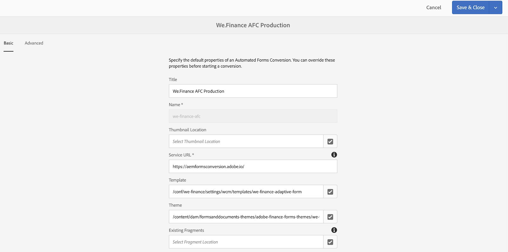

# 設定We.Gov和We.Finance參考網站 {#set-up-and-configure-we-gov-reference-site}

## 示範套件詳細資料 {#demo-package-details}

### 安裝必備條件 {#installation-prerequisites}

這個封裝是為&#x200B;**AEM Forms 6.4 OSGI作者**&#x200B;建立的，已經過測試，因此支援下列平台版本：

| AEM版本 | AEM Forms套件版本 | 狀態 |
|---|---|---|
| 6.4 | 5.0.86 | **支援** |
| 6.5 | 6.0.80 | **支援** |
| 6.5.3 | 6.0.122 | **支援** |

此套件包含支援以下平台版本的雲端設定：

| 雲端提供者 | 服務版本 | 狀態 |
|---|---|---|
| Adobe Sign | v5 API | **支援** |
| Microsoft® Dynamics 365 | 1710 (9.1.0.3020) | **支援** |
| Adobe Analytics | v1.4 Rest API | **支援** |

**封裝安裝考量事項：**

* 將套件安裝在乾淨的伺服器上，無需其他示範套件或較舊的示範套件版本。
* 在OSGI伺服器上安裝套件，以製作模式執行。

### 此套件包含哪些內容 {#what-does-this-package-include}

[AEM Forms We.Gov示範套件](https://experience.adobe.com/#/downloads/content/software-distribution/en/aem.html?package=/content/software-distribution/en/details.html/content/dam/aem/public/adobe/packages/cq650/featurepack/we-gov-forms.pkg.all-2.0.2.zip) (**we-gov-forms.pkg.all-&lt;version>.zip**)是以包含數個其他子套件和服務的套件形式提供。 此套件包含下列模組：

* **we-gov-forms.pkg.all-&lt;version>.zip** - *完成示範套件*

   * **we-gov-forms.ui.apps-&lt;version>.zip** *— 包含所有元件、使用者端資料庫、範例使用者、工作流程模型等。*

      * **we-gov-forms.core-&lt;version>.jar** - *包含所有OSGI服務、自訂工作流程步驟實作等。*

      * **we-gov-forms.derby&lt;version>.jar** - *包含所有OSGI服務、資料庫結構描述等。*

      * **core.wcm.components.all-2.0.4.zip** - *範例WCM元件的集合*

      * **grid-aem.ui.apps-1.0-SNAPSHOT.zip** - *網站頁面欄控制項的AEM Sites網格配置套件*

   * **we-gov-forms.ui.content-&lt;version>.zip** - *包含所有內容、頁面、影像、表單、互動式通訊資產等。*

   * **we-gov-forms.ui.ananalytics-&lt;version>.zip** - *包含所有要儲存在存放庫中的We.Gov Forms Analytics資料。*

   * **we-gov-forms.config.public-&lt;version>.zip** - *包含所有預設設定節點，包括預留位置雲端設定，以協助避免表單資料模型和服務繫結問題。*

此套件中包含的資產包括：

* 包含可編輯範本的AEM網頁
* AEM Forms最適化Forms
* AEM Forms互動式通訊（列印和Web Channel）
* AEM Forms XDP記錄檔案
* AEM Forms MS® Dynamics Forms資料模型
* Adobe Sign整合
* AEM工作流程模型
* AEM Assets影像範例
* 範例（記憶體內） Apache Derby資料庫
* Apache Derby Data Source （用於表單資料模型）

## 示範套件安裝 {#demo-package-installation}

本節包含安裝示範套件的相關資訊。

### 來自Software Distribution {#from-software-distribution}

1. 開啟 [Software Distribution](https://experience.adobe.com/downloads)。您需要 Adobe ID 才能登入 Software Distribution。
1. 選取標題功能表中可用的&#x200B;**[!UICONTROL Adobe Experience Manager]**。
1. 在&#x200B;**[!UICONTROL 篩選器]**&#x200B;區段中：
   1. 從&#x200B;**[!UICONTROL 解決方案]**&#x200B;下拉式清單中選取&#x200B;**[!UICONTROL Forms]**。
   2. 選取封裝的版本和型別。 您也可以使用&#x200B;**[!UICONTROL 搜尋下載]**&#x200B;選項來篩選結果。
1. 選取&#x200B;**we-gov-forms.pkg.all-&lt;version>.zip**&#x200B;封裝名稱，選取&#x200B;**[!UICONTROL 接受EULA條款]**，然後選取&#x200B;**[!UICONTROL 下載]**。
1. 開啟[封裝管理員](https://experienceleague.adobe.com/docs/experience-manager-65/administering/contentmanagement/package-manager.html)，然後按一下&#x200B;**[!UICONTROL 上傳封裝]**&#x200B;以上傳封裝。
1. 選取封裝並按一下&#x200B;**[!UICONTROL 安裝]**。

   

1. 允許安裝程式完成。
1. 導覽至&#x200B;*https://&lt;aemserver>：&lt;port>/content/we-gov/home.html？wcmmode=disabled*，確保安裝成功。

### 從本機ZIP檔案 {#from-a-local-zip-file}

1. 下載並找到&#x200B;**we-gov-forms.pkg.all-&lt;version>.zip**&#x200B;檔案。
1. 導覽至&#x200B;*https://&lt;aemserver>：&lt;port>/crx/packmgr/index.jsp*。
1. 選取「上傳套件」選項。

   

1. 使用檔案瀏覽器導覽並選取下載的ZIP檔案。
1. 按一下「開啟」以上傳。
1. 上傳後，選取「安裝」選項以安裝套件。

   

1. 允許安裝程式完成。
1. 導覽至&#x200B;*https://&lt;aemserver>：&lt;port>/content/we-gov/home.html？wcmmode=disabled*，確保安裝成功。

### 安裝新的套件版本 {#installing-new-package-versions}

若要安裝新的套件版本，請依照4.1和4.2中定義的步驟操作。可以在已安裝其他較舊套件時安裝較新的套件版本，但建議先解除安裝較舊的套件版本。 請依照下列步驟以執行此操作。

1. 導覽至&#x200B;*https://&lt;aemserver>：&lt;port>/crx/packmgr/index.jsp*
1. 找出較舊的&#x200B;**we-gov-forms.pkg.all-&lt;version>.zip**&#x200B;檔案。
1. 選取「更多」選項。
1. 從下拉式清單中選取「解除安裝」選項。

   

1. 確認後，再次選取「解除安裝」，並允許解除安裝過程完成。

## 示範套件設定 {#demo-package-configuration}

本節包含簡報前示範套件的部署後組態詳細資訊和指示。

### 虛構的使用者設定 {#fictional-user-configuration}

1. 導覽至&#x200B;*https://&lt;aemserver>：&lt;port>/libs/granite/security/content/groupadmin.html*
1. 以管理員身分登入以執行下列工作。
1. 向下捲動至頁面結尾以載入所有使用者群組。
1. 搜尋&quot;**工作流程**&quot;。
1. 選取「**工作流程使用者**」群組，然後按一下「屬性」。
1. 導覽至「成員」標籤。
1. 在[選取使用者或群組]欄位中輸入&#x200B;**wegov**。
1. 從下拉式清單中選取「**We.Gov Forms Users**」。

   

1. 按一下功能表列中的「儲存並關閉」。
1. 搜尋「**Analytics**」、選取「**Analytics管理員**」群組，並將「**We.Gov Forms使用者**」群組新增為成員，以重複步驟2至7。
1. 搜尋「**表單使用者**」、選取「**表單 — 超級使用者**」群組，並將「**We.Gov Forms使用者**」群組新增為成員，以重複步驟2至7。
1. 搜尋「**forms-users**」、選取「**forms-users**」群組，然後將「**We.Gov Users**」群組新增為成員，以重複步驟2到7。

### 電子郵件伺服器設定 {#email-server-configuration}

1. 檢閱設定檔案[設定電子郵件通知](/help/sites-administering/notification.md)
1. 以管理員身分登入以執行此工作。
1. 導覽至&#x200B;*https://&lt;aemserver>：&lt;port>/system/console/configMgr*
1. 找到並按一下&#x200B;**Day CQ Mail Service**&#x200B;服務以進行設定。

   

1. 設定服務以連線至您選擇的SMTP伺服器：

   1. **SMTP伺服器主機名稱**：例如(smtp.gmail.com)
   1. **伺服器連線埠**：例如，使用SSL的gmail (465)
   1. **SMTP使用者：** demo@ &lt;companyname> .com
   1. **「寄件者」位址**： aemformsdemo@adobe.com

   

1. 按一下「儲存」以儲存設定。

### （選用） AEM SSL設定 {#aemsslconfig}

本節包含在AEM執行個體上設定SSL，以便設定Adobe Sign雲端設定的詳細資訊。

**參考：**

1. [SSL預設值](/help/sites-administering/ssl-by-default.md)

**附註：**

1. 導覽至https://&lt;aemserver>：&lt;port>/aem/inbox，您可在此完成上述參考檔案連結中說明的程式。
1. `we-gov-forms.pkg.all-[version].zip`封裝包含範例SSL金鑰和憑證，可透過解壓縮封裝的`we-gov-forms.pkg.all-[version].zip/ssl`資料夾來存取。

1. SSL憑證和金鑰詳細資料：

   1. 核發給「CN=localhost」
   1. 10年有效期
   1. 「password」的密碼值
1. 私密金鑰是&#x200B;*localhostprivate.der*。
1. 憑證是&#x200B;*localhost.crt*。
1. 按一下「下一步」。
1. HTTPS主機名稱應設為&#x200B;*localhost*。
1. 連線埠應該設定為系統已公開的連線埠。

### （選用） Adobe Sign雲端設定 {#adobe-sign-cloud-configuration}

本節包含Adobe Sign雲端設定的詳細資訊和指示。

**參考：**

1. [將Adobe Sign與AEM Forms整合](adobe-sign-integration-adaptive-forms.md)

#### 雲端設定 {#cloud-configuration}

1. 檢閱先決條件。 如需必要的SSL設定，請參閱[AEM SSL設定](../../forms/using/forms-install-configure-gov-reference-site.md#aemsslconfig)。
1. 瀏覽到:

   *https://&lt;aemserver>：&lt;port>/libs/adobesign/cloudservices/adobesign.html/conf/we-gov*

   >[!NOTE]
   >
   >用來存取AEM伺服器的URL應符合Adobe Sign OAuth重新導向URI中設定的URL，以避免設定問題(例如，*https://&lt;aemserver>：&lt;port>/mnt/overlay/adobesign/cloudservices/adobesign/properties.html*)

1. 選取「We.gov Adobe Sign」設定。
1. 按一下「屬性」。
1. 瀏覽至「設定」標籤。
1. 輸入oAuth URL，例如： [https://secure.na1.echosign.com/public/oauth](https://secure.na1.echosign.com/public/oauth)
1. 提供已設定之Adobe Sign執行個體中已設定的使用者端ID和使用者端密碼。
1. 按一下「連線至Adobe Sign」。
1. 成功連線後，按一下「儲存並關閉」以完成整合。

### （選用） MS® Dynamics雲端設定 {#ms-dynamics-cloud-configuration}

本節包含有關MS® Dynamics雲端設定的詳細資訊和指示。

**參考：**

1. [Microsoft](/help/forms/using/ms-dynamics-odata-configuration.md)
1. [設定AEM Forms的Microsoft® Dynamics](https://experienceleague.adobe.com/docs/experience-manager-learn/forms/adaptive-forms/using-ms-dynamics-with-aem-forms.html)

#### MS® Dynamics OData雲端服務 {#ms-dynamics-odata-cloud-service}

1. 瀏覽到:

   https://&lt;aemserver>：&lt;port>/libs/fd/fdm/gui/components/admin/fdmcloudservice/fdm.html/conf/we-gov

   1. 確定您使用與MS® Dynamics應用程式註冊中設定的相同重新導向URL存取伺服器。

1. 選取「Microsoft® Dynamics ODataCloud Service」設定。
1. 按一下「屬性」。

   

1. 瀏覽至「驗證設定」標籤。
1. 輸入下列明細：

   1. **服務根目錄：**，例如`https://msdynamicsserver.api.crm3.dynamics.com/api/data/v9.1/`
   1. **驗證型別：** OAuth 2.0
   1. **驗證設定** (請參閱[MS® Dynamics雲端組態設定](../../forms/using/forms-install-configure-gov-reference-site.md#dynamicsconfig)以收集此資訊)：

      1. 使用者端ID — 也稱為應用程式ID
      1. 用戶端密碼
      1. OAuth URL — 例如，[https://login.microsoftonline.com/common/oauth2/authorize](https://login.microsoftonline.com/common/oauth2/authorize)
      1. 重新整理權杖URL — 例如，[https://login.windows.net/common/oauth2/token](https://login.windows.net/common/oauth2/token)
      1. 存取權杖URL — 例如，[https://login.windows.net/common/oauth2/token](https://login.windows.net/common/oauth2/token)
      1. 授權範圍 — **openid**
      1. 驗證標頭 — **授權持有人**
      1. 資源 — 例如`https://msdynamicsserver.api.crm3.dynamics.com`

   1. 按一下「連線至OAuth」。

1. 成功驗證後，按一下「儲存並關閉」以完成整合。

#### MS® Dynamics雲端組態設定 {#dynamicsconfig}

本節中詳述的步驟可協助您從MS® Dynamics Cloud執行個體尋找使用者端ID、使用者端密碼和詳細資訊。

1. 導覽至[https://portal.azure.com/](https://portal.azure.com/)並登入。
1. 從左側功能表中選取「所有服務」。
1. 搜尋或導覽至「應用程式註冊」。
1. 建立或選取現有的應用程式註冊。
1. 複製&#x200B;**應用程式ID**，以用作AEM雲端設定中的OAuth **使用者端ID**
1. 按一下[設定]或[資訊清單]設定&#x200B;**回覆URL。**

   1. 此URL必須與在設定OData服務時用來存取您的AEM伺服器的URL相符。

1. 在「設定」檢視中，按一下「金鑰」以檢視新金鑰(這在AEM中會作為使用者端密碼)。

   1. 請務必保留金鑰的副本，因為您稍後無法在Azure或AEM中檢視。

1. 若要尋找資源URL/服務根URL，請導覽至MS® Dynamics執行個體控制面板。
1. 在頂端導覽列中，按一下「Sales」或您自己的執行個體型別和「Select Settings」。
1. 按一下右下角附近的「自訂」和「開發人員資源」 。
1. 您可以在此處找到服務根URL：例如，

   *`https://msdynamicsserver.api.crm3.dynamics.com/api/data/v9.1/`

1. 有關重新整理和存取權杖URL的詳細資訊，請參閱此處：

   *[https://learn.microsoft.com/en-us/rest/api/datacatalog/authenticate-a-client-app](https://learn.microsoft.com/en-us/rest/api/datacatalog/authenticate-a-client-app)*

#### 測試Forms資料模型(Dynamics) {#testing-the-form-data-model}

雲端設定完成後，您可能會想要測試表單資料模型。

1. 瀏覽至

   *https://&lt;aemserver>：&lt;port>/aem/forms.html/content/dam/formsanddocuments-fdm/we-gov*

1. 選取「We.gov Microsoft® Dynamics CRM FDM」並選取「屬性」。

   

1. 導覽至「更新Source」標籤。
1. 請確定「內容感知設定」已設為「/conf/we-gov」，且設定的資料來源為「ms-dynamics-odata-cloud-service」。

   

1. 編輯表單資料模型。

1. 測試服務，確保服務能成功連線至已設定的Data Source。

   >[!NOTE]
   >
   >測試服務後，按一下&#x200B;**取消**&#x200B;以確保非自願的變更不會傳播至表單資料模型。

   >[!NOTE]
   >
   >據報導，AEM伺服器必須重新啟動，Data Source才能成功繫結至FDM。

   >[!NOTE]
   >
   >建議您使用&#39;Ctrl + C&#39;命令重新啟動SDK。 使用替代方法重新啟動AEM SDK （例如停止Java程式）可能會導致AEM開發環境不一致。

#### 測試Forms資料模型(Derby) {#test-fdm-derby}

雲端設定完成後，您可能會想要測試表單資料模型。

1. 導覽至&#x200B;*https://&lt;aemserver>：&lt;port>/aem/forms.html/content/dam/formsanddocuments-fdm/we-gov*

1. 選取&#x200B;**We.gov註冊FDM**&#x200B;並選取&#x200B;**屬性**。

   

1. 導覽至&#x200B;**更新Source**&#x200B;標籤。

1. 請確定&#x200B;**內容感知設定**&#x200B;設定為`/conf/we-gov`，且設定的資料來源為&#x200B;**We.Gov Derby DS**。

   

1. 按一下&#x200B;**儲存並關閉**。

1. [測試服務](work-with-form-data-model.md#test-data-model-objects-and-services)，確保它們成功連線到設定的Data Source

   * 若要測試連線，請選取&#x200B;**HOMOMORTGAGEACCOUNT**&#x200B;並提供get服務。 測試服務，系統管理員可以檢視正在擷取的資料。

### Adobe Analytics設定（選用） {#adobe-analytics-configuration}

本節包含有關Adobe Analytics Cloud設定的詳細資訊和指示。

**參考：**

* [整合 Adobe Analytics](../../sites-administering/adobeanalytics.md)

* [連線到Adobe Analytics並建立框架](../../sites-administering/adobeanalytics-connect.md)

* [檢視頁面分析資料](../../sites-authoring/pa-using.md)

* [設定分析和報表](configure-analytics-forms-documents.md)

* [檢視和瞭解AEM Forms分析報表](view-understand-aem-forms-analytics-reports.md)

### Adobe Analytics Cloud服務設定 {#adobe-analytics-cloud-service-configuration}

此套件已預先設定為連線至Adobe Analytics。 提供下列步驟以更新此設定。

1. 導覽至&#x200B;*https://&lt;aemserver>：&lt;port>/libs/cq/core/content/tools/cloudservices.html*
1. 找出Adobe Analytics區段，然後選取「顯示設定」連結。
1. 選取「We.Gov Adobe Analytics （Analytics設定）」設定。

   

1. 按一下「編輯」按鈕以更新Adobe Analytics設定（您必須提供共用機密）。 按一下「連線至Analytics」以連線，並按一下「確定」完成。

   

1. 若要更新框架組態，請從相同頁面按一下[We.Gov Adobe Analytics Framework (Analytics Framework)] (請參閱[啟用AEM編寫](../../forms/using/forms-install-configure-gov-reference-site.md#enableauthoring)以啟用編寫)。

#### Adobe Analytics正在尋找使用者認證 {#analytics-locating-user-credentials}

若要尋找Adobe Analytics帳戶的使用者認證，帳戶管理員必須執行下列工作。

1. 導覽至Adobe Experience Cloud入口網站。
   * 使用您的管理員憑證登入
1. 在主控制面板中選取Adobe Analytics圖示。
   
1. 導覽至「管理員」標籤，並選取「使用者管理（舊版）」專案
   
1. 選取&#x200B;**使用者**&#x200B;索引標籤。
   
1. 從使用者清單中選取所需的使用者。
1. 捲動至頁面底部，使用者驗證資訊將顯示在頁面底部。
   
1. 使用者名稱和共用機密資訊會顯示在許可權方塊的右側。
1. 使用者名稱內有冒號，冒號左邊的所有資訊都是使用者名稱，冒號右邊的所有資訊都是公司名稱。
   * 以下是範例： *使用者名稱：公司名稱*

#### 在Adobe Analytics中設定使用者驗證 {#setup-user-authentication}

管理員可以執行下列動作，為使用者提供AEM Analytics許可權。

1. 導覽至Adobe Admin Console。

1. 按一下公開給Admin Console的Analytics例項。

   * 此專案位於管理頁面的主要頁面。

1. 選取「Analytics完整管理員存取權」。

1. 將使用者新增至設定檔。

   

1. 當使用者ID對應至設定檔後，請按一下許可權索引標籤。

1. 請確定所有許可權皆已對應至設定檔。

   

1. 一旦許可權對應完畢，使用者可能需要數小時才能登入。

### Adobe Analytics報告 {#adobe-analytics-reporting}

#### 檢視Adobe Analytics網站報告 {#view-adobe-analytics-sites-reporting}

>[!NOTE]
>
>如果已安裝`we-gov-forms.ui.analytics-<version>.zip`套件，則AEM Forms Analytics資料可在離線時或無Adobe Analytics Cloud設定時取得，但AEM Sites資料需要有效雲端設定。

1. 導覽至&#x200B;*https://&lt;aemserver>：&lt;port>/sites.html/content*
1. 選取「AEM Forms We.Gov網站」以檢視網頁。
1. 選取其中一個網站頁面（例如「首頁」），然後選擇「Analytics和Recommendations」。

   

1. 在本頁中，您會看到從Adobe Analytics擷取的與AEM Sites頁面相關的資訊(注意：設計上，此資訊會定期從Adobe Analytics重新整理，不會即時顯示)。

   

1. 回到頁面檢視頁面（在步驟3存取），您也可以變更顯示設定以檢視「清單檢視」中的專案，以檢視頁面檢視資訊。
1. 找出「檢視」下拉式功能表，然後選取「清單檢視」。

   

1. 從相同功能表選取「檢視設定」，並從「Analytics」區段選取您要顯示的欄。

   

1. 按一下「更新」以使新欄可用。

   

#### 檢視Adobe Analytics表單報告 {#view-adobe-analytics-forms-reporting}

>[!NOTE]
>
>如果已安裝`we-gov-forms.ui.analytics-<version>.zip`套件，則AEM Forms Analytics資料可在離線時或無Adobe Analytics Cloud設定時取得，但AEM Sites資料需要有效雲端設定。

1. 瀏覽至

   *https://&lt;aemserver>：&lt;port>/aem/forms.html/content/dam/formsanddocuments/adobe-gov-forms*

1. 選取「健康權益註冊應用程式」最適化表單，然後選取「Analytics報表」選項。

   

1. 等候頁面載入，並檢視Analytics報表資料。

   

### 啟用自動Forms設定的Adobe {#automated-forms-enablement}

若要使用AdobeForms來安裝和設定AEM Forms，「轉換工具」的使用者必須具備下列條件。

1. 存取Adobe Developer。

1. 建立與AdobeForms轉換服務整合的許可權。

1. Adobe以作者身分執行的最新AEM 6.5 Service Pack。

閱讀進一步指示前，請先檢閱下列內容：

* [設定自動表單轉換服務](https://experienceleague.adobe.com/docs/aem-forms-automated-conversion-service/using/configure-service.html)

#### 建立IMS設定第1部分 {#creating-ims-config}

若要設定服務以正確與表單轉換工具通訊，使用者必須設定Identity Management系統(IMS)服務以註冊Adobe I/O。

1. 導覽至https://&lt;aemserver>：&lt;port> >按一下Adobe體驗
左上角的「管理員」 > 「工具」 > 「安全性」 > 「Adobe IMS設定」 。

1. 按一下「建立」。

1. 執行下列影像中的動作。

   

1. 請務必下載憑證。

1. 不要繼續進行其餘的組態 — 檢閱區段[在Adobe I/O中建立整合](#create-integration-adobeio)

>[!NOTE]
>
>此區段中建立的憑證將用來在Adobe I/O中建立整合服務。一旦使用者在整合服務中建立，使用者就可以使用該資訊從Adobe I/O完成設定。

#### 在Adobe I/O中建立整合 {#create-integration-adobeio}

如果您未連絡系統管理員，請確定您有能力在Adobe網域中建立整合。

1. 導覽至[Adobe Developer Console](https://developer.adobe.com/console/)。

1. 按一下建立整合專案。

1. 選取「存取API」。

1. 確定您位於正確的群組（右上角的下拉式清單）。

1. 在Experience Cloud區段中，選取「Forms轉換工具」。

1. 按一下「繼續」。

1. 輸入整合的名稱和說明。

1. 使用2.1節中的公開金鑰，可將其置於金鑰的整合中。

1. 選取您automated forms conversion的設定檔。

   

#### 建立IMS設定第2部分 {#create-ims-config-part-next}

現在您已建立整合，讓我們完成IMS設定的安裝。

1. 在Adobe I/O中按一下您的整合，以公開連線詳細資料。

1. 在AEM中導覽至您的IMS設定（「工具>安全性> IMS」）

1. 按一下IMS設定畫面上的「下一步」 。

1. 輸入授權伺服器（熒幕擷取畫面中顯示的值）。

1. 輸入API金鑰。

1. 輸入使用者端密碼(必須按一下「在Adobe I/O中公開」才會公開)。

1. 按一下Adobe I/O中的JWT索引標籤以取得JWT裝載，並將其貼到IMS設定的裝載中。

   

1. 建立後，按一下IMS設定並選取健康狀態檢查，使用者應該會看到以下結果。

   

#### 設定雲端設定(We.Gov AFC Production) {#configure-cloud-configuration}

IMS設定完成後，您可以繼續檢閱AEM中的雲端設定。 如果設定不存在，請使用以下步驟在AEM中建立雲端設定：

1. 開啟瀏覽器並導覽至系統URL https://&lt;domain_name>：&lt;system_port>

1. 按一下畫面左上角的Adobe Experience Manager > 「工具>Cloud Service>自動Forms交談設定」 。

1. 選取您要放置設定的設定資料夾。

1. 按一下「建立」。

1. 在下方熒幕擷圖中輸入資訊。

   

1. 為設定提供標題和名稱。

1. 系統的服務URL設定為https://aemformsconversion.adobe.io/。

1. 範本網址&#x200B;*/conf/we-gov/settings/wcm/templates/we-gov-flamingo-template*。

1. 主題URL： */content/dam/formsanddocuments-themes/adobe-gov-forms-themes/we-gov-theme*

1. 按一下「下一步」。

1. 對於此設定，我們將兩個核取方塊值留空。

   * 若要進一步瞭解這些選項，請參閱[設定雲端服務](https://experienceleague.adobe.com/docs/aem-forms-automated-conversion-service/using/configure-service.html#configure-the-cloud-service)。

#### 設定雲端設定(We.Finance AFC Production) {#configure-cloud-configuration-wefinance}

IMS設定完成後，我們就可以繼續在AEM中建立雲端設定。

1. 開啟瀏覽器並導覽至系統URL https://&lt;domain_name>：&lt;system_port>

1. 按一下畫面左上角的Adobe Experience Manager > 「工具>Cloud Service>自動Forms交談設定」 。

1. 選取您要放置設定的設定資料夾。

1. 按一下「建立」。

1. 在下方熒幕擷圖中輸入資訊。

   

1. 為設定提供標題和名稱。

1. 系統的服務URL已設定為https://aemformsconversion.adobe.io/

1. 範本URL： */conf/we-finance/settings/wcm/templates/we-finance-adaptive-form*

1. 主題URL： */content/dam/formsanddocuments-themes/adobe-finance-forms-themes/we-finance-theme*

1. 按一下「下一步」。

1. 對於此設定，我們將兩個核取方塊值留空。

   * 若要進一步瞭解這些選項，請參閱[設定雲端服務](https://experienceleague.adobe.com/docs/aem-forms-automated-conversion-service/using/configure-service.html#configure-the-cloud-service)。

#### 測試表單轉換（We.Gov註冊應用程式） {#test-forms-conversion}

設定好設定後，使用者就可以上傳PDF檔案來進行測試。

1. 導覽至AEM系統https://&lt;domain_name>：&lt;system_port>

1. 按一下「Forms > Forms &amp; Documents > AEM Forms We.gov Forms > AFC」。

1. 選取We.Gov註冊應用程式PDF。

1. 按一下右上角的&#x200B;**開始自動轉換**。

1. 使用者應該能夠看到如下所示的選項。

   

1. 選取按鈕後，使用者將看到以下選項

   * 請確定使用者選取&#x200B;*We.Gov AFC Production*&#x200B;設定

   

   

1. 在您設定好所有要使用的選項後，請選取開始轉換。

1. 當轉換程式開始時，使用者應該會看到以下畫面：

   

1. 轉換完成後，使用者會看到下列畫面：

   

   按一下&#x200B;**Output**&#x200B;資料夾以檢視產生的自適應表單。

#### 已知問題和注意事項 {#known-issues-notes}

automated forms conversion服務包含某些[最佳實務、已知的複雜模式](https://experienceleague.adobe.com/docs/aem-forms-automated-conversion-service/using/styles-and-pattern-considerations-and-best-practices.html)和[已知問題](https://experienceleague.adobe.com/docs/aem-forms-automated-conversion-service/using/known-issues.html)。 開始使用AEM FormsAutomated forms conversion服務前，請先檢閱這些內容。

1. 如果您想要在轉換後將表單繫結到FDM，請在啟用資料繫結的情況下產生具有產生自適應表單的表單。

1. 請確定範本資料夾已啟用適用於所有人的jcr：read許可權，否則服務使用者將無法從存放庫讀取範本，且轉換將失敗。

## 示範套件自訂 {#demo-package-customizations}

本節包含示範自訂的說明。

### 範本自訂 {#templates-customization}

可在以下位置找到可編輯的範本：

*https://&lt;aemserver>：&lt;port>/libs/wcm/core/content/sites/templates.html/conf/we-gov*

這些範本包括AEM Site、最適化表單和互動式通訊範本，這些範本是使用可在下列位置找到的元件建立和組裝：

*https://&lt;aemserver>：&lt;port>/crx/de/index.jsp#/apps/we-gov/components*

#### 樣式系統 {#customizetemplates}

此網站也提供使用者端程式庫，其中一個會匯入Bootstrap4 ( [https://getbootstrap.com/](https://getbootstrap.com/) )。 此使用者端程式庫位於

*https://&lt;aemserver>：&lt;port>/crx/de/index.jsp#/apps/we-gov/clientlibs/clientlib-base/css/bootstrap*

此套件中包含的可編輯範本也預先設定了範本/頁面原則，這些原則使用Bootstrap4 CSS類別進行分頁、樣式設定等。 並非所有類別都已新增至範本原則，但可以將Bootstrap4支援的任何類別新增至原則。 如需可用類別的清單，請參閱快速入門頁面：

[https://getbootstrap.com/docs/4.1/getting-started/introduction/](https://getbootstrap.com/docs/4.1/getting-started/introduction/)

此套件中包含的範本也支援樣式系統：

[樣式系統](../../sites-authoring/style-system.md)

#### 範本標誌 {#template-logos}

專案DAM Assets也包含We.Gov圖志和影像。 這些資產位於：

*https://&lt;aemserver>：&lt;port>/assets.html/content/dam/we-gov*

在編輯頁面和表單範本時，您可以選擇透過編輯導覽和頁尾元件來更新品牌圖志。 這些元件提供可設定的品牌和標誌對話方塊，可用於更新標誌：

如需詳細資訊，請參閱編輯頁面內容：

[編輯頁面內容](../../sites-authoring/editing-content.md)

### 網站頁面自訂 {#sites-pages-customization}

所有網頁皆可從： *https://&lt;aemserver>：&lt;port>/sites.html/content/we-gov*&#x200B;取得

這些網站頁面也使用AEM Grid套件來控制一些元件的版面。

#### 樣式系統 {#style-system}

此套件中包含的頁面也支援樣式系統：

[樣式系統](../../sites-authoring/style-system.md)

您也可以參閱[範本自訂樣式系統](../../forms/using/forms-install-configure-gov-reference-site.md#customizetemplates)以取得支援樣式的檔案。

### 最適化表單自訂 {#adaptive-forms-customization}

所有最適化表單均可從以下網址取得：

*https://&lt;aemserver>：&lt;port>/aem/forms.html/content/dam/formsanddocuments/adobe-gov-forms*

這些表單可自訂以符合特定使用案例。 某些欄位和提交邏輯不應修改以確保表單繼續正常運作。 其中包括：

**健康情況權益註冊應用程式：**

* contact_id — 在提交期間用來接收MS® Dynamics聯絡人ID的隱藏欄位
* 提交 — 需要自訂提交按鈕邏輯才能支援回呼。 已記錄自訂，但透過Forms資料模型向MS® Dynamics執行POST和GET操作時，需要大型指令碼來提交表單。
* 根面板 — 初始化事件是用來將MS® Dynamics按鈕新增到AEM收件匣，且由於所有AEM收件匣Granite UI元件都不可修改，所以這是最簡單的侵入方式。

#### 最適化表單樣式 {#adaptive-form-styling}

也可以使用樣式編輯器或主題編輯器來設定調適型表單的樣式：

* [最適化表單元件的內嵌樣式](inline-style-adaptive-forms.md)
* [建立和使用主題](themes.md)

### 工作流程自訂 {#workflow-customization}

註冊最適化表單提交至OSGI工作流程進行處理。 此工作流程位於&#x200B;*https://&lt;aemserver>：&lt;port>/conf/we-gov/settings/models/we-gov-process.html*。

由於某些限制，此工作流程包含數個指令碼和自訂OSGI工作流程處理步驟。 這些工作流程步驟是作為一般步驟建立的，且尚未使用設定對話方塊建立。 目前，工作流程步驟的設定依賴流程引數。

所有工作流程步驟Java™程式碼都包含在&#x200B;**we-gov-forms.core-&lt;version>.jar**&#x200B;套件組合中。

## 示範考量事項和已知問題 {#demo-considerations-and-known-issues}

本節包含示範功能和設計決策的資訊，在示範過程中可能需要特別考量。

### 示範考量事項 {#demo-considerations}

* 根據AGRS-159，確定在註冊最適化表單中使用的聯絡人名稱（名字、中間和姓氏）是唯一的。
* 註冊最適化表單會將Adobe Sign電子郵件傳送至表單電子郵件欄位中指定的電子郵件。 該電子郵件地址不能與用來設定Adobe Sign雲端設定的電子郵件相同。

### 已知問題 {#known-issues}

* (AGRS-120)網站導覽元件目前不支援巢狀子頁面，其深度超過兩個層級。
* (AGRS-159)目前的MS® Dynamics FDM需要執行兩項作業，首先，將註冊最適化表單資料POST至Dynamics，然後擷取使用者記錄以擷取聯絡人ID。 在其目前狀態下，如果Dynamics中出現兩個以上具有相同名稱的使用者，則擷取連絡人ID會失敗，這會讓註冊最適化表單無法提交。

## 設定協助工具測試 {#configure-accessibility-testing}

### 啟用協助工具測試Chrome附加元件 {#enable-chrome-add-on}

若要執行協助工具測試，請安裝位於`https://chrome.google.com/webstore/detail/accessibility-developer-t/fpkknkljclfencbdbgkenhalefipecmb?hl=en`的Chrome外掛程式。<!-- This URL is a 404. As such, fix and update this entire topic. We ought not to be writing about third-party software that we have no control over to avoid these 404s. Consider making this topic entirely generic and leaving it up to the user to choose their own Accessibility Testing add-on. -->

安裝後，在Chrome瀏覽器中載入您要測試的頁面（注意：開啟多個分頁可能會影響您的分數，最好只開啟一個分頁）。 載入頁面後，在頁面上按一下&#x200B;**右鍵**，然後選取&#x200B;**稽核**&#x200B;索引標籤。 開發人員可以選取協助工具外掛程式要執行的稽核型別。 選取所有需要的選項後，使用者可以按一下產生報表按鈕。 這會產生一個PDF檔案，顯示整體的協助工具評等，以及可用來提升整體協助工具評等的專案。

報表執行後，使用者可預期看到下列內容：

顯示在使用者前面的數字是他們已獲得的整體協助工具評等。 也提供分數之後如何計算此值的說明。

如果使用者想要匯出此內容，可按一下畫面右側的三個按鈕，然後從外掛程式提供的其他選項中選取。

### 超海洋主題 {#ultramarine-theme}

由Adobe維護的公開可用的Ultraminary主題內建在
`we-gov-forms.pkg.all-<version>.zip`個可安裝的ZIP檔案。 使用CRX安裝此套件後。

封裝管理員，使用者可以導覽至&#x200B;**Forms** > **主題** > **參考主題** > **可存取的Ultramine**，存取AEM Forms中的Ultramine主題。

## 設定選項 {#configuration-options}

使用者可以設定各種工作流程服務選項，包括：

1. Microsoft® Dynamics專案
1. Adobe Sign
1. AEM自訂通訊管理
1. Adobe Analytics

若要設定要在工作流程中啟用，使用者必須執行下列工作。

1. 瀏覽至https://&#39;[伺服器]：[連線埠]&#39;/system/console/configMgr。

1. 找到&#x200B;*WeGov設定*。

1. 開啟服務定義，並啟用在工作流程中叫用的選定服務。

   >[!NOTE]
   >
   >僅僅因為使用者在Configuration Manager頁面中啟用服務，使用者仍需設定服務組態，以便與要求的外部服務通訊。

   

1. 完成後，按一下「儲存」以儲存設定。

## 後續步驟 {#next-steps}

現在您已準備就緒，可探索We.Gov參考網站。 如需We.Gov參考網站工作流程和步驟的詳細資訊，請參閱[We.Gov參考網站逐步說明](../../forms/using/forms-gov-reference-site-user-demo.md)。
