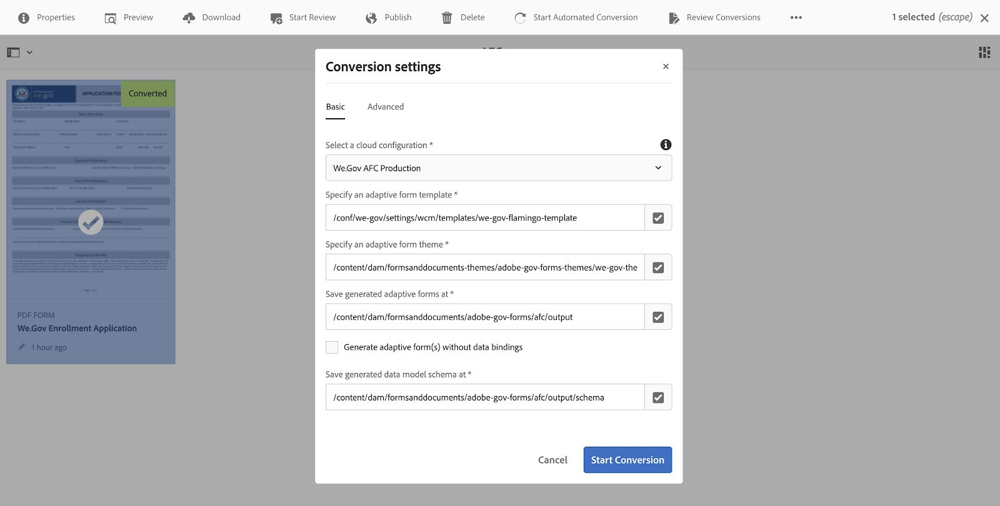

# 設定和配置We.Gov和We.Finance參考站點 {#set-up-and-configure-we-gov-reference-site}

## 示範套件詳細資訊 {#demo-package-details}

### 安裝必要條件 {#installation-prerequisites}

此包是為 **AEM Forms 6.4 OSGI作者**、已通過測試，因此支援下列平台版本：

| AEM版本 | AEM Forms.套件版本 | 狀態 |
|---|---|---|
| 6.4 | 5.0.86 | **支援** |
| 6.5 | 6.0.80 | **支援** |
| 6.5.3 | 6.0.122 | **支援** |

此套件包含支援下列平台版本的雲端設定：

| 雲端提供者 | 服務版本 | 狀態 |
|---|---|---|
| Adobe Sign | v5 API | **支援** |
| Microsoft Dynamics 365 | 1710 (9.1.0.3020) | **支援** |
| Adobe Analytics | v1.4 Rest API | **支援** |
**軟體包安裝考量事項：**

* 預期該軟體包安裝在乾淨的伺服器上，沒有其他演示軟體包或較舊的演示軟體包版本
* 套件預計會安裝在以製作模式執行的OSGI伺服器上

### 此套件包含哪些內容 {#what-does-this-package-include}

此 [AEM Forms We.Gov示範套件](https://experience.adobe.com/#/downloads/content/software-distribution/en/aem.html?package=/content/software-distribution/en/details.html/content/dam/aem/public/adobe/packages/cq650/featurepack/we-gov-forms.pkg.all-2.0.2.zip) (**we-gov-forms.pkg.all-&lt;version>.zip**)是包含數個其他子套件和服務的套件。 套件包含下列模組：

* **we-gov-forms.pkg.all-&lt;version>.zip** - *完整示範套件*

   * **we-gov-forms.ui.apps-&lt;version>.zip** *— 包含所有元件、用戶端程式庫、範例使用者、工作流程模型等。*

      * **we-gov-forms.core-&lt;version>.jar** - *包含所有OSGI服務、自訂工作流程步驟實作等。*

      * **we-gov-forms.derby&lt;version>.jar** - *包含所有OSGI服務、資料庫架構等。*

      * **core.wcm.components.all-2.0.4zip** - *WCM元件範例集合*

      * **grid-aem.ui.apps-1.0-SNAPSHOT.zip** - *AEM Sites網格版面套件（適用於Sites頁面欄控制項）*
   * **we-gov-forms.ui.content-&lt;version>.zip** - *包含所有內容、頁面、影像、表單、互動式通訊資產等。*

   * **we-gov-forms.ui.analytics-&lt;version>.zip** - *包含所有要儲存在存放庫中的We.Gov Forms Analytics資料。*

   * **we-gov-forms.config.public-&lt;version>.zip** - *包含所有預設配置節點，包括佔位符雲配置，以幫助避免表單資料模型和服務綁定問題。*

此套件中包含的資產包括：

* 具有可編輯範本的AEM網頁
* AEM Forms適用性Forms
* AEM Forms互動式通訊（列印和網頁頻道）
* AEM Forms XDP記錄檔案
* AEM Forms MS Dynamics Forms資料模型
* Adobe Sign整合
* AEM工作流程模型
* AEM Assets影像範例
* 示例（記憶體中）Apache Derby資料庫
* Apache Derby Data Source（與Form Data Model搭配使用）

## 安裝示範套件 {#demo-package-installation}

本節包含安裝示範套件的相關資訊。

### 從Software Distribution {#from-software-distribution}

1. 開啟 [Software Distribution](https://experience.adobe.com/downloads)。您需要 Adobe ID 才能登入 Software Distribution。
1. 點一下頁首功能表中的 **[!UICONTROL Adobe Experience Manager]**。
1. 在 **[!UICONTROL 篩選器]** 小節：
   1. 選擇 **[!UICONTROL Forms]** 從 **[!UICONTROL 解決方案]** 下拉式清單。
   2. 選取套件的版本和類型。 您也可以使用 **[!UICONTROL 搜尋下載]** 選項來篩選結果。
1. 點選 **we-gov-forms.pkg.all-&lt;version>.zip** 包名稱，選擇 **[!UICONTROL 接受EULA條款]**，然後點選 **[!UICONTROL 下載]**.
1. 開啟[套件管理器](https://experienceleague.adobe.com/docs/experience-manager-65/administering/contentmanagement/package-manager.html)，然後按一下&#x200B;**[!UICONTROL 「上傳套件」]**&#x200B;即可上傳套件。
1. 選取套件，然後按一下 **[!UICONTROL 安裝]**.

   

1. 允許完成安裝過程。
1. 導覽至 *https://&lt;aemserver>:&lt;port>/content/we-gov/home.html?wcmmode=disabled* 以確保安裝成功。

### 從本機ZIP檔案 {#from-a-local-zip-file}

1. 下載並找到 **we-gov-forms.pkg.all-&lt;version>.zip** 檔案。
1. 導覽至 *https://&lt;aemserver>:&lt;port>/crx/packmgr/index.jsp*.
1. 選取「上傳套件」選項。

   

1. 使用檔案瀏覽器導覽至並選取下載的ZIP檔案。
1. 按一下「開啟」即可上傳。
1. 上傳後，選取「安裝」選項以安裝套件。

   

1. 允許完成安裝過程。
1. 導覽至 *https://&lt;aemserver>:&lt;port>/content/we-gov/home.html?wcmmode=disabled* 以確保安裝成功。

### 安裝新的軟體包版本 {#installing-new-package-versions}

要安裝新軟體包版本，請按照4.1和4.2中定義的步驟操作。可以安裝較新的軟體包版本，同時已安裝其他較舊的軟體包，但建議先卸載較舊的軟體包版本。 若要這麼做，請遵循下列步驟。

1. 導覽至 *https://&lt;aemserver>:&lt;port>/crx/packmgr/index.jsp*
1. 找出舊的 **we-gov-forms.pkg.all-&lt;version>.zip** 檔案。
1. 選取「更多」選項。
1. 從下拉式清單中，選取「解除安裝」選項。

   

1. 在確認時，再次選擇「卸載」，並允許卸載過程完成。

## 示範套件設定 {#demo-package-configuration}

本節包含演示包部署後配置的詳細資訊和說明，然後再演示。

### 虛構用戶配置 {#fictional-user-configuration}

1. 導覽至 *https://&lt;aemserver>:&lt;port>/libs/granite/security/content/groupadmin.html*
1. 以管理員身分登入以執行下列工作。
1. 向下捲動至頁面結尾以載入所有使用者群組。
1. 搜索「**工作流程**」。
1. 選取「**工作流 — 使用者**&quot;組，然後按一下&quot;Properties&quot;。
1. 導航到「成員」頁簽。
1. 輸入 **wegov** 在「選擇用戶或組」欄位中。
1. 從下拉式清單中選取「**We.Gov Forms使用者**」。

   

1. 按一下功能表列中的「儲存並關閉」。
1. 通過搜索「**analytics**&quot;，選擇&quot;**Analytics管理員**&quot;組，並添加&quot;**We.Gov Forms使用者**」組作為成員。
1. 通過搜索「**表單使用者**&quot;，選擇&quot;**forms-power-users**&quot;組，並添加&quot;**We.Gov Forms使用者**」組作為成員。
1. 通過搜索「**forms-users**&quot;，選擇&quot;**forms-users**&quot;組，這次添加&quot;**We.Gov用戶**」組作為成員。

### 電子郵件伺服器配置 {#email-server-configuration}

1. 查看設定文檔 [設定電子郵件通知](/help/sites-administering/notification.md)
1. 以管理員身份登錄以執行此任務。
1. 導覽至 *https://&lt;aemserver>:&lt;port>/system/console/configMgr*
1. 找到並按一下 **Day CQ Mail Service** 要配置的服務。

   

1. 配置服務以連接到您選擇的SMTP伺服器：

   1. **SMTP伺服器主機名**:例如(smtp.gmail.com)
   1. **伺服器埠**:例如(465)（使用SSL的gmail）
   1. **SMTP用戶：** 演示@ &lt;companyname> .com
   1. **「寄件者」地址**:aemformsdemo@adobe.com

   

1. 按一下「儲存」以儲存設定。

### （選用）AEM SSL設定 {#aemsslconfig}

本節包含在AEM例項上設定SSL，以便能夠設定Adobe Sign雲端設定的詳細資訊。

**引用:**

1. [預設為SSL](/help/sites-administering/ssl-by-default.md)

**附註:**

1. 導覽至https://&lt;aemserver>:&lt;port>/aem/inbox，您將可在此完成上述參考檔案連結中說明的程式。
1. 此 `we-gov-forms.pkg.all-[version].zip` 套件包含範例SSL金鑰和憑證，可透過擷取 `we-gov-forms.pkg.all-[version].zip/ssl` 包的一部分的資料夾。

1. SSL憑證和金鑰詳細資訊：

   1. 發佈至&quot;CN=localhost&quot;
   1. 有效期10年
   1. 密碼值為&quot;password&quot;
1. 私密金鑰為 *localhostprivate.der*.
1. 憑證是 *localhost.crt*.
1. 按一下下一步。
1. HTTPS主機名稱應設為 *localhost*.
1. 埠應設定為系統已公開的埠。

### （選用）Adobe Sign雲端設定 {#adobe-sign-cloud-configuration}

本節包含Adobe Sign雲端設定的詳細資訊和指示。

**引用:**

1. [整合Adobe Sign與AEM Forms](adobe-sign-integration-adaptive-forms.md)

#### 雲端設定 {#cloud-configuration}

1. 檢閱必要條件。 請參閱 [AEM SSL設定](../../forms/using/forms-install-configure-gov-reference-site.md#aemsslconfig) ，以完成必要的SSL設定。
1. 瀏覽到:

   *https://&lt;aemserver>:&lt;port>/libs/adobesign/cloudservices/adobesign.html/conf/we-gov*

   >[!NOTE]
   >
   >用來存取AEM伺服器的URL應符合Adobe Sign OAuth重新導向URI中設定的URL，以避免設定問題(例如 *https://&lt;aemserver>:&lt;port>/mnt/overlay/adobesign/cloudservices/adobesign/properties.html*)

1. 選取「We.gov Adobe Sign」設定。
1. 按一下「屬性」。
1. 導覽至「設定」標籤。
1. 輸入oAuth URL，例如： [https://secure.na1.echosign.com/public/oauth](https://secure.na1.echosign.com/public/oauth)
1. 從已設定的Adobe Sign例項提供已設定的用戶端ID和用戶端密碼。
1. 按一下「連線至Adobe Sign」。
1. 成功連線後，按一下「儲存並關閉」以完成整合。

### （可選）MS Dynamics雲配置 {#ms-dynamics-cloud-configuration}

本節包含有關MS Dynamics雲配置的詳細資訊和說明。

**引用:**

1. [Microsoft Dynamics OData設定](https://experienceleague.adobe.com/docs/experience-manager-64/forms/form-data-model/ms-dynamics-odata-configuration.html)
1. [設定Microsoft Dynamics for AEM Forms](https://helpx.adobe.com/experience-manager/kt/forms/using/config-dynamics-for-aem-forms.html)

#### MS Dynamics OData雲服務 {#ms-dynamics-odata-cloud-service}

1. 瀏覽到:

   https://&lt;aemserver>:&lt;port>/libs/fd/fdm/gui/components/admin/fdmcloudservice/fdm.html/conf/we-gov

   1. 請確定您使用與MS Dynamics應用程式註冊中配置的相同重定向URL來訪問伺服器。

1. 選取「Microsoft Dynamics ODataCloud Service」設定。
1. 按一下「屬性」。

   

1. 導覽至「驗證設定」標籤。
1. 輸入以下詳細資訊：

   1. **服務根：** 例如 `https://msdynamicsserver.api.crm3.dynamics.com/api/data/v9.1/`
   1. **驗證類型：** OAuth 2.0
   1. **驗證設定** (請參閱 [MS Dynamics雲配置設定](../../forms/using/forms-install-configure-gov-reference-site.md#dynamicsconfig) 收集此資訊):

      1. 用戶端ID — 也稱為應用程式ID
      1. 用戶端密碼
      1. OAuth URL — 例如 [https://login.windows.net/common/oauth2/authorize](https://login.windows.net/common/oauth2/authorize)
      1. 重新整理代號URL — 例如 [https://login.windows.net/common/oauth2/token](https://login.windows.net/common/oauth2/token)
      1. 存取權杖URL — 例如 [https://login.windows.net/common/oauth2/token](https://login.windows.net/common/oauth2/token)
      1. 授權範圍 —  **openid**
      1. 驗證標題 —  **授權承載**
      1. 資源 — 例如 `https://msdynamicsserver.api.crm3.dynamics.com`
   1. 按一下「連線至OAuth」。

1. 成功驗證後，按一下「儲存並關閉」以完成整合。

#### MS Dynamics雲配置設定 {#dynamicsconfig}

本節中詳述的步驟可協助您找出用戶端ID、用戶端密碼，以及MS Dynamics Cloud例項的詳細資訊。

1. 導覽至 [https://portal.azure.com/](https://portal.azure.com/) 和登入。
1. 從左側功能表中選擇「所有服務」。
1. 搜尋或導覽至「應用程式註冊」。
1. 建立或選擇現有應用程式註冊。
1. 複製 **應用程式ID** 作為OAuth使用 **用戶端ID** 在AEM雲端設定中
1. 按一下「設定」或「資訊清單」，設定 **回覆URL。**

   1. 此URL必須符合設定OData服務時用來存取AEM伺服器的URL。

1. 在「設定」檢視中，按一下「金鑰」以檢視建立新金鑰(這會作為AEM中的用戶端密碼)。

   1. 請務必保留金鑰副本，因為您以後無法在Azure或AEM中檢視金鑰。

1. 若要找到資源URL/服務根URL，請導覽至MS Dynamics執行個體控制面板。
1. 在頂端導覽列中，按一下「銷售」或您自己的執行個體類型，然後按一下「選取設定」。
1. 按一下右下方附近的「自訂」和「開發人員資源」。
1. 您會在此處找到服務根URL:例如

   *`https://msdynamicsserver.api.crm3.dynamics.com/api/data/v9.1/`

1. 有關重新整理和存取Token URL的詳細資訊，請前往：

   *[https://docs.microsoft.com/en-us/rest/api/datacatalog/authenticate-a-client-app](https://docs.microsoft.com/en-us/rest/api/datacatalog/authenticate-a-client-app)*

#### 測試Forms資料模型(Dynamics) {#testing-the-form-data-model}

雲端設定完成後，您可能需要測試表單資料模型。

1. 瀏覽到

   *https://&lt;aemserver>:&lt;port>/aem/forms.html*

1. 選取「We.gov Microsoft Dynamics CRM FDM」，然後選取「屬性」。

   

1. 導覽至「更新來源」標籤。
1. 請確定「內容感知設定」已設為「/conf/we-gov」，且已設定的資料來源為「ms-dynamics-odata-cloud-service」。

   

1. 編輯表單資料模型。

1. 測試服務，確保它們成功連接到配置的資料源。

   >[!NOTE]
   測試服務後，按一下 **取消** 以確保非自願更改不會傳播到表單資料模型。

   >[!NOTE]
   已回報，資料來源需要AEM伺服器重新啟動才能成功系結至FDM。

#### 測試Forms資料模型(Derby) {#test-fdm-derby}

雲端設定完成後，您可能需要測試表單資料模型。

1. 導覽至 *https://&lt;aemserver>:&lt;port>/aem/forms.html*

1. 選取 **We.gov註冊FDM** 選取 **屬性**.

   

1. 導覽至 **更新源** 標籤。

1. 確保 **內容感知配置** 設為 `/conf/we-gov` 而配置的資料源 **We.Gov Derby DS**.

   

1. 按一下 **儲存並關閉**.

1. [測試服務](work-with-form-data-model.md#test-data-model-objects-and-services) 以確保他們成功連接到配置的資料源

   * 若要測試連線，請選取 **HOMEMORGAGEACCOUNT** 給它一份禮物。 測試服務，系統管理員便可以看到要擷取的資料。

### Adobe Analytics設定（選用） {#adobe-analytics-configuration}

本節包含Adobe Analytics Cloud設定的詳細資訊和指示。

**引用:**

* [整合 Adobe Analytics](../../sites-administering/adobeanalytics.md)

* [連接Adobe Analytics和建立框架](../../sites-administering/adobeanalytics-connect.md)

* [查看頁面分析資料](../../sites-authoring/pa-using.md)

* [設定分析和報表](configure-analytics-forms-documents.md)

* [檢視並了解AEM Forms分析報表](view-understand-aem-forms-analytics-reports.md)

### Adobe Analytics雲端服務設定 {#adobe-analytics-cloud-service-configuration}

此套件已預先設定，可連線至Adobe Analytics。 提供下列步驟以更新此設定。

1. 導覽至 *https://&lt;aemserver>:&lt;port>/libs/cq/core/content/tools/cloudservices.html*
1. 找出Adobe Analytics區段，並選取「顯示設定」連結。
1. 選取「We.Gov Adobe Analytics（Analytics設定）」設定。

   

1. 按一下「編輯」按鈕以更新Adobe Analytics設定（您需要提供共用機密）。 按一下「連線至Analytics」以連線，按一下「確定」即可完成。

   

1. 如果您要更新架構設定，請在同一頁按一下「We.Gov Adobe Analytics Framework(Analytics Framework)」(請參閱 [啟用AEM製作](../../forms/using/forms-install-configure-gov-reference-site.md#enableauthoring) 啟用編寫)。

#### Adobe Analytics找到使用者憑證 {#analytics-locating-user-credentials}

若要找出Adobe Analytics帳戶的使用者認證，帳戶管理員必須執行下列工作。

1. 導覽至Adobe Experience Cloud入口網站。
   * 使用管理員憑證登入
1. 在主控制面板中選取Adobe Analytics圖示。
   
1. 導覽至「管理員」標籤，然後選取「使用者管理（舊版）」項目
   
1. 選取 **使用者** 標籤。
   
1. 從使用者清單中選取所需的使用者。
1. 捲動至頁面底部，使用者驗證資訊就會顯示在頁面底部。
   
1. 使用者名稱和共用的機密資訊會顯示在權限方塊的右側。
1. 請注意，使用者名稱的名稱中會有冒號，冒號左側的所有資訊都是使用者名稱，冒號右側的所有資訊都是公司名稱。
   * 以下是範例： *使用者名稱：公司名稱*

#### 在Adobe Analytics中設定使用者驗證 {#setup-user-authentication}

管理員可執行下列動作，為使用者提供AEM analytics權限。

1. 導覽至Adobe Admin Console。

1. 按一下Admin Console公開的Analytics例項。

   * 這位於管理頁面的主要頁面。

1. 選取Analytics完整管理員存取權。

1. 新增使用者至設定檔。

   

1. 將使用者ID對應至設定檔後，按一下「權限」標籤。

1. 確認所有權限皆已對應至設定檔。

   

1. 請注意，一旦權限對應完畢，使用者登入的功能可能需要數小時的時間。

### Adobe Analytics報告 {#adobe-analytics-reporting}

#### 檢視Adobe Analytics網站報表 {#view-adobe-analytics-sites-reporting}

>[!NOTE]
AEM Forms Analytics資料可在離線時使用，若 `we-gov-forms.ui.analytics-<version>.zip` 已安裝套件，但AEM Sites資料需要使用中的雲端設定。

1. 導覽至 *https://&lt;aemserver>:&lt;port>/sites.html/content*
1. 選取「AEM Forms We.Gov網站」以檢視網站頁面。
1. 選取其中一個網站頁面（例如首頁），然後選擇「Analytics &amp; Recommendations」。

   

1. 在本頁，您會看到從Adobe Analytics擷取的與AEM Sites頁面相關的資訊(注意：設計後，此資訊會從Adobe Analytics定期重新整理，且不會即時顯示)。

   

1. 返回頁面檢視頁面（在步驟3中存取），您也可以變更顯示設定以檢視「清單檢視」中的項目，以檢視頁面檢視資訊。
1. 找到「View」下拉菜單，然後選擇「List View」。

   

1. 從相同功能表中選取「檢視設定」，然後從「Analytics」區段選取您要顯示的欄。

   

1. 按一下「更新」，即可使用新欄。

   

#### 檢視Adobe Analytics表單報表 {#view-adobe-analytics-forms-reporting}

>[!NOTE]
AEM Forms Analytics資料可在離線時使用，若 `we-gov-forms.ui.analytics-<version>.zip` 已安裝套件，但AEM Sites資料需要使用中的雲端設定。

1. 瀏覽到

   *https://&lt;aemserver>:&lt;port>/aem/forms.html/content/dam/formsanddocuments/adobe-gov-forms*

1. 選擇「健康福利登記應用程式」適用性表單，然後選擇「Analytics報表」選項。

   

1. 等候頁面載入，並檢視Analytics報表資料。

   

### Adobe自動Forms設定啟用 {#automated-forms-enablement}

若要使用AdobeForms來安裝及設定AEM Forms，轉換工具使用者必須具備下列條件。

1. 存取Adobe I/O。

1. 與AdobeForms轉換服務建立整合的權限。

1. AdobeAEM 6.5以作者身分執行的最新Service Pack。

閱讀進一步說明前，請先檢閱以下內容：

* [設定自動表單轉換服務](https://experienceleague.adobe.com/docs/aem-forms-automated-conversion-service/using/configure-service.html)

#### 建立IMS設定第1部分 {#creating-ims-config}

若要設定服務以正確與表單轉換工具通訊，使用者必須設定Identity Management系統(IMS)服務才能註冊Adobe I/O。

1. 導覽至https://&lt;aemserver>:&lt;port> >按一下左上方的Adobe Experience Manager >工具>安全性> Adobe IMS設定。

1. 按一下建立。

1. 在下圖中執行動作。

   

1. 請務必下載憑證。

1. 請勿繼續進行其餘的設定 — 檢閱區段 [在Adobe I/O中建立整合](#create-integration-adobeio)

>[!NOTE]
本節中建立的憑證將用於建立Adobe I/O中的整合服務。使用者在整合服務中建立後，使用者就可以使用來自Adobe I/O的該資訊來完成設定。

#### 在Adobe I/O中建立整合 {#create-integration-adobeio}

如果您未連絡系統管理員以便這麼做，請確定您能夠在Adobe網域內建立整合。

1. 導覽至 [Adobe I/O主控台](https://console.adobe.io/).

1. 按一下建立整合項目。

1. 選取存取API。

1. 請確定您所在的群組正確無誤（右上角的下拉式清單）。

1. 在「Experience Cloud」區段中，選取「Forms轉換工具」。

1. 按一下「繼續」。

1. 輸入整合的名稱和說明。

1. 使用2.1節中的公開金鑰，將其置於金鑰整合中。

1. 選取您的automated forms conversion的設定檔。

   

#### 建立IMS設定第2部分 {#create-ims-config-part-next}

您已建立整合，現在可讓我們完成IMS設定的安裝。

1. 按一下Adobe I/O中的整合，以公開連線詳細資料。

1. 在AEM中導覽至您的IMS設定（工具>安全性> IMS）

1. 在IMS設定畫面上按「下一步」 。

1. 輸入授權伺服器（螢幕擷取中顯示的值）。

1. 輸入API金鑰。

1. 輸入用戶端密碼(必須按一下Adobe I/O中的「公開」整合才會公開)。

1. 按一下Adobe I/O中的JWT標籤，以取得JWT裝載並貼到IMS設定的裝載中。

   

1. 建立後，按一下IMS設定並選取「健康狀況檢查」 ，使用者應該會看到下列結果。

   

#### 配置雲配置（We.Gov AFC生產） {#configure-cloud-configuration}

完成IMS設定後，我們就可以繼續檢閱AEM中的雲端設定。 如果配置不存在，請使用下列步驟在AEM中建立雲配置：

1. 開啟瀏覽器並導覽至系統URL https://&lt;domain_name>:&lt;system_port>

1. 按一下畫面左上角的「Adobe Experience Manager >工具>Cloud Services>自動Forms對話設定」 。

1. 選取要放置配置的配置資料夾。

1. 按一下建立。

1. 在下方的螢幕擷取中輸入資訊。

   

1. 為設定提供標題和名稱。

1. 系統的服務URL設定為https://aemformsconversion.adobe.io/。

1. 範本URL */conf/we-gov/settings/wcm/templates/we-gov-flamingo-template*.

1. 主題URL: */content/dam/formsanddocuments-themes/adobe-gov-forms-themes/we-gov-themes*

1. 按一下下一步。

1. 針對此設定，我們將兩個核取方塊值保留為空白。

   * 若要進一步了解這些選項，請參閱 [設定雲端服務](https://experienceleague.adobe.com/docs/aem-forms-automated-conversion-service/using/configure-service.html#configure-the-cloud-service).

#### 配置雲配置（We.Finance AFC生產） {#configure-cloud-configuration-wefinance}

完成IMS設定後，我們就可以在AEM中繼續建立雲端設定。

1. 開啟瀏覽器並導覽至系統URL https://&lt;domain_name>:&lt;system_port>

1. 按一下畫面左上角的「Adobe Experience Manager >工具>Cloud Services>自動Forms對話設定」 。

1. 選取要放置配置的配置資料夾。

1. 按一下建立。

1. 在下方的螢幕擷取中輸入資訊。

   

1. 為設定提供標題和名稱。

1. 系統的服務URL設定為https://aemformsconversion.adobe.io/

1. 範本URL: */conf/we-finance/settings/wcm/templates/we-finance-adaptive-form*

1. 主題URL: */content/dam/formsanddocuments-themes/adobe finance-forms-themes/we-finance-themes*

1. 按一下下一步。

1. 針對此設定，我們將兩個核取方塊值保留為空白。

   * 若要進一步了解這些選項，請參閱 [設定雲端服務](https://experienceleague.adobe.com/docs/aem-forms-automated-conversion-service/using/configure-service.html#configure-the-cloud-service).

#### 測試表單轉換（We.Gov註冊應用程式） {#test-forms-conversion}

設定完成後，使用者可以上傳PDF檔案來測試設定。

1. 導覽至AEM系統https://&lt;domain_name>:&lt;system_port>

1. 按一下「Forms > Forms與檔案> AEM Forms We.gov Forms > AFC」。

1. 選擇We.Gov註冊應用程式PDF。

1. 按一下 **開始自動轉換** 按鈕。

1. 使用者應該可以看見下列選項。

   

1. 選取按鈕後，使用者將看到下列選項

   * 確認使用者選取 *We.Gov AFC生產* 配置

   

   

1. 設定您要使用的所有選項後，請選取「開始轉換」 。

1. 轉換程式開始時，使用者應該會看到下列畫面：

   

1. 轉換完成後，使用者會看到下列畫面：

   

   按一下 **輸出** 資料夾，以檢視產生的最適化表單。

#### 已知問題與附註 {#known-issues-notes}

automated forms conversion服務包含 [最佳實務，已知的複雜模式](https://experienceleague.adobe.com/docs/aem-forms-automated-conversion-service/using/styles-and-pattern-considerations-and-best-practices.html)，和 [已知問題](https://experienceleague.adobe.com/docs/aem-forms-automated-conversion-service/using/known-issues.html). 開始使用AEM FormsAutomated forms conversion服務前，請先檢閱這些項目。

1. 如果要在轉換後將表單綁定到FDM，則生成具有生成適用性表單而不啟用資料綁定的表單。

1. 請確定範本資料夾已啟用jcr:read for everyone權限，否則服務使用者將無法從存放庫讀取範本，且轉換將會失敗。

## 示範套件自訂 {#demo-package-customizations}

本節包含自訂示範的指示。

### 範本自訂 {#templates-customization}

可編輯的模板位於以下位置：

*https://&lt;aemserver>:&lt;port>/libs/wcm/core/content/sites/templates.html/conf/we-gov*

這些範本包括AEM網站、最適化表單和互動式通訊範本，這些範本是由元件建立並組合而成，可在下列位置找到：

*https://&lt;aemserver>:&lt;port>/crx/de/index.jsp#/apps/we-gov/components*

#### 樣式系統 {#customizetemplates}

此網站也提供用戶端程式庫，其中一個會匯入Bootstrap4( [https://getbootstrap.com/](https://getbootstrap.com/) )。 此客戶端庫位於

*https://&lt;aemserver>:&lt;port>/crx/de/index.jsp#/apps/we-gov/clientlibs/clientlib-base/css/bootstrap*

此套件中包含的可編輯範本也已預先設定範本/頁面原則，這些原則使用Bootstrap4 CSS類別進行分頁、樣式等。 並非所有類都已添加到模板策略中，但任何Bootstrap4支援的類都可以添加到策略中。 有關可用類的清單，請參閱快速入門頁：

[https://getbootstrap.com/docs/4.1/getting-started/introduction/](https://getbootstrap.com/docs/4.1/getting-started/introduction/)

此包中包含的模板也支援樣式系統：

[樣式系統](../../sites-authoring/style-system.md)

#### 範本標誌 {#template-logos}

專案DAM資產也包含We.Gov標誌和影像。 這些資產可於：

*https://&lt;aemserver>:&lt;port>/assets.html*

編輯頁面範本和表單範本時，您可以選擇編輯導覽和頁尾元件以更新品牌標誌。 這些元件提供可設定的品牌和標誌對話方塊，可用來更新標誌：

如需詳細資訊，請參閱編輯頁面內容：

[編輯頁面內容](../../sites-authoring/editing-content.md)

### 網站頁面自訂 {#sites-pages-customization}

所有網頁均可從以下網址取得： *https://&lt;aemserver>:&lt;port>/sites.html*

這些網站頁面也可運用AEM格線套件來控制一些元件的版面配置。

#### 樣式系統 {#style-system}

此包中包含的頁面也支援樣式系統：

[樣式系統](../../sites-authoring/style-system.md)

您也可以參閱 [模板定制樣式系統](../../forms/using/forms-install-configure-gov-reference-site.md#customizetemplates) 以取得支援樣式的檔案。

### 最適化表單自訂 {#adaptive-forms-customization}

所有最適化表單皆可從以下網址取得：

*https://&lt;aemserver>:&lt;port>/aem/forms.html/content/dam/formsanddocuments/adobe-gov-forms*

這些表單可自訂以符合特定使用案例。 請注意，不應修改某些欄位和提交邏輯，以確保表單可繼續正常運作。 這包括：

**健康福利的註冊申請：**

* contact_id — 在提交期間用於接收MS Dynamics聯繫人ID的隱藏欄位
* 提交 — 提交按鈕邏輯需要自定義以支援回叫。 自定義是有文檔記錄的，但在通過Forms資料模型對MS Dynamics執行POST和GET操作時，需要一個大指令碼來提交表單。
* 根面板 — 初始化事件可用來以干擾最少的方式，將MS Dynamics按鈕新增至AEM收件匣，因為所有AEM收件匣Granite UI元件皆不可修改。

#### 最適化表單樣式 {#adaptive-form-styling}

也可以使用樣式編輯器或主題編輯器來設定最適化表單的樣式：

* [最適化表單元件的內嵌樣式](inline-style-adaptive-forms.md)
* [建立和使用主題](themes.md)

### 工作流程自訂 {#workflow-customization}

「註冊適用性表單」會提交至OSGI工作流程以進行處理。 此工作流程位於 *https://&lt;aemserver>:&lt;port>/conf/we-gov/settings/models/we-gov-process.html*.

由於某些限制，此工作流程包含數個指令碼和自訂OSGI工作流程處理步驟。 這些工作流程步驟已建立為一般步驟，且尚未使用設定對話方塊建立。 目前，工作流程步驟的設定需仰賴程式引數。

所有工作流程步驟Java程式碼都包含在 **we-gov-forms.core-&lt;version>.jar** 捆綁。

## 示範考量事項和已知問題 {#demo-considerations-and-known-issues}

本節包含示範功能和設計決策的相關資訊，在示範過程中可能需要特殊考量。

### 示範考量事項 {#demo-considerations}

* 根據AGRS-159，確保「註冊適用性表單」中使用的聯繫人名稱（第一、中間和最後）是唯一的。
* 註冊適用性表單會將Adobe Sign電子郵件傳送至表單的電子郵件欄位中指定的電子郵件。 該電子郵件地址不能與用來設定Adobe Sign雲端設定的電子郵件地址相同。

### 已知問題 {#known-issues}

* (AGRS-120)網站導覽元件目前不支援深度超過2層的巢狀子頁面。
* (AGRS-159)當前MS Dynamics FDM需要先執行2個操作，將註冊適用性表單資料POST為Dynamics，然後擷取使用者記錄，以擷取聯絡人ID。 在其目前狀態中，如果Dynamics中有兩個以上同名的使用者，則擷取聯絡人ID會失敗，這將不允許提交註冊適用性表單。

## 設定協助工具測試 {#configure-accessibility-testing}

### 啟用協助工具測試Chrome附加元件 {#enable-chrome-add-on}

若要執行協助工具測試，請安裝此處找到的Chrome外掛程式： `https://chrome.google.com/webstore/detail/accessibility-developer-t/fpkknkljclfencbdbgkenhalefipecmb?hl=en`. <!-- This URL is a 404. As such, please fix and update this entire topic. We ought not to be writing about third-party software that we have no control over to avoid these 404s. Consider making this topic entirely generic and leaving it up to the user to choose their own Accessibility Testing add-on. -->

安裝後，請在Chrome瀏覽器中載入您要測試的頁面(注意：開啟多個索引標籤可能會影響您的分數，建議僅開啟一個索引標籤。) 載入頁面後
**按一下右鍵** 在頁面上，並選取 **稽核** 標籤。 開發人員可選取協助工具外掛程式要執行的稽核類型。 選取所有所需選項後，使用者就可以按一下「產生報表」按鈕。 這將產生一份PDF檔案，顯示整體無障礙評等，以及可用來提升整體無障礙評等的內容。

執行報表後，使用者會看到下列內容：

使用者面前顯示的數字即為使用者獲得的整體無障礙評等。 此外也說明在分數後計算此值的方式。

如果使用者想要匯出此項目，可以按一下畫面右側的三個按鈕，然後從外掛程式提供的其他選項中選取。

### 超海洋主題 {#ultramarine-theme}

由Adobe維護的可公開使用的Ultramarine主題內置於
`we-gov-forms.pkg.all-<version>.zip` 可安裝的ZIP檔案。 使用CRX安裝此套件後。

封裝管理器，使用者可導覽至 **Forms** > **主題** > **參考主題** > **超海洋無障礙**.

## 設定選項 {#configuration-options}

使用者可設定各種工作流程服務選項，其中包括：

1. Microsoft Dynamics項目
1. Adobe Sign
1. AEM自訂通訊管理
1. Adobe Analytics

若要將其設定為在工作流程內啟用，使用者需執行下列工作。

1. 導覽至https://&#39;[伺服器]:[埠]「/system/console/configMgr。

1. 找出 *WeGov配置*.

1. 開啟服務定義，並啟用在工作流中調用所選服務。

   >[!NOTE]
   正因為用戶在Configuration Manager頁中啟用了服務，用戶仍需要設定服務配置以便與請求的外部服務通信。

   

1. 完成後，按一下「儲存」按鈕以儲存設定。

## 後續步驟 {#next-steps}

現在，大家都準備去探索We.Gov參考網站。 如需We.Gov參考網站工作流程和步驟的詳細資訊，請參閱 [We.Gov參考網站逐步說明](../../forms/using/forms-gov-reference-site-user-demo.md).
