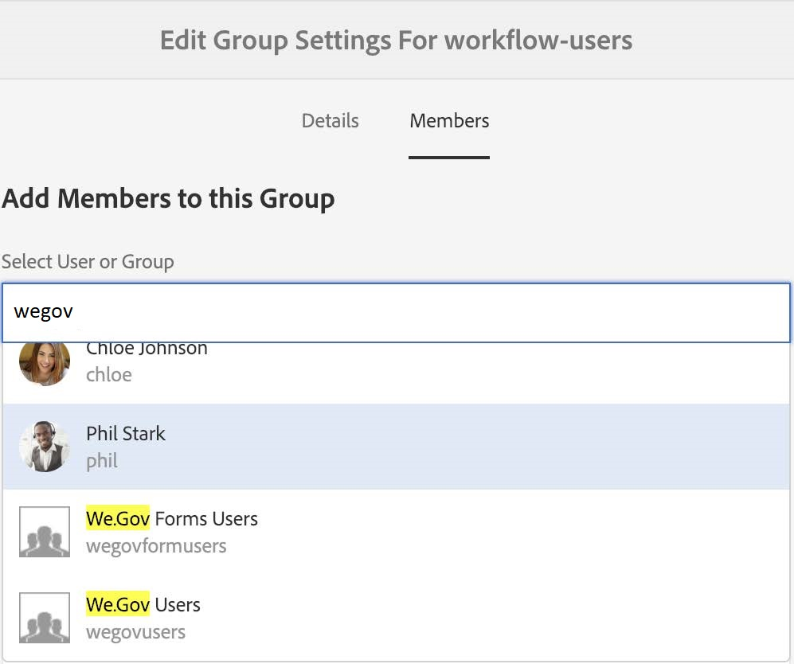
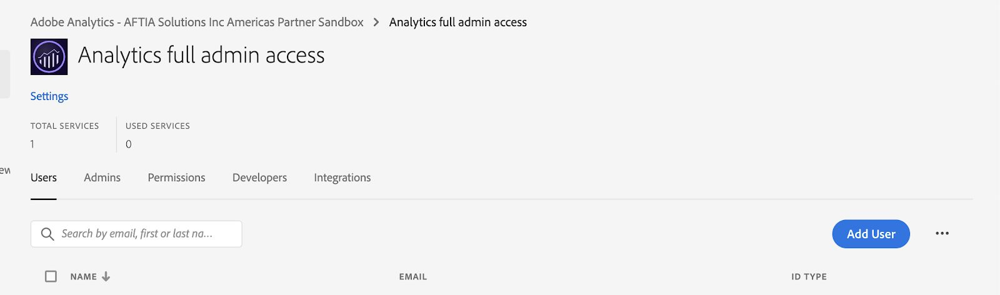

# 設定和配置We.Gov和We.Finance參考站點 {#set-up-and-configure-we-gov-reference-site}

## 演示包詳細資訊 {#demo-package-details}

### 安裝必備元件 {#installation-prerequisites}

此包是為 **AEM Forms6.4 OSGI作者**、已測試，因此在以下平台版本上受支援：

| 版AEM本 | AEM Forms。包版本 | 狀態 |
|---|---|---|
| 6.4 | 5.0.86 | **支援** |
| 6.5 | 6.0.80 | **支援** |
| 6.5.3 | 6.0.122 | **支援** |

此軟體包包含支援以下平台版本的雲配置：

| 雲提供程式 | 服務版本 | 狀態 |
|---|---|---|
| Adobe Sign | v5 API | **支援** |
| Microsoft動力365 | 1710 (9.1.0.3020) | **支援** |
| Adobe Analytics | v1.4 REST API | **支援** |
**軟體包安裝注意事項：**

* 預期該軟體包安裝在乾淨的伺服器上，不需要其他演示軟體包或較舊的演示軟體包版本
* 預期該軟體包安裝在以「作者」模式運行的OSGI伺服器上

### 此包包括什麼 {#what-does-this-package-include}

的 [AEM FormsWe.Gov演示包](https://experience.adobe.com/#/downloads/content/software-distribution/en/aem.html?package=/content/software-distribution/en/details.html/content/dam/aem/public/adobe/packages/cq650/featurepack/we-gov-forms.pkg.all-2.0.2.zip) (**we-gov.forms.pkg.all-&lt;version>.zip**)是一個包，它包括其他幾個子包和服務。 該軟體包包括以下模組：

* **we-gov.forms.pkg.all-&lt;version>.zip** - *完整的演示包*

   * **we-gov-forms.ui.apps-&lt;version>.zip** *— 包含所有元件、客戶端庫、示例用戶、工作流模型等。*

      * **we-gov-forms.core-&lt;version>.jar** - *包含所有OSGI服務、自定義工作流步驟實現等。*

      * **we-gov-forms.derby&lt;version>.jar** - *包含所有OSGI服務、資料庫架構等。*

      * **core.wcm.components.all-2.0.4.zip** - *WCM元件樣本的收集*

      * **grid-aem.ui.apps-1.0-SNAPSHOT.zip** - *AEM Sites網格佈局包，用於「站點」頁列控制項*
   * **we-gov-forms.ui.content-&lt;version>.zip** - *包含所有內容、頁面、影像、表單、互動式通信資產等。*

   * **we-gov-forms.ui.analytics-&lt;version>.zip** - *包含要儲存在儲存庫中的所有We.GovForms分析資料。*

   * **we-govforms.config.public-&lt;version>.zip** - *包含所有預設配置節點，包括佔位符雲配置，以幫助避免表單資料模型和服務綁定問題。*

此包中包含的資產包括：

* 具有可AEM編輯模板的網站頁
* AEM Forms適應Forms
* AEM Forms互動式通信（打印和Web通道）
* AEM FormsXDP備案檔案
* AEM FormsMS DynamicsForms資料模型
* Adobe Sign整合
* 工AEM作流模型
* AEM Assets示例影像
* 示例（記憶體中）Apache Derby資料庫
* Apache Derby資料源（用於窗體資料模型）

## 演示軟體包安裝 {#demo-package-installation}

本節包含有關安裝演示軟體包的資訊。

### 從軟體分發 {#from-software-distribution}

1. 開啟 [Software Distribution](https://experience.adobe.com/downloads)。您需要 Adobe ID 才能登入 Software Distribution。
1. 點一下頁首功能表中的 **[!UICONTROL Adobe Experience Manager]**。
1. 在 **[!UICONTROL 篩選器]** 部分：
   1. 選擇 **[!UICONTROL Forms]** 從 **[!UICONTROL 解決方案]** 的子菜單。
   2. 選擇包的版本和類型。 您還可以使用 **[!UICONTROL 搜索下載]** 選項。
1. 點擊 **we-gov.forms.pkg.all-&lt;version>.zip** 包名稱，選擇 **[!UICONTROL 接受EULA條款]**，然後點擊 **[!UICONTROL 下載]**。
1. 開啟[套件管理器](https://experienceleague.adobe.com/docs/experience-manager-65/administering/contentmanagement/package-manager.html)，然後按一下&#x200B;**[!UICONTROL 「上傳套件」]**&#x200B;即可上傳套件。
1. 選擇包並按一下 **[!UICONTROL 安裝]**。

   

1. 允許安裝過程完成。
1. 導航到 *https://&lt;aemserver>:&lt;port>/content/we-gov/home.html?wcmmode=disabled* 以確保安裝成功。

### 從本地ZIP檔案 {#from-a-local-zip-file}

1. 下載並查找 **we-gov.forms.pkg.all-&lt;version>.zip** 的子菜單。
1. 導航到 *https://&lt;aemserver>:&lt;port>/crx/packmgr/index.jsp*。
1. 選擇「上載包」選項。

   

1. 使用檔案瀏覽器導航並選擇下載的ZIP檔案。
1. 按一下「開啟」上載。
1. 上載後，選擇「安裝」選項以安裝包。

   

1. 允許安裝過程完成。
1. 導航到 *https://&lt;aemserver>:&lt;port>/content/we-gov/home.html?wcmmode=disabled* 以確保安裝成功。

### 正在安裝新軟體包版本 {#installing-new-package-versions}

要安裝新的軟體包版本，請按照4.1和4.2中定義的步驟操作。可以在已安裝其他較舊軟體包時安裝較新的軟體包版本，但建議先卸載較舊的軟體包版本。 為此，請執行以下步驟。

1. 導航到 *https://&lt;aemserver>:&lt;port>/crx/packmgr/index.jsp*
1. 查找較舊的 **we-gov.forms.pkg.all-&lt;version>.zip** 的子菜單。
1. 選擇「更多」選項。
1. 從下拉清單中，選擇「卸載」選項。

   

1. 確認後，再次選擇「卸載」，並允許卸載過程完成。

## 演示包配置 {#demo-package-configuration}

本部分包含演示包部署後配置的詳細資訊和說明，然後再演示。

### 虛構用戶配置 {#fictional-user-configuration}

1. 導航到 *https://&lt;aemserver>:&lt;port>/libs/granite/security/content/groupadmin.html*
1. 以管理員身份登錄以執行以下任務。
1. 向下滾動到頁面結尾以載入所有用戶組。
1. 搜索「」**工作流**。
1. 選擇「」**工作流用戶**」組，然後按一下「屬性」。
1. 導航到「成員」頁籤。
1. 鍵入 **韋戈夫** 在「選擇用戶或組」欄位中。
1. 從下拉清單中選擇&quot;**We.GovForms用戶**。

   

1. 按一下菜單欄中的「保存並關閉」。
1. 通過搜索「」重複步驟2-7 **分析**&quot;，選擇&quot;**分析管理員**&quot;組，並添加&quot;**We.GovForms用戶**「組為成員。
1. 通過搜索「」重複步驟2-7 **表單用戶**&quot;，選擇&quot;**表單超級用戶**&quot;組，並添加&quot;**We.GovForms用戶**「組為成員。
1. 通過搜索「」重複步驟2-7 **表單用戶**&quot;，選擇&quot;**表單用戶**&quot;組，這次添加&quot;**We.Gov用戶**「組為成員。

### 電子郵件伺服器配置 {#email-server-configuration}

1. 查看安裝文檔 [配置電子郵件通知](/help/sites-administering/notification.md)
1. 以管理員身份登錄以執行此任務。
1. 導航到 *https://&lt;aemserver>:&lt;port>/system/console/configMgr*
1. 找到並按一下 **第CQ天郵件服務** 要配置的服務。

   

1. 配置服務以連接到您選擇的SMTP伺服器：

   1. **SMTP伺服器主機名**:例如(smtp.gmail.com)
   1. **伺服器埠**:例如(465)用於使用SSL的gmail
   1. **SMTP用戶：** 演示@ &lt;companyname> .com
   1. **「發件人」地址**:aemformsdemo@adobe.com

   

1. 按一下「保存」以保存配置。

### （可選）AEMSSL配置 {#aemsslconfig}

本節包含有關在實例上配置AEMSSL以便能夠配置Adobe Sign雲配置的詳細資訊。

**引用:**

1. [預設情況下SSL](/help/sites-administering/ssl-by-default.md)

**附註:**

1. 導航到https://&lt;aemserver>:&lt;port>/aem/inbox，您可以在其中完成上述參考文檔連結中說明的過程。
1. 的 `we-gov-forms.pkg.all-[version].zip` 軟體包包含通過提取SSL密鑰和證書來訪問的示例 `we-gov-forms.pkg.all-[version].zip/ssl` 資料夾。

1. SSL證書和密鑰詳細資訊：

   1. 頒發給&quot;CN=localhost&quot;
   1. 10年有效期
   1. 密碼值為&quot;password&quot;
1. 私鑰是 *localhostprivate.der*。
1. 證書是 *localhost.crt*。
1. 按一下下一步。
1. HTTPS主機名應設定為 *本地主機*。
1. 埠應設定為系統已暴露的埠。

### （可選）Adobe Sign雲配置 {#adobe-sign-cloud-configuration}

本節包含有關Adobe Sign雲配置的詳細資訊和說明。

**引用:**

1. [整合Adobe Sign與AEM Forms](adobe-sign-integration-adaptive-forms.md)

#### 雲配置 {#cloud-configuration}

1. 查看先決條件。 請參閱 [AEMSSL配置](../../forms/using/forms-install-configure-gov-reference-site.md#aemsslconfig) SSL配置。
1. 瀏覽到:

   *https://&lt;aemserver>:&lt;port>/libs/adobesign/cloudservices/adobesign.html/conf/wegov*

   >[!NOTE]
   >
   >用於訪問伺服器AEM的URL應與Adobe SignOAuth重定向URI中配置的URL匹配，以避免配置問題(例如 *https://&lt;aemserver>:&lt;port>/mnt/overlay/adobesign/cloudservices/adobesign/properties.html*)

1. 選擇「We.govAdobe Sign」配置。
1. 按一下「屬性」。
1. 導航到「設定」頁籤。
1. 輸入身份驗證URL，例如： [https://secure.na1.echosign.com/public/oauth](https://secure.na1.echosign.com/public/oauth)
1. 從已配置的Adobe Sign實例中提供已配置的客戶端ID和客戶端密碼。
1. 按一下「連接到Adobe Sign」。
1. 成功連接後，按一下「保存並關閉」完成整合。

### （可選）MS Dynamics雲配置 {#ms-dynamics-cloud-configuration}

本節包含有關MS Dynamics雲配置的詳細資訊和說明。

**引用:**

1. [MicrosoftDynamics OData配置](/help/forms/using/ms-dynamics-odata-configuration.md)
1. [為Microsoft配置AEM Forms](https://experienceleague.adobe.com/docs/experience-manager-learn/forms/adaptive-forms/using-ms-dynamics-with-aem-forms.html)

#### MS Dynamics OData雲服務 {#ms-dynamics-odata-cloud-service}

1. 瀏覽到:

   https://&lt;aemserver>:&lt;port>/libs/fd/fdm/gui/components/admin/fdmcloudservice/fdm.html/conf/wegov

   1. 確保使用與MS Dynamics應用程式註冊中配置的相同重定向URL訪問伺服器。

1. 選擇「MicrosoftDynamics ODataCloud Service」配置。
1. 按一下「屬性」。

   

1. 導航到「驗證設定」頁籤。
1. 輸入以下詳細資訊：

   1. **服務根：** 例如 `https://msdynamicsserver.api.crm3.dynamics.com/api/data/v9.1/`
   1. **驗證類型：** OAuth 2.0
   1. **驗證設定** （請參見） [MS Dynamics雲配置設定](../../forms/using/forms-install-configure-gov-reference-site.md#dynamicsconfig) 要收集此資訊):

      1. 客戶端ID — 也稱為應用程式ID
      1. 用戶端密碼
      1. OAuth URL — 例如 [https://login.windows.net/common/oauth2/authorize](https://login.windows.net/common/oauth2/authorize)
      1. 刷新標籤URL — 例如 [https://login.windows.net/common/oauth2/token](https://login.windows.net/common/oauth2/token)
      1. 訪問令牌URL — 例如 [https://login.windows.net/common/oauth2/token](https://login.windows.net/common/oauth2/token)
      1. 授權範圍 —  **openid**
      1. 驗證頭 —  **授權持有者**
      1. 資源 — 例如 `https://msdynamicsserver.api.crm3.dynamics.com`
   1. 按一下「連接到OAuth」。

1. 成功驗證後，按一下「保存並關閉」完成整合。

#### MS Dynamics雲配置設定 {#dynamicsconfig}

本節中詳細介紹的步驟將幫助您從MS Dynamics Cloud實例中查找客戶端ID、客戶端密碼和詳細資訊。

1. 導航到 [https://portal.azure.com/](https://portal.azure.com/) 並登錄。
1. 從左側菜單中選擇「All Services（所有服務）」。
1. 搜索或導航到「應用註冊」。
1. 建立或選擇現有應用程式註冊。
1. 複製 **應用程式ID** 用作OAuth **客戶端ID** 在雲AEM配置中
1. 按一下「設定」或「清單」以配置 **答復URL。**

   1. 此URL必須與配置OData服務時用於訪AEM問伺服器的URL匹配。

1. 在「設定」視圖中，按一下「密鑰」以查看建立新密鑰(此項在中用作客戶端密AEM鑰)。

   1. 請確保保留密鑰的副本，因為您以後將無法在Azure或中查看AEM它。

1. 要查找資源URL/服務根URL，請導航到MS Dynamics實例儀表板。
1. 在頂部導航欄中，按一下「銷售」或您自己的實例類型，然後按一下「選擇設定」。
1. 按一下右下角的「自定義」和「開發人員資源」。
1. 您將在此處找到服務根URL:例如

   *`https://msdynamicsserver.api.crm3.dynamics.com/api/data/v9.1/`

1. 有關刷新和訪問令牌URL的詳細資訊，請參閱：

   *[https://docs.microsoft.com/en-us/rest/api/datacatalog/authenticate-a-client-app](https://docs.microsoft.com/en-us/rest/api/datacatalog/authenticate-a-client-app)*

#### 測試Forms資料模型（動態） {#testing-the-form-data-model}

雲配置完成後，您可能需要test表單資料模型。

1. 瀏覽到

   *https://&lt;aemserver>:&lt;port>/aem/forms.html/content/dam/formsanddocuments-fdm/we-gov*

1. 選擇「We.govMicrosoftDynamics CRM FDM」，然後選擇「屬性」。

   

1. 導航到「更新源」頁籤。
1. 確保「上下文感知配置」設定為「/conf/we-gov」，並確保配置的資料源為「ms-dynamics-odata-cloud-service」。

   

1. 編輯表單資料模型。

1. Test服務以確保它們成功連接到已配置的資料源。

   >[!NOTE]
   測試服務後，按一下 **取消** 以確保非自願更改不會傳播到窗體資料模型。

   >[!NOTE]
   據報告，資料源AEM要成功綁定到FDM，需要重新啟動伺服器。

#### 測試Forms資料模型(Derby) {#test-fdm-derby}

雲配置完成後，您可能需要test表單資料模型。

1. 導航到 *https://&lt;aemserver>:&lt;port>/aem/forms.html/content/dam/formsanddocuments-fdm/we-gov*

1. 選擇 **We.gov註冊FDM** 選擇 **屬性**。

   

1. 導航到 **更新源** 頁籤。

1. 確保 **上下文感知配置** 設定為 `/conf/we-gov` 而且配置的資料源 **We.Gov Derby DS**。

   

1. 按一下 **保存並關閉**。

1. [Test服務](work-with-form-data-model.md#test-data-model-objects-and-services) 以確保它們成功連接到配置的資料源

   * 要test連接，請選擇 **住房抵押賬戶** 給它提供服務。 Test服務和系統管理員可以查看正在檢索的資料。

### Adobe Analytics配置（可選） {#adobe-analytics-configuration}

本節包含有關Adobe Analytics Cloud配置的詳細資訊和說明。

**引用:**

* [整合 Adobe Analytics](../../sites-administering/adobeanalytics.md)

* [連接到Adobe Analytics並建立框架](../../sites-administering/adobeanalytics-connect.md)

* [查看頁面分析資料](../../sites-authoring/pa-using.md)

* [配置分析和報告](configure-analytics-forms-documents.md)

* [查看和瞭解AEM Forms分析報告](view-understand-aem-forms-analytics-reports.md)

### Adobe Analytics雲服務配置 {#adobe-analytics-cloud-service-configuration}

此包已預配置為連接到Adobe Analytics。 提供了以下步驟以允許更新此配置。

1. 導航到 *https://&lt;aemserver>:&lt;port>/libs/cq/core/content/tools/cloudservices.html*
1. 找到「Adobe Analytics」部分，然後選擇「顯示配置」連結。
1. 選擇「We.GovAdobe Analytics（分析配置）」配置。

   

1. 按一下「編輯」按鈕以更新Adobe Analytics配置（您需要提供共用密鑰）。 按一下「連接到分析」以連接，按一下「確定」以完成。

   

1. 在同一頁中，如果要更新框架配置，請按一下「We.GovAdobe Analytics框架（分析框架）」（請參見） [啟用創AEM作](../../forms/using/forms-install-configure-gov-reference-site.md#enableauthoring) 啟用創作)。

#### Adobe Analytics查找用戶憑據 {#analytics-locating-user-credentials}

為了查找Adobe Analytics帳戶的用戶憑據，帳戶管理員必須執行以下任務。

1. 導航到Adobe Experience Cloud門戶。
   * 使用管理員憑據登錄
1. 在主儀表板中選擇Adobe Analytics表徵圖。
   
1. 導航到「管理」頁籤，然後選擇「用戶管理（舊版）」項
   
1. 選擇 **用戶** 頁籤。
   
1. 從用戶清單中選擇所需用戶。
1. 滾動到頁面底部，用戶驗證資訊將顯示在頁面底部。
   
1. 用戶名和共用的機密資訊將顯示在權限框的右側。
1. 請注意，用戶名的名稱中將包含冒號，冒號左側的所有資訊都是用戶名，冒號右側的所有資訊都是公司名稱。
   * 下面是一個示例： *用戶名：公司名稱*

#### 在Adobe Analytics設定用戶身份驗證 {#setup-user-authentication}

管理員可通過執AEM行以下操作向用戶提供分析權限。

1. 導航到Adobe Admin Console。

1. 按一下顯示在管理控制台中的分析實例。

   * 該頁位於管理頁的首頁上。

1. 選擇分析完全管理員訪問權限。

1. 將用戶添加到配置檔案。

   

1. 將用戶ID映射到配置檔案後，按一下「權限」頁籤。

1. 確保所有權限都映射到配置檔案。

   

1. 請注意，一旦權限映射到用戶登錄的功能，可能需要幾個小時。

### Adobe Analytics報導 {#adobe-analytics-reporting}

#### 查看Adobe Analytics站點報告 {#view-adobe-analytics-sites-reporting}

>[!NOTE]
AEM Forms分析資料在離線時可用，如果 `we-gov-forms.ui.analytics-<version>.zip` 包已安裝，但AEM Sites資料需要活動雲配置。

1. 導航到 *https://&lt;aemserver>:&lt;port>/sites.html/內容*
1. 選擇「AEM FormsWe.Gov網站」以查看網站頁面。
1. 選擇其中一個網站頁（例如首頁），然後選擇「分析和Recommendations」。

   

1. 在此頁上，您將看到Adobe Analytics的與AEM Sites頁相關的已提取資訊(注：通過設計，此資訊會定期從Adobe Analytics刷新，而不會即時顯示)。

   

1. 返回頁面視圖頁面（在步驟3中訪問），您還可以通過將顯示設定更改為查看「清單視圖」中的項來查看頁面視圖資訊。
1. 找到「視圖」下拉菜單並選擇「清單視圖」。

   

1. 從同一菜單中，選擇「查看設定」，然後從「分析」部分選擇要顯示的列。

   

1. 按一下「更新」使新列可用。

   

#### 查看Adobe Analytics表單報告 {#view-adobe-analytics-forms-reporting}

>[!NOTE]
AEM Forms分析資料在離線時可用，如果 `we-gov-forms.ui.analytics-<version>.zip` 包已安裝，但AEM Sites資料需要活動雲配置。

1. 瀏覽到

   *https://&lt;aemserver>:&lt;port>/aem/forms.html/content/dam/formsanddocuments/adobe-govforms*

1. 選擇「健康福利的註冊應用程式」自適應表單，然後選擇「分析報告」選項。

   

1. 等待載入該頁，並查看分析報告資料。

   

### AdobeForms自動配置啟用 {#automated-forms-enablement}

要安裝和配置AdobeForms的AEM Forms，轉換工具用戶必須具備以下條件。

1. 訪問Adobe I/O。

1. 建立與AdobeForms轉換服務整合的權限。

1. AdobeAEM6.5以作者身份運行的最新Service Pack。

在閱讀進一步說明之前，請查看以下內容：

* [設定自動表單轉換服務](https://experienceleague.adobe.com/docs/aem-forms-automated-conversion-service/using/configure-service.html)

#### 建立IMS配置第1部分 {#creating-ims-config}

為了配置服務以正確地與表單轉換工具通信，用戶必須配置Identity Management系統(IMS)服務以能夠註冊到Adobe I/O。

1. 導航到https://&lt;aemserver>:&lt;port> >按一下左上角的「Adobe Experience Manager」>「工具」>「安全性」>「Adobe IMS配置」。

1. 按一下建立。

1. 執行下面影像中的操作。

   

1. 確保下載證書。

1. 請勿繼續配置 — 審閱部分的其餘部分 [在Adobe I/O中建立整合](#create-integration-adobeio)

>[!NOTE]
此部分中建立的證書將用於在Adobe I/O中建立整合服務。用戶在整合服務中建立後，用戶可以使用Adobe I/O中的該資訊完成配置。

#### 在Adobe I/O中建立整合 {#create-integration-adobeio}

如果您沒有與系統管理員聯繫以便在Adobe域中建立整合，請確保您能夠。

1. 導航到 [Adobe I/O控制台](https://console.adobe.io/)。

1. 按一下建立整合項目。

1. 選擇訪問API。

1. 確保您位於正確的組（右上下拉清單）中。

1. 在「Experience Cloud」部分，選擇「Forms轉換工具」。

1. 按一下「繼續」。

1. 輸入整合的名稱和說明。

1. 使用2.1節中的公鑰將其置於密鑰的整合中。

1. 為您的automated forms conversion選擇配置檔案。

   

#### 建立IMS配置第2部分 {#create-ims-config-part-next}

現在，您已建立了整合，讓我們完成IMS配置的安裝。

1. 按一下Adobe I/O中的整合，以公開連接詳細資訊。

1. 導航至IMS配置(AEM「工具」>「安全」>「IMS」)

1. 在「IMS配置」螢幕上按一下「下一步」。

1. 輸入授權伺服器（螢幕快照中顯示的值）。

1. 輸入API密鑰。

1. 輸入客戶端密碼(必須按一下「整合」Adobe I/O上的「公開」才能公開)。

1. 按一下Adobe I/O中的JWT頁籤，以獲取JWT負載並將其貼上到IMS配置的負載中。

   

1. 建立後，按一下「IMS配置」並選擇「運行狀況檢查」，用戶應看到以下結果。

   

#### 配置雲配置（We.Gov AFC生產） {#configure-cloud-configuration}

一旦IMS配置完成，我們就可以繼續查看中的雲配置AEM。 如果配置不存在，請使用以下步驟在中建立雲配置AEM:

1. 開啟瀏覽器並導航到系統URL https://&lt;domain_name>:&lt;system_port>

1. 按一下螢幕左上角的Adobe Experience Manager>工具>Cloud Services>自動Forms對話配置。

1. 選擇要將配置放入的配置資料夾。

1. 按一下建立。

1. 在下面的螢幕快照中輸入資訊。

   

1. 為配置提供標題和名稱。

1. 系統的服務URL設定為https://aemformsconversion.adobe.io/。

1. 模板URL */conf/we-gov/settings/wcm/templates/we-gov-flamingo模板*。

1. 主題URL: */content/dam/formsanddocuments-themes/adobe-gov-forms-themes/we-gov-theme*

1. 按一下下一步。

1. 對於此配置，我們將兩個複選框值留空。

   * 要瞭解有關這些選項的詳細資訊，請參閱 [配置雲服務](https://experienceleague.adobe.com/docs/aem-forms-automated-conversion-service/using/configure-service.html#configure-the-cloud-service)。

#### 配置雲配置（We.Finance AFC生產） {#configure-cloud-configuration-wefinance}

一旦IMS配置完成，我們就可以在中建立雲配AEM置。

1. 開啟瀏覽器並導航到系統URL https://&lt;domain_name>:&lt;system_port>

1. 按一下螢幕左上角的Adobe Experience Manager>工具>Cloud Services>自動Forms對話配置。

1. 選擇要將配置放入的配置資料夾。

1. 按一下建立。

1. 在下面的螢幕快照中輸入資訊。

   

1. 為配置提供標題和名稱。

1. 系統的服務URL設定為https://aemformsconversion.adobe.io/

1. 模板URL: */conf/we-finance/settings/wcm/templates/we-finance-adaptive-form*

1. 主題URL: */content/dam/formsanddocuments-themes/adobe-finance-forms-themes/we-finance-themes*

1. 按一下下一步。

1. 對於此配置，我們將兩個複選框值留空。

   * 要瞭解有關這些選項的詳細資訊，請參閱 [配置雲服務](https://experienceleague.adobe.com/docs/aem-forms-automated-conversion-service/using/configure-service.html#configure-the-cloud-service)。

#### 測試表單轉換（We.Gov註冊申請） {#test-forms-conversion}

設定配置後，用戶可以通過上載test文檔來PDF配置。

1. 導航至AEM系統https://&lt;domain_name>:&lt;system_port>

1. 按一下Forms>Forms和文檔>AEM FormsWe.govForms> AFC。

1. 選擇We.Gov註冊應用程式PDF。

1. 按一下 **啟動自動轉換** 按鈕。

1. 用戶應能查看下面所示的選項。

   

1. 一旦選擇了該按鈕，用戶就會收到以下選項

   * 確保用戶選擇 *We.Gov AFC生產* 配置

   

   

1. 在配置了要使用的所有選項後，選擇開始轉換。

1. 轉換過程開始時，用戶應看到以下螢幕：

   

1. 轉換完成後，用戶將看到以下螢幕：

   

   按一下 **輸出** 資料夾。

#### 已知問題和說明 {#known-issues-notes}

automated forms conversion服務包括 [最佳做法，已知的複雜模式](https://experienceleague.adobe.com/docs/aem-forms-automated-conversion-service/using/styles-and-pattern-considerations-and-best-practices.html), [已知問題](https://experienceleague.adobe.com/docs/aem-forms-automated-conversion-service/using/known-issues.html)。 在開始使用AEM FormsAutomated forms conversion服務之前，請先查看這些內容。

1. 如果要在轉換後將表單綁定到FDM，則生成未啟用資料綁定的具有生成自適應表單的表單。

1. 確保模板資料夾啟用了jcr:read for everyone權限，否則服務用戶將無法從儲存庫中讀取模板，轉換將失敗。

## 演示包定制 {#demo-package-customizations}

本部分包括有關定制演示的說明。

### 模板自定義 {#templates-customization}

可編輯模板可在以下位置找到：

*https://&lt;aemserver>:&lt;port>/libs/wcm/core/content/sites/templates.html/conf/wegov*

這些模板包AEM括「站點」、「自適應表單」和「交互通信」模板，這些模板建立並與元件一起裝配，可從以下位置找到：

*https://&lt;aemserver>:&lt;port>/crx/de/index.jsp#/apps/we-gov/components*

#### 樣式系統 {#customizetemplates}

此站點還具有客戶端庫，其中一個導入Bootstrap4( [https://getbootstrap.com/](https://getbootstrap.com/) )。 此客戶端庫可在

*https://&lt;aemserver>:&lt;port>/crx/de/index.jsp#/apps/we-gov/clientlibs/clientlib/base/css/bootstrap*

此軟體包中包含的可編輯模板還預配置了模板/頁面策略，這些策略使用Bootstrap4 CSS類進行分頁、樣式等。 並非所有類都已添加到模板策略中，但Bootstrap4支援的任何類都可以添加到策略中。 有關可用類的清單，請參見入門頁：

[https://getbootstrap.com/docs/4.1/getting-started/introduction/](https://getbootstrap.com/docs/4.1/getting-started/introduction/)

此包中包含的模板也支援「樣式系統：

[樣式系統](../../sites-authoring/style-system.md)

#### 模板徽標 {#template-logos}

項目DAM資產還包括We.Gov徽標和影像。 該等資產可於以下網址獲得：

*https://&lt;aemserver>:&lt;port>/assets.html*

編輯頁面和表單模板時，您可以選擇通過編輯導航和頁腳元件來更新品牌徽標。 這些元件提供了可配置的品牌和徽標對話框，可用於更新徽標：

有關詳細資訊，請參閱編輯頁面內容：

[編輯頁面內容](../../sites-authoring/editing-content.md)

### 網站頁面自定義 {#sites-pages-customization}

所有網站頁均可從以下網站獲得： *https://&lt;aemserver>:&lt;port>/sites.html/content/wegov*

這些網站頁還利用網AEM格包來控制幾個元件的佈局。

#### 樣式系統 {#style-system}

此包中包含的頁面也支援「樣式系統：

[樣式系統](../../sites-authoring/style-system.md)

您還可以參考 [模板定制樣式系統](../../forms/using/forms-install-configure-gov-reference-site.md#customizetemplates) 的子菜單。

### 自適應表單定制 {#adaptive-forms-customization}

所有自適應表單都可從以下網站獲得：

*https://&lt;aemserver>:&lt;port>/aem/forms.html/content/dam/formsanddocuments/adobe-govforms*

這些表單可以定制以適合某些使用情形。 請注意，不應修改某些欄位和提交邏輯以確保表單繼續正常運行。 這包括：

**健康福利的註冊申請：**

* contact_id — 用於在提交期間接收MS Dynamics聯繫人ID的隱藏欄位
* 提交 — 提交按鈕邏輯需要自定義以支援回叫。 自定義已記錄，但在通過Forms資料模型對MS Dynamics執行POST和GET操作時，需要一個大指令碼來提交表單。
* 根面板 — 初始化事件用於以最不干擾的方式將MS Dynamics按鈕添加到收件箱AEM，因為所有收件箱花崗岩UI元件AEM都不可修改。

#### 自適應形式樣式 {#adaptive-form-styling}

還可以使用樣式編輯器或主題編輯器設定自適應表單的樣式：

* [自適應表單元件的內聯樣式](inline-style-adaptive-forms.md)
* [建立和使用主題](themes.md)

### 工作流自定義 {#workflow-customization}

註冊自適應表單提交到OSGI工作流以進行處理。 此工作流可在 *https://&lt;aemserver>:&lt;port>/conf/we-gov/settings/models/we-gov-process.html*。

由於某些限制，此工作流包含多個指令碼和自定義OSGI工作流進程步驟。 這些工作流步驟已建立為一般步驟，尚未使用配置對話框建立。 此時，工作流步驟的配置依賴於進程參數。

所有工作流步驟Java代碼都包含在 **we-gov-forms.core-&lt;version>.jar** 捆綁。

## 演示注意事項和已知問題 {#demo-considerations-and-known-issues}

本節包含有關演示功能和設計決策的資訊，在演示過程中可能需要特別考慮。

### 演示注意事項 {#demo-considerations}

* 根據AGRS-159，確保「註冊自適應表單」中使用的聯繫人的名稱（第一、中和最後）是唯一的。
* 註冊自適應表單將將Adobe Sign電子郵件發送到表單電子郵件欄位中指定的電子郵件。 該電子郵件地址不能與用於配置Adobe Sign雲配置的電子郵件地址相同。

### 已知問題 {#known-issues}

* (AGRS-120)「站點導航」元件當前不支援深度超過2級的嵌套子頁。
* (AGRS-159)當前MS Dynamics FDM需要先執行2個操作，將註冊自適應表單資料POST為Dynamics，然後提取用戶記錄以檢索聯繫人ID。 在其當前狀態下，如果Dynamics中存在兩個以上同名用戶，則獲取聯繫人ID將失敗，這將不允許註冊自適應表單提交。

## 配置輔助功能測試 {#configure-accessibility-testing}

### 啟用輔助功能測試Chrome Add On {#enable-chrome-add-on}

要執行輔助功能測試，請安裝此處找到的Chrome插件 `https://chrome.google.com/webstore/detail/accessibility-developer-t/fpkknkljclfencbdbgkenhalefipecmb?hl=en`。 <!-- This URL is a 404. As such, please fix and update this entire topic. We ought not to be writing about third-party software that we have no control over to avoid these 404s. Consider making this topic entirely generic and leaving it up to the user to choose their own Accessibility Testing add-on. -->

安裝後，在Chrome瀏覽器中載入要test的頁面(注：開啟多個制表符可能會影響分數，最好只開啟一個制表符)。 載入頁面後
**右鍵** 選擇 **審計** 按鈕 開發人員可以選擇要由輔助功能插件執行的審核類型。 選擇所有所需選項後，用戶可以按一下「生成報告」按鈕。 這將生成一個PDF文檔，其中顯示總體輔助功能評級以及可用於提高總體輔助功能評級的內容。

運行報告後，用戶可以看到以下內容：

用戶面前顯示的數字是他們獲得的總體可訪問性評級。 此外，還描述了如何根據分數計算此值。

如果用戶希望導出此選項，他們可以按一下螢幕右側的三個按鈕，然後從插件提供的其他選項中進行選擇。

### 超海洋主題 {#ultramarine-theme}

由Adobe維護的Ultramarine主題已內置於
`we-gov-forms.pkg.all-<version>.zip` 可安裝的ZIP檔案。 使用CRX安裝此軟體包後。

包管理器，用戶可以通過導航到 **Forms** > **主題** > **參考主題** > **超海洋**。

## 設定選項 {#configuration-options}

用戶能夠配置各種工作流服務選項，這些選項包括：

1. Microsoft動力條目
1. Adobe Sign
1. 自AEM定義通信管理
1. Adobe Analytics

為了在工作流中啟用它們，用戶需要執行以下任務。

1. 導航到https://&#39;[伺服器]:[埠]「/system/console/configMgr。

1. 查找 *WeGov配置*。

1. 開啟服務定義，並啟用在工作流中調用所選服務。

   >[!NOTE]
   正因為用戶在Configuration Manager頁中啟用了服務，用戶仍需要設定服務配置才能與請求的外部服務通信。

   

1. 完成後，按一下「保存」按鈕以保存設定。

## 後續步驟 {#next-steps}

現在，你們都準備去We.Gov參考網站。 有關We.Gov參考網站工作流和步驟的詳細資訊，請參見 [We.Gov參考網站漫遊](../../forms/using/forms-gov-reference-site-user-demo.md)。
