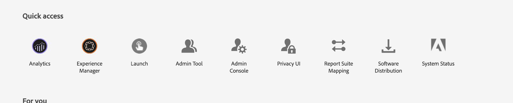

# 設定和設定We.Gov和We.Finance參考網站{#set-up-and-configure-we-gov-reference-site}

## 演示軟體包詳細資訊{#demo-package-details}

### 安裝先決條件{#installation-prerequisites}

此套件是為&#x200B;**AEM Forms 6.4 OSGI Author**&#x200B;建立，已經過測試，因此支援下列平台版本：

| AEM版本 | AEM FORMS.套件版本 | 狀態 |
|---|---|---|
| 6.4 | 五點〇點八六 | **支援** |
| 6.5 | 6.0.80 | **支援** |
| 6.5.3 | 6.0.122 | **支援** |

此套件包含支援下列平台版本的雲端設定：

| 雲端供應商 | 服務版本 | 狀態 |
|---|---|---|
| Adobe Sign | v5 API | **支援** |
| Microsoft Dynamics 365 | 1710(9.1.0.3020) | **支援** |
| Adobe Analytics | v1.4 Rest API | **支援** |
**軟體包安裝注意事項：**

* 此套件預計會安裝在乾淨的伺服器上，不需要其他示範套件或舊版示範套件版本
* 此套件預計會安裝在OSGI伺服器上，在「作者」模式中執行

### 此軟體包包含的{#what-does-this-package-include}

[AEM Forms We.Gov demo套件](https://experience.adobe.com/#/downloads/content/software-distribution/en/aem.html?package=/content/software-distribution/en/details.html/content/dam/aem/public/adobe/packages/cq650/featurepack/we-gov-forms.pkg.all-2.0.2.zip)(**we-gov-forms.pkg.all-&lt;version>.zip**)是包含數個其他子套件和服務的套件。 該軟體包包含以下模組：

* **we-gov-forms.pkg.all-&lt;version>zip** -完整的 *示範套件*

   * **we-gov-forms.ui.apps-&lt;version>.zip** *-包含所有元件、用戶端程式庫、範例使用者、工作流程模型等。*

      * **we-gov-forms.core-&lt;version>.jar** -包 *含所有OSGI服務、自訂工作流程步驟實作等。*

      * **we-gov-forms.derby&lt;version>.jar** - *包含所有OSGI服務、資料庫架構等。*

      * **core.wcm.components.all-2.0.4.zip** -范 *例WCM元件的集合*

      * **grid-aem.ui.apps-1.0-SNAPSHOT.zip** -  *AEM Sites Grid版面套件的「網站」頁面欄控制*
   * **we-gov-forms.ui.content-&lt;version>.zip** - *包含所有內容、頁面、影像、表單、互動式通訊資產等。*

   * **we-gov-forms.ui.analytics-&lt;version>.zip** -包 *含所有要儲存在儲存庫中的We.Gov Forms Analytics資料。*

   * **we-gov-forms.config.public-&lt;version>.zip**   *-包含所有預設組態節點，包括預留位置雲端組態，以協助避免表單資料模型和服務系結問題。*

此套件包含的資產包括：

* 含可編輯範本的AEM網站頁面
* AEM Forms Adaptive Forms
* AEM Forms互動式通訊（列印和網路頻道）
* AEM Forms XDP記錄檔案
* AEM Forms MS Dynamics Forms資料模型
* Adobe Sign整合
* AEM Workflow Model
* AEM Assets範例影像
* 示例（記憶體中）Apache Derby資料庫
* Apache Derby資料源（用於表單資料模型）

## 演示軟體包安裝{#demo-package-installation}

本節包含有關安裝演示軟體包的資訊。

### 從軟體分發{#from-software-distribution}

1. 開啟[軟體分發](https://experience.adobe.com/downloads)。 您必須有Adobe ID才能登入「軟體散發」。
1. 點選頁首功能表中的「Adobe Experience Manager **[!UICONTROL 」。]**
1. 在&#x200B;**[!UICONTROL Filters]**&#x200B;區段中：
   1. 從&#x200B;**[!UICONTROL Solution]**&#x200B;下拉式清單中選擇&#x200B;**[!UICONTROL Forms]**。
   2. 選擇包的版本和類型。 您也可以使用&#x200B;**[!UICONTROL 搜尋下載]**&#x200B;選項來篩選結果。
1. 點選&#x200B;**we-gov-forms.pkg.all-&lt;version>.zip**&#x200B;套件名稱，選取「**[!UICONTROL 接受EULA條款]**」，然後點選「**[!UICONTROL 下載]**」。
1. 開啟[包管理器](https://docs.adobe.com/content/help/en/experience-manager-65/administering/contentmanagement/package-manager.html) ，然後按一下&#x200B;**[!UICONTROL 上載包]**&#x200B;來上載包。
1. 選擇軟體包並按一下&#x200B;**[!UICONTROL Install]**。

   

1. 允許完成安裝程式。
1. 導覽至&#x200B;*https://&lt;aemserver>:&lt;port>/content/we-gov/home.html?wcmmode=disabled*，以確保安裝成功。

### 從本地ZIP檔案{#from-a-local-zip-file}

1. 下載並找到&#x200B;**we-gov-forms.pkg.all-&lt;version>.zip**&#x200B;檔案。
1. 導覽至&#x200B;*https://&lt;aemserver>:&lt;port>/crx/packmgr/index.jsp*。
1. 選擇「上傳套件」選項。

   

1. 使用檔案瀏覽器導覽並選取下載的ZIP檔案。
1. 按一下「開啟」以上傳。
1. 上載後，選擇「安裝」選項以安裝軟體包。

   

1. 允許完成安裝程式。
1. 導覽至&#x200B;*https://&lt;aemserver>:&lt;port>/content/we-gov/home.html?wcmmode=disabled*，以確保安裝成功。

### 安裝新軟體包版本{#installing-new-package-versions}

要安裝新軟體包版本，請遵循4.1和4.2中定義的步驟。在已安裝其他較舊軟體包的情況下安裝較新軟體包版本是可行的，但建議先卸載較舊軟體包版本。 若要這麼做，請遵循下列步驟。

1. 導覽至&#x200B;*https://&lt;aemserver>:&lt;port>/crx/packmgr/index.jsp*
1. 找到舊版&#x200B;**we-gov-forms.pkg.all-&lt;version>.zip**&#x200B;檔案。
1. 選擇「更多」選項。
1. 從下拉式清單中，選取「解除安裝」選項。

   

1. 確認後，請再次選擇「解除安裝」，並允許完成解除安裝程式。

## 演示軟體包配置{#demo-package-configuration}

本節包含演示軟體包部署後配置的詳細資訊和說明，然後再演示。

### 虛構用戶配置{#fictional-user-configuration}

1. 導覽至&#x200B;*https://&lt;aemserver>:&lt;port>/libs/granite/security/content/groupadmin.html*
1. 以管理員身份登錄，以執行以下任務。
1. 向下捲動至頁面結尾，以載入所有使用者群組。
1. 搜尋「**workflow**」。
1. 選擇「**workflow-users**」組，然後按一下「屬性」。
1. 導覽至「成員」標籤。
1. 在「選取使用者或群組」欄位中輸入&#x200B;**wegov**。
1. 從下拉式清單「**We.Gov Forms Users**」中選取。

   

1. 按一下功能表列中的「儲存並關閉」。
1. 重複步驟2-7，方法是搜尋「**analytics**」，選取「**Analytics管理員**」群組，並新增「**We.Gov Forms使用者**」群組作為成員。
1. 通過搜索「**forms users**」、選擇「**forms-power-users**」組，並添加「**We.Gov Forms Users**」組作為成員，重複步驟2-7。
1. 重複步驟2-7，方法是搜尋「**forms-users**」，選取「**forms-users**」群組，並新增「**We.Gov Users**」群組作為成員。

### 電子郵件伺服器配置{#email-server-configuration}

1. 查看設定文檔[配置電子郵件通知](/help/sites-administering/notification.md)
1. 以管理員身份登錄以執行此任務。
1. 導覽至&#x200B;*https://&lt;aemserver>:&lt;port>/system/console/configMgr*
1. 找到並按一下&#x200B;**Day CQ Mail Service**&#x200B;服務進行配置。

   

1. 配置服務以連接到您選擇的SMTP伺服器：

   1. **SMTP伺服器主機名**:例如(smtp.gmail.com)
   1. **伺服器埠**:例如(465)使用SSL的gmail
   1. **SMTP用戶：** demo@  &lt;companyname> .com
   1. **「寄件者」地址**:aemformsdemo@adobe.com

   

1. 按一下「保存」保存配置。

### （可選）AEM SSL設定{#aemsslconfig}

本節包含在AEM例項上設定SSL以便能夠設定Adobe Sign Cloud設定的詳細資訊。

**引用:**

1. [SSL預設值](/help/sites-administering/ssl-by-default.md)

**附註:**

1. 導覽至https://&lt;aemserver>:&lt;port>/aem/inbox，您將可在此處完成上述參考檔案連結中說明的程式。
1. `we-gov-forms.pkg.all-[version].zip`套件包含範例SSL金鑰和憑證，可透過擷取屬於套件一部分的`we-gov-forms.pkg.all-[version].zip/ssl`資料夾來存取。

1. SSL憑證和金鑰詳細資訊：

   1. 發佈至&quot;CN=localhost&quot;
   1. 10年有效期
   1. 密碼值為&quot;password&quot;
1. 私密金鑰是&#x200B;*localhostprivate.der*。
1. 憑證是&#x200B;*localhost.crt*。
1. 按一下下一步。
1. HTTPS主機名應設定為&#x200B;*localhost*。
1. 埠應設定為系統已暴露的埠。

### （可選）Adobe Sign雲端設定{#adobe-sign-cloud-configuration}

本節包含Adobe Sign Cloud設定的詳細資訊和指示。

**引用:**

1. [將Adobe Sign與AEM Forms整合](adobe-sign-integration-adaptive-forms.md)

#### 雲端設定{#cloud-configuration}

1. 檢閱必要條件。 如需必要的SSL設定，請參閱[AEM SSL設定](../../forms/using/forms-install-configure-gov-reference-site.md#aemsslconfig)。
1. 導航到:

   *https://&lt;aemserver>:&lt;port>/libs/adobesign/cloudservices/adobesign.html/conf/we-gov*

   >[!NOTE]
   >
   >用來存取AEM伺服器的URL應符合Adobe Sign OAuth重新導向URI中設定的URL，以避免設定問題(例如&#x200B;*https://&lt;aemserver>:&lt;port>/mnt/overlay/adobesign/cloudservices/adobesign/properties.html*

1. 選取「We.gov Adobe Sign」組態。
1. 按一下「屬性」。
1. 導覽至「設定」標籤。
1. 輸入oAuth URL，例如：[https://secure.na1.echosign.com/public/oauth](https://secure.na1.echosign.com/public/oauth)
1. 從已設定的Adobe Sign例項提供已設定的用戶端ID和用戶端密碼。
1. 按一下「連線至Adobe Sign」。
1. 成功連線後，按一下「儲存並關閉」以完成整合。

### （可選）MS Dynamics雲配置{#ms-dynamics-cloud-configuration}

本節包含有關MS Dynamics Cloud配置的詳細資訊和說明。

**引用:**

1. [Microsoft Dynamics OData組態](https://docs.adobe.com/content/help/en/experience-manager-64/forms/form-data-model/ms-dynamics-odata-configuration.html)
1. [設定Microsoft Dynamics for AEM Forms](https://helpx.adobe.com/experience-manager/kt/forms/using/config-dynamics-for-aem-forms.html)

#### MS Dynamics OData雲服務{#ms-dynamics-odata-cloud-service}

1. 導航到:

   https://&lt;aemserver>:&lt;port>/libs/fd/fdm/gui/components/admin/fdmcloudservice/fdm.html/conf/we-gov

   1. 請確定您使用與MS Dynamics應用程式註冊中設定的相同重新導向URL來存取伺服器。

1. 選擇「Microsoft Dynamics OData Cloud服務」配置。
1. 按一下「屬性」。

   

1. 導覽至「驗證設定」標籤。
1. 輸入以下詳細資訊：

   1. **服務根：** 例如https://msdynamicsserver.api.crm3.dynamics.com/api/data/v9.1/
   1. **驗證類型：** OAuth 2.0
   1. **驗證設定** (請參 [閱MS Dynamics Cloud組態設](../../forms/using/forms-install-configure-gov-reference-site.md#dynamicsconfig) 定以收集此資訊):

      1. 用戶端ID —— 也稱為應用程式ID
      1. 用戶端密碼
      1. OAuth URL —— 例如[https://login.windows.net/common/oauth2/authorize](https://login.windows.net/common/oauth2/authorize)
      1. 重新整理Token URL —— 例如[https://login.windows.net/common/oauth2/token](https://login.windows.net/common/oauth2/token)
      1. 存取Token URL —— 例如[https://login.windows.net/common/oauth2/token](https://login.windows.net/common/oauth2/token)
      1. 授權範圍- **openid**
      1. 驗證頭- **授權載體**
      1. 資源——例如[https://msdynamicsserver.api.crm3.dynamics.com](https://msdynamicsserver.api.crm3.dynamics.com)
   1. 按一下「連線至OAuth」。

1. 成功驗證後，按一下「儲存並關閉」以完成整合。

#### MS Dynamics雲端組態設定{#dynamicsconfig}

本節中詳細說明的步驟可協助您從MS Dynamics Cloud例項中找出用戶端ID、用戶端密碼和詳細資訊。

1. 導覽至[https://portal.azure.com/](https://portal.azure.com/)並登入。
1. 從左側功能表中選擇「所有服務」。
1. 搜尋或導覽至「應用程式註冊」。
1. 建立或選擇現有應用程式註冊。
1. 複製&#x200B;**應用程式ID**，以用作AEM雲端設定中的OAuth **用戶端ID**
1. 按一下「設定」或「資訊清單」以設定&#x200B;**回覆URL。**

   1. 此URL必須符合設定OData服務時用來存取AEM伺服器的URL。

1. 在「設定」檢視中，按一下「金鑰」以檢視建立新金鑰（這會用作AEM中的「用戶端密碼」）。

   1. 請務必保留金鑰的副本，因為您以後無法在Azure或AEM中檢視它。

1. 要找到資源URL/服務根URL，請導航到MS Dynamics實例儀表板。
1. 在頂端導覽列中，按一下「銷售」或您自己的例項類型，然後按一下「選取設定」。
1. 按一下右下角的「自訂」和「開發人員資源」。
1. 您會在那裡找到服務根URL:e.g

   *[https://msdynamicsserver.api.crm3.dynamics.com/api/data/v9.1/](https://msdynamicsserver.api.crm3.dynamics.com/api/data/v9.1/)*

1. 有關重新整理和存取Token URL的詳細資訊，請參閱：

   *[https://docs.microsoft.com/en-us/rest/api/datacatalog/authenticate-a-client-app](https://docs.microsoft.com/en-us/rest/api/datacatalog/authenticate-a-client-app)*

#### 測試表單資料模型（動態）{#testing-the-form-data-model}

雲端設定完成後，您可能會想要測試表單資料模型。

1. 導航到

   *https://&lt;aemserver>:&lt;port>/aem/forms.html/content/dam/formsanddocuments-fdm/we-gov*

1. 選擇「We.gov Microsoft Dynamics CRM FDM」，然後選擇「屬性」。

   

1. 導覽至「更新來源」標籤。
1. 確保「上下文感知配置」設定為「/conf/we-gov」，並確保配置的資料源為「ms-dynamics-odata-cloud-service」。

   

1. 編輯表單資料模型。

1. 測試服務，以確保它們成功連接到已配置的資料源。

   >[!NOTE]
   在測試服務後，按一下&#x200B;**Cancel**&#x200B;以確保非自願更改不會傳播到表單資料模型。

   >[!NOTE]
   已報告資料來源必須重新啟動AEM伺服器才能成功系結至FDM。

#### 測試表單資料模型(Derby){#test-fdm-derby}

雲端設定完成後，您可能會想要測試表單資料模型。

1. 導覽至&#x200B;*https://&lt;aemserver>:&lt;port>/aem/forms.html/content/dam/formsanddocuments-fdm/we-gov*

1. 選擇&#x200B;**We.gov Enrollment FDM**&#x200B;並選擇&#x200B;**屬性**。

   

1. 導覽至&#x200B;**更新來源**&#x200B;標籤。

1. 確保&#x200B;**上下文感知配置**&#x200B;設定為`/conf/we-gov` ，且配置的資料源為&#x200B;**We.Gov Derby DS**。

   

1. 按一下&#x200B;**保存並關閉**。

1. [測試服](work-with-form-data-model.md#test-data-model-objects-and-services) 務，以確保它們成功連接到已配置的資料源

   * 要測試連接，請選擇&#x200B;**HOMEMORGOAGEACCOUNT**&#x200B;並為其提供get服務。 測試服務，系統管理員就可以看到擷取的資料。

### Adobe Analytics設定（選用）{#adobe-analytics-configuration}

本節包含Adobe Analytics Cloud設定的詳細資訊和指示。

**引用:**

* [整合 Adobe Analytics](../../sites-administering/adobeanalytics.md)

* [連線至Adobe Analytics和建立架構](../../sites-administering/adobeanalytics-connect.md)

* [檢視頁面分析資料](../../sites-authoring/pa-using.md)

* [設定分析和報表](configure-analytics-forms-documents.md)

* [檢視並瞭解AEM Forms分析報表](view-understand-aem-forms-analytics-reports.md)

### Adobe Analytics雲端服務設定{#adobe-analytics-cloud-service-configuration}

此套件已預先設定為連線至Adobe Analytics。 提供下列步驟，以允許更新此配置。

1. 導覽至&#x200B;*https://&lt;aemserver>:&lt;port>/libs/cq/core/content/tools/cloudservices.html*
1. 找到Adobe Analytics區段，並選取「顯示設定」連結。
1. 選取「We.Gov Adobe Analytics（Analytics設定）」設定。

   

1. 按一下「編輯」按鈕以更新Adobe Analytics設定（您必須提供共用密碼）。 按一下「連線至Analytics」以連線，然後按一下「確定」以完成。

   

1. 如果您想要更新架構設定，請在同一頁按一下「We.Gov Adobe Analytics Framework(Analytics Framework)」（請參閱[啟用AEM編寫](../../forms/using/forms-install-configure-gov-reference-site.md#enableauthoring)以啟用編寫）。

#### Adobe Analytics定位使用者認證{#analytics-locating-user-credentials}

若要找到Adobe Analytics帳戶的使用者認證，帳戶管理員必須執行下列工作。

1. 導覽至Adobe Experience Cloud入口網站。
   * 使用管理員認證登入
1. 在主控制面板中選取Adobe Analytics圖示。
   
1. 導覽至「管理員」索引標籤，然後選取「使用者管理（舊版）」項目
   
1. 選擇&#x200B;**用戶**頁籤。
   
1. 從使用者清單中選擇所要的使用者。
1. 捲動至頁面底部，使用者驗證資訊就會出現在頁面底部。
   
1. 使用者名稱和共用的機密資訊會出現在權限方塊的右側。
1. 請注意，使用者名稱中會有冒號，冒號左側的所有資訊都是使用者名稱，而冒號右側的所有資訊都是公司名稱。
   * 以下是其範例：*username:公司名稱*

#### 在Adobe Analytics中設定使用者驗證{#setup-user-authentication}

管理員可以執行下列動作，為使用者提供AEM分析權限。

1. 導覽至Adobe Admin Console。

1. 按一下「管理控制台」所公開的Analytics例項。

   * 這位於管理頁面的首頁面。

1. 選取「Analytics完整管理員存取權」。

1. 新增使用者至描述檔。

   

1. 將使用者ID對應至描述檔後，按一下「權限」標籤。

1. 請確定所有權限都已映射至描述檔。

   

1. 請注意，一旦對權限進行對應，使用者登入的功能可能需要數小時。

### Adobe Analytics報表{#adobe-analytics-reporting}

#### 檢視報告{#view-adobe-analytics-sites-reporting}的Adobe Analytics網站

>[!NOTE]
AEM Forms Analytics資料在離線時可用，如果已安裝`we-gov-forms.ui.analytics-<version>.zip`套件，則無需Adobe Analytics雲端設定，但AEM Sites資料需要作用中的雲端設定。

1. 導覽至&#x200B;*https://&lt;aemserver>:&lt;port>/sites.html/content*
1. 選取「AEM Forms We.Gov網站」以檢視網站頁面。
1. 選取其中一個網站頁面（例如首頁），然後選擇「Analytics &amp; Recommendations」。

   

1. 在此頁面上，您會看到從Adobe Analytics擷取的與AEM Sites頁面相關的資訊(注意：設計時，會定期從Adobe Analytics重新整理此資訊，而不會即時顯示)。

   

1. 回到頁面檢視頁面（在步驟3.中存取），您也可以變更顯示設定以檢視「清單檢視」中的項目，來檢視頁面檢視資訊。
1. 找到「View」（檢視）下拉式功能表，並選取「List View」（清單檢視）。

   

1. 從相同功能表中，選取「檢視設定」，並從「Analytics」區段中選取您要顯示的欄。

   

1. 按一下「更新」，讓新欄可供使用。

   

#### 檢視報告{#view-adobe-analytics-forms-reporting}的Adobe Analytics表格

>[!NOTE]
AEM Forms Analytics資料在離線時可用，如果已安裝`we-gov-forms.ui.analytics-<version>.zip`套件，則無需Adobe Analytics雲端設定，但AEM Sites資料需要作用中的雲端設定。

1. 導航到

   *https://&lt;aemserver>:&lt;port>/aem/forms.html/content/dam/formsanddocuments/adobe-gov-forms*

1. 選擇「健康福利的註冊申請」調適性表單，並選取「Analytics報表」選項。

   

1. 等待頁面載入，並檢視Analytics報表資料。

   

### Adobe Automated Forms Configuration Enablement {#automated-forms-enablement}

若要安裝並設定AEM Forms與Adobe Forms，轉換工具使用者必須具備下列功能。

1. 存取Adobe IO。

1. 建立與Adobe Forms轉換服務整合的權限。

1. 以「作者」身分執行的Adobe AEM 6.5最新Service Pack。

閱讀進一步指示前，請先閱讀以下內容：

* [設定自動表單轉換服務](https://docs.adobe.com/content/help/en/aem-forms-automated-conversion-service/using/configure-service.html)

#### 建立IMS配置第1部分{#creating-ims-config}

為了設定服務以正確與表單轉換工具通訊，使用者必須設定身分管理系統(IMS)服務，才能向Adobe I/O註冊。

1. 導覽至https://&lt;aemserver>:&lt;port> >按一下Adobe Experience
左上角的管理員>工具>安全性> Adobe IMS設定。

1. 按一下建立。

1. 執行下圖中的動作。

   

1. 請確定下載憑證。

1. 請勿繼續進行其餘的設定——檢閱「在Adobe I/O中建立整合」一節的

>[!NOTE]
本節中建立的憑證將用於在Adobe I/O中建立整合服務。使用者在整合服務中建立後，使用者就可以使用Adobe I/O中的資訊來完成設定。

#### 在Adobe I/O {#create-integration-adobeio}中建立整合

如果您未聯絡系統管理員以建立Adobe網域內的整合，請確定您有能力。

1. 導覽至[Adobe I/O Console](https://console.adobe.io/)。

1. 按一下建立整合項目。

1. 選取「存取API」。

1. 請確定您位在正確的群組中（右上方下拉式清單）。

1. 在Experience Cloud區段中，選取「表單轉換工具」。

1. 按一下「繼續」。

1. 輸入整合的名稱和說明。

1. 使用第2.1節的公開金鑰，將其放入金鑰的整合中。

1. 為自動化表單轉換選取描述檔。

   

#### 建立IMS配置第2部分{#create-ims-config-part-next}

現在您已建立整合，讓我們完成IMS組態的安裝。

1. 按一下您在Adobe I/O中的整合，以公開連線詳細資訊。

1. 導覽至AEM中的IMS設定（「工具>安全性> IMS」）

1. 按一下「IMS設定」畫面上的「下一步」。

1. 輸入授權伺服器（螢幕擷取中顯示的值）。

1. 輸入API金鑰。

1. 輸入用戶端密碼（必須按一下Adobe I/O中的「公開」，才能公開）。

1. 按一下Adobe I/O中的JWT標籤，以取得JWT裝載並貼入IMS設定的裝載中。

   

1. 建立後，按一下「IMS設定」並選取「Health Check」（健康檢查），使用者應該會看到下列結果。

   

#### 設定雲端設定(We.Gov AFC Production){#configure-cloud-configuration}

IMS設定完成後，我們就可以繼續在AEM中檢視雲端設定。 如果此設定不存在，請使用下列步驟在AEM中建立雲端設定：

1. 開啟瀏覽器並導覽至系統URL https://&lt;domain_name>:&lt;system_port>

1. 按一下畫面左上角的Adobe Experience Manager >工具>雲端服務>自動化表單對話設定。

1. 選擇要將配置放入的配置資料夾。

1. 按一下建立。

1. 在下方的螢幕擷取中輸入資訊。

   

1. 提供設定標題和名稱。

1. 系統的服務URL設定為https://aemformsconversion.adobe.io/。

1. 範本URL */conf/we-gov/settings/wcm/templates/we-gov-flamingo-template*。

1. 主題URL:*/content/dam/formsanddocuments-themes/adobe-gov-forms-themes/we-gov-themes*

1. 按一下下一步。

1. 對於此配置，我們將兩個複選框值留空。

   * 若要進一步瞭解這些選項，請參閱[設定雲端服務](https://docs.adobe.com/content/help/en/aem-forms-automated-conversion-service/using/configure-service.html#configure-the-cloud-service)。

#### 配置雲配置（We.Finance AFC生產）{#configure-cloud-configuration-wefinance}

一旦IMS設定完成，我們就可以繼續在AEM中建立雲端設定。

1. 開啟瀏覽器並導覽至系統URL https://&lt;domain_name>:&lt;system_port>

1. 按一下畫面左上角的Adobe Experience Manager >工具>雲端服務>自動化表單對話設定。

1. 選擇要將配置放入的配置資料夾。

1. 按一下建立。

1. 在下方的螢幕擷取中輸入資訊。

   

1. 提供設定標題和名稱。

1. 系統的服務URL設定為https://aemformsconversion.adobe.io/

1. 範本URL:*/conf/we-finance/settings/wcm/templates/we-finance-adaptive-form*

1. 主題URL:*/content/dam/formsanddocuments-themes/adobe-finance-forms-themes/we-finance-themes/theme*

1. 按一下下一步。

1. 對於此配置，我們將兩個複選框值留空。

   * 若要進一步瞭解這些選項，請參閱[設定雲端服務](https://docs.adobe.com/content/help/en/aem-forms-automated-conversion-service/using/configure-service.html#configure-the-cloud-service)。

#### 測試表單轉換（We.Gov註冊申請）{#test-forms-conversion}

設定好設定後，使用者就可以上傳PDF檔案來測試它。

1. 導覽至AEM系統https://&lt;domain_name>:&lt;system_port>

1. 按一下「表單>表單與檔案> AEM Forms We.gov表單> AFC」。

1. 選取We.Gov註冊應用程式PDF。

1. 按一下右上角的&#x200B;**啟動自動轉換**&#x200B;按鈕。

1. 使用者應能看到下列選項。

   

1. 選取按鈕後，使用者將會看到下列選項

   * 確保用戶選擇&#x200B;*We.Gov AFC Production*&#x200B;配置

   

   

1. 在您設定了所有要使用的選項後，選取開始轉換。

1. 當轉換程式開始時，使用者應看到下列畫面：

   

1. 轉換完成後，使用者會看到下列畫面：

   

   按一下&#x200B;**Output**&#x200B;資料夾以查看生成的自適應表單。

#### 已知問題與注意事項{#known-issues-notes}

自動表單轉換服務包含某些[最佳實踐、已知複雜模式](https://docs.adobe.com/content/help/en/aem-forms-automated-conversion-service/using/styles-and-pattern-considerations-and-best-practices.html)和[已知問題](https://docs.adobe.com/content/help/en/aem-forms-automated-conversion-service/using/known-issues.html)。 在您開始使用AEM Forms Automated Forms Conversion服務之前，請先檢閱這些項目。

1. 如果要在轉換後將表單綁定到FDM，則生成具有生成適應性表單而不啟用資料綁定的表單。

1. 請確定範本資料夾已啟用jcr:read for everyone權限，否則服務使用者將無法從儲存庫讀取範本，而轉換將會失敗。

## 演示軟體包自定義{#demo-package-customizations}

本節包含自訂示範的指示。

### 自訂範本{#templates-customization}

可編輯的範本位於下列位置：

*https://&lt;aemserver>:&lt;port>/libs/wcm/core/content/sites/templates.html/conf/we-gov*

這些範本包括AEM網站、最適化表單和互動式通訊範本，這些範本是使用元件建立和組合的，可在以下網址找到：

*https://&lt;aemserver>:&lt;port>/crx/de/index.jsp#/apps/we-gov/components*

#### 樣式系統{#customizetemplates}

此站點還具有client-libraries，其中一個庫將導入引導4([https://getbootstrap.com/](https://getbootstrap.com/))。 此客戶端庫可在

*https://&lt;aemserver>:&lt;port>/crx/de/index.jsp#/apps/we-gov/clientlibs/clientlib-base/css/bootstrap*

此套件中包含的可編輯範本也預先設定了範本／頁面原則，這些原則使用Bootstrap 4 CSS類別進行分頁、樣式等。 並非所有類都已添加到模板策略中，但可以將引導4支援的任何類添加到策略中。 如需可用類別的清單，請參閱快速入門頁面：

[https://getbootstrap.com/docs/4.1/getting-started/introduction/](https://getbootstrap.com/docs/4.1/getting-started/introduction/)

此套件中包含的範本也支援樣式系統：

[樣式系統](../../sites-authoring/style-system.md)

#### 範本標誌{#template-logos}

Project DAM Assets也包含We.Gov標誌和影像。 這些資產可在以下網址取得：

*https://&lt;aemserver>:&lt;port>/assets.html/content/dam/we-gov*

在編輯頁面和表單範本時，您可以選擇編輯導覽和頁尾元件以更新品牌標誌。 這些元件提供可設定的品牌和標誌對話方塊，可用來更新標誌：

如需詳細資訊，請參閱編輯頁面內容：

[編輯頁面內容](../../sites-authoring/editing-content.md)

### 網站頁面自訂{#sites-pages-customization}

所有網站頁面皆可從以下網站取得：*https://&lt;aemserver>:&lt;port>/sites.html/content/we-gov*

這些網站頁面也運用AEM Grid套件來控制一些元件的版面配置。

#### 樣式系統{#style-system}

此套件中包含的頁面也支援樣式系統：

[樣式系統](../../sites-authoring/style-system.md)

有關支援的樣式的文檔，您也可以參閱[模板定制樣式系統](../../forms/using/forms-install-configure-gov-reference-site.md#customizetemplates)。

### 最適化表單自訂{#adaptive-forms-customization}

所有可調式表單皆可從以下網站取得：

*https://&lt;aemserver>:&lt;port>/aem/forms.html/content/dam/formsanddocuments/adobe-gov-forms*

您可自訂這些表格，以符合特定使用案例。 請注意，不應修改某些欄位和提交邏輯，以確保表單繼續正常運作。 這包括：

**健康福利註冊申請：**

* contact_id —— 用於在提交期間接收MS Dynamics聯繫人ID的隱藏欄位
* 提交——需要自訂提交按鈕邏輯以支援回呼。 自訂是有記載的，但是在透過表單資料模型對MS Dynamics執行POST和GET作業時，需要使用大型指令碼來提交表單。
* 根面板——初始化事件可用來以最不干擾的方式將MS Dynamics按鈕新增至AEM Inbox，因為所有AEM Inbox Granite UI元件都不可修改。

#### 最適化表單樣式{#adaptive-form-styling}

您也可以使用樣式編輯器或主題編輯器來設定最適化表單的樣式：

* [最適化表單元件的內嵌樣式](inline-style-adaptive-forms.md)
* [建立和使用主題](themes.md)

### 工作流程自訂{#workflow-customization}

「註冊最適化表單」會提交至OSGI工作流程以進行處理。 此工作流程可在&#x200B;*https://&lt;aemserver>:&lt;port>/conf/we-gov/settings/models/we-gov-process.html*&#x200B;找到。

由於某些限制，此工作流程包含數個指令碼和自訂OSGI工作流程程式步驟。 這些工作流程步驟已建立為一般步驟，而且尚未使用設定對話框建立。 目前，工作流步驟的配置依賴於進程參數。

所有工作流程步驟Java程式碼都包含在&#x200B;**we-gov-forms.core-&lt;version>.jar**&#x200B;套件中。

## 演示注意事項和已知問題{#demo-considerations-and-known-issues}

本節包含有關演示功能和設計決策的資訊，在演示過程中可能需要特殊考慮。

### 演示注意事項{#demo-considerations}

* 根據AGRS-159，請確定「註冊最適化表單」中使用之連絡人的名稱（第一、中間和最後）是唯一的。
* 註冊適應性表單會將Adobe Sign電子郵件傳送至表單電子郵件欄位中指定的電子郵件。 該電子郵件地址不能與用於設定Adobe Sign雲端設定的電子郵件地址相同。

### 已知問題 {#known-issues}

* (AGRS-120)網站導覽元件目前不支援深度超過2層的巢狀子頁面。
* (AGRS-159)目前的MS Dynamics FDM首先需要執行2個操作，將註冊適應性表單資料發佈到Dynamics，然後提取用戶記錄以檢索聯繫人ID。 在目前狀態下，如果Dynamics中有兩個以上同名的使用者，則擷取連絡人ID會失敗，這將不允許註冊最適化表單提交。

## 配置輔助功能測試{#configure-accessibility-testing}

### 在{#enable-chrome-add-on}上啟用協助工具測試Chrome Add

若要先執行協助工具測試，您必須先安裝Chrome外掛程式，請在[這裡](https://chrome.google.com/webstore/detail/accessibility-developer-t/fpkknkljclfencbdbgkenhalefipecmb?hl=en)找到。

安裝後，請載入您要在Chrome瀏覽器中測試的頁面(注意：開啟多個標籤可能會影響您的分數，但最好是只開啟一個標籤)。 載入頁面後
**按一下右鍵頁面上的**&#x200B;並選擇&#x200B;**Audits**&#x200B;頁籤。 開發人員可以選擇由協助工具外掛程式執行的稽核類型。 在選取所有所需選項後，使用者就可以選取「產生報表」按鈕。 這將產生PDF檔案，其中顯示整體協助工具評等，以及可用來提高整體協助工具評等的內容。

報表一經執行，使用者就會看到下列內容：

使用者面前顯示的數字是他們取得的整體協助工具分級。 此外，還說明如何在分數之後計算此值。

如果使用者想要匯出此功能，可以按一下畫面右側的三個按鈕，並從外掛程式提供的其他選項中選取。

### 超海洋主題{#ultramarine-theme}

Adobe維護的公開Ultramarine主題內建於
`we-gov-forms.pkg.all-<version>.zip`可安裝的ZIP檔案。 使用CRX安裝此軟體包後。

Package Manager，使用者可導覽至&#x200B;**Forms** > **Themes** > **Reference Themes** > **Ultramarine-Accessible**，以存取AEM Forms中的Ultramarine主題。

## 設定選項 {#configuration-options}

使用者可以設定各種工作流程服務選項，其中包括：

1. Microsoft Dynamics Entry
1. Adobe Sign
1. AEM自訂通訊管理
1. Adobe Analytics

為了在「工作流」中將其配置為啟用，用戶需要執行以下任務。

1. 導覽至https://&#39;[server]:[port]&#39;/system/console/configMgr。

1. 找到&#x200B;*WeGov配置*。

1. 開啟服務定義，並啟用選定服務以在工作流中調用。

   >[!NOTE]
   僅僅因為用戶在「配置管理器」(Configuration Manager)頁中啟用了服務，用戶仍需設定服務配置以便與請求的外部服務通信。

   

1. 完成後，按一下「保存」按鈕以保存設定。

## 後續步驟{#next-steps}

現在，大家都準備去探索We.Gov參考網站。 如需We.Gov參考網站工作流程和步驟的詳細資訊，請參閱[We.Gov參考網站逐步說明](../../forms/using/forms-gov-reference-site-user-demo.md)。
