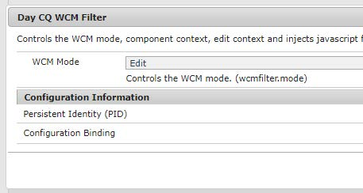

# 設定和設定We.Gov參考網站{#set-up-and-configure-we-gov-reference-site}

## 示範套件詳細資訊 {#demo-package-details}

### 安裝先決條件 {#installation-prerequisites}

此套件是為 **AEM Forms 6.4 OSGI Author**（已測試）建立，因此支援下列平台版本：

| AEM版本 | AEM FORMS.套件版本 | 狀態 |
|---|---|---|
| 6.4 | 5.0.86 | **支援** |
| 6.5 | 6.0.80 | **支援** |

此套件包含支援下列平台版本的雲端設定：

| 雲端供應商 | 服務版本 | 狀態 |
|---|---|---|
| Adobe Sign | v5 API | **支援** |
| Microsoft Dynamics 365 | 1710 (9.1.0.3020) | **支援** |

**軟體包安裝注意事項：**

* 此套件預計會安裝在乾淨的伺服器上，不需要其他示範套件或舊版示範套件版本
* 此套件預計會安裝在OSGI伺服器上，在「作者」模式中執行

### 此包包含什麼 {#what-does-this-package-include}

AEM Forms We.Gov示範套件(**we-gov-forms.pkg.all-&lt;version>.zip **)是包含數個其他子套件和服務的套件。 該軟體包包含以下模組：

* **we-gov-forms.pkg.all-&lt;version>.zip** -*完整示範套件*

   * **we-gov-forms.ui.apps-&lt;version>.zip***-包含所有元件、用戶端程式庫、範例使用者、工作流程模型等。*

      * **we-gov-forms.core-&lt;version>.jar*** —— 包含所有OSGI服務、自訂工作流程步驟實作等。*

      * **core.wcm.components.all-2.0.4.zip** —— 范 *例WCM元件的集合*

      * **grid-aem.ui.apps-1.0-SNAPSHOT.zip** - *AEM Sites grid版面套件的「網站」頁面欄控制*
   * **we-gov-forms.ui.content-&lt;version>.zip*** —— 包含所有內容、頁面、影像、*表單、互動式通訊資產等。

   * **we-gov-forms.config.public-&lt;version>.zip***—— 包含所有預設組態節點，包括預留位置雲端組態，以協助避免表單資料模型和服務系結問題。*

此套件包含的資產包括：

* 含可編輯範本的AEM網站頁面
* AEM Forms Adaptive Forms
* AEM Forms互動式通訊（列印和網路頻道）
* AEM Forms XDP記錄檔案
* AEM Forms MS Dynamics Forms資料模型
* Adobe Sign整合
* AEM Workflow Model
* AEM Assets範例影像

## 設定選項 {#configuration-options}

本節包含有關配置選項的詳細資訊。 目前，此區段是故意空的。

## 示範套件安裝 {#demo-package-installation}

本節包含有關安裝演示軟體包的資訊。

### 從包共用 {#from-package-share}

1. 導覽至 *https://&lt;aemserver>:&lt;port>/crx/packageshare/*

   或在AEM中，按一下「部署」並導覽至「封裝共用圖示」。

   

1. 使用您的Adobe ID登入。
1. 搜尋並找 **到we-gov-forms.pkg.all-&lt;version>套件** 。
1. 選取「下載」選項並接受條款與條件。
1. 下載後，選擇「已下載」選項，在「套件管理器」中找到套件。
1. 選擇「安裝」選項以安裝軟體包。

   

1. 允許完成安裝程式。
1. 導覽至 *https://&lt;aemserver>:&lt;port>/content/we-gov/home.html?wcmmode=disabled* ，以確保安裝成功。

### 從本機ZIP檔案 {#from-a-local-zip-file}

1. 下載並找 **到we-gov-forms.pkg.all-&lt;version>.zip檔** 。
1. 導覽至 *https://&lt;aemserver>:&lt;port>/crx/packmgr/index.jsp*。
1. 選擇「上傳套件」選項。

   

1. 使用檔案瀏覽器導覽並選取下載的ZIP檔案。
1. 按一下「開啟」以上傳。
1. 上載後，選擇「安裝」選項以安裝軟體包。

   

1. 允許完成安裝程式。
1. 導覽至 *https://&lt;aemserver>:&lt;port>/content/we-gov/home.html?wcmmode=disabled* ，以確保安裝成功。

### 安裝新的軟體包版本 {#installing-new-package-versions}

要安裝新軟體包版本，請遵循4.1和4.2中定義的步驟。在已安裝其他較舊軟體包的情況下安裝較新軟體包版本是可行的，但建議先卸載較舊軟體包版本。 若要這麼做，請遵循下列步驟。

1. 導覽至 *https://&lt;aemserver>:&lt;port>/crx/packmgr/index.jsp*
1. 找到 **較舊的we-gov-forms.pkg.all-&lt;version>.zip檔** 。
1. 選擇「更多」選項。
1. 從下拉式清單中，選取「解除安裝」選項。

   

1. 確認後，請再次選擇「解除安裝」，並允許完成解除安裝程式。

## 示範套件設定 {#demo-package-configuration}

本節包含演示軟體包部署後配置的詳細資訊和說明，然後再演示。

### 虛構用戶配置 {#fictional-user-configuration}

1. 導覽至 *https://&lt;aemserver>:&lt;port>/libs/granite/security/content/groupadmin.html*
1. 搜尋「工&#x200B;**作流程**」。
1. 選取「**workflow-users**」群組，然後按一下「屬性」。
1. 導覽至「成員」標籤。
1. 在「選 **取使用者** 或群組」欄位中輸入wegov。
1. 從下拉式清單「**We.Gov Form Users**」中選取。

   

1. 按一下功能表列中的「儲存並關閉」。
1. 重複步驟2-7：搜尋「**analytics**」、選取「**Analytics Administrators**」群組，並新增「**We.Gov Form Users**」群組為成員。
1. 重複步驟2-7：搜尋「**forms users**」、選取「**forms-power-users**」群組，並新增「**We.Gov Form Users**」群組為成員。
1. 重複步驟2-7：搜尋「**forms users**」、選取「**forms-users**」群組，並新增「** We.Gov Users**」群組為成員。

### 電子郵件伺服器組態 {#email-server-configuration}

1. 檢閱設定檔案 [設定電子郵件通知](/help/sites-administering/notification.md)

1. 導覽至 *https://&lt;aemserver>:&lt;port>/system/console/configMgr*
1. 找到並按一下要配置的**Day CQ郵件服務**服務。

   

1. 配置服務以連接到您選擇的SMTP伺服器：

   1. **SMTP伺服器主機名**:例如(smtp.gmail.com)
   1. **伺服器埠**:例如(465)使用SSL的gmail
   1. **** SMTP用戶：demo@ &lt;companyname>.com
   1. **「寄件者」地址**:aemformsdemo@adobe.com
   

1. 按一下「保存」保存配置。

### AEM SSL設定 {#aemsslconfig}

本節包含在AEM例項上設定SSL以便能夠設定Adobe Sign cloud設定的詳細資訊。

**引用:**

1. [SSL預設值](/help/sites-administering/ssl-by-default.md)

**附註:**

1. 導覽至https://&lt;aemserver>:&lt;port>/aem/inbox，您將可在此處完成上述參考檔案連結中說明的程式。
1. **we-gov-forms.pkg.all-&lt;version>.zip** 套件包含範例SSL金鑰和憑證，可透過解壓縮屬於套件一部分的 **we-gov-forms.pkg.all-&lt;version>.zip/ssl** 資料夾來存取。

1. SSL憑證和金鑰詳細資訊：

   1. 發佈至&quot;CN=localhost&quot;
   1. 10年有效期
   1. 密碼值為&quot;password&quot;

### Adobe Sign cloud configuration {#adobe-sign-cloud-configuration}

本節包含Adobe Sign cloud設定的詳細資訊和指示。

**引用:**

1. [將Adobe Sign與AEM Forms整合](adobe-sign-integration-adaptive-forms.md)

#### Cloud configuration {#cloud-configuration}

1. **檢閱必要條件。 請參[閱AEM SSL設定](../../forms/using/forms-install-configure-gov-reference-site.md#aemsslconfig)，以取得必要的SSL設定。**
1. 導航到:

   *https://&lt;aemserver>:&lt;port>/libs/adobesign/cloudservices/adobesign.html/conf/we-gov*

   >[!NOTE]
   >
   >用來存取AEM伺服器的URL應符合Adobe Sign OAuth重新導向URI中設定的URL，以避免設定問題(例如 *https://&lt;aemserver>:&lt;port>/mnt/overlay/adobesign/cloudservices/adobesign/properties.html*)

1. 選取「We.gov Adobe Sign」組態。
1. 按一下「屬性」。
1. 導覽至「設定」標籤。
1. 輸入oAuth URL，例如： [https://secure.na1.echosign.com/public/oauth](https://secure.na1.echosign.com/public/oauth)
1. 從已設定的Adobe sign例項提供已設定的用戶端ID和用戶端密碼。
1. 按一下「連線至Adobe Sign」。
1. 成功連線後，按一下「儲存並關閉」以完成整合。

### MS Dynamics雲端組態 {#ms-dynamics-cloud-configuration}

本節包含有關MS Dynamics cloud配置的詳細資訊和說明。

**引用:**

1. [Microsoft Dynamics OData組態](https://docs.adobe.com/content/help/en/experience-manager-64/forms/form-data-model/ms-dynamics-odata-configuration.html)
1. [設定Microsoft Dynamics for AEM Forms](https://helpx.adobe.com/experience-manager/kt/forms/using/config-dynamics-for-aem-forms.html)

#### MS Dynamics OData雲端服務 {#ms-dynamics-odata-cloud-service}

1. 導航到:

   https://&lt;aemserver>:&lt;port>/libs/fd/fdm/gui/components/admin/fdmcloudservice/fdm.html/conf/we-gov

   1. 請確定您使用與MS Dynamics應用程式註冊中設定的相同重新導向URL來存取伺服器。

1. 選擇「Microsoft Dynamics OData Cloud服務」配置。
1. 按一下「屬性」。

   

1. 導覽至「驗證設定」標籤。
1. 輸入以下詳細資訊：

   1. **** 服務根：例如https://msdynamicsserver.api.crm3.dynamics.com/api/data/v9.1/
   1. **** 驗證類型：OAuth 2.0
   1. **驗證設定** (請參 [閱MS Dynamics cloud組態設定](../../forms/using/forms-install-configure-gov-reference-site.md#dynamicsconfig) ，以收集此資訊):

      1. 用戶端ID —— 也稱為應用程式ID
      1. 用戶端密碼
      1. OAuth URL —— 例如 [https://login.windows.net/common/oauth2/authorize](https://login.windows.net/common/oauth2/authorize)
      1. 重新整理Token URL —— 例如 [https://login.windows.net/common/oauth2/token](https://login.windows.net/common/oauth2/token)
      1. 存取Token URL —— 例如 [https://login.windows.net/common/oauth2/token](https://login.windows.net/common/oauth2/token)
      1. 授權範圍- **openid**
      1. 驗證頭——授 **權載體**
      1. 資源——例如 [https://msdynamicsserver.api.crm3.dynamics.com](https://msdynamicsserver.api.crm3.dynamics.com)
   1. 按一下「連線至OAuth」。

1. 成功驗證後，按一下「儲存並關閉」以完成整合。

#### MS Dynamics雲端組態設定 {#dynamicsconfig}

本節中詳細說明的步驟可協助您從MS Dynamics cloud例項中找出用戶端ID、用戶端密碼和詳細資訊。

1. 導覽至 [https://portal.azure.com/](https://portal.azure.com/) 並登入。
1. 從左側功能表中選擇「所有服務」。
1. 搜尋或導覽至「應用程式註冊」。
1. 建立或選擇現有應用程式註冊。
1. 複製 **應用程式ID** ，以便在AEM雲端設定中 **當做OAuth用戶端** Id使用
1. 按一下「設定」或「資訊清單」以設定回 **覆URL。**

   1. 此URL必須符合設定OData服務時用來存取AEM伺服器的URL。

1. 在「設定」檢視中，按一下「金鑰」以檢視建立新金鑰（這會用作AEM中的「用戶端密碼」）。

   1. 請務必保留金鑰副本，因為您以後無法在Azure或AEM中檢視它。

1. 要找到資源URL/服務根URL，請導航到MS Dynamics實例儀表板。
1. 在頂端導覽列中，按一下「銷售」或您自己的例項類型，然後按一下「選取設定」。
1. 按一下右下角的「自訂」和「開發人員資源」。
1. 您會在那裡找到服務根URL:e.g

* [https://msdynamicsserver.api.crm3.dynamics.com/api/data/v9.1/](https://msdynamicsserver.api.crm3.dynamics.com/api/data/v9.1/)*

1. 有關重新整理和存取Token URL的詳細資訊，請參閱：

* [https://docs.microsoft.com/en-us/rest/api/datacatalog/authenticate-a-client-app](https://docs.microsoft.com/en-us/rest/api/datacatalog/authenticate-a-client-app)*

#### 測試表單資料模型 {#testing-the-form-data-model}

雲端設定完成後，您可能會想要測試表單資料模型。

1. 導航到

   *https://&lt;aemserver>:&lt;port>/aem/forms.html/content/dam/formsanddocuments-fdm/we-gov*

1. 選擇「We.gov Microsoft Dynamics CRM FDM」，然後選擇「屬性」。

   

1. 導覽至「更新來源」標籤。
1. 確保「上下文感知配置」設定為「/conf/we-gov」，並確保配置的資料源為「ms-dynamics-odata-cloud-service」。

   

1. 編輯表單資料模型。

   >[!NOTE]
   請確定您按一下「 **取消** 」，而 **非「儲存並關閉** 」，以避免需要重新安裝的問題。

1. 測試服務，以確保它們成功連接到已配置的資料源。

   >[!NOTE]
   已報告資料來源必須重新啟動AEM伺服器才能成功系結至FDM。

### Adobe Analytics configuration {#adobe-analytics-configuration}

本節包含Adobe Analytics cloud設定的詳細資訊和指示。

**引用:**

1. [https://helpx.adobe.com/experience-manager/6-5/help/sites-administering/adobeanalytics.html](https://helpx.adobe.com/experience-manager/6-5/help/sites-administering/adobeanalytics.html)
1. [https://helpx.adobe.com/experience-manager/6-5/help/sites-administering/adobeanalytics-connect.html](https://helpx.adobe.com/experience-manager/6-5/help/sites-administering/adobeanalytics-connect.html)
1. [https://helpx.adobe.com/experience-manager/6-5/help/sites-authoring/pa-using.html](https://helpx.adobe.com/experience-manager/6-5/help/sites-authoring/pa-using.html)
1. [https://helpx.adobe.com/experience-manager/6-5/forms/using/configure-analytics-forms-documents.html](https://helpx.adobe.com/experience-manager/6-5/forms/using/configure-analytics-forms-documents.html)
1. [https://helpx.adobe.com/experience-manager/6-5/forms/using/view-understand-aem-forms-analytics-reports.html](https://helpx.adobe.com/experience-manager/6-5/forms/using/view-understand-aem-forms-analytics-reports.html)

### Adobe Analytics雲端服務設定 {#adobe-analytics-cloud-service-configuration}

此套件已預先設定為連線至Adobe Analytics。 提供下列步驟，以允許更新此配置。

1. 導覽至 *https://&lt;aemserver>:&lt;port>/libs/cq/core/content/tools/cloudservices.html*
1. 找到Adobe Analytics區段，並選取「顯示設定」連結。
1. 選取「We.Gov Adobe Analytics（Analytics設定）」設定。

   

1. 按一下「編輯」按鈕以更新Adobe Analytics設定（您必須提供共用密碼）。 按一下「連線至Analytics」以連線，然後按一下「確定」以完成。

   

1. 如果您想要更新架構設定，請在同一頁按一下「We.Gov Adobe Analytics Framework(Analytics Framework)」(請參閱「 [Enable AEM authoring](../../forms/using/forms-install-configure-gov-reference-site.md#enableauthoring) to enable Authoring」)。

### Adobe Analytics報表 {#adobe-analytics-reporting}

#### 檢視Adobe Analytics網站報告 {#view-adobe-analytics-sites-reporting}

1. 導覽至 *https://&lt;aemserver>:&lt;port>/sites.html/content*
1. 選取「AEM Forms We.Gov網站」以檢視網站頁面。
1. 選取其中一個網站頁面（例如首頁），然後選擇「Analytics &amp; Recommendations」。

   

1. 在此頁面上，您會看到從Adobe Analytics擷取的與AEM Sites頁面相關的資訊(注意：設計時，會定期從Adobe Analytics重新整理此資訊，而不會即時顯示)。

   

1. 回到頁面檢視頁面（在步驟3.中存取），您也可以變更顯示設定以檢視「清單檢視」中的項目，來檢視頁面檢視資訊。
1. 找到「View」（檢視）下拉式功能表，並選取「List View」（清單檢視）。

   

1. 從相同功能表中，選取「檢視設定」，並從「Analytics」區段中選取您要顯示的欄。

   

1. 按一下「更新」，讓新欄可供使用。

   

#### 檢視Adobe Analytics表格報表 {#view-adobe-analytics-forms-reporting}

1. 導航到

   *https://&lt;aemserver>:&lt;port>/aem/forms.html/content/dam/formsanddocuments/adobe-gov-forms*

1. 選擇「健康福利的註冊申請」調適性表單，並選取「Analytics報表」選項。

   

1. 等待頁面載入，並檢視Analytics報表資料。

   

#### 檢視Adobe Analytics報表 {#view-adobe-analytics-reporting}

或者，您也可以直接導覽至Adobe Analytics，以查看分析資料。

1. 導覽至 [https://my.omniture.com/login/](https://my.omniture.com/login/)
1. 使用您的認證登入：

   1. **** 公司：AEM Forms示範
   1. **** 使用者：&lt;available on request>
   1. **** 密碼：&lt;available on request>

1. 從報表套裝中選取「We.Gov參考網站」。

   

1. 選取其中一個可用報表以顯示該報表的分析資料。

   

## 示範套件自訂 {#demo-package-customizations}

本節包含自訂示範的指示。

### 啟用AEM編寫 {#enableauthoring}

此示範套件包含OSGI服務設定檔，可控制目標Author伺服器上WCM Filter服務的行為。 此配置使伺服器在禁用的作者模式下運行（相當於？wcmmode=disabled），以允許演示。 要更新此配置並啟用編寫，請執行以下步驟：

1. 導覽至 *https://&lt;aemserver>:&lt;port>/system/console/configMgr*
1. 找到並按一下要配置的**Day CQ WCM Filter **Service服務。

   

1. 將&quot;**WCM Mode**&quot;的值設為&quot;**Edit**&quot;。
1. 按一下「**儲存**」以套用設定。

### 範本自訂 {#templates-customization}

可編輯的範本位於下列位置：

*https://&lt;aemserver>:&lt;port>/libs/wcm/core/content/sites/templates.html/conf/we-gov*

這些範本包括AEM網站、最適化表單和互動式通訊範本，這些範本是使用元件建立和組合的，可在以下網址找到：

*https://&lt;aemserver>:&lt;port>/crx/de/index.jsp#/apps/we-gov/components*

#### 樣式系統 {#customizetemplates}

此網站也提供client-libraries，其中一個會匯入Bootstrap 4( [https://getbootstrap.com/](https://getbootstrap.com/) )。 此客戶端庫可在

*https://&lt;aemserver>:&lt;port>/crx/de/index.jsp#/apps/we-gov/clientlibs/clientlib-base/css/bootstrap*

此套件中包含的可編輯範本也預先設定了範本／頁面原則，這些原則使用Bootstrap 4 CSS類別進行分頁、樣式等。 並非所有類都已添加到模板策略中，但可以將引導4支援的任何類添加到策略中。 如需可用類別的清單，請參閱快速入門頁面：

[https://getbootstrap.com/docs/4.1/getting-started/introduction/](https://getbootstrap.com/docs/4.1/getting-started/introduction/)

此套件中包含的範本也支援樣式系統：

[https://helpx.adobe.com/ca/experience-manager/6-5/help/sites-authoring/style-system.html](https://helpx.adobe.com/ca/experience-manager/6-5/help/sites-authoring/style-system.html)

#### 範本標誌 {#template-logos}

Project DAM Assets也包含We.Gov標誌和影像。 這些資產可在以下網址取得：

*https://&lt;aemserver>:&lt;port>/assets.html/content/dam/we-gov*

在編輯頁面和表單範本時，您可以選擇編輯導覽和頁尾元件以更新品牌標誌。 這些元件提供可設定的品牌和標誌對話方塊，可用來更新標誌：

如需詳細資訊，請參閱編輯頁面內容：

[https://helpx.adobe.com/ca/experience-manager/6-5/help/sites-authoring/editing-content.html#main-pars_title_32](https://helpx.adobe.com/ca/experience-manager/6-5/help/sites-authoring/editing-content.html#main-pars_title_32)

### 自訂網站頁面 {#sites-pages-customization}

所有網站頁面皆可從以下網站取得： *https://&lt;aemserver>:&lt;port>/sites.html/content/we-gov*

這些網站頁面也運用AEM grid套件來控制一些元件的版面配置。

#### 樣式系統 {#style-system}

此套件中包含的頁面也支援樣式系統：

[https://helpx.adobe.com/ca/experience-manager/6-5/help/sites-authoring/style-system.html](https://helpx.adobe.com/ca/experience-manager/6-5/help/sites-authoring/style-system.html)

您也可以參閱範本自 [訂樣式系統](../../forms/using/forms-install-configure-gov-reference-site.md#customizetemplates) ，以取得支援樣式的說明檔案。

### 最適化表單自訂 {#adaptive-forms-customization}

所有可調式表單皆可從以下網站取得：

*https://&lt;aemserver>:&lt;port>/aem/forms.html/content/dam/formsanddocuments/adobe-gov-forms*

您可自訂這些表格，以符合特定使用案例。 請注意，不應修改某些欄位和提交邏輯，以確保表單繼續正常運作。 這包括：

**健康福利註冊申請：**

* contact_id —— 用於在提交期間接收MS Dynamics聯繫人ID的隱藏欄位
* 提交——需要自訂提交按鈕邏輯，以支援回呼。 自訂是有記載的，但是在透過表單資料模型對MS Dynamics執行POST和GET作業時，需要使用大型指令碼來提交表單。
* 根面板——初始化事件可用來以最不干擾的方式將MS Dynamics按鈕新增至AEM Inbox，因為所有AEM Inbox Granite UI元件都不可修改。

#### 最適化表單樣式 {#adaptive-form-styling}

您也可以使用樣式編輯器或主題編輯器來設定最適化表單的樣式：

* [https://helpx.adobe.com/experience-manager/6-5/forms/using/inline-style-adaptive-forms.html](https://helpx.adobe.com/experience-manager/6-5/forms/using/inline-style-adaptive-forms.html)
* [https://helpx.adobe.com/ca/experience-manager/6-5/forms/using/themes.html](https://helpx.adobe.com/ca/experience-manager/6-5/forms/using/themes.html)

### 工作流程自訂 {#workflow-customization}

「註冊最適化表單」會提交至OSGI工作流程以進行處理。 此工作流程可在https://&lt;aemserver>:&lt;port>/conf/we-gov/settings/models/we-gov-process.html*上找到。

由於某些限制，此工作流程包含數個指令碼和自訂OSGI工作流程程式步驟。 這些工作流程步驟已建立為一般步驟，而且尚未使用設定對話框建立。 目前，工作流步驟的配置依賴於進程參數。

所有工作流程步驟Java程式碼都 **包含在we-gov-forms.core-&lt;version>.jar** bundle中。

## 示範注意事項和已知問題 {#demo-considerations-and-known-issues}

本節包含有關演示功能和設計決策的資訊，在演示過程中可能需要特殊考慮。

### 示範注意事項 {#demo-considerations}

* 根據AGRS-159，請確定「註冊最適化表單」中使用之連絡人的名稱（第一、中間和最後）是唯一的。
* 註冊適應性表單會將Adobe Sign電子郵件傳送至表單電子郵件欄位中指定的電子郵件。 該電子郵件地址不能與用於設定Adobe Sign雲端設定的電子郵件地址相同。
* 依預設，示範套件包含數個OSGI服務組態，以控制代管示範的目標伺服器的整體行為。 這些配置包括WCM過濾器服務配置，預設情況下，該配置使伺服器在禁用的作 **者模式** （相當於？wcmmode=disabled）下運行。 請參 [閱「啟用AEM編寫](../../forms/using/forms-install-configure-gov-reference-site.md#enableauthoring) ，以允許編寫頁面」。

### 已知問題 {#known-issues}

* (AGRS-120)網站導覽元件目前不支援深度超過2層的巢狀子頁面。
* (AGRS-159)目前的MS Dynamics FDM首先需要執行2個操作，將註冊適應性表單資料發佈到Dynamics，然後提取用戶記錄以檢索聯繫人ID。 在目前狀態下，如果Dynamics中有兩個以上同名的使用者，則擷取連絡人ID會失敗，這將不允許註冊最適化表單提交。

## 後續步驟 {#next-steps}

現在，大家都準備去探索We.Gov參考網站。 如需We.Gov參考網站工作流程和步驟的詳細資訊，請參 [閱We.Gov參考網站逐步說明](../../forms/using/forms-gov-reference-site-user-demo.md)。
