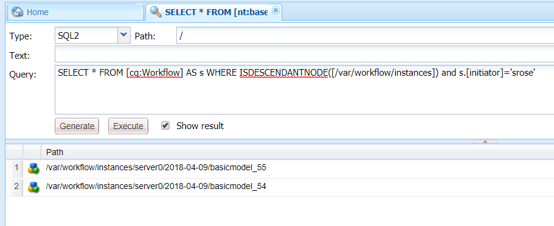

# OSGi上的表單導向工作流程|處理使用者資料 {#forms-centric-workflows-on-osgi-handling-user-data}

以表單為中心的AEM工作流程可讓您自動化以表單為中心的實際業務流程。 工作流由一系列步驟組成，這些步驟按關聯工作流模型中指定的順序執行。 每個步驟都會執行特定動作，例如指派工作給使用者或傳送電子郵件訊息。 工作流程可與儲存庫、使用者帳戶和服務中的資產互動。 因此，工作流程可協調涉及Experience Manager任何方面的複雜活動。

您可透過下列任何方法來觸發或啟動以表單為中心的工作流程：

* 從AEM收件匣提交應用程式
* 從AEM Forms應用程式送出應用程式
* 提交最適化表單
* 使用監視的資料夾
* 提交互動式通訊或信函

如需以Forms為中心的AEM工作流程和功能的詳細資訊，請參閱 [OSGi上的Forms導向工作流程](/help/forms/using/aem-forms-workflow.md)。

## 使用者資料與資料儲存 {#user-data-and-data-stores}

觸發工作流程時，會自動產生工作流程例項的裝載。 每個工作流程例項都會指派一個唯一例項ID和一個關聯的裝載ID。 裝載包含與工作流實例相關聯的用戶和表單資料的儲存庫位置。 此外，工作流程例項的草稿和歷史資料也會儲存在AEM儲存庫中。

工作流實例的裝載、草稿和歷史記錄所在的預設儲存庫位置如下：

>[!NOTE]
>
>您可以設定不同的位置，以在建立工作流程或應用程式時儲存裝載、草稿和歷史資料。 要標識工作流或應用程式儲存資料的位置，請查看工作流。

<table>
 <tbody>
  <tr>
   <td> </td>
   <td>AEM 6.4 Forms</td>
   <td>AEM 6.3 Forms</td>
  </tr>
  <tr>
   <td><strong>工作流程   例項</strong></td>
   <td>/var/workflow/instances/[server_id]/&lt;date&gt;/[workflow-instance]/</td>
   <td>/etc/workflow/instances/[server_id]/[date]/[workflow-instance]/</td>
  </tr>
  <tr>
   <td><strong>裝載</strong></td>
   <td>/var/fd/dashboard/payload/[server_id]/[date]/  [payload-id]/</td>
   <td>/etc/fd/dashboard/payload/[server_id]/[date]/  [payload-id]/</td>
  </tr>
  <tr>
   <td><strong>草稿</strong></td>
   <td>/var/fd/dashboard/instances/[server_id]/  [date]/[workflow-instance]/draft/[workitem]/</td>
   <td>/etc/fd/dashboard/instances/[server_id]/  [date]/[workflow-instance]/draft/[workitem]/</td>
  </tr>
  <tr>
   <td><strong>歷史</strong></td>
   <td>/var/fd/dashboard/instances/[server_id]/  [date]/[workflow_instance]/history/</td>
   <td>/etc/fd/dashboard/instances/[server_id]/  [date]/[workflow_instance]/history/</td>
  </tr>
 </tbody>
</table>

## 存取和刪除使用者資料 {#access-and-delete-user-data}

您可以從儲存庫中的工作流實例訪問和刪除用戶資料。 若要達成此目的，您必須知道與使用者相關聯之工作流程例項的例項ID。 您可以使用啟動工作流實例的用戶或工作流實例的當前受託人的用戶名查找工作流實例的實例ID。

但是，在以下情況下，在標識與啟動器關聯的工作流時，您不能標識或結果可能不明確：

* **透過受監視資料夾觸發的工作流程**:如果工作流是由受監視的資料夾觸發，則無法使用其啟動器來標識工作流實例。 在這種情況下，用戶資訊被編碼在儲存的資料中。
* **從發佈AEM例項開始的工作流程**:從AEM發佈例項提交最適化表單、互動式通訊或信件時，所有工作流程例項都是使用服務使用者來建立。 在這些情況下，已登入使用者的使用者名稱不會擷取到工作流程例項資料中。

### 存取使用者資料 {#access}

要標識和訪問為工作流實例儲存的用戶資料，請執行以下步驟：

1. 在AEM作者例項上，前往並導 `https://[server]:[port]/crx/de` 覽至「工 **[!UICONTROL 具>查詢」]**。

   從「 **[!UICONTROL 類型]** 」下拉 **[!UICONTROL 式清單中選]** 擇「SQL2」。

1. 根據可用資訊，執行以下查詢之一：

   * 如果已知工作流啟動器，請執行以下操作：
   `SELECT &ast; FROM [cq:Workflow] AS s WHERE ISDESCENDANTNODE([path-to-workflow-instances]) and s.[initiator]='*initiator-ID*'`

   * 如果您尋找其資料的使用者是目前的工作流程受託人，請執行下列動作：
   `SELECT &ast; FROM [cq:WorkItem] AS s WHERE ISDESCENDANTNODE([path-to-workflow-instances]) and s.[assignee]='*assignee-id*'`

   查詢返回指定工作流啟動器或當前工作流受託人的所有工作流實例的位置。

   例如，以下查詢從工作流啟動器所在的節點返回兩個 `/var/workflow/instances` 工作流實例路徑 `srose`。

   

1. 轉至查詢返回的工作流實例路徑。 status屬性顯示工作流實例的當前狀態。

   

1. 在工作流實例節點中，導航至 `data/payload/`。 屬 `path` 性儲存工作流實例的裝載路徑。 您可以導覽至路徑，以存取儲存在裝載中的資料。

   

1. 導覽至工作流程例項的草稿和步驟記錄位置。

   例如：

   `/var/fd/dashboard/instances/server0/2018-04-09/_var_workflow_instances_server0_2018-04-09_basicmodel_54/draft/`

   `/var/fd/dashboard/instances/server0/2018-04-09/_var_workflow_instances_server0_2018-04-09_basicmodel_54/history/`

1. 對步驟2中查詢返回的所有工作流實例重複步驟3 - 5。

>[!NOTE]
>
>AEM Forms應用程式也會以離線模式儲存資料。 工作流程例項的資料可能會儲存在個別裝置上，當應用程式與伺服器同步時，就會送出至Forms伺服器。

### 刪除使用者資料 {#delete-user-data}

您必須是AEM管理員，才能執行下列步驟，從工作流程例項刪除使用者資料：

1. 請依照存取使用 [者資料中的指示](/help/forms/using/forms-workflow-osgi-handling-user-data.md#access) ，並注意下列事項：

   * 與用戶關聯的工作流實例的路徑
   * 工作流實例的狀態
   * 工作流實例的負載路徑
   * 工作流程例項的草稿和步驟記錄路徑

1. 對於「運行」、「暫停」或 **「過時**」狀態的工作流實例，執 **行此**&#x200B;步驟 **** :

   1. 前往並 `https://[server]:[port]/aem/start.html` 使用管理員認證登入。
   1. 導覽至「工 **[!UICONTROL 具>工作流程>例項」]**。
   1. 為用戶選擇相關的工作流實例，並點選「終 **[!UICONTROL 止]** 」以終止運行實例。
   有關使用工作流實例的詳細資訊，請參閱管 [理工作流實例](/help/sites-administering/workflows-administering.md)。

1. 前往CRXDE Lite主控台，導覽至工作流程例項的裝載路徑，並刪除節 `payload` 點。
1. 導覽至工作流程例項的草稿路徑，並刪除節 `draft` 點。
1. 導覽至工作流程例項的歷史路徑，並刪除節 `history` 點。
1. 導覽至工作流實例的工作流實例路徑，並刪除 `[workflow-instance-ID]` 工作流的節點。

   >[!NOTE]
   >
   >刪除工作流實例節點將刪除所有工作流參與者的工作流實例。

1. 對為用戶標識的所有工作流實例重複步驟2 - 6。
1. 從AEM Forms應用程式的工作流程參與者外框識別並刪除離線草稿和提交資料，以避免提交至伺服器。

您也可以使用API來存取和移除節點和屬性。 如需詳細資訊，請參閱下列檔案。

* [如何以程式設計方式存取AEM JCR](/help/sites-developing/access-jcr.md)
* [刪除節點和屬性](https://docs.adobe.com/docs/en/spec/jcr/2.0/10_Writing.html#10.9%20Removing%20Nodes%20and%20Properties)
* [API參考](https://helpx.adobe.com/experience-manager/6-3/sites-developing/reference-materials/javadoc/overview-summary.html)

