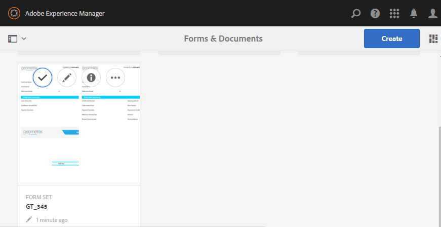

# AEM Forms中設定的表單{#form-set-in-aem-forms}

## 概覽 {#overview}

您的客戶通常必須提交多份表單才能申請服務或權益。 它涉及尋找所有相關表格；以及個別填寫、提交和追蹤。 此外，他們必須在各表單間多次填寫一般詳細資訊。 如果整個程式涉及大量表格，則會變得麻煩且容易出錯。 AEM Forms的表單集功能可協助簡化此類案例的使用者體驗。

表單集是HTML5表單的集合，分組在一起，並以單一表單集的形式呈現給使用者。 當使用者開始填寫表格集時，可順暢地從一個表格轉換到另一個表格。 最後，只要按一下，他們就能提交所有表格。

AEM Forms為表單作者提供直覺式的使用者介面，以建立、設定和管理表單集。 身為作者，您可以依您希望使用者遵循的特定順序來訂購表單。 此外，您也可以針對個別表單套用條件或資格陳述式，以根據使用者的輸入來控制其可見度。 例如，您可以設定配偶詳細資訊表格，使其只在婚姻狀態指定為「已婚」時顯示。

此外，您也可以設定不同表單中的常用欄位，以共用常用的資料系結。 在適當的資料系結就位後，一般使用者只需在後續表單中自動填入常用資訊時，才能填入。

AEM Forms應用程式也支援表單集，讓您的現場員工離線建立表單集、造訪客戶、輸入資料，並稍後與AEM Forms伺服器同步化，以將表單資料提交至商業程式。

## 建立和管理表單集 {#creating-and-managing-form-set}

可以將使用設計器建立的多個XDP或表單模板關聯到一個表單集中。 然後，可以使用表單集，根據用戶在初始表單中輸入的值及其配置檔案來選擇性地渲染XDP。

使用 [AEM Forms使用者介面](../../forms/using/introduction-managing-forms.md) ，管理您的所有表單、表單集和相關資產。

### 建立表單集 {#create-a-form-set}

要建立表單集，請執行以下操作：

1. 選擇「表單」>「表單與檔案」。
1. 選擇「建立」>「表單集」。

1. 在「添加屬性」頁中，添加以下詳細資訊，然後按一下「下一步」。

   * 標題：指定文檔的標題。 標題可協助您識別AEM Forms使用者介面中設定的表單。
   * 說明：指定有關文檔的詳細資訊。
   * 標籤：指定標籤以唯一識別表單集。 標籤可協助搜尋表單集。 若要建立標籤，請在「標籤」方塊中輸入新的標籤名稱。
   * 提交URL:指定針對單機轉譯表單集（「非AEM Forms應用程式使用案例」）的情況，張貼已提交資料的URL。 資料會以多部件／表單資料的形式提交至此端點，請求參數如下：
   * dataXML:此參數包含已提交表單集資料的XML表示法。 如果表單集中的所有表單都使用公共模式，則會根據該模式生成XML。 否則，XML根標籤會為表單集中每個填充的表單包含一個子標籤，該表單集包含表單附件的資料。
   * formsetPath:CRXDE中已提交的表單集的路徑。
   * HTML Render Profile:您可以設定某些選項，例如浮動欄位、附件和草稿支援（適用於單機版表單集轉譯），以自訂表單集的外觀、行為和互動。 您可以自訂或擴充現有的描述檔，以變更任何HTML表單描述檔設定。
   

1. 「選擇表單」螢幕顯示可用的XDP表單或XDP檔案。 搜尋並選取要包含在表單集中的表單，然後按一下「新增至表單集」。 如有必要，請再次搜尋要新增的表格。 將所有表單新增至表單集後，按一下「下一步」。

   >[!NOTE]
   >
   >請確定XDP表單中的欄位名稱不包含點字元。 否則，任何嘗試解析具有點字元的欄位的指令碼都無法解析它們。

1. 在「設定表單」頁面中，您可以執行下列動作：

   * 表單順序：拖放表格以重新排序。 表單順序定義在AEM Forms應用程式和獨立轉譯中向使用者顯示表單的順序。
   * 表單識別碼：為要用於資格運算式的表單指定唯一識別。
   * 資料根：對於表單集中的每個表單，作者可以配置XPATH，該特定表單的資料位於提交的XML中。 依預設，值為/。 如果表單集中的所有表單都綁定了模式，並且共用相同的XML模式，則可以更改此值。 建議每個表單欄位在XDP中指定適當的資料系結。 如果兩個不同表單中的兩個欄位共用共同的資料系結，則第二個表單中的欄位會顯示第一個表單的預先填寫值。 請勿將具有相同內部內容的兩個子表單系結至相同的XML節點。 如需表單集的XML結構詳細資訊，請參閱「 [為表單集預填XML」](../../forms/using/formset-in-aem-forms.md#p-prefill-xml-for-form-set-p)。
   * 資格表達：指定評估布爾值並指出表單集中的表單是否符合填寫條件的JavaScript運算式。 如果為false，則不會要求使用者填寫或甚至顯示要填寫的表格。 通常，表達式基於在此表單之前捕獲的欄位的值。 運算式也包含對表單集API fs.valueOf的呼叫，以擷取使用者在表單集的欄位中填入的值：
   *fs.valueOf（&lt;表單識別碼>, &lt;fieldSom運算式>）> &lt;value>*

   例如，如果表單集中有兩個表單：商務費用和差旅費用，您可以在這兩個表單的「資格運算式」欄位中新增JavaScript程式碼片段，以檢查使用者在表單中是否輸入費用類型。 如果用戶選擇「業務費用」，則「業務費用」表單將提供給最終用戶。 或者，如果使用者選擇旅行費用，則會向使用者提供不同的表單。 如需詳細資訊，請參閱資格運算式。

   此外，作者也可以選擇使用每列右角出現的「刪除」圖示，從表單集移除表單，或使用工具列中的「**+**」圖示新增其他表單集。 此「**+**」圖示會將使用者導向回精靈中用於「選取表單」的上一個步驟。 現有選擇將保持不變，而且必須使用該頁上的「添加到表單集」表徵圖將所做的任何其他選擇添加到表單集。

   

   >[!NOTE]
   >
   >在表單集中使用的所有表單都由AEM Forms使用者介面管理。

### 管理表單集 {#managing-a-form-set}

建立表單集後，您可以對該表單集執行以下操作：

* 按一下：當在主要資產頁面上建立並列出表單集時，您可以按一下表單集以檢視它。 表單集隨即開啟，並顯示該表單集中的所有表單範本(XDP)。
* 編輯：在選取表單集後按一下「編輯」時，「建立表單集的步驟」中顯示的「設定表單」畫面隨即開啟。 您可以執行此處所述的所有功能。
* 複製+貼上：這可讓您從一個位置複製整個表格集，並將它貼到同一個位置或任何其他位置或資料夾。
* 下載：您可以下載具有其所有相關性的表單集。
* 開始／管理審核：建立表單集後，可以按一下「開始審閱」(Start Review)來設定其審閱。 表單集的審核啟動後，「管理審核」選項就會顯示給使用者。 在「管理審閱」畫面上，您可以更新／結束審閱。 對於您新增的審核，您可以檢查審核並視需要新增注釋。
* 刪除：刪除完整的表單集。 已刪除表單集中的表單仍保留在儲存庫中。
* 發佈／取消發佈：此系統會發佈／取消發佈表單集，以及其包含的所有表單以及這些表單的相關資產。
* 預覽：預覽提供兩個選項：以HTML格式預覽（不含資料），並使用範例資料自訂預覽。
* 檢視／編輯屬性：您可以檢視／編輯所選表單集的中繼資料屬性。



### 編輯表單集 {#edit-a-form-set}

要編輯表單集，請執行以下操作：

1. 選擇「表單」>「表單與檔案」。
1. 找出您要編輯的表單集。 將滑鼠指標暫留在畫面上，並選取「編輯( )」。
1. 在「設定表單」頁面中，您可以編輯下列項目：

   * 表單順序
   * 表單識別碼
   * 資料根
   * 資格表達
   您也可以按一下相關的「刪除」圖示，從表單集中刪除表單。

## 流程管理中的表單集 {#form-set-in-process-management}

使用AEM Forms Management使用者介面建立表單集後，您就可以使用「起點」或「使用工作台指派工作」活動中的表單集。

### 在任務或起點中使用表單集 {#using-form-set-in-task-or-start-point}

1. 在設計流程時，在「指派任務／起點」的「演示和資料」部分下，選擇 **使用CRX資產**。 出現「CRX Asset（CRX資產）」瀏覽器。

   

1. 選取表單集以篩選AEM存放庫(CRX)中的表單集。

   

1. 選擇表單集並按一下確定。

## 資格表達式 {#eligibility-expressions}

表單集中的資格表達式用於定義和動態控制向用戶顯示的表單。 例如，只有當使用者屬於特定年齡組時才顯示特定表格。 使用表單管理員指定和編輯資格運算式。

資格運算式可以是任何傳回布林值的有效JavaScript陳述式。 JavaScript程式碼片段中的最後一個陳述式會視為布林值，根據JavaScript程式碼片段的其餘（前一行）處理來判斷表單的資格。 如果運算式的值為true，表單就符合顯示給使用者的資格。 這類表單稱為合格表單。

>[!NOTE]
>
>不會執行表單集中第一個表單的資格運算式。 不論其資格表達式為何，都一律顯示第一個表格。

除了標準JavaScript函式外，表單集還公開fs.valueOf API，該API可讓您存取表單集中表單欄位的值。 使用此API存取表單集中的表單欄位值。 API語法為fs.valueOf(formUid, fieldSOM)，其中：

* formUid（字串）:表單集中表單的唯一ID。 您可以在表單管理員使用者介面中建立表單集時指定它。 依預設，它是表單名稱。
* fieldSOM（字串）:formUid所指定格式的欄位的SOM表達式。 SOM運算式或指令碼物件模型運算式可用來參考特定檔案物件模型(DOM)中的值、屬性和方法。 在選擇欄位時，可以在表單設計器的「指令碼」頁籤下查看它。

>[!NOTE]
>
>formUid和fieldSOM參數都必須是字串常值。

### 範例 {#examples}

API的有效使用：

`fs.valueOf("form1", "xfa.form.form1.subform1.field1")`

API的使用無效：

```
var formUid = "form1";
 var fieldSOM = “xfa.form.form1.subform1.field1"; fs.valueOf(formUid, fieldSOM);
```

## 預先填寫表格集的XML {#prefill-xml-for-form-set}

表單集是多個HTML5表單的集合，這些表單具有共同或不同的結構。 表單集支援使用XML檔案預先填入表單欄位。 您可以將XML檔案與表單集關聯，這樣當您在表單集中開啟表單時，表單中的某些欄位將得到預置。

預填充XML檔案是使用表單集的URL的dataRef參數指定的。 dataRef參數指定與表單集合的資料XML檔案的絕對路徑。

例如，您有3種表單（form1、form2和form3），在表單集中有下列結構：

form1

fieldform1field

form2

fieldform2field

form3

fieldform3field

每個表單都有一個公用的命名欄位，名為&quot;field&quot;，一個唯一命名的欄位，名為&quot;form&lt;i>field&quot;。

您可以使用具有下列結構的XML來預先填寫此表格集：

```xml
<?xml version="1.0" encoding="UTF-8" ?>
<formSetRootTag>
 <field>common field value</field>
 <form1field>value1</form1field>
 <form2field>value2</form2field>
 <form3field>value3</form3field>
</formSetRootTag>
```

>[!NOTE]
>
>XML根標籤可以有任何名稱，但與欄位對應的元素標籤必須與欄位具有相同的名稱。 XML的階層必須模擬表單的階層，這表示XML必須有對應的標籤來封裝子表單。

上述XML程式碼片段顯示，表單集的預先填入XML是個別表單的預先填入XML程式碼片段的結合。 如果不同表單中的某些欄位具有彼此相似的資料層次／架構，則這些欄位會預先填入相同的值。 在此範例中，所有三個表格都預先填入相同值的公用欄位&quot;field&quot;。 這是將資料從一種形式傳遞至另一種形式的簡單方式。 您也可以將欄位系結至相同的架構或資料參考，以達成此目的。 如果您想根據表單的架構來分隔表單集資料。 在建立表單集時，可指定表單的「資料根」屬性（預設值為「/」，會對應至表單集根標籤），以達成此目的。

在上例中，如果您指定資料根：&quot;/form1&quot;、&quot;/form2&quot;和&quot;/form3&quot;分別用於這三種表單，您需要使用下列結構的預填XML:

```xml
<?xml version="1.0" encoding="UTF-8" ?>
<formSetRootTag>
 <form1>
  <field>field value1</field>
  <form1field>value1</form1field>
 </form1>
 <form2>
  <field>field value2</field>
  <form2field>value2</form2field>
 </form2>
 <form3>
  <field>field value3</field>
  <form3field>value3</form3field>
 </form3>
</formSetRootTag>
```

在表單集中，XML使用以下語法定義了XML架構：

```xml
<formset>
 <fs_data>
  <xdp:xdp xmlns:xdp="https://ns.adobe.com/xdp/">
  <xfa:datasets xmlns:xfa="https://www.xfa.org/schema/xfa-data/1.0/">
   <xfa:data>
   <rootElement>
    ... data ....
   </rootElement>
   </xfa:data>
  </xfa:datasets>
  </xdp:xdp>
 </fs_data>
 <fs_draft>
  ... private data...
 </fs_draft>
</formset>
```

>[!NOTE]
>
>如果有兩個表單具有重疊的資料根，或者一個表單的元素層次與另一個表單的資料根層次重疊，則在預填充xml中合併重疊的元素的值。 提交XML的結構與預填充XML類似，但提交XML的包裝函式標籤較多，而表格集上下文資料標籤會附加在結尾處。

### 預先填寫XML元素說明 {#prefill-xml-elements-description}

用於建立預填充XML檔案的語法規則：

* 父元素：元素，可以是其父項，其中null表示元素可以位於XML的根。
* 基數：描述了元素在其父元素中可使用的次數。
* submitXML:指出在送出XML中元素是一律存在(P)或選用(O)。
* prefillXML:指出在預填充XML中是必需(R)還是可選(O)元素。
* 子項：指出哪些元素可以是其子項。

### FORMSET {#formset}

`parent elements:`

`null`

`cardinality: [0,1]`

`submitXML: P`

`prefillXML: O`

`children: fs_data`

表單的根元素集XML。 建議不要將此單字用作表單集中任何表單的rootSubform的名稱。

### FS_DATA {#fs-data}

`parent elements:`

`formset`

基數： [1]

submitXML:P

prefillXML:O

`children: xdp:xdp/rootElement`

子樹指示表單集中的表單資料。 只有在表單集元素不存在時，元素才會在預先填入XML中為選用

### XDP:XDP {#xdp-xdp}

`parent elements: fs_data/null`

`cardinality: [0,1]`

`submitXML: O`

`prefillXML: O`

`children: xfa:datasets`

此標籤表示HTML5表單XML的開始。 如果提交XML存在於預填充XML中，或沒有預填充XML，則會將其添加到提交XML中。 此標籤可從預填充XML中移除。

### XFA：資料集 {#xfa-datasets}

`parent elements: xdp:xdp`

`cardinality: [1]`

`submitXML: O`

`prefillXML: O`

`children: xfa:data`

### XFA：資料 {#xfa-data}

`parent elements: xfa:datasets`

`cardinality: [1]`

`submitXML: O`

`prefillXML: O`

`children: rootElement`

### ROOTELEMENT {#rootelement}

`parent elements: xfa:datasets/fs_data/null`

`cardinality: [0,1]`

`submitXML: P`

`prefillXML: O`

`children: controlled by the Forms in Form set`

名稱rootElement只是預留位置。 實際名稱是從表單集中使用的表單中選擇。 以rootElement開頭的子樹包含表單集中表單內部的欄位和子表單的資料。 有多種因素會決定rootElement及其子項的結構。

在預先填入XML時，此標籤是選用的，但如果遺失，則會忽略整個XML。

根元素標籤的名稱

如果預填充XML中有根元素，則該元素的名稱也會取入提交XML中。 如果沒有預填充xml，則rootElement的名稱是表單集中第一個表單的根子表單的名稱，該表單集的dataRoot屬性設定為&quot;/&quot;。 如果沒有此類表單，則rootElement名稱為 **fs_dummy_root**，此為保留關鍵字。

## AEM Forms應用程式中設定的表格 {#formset-in-workspace-app}

AEM Forms應用程式可讓現場工作者將行動裝置與AEM Forms伺服器同步化，並處理其工作。 即使在裝置離線時，應用程式仍可在裝置上儲存本機資料。 使用照片等注釋功能，現場工作人員可以提供精確的資訊以整合到業務流程中。

<!-- Update link as it is a 404 - For more information on AEM Forms app, see [AEM Forms app overview](/help/forms/using/mobile-workspace-overview.md).-->

## 已知限制——表單集中未完全支援模式 {#known-limitations-patterns-not-fully-supported-in-form-set}

表單集不完全支援下列資料模式：

<table>
 <tbody>
  <tr>
   <td><strong>表單集中未完全支援模式</strong></td>
   <td><strong>範例</strong></td>
  </tr>
  <tr>
   <td>輸入大小和圖樣大小不符</td>
   <td><p>當pattern= num{z,zzz}</p> <p>輸入=</p> <p>12,345或</p> <p>1,23</p> </td>
  </tr>
  <tr>
   <td>帶括弧"(" ")"的圖片子句模式</td>
   <td>num{(zz,zzz)}</td>
  </tr>
  <tr>
   <td>多種資料模式</td>
   <td>num{zz,zzz}| num{z,zzz,zzz}</td>
  </tr>
  <tr>
   <td>速記模式 </td>
   <td><p>num.integer{},</p> <p>num.decimal{},</p> <p>num.%{}或</p> <p>num.currency{}</p> </td>
  </tr>
 </tbody>
</table>

