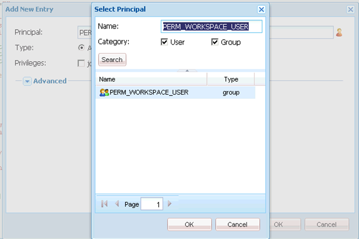

# AEM Forms工作區自訂的一般步驟 {#generic-steps-for-aem-forms-workspace-customization}

執行任何自訂的一般步驟為：

1. 透過存取登入CRXDE Lite `https://'[server]:[port]'/lc/crx/de/index.jsp`.
1. 建立 `sling:Folder` 已命名的資料夾 `ws` 在 `/apps`，如果它不存在。 若要建立 `sling:Folder` 資料夾，用滑鼠右鍵按一下 `apps` 資料夾並選取 **[!UICONTROL 建立]** > **[!UICONTROL 建立節點]**. 將名稱指定為 `ws`，選擇型別 `sling:Folder`，然後按一下 **[!UICONTROL 確定]**. 按一下&#x200B;**[!UICONTROL 「儲存全部」]**。
1. 瀏覽至 `/apps/ws`，並導覽至 **[!UICONTROL 存取控制]** 標籤。
1. 選取 **[!UICONTROL 存放庫]** 選項。 在 **[!UICONTROL 存取控制]** 清單，按一下 **[!UICONTROL +]** 以新增專案。 按一下 **[!UICONTROL +]** 再來一次。
1. 搜尋並選取 **PERM_WORKSPACE_USER** 主體。

   

1. 授予 `jcr:read` 主體許可權。
1. 按一下&#x200B;**[!UICONTROL 「儲存全部」]**。
1. 複製 `GET.jsp`， `index`、和 `html.jsp` 檔案來自 `/libs/ws` 資料夾至 `/apps/ws` 資料夾。
1. 複製 `/libs/ws/locales` 中的資料夾 `/apps/ws` 資料夾。 按一下&#x200B;**[!UICONTROL 「儲存全部」]**。
1. 更新中的參照和相對路徑 `GET.jsp` 檔案，如下所示，然後按一下 **[!UICONTROL 全部儲存]**.

   ```javascript
   <meta http-equiv="refresh" content="0;URL='/lc/apps/ws/index.html'" />
   ```

1. 請對CSS自訂執行下列動作：

   1. 導覽至 `/apps/ws` 資料夾並建立資料夾： `css`.

   1. 在 `css` 資料夾，建立名為的檔案 `newStyle.css`.

   1. 開啟 `/apps/ws/html`.jsp和變更自

   ```javascript
   <link lang="en" rel="stylesheet" type="text/css" href="css/style.css" />
   <link lang="en" rel="stylesheet" type="text/css" href="css/jquery-ui.css"/>
   ```

   至

   ```javascript
   <link lang="en" rel="stylesheet" type="text/css" href="../../libs/ws/css/style.css" />
   <link lang="en" rel="stylesheet" type="text/css" href="css/newStyle.css" />
   <link lang="en" rel="stylesheet" type="text/css" href="../../libs/ws/css/jquery-ui.css"/>
   ```

   >[!NOTE]
   >
   >將使用者定義的CSS檔案專案放在style.css專案之後，如上所示。

1. 在/apps/ws/html.jsp檔案中，從

   ```jsp
   <script data-main="js/main" src="js/libs/require/require.js"></script>
   ```

   至

   ```jsp
   <script data-main="js/main" src="../../libs/ws/js/libs/require/require.js"></script>
   ```

1. 請執行下列動作：

   1. 建立名為的資料夾 `js` 在 `/apps/ws`. 按一下&#x200B;**[!UICONTROL 「儲存全部」]**。

   1. 建立名為的資料夾 `libs` 在 `/apps/ws/js`. 按一下&#x200B;**[!UICONTROL 「儲存全部」]**。

   1. 複製 `/libs/ws/js/libs/jqueryui` 資料夾至 `/apps/ws/js/libs`. 按一下&#x200B;**[!UICONTROL 「儲存全部」]**。

1. 請針對HTML自訂執行以下動作：

   1. 在 `/apps/ws/js`，建立名為的資料夾 `runtime`. 按一下&#x200B;**[!UICONTROL 「儲存全部」]**。

   1. 在 `/apps/ws/js/runtime`，建立名為的資料夾 `templates`. 按一下&#x200B;**[!UICONTROL 「儲存全部」]**。

   1. 複製 `/libs/ws/js/main.js` 至 `/apps/ws/js/main.js`.

   1. 將/libs/ws/js/registry.js複製到 `/apps/ws/js/registry.js`.

1. 按一下 **[!UICONTROL 全部儲存]**，清除快取，然後重新整理AEM Forms工作區。

   存取URL `https://'[server]:[port]'/lc/ws` 並使用管理員/密碼認證登入。 瀏覽器會重新導向至 `https://'[server]:[port]'/lc/apps/ws/index.html`.
