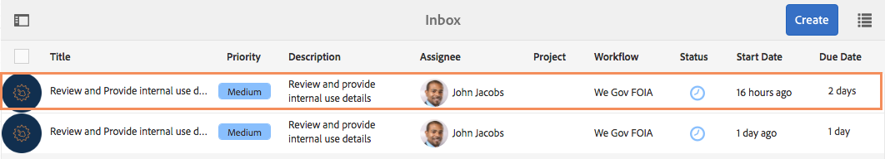

# We.Gov參考網站FOIA逐步介紹 {#we-gov-reference-site-foia-walkthrough}

## 先決條件 {#pre-requisite}

依照「設定和設定AEM Forms參考網站」中所述，設 [定您的We.Gov參考網站](/help/forms/using/setup-reference-sites.md)。

## 參考網站資訊自由法案案例 {#reference-site-freedom-of-information-act-scenario}

We.Gov是一個州管理組織，允許養父母在收養孩子時註冊子女撫養費。 We.Gov還允許家長根據資訊自由法案向下列政府部門索取資訊：

* 國防後勤局
* 國防部監察長辦公室
* 司法部——資訊政策廳
* 海軍部
* 環保署

如需資訊自由法的詳細資訊，請參閱www.foia.gov 。

此情形包含下列角色：

* 莎拉·羅絲，那個在
* 約翰·雅各布斯，負責將請求轉發給相應部門的人
* Gloria Rios，根據要求提供資訊的政府員工

## Sarah根據FOIA發起資訊請求 {#sarah-initiates-request-for-information-under-foia}

根據《資訊自由法》,Sarah要求複製2013至2016年兒童與家庭管理局的案件記錄。 Sarah將此要求提交給司法部——資訊政策辦公室，並表示她願意支付最多100美元的印刷和郵資費用。

### 運作方式 {#how-it-works}

### 親眼看看 {#see-it-yourself}

在您的瀏覽器中，開啟 `https://<hostname>:<PublishPort>/wegov`。 在We.Gov網站中，點選「應用程式>所有應用程式」。 在「所有應用程式」頁面中，點選「FOIA請求的應用程式」下方的「套用」。

## Sarah開始申請FOIA的資訊 {#sarah-starts-her-application-for-information-under-foia}

Sarah按一 **下「套用** 」，並在「資訊自由法案要求表單」頁面中，Sarah會輸入下列資訊：

* **** 代理商：Sarah將請求所在的機構指定為司法部——資訊政策辦公室。

* **將支付最多**:薩拉指出，她願意支付多達100美元的印刷和郵資費用。
* **詳細說明請求**:Sarah指出，「請求2013至2016財政年度兒童與家庭管理局案件記錄副本」。

請求復本2013至2016財政年度兒童和家庭管理局案件記錄

Sarah隨時都可以點選「儲存」以儲存表格草稿，稍後再回來填寫表格並送出。 莎拉提交表格。

>[!NOTE]
>
>從電子郵件繼續工作流程僅適用於已登入的使用者。 在參考網站藍本中，請確定已新增使用者Sarah Rose。 莎拉的登入憑證是 `srose/password`。

## John Jacobs接收並核准此應用程式 {#john-jacobs-receives-and-approves-the-application}

John Jacobs會收到這些要求，並將其路由給適當的人。 AEM Inbox可讓她在單一位置檢視所有提交的應用程式。

### 運作方式 {#how-it-works-1}

當Sarah填寫並提交FOIA應用程式時，會將應用程式記錄傳送至John Jacobs的收件匣。 John Jacobs可以檢視提交的申請並接受或拒絕。

### 親眼看看 {#see-it-yourself-1}

您可以存取https://&lt;***hostname***>:&lt;***PublishPort***>/content/we-finance/global/en/login.html?resource=/aem/inbox.html的AEM收件匣。 登入AEM收件匣，使用jjacobs/password做為John Jacobs的使用者名稱／密碼，並檢視FOIA應用程式。 如需有關將AEM Inbox用於表單導向工作流程工作的詳細資訊，請參閱「 [在AEM收件匣中管理表單應用程式和工作](/help/forms/using/manage-applications-inbox.md)」。

John Jacobs可從應用程式儀表板檢視、核准或拒絕應用程式。 John Jacobs會選擇並開啟請求詳細資訊，並在檢閱請求後核准。

### <strong>Sarah收到確認電子郵件</strong>{#strong-sarah-receives-an-acknowledgement-email-strong}

在John Jacobs核准申請後，Sarah會收到We.Gov網站的確認電子郵件。 Sarah會得知處理申請所需的費用和時間。 電子郵件中還包含電子郵件和電話詳細資訊，薩拉可以聯繫以獲取有關其應用程式的更新資訊。

## Gloria收到FOIA要求二級核准的要求 {#gloria-receives-the-foia-request-for-second-level-approval}

在John Jacobs填寫所需資訊並核准Sarah的要求後，這些要求會提交Gloria Rios以進行最終核准。 Gloria會檢閱隨附的記錄檔案，並核准要求。

### 運作方式 {#how-it-works-2}

當John Jacobs核准FOIA要求時，就會建立應用程式的PDF或記錄檔案並傳送至Gloria Rios的收件匣。 Gloria可以檢視已提交的請求，並核准或拒絕。

### 親自檢視 {#see-for-yourself}

您可以存取https://&lt;***hostname***>:&lt;***PublishPort***>/content/we-finance/global/en/login.html?resource=/aem/inbox.html的AEM收件匣。 使用grios/password作為Gloria Rios的使用者名稱／密碼登入AEM收件匣，並查看FOIS要求。

Gloria會開啟要求並檢查FOIA要求的詳細資訊。 在審查請求的詳細資訊並檢查提供所需文檔的可行性後，Gloria批准了該請求。

## Sarah收到通知，表示她的要求已獲得批准 {#sarah-receives-notification-that-her-request-is-approved}

Gloria核准FOIA要求後，Sarah會收到電子郵件通知她其要求已獲得核准。 電子郵件中還包含有關提供檔案的暫定時間表的資訊，以及要求後續行動的聯絡資訊。

