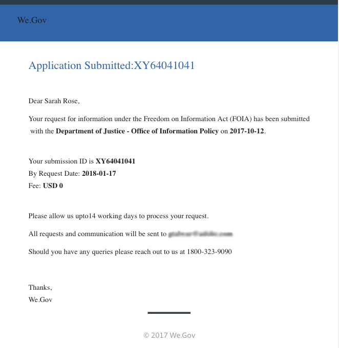
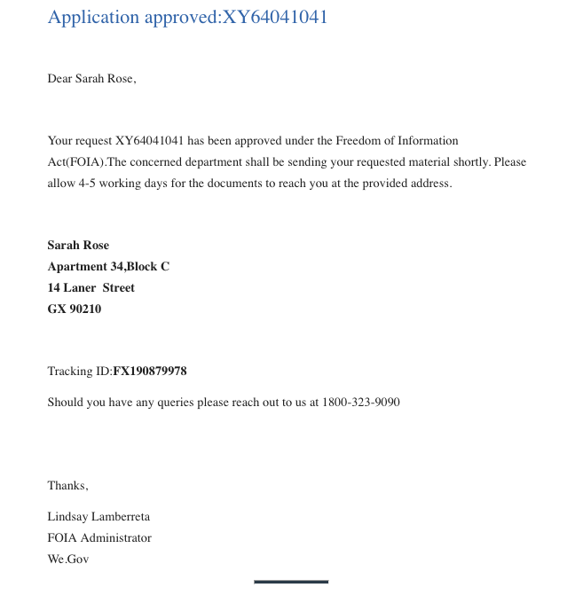

# We.Gov參考網站FOIA漫遊 {#we-gov-reference-site-foia-walkthrough}

## 參考站點資訊自由法案方案 {#reference-site-freedom-of-information-act-scenario}

We.Gov是一個州立組織，允許養父母在收養孩子時註冊兒童撫養費。 We.Gov還允許家長根據資訊自由法案向下列政府部門索取資訊：

* 國防後勤局
* 監察主任辦公室
* 司法部 — 資訊政策廳
* 海軍部
* 環保署

有關《資訊自由法》的詳細資訊，請參閱 [www.foia.gov](https://www.foia.gov)。

該方案涉及以下角色：

* 莎拉·羅絲，那個在
* 負責處理請求的人約翰·雅各布斯將請求轉發給相關部門
* Gloria Rios，根據請求提供資訊的政府僱員

## Sarah根據FOIA發起資訊請求 {#sarah-initiates-request-for-information-under-foia}

根據《資訊自由法》，Sarah要求複印2013至2016年兒童和家庭管理局多年案卷。 Sarah向司法部 — 資訊政策辦公室提交了這一請求，並表示她願意支付最多100美元的印刷和郵資費。

### 它的工作原理 {#how-it-works}

### 親眼看看 {#see-it-yourself}

在瀏覽器中，開啟 `https://<hostname>:<PublishPort>/wegov`。 在We.Gov站點中，按一下「應用程式」>「所有應用程式」。 在「所有應用程式」頁中，按一下「Application for FOIA Request」下的「Apply」。

## 莎拉開始申請FOIA的資訊 {#sarah-starts-her-application-for-information-under-foia}

莎拉點擊 **應用** 在「資訊自由法案請求表」頁面，Sarah輸入了以下資訊：

* **代理：** Sarah將請求所針對的機構指定為司法部 — 資訊政策辦公室。

* **將支付到**:Sarah說她願意支付高達100美元的印刷和郵資費用。
* **詳細描述請求**:Sarah指定了「請求複製2013至2016財政年度兒童和家庭管理局案例日誌」。

要求複印2013至2016財政年度兒童和家庭管理局案卷

Sarah可以隨時點擊「保存」以保存表單草稿，稍後回來填寫表單並提交。 莎拉提交了表格。

>[!NOTE]
>
>「從電子郵件開始的恢復」工作流僅與登錄的用戶一起使用。 在參考站點方案中，確保添加了用戶Sarah Rose。 莎拉的登錄憑據是 `srose/password`。

## 約翰·雅各布斯收到並批准該申請 {#john-jacobs-receives-and-approves-the-application}

約翰·雅各布斯接收請求，並將其發送給正確的人。 收AEM件箱可讓她在一個位置查看所有提交的應用程式。

### 它的工作原理 {#how-it-works-1}

當Sarah填寫並提交FOIA應用程式時，該應用程式的記錄會發送到John Jacobs的收件箱。 John Jacobs可以查看提交的申請並接受或拒絕。

### 親眼看看 {#see-it-yourself-1}

您可以訪問AEM收件箱https://&lt;***主機名***>:&lt;***發佈埠***>/content/we-finance/global/en/login.html?resource=/aem/inbox.html。 使用jjacobs/password作為John Jacobs的AEM用戶名/密碼登錄收件箱，並查看FOIA應用程式。 有關將收件箱用AEM於以表單為中心的工作流任務的資訊，請參閱 [在收件箱中管理Forms應用程式AEM和任務](/help/forms/using/manage-applications-inbox.md)。

John Jacobs可以查看、批准或拒絕應用程式儀表板。 約翰·雅各布斯選擇並開啟請求詳細資訊，並在審閱請求後批准。

### <strong>Sarah收到一封確認電子郵件</strong> {#strong-sarah-receives-an-acknowledgement-email-strong}

在約翰·雅各布斯批准該申請後，Sarah從We.Gov網站收到一封確認電子郵件。 Sarah被告知處理申請所需的費用和時間。 電子郵件還包括電子郵件和電話詳細資訊，sarah可以聯繫以獲取有關其應用程式的更新。

## Gloria收到FOIA要求二級批准的請求 {#gloria-receives-the-foia-request-for-second-level-approval}

約翰·雅各布斯填寫所需資訊並批准莎拉的請求後，這些請求將交給格洛麗亞·里奧斯，由後者最終批准。 Gloria審閱所附記錄文檔並批准該請求。

### 它的工作原理 {#how-it-works-2}

當John Jacobs批准FOIA請求時，將建立應用程式的PDF或記錄文檔，並將其發送到Gloria Rios的收件箱。 Gloria可以查看已提交的請求，並批准或拒絕它。

### 親自查看 {#see-for-yourself}

您可以訪問AEM收件箱https://&lt;***主機名***>:&lt;***發佈埠***>/content/we-finance/global/en/login.html?resource=/aem/inbox.html。 使用grios/password作為Gloria Rios的AEM用戶名/密碼登錄到收件箱，並查看FOIS請求。

Gloria開啟請求並檢查FOIA請求的詳細資訊。 在審查了請求的詳細資訊並檢查提供所需檔案的可行性後，Gloria批准了請求。

## Sarah收到通知，她的請求已獲批准 {#sarah-receives-notification-that-her-request-is-approved}

在Gloria批准FOIA請求後，Sarah收到一封電子郵件，通知她她的請求已被批准。 該電子郵件還包括關於提供文檔的暫定時間表的資訊，以及對請求採取後續行動的聯繫細節。

